## 前言

当第一次看到 Network Service Mesh 这一名词时，你很可能和我一样好奇它到底是什么？是否和 Service Mesh 有什么关系？Network Service Mesh 是云原生领域中一个新的热点，是 CNCF（云原生基金会）中的一个沙箱项目。本文将介绍 Network Service Mesh 的起源和架构，并探讨其与 Service Mesh、SDN、NFV 等相关技术的区别与联系。

## 正文云原生应用面临的网络问题

### Kubernetes 网络模型

Kubernetes 已经成为云原生应用编排（即应用程序资源分配、部署和运行管理）的事实标准，几乎所有的公有和私有云解决方案都提供了 Kuberetes 的管理服务。由于采用了微服务架构，因此云原生应用系统中存在大量服务间的东西向网络流量。为了满足集群内部应用之间的这些东西向流量需求，Kubernetes 采用了一个扁平的三层网络模型。该模型可以有多种实现方式，但所有这些实现都必须满足下面的基本要求：

* 每个 Pod 有一个独立的 IP 地址。
* 每个 Pod 可以和集群中任一个 Pod 直接进行通信（不经过 NAT）。

如果忽略掉底层的实现细节，从本质上来看 Kubernetes 网络模型，Kubernetes 网络如下图所示：

从上图中可以看到，一个 Kubernetes 集群中的所有 Pod 之间都可以通过一个”扁平“的三层网络相互访问，这里“扁平”的含义指的是从一个 Pod 的角度来看，它可以只通过三层路由访问集群中任何一个其他的 Pod，中间不需要经过 NAT，即在发送端和目的端看到的数据包的源地址和目的地址是一样的。

该“扁平”的三层网络是从 Pod 角度来说的，在实际部署时，这个 L3 网络的实现可以是 underlay 的，直接通过底层网络的物理设备进行路由；也可以采用 overlay 的隧道技术实现。

### Kubernetes 网络的局限性

Kubernetes 网络的目的是为了处理同一个集群中 Pod 之间的东西向流量，因此设计得非常简单清晰。对于普通的 IT 和企业应用场景，该模型已经完全够用。但对于电信、ISP 和一些高级的企业网络需求来说，Kubernetes 的网络存在下面的一些局限性：

* Kubernetes网络不能提供除了集群内三层可达之外的其他高级的L2/L3网络服务。
* Kubernetes 网络不能满足应用的动态网络需求，如需要临时将一个 Pod 连接到企业内网。
* Kubernetes网络缺乏对跨集群/跨云连通性的支持。

也不能说以上这些局限是 Kubernetes 网络的缺陷，因为 Kubernetes 设计的初衷是为企业/IT 的服务化应用提供一个云原生的部署和运行环境，而该网络模型已经很好地支撑了集群中部署的应用之间的东西向流量，达到了其设计目的。

电业行业也逐渐认识到云原生带来的好处，并开始将云原生的思想和技术如微服务、容器化等运用到电信领域中。但当试图将 Kubernetes 强大的容器编排能力运用到电信的 NFV（网络功能虚拟化）中时，发现 Kubernetes 的网络能力和其编派能力相比而言显得非常弱小。NFV 中涉及到很多复杂的 L2/L3 网络功能，而静态的，功能相对固定的 Kubernetes 网络则难以支撑 NFV 对网络的需求。对于 NFV 来说，Kubernetes 有限的网络能力成为了它的“阿琉克斯之踵”。

## Network Service Mesh 介绍

Network Service Mesh（NSM）是 CNCF 下的一个开源项目，为 Kubernetes 中部署的应用提供了一些高级 L2/L3 网络功能，补齐了 Kubernetes 对云原生应用网络支持的这一块短板。NSM 并没有对 Kubernetes 的 CNI 模型进行扩展或者修改，而是采用了一套与 CNI 完全独立的新机制来以实现这些高级的网络需求。除了 Kubernetes 之外，NSM 还支持虚拟机和服务器，是一个跨云平台的云原生网络解决方案。

### 什么是 Network Service？

首先我们来看一下 Network Service 的定义，在 Kubernetes 中有 Service 对象，用于对外提供某种服务，一般来说 Service 对外提供的是应用层的服务，例如 HTTP/GRPC 服务，这些服务又一起组成了一个大的系统对用户提供服务，例如淘宝，亚马逊等网上商店。NSM 参考了 Kubernetes 中 Service 的概念提出了 Network Service。Network Service 也是一种服务，和 Kubernetes Service 不同的是，Network Service对外提供的是L2/L3层的网络服务，即对数据包进行处理和转发，而不会终结数据包。Service和Network Service 的区别如下：

* Service：属于应用工作负载，对外提供的是应用层 (L7) 的服务，例如 web 服务。
* Network Service：属于网络功能，对外提供的是 L2/L3 层的服务，对数据包进行处理和转发，一般不会终结数据包。例如 Firewall，DPI，VPN Gateway 等。

下图描述了 Service 和 Network Service 之间的关系。

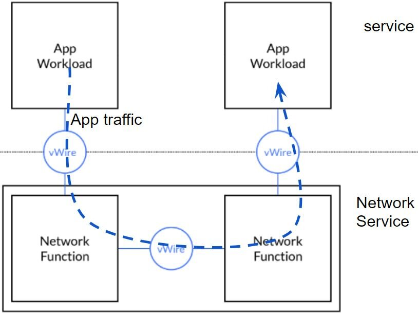

一个 Kubernetes Service 后端可以有多个服务实例来提供对外提供服务，Kubernetes 采用 Endpoint 对象来表示一个 Service 实例；和 Kubernetes Service 类似，一个 Network Service 也可以对应有多个实例，并根据需要进行水平伸缩，以满足不同的客户端处理压力，一个 Network Service 实例用 Network Service Endpoint 对象表示。

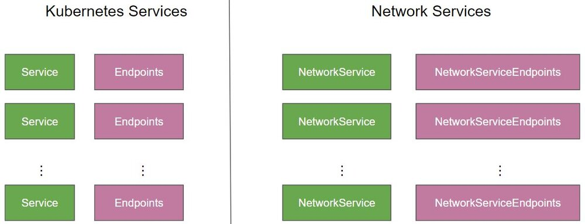

### Network Service Mesh 架构

Network Service Mesh 的架构如下图所示。

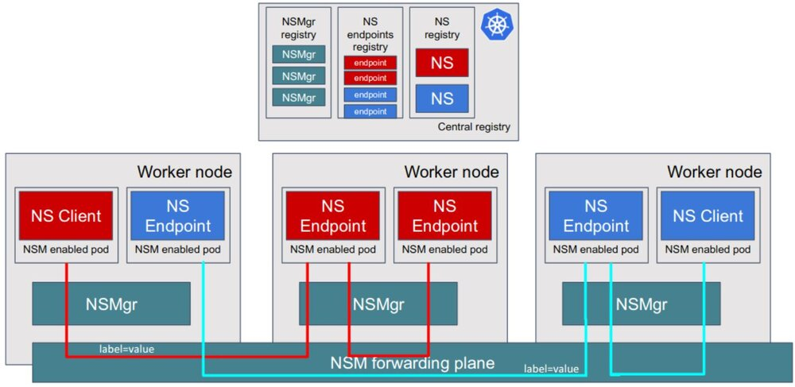

从图中可以看到，Network Service Mesh 主要包含了下面这些组件：

* Network Service Endpoint(NSE) ：对外提供网络服务，可以是容器，POD，虚拟机或者物理设备。NSE 接收来自一个或者多个 client 的请求，向 client 提供请求的网络服务。
* Network Service Client(NSC) ：使用 Network Service 的客户端。
* Network service registry(MSR)：NSM 中相关对象和组件的注册表，包含 NS 和 NSE、NSMgr 的实例信息。
* Network Service Manager (NSMgr) ：是 NSM 的控制组件，以 daemon set 形式部署在每个节点上，NSMgr 之间可以相互通信，形成了一个分布式控制面。NSMgr 会做两件事情：
  * 处理来自客户端的 Network Service 使用请求，为请求匹配符合要求的 Network Service Endpoint，并为客户端创建到 Network Service Endpoint 的虚拟链接。
  * 将其所在节点上的 NSE 注册到 NSR 上。
* Network Service Mesh Forwarder：提供客户端和 Network Service 之间的端到端链接的数据面组件，可以直接配置 linux 内核的转发规则，也可以是一个第三方的网络控制面，如 FD.io (VPP), OvS, Kernel Networking, SRIOV 等。

NSM 会在每个 Node 上部署一个 NSMgr，不同 Node 上 NSMgr 之间会进行通信和协商，为客户端选择符合要求的 NSE，并创建客户端和 NSE 之间的连接。这些相互通信的 NSMgr 类似于 Service Mesh 中的 Envoy Sidecar，也组成了一个连接 NSE 和 NSC 的网格，这就是 Network Service Mesh 这个项目名称的来源。

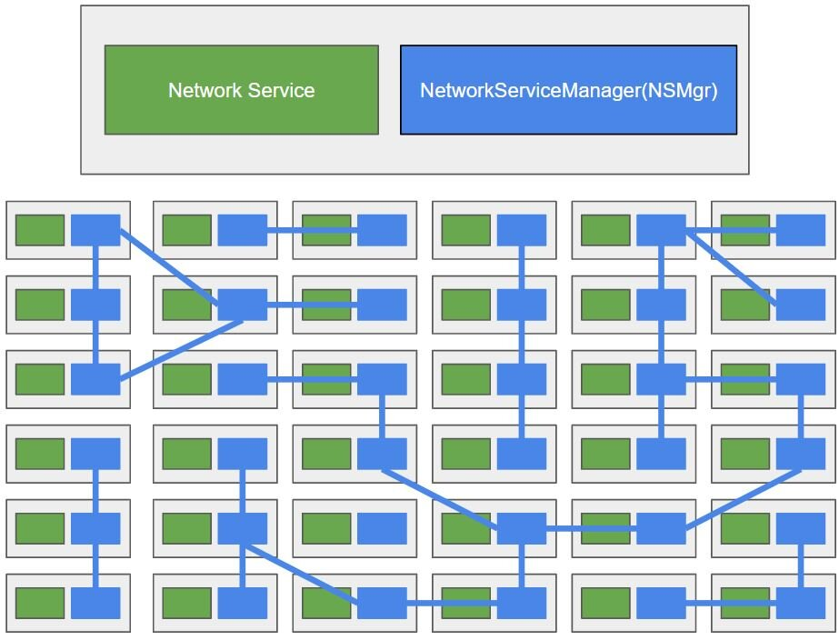

## Network Service Mesh 示例

下面我们通过一个例子来说明 NSM 的运行机制。设想这样一个场景，用户需要将 Pod 中的应用中通过 VPN 连接到公司内网上，以访问公司内网上的服务。

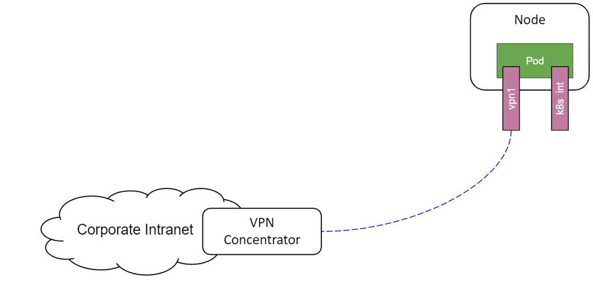

如果采用“传统”的方式，用户需要在应用程序中配置 VPN 网关的地址，到企业内网的子网路由，还需要部署和设置 VPN 网关。而在该场景中，客户端只是需要一个“连接到企业内网的 VPN”这样一个网络服务而已，完全没有必要将这些网络中的各种概念和细节暴露给用户。

NSM 提供了一种声明式的方式来为客户端提供该 VPN 服务，下图是 VPN 服务在 NSM 中的服务定义和客户端使用的声明方式。

* NSM 通过一个 NetworkService CRD 来创建 vpn-gateway 网络服务，在该网络服务的 spec 中声明其接受的负载为 IP 数据包，并通过 app:vpng 标签选择提供服务的 Pod 为 vpng-pod。

* 客户端通过 Ns.networkservicemesh.io 注解声明需要使用 vpn-gateway 网络服务。

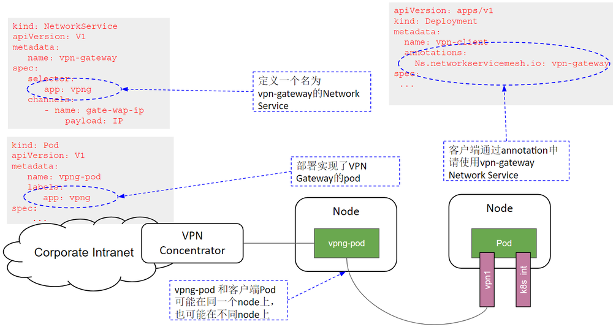

NSM 会通过 admission webhook 在使用网络服务的客户端 Pod 中注入一个 Init Container，由该 Container 来负责根据 yaml 注解来向 NSMgr 请求对应的网络服务，因此应用程序不需要关注网络服务的请求和连接创建过程。客户端与 VPN Gateway 网络服务建立连接的过程如下图所示：

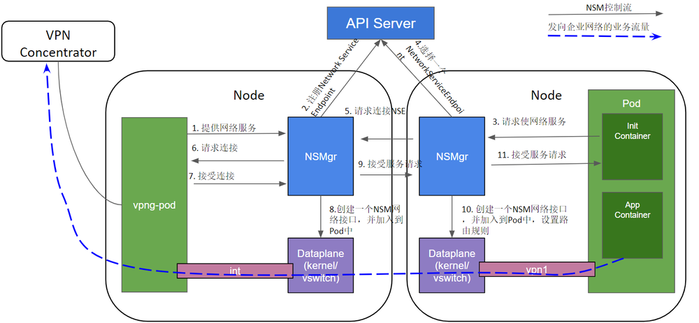

1. 启动 vpng-pod，对外提供 VPN Gateway 网络服务。
1. NSMgr 将 vpng-pod 作为 NSE 注册到 API Server（Service Registry）中。
1. 客户端应用 Pod 中的 NSM Init Container 根据 yaml 注解向同一 node 上的 NSMgr 发起使用网络服务的请求。
1. NSMgr 向 API Server（Service Registry）查询可用的 NSE。
1. NSE 可能位于和客户端相同的 node 上，也可能在不同的 node 上；如果在不同的 node 上，NSMgr 会和 NSE 所在 Node 上的 NSMgr 进行通信，转发请求。
1. NSMgr 向 NSE 请求连接
1. NSE 根据自己的业务逻辑进行判断，如果可以接受该客户端的服务请求，则接受该连接请求。
1. NSE 所在 Node 的 NSMgr 调用数据面组件创建一个网络接口，加入到 NES 的 Pod 中。
1. 如果 NSE 和 NSC 在不同的 Node 上，NSE 所在 Node 的 NSMgr 通知 NSC 所在 Node 的 NSMgr，接受该服务请求。
1. NSE 所在 Node 的 NSMgr 调用数据面组件创建一个网络接口，加入到应用 Pod 中，并进行相应的网络配置，例如设置到企业网络的子网路由。

NSM 的数据面组件在 NSE 和 NSC 的两个新创建的网络接口之间搭建了一条虚拟点对点链路，该链路可以看做这两个网络接口之间的一条虚拟网线，从一段进入的数据，会从另一端出来。链路有多种实现方式，如果 NSE 和 NSC 处于同一个节点上，这可能是一个 vpp memif 共享内存通道，如果在不同节点上，则可能是一个 VXLAN 隧道。

从通过 NSM 提供 VPN 服务的例子，可以看到 NSM 有这样一些优点：

* 简单
  * VPN 客户端只需通过 Yaml 声明使用 VPN-Gateway 服务。
  * 不需要手动配置 VPN 客户端到 VPN-Gateway 之间的连接、IP 地址、子网、路由，这些业务逻辑细节被 Network Service 的 Provider 和 NSM 框架处理，客户端无感知。
  * 和 Kubernetes 自身的网络机制是独立的，不影响 Kubernetes 自身的 CNI 网络模型。
* 灵活
  * 可以根据需求向 NSM 中添加新的 Network Service 类型，这些网络服务可以由第三方实现和提供。
  * 应用 Pod 可以通过 Yaml 配置需要使用的服务。
  * Network Service Endpoint 的数量可以根据工作负载进行水平扩展。

## Network Service Mesh 与 Kubernetes CNI 的关系

从前一节中 NSM 的介绍中可以看到，NSM 与 Kubernetes CNI 是两套相互独立的机制。

Kubernetes CNI 的作用范围在 Kubernetes 的生命周期中，其初始化，调用时机，支持的接口都是相对固定的。只提供 Cluster 内 Pod 之间基本的 3 层网络连接，不能动态添加其他类型的网络服务。

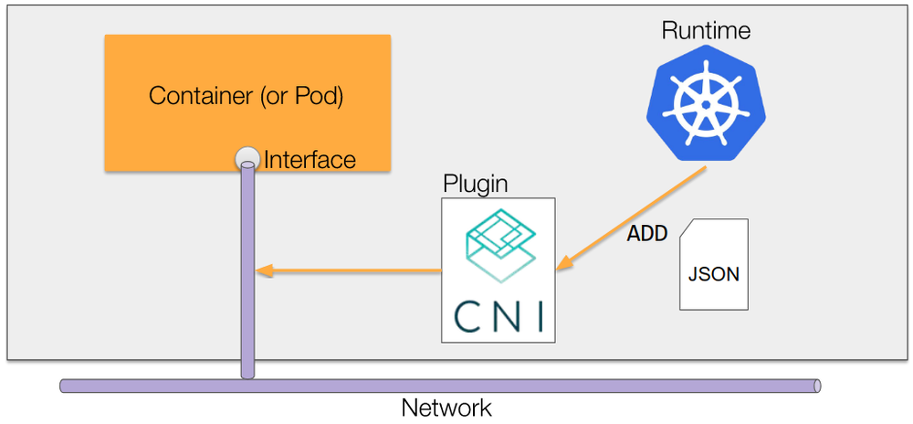

如上图所示，Kubernetes 会在创建 Pod 时调用 CNI plugin，为 Pod 创建网络接口，当 Pod 创建完成后，就不能再对 Pod 使用的网络进行更改了。

NSM 独立于 Kubernetes 的生命周期之外，自成体系。除了可以采用 Kubernets yaml 文件提供申明式的网络服务外，NSM 还提供了 GRPC 接口，因此还可以用于虚机和服务器环境。

可以看到，NSM 是 Kubernetes CNI 网络模型的强有力的补充，NSM 为 Pod 提供了动态的，高级的网络服务，采用 NSM，可以在不影响 CNI 和 Pod 中应用的情况下为 Kubernetes 动态添加新的网络服务。

## Network Service Mesh 与 Service Mesh 的关系

NSM 采用了和 Service Mesh 类似的理念，但所处网络层次不同，提供的网络功能也不同。

Service Mesh对网络数据的处理位于L4/L7（主要为L7），提供了应用层可见性（分布式调用跟踪、http调用metrics指标）、应用层安全（TLS认证及加密，jtoken身份认证）、4层/7层的服务发现，LB，请求重试等功能。

NSM提供的是L2/L3层的网络服务，提供虚拟点对点链路、虚拟L2网络、虚拟L3网络、VPN，防火墙，DPI等网络服务。

由于两者处于不同的网络层次，Service Mesh 和 NSM 可以协同工作。例如可以通过 NSM 创建一个跨云的三层网络，再在该三层网络上搭建一个 Istio Service Mesh。

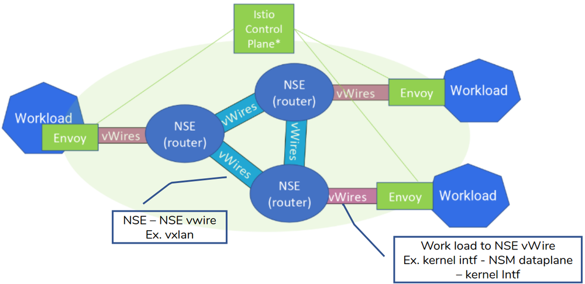

## Network Service Mesh 与 SDN 的关系

如下图所示，SDN（软定义网络）采用软件化的集中控制面和标准接口对网络设备进行设置，一方面可以通过硬件白盒化降低网络建设和运维成本，一方面可以通过软件的方式快速推出新的网络业务。

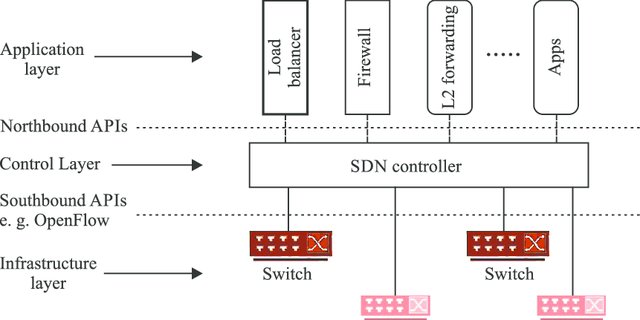

可以看到，NSM 与 SDN 作用的网络层次是有所重叠的，SDN 作用于 L1/L2/L3，而 NSM 作用于 L2/L3，但两者的关注点不同，NSM 主要为 Kubernetes 和混合云环境中的云原生应用提供高级的 L2/L3 网络服务，而 SDN 则主要用于对网络设备的配置和管理。

我们可以将 NSM 和 SDN 结合使用，可以通过 NSM 中的 Network Service 接入 SDN 提供的强大的网络服务。下图是在 NSM 中利用 SDN 为应用提供 QoE（Quality of Experience）服务的一个例子。

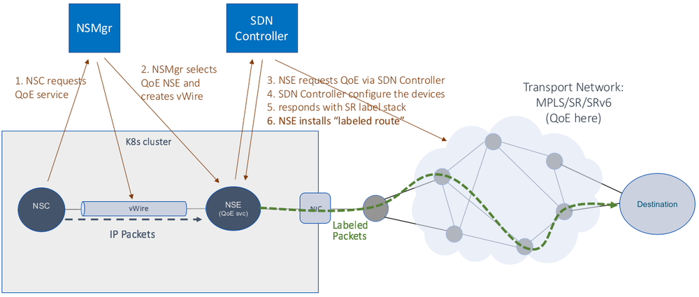

在这个示例中，NSM 在 Kubernetes 中提供了 QoE 网络服务以及客户端和 QoE 网络服务之间的虚拟点对点链接；SDN controller 则设置相关的网络设备，提供 QoE 服务的实现机制。NSM 以云原生的方式将 SDN 的网络能力提供给了 Kubernetes 中的应用。

## Network Service Mesh 与 NFV 的关系

NFV（网络功能虚拟化）就是将传统的电信业务以软件的形式部署到云平台上，从而实现软硬件解耦合。VNF（Virtual Network Function）是采用软件实现的网络设备功能，目前 VNF 主要是采用 VM 在 NFV 基础设施之上实现的。采用 Container 在 CaaS 平台上实现 NFV 是一个资源占用更少，更为敏捷的方式，该方式的主要问题是 CaaS 网络架构主要是为 IT 应用设计的，缺少电信所需的高级网络功能。而 NSM 可以在标准 CaaS 平台上实现 VNF 所需的高级网络功能，提供了一种云原生的 NFV 解决方案。采用 CaaS 和 NSM 来实现 NFV，有如下的好处：

* NSM 可以实现实现 Cloud Native 的 VNF（CNF）。
* NSM 可以采用抽象和声明式的方式表述对网络功能的需求。
* NSM 可以串联 CNF 实现 service function chaining (SFC)。
* 通过 Kubernets 和 NSM，可以很容易实现 VNF 的水平伸缩。

下图是采用 NSM 实现的 SFC 示例：

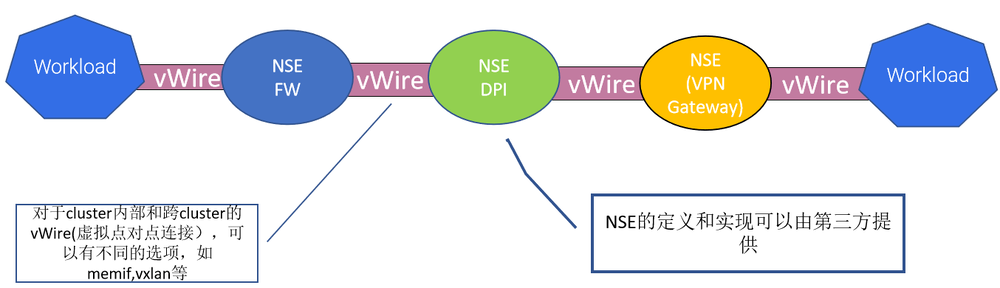

目前 NFV 主要由电信标准驱动 (如 ETSI NFV 系列标准），电信标准用在各种系统之间的接口上很有意义，可以确保不同厂家系统之间的互联互通；但如果在系统内部的实现机制上也采用标准那一套流程，就显得过于笨重和缓慢。NSM 以开源代码的方式推动 NFV 向云原生时代迈进，很有可能将对 NFV 带来革命性的变革。

## 总结

Network Service Mesh 是 CNCF 中的一个沙箱项目，其架构借鉴了 Service Mesh 的理念（换句话说，蹭了 Service Mesh 的热点 :-) ），可以为 Kubernetes 中部署的应用提供高级的 L2/L3 网络服务。Network Service Mesh 补齐了 Kubernetes 在网络能力方面的短板，并且可以用于虚拟机、服务器等混合云以及跨云场景。相信随着 Network Service Mesh 项目的发展和逐渐成熟，将加速电信，ISP，高级企业应用等对网络功能有更高要求的行业向云原生的转型。

# 参考文档

* <https://drive.google.com/drive/folders/1f5fek-PLvoycMTCp6c-Dn_d9_sBNTfag>
* <https://www.youtube.com/watch?v=YeAKtUFaqQ0>
* <https://www.youtube.com/watch?v=AWHkn_dqAUA&t=331s>
* <https://static.sched.com/hosted_files/kccnceu19/26/NSM%20Deep%20Dive%20KubeCon%20EU%202019%20%28developer%20centric%29.pdf>
* <https://www.youtube.com/watch?v=mrkW83_kLLM&t=2990s>
* <https://docs.google.com/presentation/d/1aG56Oqv7I1JpNsY4VPNpyoKppT-BRyOdYE43fr9ylNs/edit#slide=id.g64538f607d_2_94>
* <https://docs.google.com/presentation/d/1-nlBx0Qo4oCmlwYc72dirVcw19y5MAwvKu0wc4lk1VA/edit#slide=id.g790e663adc_0_145>

