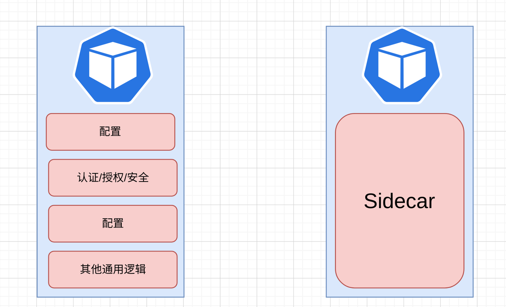

在云原生快速发展的前提下，服务网格领域也开始逐渐火热。目前阶段，大家所熟知的服务网格解决方案很多，每种产品又各有其优势。因此在面对不同的行业或者业务背景时，每个人的选型想法都各不相同。

## 服务网格现状和痛点

服务网格的出现其实跟目前业务架构的演进有很大关系。云原生趋势大涨后，大部分企业都开始转型做微服务。在这种背景之下，大家发现 App 开始变得越来越小，每个 App 里面都会一些通用的东西。所以就开始有一些想法“有没有一种技术可以把这些通用的东西沉淀下来”。于是，就出现了 Sidecar（边车）。

有了 Sidecar 之后，就可以把一些诸如服务注册发现、流量管理、可观测性和安全防护等功能沉淀到其中，这样业务服务就可以专注于业务逻辑层面的开发。

但是在出现 Sidecar 模式之后，在实践过程中人们也开始慢慢发现它的一些痛点，比如：

* **方案众多，一旦选择就难以撤退**。目前市面上的服务网格方案众多，各种方案中各有差异。一旦确定了其中一个方案，基本就会一直使用下去。但如果在后续使用过程中发现方案无法满足相关业务迭代，再次更换时就会产生巨大的成本。

* **与基础设施整合成本高**。服务网格在落地实践中，通常会需要与基础设施进行整合，比如与之前的微服务架构、MQ 或者数据库等基础组件整合。一些遗留问题或者历史技术债务也会对整合过程产生一定的阻力。

* **性能损耗与资源的额外消耗**。目前阶段，不管你选择哪种服务网格方案，它都会存在一定的性能损耗。同时因为 Sidecar 的存在，在配置业务时，就需要为其额外分配资源。

* **扩展难度高**。一些服务网格方案在配置时，现有的配置方式无法进行协议或功能的扩展，同时也无法通过插拔方式进行自定义扩展。

因此，在这种业务现状和痛点的催生中，我们就开始思考，是否可以有一种理想的服务网格方案，可以解决当前的现状和痛点呢？

## 理想的服务网格应如何？

在面对相关业务场景时，我们对于服务网格的要求大概如上图所示，即从资源、性能、流量管理和扩展方向有多个维度的需求。当然除了这些之外，在其他层面也会有一些更细致的要求。比如：

* 首先**使用体验**层面，要做到上手成本更低。因为真正用服务网格的不一定都是开发人员，可能运维人员也比较多。因此上手成本的高低，也是大家选择一个方案的因素之一。

* 其次在技术层面，**控制面**的配置一定要易于上手，同时对于相关权限能进行严格且安全的管控，而且配置方式要更贴近大众层面。

* 而在**数据面**，最好是能原生支持多种协议甚至是自定义协议，因为你需要去考虑一些历史系统迁移所带来的问题。由于 Sidecar 的存在，也需要考虑其资源占用在可控范围内，这样可以有效控制成本。同时需要满足一些自定义需求，因此对扩展能力也提出了新的要求。

* 最后是在整个**产品生态**内，不管是社区还是产品修复等，需要「及时响应」的速度去匹配。

既然已经有了这么清晰的需求目标，接下来要做的就是去执行和打造这么一个接近理想型的方案了。

## 基于 APISIX 的服务网格方案

Apache APISIX 是一个动态、实时、高性能的云原生 API 网关，提供负载均衡、动态上游、灰度发布、服务熔断、身份认证、可观测性等丰富的流量管理功能。

目前全球已有数百家企业使用 Apache APISIX 处理关键业务流量，涵盖金融、互联网、制造、零售、运营商等等，比如美国航空航天局（NASA）、欧盟的数字工厂、中国航信、中国移动、腾讯、华为、微博、网易、贝壳找房、360、泰康、奈雪的茶等。因此，基于 APISIX 的服务网格方案将不止在使用程度上，在面向一些行业领域时，也将具有强需求。

目前这套服务网格方案在架构的选择上，则是采取了控制面 Istio 配合数据面 APISIX 的组成结构。

首先在控制面上，我们选择了 Istio。因为 Istio 是当下最为流行的服务网格方案，同时它的社区活跃，这使得几乎所有的主流云厂商都对 Istio 进行了支持，这也在一定程度上代表了目前的市场需求和方向。所以在控制面的选择上，我们并没有进行自研模块。而是选择了拥抱 Istio 这个目前更适合也拥有更高接受度的方案。

而在数据面则是 Apache APISIX 需要发挥优势的部分。作为云原生的 API 网关，APISIX 作为 Istio 的数据面，在这套服务网格方案中究竟进行了哪些动作呢？

熟悉 APISIX 的小伙伴们都知道 APISIX 是使用 etcd 进行数据存储的，但如果我们把 APISIX 作为 Sidecar 使用的话，它的配置从哪里来？这是需要考虑的问题。如果把 etcd 组件也放到 Sidecar 中，会发现整个资源消耗非常大，同时也不够灵活。

所以在这个过程中，首先在 APISIX 中增加一个名为 xDS 的配置中心，让 APISIX 无需再使用 etcd。然后引入了上图中的 Amesh。Amesh 是一个 Go 编写的程序，编译成一个动态链接库，在 APISIX 启动时进行加载。其使用 xDS 协议与 Istio 进行交互，并将获取到的配置写入到 APISIX 的 xDS 配置中心中，进而生成具体的路由规则，最终使用 APISIX 完成对应请求的路由。

经过如上架构的配置之后，可以实现如下效果：

* 使 Amesh 与 APISIX 保持生命周期一致，两者可以一起开启或关闭。

* 得益于 APISIX 原生支持 xDS Discovery，彼此通过 xDS 协议进行转换数据，从而在资源消耗层面实现可控；相比原生 Istio 的 Envoy 方案，可以让资源对象更加轻量化。

* 配合 CRD 对整套方案进行扩展，尤其对 Istio 还未支持的功能，通过 CRD 可以快速方便的扩展。比如对接 APISIX 最为丰富的 plugin 配置，便是通过 CRD 的方式进行配置的；通过将 controller 和 Istio 配合使用，最大发挥了 Istio 与 APISIX 服务网格方案的可扩展性。

## 方案具体表现

### 性能提升明显

作为技术产品，数据永远是最直观和最有效的呈现方式。我们将 APISIX 和 Envoy 两者分别作为服务网格方案中的数据面，采用最多 5000 条路由的体量对其进行多种场景的压力测试，最终呈现了如下数据对比。

> 该测试场景为“匹配 5000 条路由中的第 3000 条路由”。由于测试场景较多，以下仅选取了匹配中间部分的路由进行描述，同时还有匹配头部路由和尾部路由的场景。数据太多不便展示，以下数据为 3000 条路由体量下的测试结果）。

从上图数据可以看出，在 QPS 层面，面对同样的压力和相同机器配置时，APISIX 呈现出了 5 倍的性能提升。同时在请求延迟层面，APISIX 比 Envoy 降低了一个数量级，APISIX 的延迟在微秒级，而 Envoy 在毫秒级别。当然也能看到在这种测下，当 Envoy CPU 已经跑满的情况下，APISIX 的 CPU 消耗才仅为 50%。

### 资源占用降低

在给服务网格方案注入 Sidecar 时，通常会额外消耗资源。而基于 APISIX 的这套方案，可以降低 60% 的资源消耗。为什么能做到这种程度呢？

首先是配置按需下发。Istio 在面对 Sidecar 进行资源管理时，本身会自带一些按需下发的策略，比如根据 namespace 进行隔离，但这个过程会给用户操作带来额外的心智负担和管理难度。

其次是配置本身是否精简。在 Envoy 中的路由配置时，可以通过 Dump 查看它的路由信息，你会发现实际可能没有那么多条路由，但是在 Envoy 中已经成千上万了。这就会带来很多影响，比如影响启动速度，造成一些配置的体积庞大，从而增加资源占用。

而利用 APISIX 就能避免以上这些烦恼，APISIX 配置精简，降低了存储在内存中数据，加之本身的高性能，降低了 CPU 资源消耗。整套方案中的资源消耗降低了 60% 左右。

### 学习成本低，定制化能力强

APISIX 作为 Apache 软件基金会的活跃开源项目，在社区中提供了非常丰富的文档和学习资源，对于想要上手 APISIX 的朋友来说降低了学习成本。

其次 APISIX 的源码是基于 Lua 实现的，Lua 语言其实比较容易看懂，因其本身属于轻量级脚本语言，查看 APISIX 源码就会更清晰易懂。

最后就是基于 APISIX 的二次开发非常方便。当你想要定制针对自己业务进行自定义插件时，不止支持原生的 Lua 语言，也可以借助 APISIX 的 Plugin Runner 来实现类似 Python、Java、Go 甚至 Wasm 等更为熟悉的语言进行二次开发。

而 APISIX 之所以生态强大，其实也跟产品的强扩展性分不开。

APISIX 本身提供非常多的插件，涉及安全、日志、可观测性等等。这些插件在 APISIX 作为传统网关组件时，可以发挥地淋漓尽致。但是将 APISIX 配合控制面的 Istio 打造服务网格时，很多资源在 Istio 控制面不支持定义。那这个时候怎么办呢？

所以就有了自定义 CRD 的出现。比如我们想要做一个故障注入的插件， 实际上这个插件在 APISIX 早有提供，因此在这里只需额外配置几个参数即可。当然这里只是拿故障注入插件举例，像 APISIX 中还有安全认证、限流限速等常用插件都可以按照这样的方式接入，从而实现精细化管控。

使用 CRD 这种方式最直接的好处就是它可以让扩展更加原生，使用声明式配置让用户更容易接受，同时不侵入 Istio 的原有配置，实现完美兼容。另一种好处是，对于已经使用 Istio 方案的用户迁移成本比较低。

* * *

综上所述，基于 APISIX 的服务网格方案在上手体验上对于开发者或者使用者而言，更加方便易用同时便于拓展，同时也有着优异的性能表现与丰富的生态支持。得益于 APISIX 产品本身的能力特色，在插件和多协议层面下也拥有很好的功能支持。预计在年底，将为大家带来 APISIX 服务网格下一版本的更新，敬请期待！

## APISIX 服务网格方案的未来展望

回过头来看，其实基于 APISIX 服务网格方案已经在朝着前文中提到的痛点进行逐一击破了，APISIX 服务网格也在朝着理想服务网格方案努力中。

使用 APISIX 这套服务网格方案可以看到，流量从外部通过 APISIX Ingress 进来，中间经过 APISIX 进行处理。这个过程中，APISIX Ingress 负责处理南北向的流量，Amesh + Istio 这套方案去处理东西向的流量。

在这样的一个部署架构下，它能带来一些业务层面的价值。比如**节约成本和统一技术栈**，你可以把原来在传统网关里面使用的通用能力快速复制到服务网格中。这样在业务层面，就可以进行统一的管理，从而控制成本，将网关、Ingress 与服务网格中的经验高度复用。

在后续的迭代计划中，基于 APISIX 的服务网格方案还会继续深耕，完成诸如以下的计划方向：

* 结合 APISIX 的功能，打造 xRPC 能力的实现；

* 进行原生异构的多协议支持；

* 覆盖包含 Istio 的各类场景和配置，大幅度降低用户迁移成本。

总结来说，在当下技术发展趋势中，服务网格势必是未来的流行趋势。虽然现在各种方案都还不太完善，但整体都属于螺旋上升的状态。当然，基于 APISIX 的服务网格也正朝着大家心目中的理想型服务网格解决方案奋进。