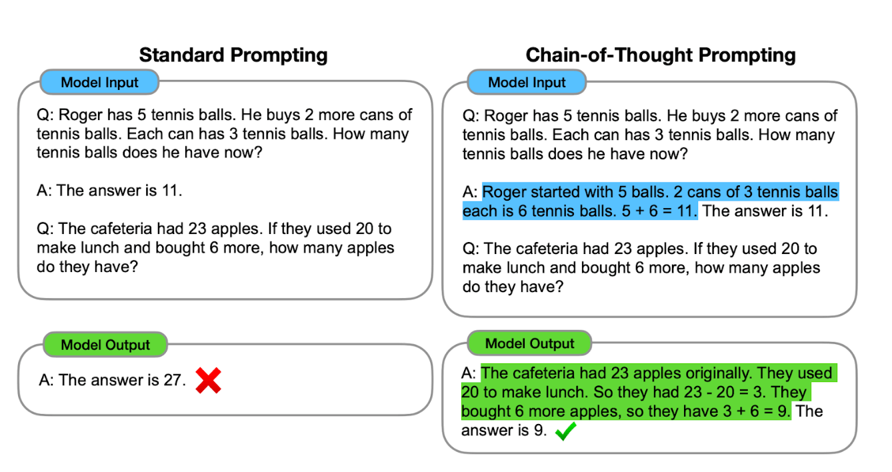
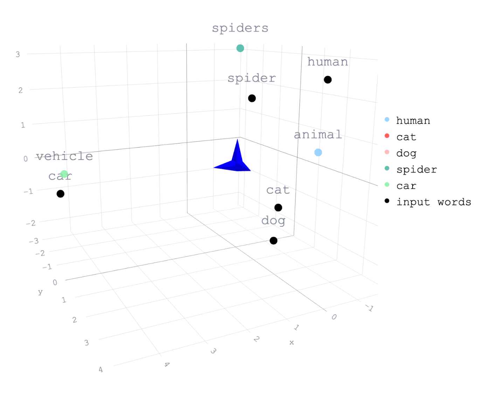

## 编者按

本文译自：<https://thenewstack.io/7-best-practices-for-developers-getting-started-with-genai/>

编辑评论：这是一篇非常有价值的文章，向开发者展示了生成式 AI 的潜力和应用。生成式 AI 是一种利用大型语言模型来生成和转换文本的技术，它可以帮助开发者解决一些复杂的问题，如代码生成，文档编写，内容创作等。生成式 AI 也是一种云原生的技术，它需要大量的计算资源和数据，以及高效的部署和管理方式。文章提供了一些实用的工具和平台，如 GitHub Copilot，Bard，ChatGPT 等，让开发者可以轻松地尝试和使用生成式 AI。文章还给出了一些注意事项和建议，如保护数据隐私，验证输出质量，避免滥用等，让开发者可以负责任地使用生成式 AI。我认为这篇文章是一个很好的入门指南，让开发者可以了解和利用生成式 AI 来打造创新的云原生应用。

---

## 正文

通过一点经验，你可以使用 GenAI 解决一些相当困难的问题，就像学习任何新技术一样，最好的方法就是动手实践。

随着可访问的生成式人工智能进入主流，以及由此产生的通过简单语言转化整个人类知识的能力，每个企业都在竭力将人工智能整合到其技术体系中。对于开发人员来说，压力很大，但也有着令人兴奋的无限可能性。

如果你有一些经验，你可以使用 GenAI 解决一些相当困难的问题，就像学习自 HTML 诞生以来的每一项新技术一样。让我们看看你可以采取的七个步骤，以开始建立 GenAI 的基础，并最终逐步发展成一个完全运作、可扩展的应用程序。

## 1. 玩转现有的 GenAI 工具

入门 GenAI 的最佳方法是实践，而且门槛非常低。市场上现在有许多免费选项，比如 Bard、ChatGPT、Bing 和 Anthropic，有很多可以学习的选择。

尝试使用 GenAI 工具和代码生成解决方案进行实验（并鼓励你的团队进行实验），例如[GitHub Copilot](https://github.com/features/copilot)，它集成到每个流行的 IDE 中，充当一对程序员。Copilot 提供程序员建议，帮助解决代码问题，并生成整个函数，使学习和适应[GenAI](https://us.resources.cio.com/resources/the-data-streaming-platform-key-to-ai-initiatives-4/)变得更快更容易。

当你首次使用这些现成的工具时，要小心使用专有或敏感的公司数据，即使只是提供给工具一个提示也要小心。Gen AI 供应商可能会存储并使用你的数据用于将来的训练运行，这是公司数据政策和信息安全协议的重大违规行为。确保你及时直接地向你的团队传达这一黄金规则。

## 2. 了解从 GenAI 中可以获得什么

一旦你开始尝试 GenAI，你将很快了解到不同提示会产生什么类型的输出。大多数 GenAI 工具可以生成各种格式的文本，包括：

- **生成**新的故事、想法、文章或任意长度的文本。
- **转换**现有文本为不同格式，如 JSON、Markdown 或 CSV。
- **翻译**文本成不同语言。
- 以聊天的方式**对话**来回。
- **审查**文本以展示特定元素。
- 将长篇内容**汇总**以获取洞察。
- **分析**文本的情感。

任何人都可以生成这些类型的生成文本结果，无需编程技能。只需键入提示，文本就会产生。然而，大型语言模型（LLM）经过的培训越多，即它摄取的语言碎片越多，随着时间的推移，它在生成、更改和分析文本方面就会变得更加准确。

## 3. 学习提示工程

部署 GenAI 的良好方法之一是掌握编写提示的技巧，这既是一门艺术又是一门科学。虽然提示工程师是一个实际的职位描述，但它也是任何希望提高他们使用 AI 的人的好绰号。优秀的提示工程师知道如何开发、完善和优化文本提示，以获得最佳结果并提高整个 AI 系统的性能。

提示工程不需要特定的学位或背景，但从事这项工作的人需要擅长清晰解释事物。这是重要的，因为所有可用的 LLM 都是无状态的，这意味着没有长期记忆，每次交互只存在于小会话中。

在提示工程中，以下三个因素变得重要：

1. **上下文**：你提出的问题、聊天历史记录和你设置的参数。
2. **知识**：LLM 已经接受的培训内容以及你通过提示提供的新信息的结合。
3. **形式**：你期望以何种方式生成信息的语气。

上下文、知识和形式的结合塑造了 GenAI 的大量知识存储成为你希望获得的响应类型。

## 4. 探索其他 GenAI 提示方法

到目前为止，我们一直在谈论零-shot 提示，这基本上意味着提出一个带有一些上下文的问题。如果你从这种方法中没有得到期望的结果，还有四种提示 GenAI 的方法。

1. **单次提示**：提供你正在寻找的输出类型的示例。如果你想要特定类型的格式，例如[标题]和[4 个要点]，这将特别有用。
2. **少量提示**：这类似于单次提示，但你会提供三到五个示例而不仅仅是一个。
3. **“让我们一步一步地思考”**：这种技巧对 LLM 和对人都同样有效。如果你有一个包含多个部分的复杂问题，请在末尾输入此短语，等待 LLM 分解问题。
4. **思路链提示**：对于涉及复杂算术或其他推理任务的问题，思路链提示会指示工具“展示其工作方式”并解释其如何得出答案。以下是可能的示例：

## 5. 查看其他 GenAI 工作示例

一旦你熟悉了 GenAI 工具并了解如何编写出色的提示，[请查看 OpenAI 发布的一些示例](https://github.com/openai/openai-cookbook/tree/main/examples)，了解其他人正在做什么以及可能的其他可能性。随着你的实验，你将更加熟悉聊天界面，并学会如何对其进行微调，以便熟练地缩小响应范围，甚至将响应转换为 CSV 文件或其他类型的表格。

考虑如何将你的 GenAI 知识应用于你的业务，以简化困难或重复性任务，生成创意并使信息易于让更广泛的受众访问。你可以想象出哪些新的用例？以前不可能的东西现在成为可能了吗？

## 6. 集成第三方 GenAI 工具和 API

考虑使用 ChatGPT、Bard 和 Claude 2 等 API 通过 API 使用 LLMs 的角色。这些工具都提供了强大的 API，并有支持文档，因此入门门槛很低。大多数这些 API 是基于使用量的，因此更容易玩弄。

通常情况下，通过语义搜索和由向量数据库支持的嵌入来将自定义或私有数据集成到 LLM 提示中，你还可以集成自定义或私有数据。通常称为 RAG（检索增强生成）。

分解这两个术语：

- **语义搜索**：使用词嵌入比较查询的含义与其索引中文档的含义，即使没有完全匹配的单词也能获得更相关的结果。
- **嵌入**：将对象（如单词、句子或整个文档）的数值表示转化为多维空间。这使得评估不同实体之间的关系成为可能。

以下是这可能看起来的一个示例：

这幅图展示了“猫”和“狗”的概念比它们与“人”或“蜘蛛”的概念更接近，“车辆汽车”则是最远的，是概念中最不相关的。（[这里有更多关于如何使用语义搜索和嵌入的信息](https://www.confluent.io/blog/chatgpt-and-streaming-data-for-real-time-generative-ai/#connecting-knowledge-base-to-gpt)。）

## 7. 从头开始训练自己的模型

这最后的建议实际上不太像建议，更像是一个“可选的下一步”。训练自己的 GenAI 模型并不适合每个人，但如果你：

- 拥有独特而有价值的知识库。
- 想要执行商业 LLM 无法完成的某些任务。
- 发现商业 LLM 的推理成本在商业上没有意义。
- 有特定的安全要求，需要托管自己的 LLM 数据，并且不愿通过第三方 API 传递数据。

训练自己的模型的一种方法是使用开源模型，例如 Llama 2、Mosaic MPT-7B、Falcon 或 Vicuna，其中许多还提供了商业使用许可证。这些通常根据它们具有的参数数量进行标记：7B、13B、40B 等。 “B”代表模型的参数数目，以及它可以处理和存储的信息量。数字越高，模型就越复杂和复杂，但训练和运行成本也越高。如果你的用例不复杂，并且如果你计划在性能相当强大的现代笔记本电脑上运行模型，那么具有较低参数的模型是开始的最佳且最经济的方法。

中大型组织可能会选择从头开始构建和训练一个 LLM 模型。这是一条非常昂贵、资源密集且耗时的 AI 之路。你需要难以招聘的技术人才，并具备长时间迭代的机会，因此对大多数组织来说，这条路线不现实。

### 微调 LLM

一些组织选择中间路径：微调基本开源 LLM 以实现模型预训练能力之外的特定功能。如果你希望以你品牌独特的声音创建虚拟助手或基于真实客户购买构建的推荐系统，那么这是一个很好的选择。这些模型会随着你纳入排名靠前的用户交互而不断地训练自己。事实上，[Open AI 报告](https://voicebot.ai/2023/08/23/openai-brings-fine-tuning-to-gpt-3-5-turbo-and-gpt-4/)，使用此模型，可以将提示长度缩短多达 90%，同时保持性能不变。此外，Open AI 的商业 API 的最新增强功能使其与驱动 ChatGPT 和 Bing AI 的模型一样强大和易于访问。