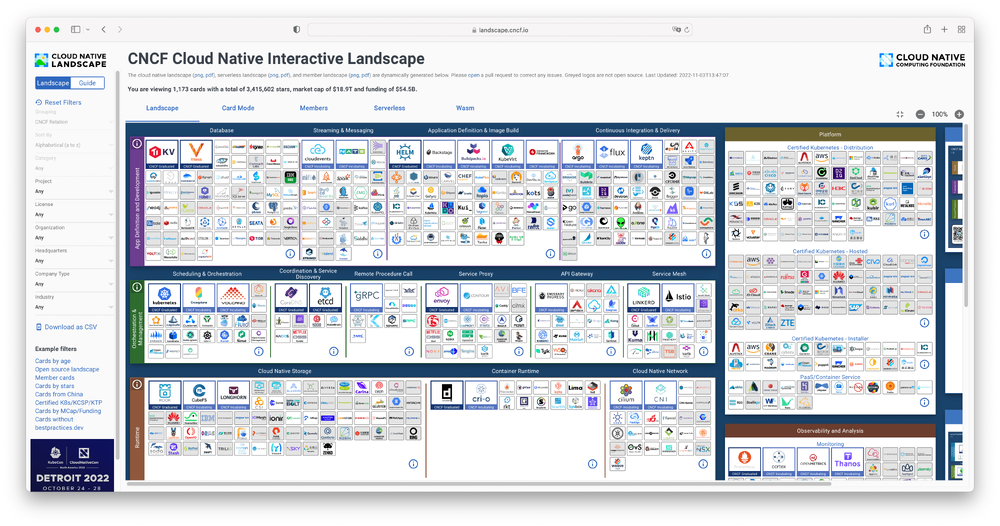
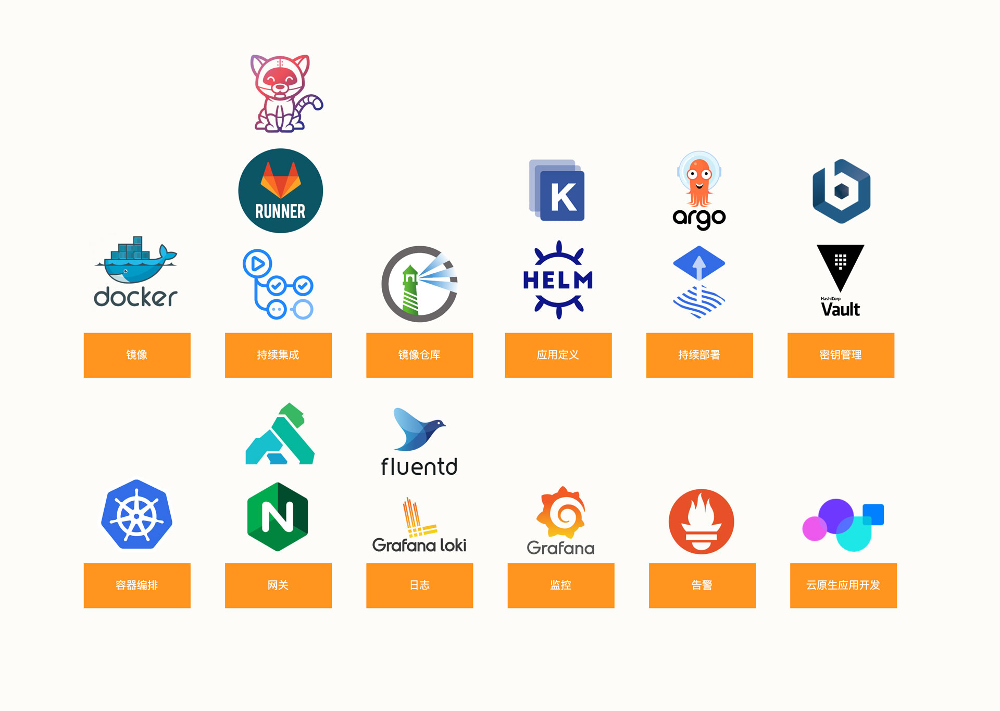
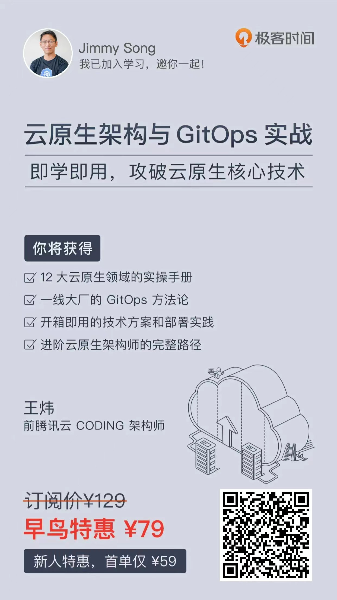
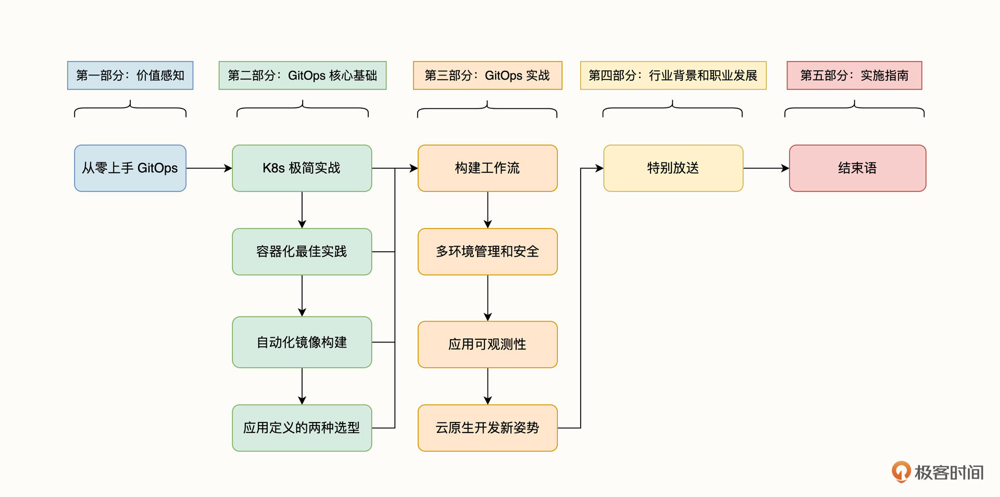
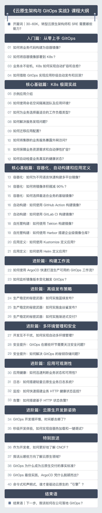

伴随着云计算的浪潮，云原生的概念也应运而生，从 2015 年 CNCF 云原生基金会的成立，已经持续高速发展了 7 年时间。而 Kubernetes 作为云原生的代表就像是一个全新的云操作系统，围绕着它诞生了丰富的上层应用和生态。

迄今为止，CNCF 在其公布的云原生全景图中，显示了目前近 30 个领域、数百个项目的繁荣发展，云原生技术的广度和深度得到了前所未有的发展。

面对这庞杂的技术领域和技术工具，我们往往不知道要从哪儿下手开始学习。即便掌握了云原生核心技术 Docker 和 K8s ，不过在工程实践中，这远远是不够的。

那当我们有了云原生基础之后，**想要进一步实现职业晋升，我建议你从下面的几个方面去学习：**

总结来说，你需要聚焦在下面几个领域：

- 容器和镜像： Docker
- 持续集成：GitHub Action、Jenkins、Tekton
- 镜像仓库：Harbor
- 应用定义：Helm、Kustomize
- 持续部署：FluxCD、ArgoCD
- 秘钥管理：Vault
- 容器编排：K8s
- 网关：Ingress-Nginx
- 日志：Grafana Loki、Fluentd
- 监控：Grafana
- 告警：Prometheus
- 应用开发：Nocalhost

实际上，这些领域的项目在云原生工程实践中并不是独立的，**你需要掌握并把它们连接爱来，才能将项目迁移到云原生架构。**

面对这么多的领域和技术，怎么学习它们才能更加高效呢？下面是根据我的学习经验总结的学习路径，你可以参考：

**第一阶段：学习 Docker 和 K8s 的基础知识；**

**第二阶段：学习 CI/CD 领域的技术；**

**第三阶段：学习日志、监控和告警领域的技术。**

## 三个学习阶段

### 第一阶段

在第一阶段，你需要学习 Docker 和 K8s 的基础知识。其中，Docker 相关的知识包括：

- 镜像是什么，有什么作用？
- 怎么将业务代码构建为镜像？
- 如何选择合适的基础镜像？
- Docker 的其他基本操作

在学习了 Docker 相关知识后，接下来就要开始学习 K8s 相关知识，包括：

- 什么是 K8s 的工作负载？
- Service 的作用是什么？
- 应用配置如何迁移？
- 如何对外暴露服务？
- 如何配置 HPA 扩缩容？
- Kubectl 的基本操作

这个阶段学习完成后，在工作中使用 Docker 和 K8s 基本上就没太大问题了。

### 第二阶段

当具备了 Docker 和 K8s 的基础知识后，接下来就需要学习 CI/CD 领域的技术了。其中，CI 领域包括：

- 如何使用 Jenkins 自动构建镜像？
- 如何使用 GitHub Action 自动构建镜像？
- 如何自建 Tekton 构建镜像？
- 如何使用 Tekton 搭建私有镜像仓库？

然后，再深入学习 CD 领域的技术，包括：

- 如何定义应用，Helm 还是 Kustomize？
- 如何使用 ArgoCD 搭建 GitOps 工作流？
- 如何管理 GitOps 中的秘钥

到了这个阶段，也就具备在实际项目中搭建完整的 GitOps 工作流的能力了。

### 第三阶段

为了让分布式系统具有更好的可观测性，在第三阶段我们需要学习日志、监控和告警的知识，他们包括：

- 如何使用 Loki 搭建轻量级的日志系统？
- 如何使用 EFK 搭建日志系统？
- 如何使用 Grafana 和 Prometheus 搭建监控系统？
- 如何使用 Prometheus AlertManager 搭建告警系统？

到了第三个阶段，你已经基本上掌握完整的云原生知识体系了。

### 缺点

这种学习方式适合有一定基础并且动手能力强的同学，它们缺少体系化的学习过程，当需要将不同领域的工具进行连接时缺少可参考的最佳实践的案例。

## 选择体系化的课程

还有一种可行的学习方法是选择一门体系化的课程，这里我推荐王炜的极客时间新专栏《云原生架构与 GitOps 实战》。你可以从零上手，一步一步入门云原生，一次学习云原生的所有知识点。

也可以[点击这里](https://time.geekbang.org/column/intro/100312001?code=PlMU9ITPlnun1QAjTGtDtNxkTtgSRZZzLJlQZHrEKtI%3D&utm_term=SPoster)查看课程介绍

这里也分享一张课程的学习路径，跟着这条路径，就可以高效地解决“怎么学”的问题。

### 课程目录

### 关于王炜

王炜，现在深圳氦三科技的联合创始人，他之前就职于腾讯云 CODING 担任架构师，也是**中国云原生社区深圳站的负责人**。

出版了 **《Spinnaker 实战：云原生多云环境的持续部署方案》**，参与编写了 **《深入理解 Istio：云原生服务网格进阶实战》** 以及 **《软件研发效能权威指南》** 的云原生开发部分。

同时，他也是云原生开发工具 **Nocalhost** 项目的核心作者。

### 课程售价

课程原价 ¥129

**今日早鸟 6 折秒杀 ，到手 ￥ 79！**

**如果你是新用户，只需要 ￥ 59！**

点击[这里](https://time.geekbang.org/column/intro/100312001?code=PlMU9ITPlnun1QAjTGtDtNxkTtgSRZZzLJlQZHrEKtI%3D&utm_term=SPoster)，立享 6 折，跟着王炜学习云原生架构与 GitOps。
