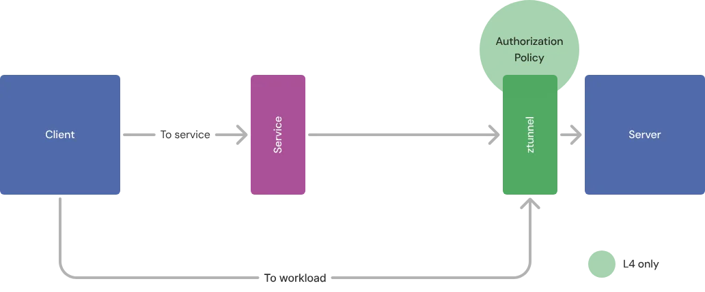
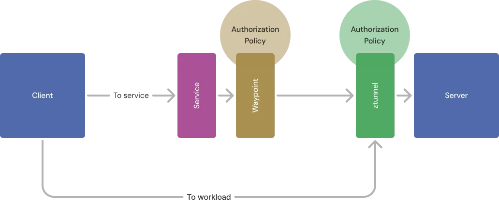
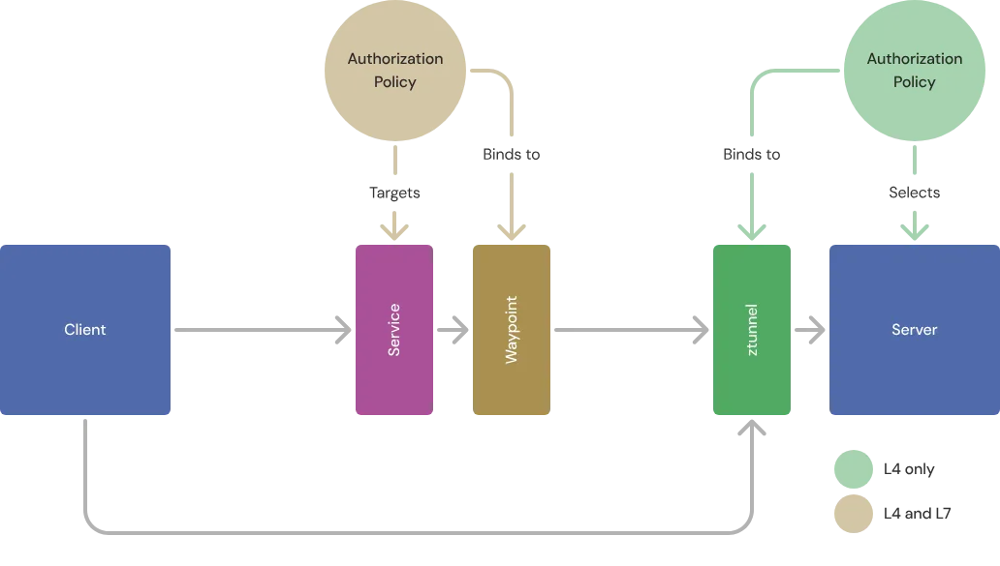
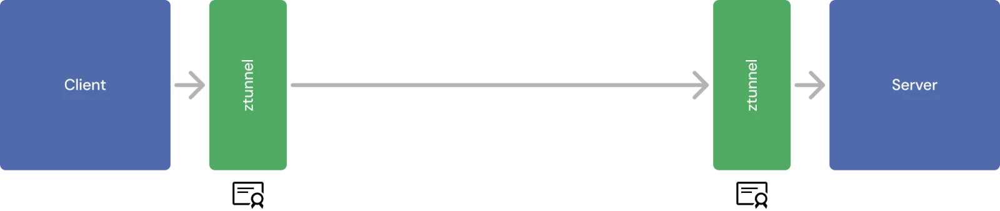
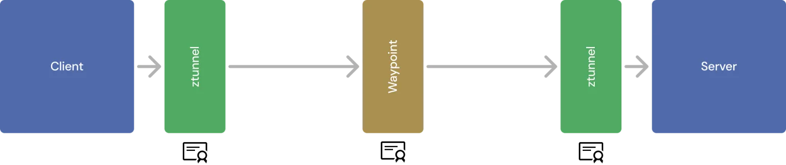

服务网格最受欢迎的功能之一，就是能够对网络流量强制执行访问控制策略。由于所有流量都经过代理服务器，因此你可以确保没有人能够绕过某个强制点直接访问服务，而且这些强制点可以位于每个服务前，而不是仅在网络边缘。

与传统的防火墙或 Kubernetes 的 NetworkPolicy 功能不同，服务网格还可以访问应用层（第七层，L7）信息，例如请求是 HTTP 的 GET 还是 POST，以及请求中携带的 cookie 中的用户身份。

Ambient Mesh（由 Istio 的 Ambient 模式和 Gloo Mesh 实现）极大地简化了服务网格的交付方式，并显著降低了成本。它的做法是[将 L4 和 L7 的处理拆分为两个不同的代理组件](https://ambientmesh.io/docs/about/)。但这也意味着我们必须改变对访问控制的默认假设：我们不再默认每个工作负载前都有一个 L7 感知的强制执行点。好消息是，大多数情况下我们并不需要它，如果确实需要，也可以按需部署，仅作用于需要保护的工作负载。

### Ambient Mesh 中的身份认证与授权

运行在服务网格中的每个工作负载都有一个基于命名空间和 ServiceAccount 的身份。这些身份在网格内会被自动验证：这是 mTLS 提供的特性，Ambient 模式默认启用 mTLS。

我们使用 `AuthorizationPolicy` 来控制流量。此类策略指定网格中的目标，并包含规则，用于基于来源（from）、操作（to）以及条件（when）来允许或拒绝访问。

`ztunnel` 代理始终可以强制执行策略，但它只了解 L3/L4 层的信息（如主机与端口）；而 `waypoint` 代理还可感知 L7 信息（如路径与方法），但不是默认部署的。为了兼顾 Ambient 模式的优势与安全性，我们需要为这两类代理分别定义不同粒度的策略。幸运的是，这并不复杂。

### 两类不同的授权策略

考虑某个部署在 Ambient Mesh 中的工作负载，没有使用 Waypoint。这时策略只能在服务端的 ztunnel 上强制执行。而 ztunnel 无法识别 L7 信息，因此只能强制 L4 层的策略。

当你为该工作负载[引入 Waypoint](https://ambientmesh.io/docs/setup/configure-waypoints/) 时，策略就可以在两个位置被执行：

当系统存在多个策略执行点时，应该**始终在最早的执行点**上应用策略。

例如，若将所有策略都设置在 Waypoint 上，则直接访问工作负载的流量将绕过策略。而对于公开访问的服务，策略可能已在网关处执行。为了避免重复处理，[默认情况下 Gateway 会直接将流量转发给服务](https://ambientmesh.io/docs/traffic/gateways/#gateways-and-waypoints)，绕过 Waypoint。

因此，推荐的做法是：在 ztunnel 上定义“基础设施策略”，强制使用 Waypoint，然后在 Waypoint 或 Gateway 上定义“应用层策略”。

### 策略的作用目标与绑定

上面的示意图未涉及实际场景中工作负载与 waypoint 实例的多副本情况。我们在写策略时，需要明确它的作用目标：即它是对哪个服务或工作负载生效。

Istio 会自动将策略绑定到正确的代理上：

如果策略由 ztunnel 执行，你可以通过指定 `AuthorizationPolicy` 所在的 namespace 和 label selector 选择其作用的工作负载。这类似于 Kubernetes 的 NetworkPolicy，或 Istio sidecar 模式下的策略绑定方式：

| 应用对象                         | Namespace    | Selector    |
| -------------------------------- | ------------ | ----------- |
| 网格中所有工作负载               | istio-system |             |
| default 命名空间下的所有工作负载 | default      |             |
| 匹配特定标签的工作负载           | 任意命名空间 | matchLabels |

而 Waypoint 使用 Kubernetes Gateway API 配置，策略通过 `targetRefs` 字段[绑定到 Gateway](https://ambientmesh.io/docs/setup/configure-waypoints/#attach-policies-and-routes)。

> **为什么 Waypoint 使用不同的绑定方式？**
>  使用不同的绑定方式可以明确区分不同层级的策略含义，而 `targetRefs` 遵循了 Kubernetes Gateway API 的语义。

请注意，我们并未直接使用“L4 策略”或“L7 策略”的说法，因为 Waypoint 也可以执行 L4 策略。后文将说明为什么你可能希望这么做。

### 访问控制的基础

如果某个工作负载没有配置任何授权策略，则默认允许所有访问。一旦存在至少一个包含 `ALLOW` 操作的策略，则**所有未匹配任何 `ALLOW` 的流量都会被拒绝**。

这点非常重要。例如，你允许来自 Gateway 的流量访问某工作负载，后来引入了 Waypoint，则来自 Waypoint 的流量将会被拒绝，除非你更新策略。

### 使用 ztunnel 强制执行策略

在很多场景下，不部署 Waypoint，仅使用 Ambient Mesh 的 *安全叠加层（secure overlay layer）* 是合理的选择。Istio 的 L4 属性（IP、端口、命名空间、身份主体）即可用于授权策略。

这使得我们能实现最小权限的微分段：即仅允许必要的服务之间互相通信。当某个服务被攻破时，攻击流量也会携带其真实身份。例如，图像处理服务无权访问支付服务后端，可以轻松通过策略限制这种访问。

### 非法策略属性与拒绝流量

前面提到，L4 策略属性可以用于 ztunnel 绑定的策略。你甚至可以复用 Istio sidecar 模式下的策略到 ambient 模式中，其中可能包含 L7 属性（如 HTTP 方法或路径）。但由于 ztunnel 无法识别 L7 属性，会发生什么呢？

简而言之：**ztunnel 会安全失败（fail-safe）**。

- 对于包含 L7 属性的 `DENY` 策略：忽略 L7 部分，仅保留其余部分。
- 对于包含 L7 属性的 `ALLOW` 策略：L7 匹配规则会被移除。

这样做的结果比原策略更严格。因为只要有 `ALLOW` 策略存在，未被匹配的流量就会被默认拒绝。所以最终结果是，所有流量都匹配默认拒绝规则。

### 引入 Waypoint 的策略执行

绑定在 Waypoint 与 ztunnel 上的策略存在两个主要区别：

- 使用 `targetRefs` 替代 selector；
- 支持 L7 属性。

当你将某个工作负载配置为使用 Waypoint 后，它就成为了该工作负载最合适的策略执行位置，即使仅是执行 L4 策略。原因在于 Ambient 模式下的身份工作机制：

工作负载间的 mTLS 通信是由两端的 ztunnel 管理的：

为了让 Waypoint 能够解密和检查流量，它必须终止原有的 mTLS，重新发起一次连接：

这意味着，服务器端 ztunnel 所见到的源身份是 **Waypoint 的身份**，而非原始客户端。如果你希望根据真实源身份做出策略判断，策略应部署在 Waypoint 上。

### 只允许来自 Waypoint 的连接

为了确保策略真正通过 Waypoint 执行，必须防止流量绕过 Waypoint。默认情况下，Ambient Mesh 会自动将服务流量路由到 Waypoint，但服务端的 ztunnel 仍接受来自任何客户端的连接。

某些场景下这没问题，比如 Prometheus 采集某个 Pod 的 metrics，通常是直接连接，而不经过 Waypoint。

若你需要阻止其他流量，应在 ztunnel 上定义策略，只[允许来自指定 Waypoint 的连接](https://ambientmesh.io/docs/security/waypoint-authz/#restricting-workloads-to-only-accept-traffic-from-waypoints)。必要时可[添加例外](https://ambientmesh.io/docs/security/waypoint-authz/#exceptions)。
