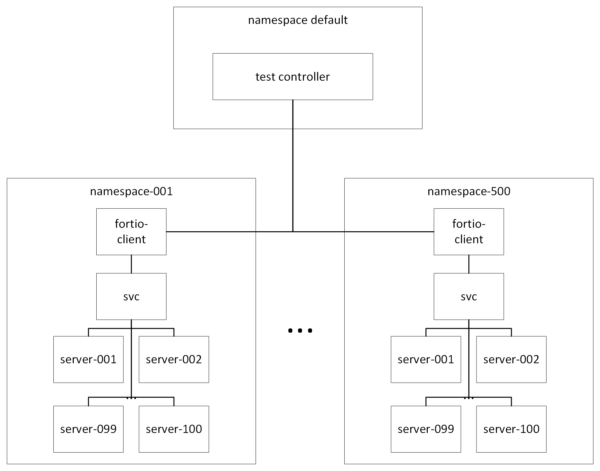
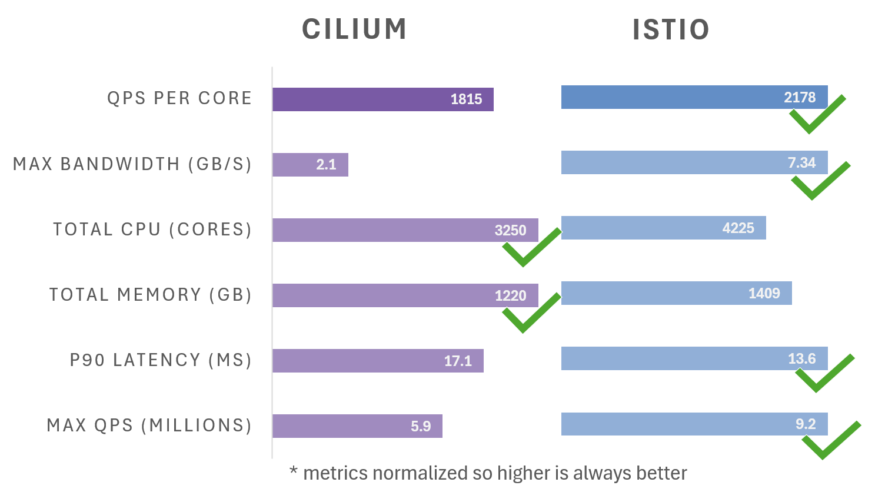

潜在的 Istio 用户经常会问：“Istio 与 Cilium 相比如何？”虽然 Cilium 最初仅提供 L3/L4 功能（如网络策略），但近来的版本增加了基于 Envoy 的服务网格功能以及 WireGuard 加密。与 Istio 一样，Cilium 也是 CNCF 认证的毕业项目，并在社区中存在多年。

尽管表面上看这两个项目提供的功能相似，但它们的架构却有着显著不同，尤其是 Cilium 使用 eBPF 和 WireGuard 在内核中处理和加密 L4 流量，而 Istio 在用户空间通过其 ztunnel 组件处理 L4 流量。这些差异导致了关于 Istio 与 Cilium 在大规模下性能的广泛讨论。

尽管已有关于租户模型、安全协议和基本性能的比较，但尚未有全面的企业级评估报告。与其强调理论性能，我们对 Istio 的 Ambient 模式和 Cilium 进行了测试，聚焦于延迟、吞吐量和资源消耗等关键指标。通过模拟一个繁忙的 Kubernetes 环境，我们施加了高负载场景，最后将 AKS 集群的规模扩展到 1000 个节点、11000 个核心，以了解这些项目在大规模下的表现。结果显示，两者各有需要改进的地方，但 Istio 明显表现更佳。

## 测试场景

为了将 Istio 和 Cilium 推向极限，我们创建了 500 个不同的服务，每个服务支持 100 个 Pod。每个服务位于单独的命名空间中，且包含一个[Fortio](https://fortio.org/)负载生成客户端。我们将客户端限制在一个由 100 台 32 核机器组成的节点池中，以消除共同定位的客户端的干扰，并为服务分配了剩余的 900 台 8 核实例。

在 Istio 测试中，我们使用了 Ambient 模式，在每个服务命名空间中部署了[waypoint 代理](https://istio.io/latest/docs/ambient/usage/waypoint/)，并使用默认的安装参数。为了使测试场景尽可能相似，我们在 Cilium 中启用了几个非默认功能，包括 WireGuard 加密、L7 代理和节点初始化。我们还在每个命名空间中创建了一个 Cilium 网络策略，带有基于 HTTP 路径的规则。在两种场景下，我们通过随机地将一个服务扩展到 85 至 115 个实例并每分钟重新标记一个命名空间，生成了变化。要查看我们使用的精确设置并重现结果，请参阅[我的笔记](https://github.com/therealmitchconnors/tools/blob/2384dc26f114300687b21f921581a158f27dc9e1/perf/load/many-svc-scenario/README.md)。

## 可扩展性评分

Istio 能够以 20% 的较低尾延迟提供 56% 更多的查询。Cilium 的 CPU 使用率低 30%，但我们的测量并不包括 Cilium 用于加密的内核核心。

考虑到资源使用情况，Istio 每核心处理 2178 个查询，而 Cilium 则是 1815 个，提升了 20%。

- **Cilium 减速：** Cilium 在默认安装参数下展示了令人印象深刻的低延迟，但当启用 Istio 的基准功能（如 L7 策略和加密）时，其速度大幅下降。此外，即使网格中没有流量流动，Cilium 的内存和 CPU 利用率仍然较高，这可能会影响集群的整体稳定性和可靠性，尤其是在扩展时。
- **Istio 稳健表现：** 相比之下，Istio 的 Ambient 模式在稳定性方面展示了其优势，即使增加了加密的开销，也能保持不错的吞吐量。在测试中，Istio 确实比 Cilium 消耗了更多的内存和 CPU，但在没有负载时其 CPU 利用率下降到 Cilium 的一小部分。

## 幕后原因：为何表现差异？

要理解这些性能差异的关键在于各工具的架构和设计。

- **Cilium 的控制平面难题：** Cilium 在每个节点上运行一个控制平面实例，随着集群扩展，这导致 API 服务器压力增加和配置开销增加。这经常导致我们的 API 服务器崩溃，接着 Cilium 变得不可用，整个集群陷入不响应状态。
- **Istio 的效率优势：** Istio 通过集中控制平面和基于身份的方式简化了配置，减少了 API 服务器和节点的负担，将关键资源用于处理和保护流量，而不是处理配置。Istio 通过运行尽可能多的 Envoy 实例来进一步利用未在控制平面中使用的资源，而 Cilium 则限制为每个节点共享一个 Envoy 实例。

### 更深入探讨

虽然这个项目的目标是比较 Istio 和 Cilium 的可扩展性，但一些限制使得直接比较变得困难。

### L4 不总是 L4

尽管 Istio 和 Cilium 都提供 L4 策略强制，但它们的 API 和实现存在显著差异。Cilium 实现了 Kubernetes NetworkPolicy，它使用标签和命名空间来阻止或允许 IP 地址的访问。Istio 提供了一个 AuthorizationPolicy API，并根据签署每个请求的 TLS 身份做出允许和拒绝决定。大多数深度防御策略需要同时使用 NetworkPolicy 和基于 TLS 的策略来实现全面的安全性。

### 加密的差异

Cilium 提供了用于 FIPS 兼容加密的 IPsec，但大多数 Cilium 功能（如 L7 策略和负载均衡）与 IPsec 不兼容。Cilium 在使用 WireGuard 加密时具有更好的功能兼容性，但 WireGuard 无法在 FIPS 合规的环境中使用。另一方面，Istio 严格遵守 TLS 协议标准，默认情况下始终使用 FIPS 兼容的 mTLS。

### 隐藏的成本

虽然 Istio 完全在用户空间中运行，但 Cilium 的 L4 数据平面在 Linux 内核中使用 eBPF。Prometheus 的资源消耗指标仅测量用户空间资源，这意味着 Cilium 使用的所有内核资源在此测试中都未计入。

## 建议：选择合适的工具

那么，最终结论是什么？这取决于您的具体需求和优先事项。对于小型集群以及纯 L3/L4 用例且无需加密的情况，Cilium 提供了一个经济高效且性能良好的解决方案。然而，对于大型集群，以及注重稳定性、可扩展性和高级功能的情况，Istio 的 Ambient 模式配合替代的 NetworkPolicy 实现才是首选。许多客户选择将 Cilium 的 L3/L4 功能与 Istio 的 L4/L7 和加密功能结合，以实现深度防御策略。

请记住，云原生网络的世界在不断发展。密切关注 Istio 和 Cilium 的进展，它们将继续改进和应对这些挑战。
