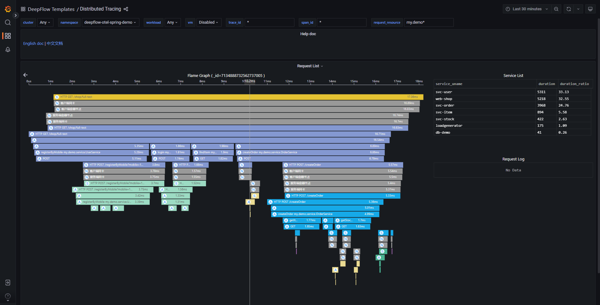
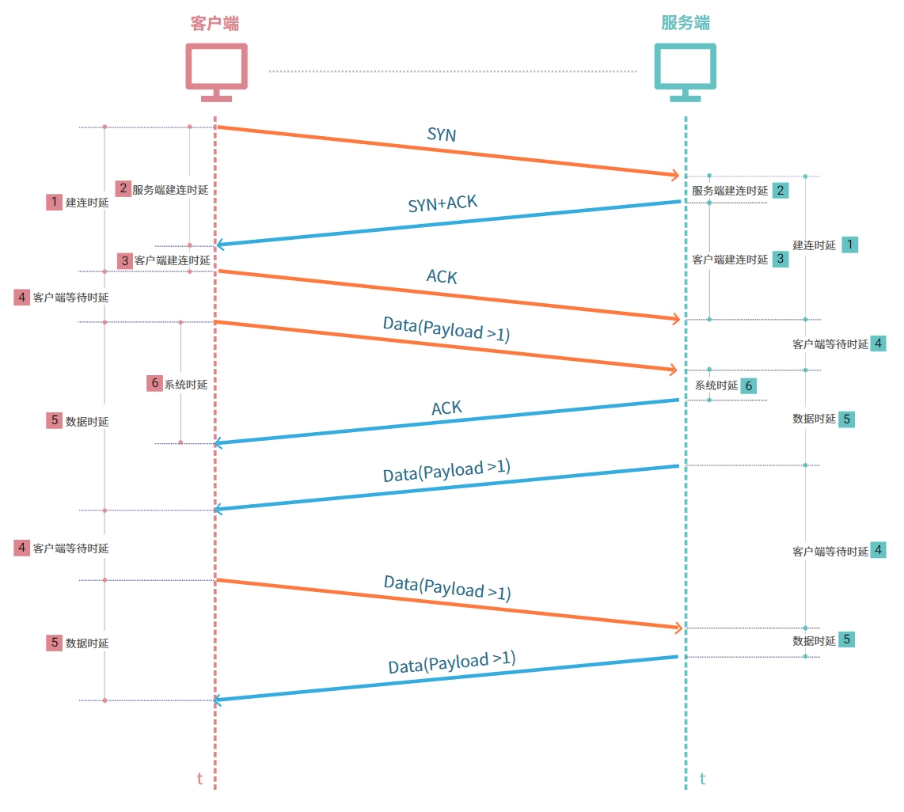

应用异常时，基本可以分为**服务访问不通**和**服务响应慢**两个大类。其中服务响应慢的问题定位非常棘手，很多无头案。应用团队有日志和追踪，对于自认为的不可能不合理的事情都会甩给基础设施团队，又由于基础设施团队现有的监控数据缺乏应用的观测视角，通常成为一切「不是我的问题」超自然现象的终极背锅侠，其中以网络团队尤为严重。

## 响应时延

**服务为什么响应慢**？？？首先，我们需要一种方式来度量何为响应慢，参考 Google 在 SRE Handbook 中提到过`4 个黄金信号`及 Weave Cloud 提出来的 `RED 方法`，都存在度量的指标（Latency/Duration），后文统称为`响应时延`。
- Latency 表达的是**服务处理某个请求所需要的时间**，站在的是服务端视角
- Duration 表达的是**每个请求所花费的时间**，站在的是客户端视角

总结下来，不论站在什么视角，`响应时延`表达的都是处理一个请求所花费的时间，可以用来**表征服务响应慢的度量指标**，但若要定位为什么响应慢还需要进一步剖解响应时延：
- 系统时延：系统转发请求/响应的时延消耗
- 网络时延：包含查询 DNS 时延及网络处理的时延
- 应用时延：从不同视角来看，包含客户端应用处理时延 + 服务端应用处理时延

确定度量指标后，接下就可以分析服务响应慢的原因，此时可以利用**分布式链路追踪**能力来快速来**定界瓶颈点**，例如可利用 DeepFlow 的分布式追踪能力来快速定界瓶颈点在应用、系统还是网络。

完成瓶颈点定界后，则需要去查找根因。对于应用或者系统的问题，可以利用**性能剖析（profile）继续追查根因**，而对应网络时延的分析，其中 DNS 时延分析是相对简单的，只需要关注请求的响应时延即可，但网络处理时延瓶颈的定位却缺少了分析的工具，接下来将主要聚焦讨论网络传输时延如何分析。

## 网络时延

参考 AWS 中的定义网络时延是指网络通信中的延时，网络时延显示了数据通过网络传输所需的时间。**讨论网络时延如何，也是需要可度量的指标**，AWS 也指定了使用“首字节时间”和“往返时间”等指标来衡量网络时延，这两个指标是可以适用于所有网络协议的传输时延的度量，但实际应用 80% 都使用的 TCP 协议，对于 TCP 协议是需要更细粒度的度量指标，下文通过图文的形式，详细的介绍目前可用的度量指标及用法。

TCP 协议是面向连接的传输层通信协议，对其详细的通信过程分析，时延可分为三大类：
- 建连时产生的时延
  - [1] 完整的`建连时延`包含客户端发出 SYN 包到收到服务端回复的 SYN+ACK 包，并再次回复 ACK 包的整个时间。建连时延拆解开又可分为`客户端建连时延`与`服务端建连时延`
  - [2] `客户端建连时延`为客户端收到 SYN+ACK 包后，回复 ACK 包的时间
  - [3] `服务端建连时延`为服务端收到 SYN 包后，回复 SYN+ACK 包的时间
- 数据通信时产生的时延，可拆解为`客户端等待时延`+`数据传输时延`
  - [4] `客户端等待时延`为建连成功后，客户端首次发送请求的时间；为收到服务端的数据包后，客户端再发起数据包的时间
  - [5] `数据传输时延`为客户端发送数据包到收到服务端回复数据包的时间
  - [6] 在数据传输时延中还会产生系统协议栈的处理时延，称为`系统时延`
- 断连时产生的时延：因为断连的时延并不影响到应用的响应时延，因此并不会单独统计此部分使用

**度量的网络时延的指标已经拆解好了，接下来讨论在哪里采集指标**，网络的报文将在客户端，各种虚拟和物理网络与服务端之间穿梭，因此可报文穿梭的位置点来采集，后续统称为`统计位置`。当然统计位置越多，定位网络的瓶颈路径越快，但是统计位置多则随之带来的计算量也是成倍增加，企业在有成本压力时，建议在重要节点进行采集即可，比如 K8s Pod 虚拟网卡、K8s Node 网卡、云服务器网卡、网关（如 LVS/Nginx 等）网卡、硬件防火墙/负载均衡器前后......

分析到这，**基本已经清晰网络时延的详细的度量指标了，回过头结合响应时延再讨论下如何查看网络时延对其的影响**，基本可以分两种情况讨论
- **应用发起请求为短连接**：此时分析网络时延需要查看 **DNS 时延 + 建连时延 + 客户端等待时延 + 数据传输时延 + 系统时延**，则可快速定位时延发生的具体原因了。
  - **DNS 时延高**，结合统计位置，则可回答是**网络传输时延高**还是**DNS 服务响应慢**
  - **建连时延高**，结合客户端建连时延 + 服务端建连时延 + 统计位置，则可回答是**网络传输时延高**还是**客户端系统回复慢**还是**服务端处理建连响应慢**
  - **客户端等待时延高**，结合统计位置，则可回答是**网络传输时延高**还是**客户端请求发送延迟**
  - **数据传输时延高**，结合统计位置，则可回答是**网络传输时延高**还是**服务端响应慢**
  - **系统时延高**，结合统计位置，则可回答**网络传输时延高**还是**服务端协议栈处理慢**
- **应用发起请求为长连接**：因为长连接是保持长期活动的 HTTP 连接，不需要考虑 DNS 查询与建连的时延消耗，只需要关注**客户端等待时延 + 数据传输时延 + 系统时延**即可

## 案例分析

限于笔者时间限制又想早点将**应用响应时延背后深藏的网络时延**剖解分享给大家，本文不继续补充实际案例，将在一周后分享在某 xx 智能终端公司的如何结合 DeepFlow 在**服务响应慢时，网络团队在存在可观测性的时延数据时，如何硬气回怼。**

## 什么是 DeepFlow

[DeepFlow](https://github.com/deepflowys/deepflow) 是一款开源的高度自动化的可观测性平台，是为云原生应用开发者建设可观测性能力而量身打造的全栈、全链路、高性能数据引擎。DeepFlow 使用 eBPF、WASM、OpenTelemetry 等新技术，创新的实现了 AutoTracing、AutoMetrics、AutoTagging、SmartEncoding 等核心机制，帮助开发者提升埋点插码的自动化水平，降低可观测性平台的运维复杂度。利用 DeepFlow 的可编程能力和开放接口，开发者可以快速将其融入到自己的可观测性技术栈中。

GitHub 地址：https://github.com/deepflowys/deepflow

访问 [DeepFlow Demo](https://deepflow.yunshan.net/docs/zh/install/overview/)，体验高度自动化的可观测性新时代。

## 参考文档

- https://aws.amazon.com/cn/what-is/latency/
- https://baike.baidu.com/item/%E7%B3%BB%E7%BB%9F%E5%93%8D%E5%BA%94%E6%97%B6%E9%97%B4/22026261
- https://dev.to/aws/why-are-services-slow-sometimes-mn3
- https://yunlzheng.gitbook.io/prometheus-book/parti-prometheus-ji-chu/promql/prometheus-promql-best-praticase
- https://www.weave.works/blog/the-red-method-key-metrics-for-microservices-architecture/
- https://aws.amazon.com/what-is/latency/