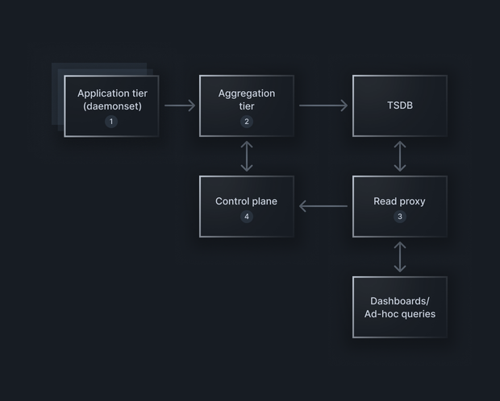

> 编者按：Envoy 作者 Matt Klein 的创业公司 Bitdrift 新推出了可观测性代理开源项目 [Pulse](https://github.com/bitdriftlabs/pulse)。

继[宣布 Capture SDK 源代码可用](https://blog.bitdrift.io/post/announcing-source-available-sdk)之后，我们非常高兴地再次宣布[Pulse](https://github.com/bitdriftlabs/pulse)的可用性，这是一个为大规模度量基础设施建造的观测代理。请阅读以下内容，了解 Pulse 的概述、其创建的简要历史，以及它如何适应更广泛的服务器端观测生态系统。

Pulse 是一个为大规模度量基础设施构建的观测代理，从包括[statsite](https://github.com/statsite/statsite)和[statsrelay](https://github.com/lyft/statsrelay)在内的先前项目中汲取思想，同时提供现代 API 驱动的配置和类似于[Envoy](https://github.com/envoyproxy/envoy)所提供的无损配置重载。

度量指标已经过时了吗？虽然行业趋势确实是向结构化日志转变，作为所有数据的首选来源，这一点在[Capture](https://bitdrift.io/)的移动观测产品中也有体现，但传统的度量指标依然是许多大型组织观测实践的核心。

尽管[OTel Collector](https://github.com/open-telemetry/opentelemetry-collector)、[Fluent Bit](https://github.com/fluent/fluent-bit])和[Vector](https://github.com/vectordotdev/vector)都是优秀的项目，提供一定程度的度量支持，但在处理大规模度量基础设施时尚存在不足，主要体现在：

- 聚合：例如，去掉 pod 标签以衍生出服务级别的聚合度量。对 Prometheus 度量的聚合尤其棘手，因为跨多个来源聚合绝对计数器（与只报告自上次报告以来的增量计数器相比，单调增加的计数器）并非易事。

- 集群化：主要用于更复杂的聚合方法，如在聚合层进行一致性哈希和路由。

- 自动阻塞/省略：基于控制平面驱动配置的自动阻塞和度量点省略是许多组织控制度量增长和成本的重要策略。

该项目填补了这些空白，并提供了一系列与脚本编写、基数发现和限制、网络可靠性等相关的强大工具。

Pulse 也已针对性能进行了大量优化，并已经过严格测试，准备好应对苛刻的工作负载。今天，它已在生产环境中部署，在处理每秒数亿个度量的集群中运行。

## Pulse 的简史

此时，你可能会问自己：“bitdrift 为什么会发布一个服务器端度量代理？我以为 bitdrift 是一家移动观测公司？”Pulse 的由来简史如下。

正如我们[在公开发布时所描述](https://blog.bitdrift.io/post/honey-i-shrunk-the-telemetry)，bitdrift 是从 Lyft 剥离出来的。在剥离之前，bitdrift 团队负责 Lyft 内两个不同的技术部分：

- 现称为 Capture 的移动观测产品。
- 一组管理 Lyft 大规模度量基础设施的技术，专注于整体性能、可靠性和成本控制。这组技术统称为“MME”（度量管理引擎）。

MME 背后的思想将在下文中进一步描述，但 Pulse 代理是所有 Lyft 度量在 Kubernetes pod、聚合层，最终到 TSDB 传输过程中的数据平面。bitdrift 仍然支持在 Lyft 运行 Pulse 及更广泛的 MME 控制平面。

在完成使 Capture SDK 源代码可用的工作后，我们认为现在是发布 Pulse 代码的好时机，因为我们相信这一领域存在显著的行业功能缺口。

## 驱动控制平面的度量方法

作为一个例子，Lyft 度量基础设施的简化版本如上图所示。

- 一个基于 Pulse 代理的 daemonset 从应用程序接收度量，这一层执行初步的转换、批处理、基数限制等操作，然后将度量发送到聚合层。
- 聚合层接收所有度量，并使用一致性哈希确保度量最终被正确路由到处理聚合的节点。一旦在正确的节点上，会发生几件不同的事情：
  - 高级聚合发生（例如，从 pod 度量创建服务级度量）
  - 观测到的度量样本被发送到控制平面
  - 控制平面发送明确阻塞的度量列表（详见下文）
  - 在最终发送数据到 TSDB 的过程中，各种缓冲和重试机制
- 读取代理（未包括在 Pulse 中）位于所有度量用户（仪表盘和临时查询）和度量查询之间，并拦截所有度量查询。它将查询发送到控制平面，以便控制平面了解哪些度量实际上被读取，无论是手动还是通过警告查询。
- 控制平面（也未包括在 Pulse 中，但通过明确的 APIs 进行通信）获取来自聚合层的写入端样本，并将其与读取代理数据合并，以确定哪些度量实际被使用。然后，控制平面根据政策动态创建基于自动阻塞未读取但已写入的度量的阻止列表，这在大规模度量基础设施中通常是所有度量的绝大多数。阻止列表被提供给 Pulse 代理，然后执行内联阻塞和省略度量流，从而显著减少发送到 TSDB 的总点数。

Pulse 允许其所有配置方面都可以动态更新，这与 Envoy 内的可能性类似。这提供了在最终如何使用它方面的大量灵活性。

## Pulse 将如何帮助您？

通过 Pulse，您现在可以通过复杂的聚合和通过明确规定的 APIs 实时控制阻塞规则和省略实现*非常*大的度量节省。Pulse 源代码以这样的方式授权：如果您是最终用户，我们的意图是代码可用并可修改任何目的。拿去构建一些有趣的东西吧！

对于商业支持或讨论 bitdrift 提供的自动度量发现和阻塞处理的托管控制平面的选项，请通过[info@bitdrift.io](mailto:info@bitdrift.io)与我们联系讨论。

我们非常期待您通过[GitHub issues](https://github.com/bitdriftlabs/pulse)或在[bitdrift slack](https://communityinviter.com/apps/bitdriftpublic/bitdrifters)的#pulse 与我们分享问题和使用故事。祝您度量节省愉快！