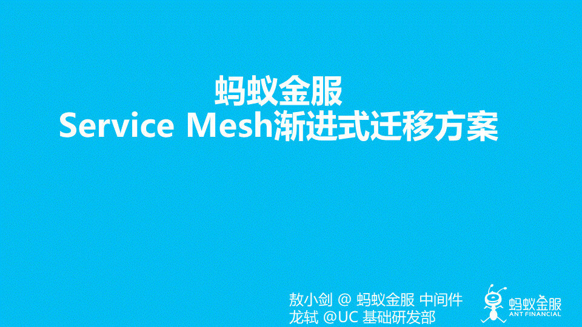

大家好，今天给大家带来的演讲主题是“蚂蚁金服Service Mesh渐进式迁移方案”，给大家介绍一下我们蚂蚁金服主站的Service Mesh迁移方案，在稍后的内容中我会给大家解释什么是“渐进式”。今天的演讲方式有些特殊，将会是两位讲师合作。我是敖小剑，来自蚂蚁金服中间件团队，另外一位讲师 龙轼 ，来自 UC 基础研发部。

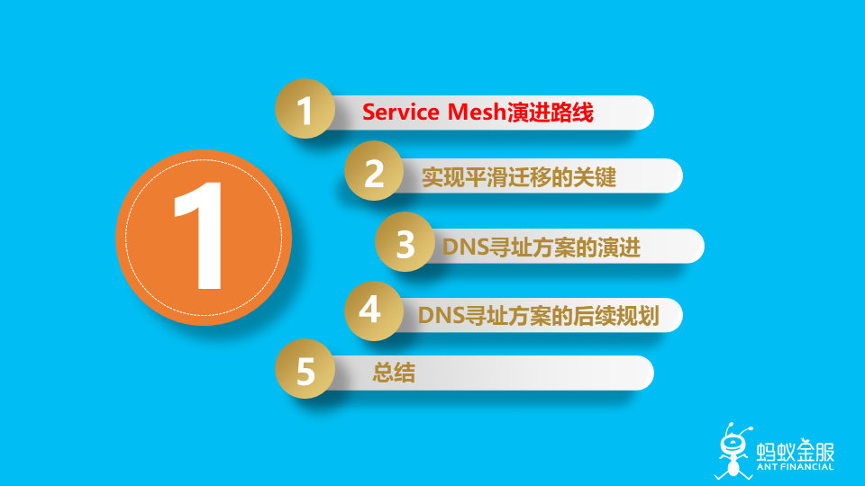

今天的内容将会有四块主要内容：

1. Service Mesh演进路线：介绍蚂蚁金服计划在主站落地Service Mesh的方案，由于涉及到大量的存量应用和超大规模，又要保证迁移过程的平滑，因此我们的落地方案相比社区方案要复杂的多。
2. 实现平滑迁移的关键：介绍在整个迁移方案中，为了实现平滑迁移的几个关键做法，然后今天我们将详细展开其他的一个关键点：DNS寻址方案。
3. DNS寻址方案的演进：详细介绍Kubernetes/Istio/SOFAMesh一路演进过来的DNS寻址方式
4. DNS寻址方案的后续规划：介绍我们在DNS寻址方案上的后续规划

前两块内容将由我来为大家介绍，后两块内容将由我的同事 龙轼 为大家介绍。

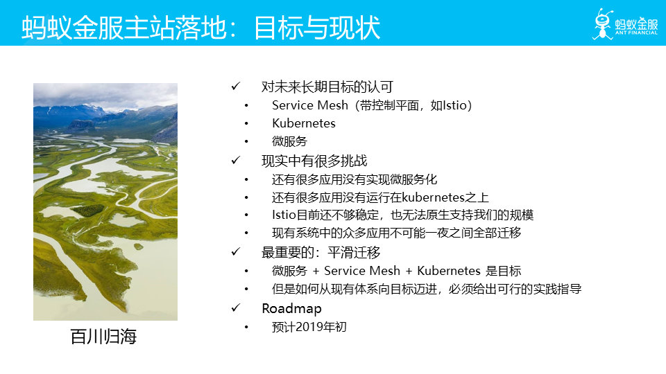

在展开内容之前，先看一下背景，Service Mesh在蚂蚁金服主站落地的背景：

- 目标：需要满足我们对长期目标的认可，具体指服务间通讯走Service Mesh，而且是Istio这种带完整的控制平面的Service Mesh形态，基础设施要构建在k8s之上，而应用的形态要向微服务靠拢。
- 现状：而现实是存在很多挑战，首先还有很多应用没有实现微服务化，而且我们的k8s普及程度也不够，还有非常多的应用没有运行在kubernets之上。Istio的成熟程度也稍显不足，不够稳定，更大的挑战的是Istio目前无法原生支持我们蚂蚁金服的规模，我们还在试图对Istio进行改进和扩展。最后，在落地时必须考虑的非常现实的一点：现有系统中为数众多的应用不可能一夜之间全部迁移。
- 关键需求：因此在落地实施时，非常重要的需求是：要实现平滑迁移。简单说，微服务 + Service Mesh + kubernetes 是我们的目标，但是如何从现有体系出发，向目标平稳和坚实的迈进，必须给出可行的实践指导。

今天演讲的内容，要给大家介绍的就是，在这样的背景下，我们蚂蚁金服选择的Service Mesh主站落地演进方案。这个方案预期会在2019年初全面铺开。

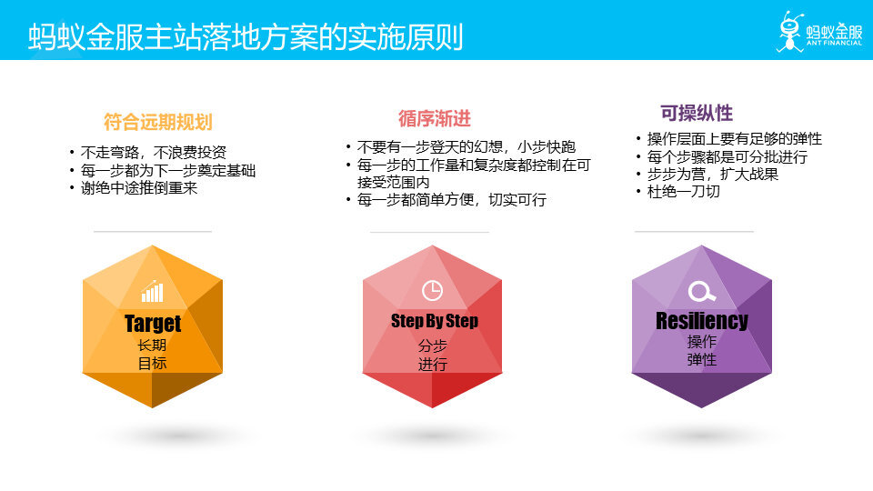

主站落地方案的实施原则，这是我们在过去半年的实践中，总结归纳出来的行为指导：

- 符合远期规划：一定要有清晰的长期目标，明确的知道未来的大方向。避免走弯路，避免浪费投资，理想状态是计划中的每一步都可以为下一步奠定坚实的基础。即使因为某些原因不得已妥协或绕行，也应该清晰的知道后面应该如何回归，谢绝中途推倒重来——代价太高，无法承受。
- 循序渐进：认清现实，如此之大的变革，一定是需要分步进行，不要心存一步登天的幻想，现实可行的方式是小步快跑。将整个过程拆解为若干个大步骤，每一步的工作量和复杂度都控制在一个可以接受的范围内，以保证每一步都简单方便，切实可行。
- 有可操作性：在操作层面上，要有足够的弹性，即每个步骤中的工作内容，都应该是可以分批进行。以步步为营的方式，逐步扩大战果，杜绝一刀切。

在接下来的演进路线中，大家将会体会到这三个原则在实际落地时的指导作用。

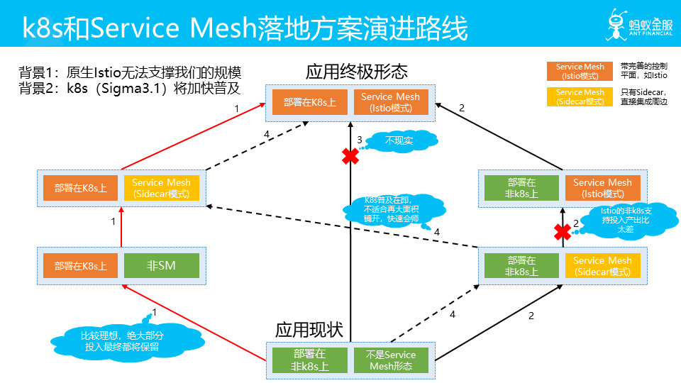

这个图的信息量有点大，描述的是 Service Mesh 和 k8s 落地可能的多种演进路线。

我们先从最下面开始看，这是当前蚂蚁金服主站大多数应用的现状：即应用"部署在非k8s上"，应用也"不是Service Mesh形态"。 然后看最上面，这是我们期望的蚂蚁金服主站未来的应用终极形态：应用"部署在k8s上"，应用也迁移到了"Service Mesh形态"。

这里有个特别的地方，我们将Service Mesh形态细分为两种模式：

1. Sidecar模式：只有Sidecar，没有控制平面，和外部系统的各种集成都是在Sidecar中直接进行。这是第一代的Service Mesh，Linkerd/Envoy都是如此，华为基于ServiceComb演进而来的mesher，新浪微博的Mesh，包括我们蚂蚁金服基于MOSN开发的用于取代多语言客户端的Mesh方案。
2. Istio模式：有完善的控制平面，可以提供强大的控制能力，而且从数据平面分离，这是第二代的Service Mesh，典型如Istio和Conkduit/Linkerd 2.0。

之所以将Service Mesh形态细分，是因为我们有着这样一个特殊背景：目前的原生Istio无法支撑我们蚂蚁金服的规模，因此在改进完善Istio之前，我们不得不暂时在Sidecar模式下短暂停留。另外一个原因就是考虑到存量应用的迁移，多一个Sidecar模式作为中间缓冲，会让整个迁移过程平滑很多。

现在我们来介绍图中展示的四条演进路线：

1. 左边的路线1，思路是先将应用迁移k8s部署，再迁移到Service Mesh形态。这条路线的最大好处，是过程中每个阶段的绝大多数投资都将最终得以保留，因为符合k8s+service mesh的远期目标
2. 右边的路线2，思路是跳过k8s，先迁移到Service Mesh形态，一路演进到Istio模式，然后最后迁移到k8s。
3. 中间的路线3，直接一步到位，这个路线是Istio默认的方式，或者说Istio根本没有考虑过迁移的问题，默认客户已经有完善的k8s，然后将改造好的应用直接部署在Istio上。这个路线对于蚂蚁金服主站的复杂场景，当然是不现实的。（补充：只是对蚂蚁金服主站不合适，对于大多数公司，规模不是那么巨大，也没有历史负担，也有k8s基础，完全可行。）
4. 还有一条特别的路线4，走位飘忽，先和路线2一样迁移到Sidecar模式，然后走回路线1，上k8s，再在有k8s支持的情况下继续演进到Istio模式。

下面我们来详细分析各条演进路线的优劣和实施条件。

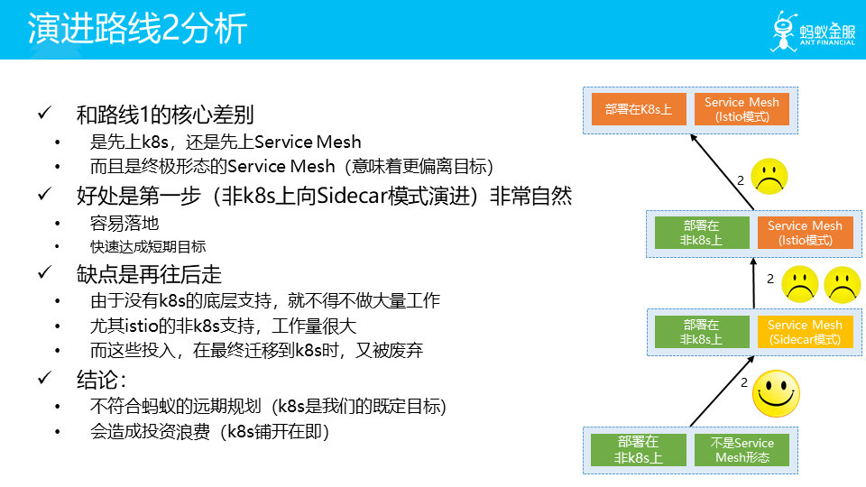

演进路线2，和路线1的核心差别，在于：是先上k8s，还是先上Service Mesh。而且路线2是在非k8s条件下一路演进Service Mesh到我们期望的终极形态Istio模式，这意味着过程中和最终目标有非常大的偏移。

演进路线2的好处，在于第一步非常的自然：

- 没有k8s的限制，因此不依赖基础设施，实施方便。毕竟，k8s普及度是个大问题
- 在原有的侵入式框架的客户端SDK基础上，通过包裹一个proxy，重用原有SDK的能力，可以非常快速的得到一个基本可用的Sidecar
- 除了多一个proxy外，没有引入太多的新概念和新思想，符合现有开发人员/运维人员的心智，容易接受

因此，路线2特别容易落地，可以快速达成短期目标，直接拿到Service Mesh的部分红利，如：多语言支持，方便类库升级等。

但是，这个路线的问题在于再往后走，开始完善Service Mesh的功能以向Istio模式靠拢时，由于没有k8s的底层支持，因此不得不做大量的工作来提供类k8s的功能。尤其是Istio的非k8s支持，官方方案基本上只是一个demo，完全不具备生产可用性，要完善好，工作量很大。而关键点在于，这些投入，在迁移到k8s时，又因为和k8s提供的功能重复而被放弃。

因此，结合我们前面的原则（符合远期规划，不浪费投资），路线2对蚂蚁金服主站落地是不合适的。

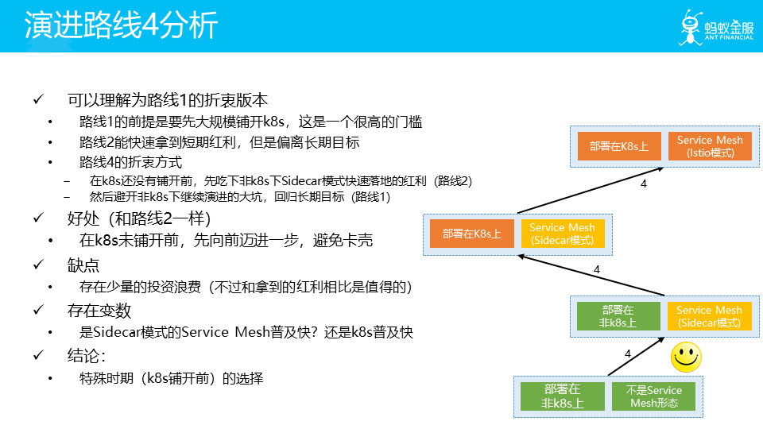

演进路线4是一个非常特殊的路线，可以理解为路线1（先上k8s再上Service Mesh）的短期妥协版本。因为路线1的前提条件是要先大规模铺开k8s，将现有应用迁移到k8s之后再继续往Service Mesh演进，这对于还没有普及k8s的公司来说是一个非常高的门槛，很容易因此受阻而无法启动。

因此，如果暂时不具备k8s条件， 又不想就此止步，那么选择路线2是唯一的出路。而上面我们分析过，路线2虽然能够在第一步快速拿到短期红利，但是由于偏离长期目标后续发展会有问题。怎么办？

路线4可以是这种场景下的一个折衷选择：在k8s没有铺开之前，第一步沿路线2走，先吃下非k8s下Sidecar模式快速落地的红利。然后第二步避开非k8s下继续演进到Istio模式的大坑，切换到路线1，回归长期目标。

好处非常明显：

- 在k8s未铺开前，先往前迈进一步，避免就此卡壳
- 和路线2一样，第一步可以快速的拿到短期红利
- 后续转为路线1后，因为符合远期规划，因此后续演进不存在投资浪费的问题

缺点就是存在少量的投资浪费，毕竟非k8s下的Sidecar模式还是有些工作内容在迁移到k8s之后会有改动。不过，这个改动不会太大，和拿到的红利相比还是值得的。

路线4在操作时，存在一个变数：现有应用在向Sidecar模式的Service Mesh迁移，是需要一定时间的。有一种可能，就是在迁移过程中，k8s的普及开始了。这个变数的发生，取决于Sidecar模式的Service Mesh普及快，还是k8s的普及快。

对路线4的分析结果：这是（k8s没有普及的）特殊时期的选择。

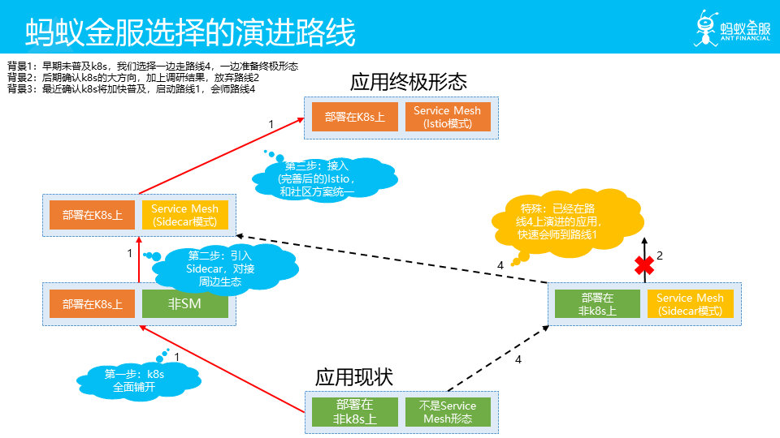

在对四条可能的演进路线分析完成之后，我们来具体介绍蚂蚁金服的最终选择。

坦言说，在过去半年中，我们的演进路线有几次摇摆和修订，今天我们公布的路线，和过去几个月中我们通过 meetup/技术大会/博客文章 等方式透露出来的方式会有一些变化。主要原因是在过去的这半年中，一方面我们对Sercice Mesh的认知更加深入，另一方面是蚂蚁金服的k8s背景也在变化。

首先，在今年年初，我们确认Service Mesh大方向时，k8s还没有在蚂蚁金服普及，而且也没有明确的时间表。因此，我们在一番调研之后，选择了两条腿走路的方式：

1. 在非k8s环境下，以Sidecar模式先进行少量落地，主要是替换掉原有的多语言客户端 （拿短期红利）
2. 开发SOFAMesh，集成MOSN到Istio，增加对多种RPC协议的支持，增加对RPC服务模式的兼容（为最终目标做准备 ）

在今年6月底的杭州第一届Service Mesh 线下 meetup 中，我们公布了 SOFAMesh 项目，我当时做了一个演讲 [大规模微服务架构下的Service Mesh探索之路](https://skyao.io/publication/201806-service-mesh-explore/) ，有兴趣的同学可以去回顾一下我们当时的背景/需求/设计方案。

大概在今年九月，我们完成了对非k8s下运行istio的深入调研，得出的结论是要实现这个模式需要非常多的工作。而且，我们对Service Mesh的认知也更加深刻，明确了通过Service Mesh将传统中间件能力向以k8s为代表的基础设施层下沉的战略方向。期间，内部也明确了k8s普及的大方向，因此，综合这两个重要输入，我们选择放弃继续在路线2上继续演进（即 istio on 非k8s）的想法。关于这一点，有兴趣的同学可以去阅读我在10月份QCon大会上的演讲内容 [长路漫漫踏歌而行：蚂蚁金服Service Mesh实践探索](https://skyao.io/publication/201810-ant-finance-service-mesh-practice/) 。

最近，k8s普及的时间表再一次明确提前，蚂蚁金服将会在短时间内开启k8s的大面积普及。因此，我们的演进路线再一次发生变化。目前最新的演进路线将会是这样：

1. 当前还没有开始迁移的应用（处于演进路线图最下方），将按照路线1的方式进行迁移：先迁移到k8s，再迁移到Sidecar模式的Service Mesh
2. 目前部分已经迁移的应用（路线2/4的第一步，非k8s部署的 Sidecar 模式），将沿路线4迁移，和路线1会师
3. 由于应用众多，因此预计到 k8s + Sidecar模式 的迁移工作会持续比较长时间，在此期间，我们会同步完善Istio，和Istio官方一起合作来实现Istio对超大规模部署的支持
4. 最后一步，迁移到最终目标（当然这一步的方案依然有很多待定内容，继续努力）

需要强调的是：这个演进路线针对的是蚂蚁金服主站的特殊场景，并不具体普适性。大家可以在理解我们演进路线背后的思路和权衡方式之后，再结合自身的实际情况进行决策。比如，我们在UC落地时，由于UC有完善的k8s支持，而且目前落地的规模没那么夸张，因此是直接从"部署在k8s上" + "不是Service Mesh形态"，直接迁移到终态的。预计在金融云落实时，也会是如此，因为客户也不会有如此规模。

总结：前面我们介绍了当应用程序向Service Mesh和K8s迁移时的几种可能的演进路线，分析了各条路线的利弊。并以蚂蚁金服主站为例，介绍了我们迁移的背景和演进路线的选择思路，希望能够帮助大家更好的理解Service Mesh的落地实践，以便在未来设计自家的落地方案时能有所参考。

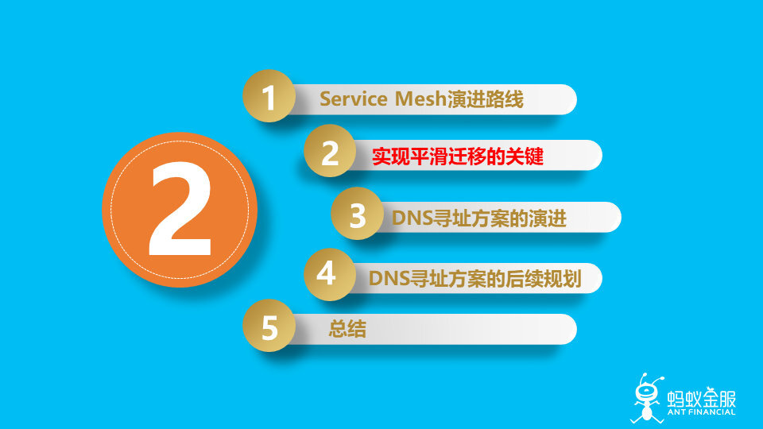

前面给大家介绍了蚂蚁金服主站的Service Mesh演进路线，期间谈到要实现现有应用的平滑迁移。今天的第二个内容，将给大家介绍平滑迁移实现中的几个关键做法。

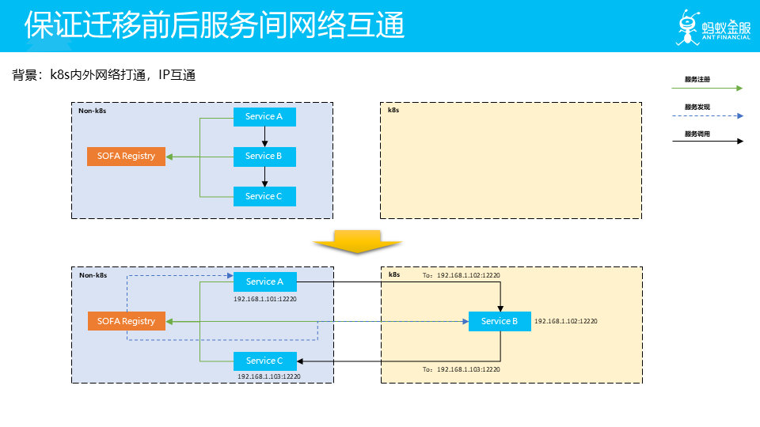

首先，第一个关键是尽量保证迁移前后服务间网络互通。

以向k8s迁移为例，在非k8s环境，典型的服务间访问方式是这样：

- 每个服务向注册中心注册
- 客户端发起访问前，通过注册中心得到目标服务的实例列表信息，如IP地址/端口等

在向k8s迁移的过程中，我们的做法是保证k8s内外网络打通，即服务的IP地址（在k8s中是pod ip）是可以相互直接访问的。基于这个前提，服务在迁移到k8s的过程中，原有的服务注册/服务发现/发起请求等逻辑都无需修改，是不是在k8s内，是不是pod ip，对原有服务化体系完全是透明的。

因此，向k8s的迁移可以做到对业务应用非常的平滑，基本感知。

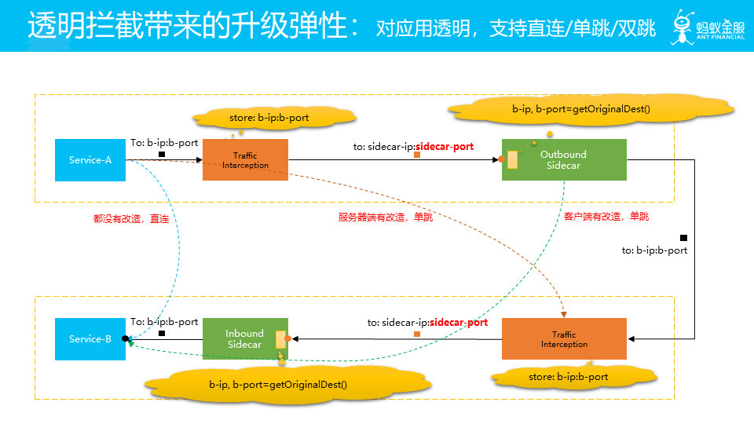

透明拦截在迁移过程中，可以起到非常关键的作用。

以Service-A要访问Service-B，在应用向Sidecar模式的Service Mesh迁移前后，会有有四种排列组合场景：

1. Service-A和Service-B都没有迁移到Serive Mesh：此时请求会直接从Service-A发送到Service-B，称为直连，这是应用在开始迁移到Service Mesh之前的标准工作方式
2. Service-A已经迁移到Service Mesh，Service-B还没有：此时Service-A发出来的请求，会被劫持，然后发送到和Service-A一起部署的Sidecar（称为Outbound Sidecar），此时链路中只有一个Sidecar，称为（客户端）单跳
3. Service-B已经迁移到Service Mesh，Service-A还没有：此时Service-A发出来的请求，在到达Service-B时，会被劫持到和Service-B一起部署的Sidecar（称为Inbound Sidecar），此时链路中也只有一个Sidecar，称为（服务器端）单跳
4. Service-A和Service-B都迁移到Serive Mesh：此时Service-A发出来的请求，会被两次劫持，分别进入Outbound Sidecar和Inbound Sidecar，此时链路中有两个Sidecar，称为双跳。这是Istio的标准工作模式，也是我们迁移完成之后的最终工作模式。

在这四种场景中，所有的网络请求，请求报文都是完全一致的，即不管是否被劫持到Sidecar，对请求报文都没有影响，也就是对发出请求报文的客户端和接受请求报文的客户端都是透明的，完全无感之。

因此，在迁移过程中，可以单个服务逐个迁移，甚至服务的单个实例逐个迁移，而无需修改应用本身。

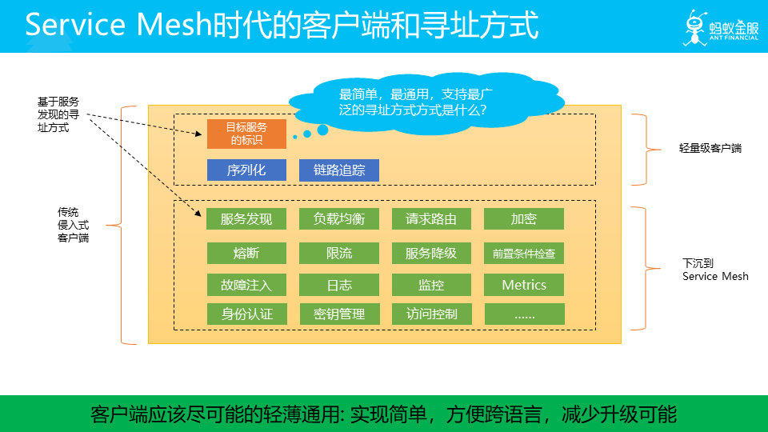

在展开第三个关键点之前，我们来探讨一下：在Service Mesh时代，理想的客户端应该是什么样子？

图中我们列举了一个传统的侵入式框架的客户端所包含的功能，在侵入式框架中，大部分的功能都是由客户端实现，因此会包含非常多的功能，如服务发现、负载均衡等基本功能，加密、认证、路由等高级功能。在应用迁移到Service Mesh之后，这些功能都下沉到Service Mesh中。因此，Service Mesh下的客户端可以进行大幅度的简化，成为一个新的轻量级客户端。

对于这个轻量级客户端，我们希望可以尽可能的做的轻薄通用：实现简单，不管哪个编程语言都可以做到轻松实现，因此跨语言就方便了。而且越简单之后升级的可能性就会越少，以避免升级客户端。

那我们来继续看，这个轻量级客户端里面最后还能剩下什么内容？

图中列出了三个，其中最重要的，也是必不可少的是目标服务的标识，即无论如何简化，最低限度应该告之要访问谁吧？然后是序列化，对于RPC类肯定需要提供编解码功能，不过对于HTTP/REST类很多语言直接内置了标准实现。然后链路追踪，需要做一点工作来传递诸如SpanID之类的参数，同样这块也有可能通过自动埋点来实现。因此，最理想最单薄的客户端，可能只保留最后一个信息：目标服务的标示。

在侵入式框架下，目标服务的标示是和服务注册/服务发现是直接关联的，这个标示通常都是服务名，通过服务发现机制实现了一个服务名到服务实例的寻址方式。在Service Mesh机制下，由于服务发现机制被下沉到Service Mesh中，因此只要底层Service Mesh能支持，这个目标服务的标示可以不必拘泥于服务名。

那么，问题来了，对客户端来说：最简单，最通用，支持最广泛的寻址方式是什么？是DNS！

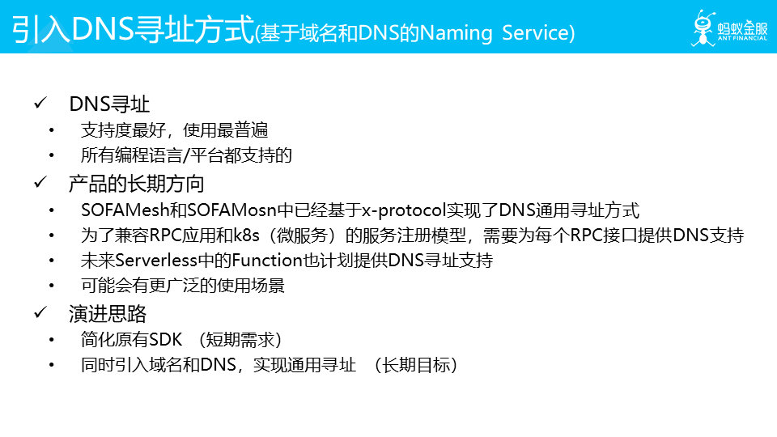

在我们的迁移方案中，我们考虑引入DNS寻址方式。除了前面说的DNS是支持度最好，使用最普遍的寻址方式，在所有的编程语言和平台上都可以支持之外，我们还希望将DNS寻址方式作为未来产品的长期方向：

- 在SOFAMesh和SOFAMosn中，我们已经基于名为x-protocol的方式实现了DNS通用寻址方式，用来解决Dubbo/HSF/SOFA等传统SOA服务模型在Service Mesh下的访问问题 （备注: 具体内容请见我的博客文章 [SOFAMesh中的多协议通用解决方案x-protocol介绍系列(1)-DNS通用寻址方案](https://skyao.io/post/201809-xprotocol-common-address-solution/) )
- 未来在我们的serverless产品中，我们希望可以为运行其上的Function提供DNS寻址支持
- 可能还会有其他更加广泛的使用场景。

因此，在我们的演进过程中，对于客户端SDK，我们有这样一个思路：

- 一方面简化原有的SDK，去除和Sidecar重复的内容（满足短期需求）
- 另一方面，考虑到必然有一次客户端SDK的更换过程，那么我们希望在简化的同时引入基于DNS的通用寻址方式，以便在未来的后续迁移和功能扩展中可以依托这个机制来实现 （符合长期目标）

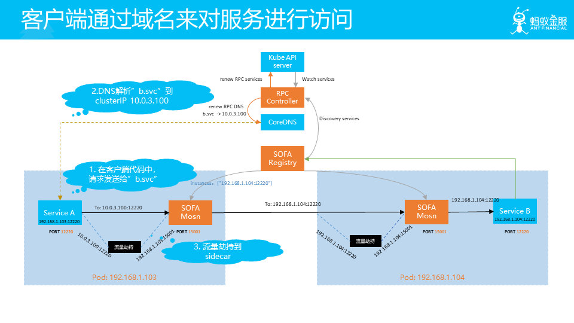

图中描述的是在Service Mesh下，客户端通过域名来指定要访问的目标服务，然后通过DNS解析机制来串联底层的服务注册/DNS记录更新/透明劫持传递原始信息/Sidecar查找路由目标等详细实现机制。

这里仅做简单示意，我就不详细展开了。在接下来的内容中，我的同事，来自UC基础研发部的 龙轼 同学，将为大家详细的展开DNS寻址方案的细节实现。

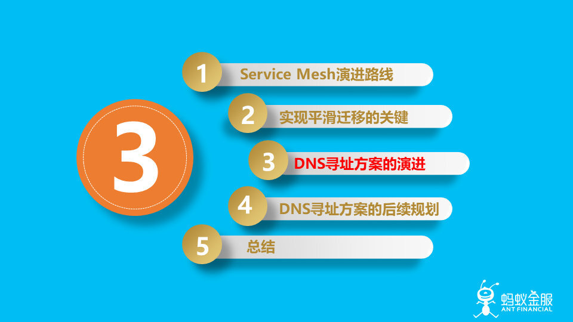

大家好，我是来自UC基础研发部的龙轼。 感谢小剑老师给我们介绍了蚂蚁和UC共建的Service Mesh的演进路线和实现平滑迁移的关键。

接下来由我来向大家分享下实现平滑迁移的关键中的DNS寻址方案的演进。

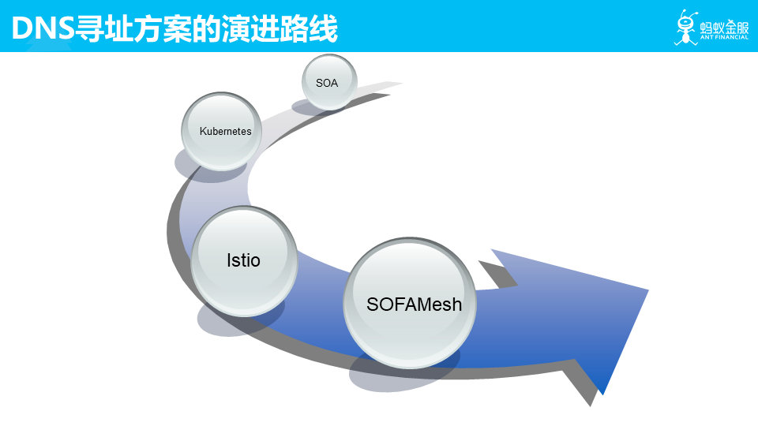

大家可以看上面的所示的DNS寻址方案的演进，我们先了解下各个服务寻址方案的背景。

从 SOA 的寻址，到 Kubernetes 的寻址，然后再到 Istio 的寻址，最后是我们的 SOFAMesh 的DNS寻址方案。 

它们的寻址方案有什么不同，我们将一一分析它们的细节和总体寻址方案的演进路线。

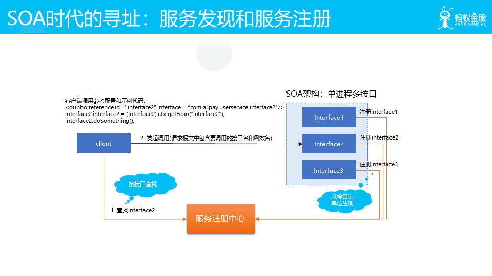

现在大家可以先来看下 SOA 架构下基于服务注册和服务发现的寻址。

我们可以看到图中的 SOA 其实是单进程多接口的，依赖于 SOA 的服务注册与服务发现的。

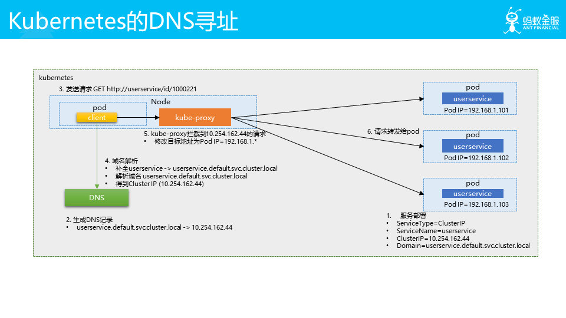

接下来我们看下 Kubernetes 的 DNS 寻址方式，它的寻址方式其实是通过DNS 的。 

从图中我们可以看到部署到K8S 上面的userservice 服务会生成一条DNS记录指向K8S 的ClusterIP。 

我们在 Pod 里面发起请求时通过 DNS 的 SearchDomain 域名补全规则就会从 DNS 里面查询得到ClusterIP，我们可以看出 Kubernetes 的寻址方案是单进程单接口的。

看完 Kubernetes 的服务发现之后我们继续来看 Istio 的服务发现。 

从图中我们可以看出之前的流程都和 K8S 一脉相承，不同的地方在于 Istio 里面有个 SideCar 它把ClusterIP 拿到之后根据 ClusterIP 从 VirtualHost 里面匹配到 Rule 规则 转发给目标的 Pod 地址。

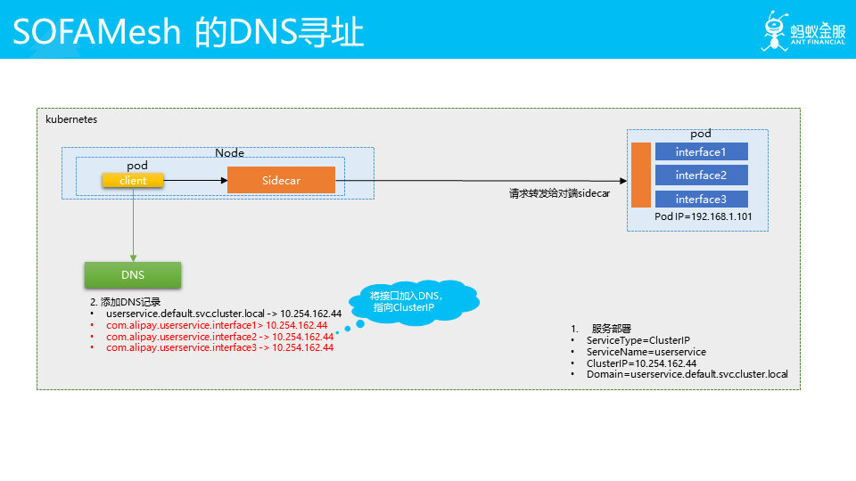

最后我们来看下 SOFAMesh 的 DNS 通用寻址方案。 

1. 根据我们之前分析的 SOA 寻址方案和 Kubernetes 寻址方案，我们可以看出如果我们的微服务不经过拆分和改造想上 Service Mesh 的话我们需要支持SOA之前的那种单个Pod 多个接口的。 
2. 从图中看就是我们需要支持 `com.alipay.userservice.interface1`, `com.alipay.userservice.interface2` 这些接口解析到 ClusterIP, 我们知道k8s 中的service 是不支持的。
3. 那该如何是好，我们只能在DNS 上做文章修改DNS的记录来实现这一功能。确定了这一方案之后我们来看下我们设计的DNS寻址方案实现细节。

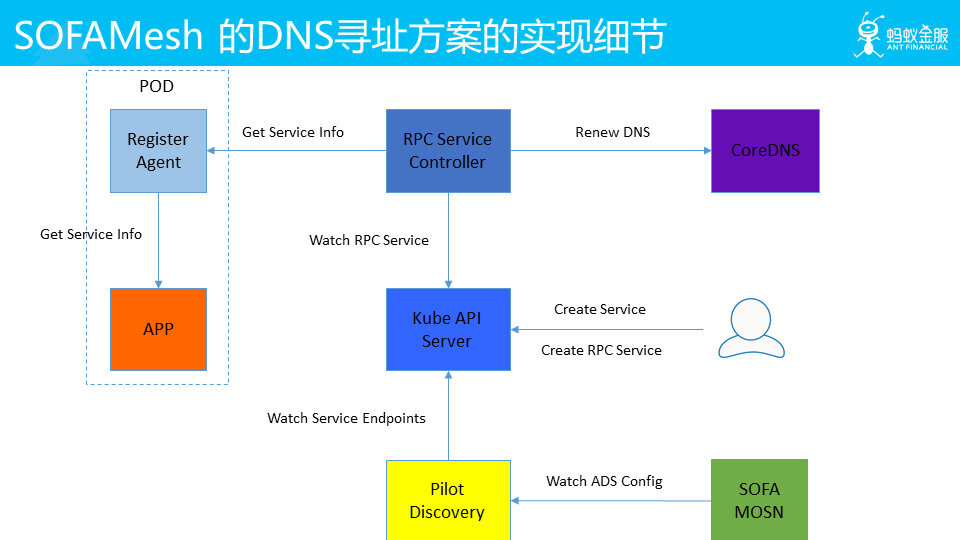

大家看这张图:

1. 我们用 CRD 定义了一个 RPCService 和之前的 Service 有同样的 selector 的标签。 
2. 然后用 RPC Service Controller 对 RPCService 做 Watch，当 RPCService 有更新的时候我们就把接口就是上述的 `com.alipay.userservice.interface1` 的记录写入 CoreDNS 里面 
3. 而 interface 是通过 Pod 里面的 Register Agent 来获取 Dubbo 里面暴露的。

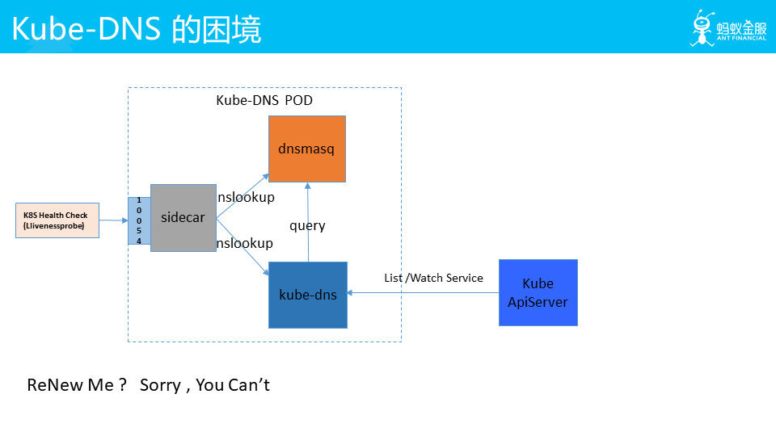

好的，说完这个方案的细节之后。我们可以看出其实其他的问题都不大，但是要更新DNS的这个我们需要支持。

一开始我们 K8S 集群里面是用 Kube-DNS 来做 DNS 寻址的，但我们看这张 Kube-DNS 的架构图。 

可以看出修改它成本是比较大的，而且所有的DNS 都在同一个域里面，这个风险系数很高。 如果一旦修改错误势必会影响到之前的 k8s 的 service，导致线上的故障。

1. 这个时候我们跟踪到社区的 CoreDNS 项目，我们来看下 CoreDNS 的具体的架构。  它采用作为 Web 服务器 Caddy 的服务器框架，延用了Caddy 中的插件机制，大大的增加了 CoreDNS 的灵活性。 
2. 它的插件机制也特别简单，把所有的插件注册进一个Map里面来，在调用的时候从Map拿出他们有共同接口的函数。有兴趣的同学可以看下 Caddy 的插件代码实现。  
3. 它的 DNS 协议库采用是由 Google 工程师 Meikg 开发的 DNS 库，他同时也是 SkyDNS 的开发者。 
4. 后端可以采用 UDP/TCP、TLS 或者 gRPC 作为后端数据查询。上面有个Google工程师用 gRPC 做了一个 CoreDNS 插件的后端数据查询例子，有兴趣的同学可以看下。

OK，既然 CoreDNS 的 Plugins 这么强大，我们可不可以用它来实现我们刚才说到的 Renew DNS的机制。 答案很显然是可以。

我们看下上面的图，实现CoreDNS 的插件很简单，只需要继承上面的接口就可以了。 CoreDNS 官网有具体的教程在教我们怎么写一个插件。这个就不具体的展开了。

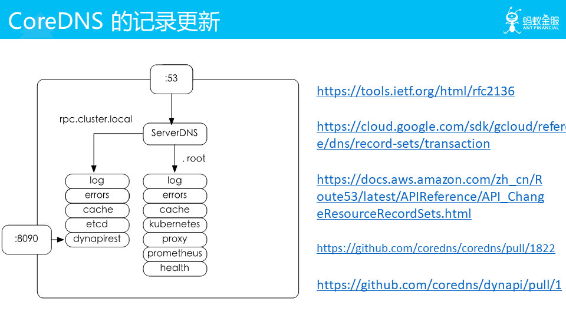

1. 到了我们最关键的点了：我们应该怎么更新我们的DNS。其实这点 CoreDNS 社区里面已经有人提出需求用 REST API 的形式提供更新 DNS 的接口。
2. 互联网任务工程小组也早在 rfc2136 定义了标准的 DNS UPDATE。 Google Cloud 和AWS 都有相应的实现。 
3. CoreDNS 社区其实已经把接口实现了，但是后端存储是基于file 的，数据没有落地。 蚂蚁和UC 这边扩展了 ETCD 插件的接口，把对应 DNS UPDATE 接口给实现了，实现 DNS 数据写入ETCD 里面。 
4. 从图中我们可以看到 `rpc.cluster.local` 这个域 和 k8s 域 cluster.local 是在不同的插件链上的。
   这样在k8s域中没有 dynapirest 插件，我们就不能对k8s域中的DNS进行更新，这样就把之前Kube-DNS改造之后会对k8s域里面造成影响给去除了，更加的安全。

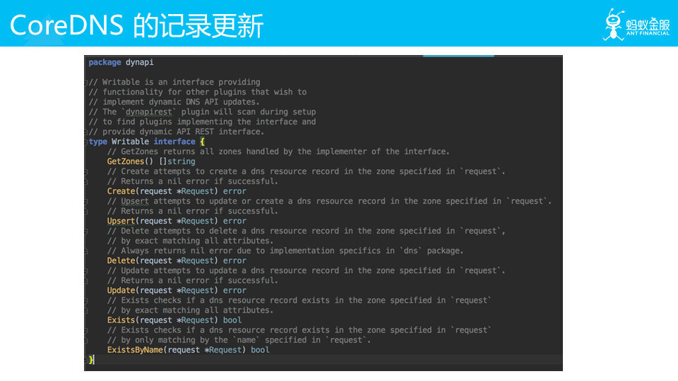

我们可以看下 CoreDNS 后端存储的接口，其实和我们之前对数据操作的接口是没有什么差别的。

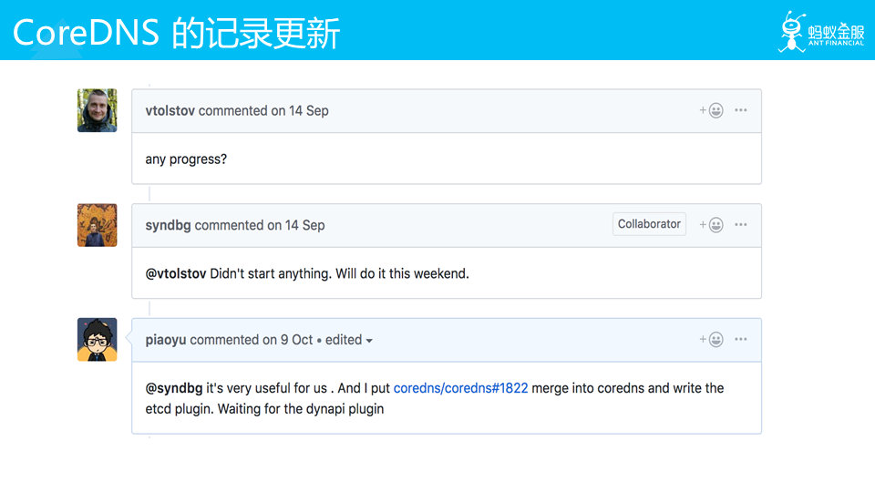

目前 CoreDNS 的 DynAPI 还在主库代码没合并的状态。之后 DynAPI 这个项目会独立成一个插件项目。我们可以看下 CoreDNS 社区的 DynAPI 插件进展。

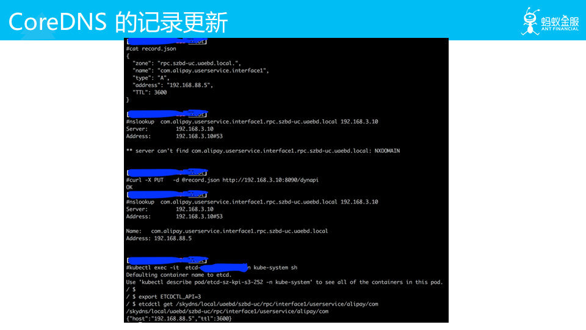

OK，我们来看下我们的DynAPI 实现DNS 更新的一个效果。从图中我们可以看出 record.json 里面的一个域名的更新。通过 DynAPI 我们成功把 record.json 的DNS 记录给更新进去并且dns正常工作了。到现在我们通过CoreDNS 的插件就把DNS 更新的需求给解决了。

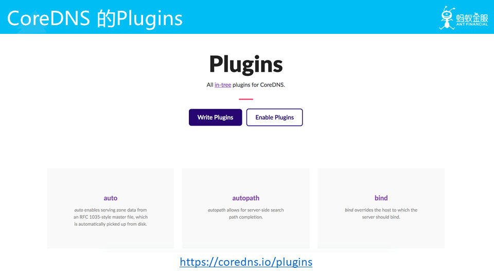

其实CoreDNS 官网还有许多有趣的插件，可以丰富 CoreDNS 的功能和提升 CoreDNS 的性能。 大家可以看下中间的 autopath 插件，他把我们多次的在 searchdomain 拼凑的 DNS 记录的查询在在服务器上给实现了。 避免了多次的 Client 端和 Server 端的数据交互。有兴趣的同学可以看下 [A-Deep-Dive-into-CoreDNS-2018](https://github.com/coredns/presentations/blob/master/A-Deep-Dive-into-CoreDNS-2018.pdf)。

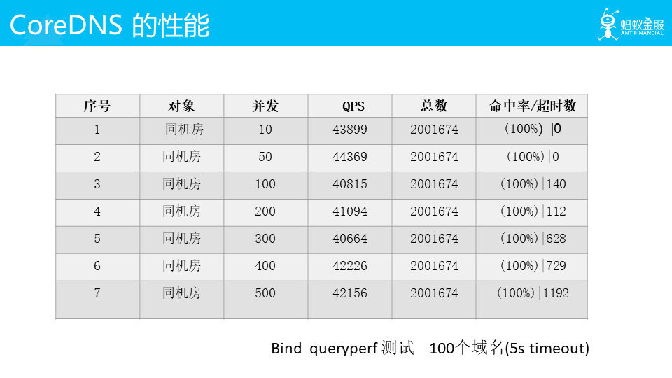

我们把 CoreDNS 的功能开发完了，上线的话很多人关注它的性能。 我们这边做了一个简单的性能测试，可以看出 CoreDNS 和 Bind DNS 这种现在比较通用的DNS的性能还是有点差距的。

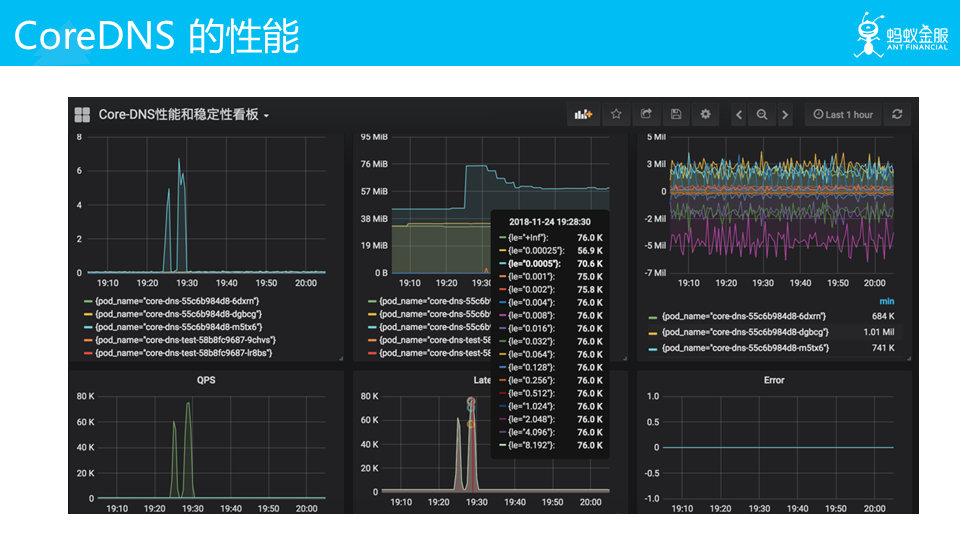

但是,我们通过上面的图可以看到在一定的QPS 下，CoreDNS 的延时是很低的。 我们可以看到所有的延时都落在4ms 之内。

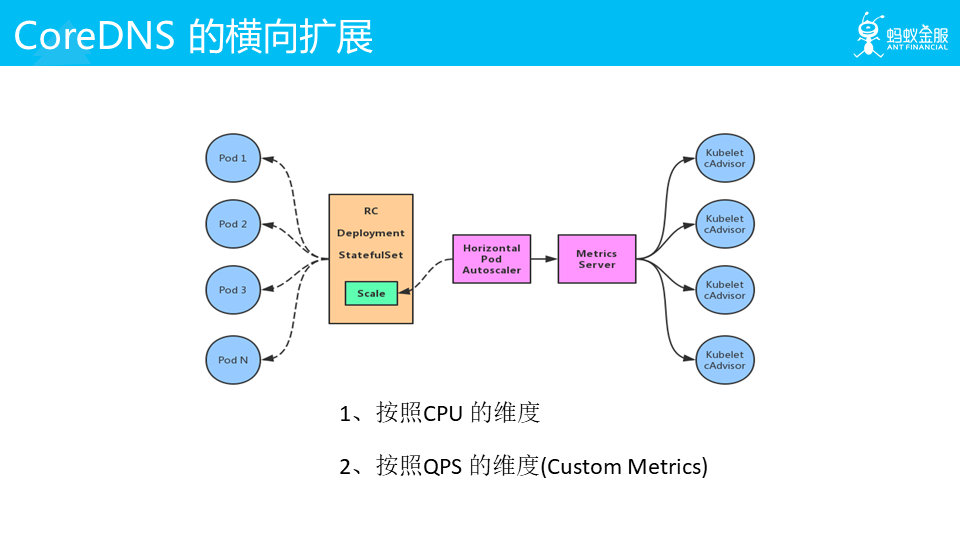

为了解决QPS的问题，我们通过 Kubernetes 的 HPA 给 CoreDNS 进行横向的扩展。

一开始我们只是通过CPU的维度给 CoreDNS 扩展，但发现波动有点大。 之后我们切换成通过QPS的维度来进行扩容。

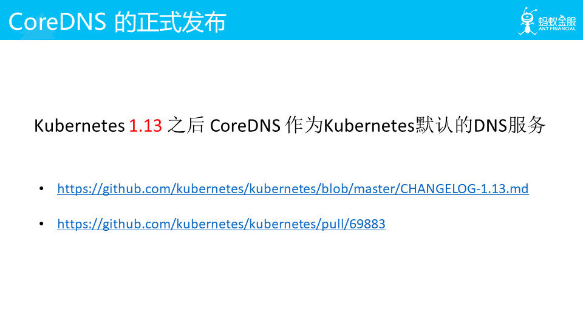

CoreDNS 将会在Kubernetes 1.13 之后成为 Kubernetes 的默认的DNS服务。我们将会紧跟社区实施我们的方案并且反馈给社区。

我们再来看下我们后续的一些规划。

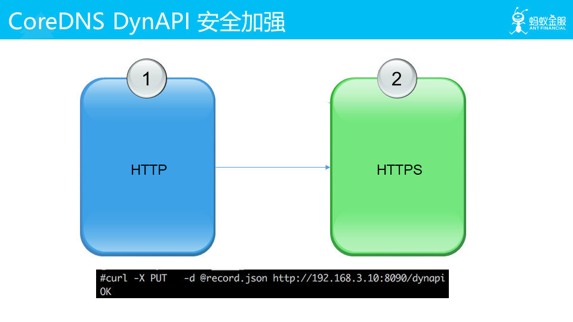

可以看到我们的 DynAPI 其实在安全上还是有欠缺的。我们后续会把 HTTP 加强成 HTTPS 协议来增强 DynAPI 的安全性。

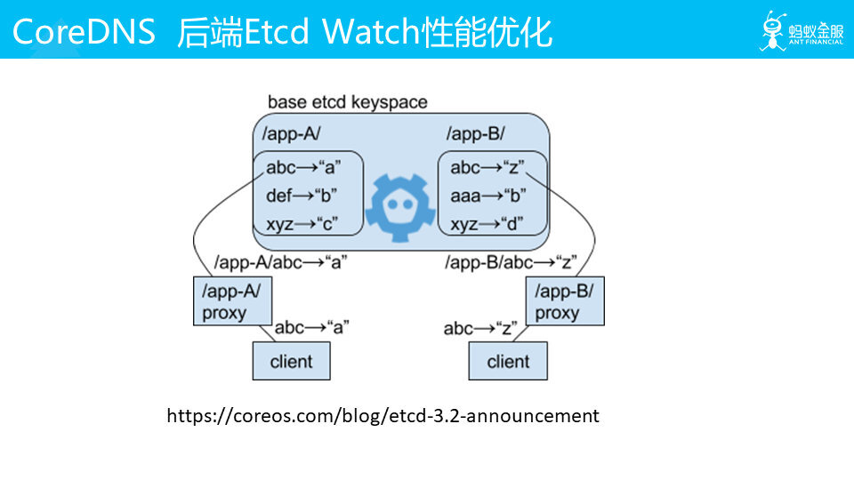

还有如果我们 CoreDNS 的后端变化的更新的 Watch 由于 Watch的范围过大的话，会返回过多的数据。这样会影响到 Watch 的性能，CoreOS 在 ETCD3.2 增加了proxy 可以让我们根据不同的 ETCD KeySpace 去Watch,这样大大的提高了Watch的性能。

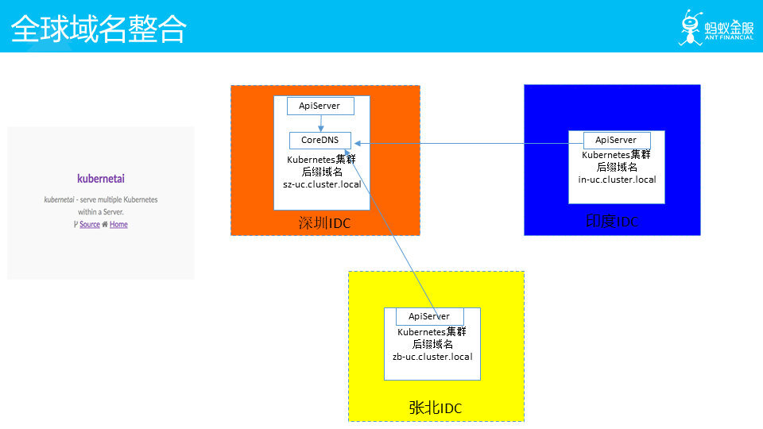

最后一个，我们建议在创建 Kubernetes 集群的时候把 idc 的信息给带进Kubernetes的后缀域名中。这样我们之后可以通过 kubernetai 插件把不同的 Kubernetes 集群的域名进行整合通过本 IDC 缓存提高跨 IDC DNS 的访问速度。

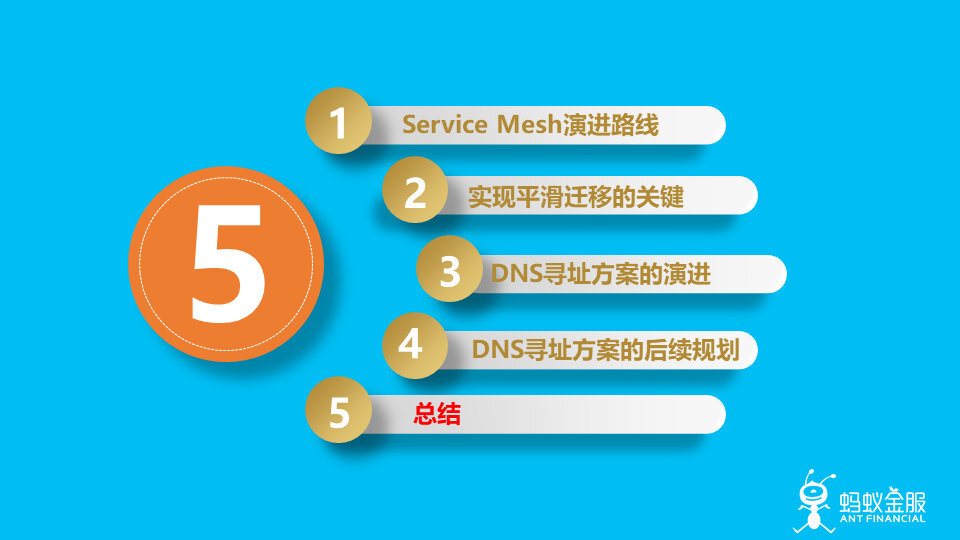

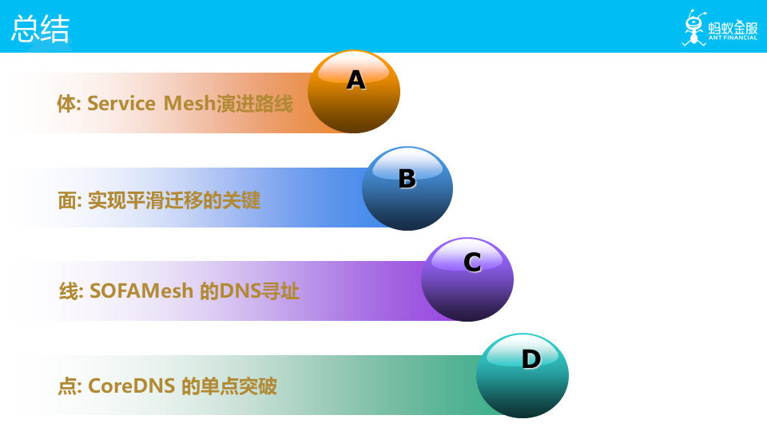

最后我们总结下，总体方面小剑老师给我们讲了蚂蚁金服主站 Service Mesh 的渐进式演进路线和实现平滑迁移的几个关键。 具体细节方面我们通过CoreDNS 的单点突破解决了 SOFAMesh 的 DNS 寻址的问题。

感谢大家，希望这次演讲能让大家有所收获。
