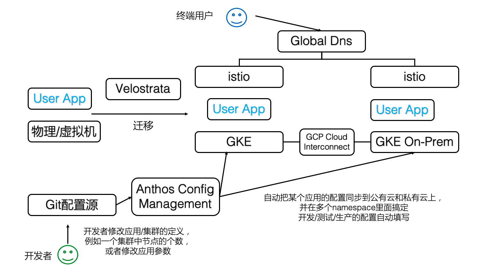
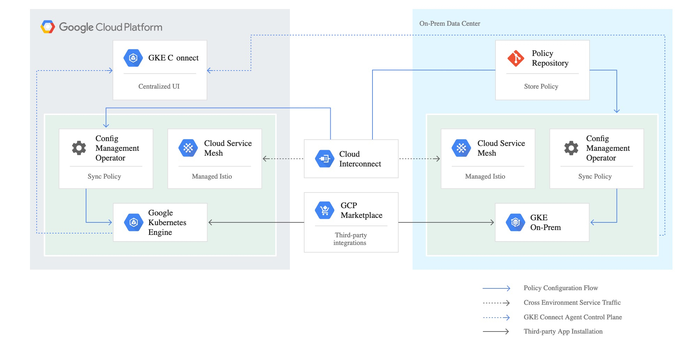

> 本文通过对 Google 近期发布的 Anthos 混合云产品的核心组件 Anthos Config Management 进行分析，探究其背后设计的核心理念——Infrastructure as Code 是如何推动业内一直以来非标准的混合云慢慢走向标准化、供应商无锁定化。

## 0. Anthos Config Management 是什么？

### Hello World Demo

大家可以看 Arctiq 公司搞的修改 node 数量 Demo：<https://www.arctiq.ca/our-blog/2019/4/9/gke-on-prem-and-anthos-config-management/>

简单说，当你修改某个 git 管理下的 yaml 配置文件，里面描述了某个 GKE 私有集群某个 cluster 的 node 数量，然后 Anthos Config Management 会帮你自动的发命令并让节点数量变成你想要的那个。

### Anthos 是啥？

是 Google 发布的混合云多云平台

1. GKE：Anthos 的命令和控制核心。用户通过 GKE 的控制平面来对分散在 Google 云、私有数据中心一级其它云平台上的基础设施进行管理。
1. GKE On-Prem：Google 推出了一个基于 Kubernetes 的和 GKE 一致的软件平台。用户能够在任何的兼容硬件上部署这一产品，而 Google 将会对其进行管理。从升级 Kubernetes 版本到应用最新补丁，Google 都视其为 GKE 的逻辑扩展。尤其需要注意的是 GKE On-Prem 运行在 VMWare vSphere 6.5 的虚拟化基础上，Hyper-V 和 KVM 等其它虚拟化技术的支持还在开发之中。
1. Istio：这一技术让跨平台的联邦网络管理成为可能。Anthos 需要为部署在不同数据中心、GCP 以及其它云上的多种应用程序的组件建立服务网格，Istio 自然是首选。它会和 VMWare NSX、Cisco ACI 以及 Google 自己的 Andromeda 等 SDN 进行无缝集成。已经在网络设施上（例如 F5）进行投资的客户，可以将 Istio 和负载均衡及防火墙集成起来。
1. Velostrata：Google 在 2018 年收购了这一云迁移技术，来增强 Kubernetes 的竞争力。Velostrata 的主要功能——在 GCE 实例中复制物理机/虚拟机，并把现有虚拟机转换为 Kubernetes 应用（Pod）。这是业界首个物理机到 Kubernetes 的迁移工具，由 Google 提供。这一技术以 Anthos Migrate 的面目出现，目前是 Beta 阶段。
1. Anthos 配置管理：Kubernetes 是一个可扩展的策略驱动的平台。Anthos 的客户必须面对运行在不同环境中的多个 Kubernetes，因此 Google 尝试利用 Anthos 来简化配置管理工作。从发布工件、配置项目、网络策略、密文和密码等类型的配置，Anthos 配置管理都能够进行管理并将配置应用到一或多个集群之中。
1. Stackdriver：Stackdriver 为 Anthos 基础设施和应用提供了可观察性的支持。客户能够使用这一组件跟踪运行在 Anthos 集群状态，以及部署在各个托管集群上的应用的健康情况。该组件负责集中地提供监控、日志、跟踪以及观察的支持。
1. GCP Cloud Interconnect：在企业数据中心以及云基础设施之间的高速互联，是混合云平台的必要条件。Cloud Interconnect 能够在数据中心和云间交付高达 100Gbps 的高速网络。客户也可以使用 Equinix、NTT Communications、Softbank 等电信厂商的网络将其数据中心延伸到 GCP
1. GCP Marketplace：Google 为能够在 Kubernetes 上运行的（来自 ISV 和开源的）软件列表。用户能够在 Anthos 中一键部署 Cassandra 数据库或者 GitLab 等软件。最终 Google 可能还会为内部 IT 提供一个私有的 Catalog 服务。

大家可以看到，在这 8 大组件里面，大概只有 4 和 5 是最近推出的，其他的早就投入生产并有不少企业在用了，这些组件到底是什么关系？我们把这些组件放到一张图上，就排着这个样子（原谅我忽略了可怜的 StackDriver 和 Marketplace，我假定读者对这 2 个东西很熟悉）



也就是说，Anthos Config Management 是一瓶胶水，把混合云里面应用的配置工作给自动化了。

### 且慢，什么叫做配置自动化？

这个词过于宽泛，所以在这里提几个常见的 k8s 用户场景

1. 你是否碰到过，一个典型的 Web 应用，在测试环境有一份配置文件（我们假定这个配置文件是一个 k8s 的 deployment 的 yaml），在准生产环境有一份配置文件，在公有云有一份配置文件，在私有云也有一份配置文件？每次你都复制黏贴并修改一些参数，并指望这些环境能够混合起来给终端用户提供合理的服务，但手工修改往往会造成差错
1. 你是否碰到过，配置文件存在多个 k8s 集群里面，每次都要手忙脚乱的用 kubectl 挨个修改，但没法看到这些配置的历史版本？你可以回滚应用的 docker 镜像，但你没法回滚配置。如果你是一个资深 k8s 玩家，你当然知道在 etcd 的某个角落里面存有所有 yaml 的历史版本，通过某种黑魔法般的命令行操作你还是可以找回历史的，但肯定没有 git 那么爽快

是的，Anthos Config Management 就是用来解决这些问题的，并且，是按照[Infrastructure as code](https://cloud.google.com/solutions/infrastructure-as-code/?hl=zh-cn)的理念来做这个事情的

### 继续问另外一个问题，为什么配置这么重要？

众所周知，在传统的 Unix/Linux 环境下，在/etc 下有不少配置文件，大部分苦逼的运维工程师每天的工作就是修改这些文件，并且通过重启进程或者给进程发信号让这些配置生效，并且要修改上百台机器；过去几年有了 ansible 或者 salt 这类批处理工具，把登陆几百台机器的工作量给省了；而 k8s 除了解决集群的批量问题，还引入了一个新的理念，就是声明式配置，运维工程师不需要苦逼的重启进程，这些“进程”会自动按照你的配置达到期望的状态（当然，由于这是在一个集群内，所以需要一定的时间），也就是说

```bash
声明式配置 = 面向终态
```

所以，你写的配置和传统的配置文件，那种静态的文本配置已经完全不一样了，最后这些配置会变成生产系统的某个状态，并且，如果使用了合理的工具链，这一系列工作都是自动化的。

那么现在这些“配置文件”还是配置吗？运维工程师的工作流程就变成了

- git pull
- read, think, modify
- git push // all things done automatically

是的，你会发现运维工程师的工作流程就和开发工程师一样了！

这些配置，无论是什么语言写的，本质上变成了**源代码**，只是没有通过编译工具链而是通过运维工具链达到了鲁棒性，这样就把传统运维的重复劳动工作从大部分人手中拿出来交给少部分的**运维工具链专家**去维护。

## 1. 内部设计

关于这点，Google 并没有放出这个东西的源代码，但是有一张图



是的，这张图在组件上画的非常清晰，Anthos Config Management，在运行形态上是一个 k8s 的 operator，部署在多个集群里面，并且应该可以从同一个远程 git repo 里面读取配置，从这个[demo 库](https://github.com/GoogleCloudPlatform/csp-config-management)里面，我们可以看到这个 operator 读取 git 库的配置

```yaml
apiVersion: addons.sigs.k8s.io/v1alpha1
kind: ConfigManagement
metadata:
  name: config-management
spec:
  git:
    syncRepo: git@github.com:GoogleCloudPlatform/csp-config-management.git
    syncBranch: "0.1.0"
    syncWait: 5
    secretType: ssh
    policyDir: foo-corp
```

这里几个参数清晰的标明，Anthos Config Management 会去每 5 秒钟读取一次 git repo 的 0.1.0 分支，并按照这个分支上的配置来进行后续的操作。那么，这些操作具体能干啥，怎么干呢？[官方文档](https://cloud.google.com/anthos/docs/concepts/anthos-overview#centralized_config_management)实在是太可怜了，就几句话就想打发我们，不过，从 Demo 里面我们可以试图寻找这些功能和配置的对应关系。读者可以把[demo 库](https://github.com/GoogleCloudPlatform/csp-config-management) git clone 下来，比对着看。

官方的功能描述是：

- 从单一代码库衍生的真实，控制和管理
  - 允许使用代码审查，验证和回滚工作流程。
  - 避免阴影操作，由于手动更改导致的 Kubernetes 集群之间不同步。
  - 允许使用 CI / CD 管道进行自动化测试和部署。
- 跨所有集群的一步式部署
  - Anthos Config Management 将单个 Git 提交转换为跨所有集群的多个 kubectl 命令。
  - 只需还原 Git 中的更改即可回滚。然后，大规模自动部署恢复。
- 丰富的继承模型，简化修改
  - 使用命名空间，您可以为所有集群，某些集群，某些命名空间甚至自定义资源创建配置。
  - 使用命名空间继承，您可以创建一个分层的命名空间模型，该模型允许跨 repo 文件夹结构进行配置继承。

这是 demo 的树形目录结构

```bash
.
├── cluster
│   ├── namespace-reader-clusterrole.yaml
│   ├── namespace-reader-clusterrolebinding.yaml
│   ├── pod-creator-clusterrole.yaml
│   └── pod-security-policy.yaml
├── namespaces
│   ├── audit
│   │   └── namespace.yaml
│   ├── online
│   │   └── shipping-app-backend
│   │       ├── pod-creator-rolebinding.yaml
│   │       ├── quota.yaml
│   │       ├── shipping-dev
│   │       │   ├── job-creator-role.yaml
│   │       │   ├── job-creator-rolebinding.yaml
│   │       │   ├── namespace.yaml
│   │       │   └── quota.yaml
│   │       ├── shipping-prod
│   │       │   └── namespace.yaml
│   │       └── shipping-staging
│   │           └── namespace.yaml
│   ├── sre-rolebinding.yaml
│   ├── sre-supported-selector.yaml
│   └── viewers-rolebinding.yaml
└── system
    ├── config-management.yaml
    └── resourcequota-hierarchy.yaml
```

我相信应该是 anthos 的工作流应该是读取 cluster 里面的一些安全配置，并且在所有集群上都创建这里的 namespace 目录所描述的命名空间。

在一些 demo 视频里面我们还看到了 clusterregistry 目录，应该是用来修改集群的一些属性，达到动态修改节点数量的目的。

但如何让一个应用在多个集群的多个 namespace 流转，当前还没能看到痕迹，从 namespace 的嵌套目录来看，应用 WorkLoad 会经过这些目录的层级，然后动态的修改自己的一些配置。这些细节还有待研究。

## 2. 结语

### 核心洞察

Anthos 是在多 k8s 集群的场景下，想到了这两点

1. 既然 k8s 把所有东西的状态变为静态的 yaml 文本描述，那么这些配置存在 etcd 里面并用 kubectl 去修改就是低效的，完全可以用 git 存起来
1. 这些配置之间是有冗余的，完全可以通过模板化的方式去自动搞定单个应用多集群的配置

### 遗留问题

- Anthos Config Management 可以替代 Federation 吗？
- Anthos Config Management 和 Knative 是啥关系？

## 参考

- Anthos 深度分析，看懂谷歌云的三级火箭：<https://www.tmtpost.com/3895215.html>
- 关于 Anthos：<https://toutiao.io/posts/2a1ymm/preview>
- Anthos Config Management 官方文档：<https://cloud.google.com/anthos/docs/concepts/anthos-overview#centralized_config_management>
- 产品主页：<https://cloud.google.com/anthos-config-management/>
- 官方 Demo：<https://github.com/GoogleCloudPlatform/csp-config-management>
- Arctiq 公司搞的修改 node 数量 Demo：<https://www.arctiq.ca/our-blog/2019/4/9/gke-on-prem-and-anthos-config-management/>
- 另一个 Demo：<https://www.youtube.com/watch?v=00f7aE8cfY0>
