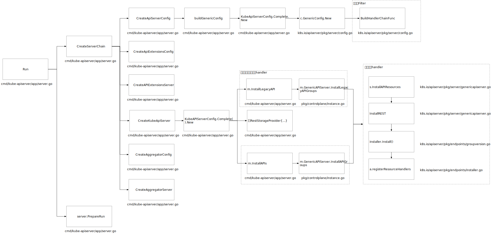
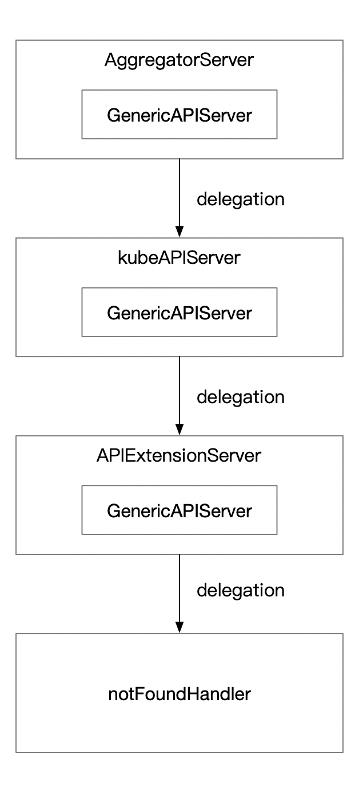
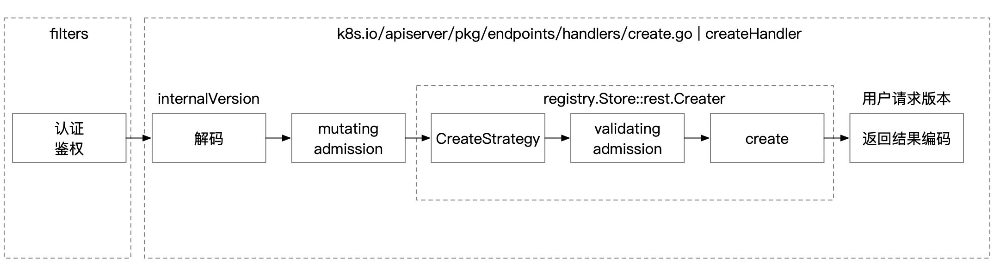

## 前言

K8s 提供 `Aggregated APIServer` 的扩展方式，编写 `Aggregated APIServer` 本质上和 K8s 构建方式类似，理解 APiServer 资源的加载方式，能更好好的理解如何开发`Aggregated APIServer`。本文以内置资源的 handler 注册过程为线索介绍了 APiServer 的启动过程和 handler 注册过程。使用 k8s 代码 commit id 为 c6970e64528ba78b74bf77b86f9b78b7b61bd0cd

## APIServer 启动过程介绍




图 1 给出了 ApiServer 的初始化流程，首先通过 `CreateServerChain`  构造出 3 个 APIServer：

**AggregatorServer：拦截** `Aggregated APIServer` **中定义的资源对象请求，并转发给相关的** `Aggregated APIServer` **处理。**

**KubeAPIServer：用于处理 k8s 的内建资源，如：Deployment，ConfigMap 等。**

**APIExtensionServer：负责处理用户自定义资源。**

它们之间的处理顺序为如下图所示，当用户请求进来，先判断 `AggregatorServer` 能否处理，否则代理给 `kubeApiServer` ，如果 `kubeApiServer` 不能处代理给 `ApiExtensionServer` 处理，如果都不能处理则交给 notFoundHandler 处理。




限于篇幅原因，本文主要分析 kubeapiserver 的启动过程。

`CreateApiServerConfig` 通过调用 `buildGenericConfig` 构建 `genericapiserver.Config`。`genericapiserver.Config` 中包含了启动`Genericapiserver` 所需要的配置信息，比如：`RequestTimeout` 定义了请求的超时时间，`AdmissionControl` 对象进行准入控制。`buildGenericConfig` 中需要注意的是 `BuildHandlerChainFunc`，请求在路由给资源对象的 handler 前先经过的`BuildHandlerChainFunc` 中定义的 `Filter` 。参考图 1，通过深入 `buildGenericConfig` 可以发现 `BuildHandlerChainFunc` 传入的是 `DefaultBuildHandlerChain` ，其中 `Filter` 先定义的后调用。

```go
// k8s.io/apiserver/pkg/server/config.go

func DefaultBuildHandlerChain(apiHandler http.Handler, c *Config) http.Handler {
	handler := filterlatency.TrackCompleted(apiHandler)
  // 构造权限检查 filter
	handler = genericapifilters.WithAuthorization(handler, c.Authorization.Authorizer, c.Serializer)
	...
  // 构造认证 filter
	handler = genericapifilters.WithAuthentication(handler, c.Authentication.Authenticator, failedHandler, c.Authentication.APIAudiences)
  ...
  // 构造请求超时 filter, LongRunningFunc 会判断该请求是否是需要 LongRunning 的，比如 watch 的请求，如果是，该 filter 不会对这类请求生效
	// WithTimeoutForNonLongRunningRequests will call the rest of the request handling in a go-routine with the
	// context with deadline. The go-routine can keep running, while the timeout logic will return a timeout to the client.
	handler = genericfilters.WithTimeoutForNonLongRunningRequests(handler, c.LongRunningFunc)
	handler = genericapifilters.WithRequestDeadline(handler, c.AuditBackend, c.AuditPolicyRuleEvaluator,
		c.LongRunningFunc, c.Serializer, c.RequestTimeout)
  
	handler = genericfilters.WithWaitGroup(handler, c.LongRunningFunc, c.HandlerChainWaitGroup)
  ...
  // 初始化 RequestInfo 的 filter 并将其放入 context 中，后续的处理逻辑可以从 context 直接获取 RequestInfo
	handler = genericapifilters.WithRequestInfo(handler, c.RequestInfoResolver)
  ....
	return handler
}
```

`CreateKubeAPIServer` 中调用了`kubeAPIServerConfig.Complete().New` 构造出了 `kubeAPIServer` 的 `GenericServer`。`kubeAPIServerConfig.Complete().New` 中通过调用 `m.InstallLegacyAPI` 初始化核心资源并添加进路由中，对应的是以 api 开头的资源，如：Pod，ConfigMap 等。调用 `m.InstallAPI` 初始化以 apis 开头的内置资源如：Deployment。

## handler 的注册过程

从图 1 可以看出 `InstallAPI` 与 `InstallLegacyAPI` 的创建过程基本类似，本文主要介绍 `InstallAPI` 的初始化过程。

在调用 `InstallAPI` 之前`kubeAPIServerConfig.Complete().New` 会先创建内置资源对象的`RESTStorageProvider` 作为 `InstallAPI` 的入参

```go
//pkg/controlplane/instance.go

func (c completedConfig) New(delegationTarget genericapiserver.DelegationTarget) (*Instance, error) {
  ...
  // 构造内置资源的 RESTStorageProvider
	restStorageProviders := []RESTStorageProvider{
		apiserverinternalrest.StorageProvider{},
		authenticationrest.RESTStorageProvider{Authenticator: c.GenericConfig.Authentication.Authenticator, APIAudiences: c.GenericConfig.Authentication.APIAudiences},
		authorizationrest.RESTStorageProvider{Authorizer: c.GenericConfig.Authorization.Authorizer, RuleResolver: c.GenericConfig.RuleResolver},
		autoscalingrest.RESTStorageProvider{},
		batchrest.RESTStorageProvider{},
		certificatesrest.RESTStorageProvider{},
		coordinationrest.RESTStorageProvider{},
		discoveryrest.StorageProvider{},
		networkingrest.RESTStorageProvider{},
		noderest.RESTStorageProvider{},
		policyrest.RESTStorageProvider{},
		rbacrest.RESTStorageProvider{Authorizer: c.GenericConfig.Authorization.Authorizer},
		schedulingrest.RESTStorageProvider{},
		storagerest.RESTStorageProvider{},
		flowcontrolrest.RESTStorageProvider{InformerFactory: c.GenericConfig.SharedInformerFactory},
		// keep apps after extensions so legacy clients resolve the extensions versions of shared resource names.
		// See https://github.com/kubernetes/kubernetes/issues/42392
		appsrest.StorageProvider{},
		admissionregistrationrest.RESTStorageProvider{},
		eventsrest.RESTStorageProvider{TTL: c.ExtraConfig.EventTTL},
	}
	if err := m.InstallAPIs(c.ExtraConfig.APIResourceConfigSource, c.GenericConfig.RESTOptionsGetter, restStorageProviders...); err != nil {
		return nil, err
	}
  ...
}
```

`RESTStorageProvider` 是一个接口，通过其 `NewRESTStorage` 构造出 `APIGroupInfo` ，`APIGroupInfo` 包含注册资源所需的基本信息比如编解码器，组下所有资源的 Storage 对象`VersionedResourcesStorageMap`。

```go
//k8s.io/apiserver/pkg/server/genericapiserver.go

// Info about an API group.
type APIGroupInfo struct {
	PrioritizedVersions []schema.GroupVersion
	// Info about the resources in this group. It's a map from version to resource to the storage.
	VersionedResourcesStorageMap map[string]map[string]rest.Storage
  ...
	// NegotiatedSerializer controls how this group encodes and decodes data
	NegotiatedSerializer runtime.NegotiatedSerializer
	// ParameterCodec performs conversions for query parameters passed to API calls
	ParameterCodec runtime.ParameterCodec
	...
}
```

`VersionedResourcesStorageMap` 需要重点注意，编写 `Aggregated APIServer` 主要逻辑是通过 `NewDefaultAPIGroupInfo` 初始化 `APIGroupInfo` 以后设置 `VersionedResourcesStorageMap` 属性。`VersionedResourcesStorageMap` 的签名是 `map[string]map[string]rest.Storage`。第一个 key 是版本号，第二个 key 是资源名称，资源名称可以是 deployment 这种资源，同时也能是子资源如 `pod/status` , `pod/log` 等是 pod 的子资源有单独的 storage。最终构建 handler 的请求路径是基于 `VersionedResourcesStorageMap` 中提供的版本号和资源名称确定的。`rest.Storage` 用于处理具体的请求，其声明如下：

```go
// k8s.io/apiserver/pkg/registry/rest/rest.go

// Storage is a generic interface for RESTful storage services.
// Resources which are exported to the RESTful API of apiserver need to implement this interface. It is expected
// that objects may implement any of the below interfaces.
type Storage interface {
	// New returns an empty object that can be used with Create and Update after request data has been put into it.
	// This object must be a pointer type for use with Codec.DecodeInto([]byte, runtime.Object)
	New() runtime.Object

	// Destroy cleans up its resources on shutdown.
	// Destroy has to be implemented in thread-safe way and be prepared
	// for being called more than once.
	Destroy()
}
```

实现 `rest.Storage` 的接口最基本的，如果需要支持不同的请求，还需要实现其他的接口，相关定义在 `k8s.io/apiserver/pkg/registry/rest/rest.go` 中，如：

```go
// k8s.io/apiserver/pkg/registry/rest/rest.go

// 资源对象支持 POST 请求，例入通过 kubectl create 一个资源对象。
// Creater is an object that can create an instance of a RESTful object.
type Creater interface {
	// New returns an empty object that can be used with Create after request data has been put into it.
	// This object must be a pointer type for use with Codec.DecodeInto([]byte, runtime.Object)
	New() runtime.Object

	// Create creates a new version of a resource.
	Create(ctx context.Context, obj runtime.Object, createValidation ValidateObjectFunc, options *metav1.CreateOptions) (runtime.Object, error)
}
// 资源对象支持 GET 请求，例如通过 kubectl get 一个资源对象。
// Getter is an object that can retrieve a named RESTful resource.
type Getter interface {
	// Get finds a resource in the storage by name and returns it.
	// Although it can return an arbitrary error value, IsNotFound(err) is true for the
	// returned error value err when the specified resource is not found.
	Get(ctx context.Context, name string, options *metav1.GetOptions) (runtime.Object, error)
}
// 支持对资源对象进行 watch 操作 例如通过 kubectl get 资源对象 -w。
type Watcher interface {
	// 'label' selects on labels; 'field' selects on the object's fields. Not all fields
	// are supported; an error should be returned if 'field' tries to select on a field that
	// isn't supported. 'resourceVersion' allows for continuing/starting a watch at a
	// particular version.
	Watch(ctx context.Context, options *metainternalversion.ListOptions) (watch.Interface, error)
}
```

后续的处理中会依据 `Creater` ,`Getter` 和 `Watcher` 等接口生成对应请求的 handler，后文会进行具体的分析。k8s 的内置资源存储都使用 etcd，因此内置资源的 Storage 是通过 `Store` 构建。`Store` 定义在 `/k8s.io/apiserver/pkg/registry/generic/registry/store.go` 文件中，已经实现 `Creater` , `Getter`, `Watcher`等接口，其他的资源只需在初始化 `Store` 时传入一些必须的参数即可，无需编写存储层的交互代码。下面给出了构造 deployment 的 store 的过程，其他内置资源大同小异。

```go

// NewREST returns a RESTStorage object that will work against deployments.
func NewREST(optsGetter generic.RESTOptionsGetter) (*REST, *StatusREST, *RollbackREST, error) {
   // 创建一个 deployments 的 genericregistry.Store
	store := &genericregistry.Store{
    // 初始化一个空资源对象，这里使用的是 internal 的版本，下面定义的各种 strategy 操作的对象也是 internal 版本，这样就不用为每一种版本编写一个 strategy 策略
		NewFunc:                  func() runtime.Object { return &apps.Deployment{} },
    // 初始化一个空资源对象列表
		NewListFunc:              func() runtime.Object { return &apps.DeploymentList{} },
    
		DefaultQualifiedResource: apps.Resource("deployments"),
    // 创建更新删除策略 主要是做校验及控制那些字段不能被用户覆盖用
		CreateStrategy:      deployment.Strategy,
		UpdateStrategy:      deployment.Strategy,
		DeleteStrategy:      deployment.Strategy,
		ResetFieldsStrategy: deployment.Strategy,
 
		TableConvertor: printerstorage.TableConvertor{TableGenerator: printers.NewTableGenerator().With(printersinternal.AddHandlers)},
	}
	options := &generic.StoreOptions{RESTOptions: optsGetter}
  // 继续完成 store 其他属性的初始化，比如初始化 store.Storage 属性。Storage 主要用于和底层存储层交互
	if err := store.CompleteWithOptions(options); err != nil {
		return nil, nil, nil, err
	}
	
	statusStore := *store
  // deployment 的 status 子资源也是使用 store, 区别是更新策略不一样，即在 update 时会用旧对象的 spec 和 lable 覆盖新对象的，防止非 status 字段被用户意外覆盖
	statusStore.UpdateStrategy = deployment.StatusStrategy
	statusStore.ResetFieldsStrategy = deployment.StatusStrategy
	return &REST{store}, &StatusREST{store: &statusStore}, &RollbackREST{store: store}, nil
}
```

`InstallAPIs` 调用链条比较深。参考图 1，最终会来到`k8s.io/apiserver/pkg/endpoints/groupversion.go` 的 `InstallREST` 方法。`InstallREST` 方法构造出 handler 的前缀，创建`APIInstaller`，然后调用`installer.Install()`方法继续 handler 的注册

```go
// k8s.io/apiserver/pkg/endpoints/groupversion.go

func (g *APIGroupVersion) InstallREST(container *restful.Container) ([]*storageversion.ResourceInfo, error) {
  // 从 InstallAPI 调用链下来这里的 g.Root 为/apis，这样就可以确定 handler 的前缀为/apis/{goup}/{version}
	prefix := path.Join(g.Root, g.GroupVersion.Group, g.GroupVersion.Version)
	installer := &APIInstaller{
		group:             g,
		prefix:            prefix,
		minRequestTimeout: g.MinRequestTimeout,
	}

	apiResources, resourceInfos, ws, registrationErrors := installer.Install()
	versionDiscoveryHandler := discovery.NewAPIVersionHandler(g.Serializer, g.GroupVersion, staticLister{apiResources})
	versionDiscoveryHandler.AddToWebService(ws)
	container.Add(ws)
	return removeNonPersistedResources(resourceInfos), utilerrors.NewAggregate(registrationErrors)
}
```

`installer.Install()` 方法会调用`registerResourceHandlers` 方法，真正开始创建和注册处理请求的 handler，需要说明的是`a.group.Storage` 是上文提到的`VersionedResourcesStorageMap` 传入版本号后获得的 map。读者可以自行参考图 1 的调用链进行分析。`a.registerResourceHandlers` 就是为每一种`Storage`注册 handlers

```go

// Install handlers for API resources.
func (a *APIInstaller) Install() ([]metav1.APIResource, []*storageversion.ResourceInfo, *restful.WebService, []error) {
	var apiResources []metav1.APIResource
	var resourceInfos []*storageversion.ResourceInfo
	var errors []error
	ws := a.newWebService()

	// Register the paths in a deterministic (sorted) order to get a deterministic swagger spec.
	paths := make([]string, len(a.group.Storage))
	var i int = 0
  // a.goup.Storage 的签名是 map[string]Storage, for 循环的 path 是 map 的 key，即资源名称
	for path := range a.group.Storage {
		paths[i] = path
		i++
	}
	sort.Strings(paths)
	for _, path := range paths {
		apiResource, resourceInfo, err := a.registerResourceHandlers(path, a.group.Storage[path], ws)
		...
}
```

`registerResourceHandlers` 会依据`rest.Storage`实现的接口生成相关的 action。最终根据 action 生成 handler 并注册到 rest 容器中。

```go
// k8s.io/apiserver/pkg/endpoints/installer.go
func (a *APIInstaller) registerResourceHandlers(path string, storage rest.Storage, ws *restful.WebService) (*metav1.APIResource, *storageversion.ResourceInfo, error) {
  ...
  // 初始化 rest 容器，根目录是 APIInstaller 的 prefix 属性，从 InstallAPI 调用链下来值为/apis/{goup}/{version}
  ws := a.newWebService()
	...
  // 进行类型转换判断当前的 storage 支持哪些类型的操作
	creater, isCreater := storage.(rest.Creater)
	namedCreater, isNamedCreater := storage.(rest.NamedCreater)
	lister, isLister := storage.(rest.Lister)
	getter, isGetter := storage.(rest.Getter)
	getterWithOptions, isGetterWithOptions := storage.(rest.GetterWithOptions)
	gracefulDeleter, isGracefulDeleter := storage.(rest.GracefulDeleter)
	collectionDeleter, isCollectionDeleter := storage.(rest.CollectionDeleter)
	updater, isUpdater := storage.(rest.Updater)
	patcher, isPatcher := storage.(rest.Patcher)
	watcher, isWatcher := storage.(rest.Watcher)
	connecter, isConnecter := storage.(rest.Connecter)
	storageMeta, isMetadata := storage.(rest.StorageMetadata)
	storageVersionProvider, isStorageVersionProvider := storage.(rest.StorageVersionProvider)

  // Get the list of actions for the given scope.
	switch {
	case !namespaceScoped:
    // 构造有无 namespace 资源的 action
		// Handle non-namespace scoped resources like nodes.
		...
	default:
    // 构造有 namespace 资源的 action
    // 构造 handler 的注册路径
	  namespaceParamName := "namespaces"
		// Handler for standard REST verbs (GET, PUT, POST and DELETE).
		namespaceParam := ws.PathParameter("namespace", "object name and auth scope, such as for teams and projects").DataType("string")
		namespacedPath := namespaceParamName + "/{namespace}/" + resource
		namespaceParams := []*restful.Parameter{namespaceParam}
   
    //resourcePath 的值为 /namespaces/{namespace}/{resource}
		resourcePath := namespacedPath
		resourceParams := namespaceParams
    // itemPath： /namespaces/{namespace}/{resource}/{name}
    // name 是请求资源对象的名字
		itemPath := namespacedPath + "/{name}"
		nameParams := append(namespaceParams, nameParam)
		proxyParams := append(nameParams, pathParam)
		itemPathSuffix := ""
		if isSubresource {
			itemPathSuffix = "/" + subresource
       // 有子资源等情况下 resourcePath 被定义为：/namespaces/{namespace}/{resource}/{name}/{subResource}
			itemPath = itemPath + itemPathSuffix
      // itemPath 与 resourcePath 的值一样
			resourcePath = itemPath
			resourceParams = nameParams
		}
		apiResource.Name = path
		apiResource.Namespaced = true
		apiResource.Kind = resourceKind
		namer := handlers.ContextBasedNaming{
			Namer:         a.group.Namer,
			ClusterScoped: false,
		}
    // 根据 storage 实现的接口添加添加相关的 action
		actions = appendIf(actions, action{"LIST", resourcePath, resourceParams, namer, false}, isLister)
		actions = appendIf(actions, action{"POST", resourcePath, resourceParams, namer, false}, isCreater)
		actions = appendIf(actions, action{"DELETECOLLECTION", resourcePath, resourceParams, namer, false}, isCollectionDeleter)
		// DEPRECATED in 1.11
		actions = appendIf(actions, action{"WATCHLIST", "watch/" + resourcePath, resourceParams, namer, false}, allowWatchList)

		actions = appendIf(actions, action{"GET", itemPath, nameParams, namer, false}, isGetter)
		if getSubpath {
			actions = appendIf(actions, action{"GET", itemPath + "/{path:*}", proxyParams, namer, false}, isGetter)
		}
		actions = appendIf(actions, action{"PUT", itemPath, nameParams, namer, false}, isUpdater)
		actions = appendIf(actions, action{"PATCH", itemPath, nameParams, namer, false}, isPatcher)
		actions = appendIf(actions, action{"DELETE", itemPath, nameParams, namer, false}, isGracefulDeleter)
		// DEPRECATED in 1.11
		actions = appendIf(actions, action{"WATCH", "watch/" + itemPath, nameParams, namer, false}, isWatcher)
		actions = appendIf(actions, action{"CONNECT", itemPath, nameParams, namer, false}, isConnecter)
		actions = appendIf(actions, action{"CONNECT", itemPath + "/{path:*}", proxyParams, namer, false}, isConnecter && connectSubpath)

		// list or post across namespace.
		// For ex: LIST all pods in all namespaces by sending a LIST request at /api/apiVersion/pods.
		// TODO: more strongly type whether a resource allows these actions on "all namespaces" (bulk delete)
		if !isSubresource {
			actions = appendIf(actions, action{"LIST", resource, params, namer, true}, isLister)
			// DEPRECATED in 1.11
			actions = appendIf(actions, action{"WATCHLIST", "watch/" + resource, params, namer, true}, allowWatchList)
		}
	}
  ...
  for _, action := range actions {
		...
		switch action.Verb {
    case "GET": // Get a resource.
			var handler restful.RouteFunction
      // 构造 get 请求的 handler
      // restfulGetResourceWithOptions 和 restfulGetResource 将 handlers.GetResource 函数转换成 restful.RouteFunction，即 handler 的函数签名
			if isGetterWithOptions {
				handler = restfulGetResourceWithOptions(getterWithOptions, reqScope, isSubresource)
			} else {
				handler = restfulGetResource(getter, reqScope)
			}
      ...
      // 将 handler 注册到 rest 容器中
      // action.Path 是上面定义的 itemPath 或 resourcePath，对于 GET 来说是 itemPath
      // 当前注册的 handler 的路径是 ws 的根路径加上 ation.Path. 完整的路径为：/apis/{goup}/{version}/namespaces/{namespace}/{resource}/{name}
			route := ws.GET(action.Path).To(handler).
				Doc(doc).
				Param(ws.QueryParameter("pretty", "If 'true', then the output is pretty printed.")).
				Operation("read"+namespaced+kind+strings.Title(subresource)+operationSuffix).
				Produces(append(storageMeta.ProducesMIMETypes(action.Verb), mediaTypes...)...).
				Returns(http.StatusOK, "OK", producedObject).
				Writes(producedObject)
			if isGetterWithOptions {
				if err := AddObjectParams(ws, route, versionedGetOptions); err != nil {
					return nil, nil, err
				}
			}
			addParams(route, action.Params)
			routes = append(routes, route)
    }
    case "LIST": // List all resources of a kind.
    ...
    case "PUT": // Update a resource.
    ...
    case "PATCH": // Partially update a resource
    ...
    case "POST": // Create a resource.
    ...
    case "DELETE": // Delete a resource.
    ....
  }
  ...

}
```

`registerResourceHandlers` 中创建的 handler 并不是直接调用`Creater` ,`Updater` 等接口定义的方法，而是在外面包了一层代码进行一些额外的处理，例如对象的编解码，admission control 的处理逻辑，针对 watch 这种长链接需要进行协议的处理等，相关的定义在`k8s.io/apiserver/pkg/endpoints/handlers` 包下。文本以 Get 和 Create 例，分析请求的处理逻辑。

Get 请求的处理过程比较简单，通过请求的查询串构造出`metav1.GetOptions` ，然后交给 Getter 接口处理，最后在将查询结果进行转换发回给请求者。

```go
// k8s.io/apiserver/pkg/endpoints/handlers/get.go

// GetResource returns a function that handles retrieving a single resource from a rest.Storage object.
func GetResource(r rest.Getter, scope *RequestScope) http.HandlerFunc {
	return getResourceHandler(scope,
		func(ctx context.Context, name string, req *http.Request, trace *utiltrace.Trace) (runtime.Object, error) {
			// check for export
			options := metav1.GetOptions{}
      // 获取查询串
			if values := req.URL.Query(); len(values) > 0 {
				...
        // 将查询串解码成 metav1.GetOptions
				if err := metainternalversionscheme.ParameterCodec.DecodeParameters(values, scope.MetaGroupVersion, &options); err != nil {
					err = errors.NewBadRequest(err.Error())
					return nil, err
				}
			}
			if trace != nil {
				trace.Step("About to Get from storage")
			}
      // 交给 Getter 接口处理
			return r.Get(ctx, name, &options)
		})
}

// getResourceHandler is an HTTP handler function for get requests. It delegates to the
// passed-in getterFunc to perform the actual get.
func getResourceHandler(scope *RequestScope, getter getterFunc) http.HandlerFunc {
	return func(w http.ResponseWriter, req *http.Request) {
		...
		namespace, name, err := scope.Namer.Name(req)
		...
		ctx := req.Context()
		ctx = request.WithNamespace(ctx, namespace)
		...
		result, err := getter(ctx, name, req, trace)
		...
    // 对处理结果进行转化为用户期望的格式并写入到 response 中返回给用户
		transformResponseObject(ctx, scope, trace, req, w, http.StatusOK, outputMediaType, result)
	}
}
```

Create 的处理逻辑在 `createHandler` 中，代码较长，主要做以下几件事情：

1 对查询串进行解码生成 `metav1.CreateOptions` 。

2 对请求的 body 体中的数据进行解码，生成资源对象。解码的对象版本是 internal 版本，internal 版本是该资源对象所有版本字段的全集。针对不同版本的对象内部可以使用相同的代码进行处理。

3 对对象进行修改的准入控制，判断是否修需要修改对象。

4 交给 creater 接口创建资源对象。

5 将数据转换为期望的格式写入 response 中，调用 creater 接口返回的结果仍然是 internal 版本，编码时，会编码成用户请求的版本返回给用户。

```go
// k8s.io/apiserver/pkg/endpoints/handlers/create.go

// CreateNamedResource returns a function that will handle a resource creation with name.
func CreateNamedResource(r rest.NamedCreater, scope *RequestScope, admission admission.Interface) http.HandlerFunc {
	return createHandler(r, scope, admission, true)
}

func createHandler(r rest.NamedCreater, scope *RequestScope, admit admission.Interface, includeName bool) http.HandlerFunc {
	return func(w http.ResponseWriter, req *http.Request) {
    ...
    // 从 request 中取出请求 body
    body, err := limitedReadBody(req, scope.MaxRequestBodyBytes)
    ...
    // 对查询传进行解码生成 metav1.CreateOptions
		options := &metav1.CreateOptions{}
		values := req.URL.Query()
		if err := metainternalversionscheme.ParameterCodec.DecodeParameters(values, scope.MetaGroupVersion, options); err != nil {
			...
		}
		// 将请求 body 解码成资源对象，defaultGVK 是用户请求的版本，这里 decoder 解码出来的对象是 internal 版本的对象
		obj, gvk, err := decoder.Decode(body, &defaultGVK, original)
		...
    admissionAttributes := admission.NewAttributesRecord(obj, nil, scope.Kind, namespace, name, scope.Resource, scope.Subresource, admission.Create, options, dryrun.IsDryRun(options.DryRun), userInfo)
		// 构建调用 create 方法的函数
		requestFunc := func() (runtime.Object, error) {
			return r.Create(
				ctx,
				name,
				obj,
				rest.AdmissionToValidateObjectFunc(admit, admissionAttributes, scope),
				options,
			)
		}
		// Dedup owner references before updating managed fields
		dedupOwnerReferencesAndAddWarning(obj, req.Context(), false)
		result, err := finisher.FinishRequest(ctx, func() (runtime.Object, error) {
      ...
      // 执行 mutation 的 admission 操作，即在创建时对象进行修改操作。
      // admin 在 buildGenericConfig 中初始化，通过 config 传递给 genericsever，然后传递到此处
			if mutatingAdmission, ok := admit.(admission.MutationInterface); ok && mutatingAdmission.Handles(admission.Create) {
				if err := mutatingAdmission.Admit(ctx, admissionAttributes, scope); err != nil {
					return nil, err
				}
			}
			// Dedup owner references again after mutating admission happens
			dedupOwnerReferencesAndAddWarning(obj, req.Context(), true)
      // 调用创建方法
			result, err := requestFunc()
			...
			return result, err
		})
		...
    // resutl 也是 internal 版本的对象，transformResponseObject 会转换为用户请求的版本并输出
		transformResponseObject(ctx, scope, trace, req, w, code, outputMediaType, result)
	}
```

Create 请求的流程可以总结为下图




## 总结

本文介绍了 K8s 内置资源的注册过程，对 APIServer 的访问会先经过 filter，再路由给具体的 handler。filter 在 `DefaultBuildHandlerChain` 中定义，主要对请求做超时处理，认证，鉴权等操作。handler 的注册则是初始化 `APIGoupInfo` 并设置其 `VersionedResourcesStorageMap` 后作为入参，调用 `GenericAPIServer.InstallAPIGroups` 即可完成 handler 的注册。`k8s.io/apiserver/pkg/endpoints/handlers` 包中的代码则是对用户请求做编解码，对象版本转换，协议处理等操作，最后在交给`rest.Storage` 具体实现的接口进行处理。

## 参考

- [https://blog.tianfeiyu.com/source-code-reading-notes/kubernetes/kube_apiserver.html#kube-apiserver-处理流程](https://blog.tianfeiyu.com/source-code-reading-notes/kubernetes/kube_apiserver.html#kube-apiserver-%E5%A4%84%E7%90%86%E6%B5%81%E7%A8%8B)
- [https://hackerain.me/2020/10/05/kubernetes/kube-apiserver-genericapiserver.html](https://hackerain.me/2020/10/05/kubernetes/kube-apiserver-genericapiserver.html)
- [https://hackerain.me/2020/09/19/kubernetes/kube-apiserver-storage-overview.html](https://hackerain.me/2020/09/19/kubernetes/kube-apiserver-storage-overview.html)
- [https://github.com/gosoon/source-code-reading-notes/blob/master/kubernetes/kube_apiserver.md](https://github.com/gosoon/source-code-reading-notes/blob/master/kubernetes/kube_apiserver.md)
- [https://time.geekbang.org/column/article/41876](https://time.geekbang.org/column/article/41876)
