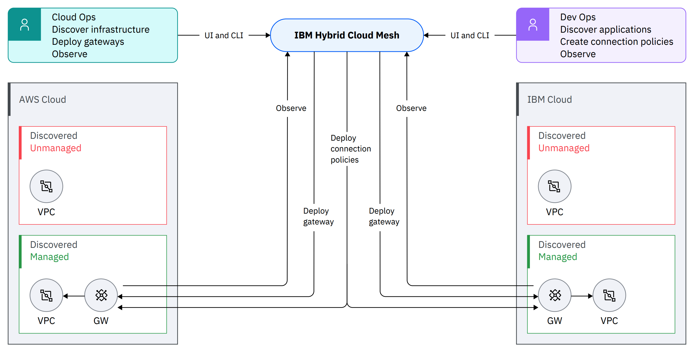

云原生社区最新报道：近日 IBM 发布了名为「IBM 混合云 Mesh」的多云网络解决方案，旨在为企业提供简单、可扩展、安全的应用程序中心化连接。该解决方案可帮助 CloudOps 团队实现可见性和优化，同时也有助于 DevOps 团队实现业务敏捷性。混合云 Mesh 通过连通各种环境，为应用程序和服务提供了无缝的入口。它还与 IBM NS1 Connect 的 DNS 流量引导功能相结合，提供可预测的延迟、带宽和成本。解决方案的核心组件包括 Mesh Manager 和 Gateways，用于集中管理、策略制定和数据传输。这一新范式将提高应用程序性能和安全性，促进团队协作，助力企业在多云环境中实现创新。

在现代企业中，分布式软件应用程序需要始终可用、安全、响应迅速且全球优化的访问。为了为内部和外部用户提供这种应用体验，一个安全的混合云战略至关重要。我们对混合云的愿景非常清晰：帮助客户通过随时随地构建、部署和管理应用程序和服务，加速实现积极的业务成果。

传统的 CloudOps 和 DevOps 模型涉及手动工作流程，可能无法提供所需的应用程序体验。IBM 坚信，现在是采取新方法的时候，这个方法是由应用程序本身驱动的。新的范式是通过安全、高性能的应用程序中心化网络来简化混合和多云应用程序交付，以帮助提高应用程序速度并改善 IT 团队之间的协作。

就像云可以提供虚拟平台来使用底层资源，比如计算和存储，应用程序中心化连接提供了一个新的网络叠加层，专注于应用程序和服务端点的连接。它与提供物理连接的底层网络完全抽象，因此非常简化。

应用程序中心化连接如何帮助 IT 团队？对于 CloudOps 团队，这种方法有助于实现可见性和优化。对于 DevOps 团队，它有助于实现业务敏捷性。两个团队都可以从更好的团队协作中受益，拥有共同的用户体验（UX），自定义拓扑视图以及管理和查看 SLO 和资源状态的能力。

**全新网络范式的实际应用：IBM 混合云 Mesh**

[IBM 混合云 Mesh](https://www.ibm.com/products/hybrid-cloud-mesh)，这是今年早些时候宣布的一款多云网络解决方案，现已推出。这款新的 SaaS 产品旨在允许组织建立简单、可扩展的安全应用程序中心化连接。该产品还被设计成可预测的，关于延迟、带宽和成本。它专为 CloudOps 和 DevOps 团队设计，以无缝地管理和扩展网络应用程序，包括运行在 Red Hat OpenShift 上的云原生应用程序。

您将发现一种无缝的入口，用于在异构的其他环境中提供应用程序和服务，例如，将混合云 Mesh 与[IBM NS1 Connect](https://www.ibm.com/products/ns1-connect)的 DNS 流量引导功能结合使用，这是一款用于向数百万用户交付内容、服务和应用程序的 SaaS 解决方案。

**IBM 混合云 Mesh 的架构：**

该产品设计的关键是两个主要的架构组件：

- Mesh Manager 提供了集中的管理和策略平面，具有可观察性。
- Gateways 实施混合云 Mesh 的数据平面，并充当虚拟路由器和连接器。这些网关通过 Mesh Manager 进行集中管理，部署在云上和客户端上。有两种类型的网关：1) 边缘网关，部署在工作负载附近，用于转发、安全执行、负载平衡和遥测数据收集；2) Waypoint，在靠近互联网交换和共同机房点的出口点部署，用于路径、成本和拓扑优化。

**IBM 混合云 Mesh 的主要特点：**

- **持续的基础设施和应用程序发现：** Mesh Manager 持续发现并更新多云部署基础设施，使部署的应用程序和服务的发现成为自动化体验。持续发现使 Mesh Manager 保持对云资产变化的感知。
- **无缝连接：** DevOps 或 CloudOps 可以通过 UI 或 CLI 表达其连接意图，Mesh 将连接指定的工作负载，无论它们的位置如何。
- **安全性：** 基于零信任原则，Mesh 只允许基于用户意图的通信。所有网关都经过签名，威胁表面得到解决，因为它们只能通过 Mesh Manager 进行配置。
- **可观察性：** Mesh 通过 Mesh Manager的day0/day1 UI 提供全面的监视，提供有关部署环境、网关、服务和连接指标的详细信息。
- **流量工程能力：** 利用 Waypoint，混合云 Mesh 被设计成可优化成本、延迟和带宽的路径，以增强应用程序性能和安全性。
- **集成工作流程：** DevOps、NetOps、SecOps 和 FinOps 工作流程在协作的交响曲中汇聚，通过单一和和谐的玻璃窗口提供端到端的应用程序连接。

