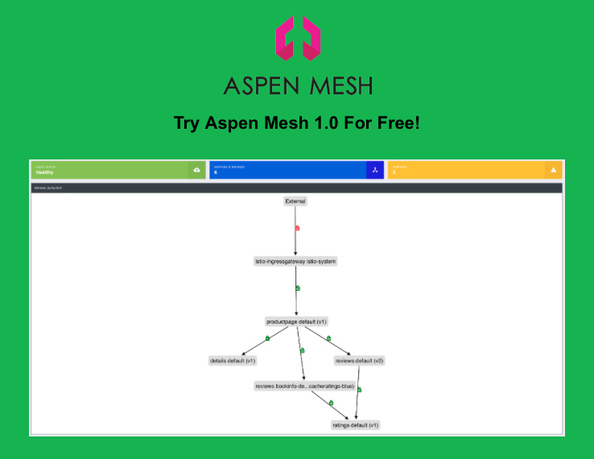

Aspen Mesh这家公司隶属于F5，Aspen Mesh基于Istio 1.0开发，这个周末刚发布了1.0版本，可以申请免费试用。

Aspen Mesh对比Istio 1.0有如下优势：

- 作为托管的SaaS平台
- 丰富的UI dashboard
- 更多实验特性
- 可获得Aspen Mesh工程师团队的支持

Aspen Mesh对比Istio 1.0有如下改进，主要集中在性能和可靠性上：

- 现在可以递增地推出双向TLS，而无需更新服务的所有客户端
- 在Kubernetes中创建Istio配置时就已经过验证。这是由Galley强制执行的Kubernetes准入控制器webhook
- 针对服务和工作负载的更精确和全面的遥测
- Mixer现在支持进程外适配器，可以更轻松地与更多的后端集成

想要试用的话可以去[Aspen Mesh官网](https://aspenmesh.io)上申请。
