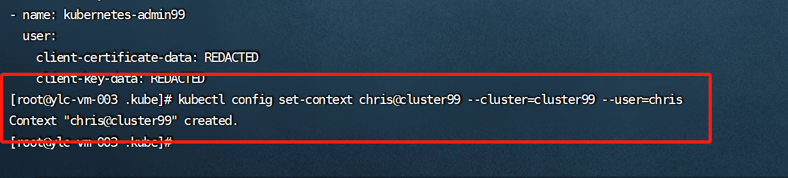
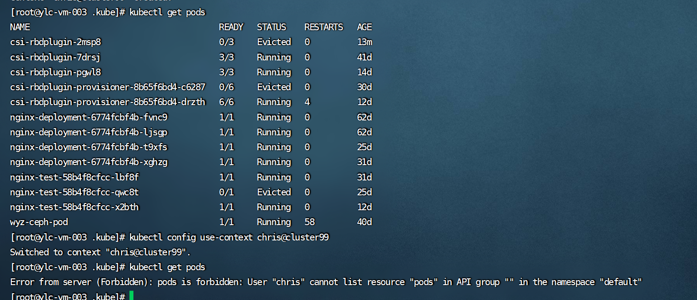
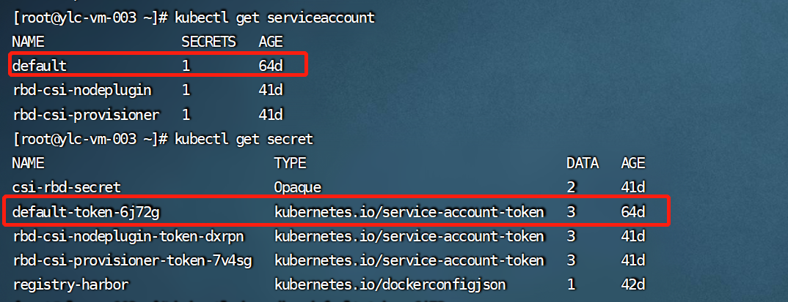
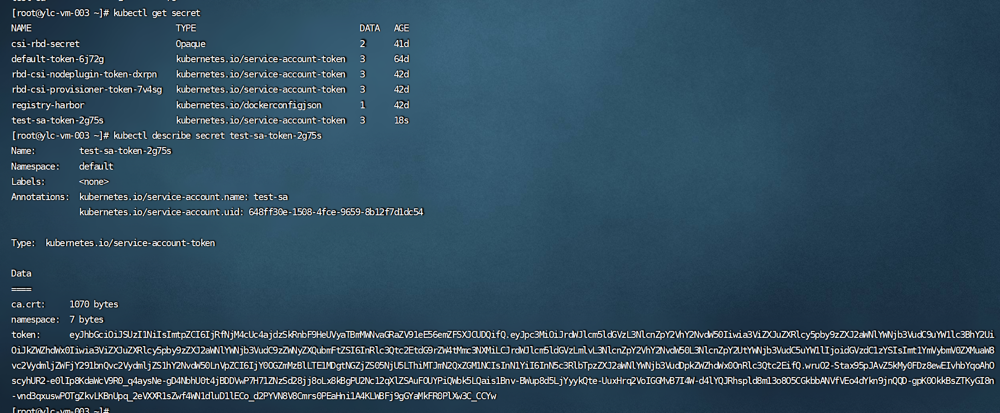

## 前言

本文首先介绍了 K8s 的访问控制过程，并对 K8s 认证的用户模型进行讲解。最后对认证过程中的用户证书认证以及 Service Account Token 认证进行举例剖析。

## K8s API 请求访问控制的过程

我们知道，不论是通过 kubectl 客户端还是 REST 请求访问 K8s 集群，最终都需要经过 API Server 来进行资源的操作，生效结果会被持久化至 etcd 中，etcd 中的数据安全就变得十分重要。为了保证 etcd 的安全性，K8s 只允许 API Server 去访问操作 etcd，此时 API Server 就担负起了整个 etcd 的安全。那么 K8s 是如何管控和保障 API Server 访问过程的安全的呢？

如下图 1 所示，整个过程可以分为 4 个阶段


整体过程简述：请求发起方进行 K8s API 请求，经过 Authentication（认证）、Authorization（鉴权）、AdmissionControl（准入控制）三个阶段的校验，最后把请求转化为对 K8s 对象的变更操作持久化至 etcd 中。

**认证阶段**。当请求发起方建立与 API Server 的安全连接后，进入请求的认证阶段（图中步骤 1）。认证的方式主要有：客户端证书、密码、普通 token、bootstrap token 和 JWT 认证 (主要用于 Service Account)。认证模块会检查请求头或者客户端证书的内容，我们可以同时配置一种或几种方式对请求进行认证。多种认证方式会被依次执行，只要一种方式通过，请求便得到合法认证。当所有方式都未通过时，会返回 401 状态码并中断请求。认证解决的问题是校验访问方是否合法并识别其身份。

**鉴权阶段**。K8s API 访问请求必须包括请求者的用户名、请求的操作以及操作对象，该阶段就是对用户的操作合法性进行校验。如果现有策略声明用户具有完成请求操作的权限，则对请求进行授权。K8s 支持 ABAC 模式、RBAC 模式、Webhook 模式等多种授权模块。同样的，当多个授权模块被配置时，请求只要满足其中任意一种授权规则便会被放行，反之，API Server 会返回 403 状态码并终止该请求。鉴权是为了判别用户的操作权限范围。

**准入控制阶段**。准入控制是请求操作被持久化到 etcd 之前的“拦截器”。准入控制模块由多个“准入控制器”构成，“准入控制器”就是一段自定义代码，它们能够在请求对 K8s 创建、修改、删除或者连接一个 K8s 对象时生效。官方自带了 30 多个准入控制器可供使用，同时支持用户扩展。准入控制器的作用往往是检查请求的规范性或者赋予一些默认信息。例如，我们在创建一个 pod 时，准入控制器会检查提交的信息是否符合 pod 资源的规范，并对请求中没有明确规定的字段，设置对应的默认值填充到请求中。与前两个阶段不同的是，只要有一个“准入校验”逻辑未通过，那么请求就会被拒绝。若请求仅仅是读取一个对象，“准入控制器”将不会生效。准入控制作用于 K8s 中的对象，通过校验规范和默认值的设置，能够保证系统的安全可靠。

**持久化阶段**。当我们的请求通过了前面三个阶段的校验，它会被转换为一个 K8s 对象相应的变更请求，最终持久化到 etcd 中。

需要注意的是，认证授权过程只存在 HTTPS 形式的 API 中。即是说，客户端使用 HTTP 连接到 API Server，是不会进行认证授权的。但 API Server 的非安全认证端口 8080 已经在 v1.12 中废弃了，全面使用了 HTTPS。接下来让我们来详细了解下 K8s 的认证。

## K8s 的用户模型

从图 1 中我们可以看出，K8s 的用户主要分为两类：通过客户端进行连接的人类操作者和 K8s 内诸如进程、控制器等非人类操作的客户端。我们称前者为 Normal Users（常规用户），后者为 Service Account（服务账户）。因为 K8s 内没有为 Normal Users 定义存储对象，我们无法像操作 pod 一样在 K8s 内部管理这类用户，它们通常是由外部服务进行管理，借由证书凭证或者静态配置文件进行认证。而 Service Account 可由 K8s API 直接进行管理。

下表给出了其主要区别：

|类目|Normal Users|Service Account|
|----|----|----|
|针对对象 | 人类用户 | 进程 |
|范围 | 全 cluster 唯一 | namespace|
|设计目的 | 与企业数据库同步，在用户级别进行操作权限的控制 | 更轻量化，在任务进程级别进行管控 |
|主要认证方法 | Basic 认证、X509 证书认证 | Service Account token 认证 |
|例子 | 我们使用 kubectl 操作客户端，K8s 是把我们映射成 kubectl 所使用客户端证书中 CN 字段所对应的信息，而不是真正你身份证上的信息 | Pod 等通过 API Server 从 etcd 中检索和更新自身状态时，API Server 对其进行身份认证，只有通过校验的 pod 才能获取信息|


我们可以一次性启用多种认证方式，但通常应该至少包含以下两方面：
1. 针对于 Service Account 的 token 方式；
2. 至少一种用于 Normal Users 身份验证的其他方式。
通过认证的用户会被包含在名为 system：authenticated 的 group 中。

## Basic 认证

认证方法是管理员将 password、user、uid、group 信息加入到 csv 格式的静态文件中，并在 API Server 启动时使用参数--Basic-authfile={文件路径}，指定使用的凭证文件。之后，认证凭证就将一直有效，只有在重启 API Server 时才能修改密码。凭证文件中的数据示例如下：

```
password,user,uid,"group1,group2,group3"
```

其中，当一个 user 对应多个组，多个 group 之间需要用逗号分隔并且使用双引号。

客户端请求时，需要在头部加入 Basic BASE64ENCODED(USER:PASSWORD)，服务端会校验用户名和密码。该方式使用简单，但是因为用户名和密码使用明文，用户名和密码修改必须重启服务，十分不灵活，一般只用于测试场景。

## X509 证书认证

本文我们假设读者已经了解数字证书和 CA 的基本原理，若不了解可以先阅读下这篇文章[《数字证书原理》](https://www.zhaohuabing.com/post/2020-03-19-pki/)。

K8s 中组件之间通信，证书的验证是在协议层通过 TLS 完成的，TLS 验证分为 2 种：

* 服务器单向认证：服务器端持有证书证明自己身份，用于服务端不关心客户端身份而客户端需要确认服务器身份的场景。例如火车票购票网站，我们必须保证其是官方而非恶意服务器，但网站允许任何客户端进行连接访问；
* 双向 TLS 认证：双方都要持有证书，并验证对方证书确认身份。一般用于服务端持有信息比较敏感，只有特定客户端才能访问的场景。例如：K8s 内组件提供的接口往往包含集群内部信息，若被非法访问会影响整体安全，所以 K8s 内部组件之间都是双向 TLS 认证。

双向认证的简化过程如下图 2 所示


当两个组件进行双向 TLS 认证时，会涉及到下表中的相关文件：

|名称 | 作用 | 例子 |
|----|----|----|
|服务端证书 | 包含服务端公钥和服务端身份信息 | 通过根证书手动或者 kubeadm 自动生成的 API Server 服务端证书文件 apiserver.crt|
|服务器私钥 | 主要用于 TLS 认证时进行数字签名，证明自己是服务端证书的拥有者 | 通过根证书手动或者 kubeadm 生成的 API Server 服务端私钥文件 apiserver.key|
|客户端证书 | 包含客户端公钥和客户端身份信息 | 由同一个 CA 根证书签发的.crt 文件 |
|客户端私钥 | 主要用于 TLS 认证时进行数字签名，证明自己是客户端证书的拥有者 | 由同一个 CA 根证书签发的.key 文件 |
|服务端 CA 根证书 | 签发服务端证书的 CA 根证书 | 通过 openssl 等工具生成的 ca.crt 文件，并在服务端启动时进行指定 |
|客户端 CA 根证书 | 签发客户端证书的 CA 根证书 | 通过 openssl 等工具生成的 ca.crt 文件，并在客户端启动时进行指定 (一般与服务端使用一个)|

下面我们用一个例子来演示证书签发并进行客户端配置的过程，演示的 K8s 环境已经存在 CA 根证书文件以及 API Server 文件，文件和目录情况如图 3 所示：


其中 ca.crt 是我们使用的 CA 根证书，apiserver.crt 是我们 K8s API Server 的服务端证书文件，它由 ca.crt 根证书进行签发和配置，例子中 API Server 的启动参数如图 4 所示：


红框部分信息分别指明了 API Server 所使用的 CA 根证书、服务端证书和服务端私钥的路径。签发用户证书步骤如下 (以 openssl 工具为例):

1. 生成私钥


2. 使用私钥为用户生成签署请求文件


命令中指定的 CN 是 Common Name 的缩写，代表最终生成客户端证书认证通过后在 K8s 内被识别的用户名，O 是 Organization 的缩写，代表被识别用户所属的组。

3. 使用服务端信任的 CA 其签署证书


至此，一个客户端证书便签发完毕了。我们可以查看其中的内容：


其中 CN 和 O 的信息即来自步骤 2 所输入，K8s 通过这两个信息确定访问用户的信息，示意图如 9 所示：


那么如何配置客户端才能使用这个证书呢？K8s 的每个客户端（例如：kubectl）都有一个配置文件用来记录客户端证书验证相关信息，我们称为 kubeconfig。K8s 中的每个组件都有一个这样的配置文件来关联集群、用户以及证书的情况，我们以 kubectl 为例，来说明如何使用 kubeconfig：

1. 查看当前 kubectl 的配置文件内容。

默认情况下，kubectl 命令从$HOME/.kube 目录下查找一个名字叫做 config 的文件作为 kubeconfig，我们也可以用命令```kubectl config view```来列出相关配置内容，结果如图 10 所示：


* clusters: 集群列表。包含访问 API Server 的 URL、认证信息、名称等；
* contexts: kubectl 的可用上下文列表，标明了用户和集群的使用映射关系；
* users: 用户列表，包含访问 API Server 时的客户端证书信息、私钥以及名称；
* current-context: kubectl 当前使用的上下文名称，即上下文列表中的某个特定项名称。

Kubectl 配置 kubeconfig 后与集群进行交互时的整体结构如图 11 所示


2. 建立用户和证书的关系


再次使用```kubectl config view```查看配置可以发现多了一个 user 的配置项


3. 把集群信息和用户信息进行关联




图 15 演示首先由默认的 context 中管理员权限的证书查看 pods 的情况，接着切换到我们新添加的 chris 用户再查看 default 空间下 pods 的情况对比：




我们发现，开始我们使用 Kubernetes-admin99 用户能够正常查询 defaut 下的 pod 信息，但切换到上下文 chris@cluster99 后，访问被阻止了，但是用户没有认证失败，chris 用户被正确识别了。这是因为我们虽然通过了认证阶段，但是在第二阶段（鉴权阶段），我们并没有为 chris 用户添加相应的操作权限导致（权限控制部分我们讲解），至此对于用户的认证已经生效。

使用 x509 证书认证相对 Basic 认证来说显然会更安全，只要证书不泄露，便可认为是安全的。但目前却没有便捷的方案注销证书，若使用证书轮转，则需要重新办法所有证书。所以使用 x509 证书认证适用于 Kubernetes 内部组件之间认证，普通用户认证并不推荐通过证书的形式进行认证。

图 16 列出了 K8s 中各个主要组件证书的使用情况


其中 kubelet 即作为服务端为 API Server 提供主机运行情况，同时又作为客户端从 API Server 中获取信息所以既存在客户端证书又存在服务端证书，API Server 同理，其他组件只作为客户端从 API Server 中获取信息，所以拥有客户端证书即可。

## Service Account token 认证

Service Account 是 K8s 中唯一能够通过 API 自己管理的实体账号。它主要用于 Pod 访问 API Server。每个 namespace 创建的时候，K8s 会自动在这个 namespace 下面创建一个默认的 Service Account 和对应的 secret 实例，该 Service Account 只能访问这个 namespace 的资源。




Service Account 包含了 namespace、token 和 ca 三部分内容，通过 base64 编码保存于对应的 secret 中。namespace 指定了 Pod 所属的 namespace，ca 用于生成和验证 token，token 用作身份验证。三者都通过 mount 的方式挂载在 pod 文件系统的目录 /var/run/secrets/kubernetes.io/serviceaccount/下。若创建的pod未自己指定Service Account，K8s 会为其绑定默认的 Service Account。图 18、图 19 和图 20 展示了上述内容。


当为一个 Pod 指定了 Service Account 后，K8s 会为这个 Service Account 生成一个 JWT（JSON Web Token），并使用 secret 将该 token 加载到 pod 上。JWT 认证机制的原理也是通过 CA 根证书进行签名和公私钥校验 token。其中公钥和私钥分别被配置到了 API Server 和 Controller-Manager 的命令行参数中。如图 21 和图 22 所示。


之后 Pod 便可使用 token 来访问 API Server 了。API Server 再验证对应 token 信息，就能知道这个 token 是对应 Service Account，最后识别到对应 Service Account 的权限。图 23 展示了 K8s 使用和验证 Service Account Token 的过程。图片来源于文章：https://cloudnative.to/blog/k8s-certificate/#kube-apiserver-%E8%AF%81%E4%B9%A6%E9%85%8D%E7%BD%AE


与创建 namespace 创建 defalut 类似，若我们通过 K8s API 的方式创建 Service Account，它一样会创建对应的 secret。当 Pod 使用该 Service Account 的 token 去 API Server 认证，API Server 一样可以识别 Token 对应的 Service Account 从而通过认证（与证书认证相同的是若没有进行授权，一样无法通过鉴权阶段）。如图 24 和图 25 所示。





## 总结

* K8s 的访问控制有 4 个阶段，其中认证阶段的主要对象为 Normal Users 和 Service Account，单单通过认证并不能访问 API Server；
* X509 证书认证是 K8s 中针对用户的常用认证方式，其组件间只用了双向 TLS 的认证方式，若客户端需要访问 API Server 除了生成客户端证书同时还要配置对应的 kubeconfig；
* Service Account Token 是 K8s 针对 Service Account 的主要认证方式，其认证原理是基于 JWT，其中的证书只用于验证 token，最后 API Service 对于 Service Account 的识别是基于传递给 API Service 的 token；
* Service Account 主要设计用于 K8s 内部，Pod 等进程是主要使用者，它是 K8s 唯一自主管理的认证标识，创建 Service Account 后会生成对应的 secret。

## 参考资料

- [https://cloud.tencent.com/developer/article/2016079](https://cloud.tencent.com/developer/article/2016079)
- [http://www.javashuo.com/article/p-gocttrgh-ny.html](http://www.javashuo.com/article/p-gocttrgh-ny.html)
- [https://cloudnative.to/blog/k8s-certificate/#kube-apiserver-%E8%AF%81%E4%B9%A6%E9%85%8D%E7%BD%AE](https://cloudnative.to/blog/k8s-certificate/#kube-apiserver-%E8%AF%81%E4%B9%A6%E9%85%8D%E7%BD%AE)
- [https://zhuanlan.zhihu.com/p/468010077](https://zhuanlan.zhihu.com/p/468010077)
- [https://kubernetes.io/docs/reference/access-authn-authz/authentication/](https://kubernetes.io/docs/reference/access-authn-authz/authentication/)
