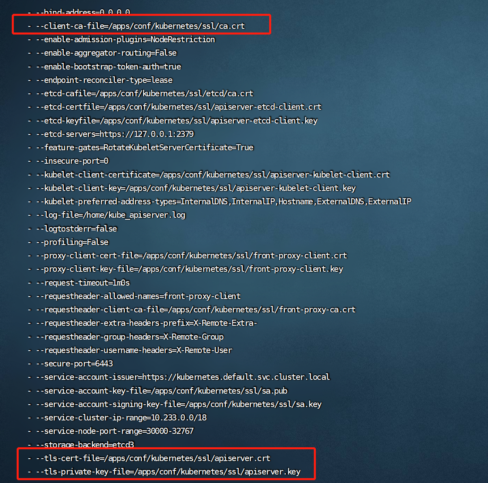
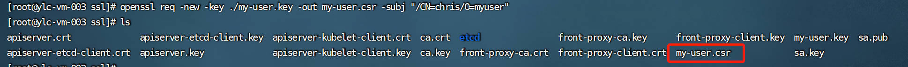
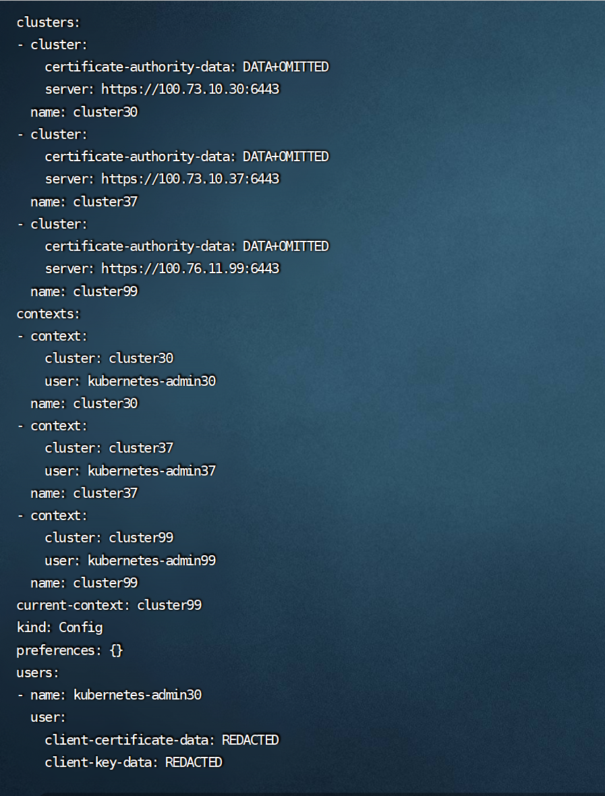

## 前言

本文首先介绍了K8s的访问控制过程，并对K8s认证的用户模型进行讲解。最后对认证过程中的用户证书认证以及Service Account Token认证进行举例剖析。

## K8s API请求访问控制的过程

我们知道，不论是通过kubectl客户端还是REST请求访问K8s集群，最终都需要经过API Server来进行资源的操作，生效结果会被持久化至etcd中，etcd中的数据安全就变得十分重要。为了保证etcd的安全性，K8s只允许API Server 去访问操作etcd，此时API Server就担负起了整个etcd的安全。那么K8s是如何管控和保障API Server访问过程的安全的呢？

如下图1所示，整个过程可以分为4个阶段


整体过程简述：请求发起方进行K8s API请求，经过Authentication（认证）、Authorization（鉴权）、AdmissionControl（准入控制）三个阶段的校验，最后把请求转化为对K8s对象的变更操作持久化至etcd中。

**认证阶段**。当请求发起方建立与API Server的安全连接后，进入请求的认证阶段（图中步骤1）。认证的方式主要有：客户端证书、密码、普通token、bootstrap token和JWT认证(主要用于Service Account)。认证模块会检查请求头或者客户端证书的内容，我们可以同时配置一种或几种方式对请求进行认证。多种认证方式会被依次执行，只要一种方式通过，请求便得到合法认证。当所有方式都未通过时，会返回401状态码并中断请求。认证解决的问题是校验访问方是否合法并识别其身份。

**鉴权阶段**。K8s API访问请求必须包括请求者的用户名、请求的操作以及操作对象，该阶段就是对用户的操作合法性进行校验。如果现有策略声明用户具有完成请求操作的权限，则对请求进行授权。K8s支持ABAC模式、RBAC模式、Webhook模式等多种授权模块。同样的，当多个授权模块被配置时，请求只要满足其中任意一种授权规则便会被放行，反之，API Server会返回403状态码并终止该请求。鉴权是为了判别用户的操作权限范围。

**准入控制阶段**。准入控制是请求操作被持久化到etcd之前的“拦截器”。准时控制模块由多个“准入控制器”构成，“准入控制器”就是一段自定义代码，它们能够在请求对K8s创建、修改、删除或者连接一个K8s对象时生效。官方自带了30多个准入控制器可供使用，同时支持用户扩展。准入控制器的作用往往是检查请求的规范性或者赋予一些默认信息。例如，我们在创建一个pod时，准入控制器会检查提交的信息是否符合pod资源的规范，并对请求中没有明确规定的字段，设置对应的默认值填充到请求中。与前两个阶段不同的是，只要有一个“准入校验”逻辑未通过，那么请求就会被拒绝。若请求仅仅是读取一个对象，“准入控制器”将不会生效。准入控制作用于K8s中的对象，通过校验规范和默认值的设置，能够保证系统的安全可靠。

**持久化阶段**。当我们的请求通过了前面三个阶段的校验，它会被转换为一个 K8s 对象相应的变更请求，最终持久化到etcd中。

需要注意的是，认证授权过程只存在HTTPS形式的API中。即是说，客户端使用HTTP连接到API Server，是不会进行认证授权的。但API Server的非安全认证端口 8080 已经在v1.12中废弃了，全面使用了HTTPS。接下来让我们来详细了解下K8s的认证。

## K8s的用户模型

从图1中我们可以看出，K8s的用户主要分为两类：通过客户端进行连接的人类操作者和K8s内诸如进程、控制器等非人类操作的客户端。我们称前者为Normal Users（常规用户），后者为Service Account（服务账户）。因为K8s内没有为Normal Users定义存储对象，我们无法像操作pod一样在K8s内部管理这类用户，它们通常是由外部服务进行管理，借由证书凭证或者静态配置文件进行认证。而Service Account可由K8s API直接进行管理。

下表给出了其主要区别:

|类目|Normal Users|Service Account|
|----|----|----|
|针对对象| 人类用户| 进程|
|范围| 全cluster唯一| namespace|
|设计目的| 与企业数据库同步，在用户级别进行操作权限的控制| 更轻量化，在任务进程级别进行管控 |
|主要认证方法| Basic认证、X509证书认证| Service Account token认证 |
|例子| 我们使用kubectl操作客户端，K8s是把我们映射成kubectl所使用客户端证书中CN字段所对应的信息，而不是真正你身份证上的信息| Pod等通过API Server从etcd中检索和更新自身状态时，API Server对其进行身份认证，只有通过校验的pod才能获取信息|


我们可以一次性启用多种认证方式，但通常应该至少包含以下两方面：
1. 针对于Service Account的token方式；
2. 至少一种用于Normal Users身份验证的其他方式。
通过认证的用户会被包含在名为system：authenticated的group中。

## Basic认证

认证方法是管理员将password、user、uid、group信息加入到csv格式的静态文件中，并在API Server启动时使用参数--Basic-authfile={文件路径}，指定使用的凭证文件。之后，认证凭证就将一直有效，只有在重启API Server时才能修改密码。凭证文件中的数据示例如下：

```
password,user,uid,"group1,group2,group3"
```

其中，当一个user对应多个组，多个group之间需要用逗号分隔并且使用双引号。

客户端请求时，需要在头部加入Basic BASE64ENCODED(USER:PASSWORD)，服务端会校验用户名和密码。该方式使用简单，但是因为用户名和密码使用明文，用户名和密码修改必须重启服务，十分不灵活，一般只用于测试场景。

## X509证书认证

本文我们假设读者已经了解数字证书和 CA 的基本原理，若不了解可以先阅读下这篇文章[《数字证书原理》](https://www.zhaohuabing.com/post/2020-03-19-pki/)。

K8s中组件之间通信，证书的验证是在协议层通过TLS完成的，TLS验证分为2种：

* 服务器单向认证：服务器端持有证书证明自己身份，用于服务端不关心客户端身份而客户端需要确认服务器身份的场景。例如火车票购票网站，我们必须保证其是官方而非恶意服务器，但网站允许任何客户端进行连接访问；
* 双向TLS认证：双方都要持有证书，并验证对方证书确认身份。一般用于服务端持有信息比较敏感，只有特定客户端才能访问的场景。例如：K8s内组件提供的接口往往包含集群内部信息，若被非法访问会影响整体安全，所以K8s内部组件之间都是双向TLS认证。

双向认证的简化过程如下图2所示


当两个组件进行双向TLS认证时，会涉及到下表中的相关文件：

|名称|作用|例子|
|----|----|----|
|服务端证书|包含服务端公钥和服务端身份信息|通过根证书手动或者kubeadm自动生成的API Server服务端证书文件apiserver.crt|
|服务器私钥|主要用于TLS认证时进行数字签名，证明自己是服务端证书的拥有者|通过根证书手动或者kubeadm生成的API Server服务端私钥文件apiserver.key|
|客户端证书|包含客户端公钥和客户端身份信息|由同一个CA根证书签发的.crt文件|
|客户端私钥|主要用于TLS认证时进行数字签名，证明自己是客户端证书的拥有者|由同一个CA根证书签发的.key文件|
|服务端CA根证书|签发服务端证书的 CA 根证书|通过openssl等工具生成的ca.crt文件,并在服务端启动时进行指定|
|客户端CA根证书|签发客户端证书的 CA 根证书|通过openssl等工具生成的ca.crt文件,并在客户端启动时进行指定(一般与服务端使用一个)|

下面我们用一个例子来演示证书签发并进行客户端配置的过程, 演示的K8s环境已经存在CA根证书文件以及API Server文件，文件和目录情况如图3所示：


其中ca.crt是我们使用的CA根证书，apiserver.crt是我们K8s API Server的服务端证书文件，它由ca.crt根证书进行签发和配置，例子中API Server的启动参数如图4所示:




红框部分信息分别指明了API Server所使用的CA根证书、服务端证书和服务端私钥的路径。签发用户证书步骤如下(以openssl工具为例):

1. 生成私钥


2. 使用私钥为用户生成签署请求文件




命令中指定的CN是Common Name的缩写，代表最终生成客户端证书认证通过后在K8s内被识别的用户名，O是Organization的缩写，代表被识别用户所属的组。

3. 使用服务端信任的CA其签署证书


至此，一个客户端证书便签发完毕了。我们可以查看其中的内容：


其中CN和O的信息即来自步骤2所输入，K8s通过这两个信息确定访问用户的信息，示意图如9所示：


那么如何配置客户端才能使用这个证书呢？K8s的每个客户端（例如：kubectl）都有一个配置文件用来记录客户端证书验证相关信息，我们称为kubeconfig。K8s中的每个组件都有一个这样的配置文件来关联集群、用户以及证书的情况，我们以kubectl为例，来说明如何使用kubeconfig：

1. 查看当前kubectl的配置文件内容。

默认情况下，kubectl命令从$HOME/.kube目录下查找一个名字叫做config的文件作为kubeconfig，我们也可以用命令```kubectl config view```来列出相关配置内容，结果如图10所示：




* clusters: 集群列表。包含访问 API Server的URL、认证信息、名称等；
* contexts: kubelet 的可用上下文列表，标明了用户和集群的使用映射关系；
* users: 用户列表，包含访问 API Server 时的客户端证书信息、私钥以及名称；
* current-context: kubelet 当前使用的上下文名称，即上下文列表中的某个特定项名称。

Kubectl配置kubeconfig后与集群进行交互时的整体结构如图11所示


2. 建立用户和证书的关系


再次使用```kubectl config view```查看配置可以发现多了一个user的配置项


3. 把集群信息和用户信息进行关联


图15演示首先由默认的context中管理员权限的证书查看pods的情况，接着切换到我们新添加的chris用户再查看default空间下pods的情况对比：


我们发现，开始我们使用Kubernetes-admin99用户能够正常查询defaut下的pod信息，但切换到上下文chris@cluster99后，访问被阻止了，但是用户没有认证失败，chris用户被正确识别了。这是因为我们虽然通过了认证阶段，但是在第二阶段（鉴权阶段），我们并没有为chris用户添加相应的操作权限导致（权限控制部分我们讲解），至此对于用户的认证已经生效。

使用x509证书认证相对Basic认证来说显然会更安全，只要证书不泄露，便可认为是安全的。但目前却没有便捷的方案注销证书，若使用证书轮转，则需要重新办法所有证书。所以使用x509证书认证适用于Kubernetes内部组件之间认证，普通用户认证并不推荐通过证书的形式进行认证。

图16列出了K8s中各个主要组件证书的使用情况


其中kubelet即作为服务端为API Server提供主机运行情况，同时又作为客户端从API Server中获取信息所以既存在客户端证书又存在服务端证书，API Server同理，其他组件只作为客户端从API Server中获取信息，所以拥有客户端证书即可。

## Service Account token认证

Service Account是K8s中唯一能够通过API自己管理的实体账号。它主要用于Pod访问API Server。每个namespace创建的时候，K8s会自动在这个namespace下面创建一个默认的Service Account和对应的secret实例，该Service Account只能访问这个namespace的资源。


Service Account包含了namespace、token 和 ca三部分内容，通过base64编码保存于对应的 secret 中。namespace 指定了Pod所属的namespace，ca用于生成和验证 token，token用作身份验证。三者都通过mount的方式挂载在pod文件系统的目录 /var/run/secrets/kubernetes.io/serviceaccount/下。若创建的pod未自己指定Service Account，K8s会为其绑定默认的Service Account。图18、图19和图20展示了上述内容。


当为一个Pod指定了Service Account后，K8s会为这个Service Account生成一个JWT（JSON Web Token），并使用secret将该token加载到pod上。JWT认证机制的原理也是通过CA根证书进行签名和公私钥校验token。其中公钥和私钥分别被配置到了API Server和Controller-Manager的命令行参数中。如图21和图22所示。


之后Pod便可使用token来访问API Server了。API Server再验证对应token信息，就能知道这个token是对应Service Account，最后识别到对应Service Account的权限。图23展示了K8s使用和验证Service Account Token的过程。图片来源于文章：https://cloudnative.to/blog/k8s-certificate/#kube-apiserver-%E8%AF%81%E4%B9%A6%E9%85%8D%E7%BD%AE


与创建namespace创建defalut类似，若我们通过K8s API的方式创建Service Account，它一样会创建对应的secret。当Pod使用该Service Account的token去API Server认证，API Server一样可以识别Token对应的Service Account从而通过认证（与证书认证相同的是若没有进行授权，一样无法通过鉴权阶段）。如图24和图25所示。


## 总结

* K8s的访问控制有4个阶段，其中认证阶段的主要对象为Normal Users和Service Account，单单通过认证并不能访问API Server；
* X509证书认证是K8s中针对用户的常用认证方式，其组件间只用了双向TLS的认证方式，若客户端需要访问API Server 除了生成客户端证书同时还要配置对应的kubeconfig；
* Service Account Token是K8s针对Service Account的主要认证方式，其认证原理是基于JWT，其中的证书只用于验证token，最后API Service对于Service Account的识别是基于传递给API Service的token；
* Service Account主要设计用于K8s内部，Pod等进程是主要使用者，它是K8s唯一自主管理的认证标识，创建Service Account后会生成对应的secret。

## 参考资料

- [https://cloud.tencent.com/developer/article/2016079](https://cloud.tencent.com/developer/article/2016079)
- [http://www.javashuo.com/article/p-gocttrgh-ny.html](http://www.javashuo.com/article/p-gocttrgh-ny.html)
- [https://cloudnative.to/blog/k8s-certificate/#kube-apiserver-%E8%AF%81%E4%B9%A6%E9%85%8D%E7%BD%AE](https://cloudnative.to/blog/k8s-certificate/#kube-apiserver-%E8%AF%81%E4%B9%A6%E9%85%8D%E7%BD%AE)
- [https://zhuanlan.zhihu.com/p/468010077](https://zhuanlan.zhihu.com/p/468010077)
- [https://kubernetes.io/docs/reference/access-authn-authz/authentication/](https://kubernetes.io/docs/reference/access-authn-authz/authentication/)
