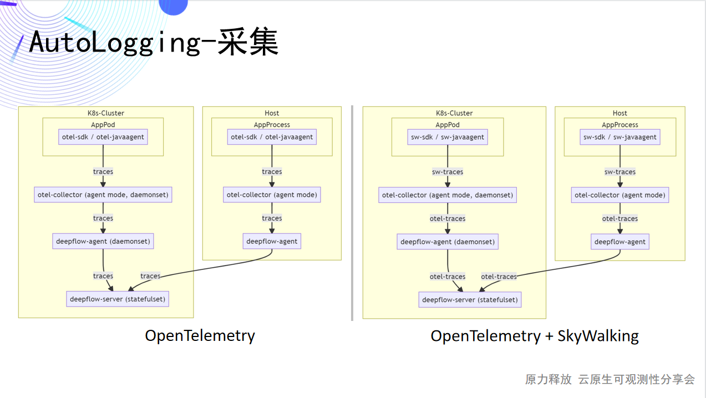
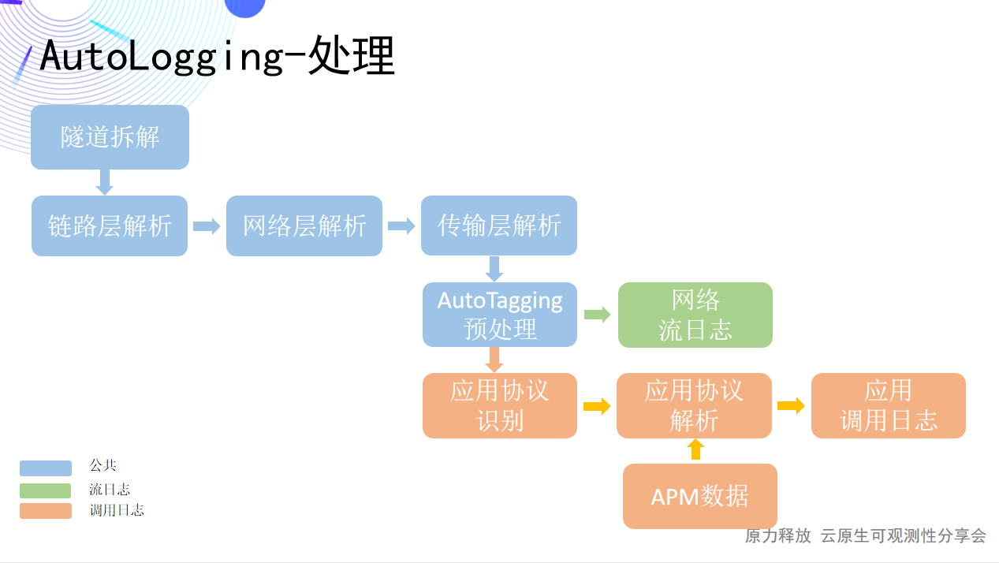

本文为云杉网络`原力释放 - 云原生可观测性分享会`第九期直播实录。[回看链接](https://www.bilibili.com/video/BV1Z14y147XM?spm_id_from=333.337.search-card.all.click)，[PPT 下载](http://yunshan-guangzhou.oss-cn-beijing.aliyuncs.com/yunshan-ticket/pdf/f9d3931bd360757b30b91d93d1aa9621_20220823171717.pdf)。

DeepFlow 是一款开源的高度自动化的可观测性平台，是为云原生应用开发者建设可观测性能力而量身打造的全栈、全链路、高性能数据引擎。DeepFlow 使用 eBPF、WASM、OpenTelemetry 等新技术，创新的实现了 AutoTracing、AutoMetrics、AutoTagging、SmartEncoding 等核心机制，帮助开发者提升埋点插码的自动化水平，降低可观测性平台的运维复杂度。利用 DeepFlow 的可编程能力和开放接口，开发者可以快速将其融入到自己的可观测性技术栈中。

今天的内容是云杉网络“云原生可观测性分享会”的直播里面第八期[DeepFlow 首个开源版本](https://deepflow.yunshan.net/blog/001-a-new-era-of-automated-observability/)的分享的延续，上篇主要和大家详细聊了 AutoMetrics 和 AutoTracing 的能力，对于可观测领域三大支柱的的 Logging，在这次博客及直播中给大家带来详细讲解。

今天从三个方面给大家进行分享：
- 一：分享应用调用日志，从数据来源、数据抽象到数据使用三个角度和大家谈谈，如何自动采集的 HTTP/MySQL 等多协议调用日志；
- 二：分享网络流日志，主要对比公有云的流日志及流日志的应用场景；
- 三：讲解 AutoLogging 的实现，基于 BPF/eBPF 的自动日志采集能力。

## 0x0: 应用调用日志 - 数据来源

首先强调，应用调用日志与应用在代码层面打的日志不同，例如 Nginx 的 AccessLog，MySQL 的 General Log/Error Log 这些都是调用日志的范畴。

但是这些日志都是单个组件的日志，并不是应用的调用日志，对于应用问题的排查，需要挨个去找组件的负责人看日志，但组件负责人不懂业务，不知道如何快速搜索日志，导致了问题的排查过程中协作成本巨高。

应用的调用日志是给 Dev 团队建设的，一个站在应用视角快速查看所有的调用详情信息的能力，其实这个能力获取可以将目前现有的组件日志都集中起来查看也是一种思路，但是如何以应用无感知/自动化的形式低成本的接入，以及更符合云原生的这个理念来实现的话，这是目前市面上没有的，这是 DeepFlow 的 AutoLogging 的价值点所在。

DeepFlow 的调用日志，其实由各种各样的应用协议组成的，目前 DeepFlow 平台上已经包含了例如网络应用的 HTTP 的访问日志、DNS 的查询日志、SQL/NoSQL 的操作日志、RPC 的调用日志、MQ 的 API 调用日志，也会包含可观测领域中 Tracing 的数据，例如 OpenTelmetry 协议的 Span 调用，还会陆续支持一些物联网的协议，例如 MQTT 的日志。

## 0x1: 应用调用日志 - 数据抽象

可以看到数据的来源非常的丰富，随着社区的需求和版本的迭代，将会有更多协议的数据接入。如果需更好的使用这些‘五花八门’的数据，需要对数据进行治理，治理的第一步，对数据进行统一的抽象，数据抽象将从公共字段、请求字段、响应字段、指标量，这四个层面来展开：

- 公共字段：包含应用协议、协议版本、日志类型，其中日志类型包含请求/响应/会话类型，一般协议都是这三种，也会有一些协议有些例外，例如 OpenTelemetry 协议，仅一个会话类型。
- 请求字段：整体抽象为请求类型、请求域名、请求资源、请求 ID，例如 HTTP 的方法，MySQL 的命令类型，DNS 的查询类型都为请求类型，HTTP 的 host 对应请求域名，HTTP 的 Url、MySQL 的命令、DNS 的查询名称都对应请求资源，这个请求资源的抽象是参考各个 APM 的厂商的定义，例如 Datadog 的 Resource，Skywalking 的 Endpoint。
- 响应字段：分为响应状态、响应码、响应异常、结果，整体来说基本都是对应响应码映射的。
- 指标量：分为吞吐请求长度、响应长度的字段，以及响应时延字段，结合指标量可以更好的分析调用。

## 0x2: 应用调用日志 - 自定义属性

数据抽象的收益是统一管理，可弊端也在统一。在设计之初，其实就考虑了要做自定义属性的扩展，随着 OpenTemetry 的 Tracing 数据接入，这个事情就变的更加重要。

因此除了定义的标准字段外，又定义了 Attribute_Names 和 Attribute_Values 这两个数组，数组里面可以携带自定义属性和自定义属性对应的值，这个是根据不同的需求来携带，没有长度和格式的限制，非常的灵活。

两个数组里面的 Key 和 Value 按顺序来进行映射，在产品化的时候，通过 Qurey 组件进行转化，用户是无感知数组的存在的，看到的都是 Key，Value 这样的属性关系，通过 Key 查询来获取 Value，这个和使用其他 Tag 查询的逻辑也是一致的。

## 0x3: 应用调用日志-AutoTagging

刚刚分析的是各种协议如何映射为调用日志，站在应用的视角已经可以统一查看调用日志了。

而如何快速过滤应用呢？这也是一个必须解决的问题，在传统架构中，一般会根据 IP 段或者根据所在服务器来过滤，但是应用架构逐步迁移到云上，开始使用微服务架构后，IP 已经不再稳定，而资源也不再简单是服务器了，这种时候如何来快速过滤应用呢？

DeepFlow 的 AutoTagging 能力，可以给调用日志打上各种云厂商的标签，比如租户、区域、子网、云服务器、RDS、负载均衡器、NAT 网关、Kubernetes 的命名空间、容器服务、工作负载、动态 Label 等等，有了这些标签，则可以快速的根据各种云标签过滤应用，然后查看应用的调用日志了。

以上主要和大家分享了应用调用日志背后数据处理的一些理论能力，接下来带大家感受下基于这样的能力，应用调用日志激发的实际价值。

## 0x4: 应用调用日志 - 总览

这是基于调用日志构建的一张 Grafana 的 Dashboard，这个 Dashboard 主要可查看服务的调用关系、RED 指标量。Dashboard 就是基于前面数据抽象来实现的。

我们可以通过 AutoTagging 打上的标签，Dashboard 主要使用 Kubernetes 相关的标签，快速过滤应用，比如 DeepFlow 这个应用，就直接过滤 Namespace=DeepFlow 就可以了。然后结合 Grafana 的一些阈值能力，就可以快速的在视觉找到需要关注的服务，从而缩小问题定位的范围。

## 0x5: 应用调用日志-HTTP 访问日志

接下来看看如何查看 HTTP 的调用日志以及 DeepFlow 平台的调用日志与 AccessLog 的差异。

左边是在 Grafana 上构建的应用调用日志的 Dashboard，可根据 TAG 过滤应用，根据 Protocol 过滤 HTTP、HTTPS、HTTP2 协议，即可查看当前服务的 HTTP 的调用日志。

右边是将 AccessLog 与 DeepFlow 的应用调用日志做的一个映射，通过对比，可看出来除了 remote_user 其他都能映射的非常好。

HTTP 访问日志除了作为代替 AccessLog，还可以结合调用日志的状态和指标量，快速知道哪些调用存在异常，哪些调用响应慢。

## 0x6: 应用调用日志-MySQL 慢查询日志

对于 MySQL 慢查询的日志，在云上数据库实例化后，想看数据库的日志，其实并不容易，需要在云上开启各种设置和权限，及时看到了日志，也比较难快速的去过滤对应的应用日志

我们来看看 DeepFlow 是如何查看慢查询日志的，这个是刚刚 HTTP 调用日志一样的 Dashboard，仅需要切换下搜索条件即可，将协议切换为 MySQL，request_type 输入为 COM_QUREY，以及 request_resource 为 SELECT*。

设置好这样的过滤条件，得到的就是 MySQL 的查询日志，接着再对响应时延排序过滤，就可以找到慢查询了。

## 0x7: 应用调用日志 - 分布式追踪 Span 日志

除了看网络应用协议的调用日志外，通过前面的数据来源我们也知道，调用日志也支持接入分布式追踪协议的 Span 信息。

目前 DeepFlow 已经支持对接 OpenTelemtry 的 Span 信息，每个 Span 其实都对应着一个调用，当前展示的就是 Opentelemtry 的一个 Span 日志。

接入 Span 的信息后，除了可以看日志，根据状态、指标量来定位调用问题外，还有一个重要的目的，就是还可以基于目前 DeepFlow 平台已有的网络中采集的调用和通过 eBPF 采集的调用，进行全栈全链路的追踪。

## 0x8: 应用调用日志 - 全栈全链路追踪

这就是一个最终追踪出来的火焰图，这个火焰图上不仅包含应用代码层面的调用，也包含了系统层面、网络层面，针对如何追踪这个事，由于时间问题，今天就不展开细说，我会利用后续的直播继续给大家详细的去分享，如何对应用进行全栈全链路的追踪。

应用调用日志，仅能观测到应用层面的一些问题，DeepFlow 可以通过 FlowID 将应用调用背后的网络流日志关联起来。接下来分享网络流日志能有什么样的能力。

## 0x9: 网络流日志 - 功能定义

先看下公有云对网络流日志的功能说明，这是阿里云的一个定义，是捕获特定位置的流量，将流量转化为流日志记录下来，流日志是记录捕获特定时间窗口的特定五元组的网络流。

对于基础功能的定义，DeepFlow 是有遵循公有云的定义的，并在此基础上还有更丰富的能力。

## 0x10: 网络流日志-DeepFlow 与公有云对比

接下来看看 DeepFlow 流日志与公有云流日志的对比，解读其中的一些差异点。

先看看捕获周期，DeepFlow 的粒度能小到 1 分钟，同时捕获位置 DeepFlow 也更丰富，除了 VPC 网络，也会覆盖到容器网络、物理网络、也能从网络层面扩展到系统层面。

接着看看 TAG，配合 DeepFlow 的 AutoTagging 的能力，DeepFlow 流日志的 TAG 是远比公有云更丰富的，除了 VPC 网络的一些 Tag，还包含隧道的 Tag、容器网络，以及更丰富的采集位置 Tag。

接着指标量，公有云仅有 Packet/Byte 这两个，DeepFlow 则覆盖了从网络吞吐到性能，再到时延多个维度。

在 DeepFlow 的流日志中，增加了流状态字段，可通过此字段快速过滤异常的流，这是目前公有云上不支持的。当然公有云支持的日志状态字段和安全策略的状态，DeepFlow 目前不支持，不过此功能也已经加入到排期中了。

其次从成本上看，DeepFlow 开源版本可一键部署于自建环境。

下面我们来看下 DeepFlow 网络流日志功能，具体能解决什么问题。

## 0x11: 网络流日志 - 总览

这是基于网络流日志构建的 Granafa 的 Dashboard，是可以和应用调用日志一样，查看服务的调用关系，但是和应用调用日志不一样的是，这个总览的 Dashboard 查看的是网络层面的指标量，比如吞吐、重传、建连失败、建连时延等指标数据。

## 0x12: 网络流日志 - 网络时延

查看应用调用日志时，经常会关注响应时延慢的调用，可这个响应慢，除了应用本身响应慢以外，还可能是 TCP 建连慢，也有可能是数据传输，也可能是协议栈慢，对于网络相关时延的排查，需要查看应用调用对应的流日志来分析。

首先应用调用日志和网络流日志是如何关联的，DeepFlow 平台上是通过一个 FlowID 来将两个日志进行关联，因此可以根据调用日志的 FlowID，在流日志中进行查找，找到这条调用对应的流日志，然后分析流日志中的建连时延、系统时延和数据传输时延指标量，排查网络时延高导致了应用调用响应慢。

## 0x13: 网络流日志 - 流状态异常日志

应用调用日志是可以根据状态查看异常日志，流日志也是一样，可以对状态进行过滤查看异常的流日志，因此这个时候就能去看看调用异常背后是否因为网络异常导致。

右上角给出来了 DeepFlow 流日志里面的状态定义，主要对流结束类型来进行定义，比如建连时延，因为端口复用可关闭，比如传输过程中，服务端发送 RST 报文导致的结束。

## 0x14: 网络流日志-TCP 时序日志

接下来继续深入的结合 TCP 时序日志，分析具体的包的时延和问题。特别说明下：TCP 时序日志目前是 DeepFlow 企业版的增强功能了，现在开源的版本里面是没有的。

用一个[简单的 Demo](https://ce-demo.deepflow.yunshan.net/)，讲解开源的调用日志和流日志功能。这是我们给开源社区搭建的一个 Demo 环境，这个 Demo 环境是基于 Grafana 来构建的，已经构建了很多应用和网络相关的 Dashboard。

## 0x15: AutoLogging-采集

接下来从日志采集和日志处理两个方面给大家介绍，AutoLogging 是如何基于 BPF/eBPF 来自动采集日志的。

首先我们来看看采集部分，采集部需分别从调用日志和流日志两个方面来看。

- 流日志：流日志通过前面产品介绍可知，是根据网络流量来生成的日志，因此采集则主要集中在网络层面，目前可覆盖物理网络一直到虚拟网络，可以采集宿主机到虚拟机、一直到容器 POD 的网卡的流量，在实现上流日志通过 BPF + AF_PACKET 技术来完成，其中 Windows 系统的采集则通过使用 Winpcap 来完实现的。
- 调用日志：调用日志的数据包含两部分数据，一部分是从网络应用协议来的，还有一部分是可观测的 Tracing 数据。

对于网络应用协议这部分的数据，调用日志既包含了网络层面采集的，也扩展到了 Sidecar 和应用进程层面，对于网络层面采集的位置和实现技术与流日志是一致，只是处理逻辑会有一些不一样；而对于 Sidecar 和应用进程层面，则是使用 eBPF 技术来实现的，其中对于非加密和非压缩的协议，则通过 eBPF 的 Kprobe 和 Tracepoints 来完成，而对于 HTTP2、HTTPS 则需要使用 Uprobe 来完成。

对于 Opentelemetry 的数据接入，是通过 Otel-Collector 将 Traces 的数据发送给 deepflow-agent，就完成了 Tracing 的数据接入。采集的部分先分享到这里，接下来我们看看采集完成后，会进行些什么样的处理。

## 0x16: AutoLogging-处理

对于日志的处理，分为三个部分：公共处理部分、流日志处理、调用日志处理。

对于网络流量的处理可分为：隧道拆解，其中对于隧道拆解，基本主流的隧道协议，都已经支持，比如 Vxlan，IPIP，Gre 等等。隧道拆解完成后，则会按协议栈的顺序依次解析协议，从链路层一直到传输层。

接着需要对于流量进行 AutoTagging 的预处理，这里主要加上唯一的 Tag，方便后面 Server 根据唯一 Tag 增加全量 Tag。到这步，对于不同的日志需要分开处理了，对于网络流日志，此时可以根据产品定义去生成流日志。

对应用调用日志，还需要完成应用协议识别，确定具体协议后，再进行应用协议解析，最后才能根据定义生成调用日志。

对于应用调用日志，除了刚刚分享的这个处理流程，还有另外一条路径，主要是因为应用调用日志不仅包含网络应用协议，还包含 APM 定义的 Tracing 数据，对于这部分数据，可以直接接入，接入后直接解析即可。

## 0x17: 应用调用日志 - 协议扩展

额外说下如何扩展一个应用协议。前面一直在说应用调用日志支持接入各种各样的协议，这里大概分享下协议接入需要做一些什么事情。

第一部分：需要解析协议；

第二部分：协议解析完成后，需要将协议映射到调用日志中；

第三部分：除了调用日志外，DeepFlow 还提供预聚合数据的能力，对应用 RED 指标进行计算。

协议扩展要做的事情就是这些，目前 DeepFlow 已经开源，也欢迎开源社区的小伙伴们来贡献更多的协议，让应用调用日志更丰富。

## 0x18：总结

今天的分享主要侧重在框架的讲解，并不涉及太多代码细节，如果大家对实现细节感兴趣的话，可以直接查看 GitHub 上的代码，下方是 DeepFlow GitHub 的链接。

GitHub 地址：https://github.com/deepflowys/deepflow

## 0x18: 未来迭代的方向

最后分享下未来 DeepFlow 关于日志的一个迭代方向。

目前 DeepFlow 在 Logging 方向上，有 AutoLogging 的能力，后面还会持续做日志集成，会接入 Promtail、Fluentd 等等的数据，并利用 AutoTagging 的能力，注入各种标签，更符合云原生设计理念。

