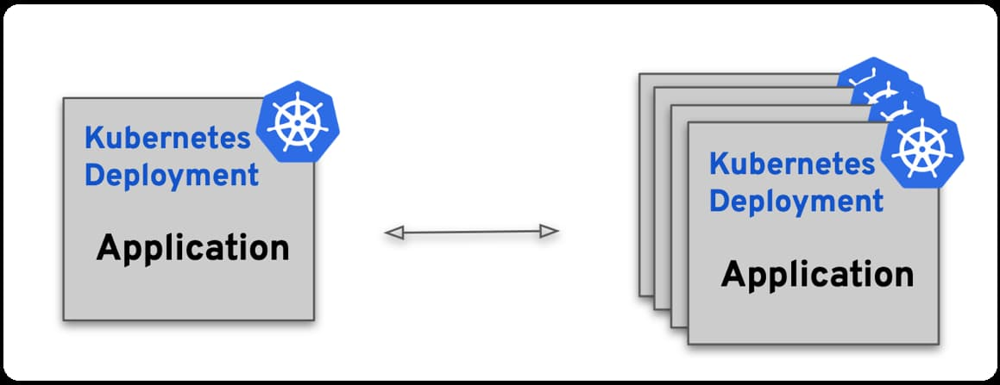
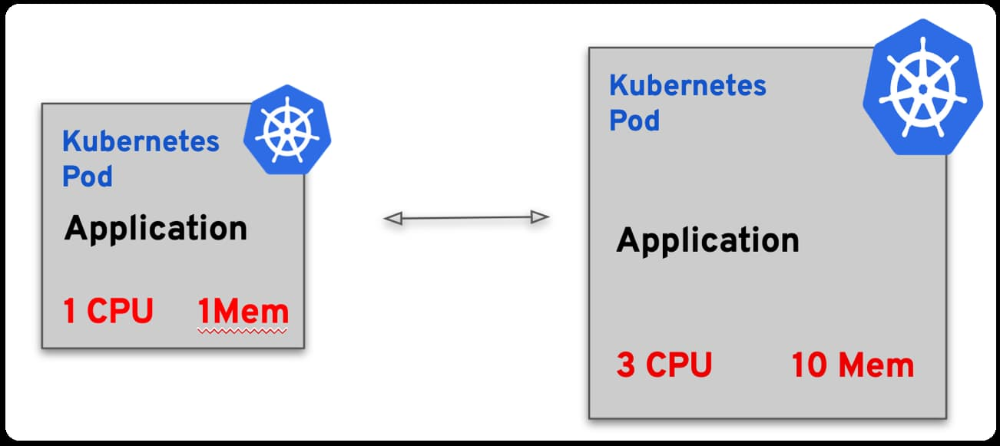
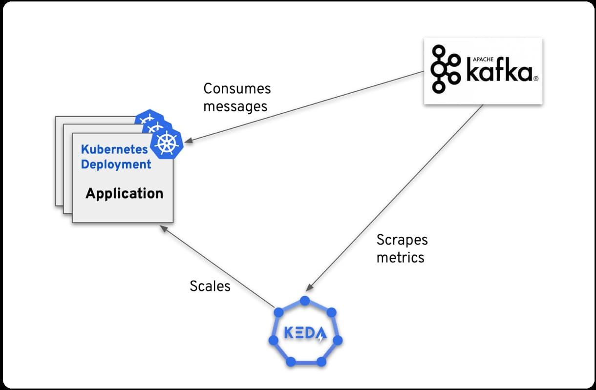

本文译自：[Battle of the Pods: Kubernetes Autoscaling Showdown - KEDA vs. vanilla Kubernetes](https://www.kedify.io/blog-posts/battle-of-the-pods-kubernetes-autoscaling-showdown-keda-vs-vanilla-kubernetes)

摘要：本文比较了 Kubernetes 的内置自动伸缩器（HPA 和 VPA）和 KEDA 项目的优缺点，分析了它们在不同场景下的适用性和效果，展示了 KEDA 如何解决 HPA 和 VPA 无法覆盖的复杂需求。

### 1. 引言：自动伸缩的重要性

在今天的云原生生态系统中，波动的工作负载和动态的流量模式是常态。适应这种不可预测的行为需要能够实时调整的系统。自动伸缩是必需的，可以确保资源的最佳分配，遏制过度成本，并促进资源的高效使用。

自动伸缩不仅关乎成本。它在维护应用性能和吞吐量方面发挥着关键作用。通过避免欠配置（导致用户体验不佳）和过度配置（导致不必要的成本），自动伸缩可以实现合理的平衡。

### 2. 竞争者：了解基础知识

### 水平 Pod 自动伸缩器（HPA）

[HPA](https://kubernetes.io/docs/tasks/run-application/horizontal-pod-autoscale/)，作为 Kubernetes 的本地解决方案，根据观察到的指标（主要是 CPU 和内存）来扩展 Pod 的数量。虽然对于统一的工作负载来说非常直接和有益，但当考虑到其无法扩展到零并且完全依赖 CPU 和内存指标时，它的局限性就变得明显了。

### 垂直 Pod 自动伸缩器（VPA）

[VPA](https://github.com/kubernetes/autoscaler/tree/master/vertical-pod-autoscaler#intro)更多地涉及资源的调整而不是扩展它们。它评估需求并动态调整资源，确保工作负载的合适适配。但这里有一个问题：增强型的 Pod 并不一定更好。有时，拥有更多的工作进程来处理数据比拥有一个大而强大的工作进程更高效。

## 3. 限制：当原生 Kubernetes 自动伸缩器不足以应对时

尽管内置的 Kubernetes 自动伸缩器如 HPA 和 VPA 提供了基本的扩展能力，但它们在范围上天然有限。它们主要关注 CPU 和内存指标可能对于现代应用来说是一个重大限制，因为这些应用可能需要对各种指标做出反应，其中一些甚至可能不是来自应用程序本身的指标。

现代应用面临的引人注目的挑战之一是根据外部系统的事件来进行扩展。例如：

- **消息队列：** 应用程序可能需要根据队列中的消息数量（如 RabbitMQ 或 Kafka）来进行扩展。如果有大量未处理的消息涌入，这可能是一个扩展的指标。
- **数据库触发器：** 数据库中的更改或更新（如某个表的行突然增加）可能需要将应用程序进行扩

展以处理或分析数据的涌入。
- **外部 Webhook：** 来自第三方服务的传入 Webhook（例如 GitHub 推送或电子商务交易事件）可能需要更多的资源来处理额外的负载。
- ‍**IoT 信号：** 对于连接到物联网设备的应用程序，来自这些设备的信号可能是需要扩展的指标。

此外，还存在将扩展到零的必要来有效管理资源的情况，或者存在不同指标的组合决定扩展逻辑的情况，例如 CPU 利用率与数据库读/写速率。这些微妙的需求突显了内置 Kubernetes 自动伸缩器的不足之处。‍

### HPA 的自定义指标扩展

Kubernetes 引入了一个[自定义指标](https://kubernetes.io/docs/tasks/run-application/horizontal-pod-autoscale/#scaling-on-custom-metrics)的接口，旨在为水平 Pod 自动伸缩器（HPA）提供更多超越 CPU 和内存指标的适应性。然而，实际实现中出现了挑战。

尽管强大，但自定义指标 API 并不直观易用。它要求对 Kubernetes 内部有详细的了解，使设置和调整变得繁琐。‍

### 插曲：Prometheus 适配器

[Prometheus 适配器](https://github.com/kubernetes-sigs/prometheus-adapter)试图通过利用自定义指标 API 来弥合这一差距，引入了 Prometheus 的广泛指标。但它也有一些缺点：复杂、不直观的配置以及仅与 Prometheus 指标相关联。实施和维护配置需要不断的警觉性。基础架构或应用程序的更改可能会触发重新配置的需求。

### 4. 登场 KEDA：对决中的英雄

[Kubernetes 事件驱动自动伸缩（KEDA）](https://keda.sh/)不仅与 Kubernetes 的自定义指标 API 集成，还使其变得更加可访问。这是用户友好界面如何改变体验的证明，使自动伸缩真正具有可定制性和多功能性。

### KEDA 的好处

KEDA 提供了多个技术优势：

- **事件驱动自动伸缩：** KEDA 能够响应特定事件，甚至扩展到零，确保资源得到明智地使用。
- **易于使用：** 其直观的配置使实施变得轻松，允许开发人员专注于应用逻辑而不是配置语法。
- **广泛应用：** 除了仅扩展 Pod 外，KEDA 还可以基于事件安排 Kubernetes 作业，适用于不需要持续运行但可能需要定期大量资源的任务。
- **多功能集成：** 支持多种身份验证提供程序，集成 KEDA 既简单又安全。‍

### KEDA 在实践中的应用

虽然传统的指标如 CPU 和内存提供了一些见解，但现实世界的应用程序通常需要更精细和多样化的指标来进行有效的自动伸缩。以下是一些要考虑的情景：

- **事件驱动应用程序：** 考虑一个基于 Kafka 的设置。虽然 CPU 使用率可能保持稳定，但传入 Kafka 事件的激增是确定负载的真正指标。在这种情况下，自动伸缩应该理想地对入站事件的速率或消息积压做出响应。
- **电子商务交易：** 在电子商务框架中，特殊销售活动可能会导致订单结帐激增。CPU 可能不受影响，但真正的负载可能是数据库队列中积累的未处理订单。
- **流数据管道：** 从平台（如 Apache Kafka 或 AWS Kinesis）处理数据流的应用程序会经历可变的数据流入率。在这里，相关的指标可能是处理的积压或滞后，而不是 CPU 或内存消耗。
- **Selenium 测试工作者：** 在持续集成（CI）流水线中，当提交新代码时，可能会触发一系列 Selenium 测试。这里真正的度量标准可能是等待测试的队列。如果有大量等待测试的测试存在瓶颈，基于这个队列来自动伸缩 Selenium 工作者比仅仅观察 CPU 或内存指标更有效。
- **API 速率限制：** 对于大量依赖第三方 API 且具有速率限制的应用程序，接近速率限制可能是需要进行伸缩的信号。与对速率限制错误的被动反应不同，基于 API 调用频率进行主动伸缩可以确保操作顺利进行。

这样多样化的现实场景强调了需要一种多功能的自动伸缩解决方案，能够理解并响应多种度量标准。KEDA 凭借其灵活性和适应性有效地应对了这些挑战。

### 5. 结论：KEDA 自动伸缩的未来

尽管 Kubernetes 拥有原生的自动伸缩工具如 HPA 和 VPA，以及像 Prometheus 适配器这样的扩展，但它们通常伴随着复杂性。而 KEDA 提供了一个简单的平台，适用于各种各样的自动伸缩需求。它处理事件驱动的扩展，包括缩减到零，这是一个重大优势。此外，设置 KEDA 更加简单，减少了用户在处理 Kubernetes 自定义指标时通常会遇到的典型障碍。

KEDA 的活跃社区证明了它的实用性。对该项目的定期贡献、像 Kedify 或 Microsoft 这样的供应商以及不断增加的[企业采用](https://keda.sh/community/#end-users)显示出它在 Kubernetes 生态系统中日益重要。
