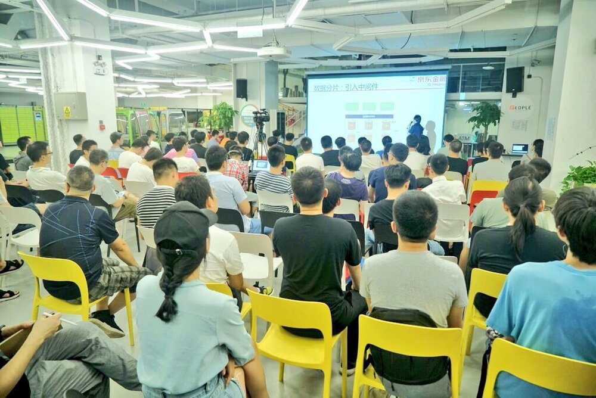
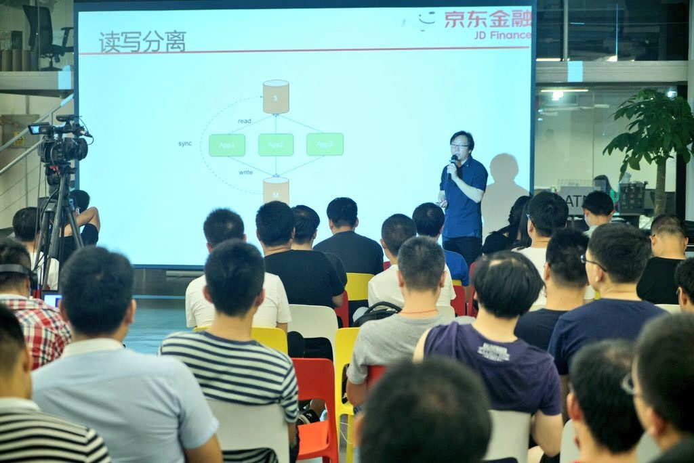
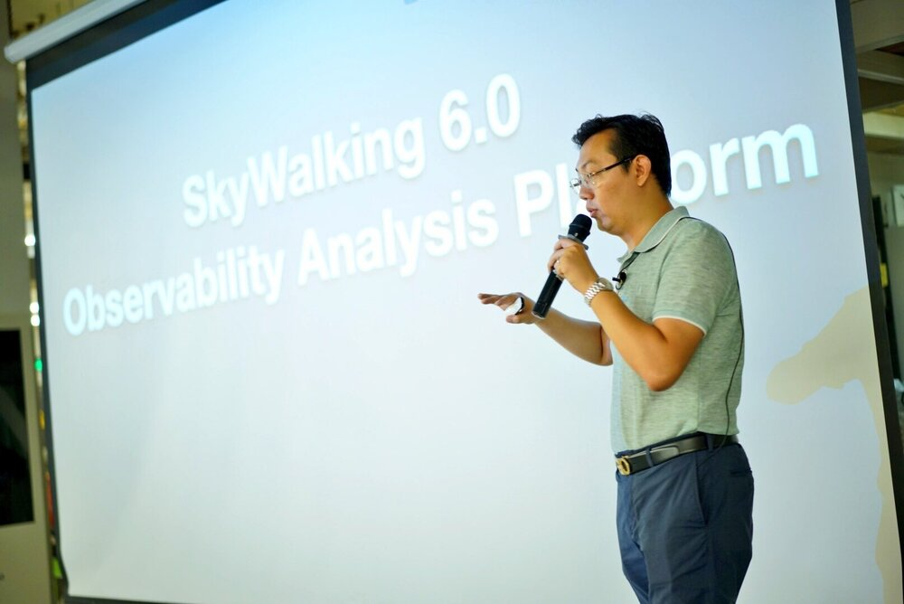
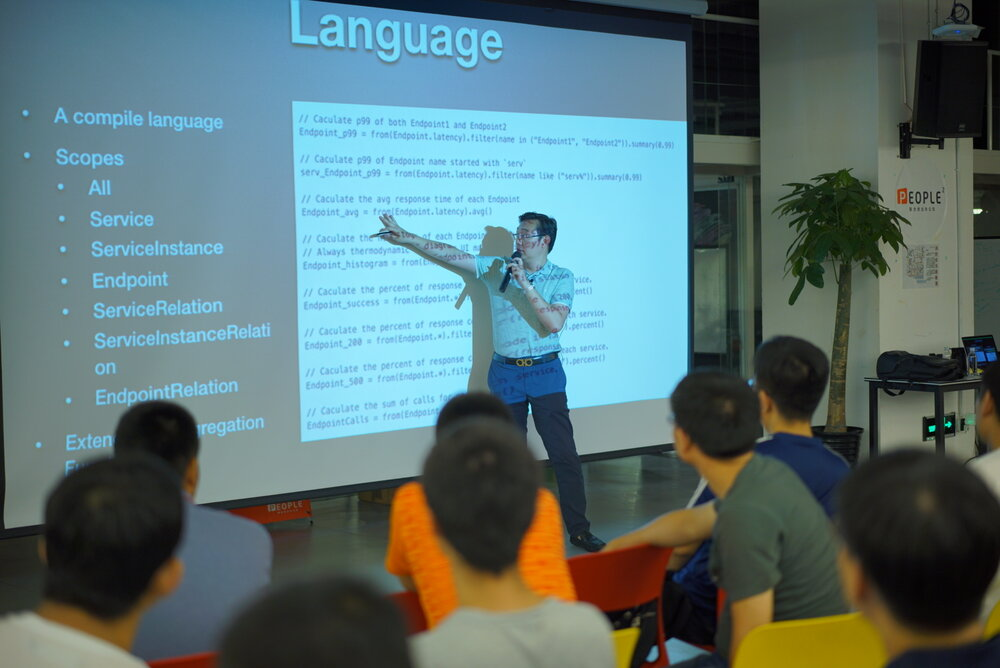
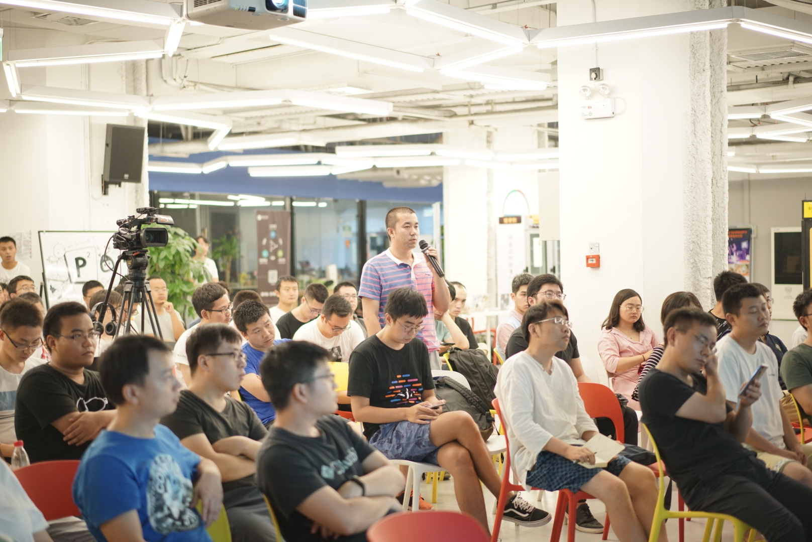
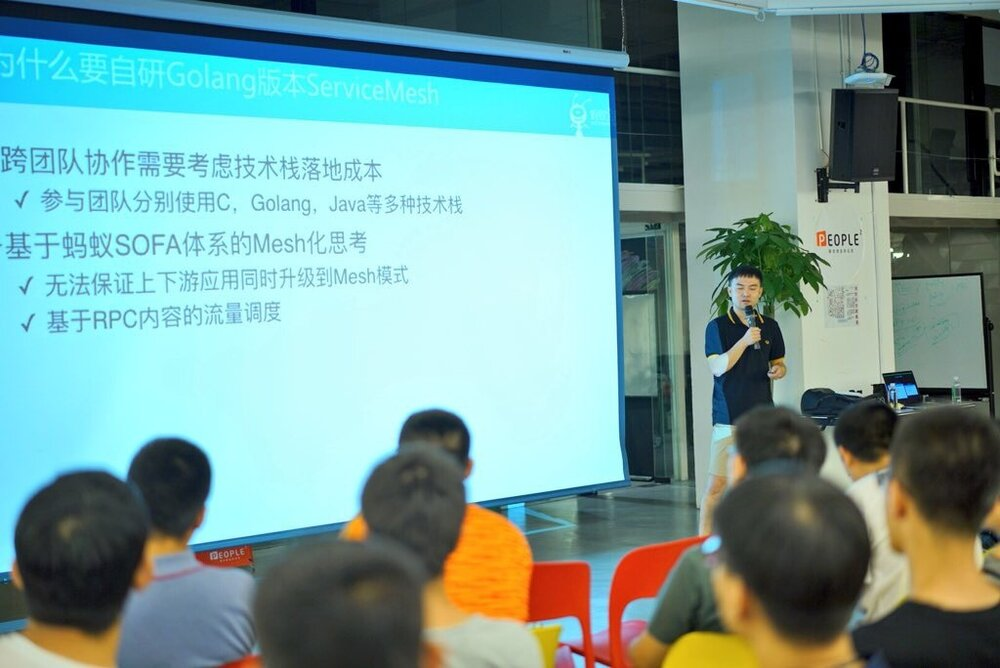
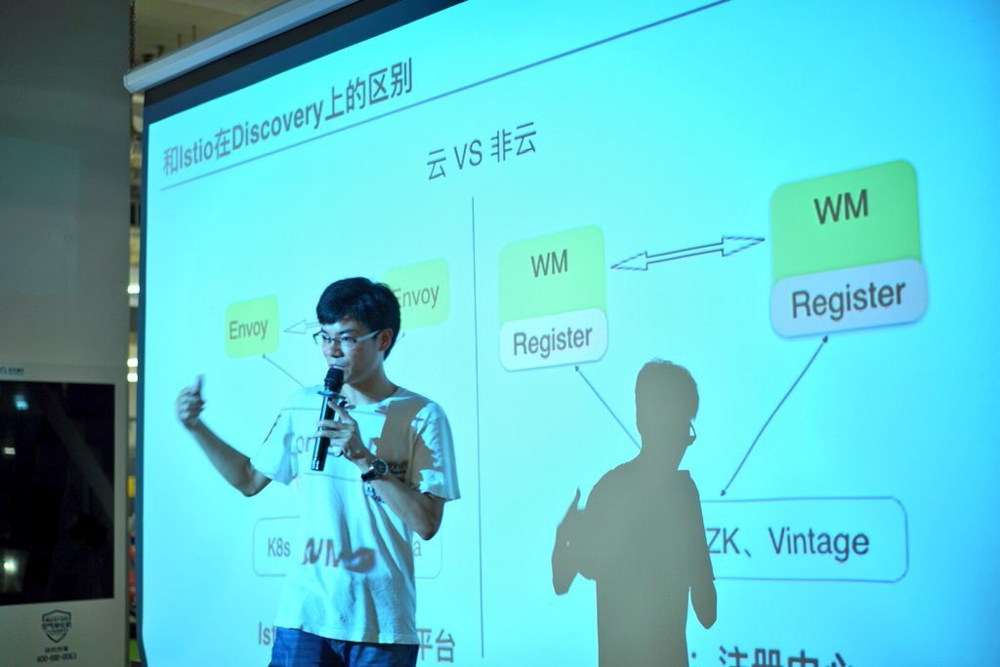
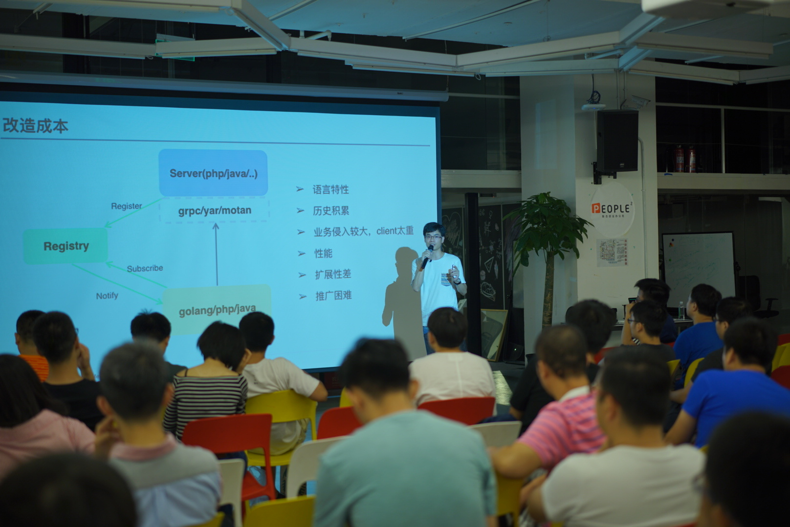
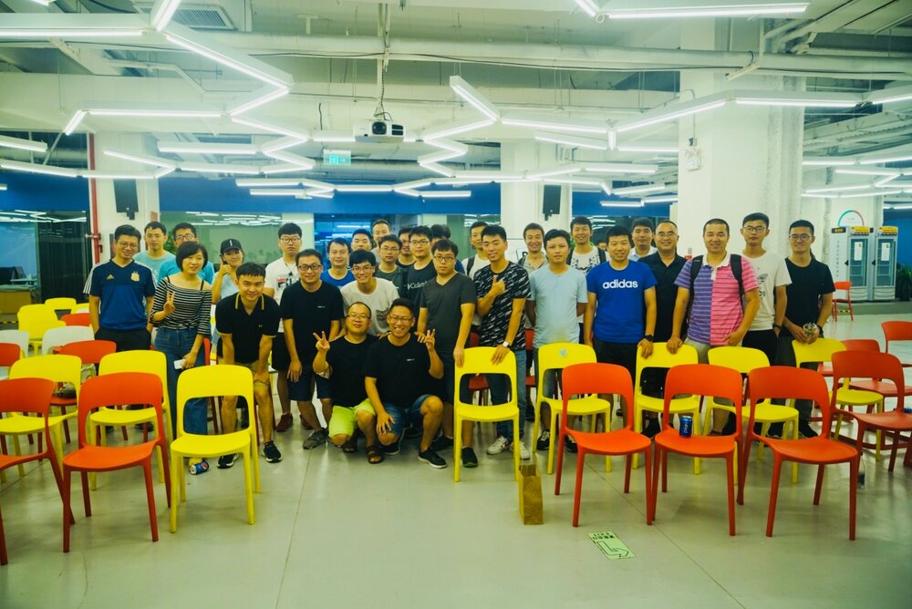

2018 年 7 月 29 日，周日，天气闷热，北京中关村 e 世界。

由 ServiceMesher 社区和蚂蚁金服联合举办的，Sharding-Sphere 社区、Apache SkyWalking 社区、SOFA 社区、新浪微博协办的第二届 Service Mesh Meetup 北京站圆满落幕。

**张亮（京东金融数据研发负责人）Service Mesh 的延伸 —— 论道 Database Mesh**

**吴晟（Apache SkyWalking 创始人），Observability on Service Mesh —— Apache SkyWalking 6.0**

**朵晓东（蚂蚁金服，高级技术专家），蚂蚁金服开源的 Service Mesh 数据平面 SOFA MOSN 深层揭秘**

**丁振凯（新浪微博，微博搜索架构师），微博 Service Mesh 实践 - WeiboMesh**

结束时 Service Mesh 铁杆粉丝的合影。

最好还要感谢我们的工作人员、志愿者和 IT 大咖说提供视频直播支持。

ServiceMesher 社区的使命

- 传播 Service Mesh 技术
- 加强行业内部交流
- 促进开源文化构建
- 推动 Service Mesh 在企业落地

## 更多资料

关于本次活动的更多信息请关注本公众号和[社区官网](http://www.servicemesher.com)的后续报道。

在 IT 大咖说上观看视频重播：http://www.itdks.com/eventlist/detail/2455

讲师的 PPT 和历届 Service Mesh Meetup 的幻灯片下载请访问 GitHub：https://github.com/servicemesher/meetup-slides

