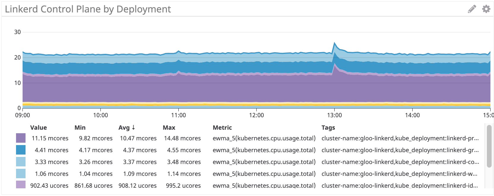
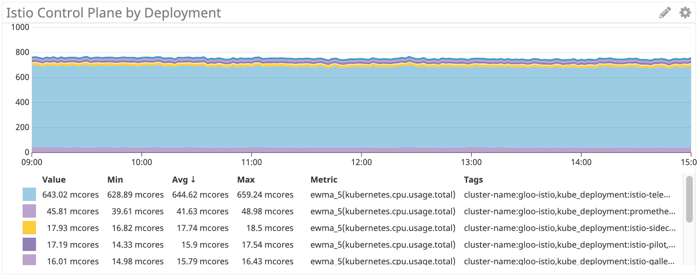
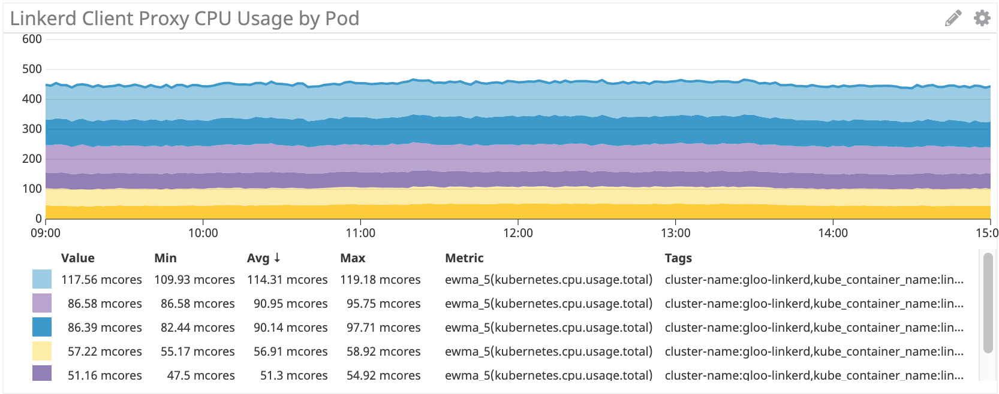
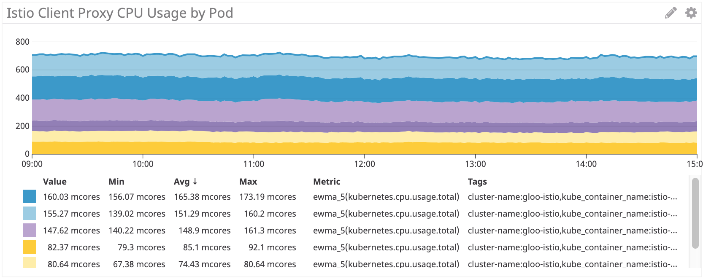
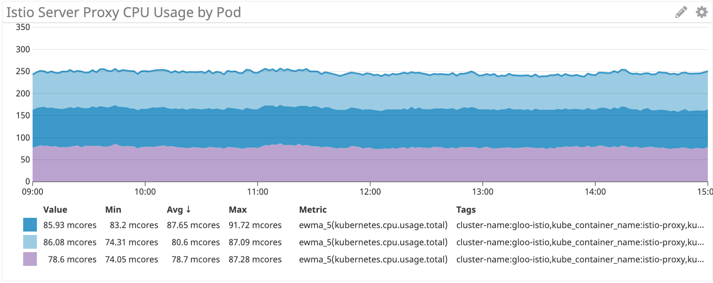

本文为翻译文章，[点击查看原文](https://medium.com/@michael_87395/benchmarking-istio-linkerd-cpu-c36287e32781)。

## 编者按

作者是 Shopify 的工程师，公司在引入 Istio 作为服务网格的过程中发现消耗的计算成本过高。基于此问题，作者使用了公司内部开发的基准测试工具 IRS 对 Istio 和 Linkerd 的 CPU 使用情况做了测试和对比。测试结果发现 Istio 在 CPU 的使用上要比 Linkerd 耗费更多的资源。这为 Istio 的拥趸们敲响了警钟，提醒大家 Istio 在生产化的道路上还有很多需要优化的地方。

## 背景

在[Shopify](https://www.shopify.ca/)，我们正在部署 Istio 作为服务网格。我们做的很不错但遇到了瓶颈：成本。

Istio 官方发布的基准测试情况如下：

> 在 Istio 1.1 中一个代理每秒处理 1000 个请求大约会消耗 0.6 个 vCPU。

对于服务网格中的第一个边界（连接的两端各有两个代理），1200 个内核的代理每秒处理 100 万个请求。Google 的价格计算器估计对于`n1-standard-64`机型每月每个核需要 40 美元，这使得这条单边界的花费超过了 5 万美元/每月/每 100 万请求。

[Ivan Sim](https://medium.com/@ihcsim) 去年写了一个关于服务网格延迟的[很棒的文章](https://medium.com/@ihcsim/linkerd-2-0-and-istio-performance-benchmark-df290101c2bb) ，并保证会持续更新 CPU 和内存部分，但目前还没有完成：

> 看起来 values-istio-test.yaml 将把 CPU 请求提升很多。如果我算的没错，控制平面大约有 24 个 CPU，每个代理有 0.5 个 CPU。这比我目前的个人账户配额还多。一旦我增加 CPU 配额的请求被批准，我将重新运行测试。

我需要亲眼看看 Istio 是否可以与另一个开源服务网格相媲美：[Linkerd](https://linkerd.io/).

## 安装服务网格

首先，我在集群中安装了[SuperGloo](https://supergloo.solo.io/)： 

```bash
$ supergloo init
installing supergloo version 0.3.12
using chart uri https://storage.googleapis.com/supergloo-helm/charts/supergloo-0.3.12.tgz
configmap/sidecar-injection-resources created
serviceaccount/supergloo created
serviceaccount/discovery created
serviceaccount/mesh-discovery created
clusterrole.rbac.authorization.k8s.io/discovery created
clusterrole.rbac.authorization.k8s.io/mesh-discovery created
clusterrolebinding.rbac.authorization.k8s.io/supergloo-role-binding created
clusterrolebinding.rbac.authorization.k8s.io/discovery-role-binding created
clusterrolebinding.rbac.authorization.k8s.io/mesh-discovery-role-binding created
deployment.extensions/supergloo created
deployment.extensions/discovery created
deployment.extensions/mesh-discovery created
install successful!
```

我使用 SuperGloo 是因为它非常简单，可以快速引导两个服务网格，而我几乎不需要做任何事情。我们并没有在生产环境中使用 SuperGloo，但是它非常适合这样的任务。每个网格实际上有两个命令。我使用了两个集群进行隔离——一个用于 Istio，另一个用于 Linkerd。

然后我用下面的命令安装了两个服务网格。
首先是 Linkerd：

```bash
$ supergloo install linkerd --name linkerd
+---------+--------------+---------+---------------------------+
| INSTALL |     TYPE     | STATUS  |          DETAILS          |
+---------+--------------+---------+---------------------------+
| linkerd | Linkerd Mesh | Pending | enabled: true             |
|         |              |         | version: stable-2.3.0     |
|         |              |         | namespace: linkerd        |
|         |              |         | mtls enabled: true        |
|         |              |         | auto inject enabled: true |
+---------+--------------+---------+---------------------------+
```

然后是 Istio：

```bash
$ supergloo install istio --name istio --installation-namespace istio-system --mtls=true --auto-inject=true
+---------+------------+---------+---------------------------+
| INSTALL |    TYPE    | STATUS  |          DETAILS          |
+---------+------------+---------+---------------------------+
| istio   | Istio Mesh | Pending | enabled: true             |
|         |            |         | version: 1.0.6            |
|         |            |         | namespace: istio-system   |
|         |            |         | mtls enabled: true        |
|         |            |         | auto inject enabled: true |
|         |            |         | grafana enabled: true     |
|         |            |         | prometheus enabled: true  |
|         |            |         | jaeger enabled: true      |
```

几分钟后的循环 Crash 后，控制平面稳定了下来。

## 安装 Istio 自动注入

为了让 Istio 启用 Envoy sidecar，我们使用`MutatingAdmissionWebhook`作为注入器。这超出了本文的讨论范围，但简言之，控制器监视所有新的 Pod 许可，并动态添加 sidecar 和 initContainer，后者具有`iptables`的能力。

在 Shopify，我们自己写了许可控制器来做 sidecar 注入，但根据基准测试的目的，我使用了 Istio 自带的。默认情况下命名空间上有`istio-injection: enabled`的标签就可以自动注入：

```bash
$ kubectl label namespace irs-client-dev istio-injection=enabled
namespace/irs-client-dev labeled

$ kubectl label namespace irs-server-dev istio-injection=enabled
namespace/irs-server-dev labeled
```

## 安装 Linkerd 自动注入

要安装 Linkerd 的 sidecar 注入，我们使用标注（我通过`kubectl edit`手动添加）：

```yaml
metadata:
  annotations:
    linkerd.io/inject: enabled
```

```bash
$ k edit ns irs-server-dev 
namespace/irs-server-dev edited

$ k get ns irs-server-dev -o yaml
apiVersion: v1
kind: Namespace
metadata:
  annotations:
    linkerd.io/inject: enabled
  name: irs-server-dev
spec:
  finalizers:
  - kubernetes
status:
  phase: Active
```

## Istio 弹性模拟器 (IRS)

我们开发了 Istio 弹性模拟器来尝试一些在 Shopify 特有的流量场景。具体地说，我们想要一些可以用来创建任意拓扑结构的东西，来表示服务中可动态配置的特定部分，以模拟特定的工作负载。

限时抢购是一个困扰 Shopify 基础设施的问题。更糟糕的是，Shopify 实际上鼓励商家进行更多的限时抢购。对于我们的大客户来说，我们有时会提前得到预先计划好的限时抢购的警告。而其他客户完全是在白天或晚上的任何时候突然出现的。

我们希望 IRS 能够运行表示拓扑和工作负载的“工作流”，它们在过去削弱了 Shopify 的基础设施。我们引入服务网格的主要原因之一是在网络级别部署可靠和有弹性的功能，而其中重要的部分是证明它能够有效地减轻过去的服务中断。

IRS 的核心是一个 worker，它充当服务网格中的一个节点。可以在启动时静态配置 worker，也可以通过 REST API 动态配置 worker。我们使用 worker 的动态特性创建工作流作为回归测试。

一个工作流的例子如下：

- 启动 10 台服务器作为服务`bar`，在 100ns 之后返回“200/OK”
- 启动 10 个客户端，给每个`bar`服务发送 100RPS 请求
- 每 10 秒下线一台服务器，在客户端监控 `5xx`的错误

在工作流的最后，我们可以检查日志和指标来确定测试的通过/失败。通过这种方式，我们既可以了解服务网格的性能，也可以回归测试关于弹性的假设。

(*注意：我们在考虑开源 IRS，但目前还不是时候*)

## IRS 做服务网格基准测试

基于这个目的，我们安装了下面一些 IRS worker：

- `irs-client-loadgen`：3 个复制集给 `irs-client`发送 100RPS 请求
- `irs-client`：3 个复制集接受请求，等待 100ms 然后转发请求给 `irs-server`
- `irs-server`：3 个复制集 100ms 后返回 `200/OK` 

通过此设置，我们可以测量 9 个 endpoint 之间的稳定流量。在`irs-client-loadgen`和`irs-server`上的 sidecar 各接收总计 100 个 RPS，而`irs-client`则接收 200 个 RPS(入站和出站)。

我们通过[DataDog](https://www.datadoghq.com/)监控资源使用情况，因此没有维护 Prometheus 集群。

------


## 控制平面

首先来看看控制平面的 CPU 使用情况。



Linkerd 控制平面： ~22 mcores



Istio 控制平面：~750 mcores

Istio 控制平面比 Linkerd 多使用了大约**35 倍的 CPU**。不可否认，这是一个开箱即用的安装，大部分 Istio 的 CPU 使用来自遥测，当然它可以被关闭（以牺牲功能为代价）。即使移除 Mixer 仍然会有超过 100 个 mcore，这仍然比 Linkerd 多使用了**4 倍的 CPU**。

## Sidecar 代理

接下来，我们看一下 sidecar 代理的使用情况。这应该与请求速率成线性关系，但是每个 sidecar 都有一些开销，这会影响曲线的形状。



Linkerd：~100 mcore 为 irs-client，~50 mcore 为 irs-client-loadgen 

这些结果是有道理的，因为客户端代理接收的流量是 loadgen 代理的两倍：对于来自 loadgen 的每个出站请求，客户端接收一个入站请求和一个出站请求。



Istio/Envoy：~155 mcore 为 irs-client, ~75 mcore 为 irs-client-loadgen

Istio 的 sidecar 我们看到了同样的结果。

总的来说，Istio/Envoy 代理比 Linkerd 多使用了大约 **50% 的 CPU** 。

我们看到在服务端也是一样的情况：


Linkerd：~50 mcores 为 irs-server



Istio/Envoy：~80 mcores 为 irs-server

在服务端，Istio/Envoy 代理比 Linkerd 多使用了大约 **60% 的 CPU** 。

## 结论

对于这种综合的工作负载，Istio 的 Envoy 代理使用的 CPU 比 Linkerd 多了 50% 以上。Linkerd 的控制平面使用了 Istio 的一小部分，尤其是在考虑“核心”组件时。

我们仍在尝试解决如何减轻一些 CPU 开销——如果您有自己的见解或想法，我们很乐意听取您的意见。
