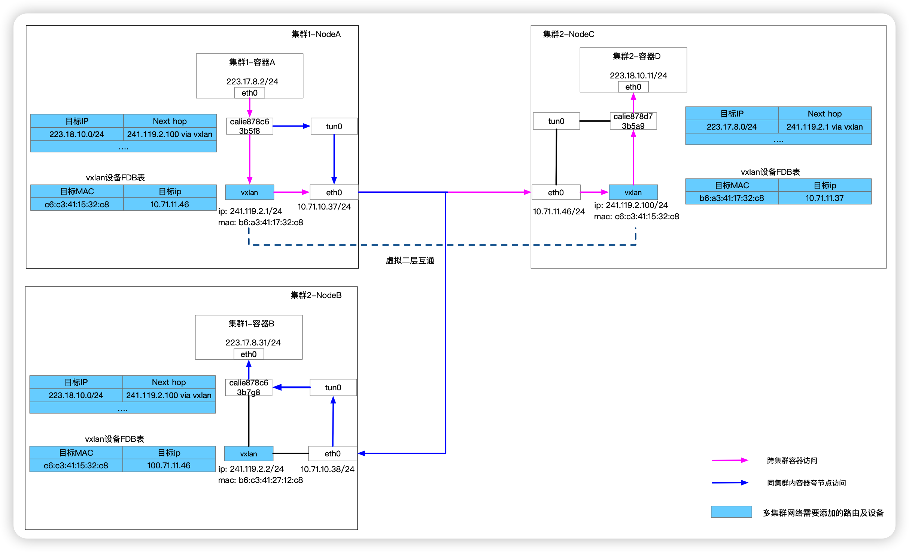

## 前言

近期由于产品需求需要打通多个 K8s 集群的容器网络，要求在一个集群的容器内，通过 Pod IP直接访问另外一个集群的容器，因此笔者对相关网络技术进行了一番学习。本文将解释整体的组网思路，简单分析数据包的流转过程，最后给出详细的实验步骤。

## 整体思路

Kubernetes 中常见的网络插件如 cni、fannel 等的实现中每个宿主机管理一个特定的容器网段，如主机 A 管理容器 223.17.8.0/24 网段，主机 B 管理 223.17.9.0/24 网段，将每个宿主机作为其上运行的容器的网关，并通过 vxlan，IPIP 等隧道技术，将包直接发往宿主机，再通过对应主机的路由到达容器中。因此我们也可以使用这种思路，将多个 K8s 集群的网络打通。



上图以安装 calico 网络插件的集群为例子，展示了如何利用 vxlan 打通多集群网络，我们需要做的是：为所有节点创建 vxlan 虚拟网卡，将其它集群每个节点管理 Pod 网段的路由信息添加到当前集群节点中，并且指定下一跳地址为其它集群节点的 vxlan 虚拟网卡的 ip 地址。为每个节点的 vxlan 网卡配置 FDB 表，FDB 表的内容是除当前节点外，其他节点 vxlan 网卡的 mac 地址以及他们的原生网络的 ip 地址映射。当数据包从容器出来，经过路由表转发到 vxlan 虚拟机网卡中，vxlan 虚拟网卡对数据包进行封包操作，以便在宿主机网络中传输。远端机器接收到数据后进行拆包，取出原始数据包，经过宿主机路由到达目标容器。

## VXLAN

VXLAN 是 linux 内核支持的一种隧道技术，通过隧道技术可以在宿主机网络上构建一个二层的虚拟网络。VXLAN 通过将二层的数据帧封装成四层的 UDP 数据包，然后在三层的网络中传输，效果就像在同一个网段中传包一样，在宿主机网络的层面看实际上是跨网段的，但却感知不到。经过 VXLAN 封装后的数据格式如下。


笔者以集群 1 中的容器 A 访问集群 2 中容器 D 为例子，介绍 VXLAN 是怎么工作的。容器 A 发往容器 D 的包经过 calico 网卡出现在宿主机内核中。访问的目标地址是 223.18.10.11，因此内层 IP 包的目标地址就是 223.18.10.11，然后会被这条路由规则处理。

```bash
223.18.10.0/24 via 241.119.2.100 dev vxlan
```


这条规则的含义是访问 223.18.10.0/24 网段的 IP 包应该经过本机的 vxlan 网卡出去，下一跳地址是 241.119.2.100，即目标节点的 vxlan 网卡的地址。因为下一跳地址是 241.119.2.100，NodA 会通过 ARP 协议查询到 241.119.2.100 的 mac 地址 c6:c3:41:15:32:c8，然后作为到内层 mac 头目标地址。VXLAN Header 中有一个重要标志 VNI，用于做二层网络隔离用的，创建 vxlan 网卡时会指定该值。然后将数据包加上 UDP 头封装成一个四层的包，UDP 的端口创建 VXLAN 虚拟网卡时会设置。接下来会通过内层 mac 地址查找 vxlan 网卡的 FDB 表，可以查到

```bash
$ bridge fdb show dev vxlan | grep c6:c3:41:15:32:c8
c6:c3:41:15:32:c8 dst 10.71.11.46
```

宿主机将外层 IP 头的目的地址填写为 10.71.11.46，即容器 D 宿主机的 ip 地址。由于 NodeA 和 NodeC 不再同一个网段，因此目标主机的 MAC 地址填写的就是 NodeA 网络中网关节点的 MAC 地址。完成数据包封装后，包经过宿主机网络传输最终到达了 NodeC。NodeC 收到包后发现是一个 VXLAN 协议的包，内核进行拆包以后，取出内部数据帧，然后根据 VNI 的值交给 vxlan 网卡处理，vxlan 网卡拆包以后，取出原始的 ip 包，最后经过宿主机的路由到达目标容器。

## 配置过程

### 环境信息

笔者在移动云订购了 6 台 2 核 4G 的虚拟机，通过 kubekey 部署了 3 个集群每个集群 2 个节点，集群信息如下。

**test-cluster1**

- 集群版本：1.23.10
- 集群 pod 网段：10.234.64.0/18
- 集群 service 网段：10.234.0.0/18
- 网络插件：calico

| 节点名称 | 节点ip | vxlan-test虚拟网卡IP(规划) | vxlan-test虚拟网卡mac(规划) | 节点管理pod网段 |
| --- | --- | --- | --- | --- |
| multicluster-test-001 | 192.168.0.21 | 179.17.1.21 | c2:6a:9b:e5:39:8d | 10.234.111.0/24 |
| multicluster-test-002 | 192.168.0.31 | 179.17.1.31 | 7a:3a:fe:45:a3:76 | 10.234.118.0/24 |

**test-cluster2**

- 集群版本：1.23.10 
- 集群 pod 网段：10.235.64.0/18 
- 集群 service 网段：10.235.0.0/18 
- 网络插件：calico 

| 节点名称 | 节点ip | vxlan-test虚拟网卡IP(规划) | vxlan-test虚拟网卡mac(规划) | 节点管理pod网段 |
| --- | --- | --- | --- | --- |
| multicluster-test-003 | 192.168.0.16 | 179.17.1.16 | 36:f9:67:c0:70:1c | 10.235.88.0/24 |
| multicluster-test-004 | 192.168.0.44 | 179.17.1.44 | 12:d1:df:44:3d:aa | 10.235.113.0/24 |

**test-cluster3**

- 集群版本：1.23.10 
- 集群pod网段：10.236.64.0/18 
- 集群service网段：10.236.0.0/18 
- 网络插件：calico 

| 节点名称 | 节点ip | vxlan-test虚拟网卡IP(规划) | vxlan-test虚拟网卡mac(规划) | 节点管理pod网段 |
| --- | --- | --- | --- | --- |
| multicluster-test-005 | 192.168.0.15 | 179.17.1.15 | ba:a7:54:aa:bc:ce | 10.236.115.0/24 |
| multicluster-test-006 | 192.168.0.13 | 179.17.1.13 | 4e:ac:f5:6f:4e:76 | 10.236.106.0/24 |

### Calico配置

Calico 为了实现容器访问外部网络，会添加一条 iptable 规则，当源地址是 calico 管理的 IP 且目标地址不是 calico 管理的 IP 地址，会将源 IP 地址 SNAT 为宿主机的 IP 地址，这样包发出去以后，才能够根据宿主机的 IP 地址发回来。Calico 的进程会确保这条规则永远是最高优先级。

```c
Chain cali-nat-outgoing (1 references)
target     prot opt source               destination         
MASQUERADE  all  --  anywhere             anywhere             /* cali:flqWnvo8yq4ULQLa */ match-set cali40masq-ipam-pools src ! match-set cali40all-ipam-pools dst random-fully
```

为了防止容器访问其他集群容器的包不被 snat，我们需要将其他集群的 pod 网段，加入到 calico 的 IPool 中。具体的配置方法如下：

test-cluster1

```bash
cat <<EOF | kubectl apply -f -
apiVersion: crd.projectcalico.org/v1
kind: IPPool
metadata:
  name: svc-test-cluster2
spec:
  cidr: 10.235.0.0/18
  natOutgoing: false
  disabled: true
---
apiVersion: crd.projectcalico.org/v1
kind: IPPool
metadata:
  name: pod-test-cluster2
spec:
  cidr: 10.235.64.0/18
  natOutgoing: false
  disabled: true
---
apiVersion: crd.projectcalico.org/v1
kind: IPPool
metadata:
  name: svc-test-cluster3
spec:
  cidr: 10.236.0.0/18
  natOutgoing: false
  disabled: true
---
apiVersion: crd.projectcalico.org/v1
kind: IPPool
metadata:
  name: pod-test-cluster3
spec:
  cidr: 10.236.64.0/18
  natOutgoing: false
  disabled: true
EOF
```

test-cluster2

```bash
cat <<EOF | kubectl apply -f -
apiVersion: crd.projectcalico.org/v1
kind: IPPool
metadata:
  name: svc-test-cluster1
spec:
  cidr: 10.234.0.0/18
  natOutgoing: false
  disabled: true
---
apiVersion: crd.projectcalico.org/v1
kind: IPPool
metadata:
  name: pod-test-cluster1
spec:
  cidr: 10.234.64.0/18
  natOutgoing: false
  disabled: true
---
apiVersion: crd.projectcalico.org/v1
kind: IPPool
metadata:
  name: svc-test-cluster3
spec:
  cidr: 10.236.0.0/18
  natOutgoing: false
  disabled: true
---
apiVersion: crd.projectcalico.org/v1
kind: IPPool
metadata:
  name: pod-test-cluster3
spec:
  cidr: 10.236.64.0/18
  natOutgoing: false
  disabled: true
EOF
```

test-cluster3

```bash
cat <<EOF | kubectl apply -f -
apiVersion: crd.projectcalico.org/v1
kind: IPPool
metadata:
  name: svc-test-cluster1
spec:
  cidr: 10.234.0.0/18
  natOutgoing: false
  disabled: true
---
apiVersion: crd.projectcalico.org/v1
kind: IPPool
metadata:
  name: pod-test-cluster1
spec:
  cidr: 10.234.64.0/18
  natOutgoing: false
  disabled: true
---
apiVersion: crd.projectcalico.org/v1
kind: IPPool
metadata:
  name: svc-test-cluster2
spec:
  cidr: 10.235.0.0/18
  natOutgoing: false
  disabled: true
---
apiVersion: crd.projectcalico.org/v1
kind: IPPool
metadata:
  name: pod-test-cluster2
spec:
  cidr: 10.235.64.0/18
  natOutgoing: false
  disabled: true
EOF
```

### 利用vxlan构建二层虚拟机网络

利用 vxlan 建立隧道使得它们在一个二层虚拟机网络中。首先为每台机器配置 vxlan 网卡，以及 ip 地址，所有节点 vxlan-test 网卡的地址必须是同一个网段。

登陆multicluster-test-001执行

```bash
ip link add vxlan-test type vxlan id 10001 dstport 4899 local 192.168.0.21 dev eth0 nolearning
ip addr add 179.17.1.21/24 dev vxlan-test
ip link set dev vxlan-test address c2:6a:9b:e5:39:8d
ip link set vxlan-test  up
```

登陆multicluster-test-002执行

```bash
ip link add vxlan-test type vxlan id 10001 dstport 4899 local 192.168.0.31 dev eth0 nolearning
ip link set dev vxlan-test address 7a:3a:fe:45:a3:76
ip addr add 179.17.1.31/24 dev vxlan-test
ip link set vxlan-test up
```

登陆multicluster-test-003执行

```bash
ip link add vxlan-test type vxlan id 10001 dstport 4899 local 192.168.0.16 dev eth0 nolearning
ip link set dev vxlan-test address 36:f9:67:c0:70:1c
ip addr add 179.17.1.16/24 dev vxlan-test
ip link set vxlan-test up
```

登陆multicluster-test-004执行

```bash
ip link add vxlan-test type vxlan id 10001 dstport 4899 local 192.168.0.44 dev eth0 nolearning
ip link set dev vxlan-test address 12:d1:df:44:3d:aa
ip addr add 179.17.1.44/24 dev vxlan-test
ip link set vxlan-test up
```

登陆multicluster-test-005执行

```bash
ip link add vxlan-test type vxlan id 10001 dstport 4899 local 192.168.0.15 dev eth0 nolearning
ip link set dev vxlan-test address ba:a7:54:aa:bc:ce
ip addr add 179.17.1.15/24 dev vxlan-test
ip link set vxlan-test up
```

登陆multicluster-test-006执行

```bash
ip link add vxlan-test type vxlan id 10001 dstport 4899 local 192.168.0.13 dev eth0 nolearning
ip link set dev vxlan-test address 4e:ac:f5:6f:4e:76 
ip addr add 179.17.1.13/24 dev vxlan-test
ip link set vxlan-test up
```

接下来配置ARP表和FDB表，使得所有节点的vxlan-test网卡之间可以互通。

登陆multicluster-test-001执行

```bash
#配置ARP表
arp -s 179.17.1.31 7a:3a:fe:45:a3:76
arp -s 179.17.1.16 36:f9:67:c0:70:1c
arp -s 179.17.1.44 12:d1:df:44:3d:aa
arp -s 179.17.1.15 ba:a7:54:aa:bc:ce
arp -s 179.17.1.13 4e:ac:f5:6f:4e:76
#配置FDB表
bridge fdb append 7a:3a:fe:45:a3:76 dst 192.168.0.31 dev vxlan-test
bridge fdb append 36:f9:67:c0:70:1c dst 192.168.0.16 dev vxlan-test
bridge fdb append 12:d1:df:44:3d:aa dst 192.168.0.44 dev vxlan-test
bridge fdb append ba:a7:54:aa:bc:ce dst 192.168.0.15 dev vxlan-test
bridge fdb append 4e:ac:f5:6f:4e:76 dst 192.168.0.13 dev vxlan-test
```

登陆multicluster-test-002执行

```bash
#配置ARP表
arp -s 179.17.1.21 c2:6a:9b:e5:39:8d
arp -s 179.17.1.16 36:f9:67:c0:70:1c
arp -s 179.17.1.44 12:d1:df:44:3d:aa
arp -s 179.17.1.15 ba:a7:54:aa:bc:ce
arp -s 179.17.1.13 4e:ac:f5:6f:4e:76
#配置FDB表
bridge fdb append c2:6a:9b:e5:39:8d dst 192.168.0.21 dev vxlan-test
bridge fdb append 36:f9:67:c0:70:1c dst 192.168.0.16 dev vxlan-test
bridge fdb append 12:d1:df:44:3d:aa dst 192.168.0.44 dev vxlan-test
bridge fdb append ba:a7:54:aa:bc:ce dst 192.168.0.15 dev vxlan-test
bridge fdb append 4e:ac:f5:6f:4e:76 dst 192.168.0.13 dev vxlan-test
```

登陆multicluster-test-003执行

```bash
#配置ARP表
arp -s 179.17.1.21 c2:6a:9b:e5:39:8d
arp -s 179.17.1.31 7a:3a:fe:45:a3:76
arp -s 179.17.1.44 12:d1:df:44:3d:aa
arp -s 179.17.1.15 ba:a7:54:aa:bc:ce
arp -s 179.17.1.13 4e:ac:f5:6f:4e:76
#配置FDB表
bridge fdb append c2:6a:9b:e5:39:8d dst 192.168.0.21 dev vxlan-test
bridge fdb append 7a:3a:fe:45:a3:76 dst 192.168.0.31 dev vxlan-test
bridge fdb append 12:d1:df:44:3d:aa dst 192.168.0.44 dev vxlan-test
bridge fdb append ba:a7:54:aa:bc:ce dst 192.168.0.15 dev vxlan-test
bridge fdb append 4e:ac:f5:6f:4e:76 dst 192.168.0.13 dev vxlan-test
```

登陆multicluster-test-004执行

```bash
#配置ARP表
arp -s 179.17.1.21 c2:6a:9b:e5:39:8d
arp -s 179.17.1.31 7a:3a:fe:45:a3:76
arp -s 179.17.1.16 36:f9:67:c0:70:1c
arp -s 179.17.1.15 ba:a7:54:aa:bc:ce
arp -s 179.17.1.13 4e:ac:f5:6f:4e:76
#配置FDB表
bridge fdb append c2:6a:9b:e5:39:8d dst 192.168.0.21 dev vxlan-test
bridge fdb append 7a:3a:fe:45:a3:76 dst 192.168.0.31 dev vxlan-test
bridge fdb append 36:f9:67:c0:70:1c dst 192.168.0.16 dev vxlan-test
bridge fdb append ba:a7:54:aa:bc:ce dst 192.168.0.15 dev vxlan-test
bridge fdb append 4e:ac:f5:6f:4e:76 dst 192.168.0.13 dev vxlan-test
```

登陆multicluster-test-005执行

```bash
#配置ARP表
arp -s 179.17.1.21 c2:6a:9b:e5:39:8d
arp -s 179.17.1.31 7a:3a:fe:45:a3:76
arp -s 179.17.1.16 36:f9:67:c0:70:1c
arp -s 179.17.1.44 12:d1:df:44:3d:aa
arp -s 179.17.1.13 4e:ac:f5:6f:4e:76
#配置FDB表
bridge fdb append c2:6a:9b:e5:39:8d dst 192.168.0.21 dev vxlan-test
bridge fdb append 7a:3a:fe:45:a3:76 dst 192.168.0.31 dev vxlan-test
bridge fdb append 36:f9:67:c0:70:1c dst 192.168.0.16 dev vxlan-test
bridge fdb append 12:d1:df:44:3d:aa dst 192.168.0.44 dev vxlan-test
bridge fdb append 4e:ac:f5:6f:4e:76 dst 192.168.0.13 dev vxlan-test
```

登陆multicluster-test-006执行

```bash
#配置ARP表
arp -s 179.17.1.21 c2:6a:9b:e5:39:8d
arp -s 179.17.1.31 7a:3a:fe:45:a3:76
arp -s 179.17.1.16 36:f9:67:c0:70:1c
arp -s 179.17.1.44 12:d1:df:44:3d:aa
arp -s 179.17.1.15 ba:a7:54:aa:bc:ce
#配置FDB表
bridge fdb append c2:6a:9b:e5:39:8d dst 192.168.0.21 dev vxlan-test
bridge fdb append 7a:3a:fe:45:a3:76 dst 192.168.0.31 dev vxlan-test
bridge fdb append 36:f9:67:c0:70:1c dst 192.168.0.16 dev vxlan-test
bridge fdb append 12:d1:df:44:3d:aa dst 192.168.0.44 dev vxlan-test
bridge fdb append ba:a7:54:aa:bc:ce dst 192.168.0.15 dev vxlan-test
```

### 配置路由规则打通多集群pod网络

为每个节点，添加到其他集群节点管理pod网段的路由信息，不同CNI网络插件查询集群节点管理的pod网段的方式不同，Calico可以通过`kubectl get blockaffinity -o yaml`  命令查询。

在test-cluster1的所有节点执行

```bash
route add -net 10.235.88.0/24 gw 179.17.1.16 dev vxlan-test
route add -net 10.235.113.0/24 gw 179.17.1.44 dev vxlan-test
route add -net 10.236.115.0/24 gw 179.17.1.15 dev vxlan-test
route add -net 10.236.106.0/24 gw 179.17.1.13 dev vxlan-test
```

在test-cluster2的所有节点执行

```bash
route add -net 10.234.111.0/24 gw 179.17.1.21 dev vxlan-test
route add -net 10.234.118.0/24 gw 179.17.1.31 dev vxlan-test
route add -net 10.236.115.0/24 gw 179.17.1.15 dev vxlan-test
route add -net 10.236.106.0/24 gw 179.17.1.13 dev vxlan-test
```

在test-cluster2的所有节点执行

```bash
route add -net 10.234.111.0/24 gw 179.17.1.21 dev vxlan-test
route add -net 10.234.118.0/24 gw 179.17.1.31 dev vxlan-test
route add -net 10.235.88.0/24 gw 179.17.1.16 dev vxlan-test
route add -net 10.235.113.0/24 gw 179.17.1.44 dev vxlan-test
```

### 网络联通测试

测试从集群test-cluster1中的容器访问test-cluster2中的容器

```bash
#查看test-cluster2中容器ip地址
[root@multicluster-test-003 ~]#  kubectl get pod -n test -o wide
NAME                     READY   STATUS    RESTARTS   AGE   IP             NODE                        NOMINATED NODE   READINESS GATES
nginx-65f6dd9c98-8ffmt   1/1     Running   0          21d   10.235.113.5   multicluster-test-004   <none>           <none>
nginx-65f6dd9c98-ljgzn   1/1     Running   0          21d   10.235.88.2    multicluster-test-003   <none>           <none>
#从tesst-cluster1中测试访问10.235.113.5
[root@multicluster-test-001 ~]#  kubectl get pod -n test -owide
NAME                     READY   STATUS    RESTARTS   AGE   IP             NODE                        NOMINATED NODE   READINESS GATES
nginx-6d488455cf-n5gc4   1/1     Running   0          19d   10.234.118.9   multicluster-test-002   <none>           <none>
[root@multicluster-test-001 ~]#  kubectl exec -it nginx-6d488455cf-n5gc4 /bin/sh -n test
kubectl exec [POD] [COMMAND] is DEPRECATED and will be removed in a future version. Use kubectl exec [POD] -- [COMMAND] instead.
# curl 10.235.113.5 -v
*   Trying 10.235.113.5:80...
* Connected to 10.235.113.5 (10.235.113.5) port 80 (#0)
> GET / HTTP/1.1
> Host: 10.235.113.5
> User-Agent: curl/7.74.0
> Accept: */*
> 
* Mark bundle as not supporting multiuse
< HTTP/1.1 200 OK
< Server: nginx/1.23.3
< Date: Wed, 22 Feb 2023 14:09:58 GMT
< Content-Type: text/html
< Content-Length: 615
< Last-Modified: Tue, 13 Dec 2022 15:53:53 GMT
< Connection: keep-alive
< ETag: "6398a011-267"
< Accept-Ranges: bytes
.....
```

从集群test-cluster1中的容器访问test-cluster3中的容器

```
#查看test-cluster3中容器ip地址
[root@multicluster-test-005 ~]#  kubectl get pod -n test -o wide
NAME                     READY   STATUS    RESTARTS   AGE   IP             NODE                        NOMINATED NODE   READINESS GATES
nginx-65f6dd9c98-bqp88   1/1     Running   0          21d   10.236.115.1   multicluster-test-005   <none>           <none>
nginx-65f6dd9c98-nv9c9   1/1     Running   0          21d   10.236.106.4   multicluster-test-006   <none>           <none>
#从test-cluster的容器中测试访问10.236.115.1
[root@multicluster-test-001 ~]#  kubectl exec -it nginx-6d488455cf-n5gc4 /bin/sh -n test
kubectl exec [POD] [COMMAND] is DEPRECATED and will be removed in a future version. Use kubectl exec [POD] -- [COMMAND] instead.
# curl -v 10.236.115.1
*   Trying 10.236.115.1:80...
* Connected to 10.236.115.1 (10.236.115.1) port 80 (#0)
> GET / HTTP/1.1
> Host: 10.236.115.1
> User-Agent: curl/7.74.0
> Accept: */*
> 
* Mark bundle as not supporting multiuse
< HTTP/1.1 200 OK
< Server: nginx/1.23.3
< Date: Wed, 22 Feb 2023 14:14:25 GMT
< Content-Type: text/html
< Content-Length: 615
< Last-Modified: Tue, 13 Dec 2022 15:53:53 GMT
< Connection: keep-alive
< ETag: "6398a011-267"
< Accept-Ranges: bytes
<
...
```

## 总结

本文介绍了利用 vxlan 打通多个 K8s 集群网络的思路，并对包对流转做了简单分析。从流转过程可以看出，利用 vxlan 进行组网，并不会比单集群网络性能损失太多，主要体现在 vxlan 隧道和 ipip 隧道的性能差异。最后本文给出了在 6 节点 3 个集群的详细组网步骤，主要涉及创建 vxlan 网卡，配置路由表以及 FDB 表和 ARP 表。实际上如果在一个二层互通的环境下，直接配置路由表就可以完成网络的拉通，只有三层互通的环境才需要用到 vxlan 隧道。
