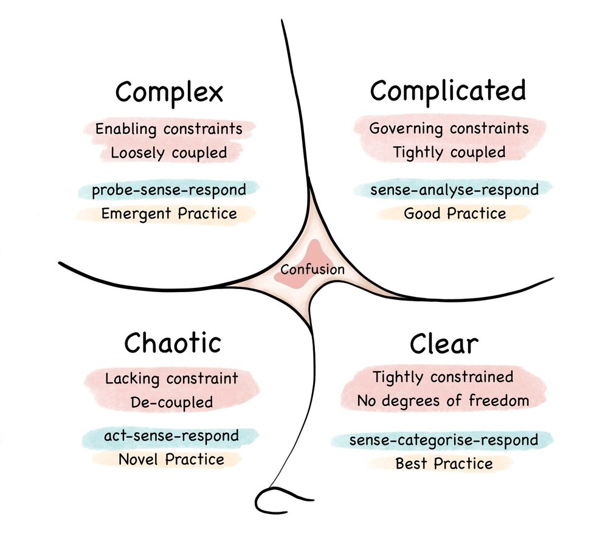

摘要：本文讨论了在 Kubernetes 故障排除中的两种路径：一种是增强操作员的分析工作，通过自动化和简化对故障排除知识的访问来提供帮助；另一种是将操作员从故障排除中排除，通过使用 AI/ML 模型和可观察性数据来自动化故障修复。同时强调了数据的重要性，以及继续共享故障排除经验和建立对可观察性的一致认识的必要性。

---

本文译自：https://thenewstack.io/can-chatgpt-save-collective-kubernetes-troubleshooting/

数十年前，系统管理员们开始在互联网上分享他们每天面临的技术问题。他们进行了长时间、充满活力且富有价值的讨论，探讨如何调查和解决问题的根本原因，然后详细说明最终对他们有效的解决方案。

这股洪流从未停歇，只是改变了流向。如今，这些讨论仍在 Stack Overflow、Reddit 以及企业工程博客上进行。每一次讨论都是对全球 IT 系统故障排除经验的宝贵贡献。

[Kubernetes](https://roadmap.sh/kubernetes)也从根本上改变了这种流向。与几十年来困扰系统管理员和 IT 人员的虚拟机（VM）和单体应用程序相比，[微服务架构](https://thenewstack.io/microservices/)要复杂得多。由于 Kubernetes 缺乏数据持久性，往往无法对规模化的 K8s 错误进行本地重现。即使能够捕获，观测数据也会在多个平台上分散，而资源和依赖关系的相互关联关系也难以捕捉。

现在，凭直觉并不一定足够。您需要知道如何调试集群以获得下一步的线索。

这种复杂性意味着公开的故障排除讨论比以往任何时候都更为重要，但现在我们开始看到这股宝贵的洪流不是被重定向，而是完全被堵住了。你在谷歌上看到了这一点。任何与 Kubernetes 相关问题的搜索都会出现一半以上的付费广告和至少一页 SEO 驱动的文章，这些文章缺乏技术深度。[Stack Overflow](https://thenewstack.io/stack-overflow-adds-ai-will-the-community-respond/) 正在失去其作为技术人员首选问答资源的主导地位，Reddit 在过去几年中也陷入了争议。

现在，每个 Kubernetes 的 DevOps 平台都在建立最后一个堤坝：将您的故障排除知识集中在其平台上，并用[人工智能（AI）和机器学习（ML）](https://thenewstack.io/70-percent-of-developers-using-or-will-use-ai-says-stack-overflow-survey/)取而代之，直到整个堆栈对于甚至是最有经验的云原生工程师来说都成为一个黑盒。当发生这种情况时，您失去了逐个探测、排除故障和修复系统的能力。这种趋势将曾经是众包故障排除技能洪流变成了过去所能提供的仅仅是一滴水。

当我们依赖于平台时，故障排除技术的集体智慧就会消失。

## 故障排除智慧的传承

起初，系统管理员依靠实体书籍进行技术文档和整体最佳实践的实施。随着互联网在 80 年代和 90 年代的普及，这些人通常通过[Usenet](https://today.duke.edu/2010/05/usenet.html)与同行进行交流，并在像 comp.lang.* 这样的新闻组中提出工作中的技术问题，这类新闻组类似于我们今天所知的论坛的简化版本。

随着互联网的普及迅速，并几乎完全改变了故障排除智慧的洪流。工程师和管理员们不再聚集在新闻组中，而是涌向包括 Experts Exchange 在内的数千个论坛，该论坛于 1996 年上线。在积累了大量的问题和答案之后，Experts Exchange 团队将所有答案都放在了每年 250 美元的付费墙后面，这使得无数宝贵的讨论无法公开获取，最终导致了该网站的影响力下降。

[Stack Overflow 随后出现](https://www.joelonsoftware.com/2018/04/06/the-stack-overflow-age/)，再次向公众开放了这些讨论，并通过声望点数对讨论进行游戏化，这些声望点数可以通过提供见解和解决方案来获得。其他用户随后对“最佳”解决方案进行投票和验证，这有助于其他搜索者快速找到答案。Stack Overflow 的游戏化、自我管理和社区使其成为了洪流式故障排除知识的唯一渠道。

但是，就像其他时代一样，没有什么好事能永远持续下去。近 10 年来，人们一直在预测[“Stack Overflow 的衰落”](https://johnslegers.medium.com/the-decline-of-stack-overflow-7cb69faa575d)，并指出由于其具有攻击性的性质和由拥有最多声望点数的人进行管理的结构，它“讨厌新用户”。虽然 Stack Overflow 的影响力和流行度确实下降了，但 Reddit 的开发/工程专注的 subreddit 填补了这个空白，它仍然是公开可访问的故障排除知识的最大存储库。

特别是对于 Kubernetes 和云原生社区来说，这仍然是一个重要的资源，因为它们仍然在经历重大的增长阵痛。而这是一种宝贵的资源，因为如果您认为现在的 Kubernetes 已经很复杂了...

## Kubernetes 的复杂性问题

在一篇关于“直观调试”失败的精彩文章中，软件交付顾问 Pete Hodgson 认为，构建和交付软件的现代架构（如 Kubernetes 和微服务）比以往任何时候都更加复杂。他写道：“对于我们大多数人来说，为服务器命名为希腊神话角色，并通过 ssh 进入服务器运行`tail`和`top`的日子已经一去不复返了。”但是，“这种转变是有代价的……传统的理解和故障排除生产环境的方法在这个新世界中已经行不通了。”

*Cynefin 模型。来源：维基百科*

Hodgson 使用[Cynefin 模型](https://en.wikipedia.org/wiki/Cynefin_framework)来说明软件架构过去是复杂的，因为有足够的经验，人们可以理解故障排除和解决方案之间的因果关系。

他认为，分布式微服务架构是复杂的，即使经验丰富的人对根本原因以及如何进行故障排除也只有“有限的直觉”。他们必须花更多时间通过可观察性数据提出问题和回答问题，最终假设可能出错的原因。

如果我们同意 Hodgson 的前提 - Kubernetes 本质上是复杂的，并且在响应之前需要花费更多的时间分析问题，那么与 Kubernetes 一起工作的工程师学会了哪些问题最重要，然后用可观察性数据回答，以进行最佳的下一步行动，似乎是至关重要的。

这正是新一代以 AI 驱动的故障排除平台所提供的智慧。

## Kubernetes 故障排除的两种路径

多年来，像 OpenAI 这样的公司一直在根据 Stack Overflow、Reddit 等公开数据进行抓取和训练模型，这意味着这些 AI 模型可以访问大量的系统和应用知识，包括 Kubernetes。还有一些人意识到组织的可观察性数据是训练 AI/ML 模型分析新场景的宝贵资源。

他们都在问同一个问题：我们如何利用关于 Kubernetes 的现有数据来简化搜索最佳解决方案的过程？他们正在构建的产品采取非常不同的路径。

### 第一种：增强操作员的分析工作

这些工具自动化和简化对公开在线发布的大量故障排除知识的访问。它们不会取代进行适当故障排除或[根本原因分析](https://aws.amazon.com/opensearch-service/resources/root-cause-analysis/)（RCA）所需的人类直觉和创造力，而是有条不紊地自动化操作员查找相关信息的方式。

例如，如果一个刚接触 Kubernetes 的开发人员在运行`kubectl get pods`时发现`CrashLoopBackOff`状态导致他们无法部署应用程序，他们可以查询一个 AI 驱动的工具以获得建议，比如运行`kubectl describe $POD`或`kubectl logs $POD`。这些步骤可能会进一步引导开发人员使用`kubectl describe $DEPLOYMENT`来调查相关的部署情况。

在[Botkube](https://botkube.io/)，我们对使用 AI 在大量故障排除智慧的基础上自动化这个来回查询的概念非常感兴趣。用户应该能够直接在 Slack 中提问，如“我如何排除这个无法正常工作的服务？”并收到 ChatGPT 撰写的回答。在一次公司范围的黑客马拉松活动中，我们着手实施这一概念，为我们的协作故障排除平台构建了一个新的插件。

通过[Doctor](https://botkube.io/blog/use-chatgpt-to-troubleshoot-kubernetes-errors-with-botkubes-doctor)，您可以利用大量的故障排除知识，通过 Botkube 作为您的 Kubernetes 集群和消息/协作平台之间的桥梁，无需在 Stack Overflow 或 Google 搜索广告中漫游，这对于新手 Kubernetes 开发人员和操作员特别有用。

该插件还通过生成一个带有**获取帮助**按钮的 Slack 消息进一步自动化，用于任何错误或异常，然后查询 ChatGPT 以获取可行的解决方案和下一步操作。您甚至可以将 Doctor 插件的结果导入其他操作或集成，以简化您主动使用现有广泛的 Kubernetes 故障排除知识来更直观地调试和感知问题的方式。

### 第二种：将操作员从故障排除中排除

这些工具不关心公开知识的泛滥。如果它们可以基于实际的可观察性数据训练通用的 AI/ML 模型，然后根据您的特定架构进行微调，它们可以试图完全剔除人为操作员在根本原因分析和故障修复中的作用。

[Causely](https://www.causely.io/platform/causely-for-kubernetes-applications/)就是这样一家初创公司，他们并不回避使用 AI 来“消除人为故障排除”的愿景。该平台连接到您现有的可观察性数据，并处理它们以微调因果关系模型，理论上可直接进行修复步骤 - 无需探测或使用`kubectl`。

如果说有时候有一个 Kubernetes 神灵听起来很诱人，那我可能会撒谎，但我对像 Causely 这样的工具夺走运维工作并不担心。我担心的是在 Causely 引领的未来中，我们宝贵的故障排除知识会发生什么。

### 这两种路径之间的差距：数据

我不是在为“人工智能将取代所有 DevOps 工作”发表言论。我们已经读过太多这样的末日场景，适用于每个小众和行业。我更关心这两种路径之间的差距：用于训练和回答问题或呈现结果的数据是什么？

第一种路径通常使用现有的公开数据。尽管有关 AI 公司爬取这些站点进行训练数据的担忧-Reddit 和 Twitter，但这些数据的开放性仍然提供了一个激励循环，以保持开发人员和工程师继续在 Reddit、Stack Overflow 和其他平台上共享知识的持续泛滥。

云原生社区通常也倾向于共享技术知识，认同共享技术知识和一个“涨潮（Kubernetes 故障排除技巧的涨潮）抬高所有船（压力巨大的 Kubernetes 工程师）”的想法。

第二条路径看起来更为暗淡。随着以 AI 驱动的 DevOps 平台的兴起，越来越多的故障排除知识被锁定在这些仪表板和驱动平台的专有 AI 模型中。我们都同意，Kubernetes 基础架构将继续变得更加复杂，而不是更简单，这意味着随着时间的推移，我们对节点、Pod 和容器之间发生的情况的理解将变得更少。

当我们停止互相分析问题和感知解决方案时，我们变得依赖于平台。这对每个人来说都是一条失败的道路，除了平台之外。

### 我们如何不失去（或失去得更少）？

我们能做的最好的事情是继续在线上发布关于我们在 Kubernetes 和其他领域的故障排除经验的惊人内容，比如“[关于故障排除 Kubernetes 部署的视觉指南](https://learnk8s.io/troubleshooting-deployments)”；通过游戏化创造教育性应用程序，比如[SadServers](https://sadservers.com/)；在故障排除系统时采取我们最喜欢的第一步，比如“[为什么在排除未知机器问题时我通常首先运行‘w’](https://rachelbythebay.com/w/2018/03/26/w/)”；并进行详细的事后分析，详细描述了探测、感知和应对潜在灾难性情况的压力故事，比如[2023 年 7 月的 Tarsnap 故障](https://mail.tarsnap.com/tarsnap-announce/msg00050.html)。

我们还可以超越技术解决方案，比如讨论我们如何在紧张的故障排除场景中管理和支持同事，或者在组织范围内建立对可观察性的一致认识。

尽管它们目前面临困境，但 Stack Overflow 和 Reddit 将继续是讨论故障排除和寻求答案的可靠渠道。如果它们最终与 Usenet 和 Experts Exchange 齐名，它们可能会被其他可公开获得的替代品所取代。

无论何时何地以何种方式发生，我希望您能加入我们在 Botkube 和全新的 Doctor 插件中，为在 Kubernetes 中协作解决复杂问题构建新的渠道。

无论 AI 驱动的 DevOps 平台是否继续基于抓取的公共 Kubernetes 数据训练新模型，只要我们不自愿地将好奇心、冒险精神和解决问题的能力全部放入这些黑匣子中，就会始终有一条新路径，让宝贵的故障排除知识源源不断地流动。
