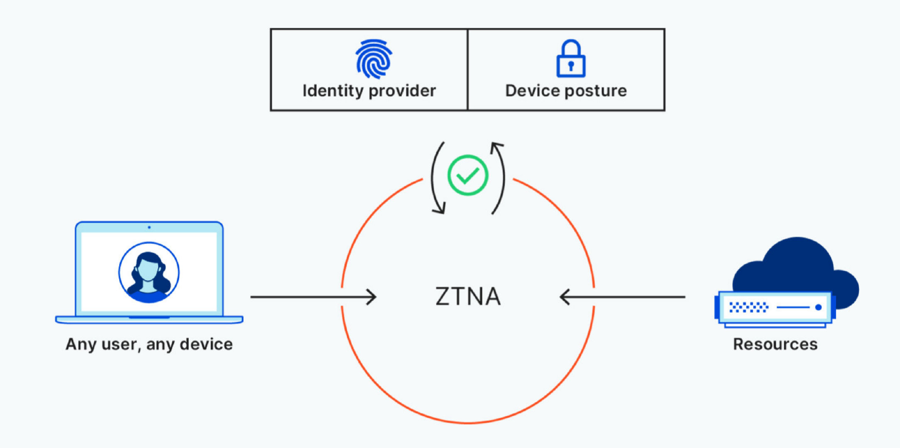

## 编者按

本文译自 Cloudflare 出品的白皮书 [*Can ZTNA replace your VPN? Compare 3 remote access approaches*](https://assets.ctfassets.net/slt3lc6tev37/IcpGyTHplQhOeB60k1Egp/e49211fc4482b67f3bf264c22923ef5c/Can_ZTNA_replace_your_VPN)，本文对比了 VPN 和 ZTNA 远程访问解决方案，阐明了它们的好处和局限性，同时阐明了迁移项目的最重要考虑因素。同时给出了 Cloudflare 的解决方案及迁移到 ZTNA 的步骤建议。

## 简介

安全、无缝的远程访问是一个业务促进因素——提高远程用户的生产力，减少 IT 团队花在入职和维护用户与应用连接的时间，并具有灵活性和弹性。然而，远程访问对许多企业来说仍然是一个挑战。

很久以前，VPN 提供了一种简单的方法，将一些远程用户短暂地连接到企业网络。然而，随着劳动力的分布越来越广——企业需要在更长时间内保持远程用户的安全连接——这种方法的缺陷变得很明显，从性能低下、安全风险增加到扩展性问题。

随着远程访问需求的增长，企业正越来越多地从传统的 VPN 实施方式转向更安全、性能更高的远程访问解决方案。零信任网络访问（Zero Trust Network Access），或称 ZTNA，围绕特定的应用程序、私有 IP 和主机名创建安全边界，用基于身份和背景授予访问权的默认拒绝策略取代默认允许的 VPN 连接。

 

2020 年，大约 5% 的远程访问使用主要由 ZTNA 提供服务。由于传统 VPN 访问的局限性以及提供更精确的访问和会话控制的需要，预计到 2024 年，这一数字将跃升至 40%。

虽然 ZTNA 为企业提供了比 VPN 更明显的优势和更多的功能，但许多组织发现它并不能完全替代 VPN 基础设施。但是，随着 ZTNA 变得更加强大，VPN 问题变得更加严重，这种情况正在迅速改变。本文对比了 VPN 和 ZTNA 远程访问解决方案，阐明了它们的好处和局限性，同时阐明了迁移项目的最重要考虑因素。它解释了 Cloudflare 如何提供 ZTNA，并推荐了一套行动步骤，将传统的 VPN 基础设施过渡到更快、更安全的远程用户零信任连接。

## 方法 1：传统的 VPN

几十年来，VPN 使组织能够将其远程用户连接到公司网络，并具有一定的隐私和安全性。在公共互联网上访问敏感信息，任何攻击者都可能窥探或窃取数据，而 VPN 允许用户通过加密连接安全访问内部资源。

两种最常见的 VPN 实施模式是基于客户端的 VPN 和无客户端的 SSL-VPN。每种模式都有各自的好处和挑战。

基于客户端的 VPN 通过加密的隧道将远程用户连接到一个私人网络。这种连接是通过一个软件应用程序或客户端建立的，它要求用户用用户名和密码进行一次认证，以获得对该网络内任何资源的持续访问。

**优点**

一旦建立连接，就自由的横向移动使用户很容易通过访问应用程序和连接到内部主机来快速访问多种资源。

**挑战**

- 不是为漫游用户和移动设备设计的。当用户四处漫游时，他们的笔记本电脑和移动设备都会随着无线网络的变化而无缝地重新连接。然而，VPN 客户端不善于流畅地处理这些重新连接，要求用户反复强迫 VPN 客户端重新启动和重新认证——造成生产力的损失，并产生 IT 票据。

- 可见性差。采用这种方法，VPN 基础设施在数据中心的内部防火墙背后终止了来自 VPN 客户端的加密隧道。虽然这些连接被记录下来，但没有特定的应用集中日志来显示用户访问了哪些应用或他们在应用中采取了哪些行动。

无客户端的 SSL-VPN 门户允许少数远程用户连接到私人网络中的一些基于浏览器的应用程序。这种连接是通过运行 VPN 服务的网络设备中内置的 Web 服务器实现的。

**挑战**

- 安全问题。数据中心内的大多数 VPN 设置允许用户完全访问，这给那些不希望非雇员（如承包商）不受限制地访问敏感资源和应用程序的组织带来了问题。

- 不是为支持大量的并发用户而建立的。与现代云服务不同，门户网站的网络服务器不能弹性扩展以满足更高需求。相反，必须安装更多的网络设备并进行负载均衡，以扩大门户的规模，这通常是昂贵、复杂和无效的，因为设备的其他功能可能没有被充分利用。

- 无客户端的 SSL-VPN 门户使防火墙端口和网络服务器暴露在攻击之下。为了让托管门户的网络服务器能够到达内部应用，管理员必须开放入站防火墙端口，使其暴露在外部攻击之下。开放的端口和网络服务器本身都必须屏蔽 DDoS 和网络应用的攻击，这需要更复杂的配置和更高的成本，以确保这种连接方法的安全。

 

 虽然 VPN 为远程用户提供了基本的隐私，但在设计时并没有考虑到安全性或可扩展性。传统上，企业使用 VPN 将少数远程用户短期连接到企业网络。然而，随着远程工作变得越来越普遍，VPN 问题开始成倍增加。

- 用户体验到性能低下。如果 VPN 基础设施没有能力处理其员工创造的流量吞吐量和并发连接，用户的互联网连接就会变慢。此外，当 VPN 距离用户和他们试图访问的应用服务器都很远时，就会造成访问延迟。

- 企业网络容易受到攻击。VPN 通常采用城堡和山丘模式，即用户一旦连接到网络，就可以不受限制地访问所有企业资源。由于没有内置的方法来限制对关键基础设施和数据的访问，企业被迫配置昂贵、复杂的安全服务，如下一代防火墙和网络访问控制——或者容易受到恶意的横向移动，导致更大的数据泄露。

**托管 VPN 服务的挑战**

一些供应商已经将运行 VPN 服务的网络设备转移到公有云中，作为虚拟机在一个或多个数据中心运行。VPN 可能与其他安全服务捆绑在一起，也可能不与之捆绑在一起（或与之串联）。

将 VPN 置于云中，似乎可以解决硬件 VPN 设备固有的一些可扩展性问题。然而，这样做也带来了一些重大的安全和可扩展性挑战。

例如有一个组织托管一个完整的 NGFW（下一代防火墙），将 VPN 与防火墙和其他安全功能结合起来。由于 NGFW 是作为一个捆绑服务提供的，因此不可能根据需求独立扩展任何特定功能。扩大一个功能需要扩大整个服务；要做到这一点，必须启动更多的虚拟机，以平衡每个虚拟机中执行的少量计算的负载。这不仅是一个不切实际且不便的解决方案，而且随着组织的远程访问需求不断扩大，很可能会产生高额费用。

## 方法 2：零信任网络访问

零信任安全规避了 VPN 所固有的许多挑战。它所依据的原则是，网络内部或外部的任何用户或设备都不能被默认信任。为了减少数据泄露、内部攻击和其他威胁的风险和影响，零信任方法——

- 对每一次登录和请求进行认证和记录。

- 要求对所有用户和设备进行严格的核查。

- 根据身份和背景，限制每个用户和设备可以访问的信息。

- 并增加了端对端加密，以隔离网络中的应用和数据。

 

 

与 VPN 一样，ZTNA 有两种配置方式：

1. 无客户端（或服务发起的）ZTNA 使用现有的浏览器，而不是客户端，来创建一个安全连接并验证用户设备。传统上，无客户端 ZTNA 仅限于具有 HTTP/HTTPS 协议的应用，但兼容性正在快速发展。 

- 优点：无客户端 ZTNA 使用反向代理连接，防止直接访问应用程序，阻止用户访问他们可能没有权限查看的应用程序和数据，并允许管理员在管理方面有更强的控制和灵活性。

2. 基于客户端（终端启动）的 ZTNA 在控制代理和授权应用之间建立加密连接之前，在用户设备上安装软件。

- 优点：基于客户端的 ZTNA 使管理员能够更深入地了解用户访问应用程序的设备状态、位置和风险背景，因此可以创建和执行更精细的策略。而且，由于这种方法不限于 HTTP/HTTPS，它可以用来访问更广泛的非 HTTP 应用——例如那些依赖 SSH、RDP、VNC、SMB 和其他 TCP 连接的应用。

**实施 ZTNA 的挑战**

虽然 ZTNA 与传统的 VPN 相比具有明显的优势，但它并不是一个确保远程用户网络访问安全的完美方法。当企业权衡采用零信任的利弊时，他们可能会遇到以下一个或多个挑战。

1. 解决方案并不是真正的云原生。

如果供应商不提供基于云的 ZTNA——意味着他们的客户需要在自己的数据中心部署软件，那么用户就会失去即时可扩展性和无限吞吐量等关键优势。

2. 供应商可能不提供基于客户端和无客户端的 ZTNA 选项。

这限制了那些需要将用户连接到非 HTTP 应用（如远程桌面、SSH 应用或文件共享）的组织的价值。

3. 配置可能是复杂和耗时的。

不提供策略协调和自动化支持的供应商（通过 Terraform 等工具）可能会给管理员带来更多的手动工作——除了在身份提供者中已经发生的配置之外。

## 方法 3：Cloudflare 的远程访问方法

保护和扩展远程访问应该是一个无缝的过程，一个不分层的笨重的安全解决方案，创造性能的权衡，减少不必要的成本。Cloudflare 使团队能够处理所有的远程访问用例，具有以下好处。

- 为用户和管理员提供简单、无风险的入职培训。Cloudflare 很容易与现有的身份供应商和终端保护平台集成，以执行限制访问企业应用程序和资源的零信任政策。

- 基于客户端和无客户端的 ZTNA 部署的灵活性。Cloudflare 为网络、SSH、VNC（以及即将推出的 RDP）应用程序的连接提供无客户端支持，为非 HTTP 应用程序和内部 IP（以及即将推出的主机名）的私有路由提供基于客户端的支持。

  

表 1：Cloudflare 如何应对远程访问挑战

| 问题             | 解决方案        | Cloudflare 的实施                                   |
| -------------------------- | ------------------------- | ------------------------------------------------------------ |
| 难以扩展                   | 全局边缘网络            | 可扩展性问题困扰着非云原生的 VPN 和 ZTNA 服务，使远程用户难以访问应用程序和数据。Cloudflare 的全球 Anycast 网络不仅使用户的连接速度比 VPN 快，而且还确保任何规模的远程工作者都能根据需要安全、迅速地连接到企业资源，而不需要管理员进行额外的耗时配置。 |
| 与移动设备的兼容性差       | 轻量级客户端              | 利用 IPSec 和 SSL 协议的 VPN 和 ZTNA 解决方案在移动和漫游设备上的性能往往不佳。Cloudflare 的 WARP 客户端利用更现代的 Wireguard 协议，该协议在用户空间运行，支持更广泛的操作系统选项，与传统选项相比，用户体验更好。Cloudflare 的 WARP 客户端可以在 Windows、MacOS、iOS、Android 和即将到来的 Linux 设备上配置。 |
| 没有集成的或薄弱的 DDoS 保护 | 内置行业领先的 DDoS 保护    | 如果没有集成的 DDoS 保护，企业往往被迫以 daisy-chain 方式提供额外的安全服务，这可能会造成配置上的麻烦、可扩展性问题和安全挑战。Cloudflare 的 67+Tbps 网络为任何 ZTNA 模式提供内置的 DDoS 保护，抵御最大规模的攻击。 |
| 协议的限制             | 非网络应用程序支持        | 模式兼容性：用于 SSH/VNC 应用的无客户端 ZTNA；用于所有其他非网络应用的基于客户端的 ZTNA。 |
| 没有集成的网络防火墙       | 内置网络防火墙            | 随着企业网络的发展，企业必须平衡的安全硬件堆栈也在不断增加——导致成本、性能和安全方面的折衷。Cloudflare 使管理员能够在边缘执行网络防火墙策略，使他们能够精细地控制哪些数据允许进出网络，并提高流量流经网络的可见性。  ✓ 模式兼容性：基于客户端的 ZTNA |
| 缺乏细粒度的控制           | 内置安全网关（SWG） | 未经批准使用应用程序会给企业带来严重的安全问题；如果没有严格的政策，用户可能会访问和篡改敏感数据和其他企业资源。结合 ZTNA 和 SWG，Cloudflare 允许管理员对应用程序内的用户和设备访问权限进行更精细的控制，因此用户和基于角色的组只能访问他们需要的资源。✓ 模式兼容性：基于客户端的 ZTNA |

## 用零信任网络访问取代传统 VPN

在向无 VPN 安全过渡的漫长而痛苦的过程中，IT 安全领导可能会觉得零信任的承诺很空洞。但是，用零信任网络访问取代 VPN 是可能的，而不需要在协议支持或功能上做出取舍。

推荐的迁移路径根据驱动你的项目的业务专家而有所不同。

- 如果更快连接到应用程序是你的首要任务，请部署基于客户端的 ZTNA，首先用于非网络应用。

- 如果加强你的应用程序访问规则的安全性更为重要，那么就从网络应用开始。替换 VPN 只是整个网络转型的第一步。由于向 SASE 模式的过渡可能是压倒性的，我们根据客户采取的方法，分解了一条通往零信任安全的常见路径。

  
