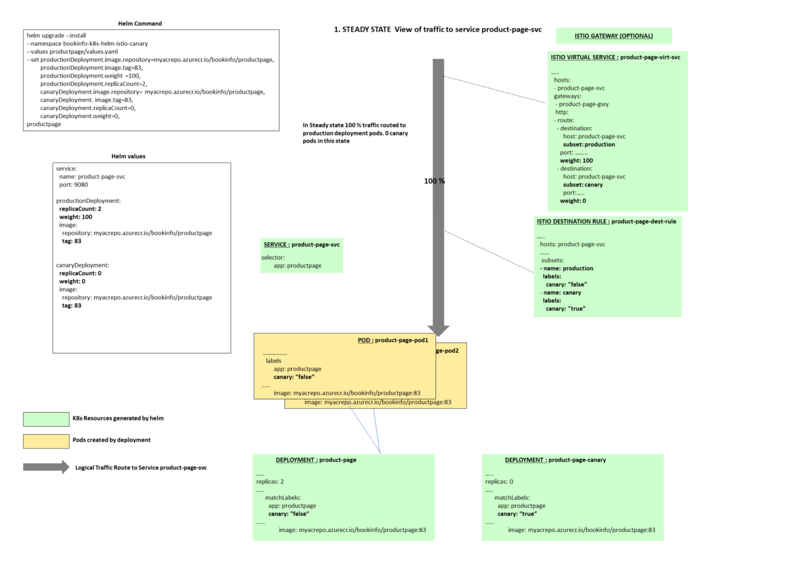
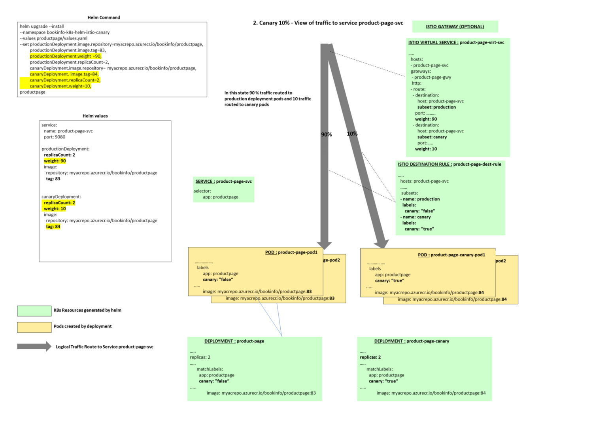
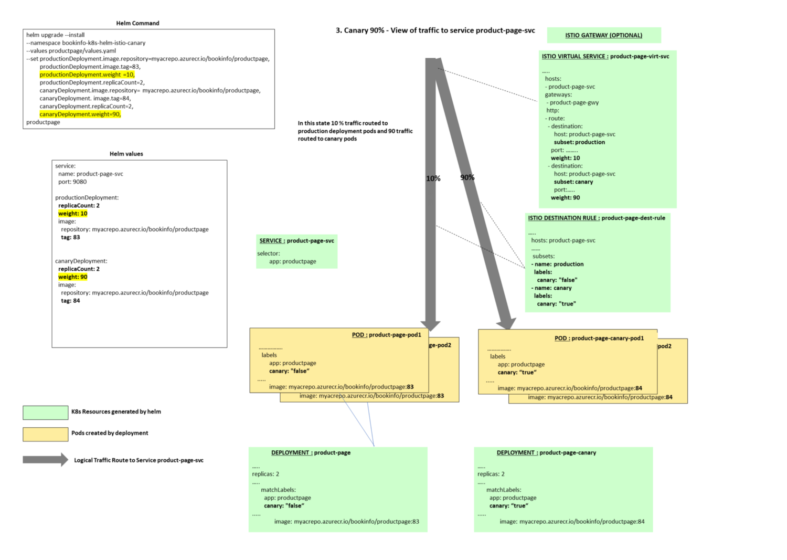
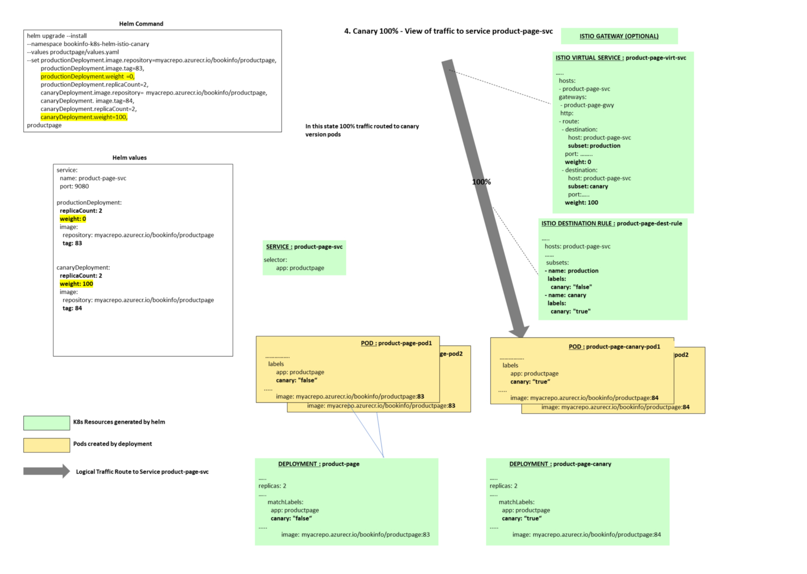
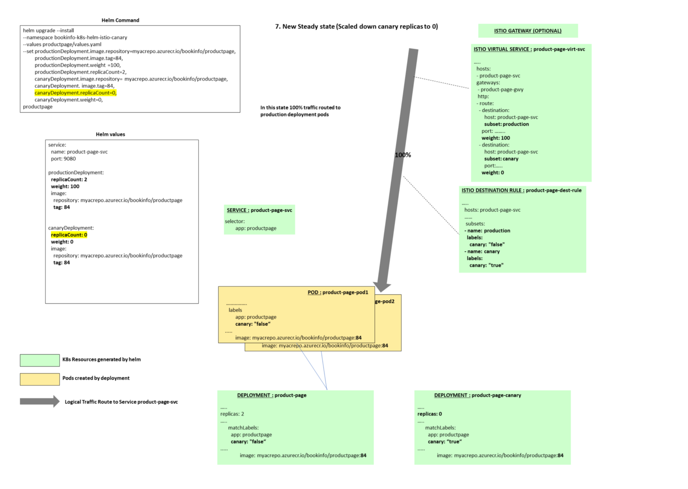

本文为翻译文章，[点击查看原文](https://medium.com/microsoftazure/canary-release-strategy-using-kubernetes-istio-helm-fb49c0406f07)。

## 编者按

本文阐述了如何使用 Helm 和 Istio 实现手动金丝雀发布。

我近期工作的项目目标是为微服务应用的金丝雀/分阶段发布制定一套流水线。而这些微服务被部署在Azure Kubernetes 集群上（[AKS](https://azure.microsoft.com/en-us/services/kubernetes-service/)）。

本文假设您熟悉[**Kubernetes**](https://kubernetes.io/)，[**Helm**](https://helm.sh/)和[**Istio 流量管理**](https://istio.io/docs/concepts/traffic-management/)。

这篇文章描述了发布的基本要求，为这些要求选择的发布策略，以及每个阶段实现细节。

在后面的文章中，我将详细介绍本文中描述的发布阶段如何对应到[**Azure DevOps**](https://azure.microsoft.com/en-in/services/devops/) 发布流水线。

## 关键要求

高级要求是将应用程序服务通过金丝雀版本发布到生产环境中。

### 基本要求/限制：

- 每个 Micro 服务都应打包为单独的[**Helm**](https://helm.sh/)图表。

- 不同的团队管理不同的微服务，每个团队应该能够独立于其他微服务发布。

- 服务网格[**Istio**](https://istio.io/)安装在 Kubernetes 集群上

- 在项目的初始阶段，只有**Helm**和**Istio**可用于集群。在此阶段，不使用类似[flagger](https://github.com/weaveworks/flagger)这样的工具。

- 团队可以使用 Helm chart 分阶段的发布新版本应用程序：

  \- 10％ 的流量路由到新版本

  \- 90％ 的流量路由到新版本

  \- 100％ 的流量路由到新版本

- 在每个阶段之后，需要**手动判断**以进入下一个发布阶段

- 每个阶段都可以使用 Helm chart 回滚到前一个生产版本

---

### 发布微服务资源

每个微服务都需要如下 Kubernetes 资源：

- 当前版本 deployment，在新版本发布之前稳定运行的版本，承载 100% 的流量。

- 金丝雀 deployment，在发布之前是 0 个实例，不承载流量。当发布时，承载流量会逐步增至 10%、90%、100%。

- service，与微服务当前 deployment 对应

- Istio Virtual Service，用于控制当前 deployment 和金丝雀 deployment 流量分配的权重

- Istio Destination Rule，包含当前 deployment 和金丝雀 deployment 的子集（subset）

- Istio Gateway（可选），如果服务需要从容器集群外被访问则需要搭建 gateway

  列出上述资源，有助于我们理解第一章的实现细节。

---

### 查看 GitHub 仓库

这个仓库包含上述微服务的样例代码，Dockerfile，Helm chart 以及每个阶段执行的 Helm 命令。同时，仓库还包含了由 Helm Chart 的 helm template 命令生成的 Kubernetes 示例资源。

使用的示例服务是 Istio 产品页面应用程序，应用程序代码和 docker 文件来自 Istio GitHub 仓库。

#### 仓库结构

- 产品页面应用的源码
- 应用容器的 Dockerfile
- Helm Chart 文件夹包含 Kubernetes 和 Istio 资源
- helm-commands.sh，包含各阶段 helm 命令（rollback 命令、helm template 命令）
- helm-template-output.yaml，包含由 helm template 命令生成的 Kubernetes 示例资源

### 关键内容

#### Helm Values

让我们看下 Helm values 文件：

```yaml
service:
  name: product-page-svc
  port: 9080
productionDeployment:
  replicaCount: 2
  weight: 100
  image:
    repository: myacrepo.azurecr.io/bookinfo/productpage
    tag: 83
    pullPolicy: IfNotPresent
canaryDeployment:
  replicaCount: 0
  weight: 0
  image:
    repository: myacrepo.azurecr.io/bookinfo/productpage
    tag: 83
    pullPolicy: IfNotPresent
```

service 部分包含了 service 名称。生产部署包含了副本数量、路由转发权重、容器镜像仓库名称、以及镜像 tag。它跟金丝雀部署有一点类似。上面的值表示当处于稳定状态时，100% 的流量被路由转发到现有生产版本 Pod。而金丝雀版本则被设置为 0 副本，并且与生产版本使用相同镜像。当使用金丝雀发布时，金丝雀版本将被设置为使用新版本镜像。

在这个案例中，容器镜像打 tag 策略是使用对应的 build id，然后把它推送到镜像仓库。所以如果应用程序的新版本被触发构建，则下一个版本容器镜像 tag 为 84（83+1）。

我们也可以选择其他适合的镜像 tag 策略。

##### 生产版本以及金丝雀版本 Deployment 文件

##### 生产版本 Deployment 文件

```yaml
apiVersion: apps/v1beta2
kind: Deployment
metadata:
  name: productpage
  labels:
    app: productpage
    canary: "false"
spec:
  replicas: 2
  selector:
    matchLabels:
      app: productpage
      canary: "false"
  template:
    metadata:
      labels:
        app: productpage
        canary: "false"
    spec:
      containers:
        - name: productpage
          image: "myacrepo.azurecr.io/bookinfo-canary/productpage:83"
          imagePullPolicy: IfNotPresent
          ports:
            - name: http
              containerPort: 9080
              protocol: TCP
....
```

##### 金丝雀版本 Deployment 文件

```yaml
apiVersion: apps/v1beta2
kind: Deployment
metadata:
  name: productpagecanary
  labels:
    app: productpage
    canary: "true"
    chart: productpage-0.1.0
spec:
  replicas: 0
  selector:
    matchLabels:
      app: productpage
      canary: "true"
  template:
    metadata:
      labels:
        app: productpage
        canary: "true"
    spec:
      containers:
        - name: productpagecanary
          image: "myacrepo.azurecr.io/bookinfo-canary/productpage:83"
          imagePullPolicy: IfNotPresent
          ports:
            - name: http
              containerPort: 9080
              protocol: TCP
       .....
```

两个 Deployment 文件的关键区别在于，生产版本 canary 标签的值为 false，而金丝雀版本 canary 标签的值为 true。另一个区别是在稳定状态下，金丝雀版本副本实例数量为 0，所以不会运行任何金丝雀版本的 pod。

##### Kubernetes Service

```yaml
apiVersion: v1
kind: Service
metadata:
  name: product-page-svc
spec:
  ports:
    - port: 9080
      targetPort: http
      protocol: TCP
      name: http
  selector:
    app: productpage
 ......
```

##### Istio Destination Rule

```yaml
apiVersion: networking.istio.io/v1alpha3
kind: DestinationRule
.........
spec:
  host: product-page-svc.bookinfo-k8s-helm-istio-canary.svc.cluster.local
.......
  subsets:
  - name: production
    labels:
      canary: "false"
  - name: canary
    labels:
      canary: "true"
```

Istio destination rule 描述了生产版本和金丝雀版本两个版本子集（subset）。生产版本子集的流量将会被转发给 canary 标签值为 false 的 pod。金丝雀版本子集的流量将会转发给 canary 标签值为 true 的 pod。

Destination rule 中的 host 是 service 的 FQDN，由 service 名称和 Kubernetes namespace 构成。

##### Istio Virtual Service

```yaml
apiVersion: networking.istio.io/v1alpha3
kind: VirtualService
...
spec:
  hosts:
  - product-page-svc.bookinfo-k8s-helm-istio-canary.svc.cluster.local
  gateways:
  - product-page
  http:
  - route:
    - destination:
        host: product-page-svc.bookinfo-k8s-helm-istio-canary.svc.cluster.local
        subset: production
        port:
          number: 9080
      weight: 100
    - destination:
        host: product-page-svc.bookinfo-k8s-helm-istio-canary.svc.cluster.local
        subset: canary
        port:
          number: 9080
      weight: 0
```

Virtual service 控制着生产版本与金丝雀版本之间的流量分配比例。

### 发布阶段的细节

在阶段概览图中用黄色高亮标注出上一节介绍的变化值。接下来我们将 docker 镜像 tag 从当前的 83 升级至 84。

阶段 1：稳定状态，100% 流量转发给应用当前部署的生产版本。没有版本正在发布，金丝雀版本为 0 个副本，并且不被转发任何流量。

Helm 命令

```shell
helm upgrade  --install --namespace bookinfo-k8s-helm-istio-canary --values ./productpage/chart/productpage/values.yaml --set productionDeployment.image.repository=myacrepo.azurecr.io/bookinfo-canary/productpage,productionDeployment.image.tag=83,productionDeployment.weight=100,productionDeployment.replicaCount=2,canaryDeployment.image.repository=myacrepo.azurecr.io/bookinfo-canary/productpage,canaryDeployment.image.tag=83,canaryDeployment.replicaCount=0,canaryDeployment.weight=0 --wait productpage ./productpage/chart/productpage
```

阶段概览



阶段 2：正在发布，金丝雀版本副本数量被设置为 2 个，它使用新版应用镜像（tag 84）。10% 的流量被转发给金丝雀版本 pod，其余 90% 的流量被转发给原来的生产版本 pod。

Helm 命令

```shell
helm upgrade  --install --namespace bookinfo-k8s-helm-istio-canary --values ./productpage/chart/productpage/values.yaml --set productionDeployment.image.repository=myacrepo.azurecr.io/bookinfo-canary/productpage,productionDeployment.image.tag=83,productionDeployment.weight=90,productionDeployment.replicaCount=2,canaryDeployment.image.repository=myacrepo.azurecr.io/bookinfo-canary/productpage,canaryDeployment.image.tag=84,canaryDeployment.replicaCount=2,canaryDeployment.weight=10 --wait productpage ./productpage/chart/productpage
```

阶段概览



阶段 3:90% 流量被转发给金丝雀版本 pod，10% 流量被转发给原有生产版本 pod。

Helm 命令

```shell
helm upgrade  --install --namespace bookinfo-k8s-helm-istio-canary --values ./productpage/chart/productpage/values.yaml --set productionDeployment.image.repository=myacrepo.azurecr.io/bookinfo-canary/productpage,productionDeployment.image.tag=83,productionDeployment.weight=10,productionDeployment.replicaCount=2,canaryDeployment.image.repository=myacrepo.azurecr.io/bookinfo-canary/productpage,canaryDeployment.image.tag=84,canaryDeployment.replicaCount=2,canaryDeployment.weight=90 --wait productpage ./productpage/chart/productpage
```

阶段概览



阶段 4:100% 流量被转发给金丝雀版本 pod

Helm 命令

```shell
helm upgrade  --install --namespace bookinfo-k8s-helm-istio-canary --values ./productpage/chart/productpage/values.yaml --set productionDeployment.image.repository=myacrepo.azurecr.io/bookinfo-canary/productpage,productionDeployment.image.tag=83,productionDeployment.weight=0,productionDeployment.replicaCount=2,canaryDeployment.image.repository=myacrepo.azurecr.io/bookinfo-canary/productpage,canaryDeployment.image.tag=84,canaryDeployment.replicaCount=2,canaryDeployment.weight=100 --wait productpage ./productpage/chart/productpage
```

阶段概览



阶段 5：当 100% 流量被转发给金丝雀版本后，对生产版本执行滚动更新，将镜像 tag 更新为 84。

这一步需要在将流量切回生产部署版本之前操作。

Helm 命令

```shell
helm upgrade  --install --namespace bookinfo-k8s-helm-istio-canary --values ./productpage/chart/productpage/values.yaml --set productionDeployment.image.repository=myacrepo.azurecr.io/bookinfo-canary/productpage,productionDeployment.image.tag=84,productionDeployment.weight=0,productionDeployment.replicaCount=2,canaryDeployment.image.repository=myacrepo.azurecr.io/bookinfo-canary/productpage,canaryDeployment.image.tag=84,canaryDeployment.replicaCount=2,canaryDeployment.weight=100 --wait productpage ./productpage/chart/productpage
```

阶段概览


阶段 6：将 100% 流量切换回生产版本 pod，而此时生产版本 pod 已经使用最新应用镜像（tag 84）。

```shell
helm upgrade  --install --namespace bookinfo-k8s-helm-istio-canary --values ./productpage/chart/productpage/values.yaml --set productionDeployment.image.repository=myacrepo.azurecr.io/bookinfo-canary/productpage,productionDeployment.image.tag=84,productionDeployment.weight=100,productionDeployment.replicaCount=2,canaryDeployment.image.repository=myacrepo.azurecr.io/bookinfo-canary/productpage,canaryDeployment.image.tag=84,canaryDeployment.replicaCount=2,canaryDeployment.weight=0 --wait productpage ./productpage/chart/productpage
```

阶段概览


阶段 7：新的稳定状态，金丝雀版本副本数量再次被修改为 0，100% 流量被转发给最新应用生产版本（容器镜像 tag 为 84）。

Helm 命令

```shell
helm upgrade  --install --namespace bookinfo-k8s-helm-istio-canary --values ./productpage/chart/productpage/values.yaml --set productionDeployment.image.repository=myacrepo.azurecr.io/bookinfo-canary/productpage,productionDeployment.image.tag=84,productionDeployment.weight=100,productionDeployment.replicaCount=2,canaryDeployment.image.repository=myacrepo.azurecr.io/bookinfo-canary/productpage,canaryDeployment.image.tag=84,canaryDeployment.replicaCount=0,canaryDeployment.weight=0 --wait productpage ./productpage/chart/productpage
```

阶段概览



### 任一阶段回滚

我们可以在任一阶段使用 Helm 命令回滚至应用的前一个版本

```shell
helm upgrade  --install --namespace bookinfo-k8s-helm-istio-canary --values ./productpage/chart/productpage/values.yaml --set productionDeployment.image.repository=myacrepo.azurecr.io/bookinfo-canary/productpage,productionDeployment.image.tag=83,productionDeployment.weight=100,productionDeployment.replicaCount=2,canaryDeployment.image.repository=myacrepo.azurecr.io/bookinfo-canary/productpage,canaryDeployment.image.tag=83,canaryDeployment.replicaCount=0,canaryDeployment.weight=0 --wait productpage ./productpage/chart/productpage
```

### 在任一阶段测试应用

在这个案例中，product page 需要可以从集群外部访问，因此我们需要 Istio 网关。从服务器外部访问 Istio 网关，需要获取它的外部 IP。

```shell
kubectl get svc istio-ingressgateway  -n istio-system
```

一旦获取了外部 IP，可以通过添加主机 host 文件记录的方式来快速测试

```shell
23.XX.YY.ZZ product-page-svc.bookinfo-k8s-helm-istio-canary.svc.cluster.local
```

新的服务能够通过该 URL 访问：`http://product-page-svc.bookinfo-k8s-helm-istio-canary.svc.cluster.local/productpage?u=normal`。

在后续文章中，我们将介绍如何使用 Azure Devops 轻松创建这个多阶段流水线、手动判定以及回滚。


