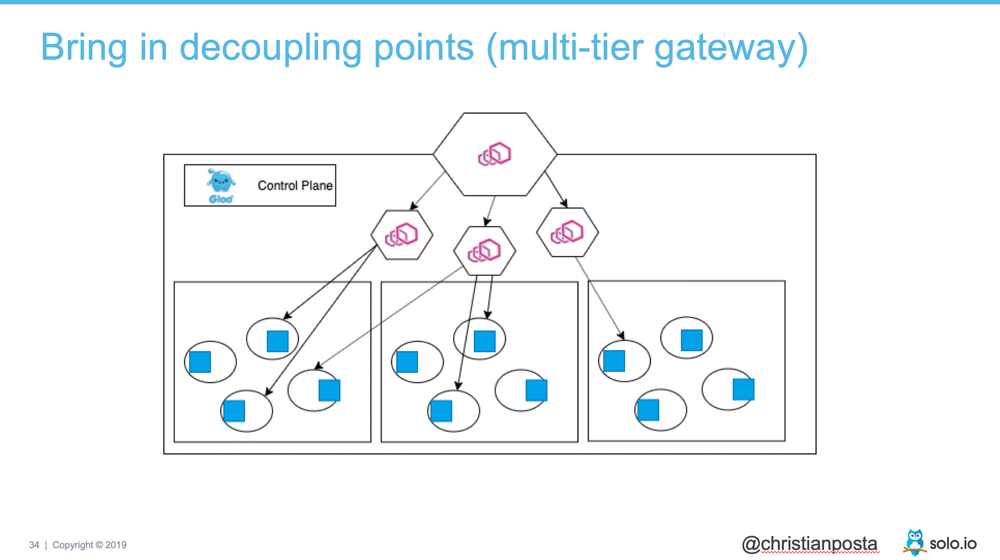

本文为翻译文章，[点击查看原文](https://blog.christianposta.com/challenges-of-adopting-service-mesh-in-enterprise-organizations/)。

## 编者按

本文作者介绍了企业组织采用服务网格面临的哪些挑战，建议企业应该从数据平面开始逐步推进，从了解它、熟悉它、再到扩大规模使用它，并且以介绍其演讲的幻灯片为切入点介绍了架构演进的步骤。

## 正文

最近，我写了[一篇](https://dzone.com/trendreports/migrating-to-microservices-2)关于在企业组织中采用服务网格的具有哪些挑战的文章，这篇文章是为 DZone 及其迁移到微服务的报告撰写的。在这篇文章中，我们首先要解决的问题之一是“你是否应该沿着采用服务网格的道路走下去”，我是这么说的：

> 首先回答“不”。如果您刚刚开始使用微服务架构和少量的服务，请确保您首先准备好了基础部分。微服务及其相关的基础设施是一种优化方式，可以让您更快的变更应用程序。在没有服务网格的情况下，您可以朝着更快的方向前进。你甚至可能想要一些服务网格带来的好处，而不是去关注它所有的复杂性。那么，请看看类似 Gloo 的产品，一个建立在 Envoy 代理上的 API 网关。

我认为在当前时刻，这是一个非常重要的考虑，有以下两大原因：

1. 总的来看，服务网格的实现还没有准备好投入生产。
2. 全部投入 (all-in) 到一个服务网络的复杂性仍然很高。

这并不意味着没有团队成功地使用了服务网格，或者您应该远离它。但是，我确实认为您应该建立这样的能力，当您真正准备好了并且可以从中获益的时候，最终能成功地将服务网格引入。例如，在报告中，我列出了您**可能想要使用**服务网格的原因：

- 跨多个集群部署大量微服务
- 容器/k8s和虚拟机的混合部署
- 用于构建服务的语言的异构部署
- 网络可观测性的不完整和不一致视图

即使有了以上这些理由，你依然会面临这些挑战：

- 选择哪一个服务网格产品？
- 谁来做技术支持？
- 单集群的多租户问题
- 缺乏多集群的管理方法
- 已有服务如何适配（sidecar 的生命周期、竞态条件等等）
- 开发人员与运维人员的界限在哪里
- 非容器环境/混合环境
- 中心化 vs 去中心化

通过我在[Red Hat](https://blog.christianposta.com/moving-on-from-red-hat/)和现在[Solo.io](https://blog.christianposta.com/career/new-adventure-starts-at-solo-io/)加起来两年以上的工作，我一直在帮助人们解决那些棘手的问题 (顺便说一句，如果你想交谈/需要这些方面的帮助，可以通过[@christianposta](http://twitter.com/christianposta?lang=en)联系我)。但有一件我从我们的客户/用户一直观察到，并且持续一段时间提出建议，那就是你采用服务网格的第一步，应该总是先使用在一定程度上（自行）隔离的数据平面技术，要了解它是如何工作的，如何实施，如何调试等等。

例如，在我最近做的一次演讲中，我说过要从 Envoy（Envoy 是许多服务网格实现的底层数据平面技术）开始。PPT 如下：

从架构的角度来看，它可能是这样的：

当然，如果你要使用 Envoy，我[建议从 Gloo](https://medium.com/solo-io/getting-started-with-a-service-mesh-starts-with-a-gateway-96384deedca2)开始，这基本上是一个[具有 edge 与 API 网关能力的企业版 Envoy](https://gloo.solo.io/)，并且很好地植入了服务网格。一旦你有了它，对它熟练使用，那么你就会准备好增加它的使用，甚至可能通过代理的分层引入一些隔离：

接下来的方法是将网关推入到应用架构中。我们看到我们的用户在每个应用程序边界采用一个网关的方法，开始有了一个网格的“感觉”，但在应用程序引入了一些结构 (例如，[API 网关模式](https://medium.com/solo-io/api-gateways-are-going-through-an-identity-crisis-d1d833a313d7))。我开始称之为“waypoints”架构。就像飞行员使用航路点（waypoints）来指导他们的飞行计划一样，这些网关为您的应用架构增加了结构，同时解决了诸如安全性和 API 解耦的南北通信问题，同时为成功采用服务网格奠定了基础。

最后，您可以开始在应用程序中引入独立于边界的服务网格代理，以解决棘手的但恰恰是服务网格技术最擅长解决的 service-to-service 通信挑战：

这里重要的部分是网关，并且仍然有非常有用的用途！它们向应用架构中添加结构和路径点，同时在需要的地方将某些实现细节与其他服务分离并隐藏起来。在很多方面，这都遵循了 DDD 有界上下文模型，网关提供了一个“反腐败”层。否则，如果你只是把所有的服务都当作“伙伴”，你就会开始坚定地迈向死星：

希望这篇文章有助于您奠定一个成功的方法，通过小范围使用服务网格，然后逐渐缓慢扩展有意义的各个地方，并且你的应用程序可以从服务网格架构中获益。否则，您将承担同时引入太多复杂性的风险，这将违背您实现应用程序和基础设施现代化的意图。
