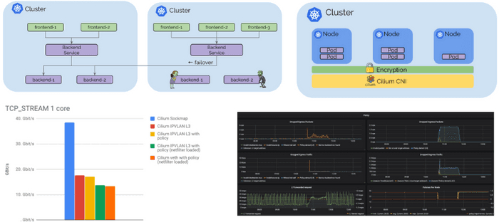
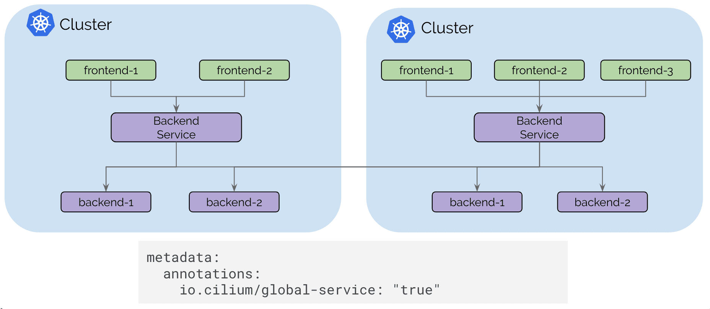
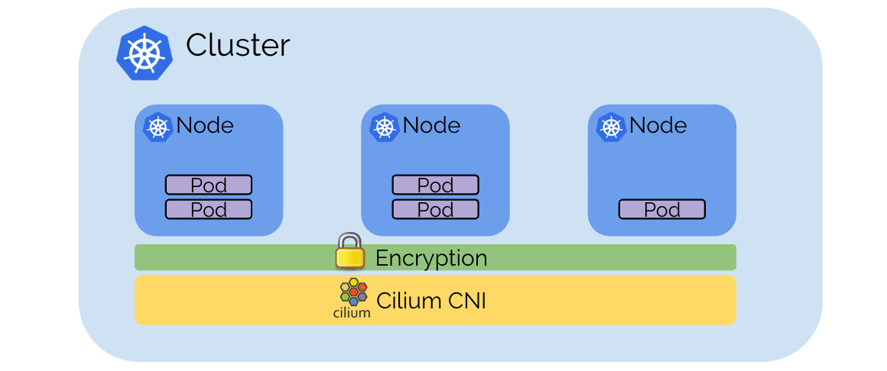
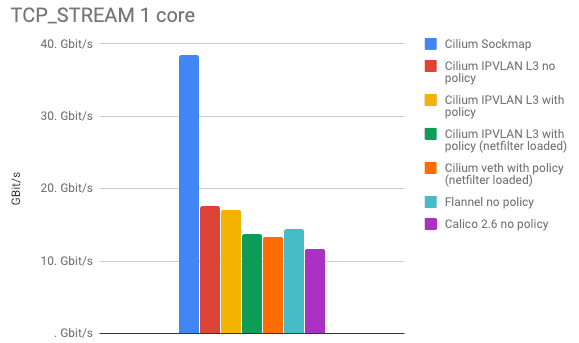

本文为翻译文章，[点击查看原文](https://cilium.io/blog/2019/02/12/cilium-14/)。

我们很高兴地宣布 Cilium 1.4 版本。该版本引入了几项新功能以及优化和可扩展性工作。重点包括增加全局服务，提供跨多个集群的 Kubernetes 服务路由、DNS 请求/响应感知授权和可见性、透明加密（beta）、IPVLAN 支持以获得更好的性能和延迟（beta）、与 Flannel 集成、GKE 在 COS 上支持、基于 AWS 元数据的策略实施（alpha）以及优化内存和 CPU 使用的重要工作。

像往常一样，感谢过去 4 个月中在版本 1.3 和 1.4 之间贡献了 1048 次提交的 Cilium 开发人员及整个社区。

## Cilium 是什么？

Cilium 是一个开源软件，用于透明地提供和保护使用 Kubernetes、Docker 和 Mesos 等 Linux 容器管理平台部署的应用程序服务之间的网络和 API 连接。

Cilium 的基础是一种名为 BPF 的新 Linux 内核技术，它可以在 Linux 本身内动态插入强大的安全性、可见性和网络控制逻辑。BPF 用于提供诸如多集群路由，负载均衡以取代 kube\-proxy，使用 X.509 证书的透明加密以及网络和服务安全性等功能。除了提供传统的网络级安全性之外，BPF 的灵活性还可以通过应用程序协议和 DNS 请求/响应的上下文实现安全性。Cilium 与 Envoy 紧密集成，并提供基于 Go 的扩展框架。由于 BPF 在 Linux 内核中运行，因此可以应用所有 Cilium 功能，而无需对应用程序代码或容器配置进行任何更改。

有关 **[Cilium](https://cilium.readthedocs.io/en/stable/intro/)** 的更详细的介绍，请参阅**[Cilium 简介](https://cilium.readthedocs.io/en/stable/intro/)** 一节。

## 多集群服务路由

Cilium 1.3 在多个集群之间引入了基本的 pod IP 路由功能。Cilium 1.4 引入了基于标准 Kubernetes 服务的全局服务概念。全局服务允许用户指定 Kubernetes 服务在多个集群中可用。然后，该服务可以在多个集群中具有后端 pod。

用户体验就像在每个集群中定义具有相同名称和命名空间的 Kubernetes 服务并添加注释以将其标记为全局一样简单。 

当 pod 向上或向下扩展或变得不健康时，Kubernetes 运行状态检查信息可用于自动添加和删除后端服务。


控制平面建立在 etcd 之上，类似于 Kubernetes 原生的操作方式，具有弹性和简单性作为其基本设计模式。每个集群继续运行其自己的 etcd 集群，并且复制以只读方式进行，这可确保集群中的故障不会影响其他集群。

 

将集群连接在一起就像使用云供应商的标准路由 API 或基于常规 IP 地址的 VPN 网关和隧道的本地基础设施在 VPC 之间提供路由，然后通过内部 Kubernetes 负载均衡器暴露 Cilium 控制平面以将其暴露给内部 VPC 一样简单。TLS 用于使用作为 Kubernetes Secret 管理的证书和密钥对客户端和服务器进行身份验证。

## IPVLAN 支持（测试版）

添加了一种新的基于 IPVLAN 的数据路径模式。与基于 veth 的体系结构相比，IPVLAN 具有低延迟优势。使用 netperf 在 3.40Ghz Xeon 上的两个本地容器之间测量了以下基准测试，并使用单核禁用超线程。与 veth 相比，IPVLAN 的 P99 延迟相对较低（越低越好）：


IPVLAN 和 veth 之间的最大吞吐量（越高越好）非常相似，但是通过从内核编译 netfilter/iptables 可以实现非常显着的性能提升。如果您不使用 NodePort 服务并且在离开 Kubernete worker node 时不需要伪装网络流量，则已经可以完全运行您的 Kubernetes 集群。我们将在接下来的几周内提供有关如何运行 iptables 和 kube\-proxy 的指南。

 

IPVLAN 是 1.4 中的 beta 级功能，有关如何启用和配置该功能的说明，请参阅 [IPVLAN 入门指南](https://docs.cilium.io/en/v1.4/gettingstarted/ipvlan/) 。

## DNS请求/响应的安全性和可见性

Cilium 1.4 扩展了现有的 DNS 安全策略模型，以了解各个 pod 发出的 DNS 请求以及它们收到的 DNS 响应。这显着提高了访问集群外部服务的 pod 的安全性：

- 在执行 DNS 查找时，可以将 Pod 限制为具有最小权限，即 pod 可以仅限于查找匹配模式的 DNS 名称，例如 `*.domain.com` 。任何超出允许模式的请求都将收到 `request refused` DNS 响应。

- DNS 查找后的通信可以限制为特定 pod 接收的 DNS 响应中返回的 IP 地址。这显着降低了受损应用程序的权限，并提高了基于 DNS 的策略规则的可靠性，因为执行逻辑不再需要知道 DNS 名称可以映射到的所有可能的 IP 地址。

  特别是对于云供应商提供的流行存储，消息传递和数据库服务，单个 DNS 名称可以映射到数百或数千个 IP 地址。

- 现在可以通过 API 访问的 Cilium 授权日志记录层记录 DNS 查找和响应。这提供了 pod 执行的每个 DNS 请求和响应的精确日志。

 

上面的示例显示了一个成功的 DNS 序列，然后是 DNS 服务器响应的对 IP 的 HTTP 请求。这是应用程序的行为方式和允许的方式。后续 HTTP 请求可以使用缓存的 DNS 信息，允许此类请求。DNS 信息将根据记录中的 TTL 信息超时。

右侧是应用程序在允许的 DNS 策略之外执行 DNS 查找的序列。它还显示，如果应用程序无法执行 DNS 查找，则在应用程序无法在以下位置查找 DNS 名称时，即使 IP 地址实际映射到允许的 DNS 名称，也会阻止任何尝试联系 IP 地址的尝试。一点。

### 策略示例

```yaml
apiVersion: "cilium.io/v2"
kind: CiliumNetworkPolicy
metadata:
  name: "egress-domain-wildcard"
spec:
  endpointSelector:
    matchLabels:
      app: myService
  egress:
  - toEndpoints:
    - matchLabels:
        'k8s:io.kubernetes.pod.namespace': kube-system
        k8s-app: kube-dns
    toPorts:
    - ports:
      - port: '53'
        protocol: UDP
      rules:
        dns:
        - matchPattern: "*.domain.com"
  - toFQDNs:
    - matchPattern: "*.domain.com"
    toPorts:
    - ports:
      - port: '443'
        protocol: TCP

```

上述策略示例授予 pod 或容器通过 kube\-dns 执行 DNS 请求的权限，但将允许的 DNS 查找限制为 `*.domain.com` 。与模式不匹配的请求将收到 `request refused` DNS 响应。它进一步授予端口443/TCP上的pod出口访问权限到DNS响应中返回的IP。任何尝试访问先前未在 DNS 响应中返回的任何 IP 地址的请求都将被拒绝。

要开始使用基于 DNS 的策略，请遵循 [基于 DNS 的入门指南](https://docs.cilium.io/en/v1.4/gettingstarted/dns/) 。

## 透明加密和身份验证（测试版）

为集群内和集群之间的所有服务到服务通信提供透明加密是一种经常被要求的功能。加密允许在不受信任的网络中运行 Kubernetes，透明地加密集群中服务之间的所有通信。身份验证可确保只有受信任的工作节点才能参与集群。

 

加密基于 X.509 证书和密钥。目前，使用 PSK，使用 Kubernetes Secret 分发给所有节点。但是，基础结构与 SPIFFE 兼容，并允许在将来的版本中在每个服务级别上使用 SPIFFE 证书提供服务身份验证。数据路径实现使用 Linux 内核的 IPSec 实现，它避免了作为所有服务的一部分运行 sidecar 代理的需要，并确保通过现代处理器中的专用 CPU 指令集有效和自动地使用硬件辅助加密加速。

透明加密是一种 beta 级功能。要启用该功能，请将 `--enable-ipsec` 选项传递给代理，并通过 `--ipsec-key-file` 选项或使用 Kubernetes Secret 提供预共享密钥（PSK） 。

## 基于 Sockmap BPF 的 sidecar 加速（alpha）

正如[在 KubeCon 上宣布的那样](https://www.youtube.com/watch?v=ER9eIXL2_14) ，我们正在使用 Cilium 1.4 进行本地进程通信加速。

Sockmap 加速本地进程通信主要用于 sidecar 代理和本地进程之间的通信，但适用于所有本地进程。 

启用 sockmap 时，请求数/s 和最大吞吐量都加倍： 

 

请注意，所有这些性能数字均为每个 CPU 核心。

Sockmap 加速是 1.4 中的 alpha 级别功能。可以使用该 `--sockops-enable` 选项启用它。

## 新 Grafana 仪表板


添加了几个新的 Prometheus 指标，并且可以使用单个命令将新的 Grafana 仪表板部署到任何 Kubernetes 集群中：

```bash
kubectl apply -f https://raw.githubusercontent.com/cilium/cilium/v1.4/examples/kubernetes/addons/prometheus/monitoring-example.yaml
```

 

## Flannel 整合（测试版）

与使用 Flannel CNI 插件配置的现有集群的 Cilium 的安全策略实施和负载平衡功能的用户经常要求与 Flannel 集成。

Cilium 1.4 引入了一个新的配置选项：

```yaml
flannel-master-device: "cni0"
```

这使得 Cilium 可以使用 CNI 链接在 flannel 上运行。通过启用以下选项，还可以自动获取工作节点上的现有容器/容器：

```yaml
flannel-manage-existing-containers: "true"
```

该选项还需要编辑 Cilium DaemonSet 以启用该 `hostPID: true` 选项，以便 Cilium 可以查看附加到现有容器的所有进程。

Flannel 集成主要用于在现有集群中尝试 Cilium 功能或用于迁移目的。有些大规模有用的功能将无法运行，这包括将源的安全身份嵌入网络数据包的能力，这需要回退到基于 IP 的识别。

有关详细信息，请参阅 [flannel 入门指南](https://docs.cilium.io/en/v1.4/gettingstarted/flannel-integration/)

## 与其他 CNI 的基准测试

在过去的两个月里，我们已经接触过很多 Cilium 与其他 CNI 插件的比较。因此，我们针对其他流行的 CNI 插件运行了几个基准测试。

在我们进入实际数字之前的两个单词：

- 基准测试很难。我们并未声称我们可以在理想配置中配置其他 CNI 插件。如果您有意见，请联系我们，我们很乐意进行调整。这些基准测试的目标是表明，通过改变架构和在堆栈中使用不同的技术，而不是仅仅将一个 CNI 与另一个 CNI 进行比较，可以产生最大的影响。即使是 Cilium，其性能也会因配置而异。
- 我们专注于测量网络开销，因此我们在两个本地容器之间运行基准测试，以尽可能多地消除硬件限制。
- 目标不是达到最大或最低的数量。我们使用单个 CPU 核心进行测量，限制 CPU 的数量。系统的 CPU 越多那么上限可能会更高。而我们关注在单核下数字之间的差异，而不是测试结果数的最大值。
- 通常采取几个重点来做基准。基准测试总是在特定的环境中完成。理解上下文很重要。如果您不清楚我们在这里发布的数字，请联系我们，我们会澄清它。

说了那么多，接下来让我们深入研究数字：

 

以上数字显示了两个容器在单个连接上交换尽可能多的 1 字节请求和响应消息时的各种延迟测量。此测试主要显示特定转发路径是否非常有利于吞吐量而非延迟。

- Cilium Sockmap 正在大力利用其能够在套接字级别上运行的优势。这仅适用于节点内的连接。
- 下一个最佳类别是在 IPVLAN 模式下运行的 Cilium，netfilter/iptables 已完全删除。Cilium 是否在加载安全策略规则时运行是有区别的，但这种差异很小。这是因为用于策略实施的高效的每 CPU 哈希表可以最大限度地减少开销。请注意，此数字已包含负载平衡 BPF 映射查找，因此此模式允许替换其他测试未考虑的 kube\-proxy。
- 接下来是 Flannel 和 Cilium 以 veth 模式运行。Flannel 是一个使用 Linux 路由表的最小网络插件。极简主义得到了回报，但这也意味着 flannel 不能执行任何策略执行，并且必须依赖于 iptables 或 IPVS 模式的 kube\-proxy。由于执行了一些工作以在连接过程中启用策略实施，即使之前未加载任何策略规则，Cilium 也会略微恶化。
- Calico 在我们的测试中显示出略微增加的开销。可能由于添加了更多的 iptables 规则并且正在使用更多的 netfilter 链。我们没有为此特定测试加载任何策略规则到 Calico 但是假设使用 ipset 将允许缩放 OK。不如每个 CPU 哈希表好。

这些基准测试的典型敌人是：

- 上下文在内核和用户空间之间切换。这些数字会由于 **很多** 当L4/L7代理会现实的更糟。
- 任何每个数据包开销都会产生巨大影响。冷缓存和数据结构也会产生负面影响。必须遍历的代码越少越好。 


上图显示了执行相同基准测试的每秒请求数。每秒请求与延迟相当重叠。对于之前的测试，这些数字是按 CPU 核心测量的。


最后一张图说明了频谱的相反情况。TCP\_STREAM 测试试图通过单个 TCP 连接抽取尽可能多的字节。这是内存带宽可以发挥作用的地方，网络硬件或云供应商限制通常可以人为地限制基准。

- 抛开 Sockmap 的数据，我们可以看到 IPVLAN 模式比其他所有模式都有明显的优势。
- 我们预计 Calico 与 Cilium 的数字相似，所以我们可能会错误地配置一些东西。任何帮助表示赞赏。Calico 在 TCP\_STREAM 中表现更差并没有多大意义，因为此测试中的 iptables 开销在大量数据中分摊。

 

将 Sockmap 添加回图片证明了在套接字级别进行网络连接的性能优势。同样，这种好处仅在本地进程之间获得，因为当 sidecar 代理生效时或者当服务被调度到同一节点上以便改进本地通信时，它经常发生。

## 用 COS 支持 GKE

一个全新的 [指南](https://docs.cilium.io/en/v1.4/gettingstarted/k8s-install-gke/) 记录了如何使用 COS 在 GKE 上运行 Cilium。一个全新的 [node\-init DaemonSet](https://github.com/cilium/cilium/tree/master/examples/kubernetes/node-init) 可以通过安装 BPF 文件系统并重新配置 kubelet 以在 CNI 模式下运行来准备 GKE 节点。使用 [cilium\-etcd\-operator](https://github.com/cilium/cilium-etcd-operator) 提供 kvstore 要求，同时保持安装简单。

## 1.4 发布亮点

- **多集群**
  - 增加全球服务，通过注释实现跨多个 Kubernetes 服务的 Kubernetes 服务。 （测试版）
  - 许多改进的安装指南，包括在使用 [cilium\-etcd\-operator](https://github.com/cilium/cilium-etcd-operator) 时自动提取 SSL 证书的工具。
- **透明加密（测试版）**
  - 使用带有PSK的IPsec将所有pod/host加密到pod/host通信。
  - IPv4 和 IPv6
  - PSK 通过 Kubernetes Secret 配置
  - 无需修改 app 或 pod。
- **IPVLAN 支持（测试版）**
  - 利用 IPVLAN 的新的替代数据路径模式取代了 veth 对的使用，以改善延迟和性能。
- **DNS请求/响应授权**
  - 现在，基于每个服务执行的实际 DNS 请求和响应，强制执行基于 FQDN 的安全策略。
  - 能够指定服务可以执行的 DNS 请求的策略。
  - 用于查询各个端点执行的 FQDN 主机名查找的 API 和 CLI
  - 能够在代理还原上恢复 FQDN 映射以进行持久映射
  - 每个端点可配置的最小 TTL 和最大 FQDN 主机
- **flannel 整合（测试版）**
  - 能够在 flannel 上运行 Cilium。Flannel 提供网络，Cilium 提供负载平衡和策略实施。
  - 能够挂钩现有的 Flannel 部署而无需重新启动任何 pod。
- **基于 AWS 元数据的策略实施（alpha）**
  - 能够根据 AWS 元数据指定策略规则，例如 EC2 标签，安全组名称，VPC 名称，子网名称等。
- **其他指标和监控**
- **联网**
  - 通过 kvstore 实现新的简单 PodCIDR 路由传播模式。通过 \-\-auto\-direct\-node\-routes\`启用。
  - 现在，对于新安装，IPv6 现在已禁用。现有的 ConfigMaps 将继续当前行为。启用通过 `--enable-ipv6=true` 。
  - 能够在不使用该 `--enable-ipv4=false` 选项 分配任何 IPv4 地址的情况下运行仅 IPv6 集群。
  - 改进了负载均衡器的持久行为
  - BPF sockmap 支持加速本地进程通信。可通过选项 `--sockops-enable` （alpha）获得
  - 从 IP 地址识别的解耦端点，以支持任意 IP 寻址模型。
- **效率和规模**
  - 大大提高了 CiliumEndpoint CRD 的可扩展性。不再需要为大型部署禁用 CEP。
  - 引入基于CIDR/DNS的规则的每节点本地标识，不需要集群或全局范围。在节点 23 上执行 DNS 请求的 pod 导致该 pod 的白名单 IP 不再对集群中的其他节点产生任何影响。
  - 现在，默认情况下禁用 IPv6 以减少小型部署中的内存占用。
  - 现在，默认情况下禁用 BPF 映射预分配，以减少小型部署中的内存占用。
  - 用于代理和客户端命令的单个二进制文件以减少容器图像大
  - 将 bugtool 编译为静态二进制文件
  - 新的 cilium\-operator 提供单例任务，如 CEP 垃圾收集。
  - CNI ADD 上的同步 pod 标签检索。这可以稍微降低 pod 调度速率，但避免在没有 init 策略的情况下启动 pod 的策略丢失。
  - 状态探测器现在同时收集状态以提高准确性。
  - 终止时更好的信号处理和新的 terminationGracePeriodSeconds 默认值为 1 秒，以最大限度地减少代理的停机时间
- **Kubernetes**
  - 增加了对 Kubernetes 1.13 的支持
  - 支持自动挂载 BPF 文件系统的新 CRI\-O 版本
  - 新的 NodeInit DaemonSet 为 Cilium 安装自动准备 GKE 节点。这样可以使用 COS 和自动缩放。
  - 当 cilium 不管理 kube\-dns 时，cilium\-operator 现在会自动重启 kube\-dns。这简化了托管 Kubernetes 产品的初始安装。
- **Istio**
  - 改进了 Istio 集成
- **观测**
  - 新指标：kvstore 操作，代理上游/处理延迟，转发和丢弃字节，节点事件，节点数，
- **文档**
  - 标准安装现在使用 [cilium\-etcd\-operator](https://github.com/cilium/cilium-etcd-operator) ，不再依赖于提供外部 kvstore 的用户。
  - 新的 GKE 指南，包括 COS 支持
  - 使用 eksctl 的简化 EKS 指南
  - 使用自动化工具改进了集群网格指南

## 升级说明

像往常一样，请按照[升级指南](https://cilium.readthedocs.io/en/v1.4/install/upgrade/#upgrading-minor-versions) 升级您的 Cilium 部署。随意在 [Slack](https://cilium.herokuapp.com/) 上 ping 我们。

## 发布

- 发行说明和二进制文件： [1.4.0](https://github.com/cilium/cilium/releases/tag/1.4.0)
- 容器 image： `docker.io/cilium/cilium:v1.4.0`
