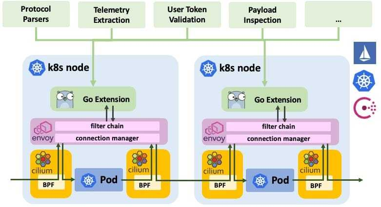

本文为翻译文章，[点击查看原文](https://cilium.io/blog/2018/10/23/cilium-13-envoy-go/)。

我们很高兴地宣布 Cilium 1.3 发布了。这个版本加入了几个新特性。主要的亮点是实现了 Cassandra 和带有策略执行能力的 Memcached 协议解析器，作为[Envoy](https://github.com/envoyproxy/envoy)的 Go 语言扩展包。

和往常一样，整个 Cilium 社区的开发者贡献巨大，他们在 1.2 到 1.3 版本的这段时间贡献了 785 个提交。

## 什么是 Envoy 的 Go 语言扩展？

从 1.0 版本开始，我们一直依赖[Envoy](https://github.com/envoyproxy/envoy)处理所有的 HTTP、gRPC 以及 HTTP 的派生如 Elasticsearch 的请求。社区讨论如何扩大支持 7 层协议的范围，Envoy 作为推动未来协议补充的首选平台是显而易见的。焦点迅速转移到寻找简化 Envoy 可扩展性的方法，并且允许重用现有的开源项目，如 CNCF 项目[Vitess](https://vitess.io/)。于是实现 Envoy 的 Go 扩展的想法就诞生了。

在 Cilium 1.3 中，我们引入了 Envoy 的 Go 扩展作为其 Beta 特性。



- **扩展的透明注入：**在 Cilium 的帮助下，连接被透明地重定向到 Envoy，而不需要修改应用程序或 pod。重定向基于目标端口配置，可以根据 labels、IPs、DNS 以及 ingress 和 egress 连接的服务名称限定到源或目标服务，并通过扩展的名称将连接映射到扩展。重定向是通过 CiliumNetworkPolicy CRD 或 REST API 配置的。Envoy 可以被配置为在每个 pod 中作为 sidecar 或作为每个 node 的独立代理运行。
- **完全分布式：**Go 扩展完全分布在每个 Envoy 节点或 pod 内部，不需要为一个数据处理的集中化控制面板。当然，go 扩展本身可以调用任意的外部控制面板组件来报告遥测数据或验证请求。
- **动态扩展映射：**Go 扩展被设计为共享库提供给 Envoy。Cilium 可以根据设置好的重定向自动加载相应的 Go 扩展来配置 Envoy，并在连接数据时调用它。未来的版本将支持在运行时更新和重新加载扩展，而无需重启 Envoy 并且也不会丢失连接状态。
- **通过 CRD 配置扩展：**通过 CRD 或 REST API 使用通用键值对配置 Go 扩展。这允许传递如安全策略、安全令牌或其他的配置，而无需让 Envoy 知道。
- **通用访问日志：**与配置类似，扩展可以返回通用键值对，这些键值对将提取的可见性传递到访问日志层。
- **沙盒化：**沙盒确保任何解析器的不稳定性都不会破坏 Envoy 的核心。受 Matt Klein 发表的文章[Exceptional Go](https://medium.com/@mattklein123/exceptional-go-1dd1488a6a47)启发，解析器被容许 panic 或抛出异常。当 panic 发生时，信息被记录到访问日志中，TCP 连接与被关闭的请求关联。

## Cilium 是什么？

Cilium 是一个开源软件，可以透明地提供和保护部署在诸如 Kubernetes、Docker 和 Mesos 等 Linux 容器管理平台的应用程服务之间的网络和 API 连接。

Cilium 的基础是一种新的 Linux 内核技术 BPF，它支持在 Linux 内部动态的注入安全、可见性和网络控制逻辑。除了提供传统的网络层安全，BPF 的灵活性还让 API 和流程级别的安全，保护容器或 pod 间通信成为了可能。因为 BPF 在 Linux 内核中运行，Cilium 的安全策略可以在不修改程序代码或容器配置的情况下使用和更新。

有关 Cilium 更详细的介绍请参见**[Introduction to Cilium](https://cilium.readthedocs.io/en/v1.3/intro/)**

## Envoy 是什么？

Envoy 是一个 7 层代理和通信总线，被设计用于大型的面向服务的架构。这个项目诞生于以下理念：

> 网络应该对应用程序透明。当网络和应用程序出现问题时，应该很容易确定问题的根源。

你可以通过 Envoy 的文档 [What is Envoy](https://www.envoyproxy.io/docs/envoy/latest/intro/what_is_envoy)了解更多关于 Envoy 的内容。

# 怎样编写 Envoy 的 Go 语言扩展

编写 Envoy 的 Go 扩展很简单。为说明这一点，我们将为 R2-D2 控制协议实现一个基本的协议解析器，并实现过滤逻辑用来排除任何包含字符串”C-3PO”的控制请求。


要实现扩展的主要 API 是`OnData()`函数，当 Envoy 收到通过`CiliumNetworkPolicy`映射到扩展连接的数据时，就会调用这个函数。函数必须解析数据并返回下面的断言之一：

- **MORE**：解析器需要更多的字节来继续解析。
- **PASS**：传递*n*字节数据流。
- **DROP**：删除*n*字节数据流。
- **INJECT**：向指定的方向注入*n*字节的数据。
- **ERROR**：发生了解析错误，连接必须关闭。
- **NOP**：什么也没发生。

为了注册扩展，需要创建一个必须实现`Create()`函数的解析器工厂。当 Envoy 建立了一个新的连接并使用解析器时就会调用该函数。

```go
import (
        "github.com/cilium/cilium/proxylib/proxylib"
)

type parser struct{
        connection *proxylib.Connection
}

func (p *parser) OnData(reply, endStream bool, dataArray [][]byte) (proxylib.OpType, int) {
        data := string(bytes.Join(dataArray, []byte{}))
        msgLen := strings.Index(data, "\r\n")
        if msgLen < 0 {
                return proxylib.MORE, 1 // No delimiter, request more data
        }

        msgStr := data[:msgLen]
        msgLen += 2 // Inlcude the "\r\n" in the request

        if reply {
                return proxylib.PASS, msgLen // Pass responses without additional parsing
        }

        if strings.Contains(msgStr, "C-3PO") {
                return proxylib.DROP, msgLen
        }

        return proxylib.PASS, msgLen
}

type factory struct{}

func (f *factory) Create(connection *proxylib.Connection) proxylib.Parser {
        return &parser{connection: connection}
}

func init() {
        proxylib.RegisterParserFactory("r2d2", &factory{})
}
```

最后，将新的解析器导入到 proxylib 包中。`libcilium.so`将包含解析器并被 Envoy 加载。编辑文件`proxylib/proxylib.go`：

```go
import (
        [...]
        _ "github.com/cilium/cilium/proxylib/r2d2"
)
```

上面的示例省略了扩展配置、集成到策略代码库以及访问日志等内容。学习如何编写 Go 扩展，请参阅指南[Envoy Go Extensions](https://cilium.readthedocs.io/en/v1.3/envoy/extensions/)。

# Cassandra 支持（Beta）


[Cassandra](https://github.com/apache/cassandra) 是一个流行的 NoSQL 数据库管理系统。它通常被多个服务大规模的访问并在团队间共享。Cilium 1.3 引入了对 Apache [Cassandra](https://github.com/apache/cassandra) 协议的支持，并提供了可见性和策略执行能力。

Cassandra 的 Go 扩展能够在以下协议字段上提供可见性和执行能力：

- **query_action**：这个行为在数据库的`SELECT`， `INSERT`， `UPDATE`等操作上执行，字段总是精确匹配。
- **query_table**：查询执行的表，以正则表达式进行匹配。

### 例子：Empire 如何通过表限制 Cassandra 访问

下面的示例展示了 Empire 如何暴露有限的访问给运行在端口 9042 的 Empire Cassandra 集群。Outposts 被标签`app=empire-outpost`标识，并具有以下权限：

- `SELECT` 操作在表"system.*”和”system_schema.*“上执行
- `INSERT`操作在表"attendance.daily_records"上执行。注意 outposts 不能从这些表读取，因此不能从其他 outposts 读取每日记录。

```yaml
apiVersion: "cilium.io/v2"
kind: CiliumNetworkPolicy
summary: "Allow only permitted requests to empire Cassandra server"
metadata:
name: "secure-empire-cassandra"
specs:
- endpointSelector:
  matchLabels:
    app: cass-server
ingress:
- fromEndpoints:
  - matchLabels:
      app: empire-outpost
  toPorts:
  - ports:
    - port: "9042"
      protocol: TCP
    rules:
      l7proto: cassandra
      l7:
      - query_action: "select"
        query_table: "system\\..*"
      - query_action: "select"
        query_table: "system_schema\\..*"
      - query_action: "insert"
        query_table: "attendance.daily_records"
```

这是一个简单的例子，更多复杂示例请参阅 [Cassandra getting started guide ](https://cilium.readthedocs.io/en/v1.3/gettingstarted/cassandra/)。

# Memcached 支持（Beta）


Memcached 是一种流行的基于内存的分布式缓存，通常用于缓存或在服务之间共享数据。随着 memcached 解析器的 golang 扩展加入 Envoy，Cilium 现在可以执行安全规则去限制 memcached 客户端的某些命令，比如读写，也可以根据 key 前缀进行限制。

## 例子：Rebels 如何保护共享的 memcached 服务

在下面的示例中，Rebels 运行了一个标签为`app=memcached`的 memcached 服务，几个服务与 memcached 交互并应用不同的规则：

- `function=fleet-maintenance` 标识的维护服务被授予对前缀为`alliance/fleet`的所有 key 的读写权限。禁止访问任何其他 key。
- `function=fleet-monitoring`标识的监控服务仅对前缀为`alliance/fleet`的 key 授予读权限。禁止对前缀中的 key 进行写入访问或访问前缀之外的任何 key。
- 所有 Jedis 被标签`role=jedi`标识，拥有完整的 Memcached 服务，可以访问所有的 key。

```yaml
apiVersion: "cilium.io/v2"
kind: CiliumNetworkPolicy
summary: "Secure the Rebel memcached service"
metadata:
  name: "secure-rebel-alliance-memcache"
specs:
  - endpointSelector:
      matchLabels:
        app: memcached
    ingress:
    - fromEndpoints:
      - matchLabels:
          function: fleet-maintanence
      toPorts:
      - ports:
        - port: "11211"
          protocol: TCP
        rules:
          l7proto: memcache
          l7:
          - command: "writeGroup"
            keyPrefix: "alliance/fleet/"
          - command: "get"
            keyPrefix: "alliance/fleet/"
    - fromEndpoints:
      - matchLabels:
          function: fleet-monitoring
      toPorts:
      - ports:
        - port: "11211"
          protocol: TCP
        rules:
          l7proto: memcache
          l7:
          - command: "get"
            keyPrefix: "alliance/fleet/"
    - fromEndpoints:
      - matchLabels:
          role: jedi
      toPorts:
      - ports:
        - port: "11211"
          protocol: TCP
        rules:
          l7proto: memcache
          l7:
          - command:
```

使用 memcached 的完整示例，请参阅 [Memcached getting started guide](https://cilium.readthedocs.io/en/v1.3/gettingstarted/memcached/)。

# 社区

## Linux 基金会"Core Infrastructure Initiative"最佳实践

我们致力于在开放和最好的开源实践中开发 Cilium，包括对安全的坚定承诺。我们很高兴地宣布，我们已经完成了所有工作，获得了 Linux 基金会 [Core Infrastructure Initiative](https://www.coreinfrastructure.org/)的 [CII Best Practices](https://bestpractices.coreinfrastructure.org/en)殊荣。在 [这里](https://www.coreinfrastructure.org/programs/badge-program/)了解更多关于奖章的信息。

## 特别兴趣组（SIG）介绍

社区的关注点越来越多样化。为了确保项目的可伸缩性，我们正式引入了特殊兴趣组（SIGs）来帮助提供一些组织结构。已经创建了以下的 SIGs：

- **Datapath**： (#sig-datapath) 所有 BPF 和 Linux 内核相关的数据通路代码拥有者。
- **Documentation**： (#sig-docs) 所有文档相关的讨论。
- **Envoy**： (#sig-envoy) Envoy，Istio 和所有 7 层协议解析器的维护。
- **Policy**： (#sig-policy) 所有策略相关的主题。这个 SIG 负责所有与安全相关的 API 和实现逻辑。
- **Release Management**： (#launchpad) 负责发布管理和向后移植的过程。

任何人都可以建立额外的 SIGs。这个过程很简单有[文档说明](https://cilium.readthedocs.io/en/v1.3/community/#how-to-create-a-sig)

# 1.3 版本新特性

- **Envoy 的 Go 语言扩展**
  - 令人兴奋的全新的 Envoy Go 扩展 API，包括通用配置和访问日志 API（Beta 版本）
- **Cassandra 和 Memcached 协议支持**
  - 使用新的 Envoy Go 扩展实现了 Cassandra 和 Memcached 的新协议解析器。这两个解析器都使用精确匹配、前缀匹配和正则表达式为操作类型和键/表名提供可见性和强制安全策略。（Beta）
- **安全性**
  - 为DNS/FQDN策略规则提供TTLs支持。
  - 引入 kube-dns、coredns 和 etcd 操作符的标识。
  - 新的安全标识"unmanaged"代表没有被 Cilium 管理的 pod。
  - 改进的安全实体“集群”，允许为集群中的所有 pod 定义策略（已管理、未管理和主机网络的）。
- **额外的遥测指标和监控**
  - 新的"cilium metrics list"命令通过 CLI 查看 metrics 列表。
  - 许多额外的 metrics：连接跟踪垃圾回收，Kubernetes 资源事件，IPAM，再生节点，服务，错误和警告计数器。
  - 具有更高效的编解码协议的新监控接口。默认情况下用于较老的客户端。
- **网络改进**
  - 将连接跟踪表划分为 TCP 和非 TCP，以更好地处理每个协议的长短连接的混合。
  - 通过 ConfigMap 描述连接表大小的能力。
  - 通过 NodePort 和 HostPort 更好的伪装流量行为，容许 pods 可以查看原始源 IP。
- **全键值存储弹性**
  - 引入了在任何状态丢失后立即重新构造键值存储内容的能力。允许从备份中恢复 etcd，或者在运行的集群中完全删除它，并影响最小。(Beta)
- **效率和扩展**
  - 在计算独立 endpoint 策略的成本方面有重大改进。关于这方面的工作还在继续。
  - 新的宽限期，通过工作负载更改身份最小化连接影响。
  - 更高效的安全身份分配算法。
  - 新的通用框架检测和忽略 Kubernetes 事件通知，Cilium 不需要动作。
  - 在避免不必要的 BPF 编译方面的改进，以减少由此导致的 CPU 负载。初始化 BPF 模板以避免全编译。
- **Kubernetes**
  - 增加对 Kubernetes 1.12 的支持
  - 为 CiliumEndpoints CRD 自定义列（需要 Kubernetes 1.11 支持）
  - 为 ulibc 的兼容性从 cilium-cni 移除 cgo
  - 移除对 Kubernetes 1.7 的支持
- **文档**
  - 新的 Ubuntu 18.04 手册
  - 对最新的 BPF 运行时特性的覆盖，例如 BTF（BPF Type Format）
  - 针对运行多主机网络的虚拟机/主机防火墙需求的文档
- **长期稳定版本 (LTS)**
  - 1.3 已经声明为 LTS 版本，在后续的 6 个月将作为向后移植的版本继续支持

## 更新指导

请查阅[upgrade guide](https://cilium.readthedocs.io/en/v1.3/install/upgrade/#upgrading-minor-versions)去更新你的 Cilium 部署，可以随时在[Slack](http://cilium.io/slack)上联系我们。

## 发布

- 发布记录和二进制文件 [1.3.0](https://github.com/cilium/cilium/releases/tag/1.3.0)
- 容器镜像： `docker.io/cilium/cilium:v1.3.0`
