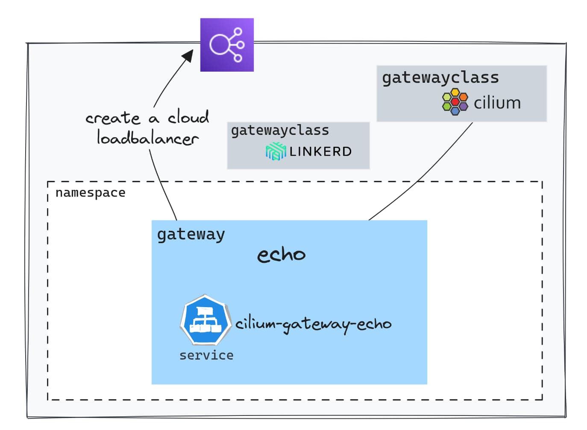
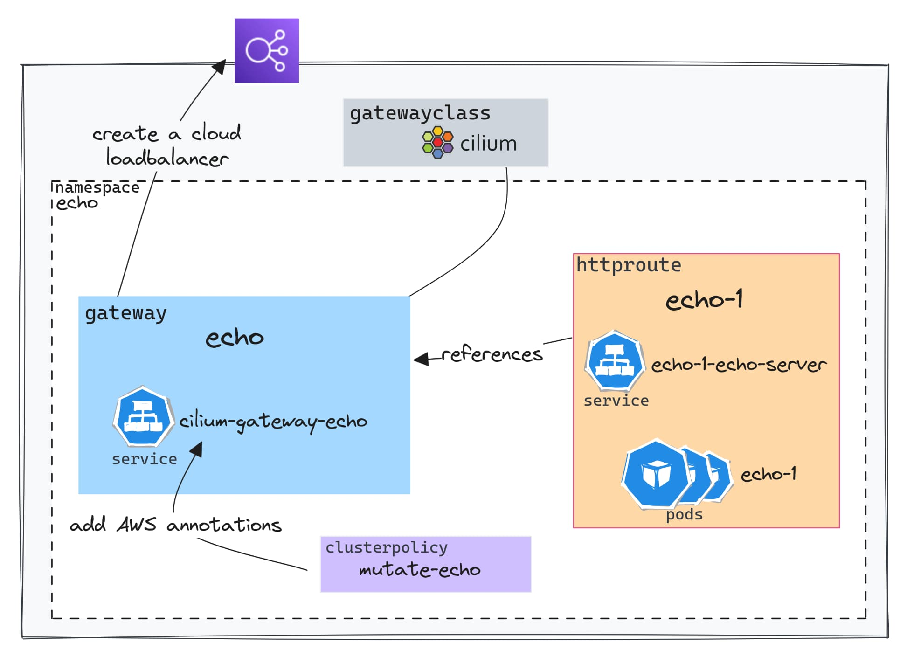
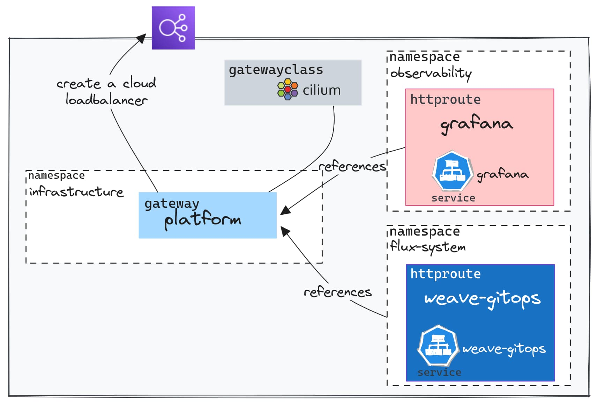
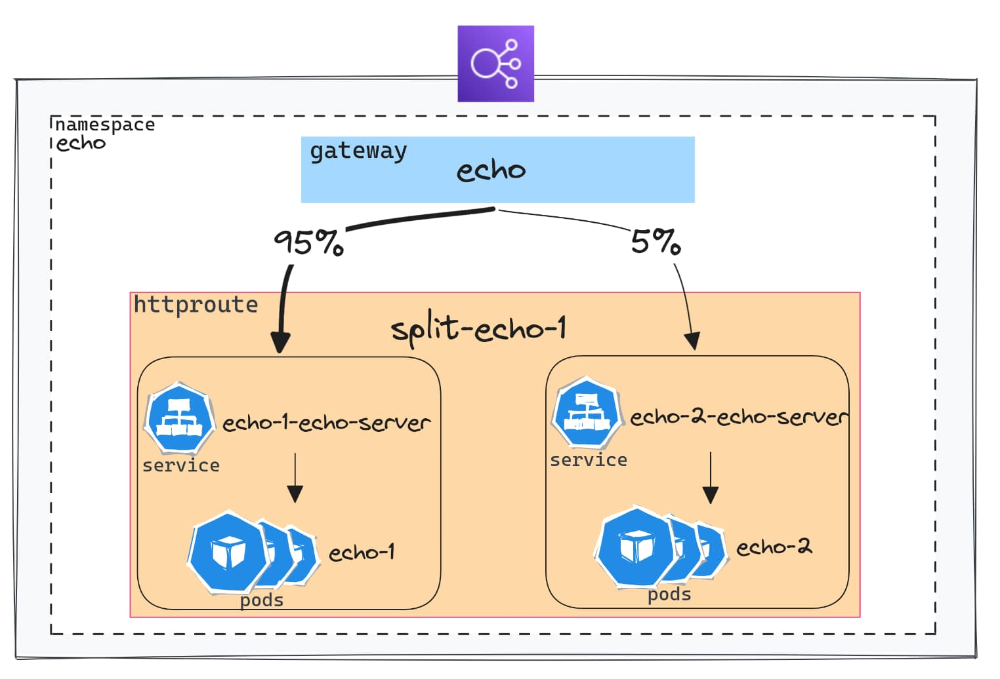

在 Kubernetes 上部署应用程序后，通常的下一步是让用户可以访问它。我们通常使用[**Ingress 控制器**](https://kubernetes.io/docs/concepts/services-networking/ingress-controllers/)，例如 Nginx、Haproxy、Traefik 或来自云提供商的控制器，来引导传入的流量到应用程序，管理负载平衡、TLS 终止等等。

然后，我们必须从众多[可用的选项](https://kubernetes.io/docs/concepts/services-networking/ingress-controllers/) 中进行选择。Cilium 是其中一个相对较新的选项，旨在处理所有这些网络方面的问题。

[**Cilium**](https://cilium.io/) 是一个基于 eBPF 的开源网络和安全解决方案，其采用速度增长迅猛。它可能是提供最多功能的网络插件之一。我们不会涵盖所有功能，但其中一个功能涉及使用[**Gateway API**](https://gateway-api.sigs.k8s.io/) (`GAPI`) 管理传入流量。

## 我们的目标

- 准确了解 **Gateway API** 是什么，以及它如何代表从 `Ingress` API 进化而来。
- 演示以 GitOps 方式部署的真实场景。
- 当前的限制和即将推出的新功能。



本文中执行的所有步骤都来自这个[**git 存储库**](https://github.com/Smana/cilium-gateway-api)。

我鼓励你探索它，因为它远远超出了本文的范围：

- 使用启用了 kube-proxy 替代并具有专用 Daemonset 用于 `Envoy` 的 `Cilium` 配置的 **EKS** 集群的安装。
- 提出了具有依赖关系管理和我认为非常高效的 DRY 代码的 `Flux` 结构。
- 简化了用于平台组件的 IAM 权限管理的 `Crossplane` 和 [IRSA](https://docs.aws.amazon.com/eks/latest/userguide/iam-roles-for-service-accounts.html) 组合。
- 使用 `External-DNS` 和 `Let's Encrypt` 自动管理域名和证书。

这个想法是只需几分钟内设置好一切，只需一个命令行。



## 介绍 Gateway API

正如前面提到的，有许多**Ingress 控制器**选项，每个都有其特定性和特殊功能，有时会使它们的使用变得复杂。此外，Kubernetes 中传统的 `Ingress` API 具有非常有限的参数。一些解决方案甚至创建了自己的[CRDs](https://kubernetes.io/docs/concepts/extend-kubernetes/api-extension/custom-resources/)（Kubernetes 自定义资源），而其他解决方案则使用 `annotations` 来克服这些限制。

这就是**Gateway API**的用武之地！实际上，这是一种**标准**，允许声明高级网络功能，而无需对底层控制器进行特定扩展。而且，由于所有控制器都使用相同的 API，因此可以在不改变配置的情况下从一个解决方案切换到另一个解决方案（Kubernetes 清单描述了如何路由传入流量）。

在我们将要探讨的概念中，GAPI 引入了一个精细的授权模型，定义了具有不同权限的**显式角色**（有关 GAPI 安全模型的更多信息，请参阅[这里](https://gateway-api.sigs.k8s.io/concepts/security-model/#roles-and-personas)）。

值得注意的是，该项目由[sig-network-kubernetes](https://github.com/kubernetes/community/tree/master/sig-network)工作组推动，还有一个 Slack [频道](https://kubernetes.slack.com/archives/CR0H13KGA)，你可以在需要时联系他们。

让我们看看在实践中如何使用 GAPI 与 Cilium！

## 先决条件

在本文的其余部分，我们假设已部署了一个 EKS 集群。如果你没有使用[演示存储库中建议的方法](https://github.com/Smana/cilium-gateway-api/tree/main/terraform/eks)作为本文的基础，那么有一些**要检查的要点**，以便使用 GAPI。

此处描述的安装方法基于 `Helm`，所有的 `values` 可以在[这里](https://github.com/Smana/cilium-gateway-api/blob/main/terraform/eks/helm_values/cilium.yaml)查看。

- 在[Gateway API](https://github.com/kubernetes-sigs/gateway-api/tree/main/config/crd)存储库中**安装**可用的 `CRDs`。

  

  如果 Cilium 设置为支持 `GAPI`（见下文），并且缺少 CRDs，则它将无法启动。在[演示存储库](https://github.com/Smana/cilium-gateway-api)中，**GAPI CRDs**在集群创建期间安装一次，以便 Cilium 可以启动，然后由 Flux 管理。

  

- 使用 Cilium 和 `eBPF` 的网络转发功能**替换** `kube-proxy`。

  ```yaml
  kubeProxyReplacement: true
  ```

- **启用** Gateway API 支持。

  ```yaml
  gatewayAPI:
    enabled: true
  ```

- **检查**安装。为此，你需要安装名为 `cilium` 的命令行工具。我个人使用 [asdf](https://blog.ogenki.io/post/asdf/asdf/)：

  ```console
  asdf plugin-add cilium-cli
  asdf install cilium-cli 0.15.7
  asdf global cilium 0.15.7
  ```

  以下命令允许确保所有组件都正常运行：

  ```console
  cilium status --wait
     /¯¯\
  /¯¯\__/¯¯\    Cilium:             OK
  \__/¯¯\__/    Operator:           OK
  /¯¯\__/¯¯\    Envoy DaemonSet:    OK
  \__/¯¯\__/    Hubble Relay:       disabled
     \__/       ClusterMesh:        disabled
  
  Deployment             cilium-operator    Desired: 2, Ready: 2/2, Available: 2/2
  DaemonSet              cilium             Desired: 2, Ready: 2/2, Available: 2/2
  DaemonSet              cilium-envoy       Desired: 2, Ready: 2/2, Available: 2/2
  Containers:            cilium             Running: 2
                        cilium-operator    Running: 2
                        cilium-envoy       Running: 2
  Cluster Pods:          33/33 managed by Cilium
  Helm chart version:    1.14.2
  Image versions         cilium             quay.io/cilium/cilium:v1.14.2@sha256:6263f3a3d5d63b267b538298dbeb5ae87da3efacf09a2c620446c873ba807d35: 2
                        cilium-operator    quay.io/cilium/operator-aws:v1.14.2@sha256:8d514a9eaa06b7a704d1ccead8c7e663334975e6584a815efe2b8c15244493f1: 2
                        cilium-envoy       quay.io/cilium/cilium-envoy:v1.25.9-e198a2824d309024cb91fb6a984445e73033291d@sha256:52541e1726041b050c5d475b3c527ca4b8da487a0bbb0309f72247e8127af0ec: 2
  ```

  最后，你可以通过运行以下命令来检查是否启用了 Gateway API 支持：

  ```console
  cilium config view | grep -w "enable-gateway-api"
  enable-gateway-api                                true
  enable-gateway-api-secrets-sync                   true
  ```

  你还可以运行以下端到端测试：

  ```console
  cilium connectivity test
  ```

  但是，此命令（`connectivity test`）当前在启用 Envoy 作为 DaemonSet 时会抛出错误。([Github Issue](https://github.com/cilium/cilium/issues/28057))。


  **Envoy 作为 DaemonSet**

  默认情况下，Cilium 代理还在同一 Pod 中运行 `Envoy`，并委托给它级别 7 的网络操作。从版本 `v1.14` 开始，可以将 Envoy 单独部署，这带来了一些好处：

  - 如果修改/重新启动一个组件（无论是 Cilium 还是 Envoy），都不会影响另一个组件。
  - 更好地分配资源给每个组件以优化性能。
  - 在某个 Pod 被攻击的情况下限制攻击面。
  - Envoy 日志和 Cilium 代理日志不会混合在一起。

  你可以使用以下命令来检查此功能是否已启用：

  ```console
  cilium status
      /¯¯\
   /¯¯\__/¯¯\    Cilium:             OK
   \__/¯¯\__/    Operator:           OK
   /¯¯\__/¯¯\    Envoy DaemonSet:    OK
   \__/¯¯\__/    Hubble Relay:       disabled
      \__/       ClusterMesh:        disabled
  ```

  [更多信息](https://isovalent.com/blog/post/cilium-release-114/#h-envoy-daemonset)。


## 入口点：GatewayClass 和 Gateway



一旦满足先决条件，我们就可以访问多个元素。我们可以利用 Gateway API CRDs 定义的自定义资源。而且，在安装 Cilium 后，一个 `GatewayClass` 立即可用。

```console
kubectl get gatewayclasses.gateway.networking.k8s.io
NAME     CONTROLLER                     ACCEPTED   AGE
cilium   io.cilium/gateway-controller   True       7m59s
```

在 Kubernetes 集群上，你可以配置多个 `GatewayClasses`，从而能够使用不同的实现。例如，我们可以通过在 `Gateway` 配置中引用 GatewayClass 来使用 `Linkerd`。

`Gateway` 是允许触发在云提供商中创建负载均衡组件的资源。

这是一个简单的示例：[apps/base/echo/gateway.yaml](https://github.com/Smana/cilium-gateway-api/blob/main/apps/base/echo/gateway.yaml)

```yaml
apiVersion: gateway.networking.k8s.io/v1beta1
kind: Gateway
metadata:
  name: echo-gateway
  namespace: echo
spec:
  gatewayClassName: cilium
  listeners:
    - protocol: HTTP
      port: 80
      name: echo-1-echo-server
      allowedRoutes:
        namespaces:
          from: Same
```

在 AWS（EKS）上，配置 `Gateway` 时，Cilium 会创建一个类型为 `LoadBalancer` 的 `Service`。然后，另一个控制器（[AWS Load Balancer Controller](https://kubernetes-sigs.github.io/aws-load-balancer-controller)）处理云负载均衡器（[NLB](https://docs.aws.amazon.com/elasticloadbalancing/latest/network/introduction.html)）的创建。

```console
kubectl get svc -n echo cilium-gateway-echo
NAME                  TYPE           CLUSTER-IP     EXTERNAL-IP                                                                 PORT(S)        AGE
cilium-gateway-echo   LoadBalancer   172.20.19.82   k8s-echo-ciliumga-64708ec85c-fcb7661f1ae4e4a4.elb.eu-west-3.amazonaws.com   80:30395/TCP   2m58s
```

值得注意的是，负载均衡器地址也与 `Gateway` 相关联。

```console
kubectl get gateway -n echo echo
NAME   CLASS    ADDRESS                                                                     PROGRAMMED   AGE
echo   cilium   k8s-echo-ciliumga-64708ec85c-fcb7661f1ae4e4a4.elb.eu-west-3.amazonaws.com   True         16m
```

## 路由规则：HTTPRoute

### 基本规则



简而言之，上面的图表可总结为几句话：`HTTPRoute` 允许通过引用 Gateway 并定义所需的路由参数来配置到服务的路由。


**Kyverno**

截止目前，无法配置由 `Gateways` 生成的服务的注释（[Github Issue](https://github.com/cilium/cilium/issues/25357)）。已提出一种解决方法，即在创建 `Gateway` 后立即修改由 `Gateway` 创建的服务。

Kyverno 是一种确保配置符合最佳实践和安全要求的工具。我们在这里仅仅使用它来轻松描述[突变](https://kyverno.io/docs/writing-policies/mutate/)规则。

[security/mycluster-0/echo-gw-clusterpolicy.yaml](https://github.com/Smana/cilium-gateway-api/blob/main/security/mycluster-0/echo-gw-clusterpolicy.yaml)

```yaml
spec:
  rules:
    - name: mutate-svc-annotations
      match:
        any:
          - resources:
              kinds:
                - Service
              namespaces:
                - echo
              name: cilium-gateway-echo
      mutate:
        patchStrategicMerge:
          metadata:
            annotations:
              external-dns.alpha.kubernetes.io/hostname: echo.${domain_name}
              service.beta.kubernetes.io/aws-load-balancer-scheme: "internet-facing"
              service.beta.kubernetes.io/aws-load-balancer-backend-protocol: tcp
          spec:
            loadBalancerClass: service.k8s.aws/nlb
```

因此，服务 `cilium-gateway-echo` 将添加 AWS 控制器的注释，以及一个允许自动 DNS 记录配置的注释。


[apps/base/echo/httproute.yaml](https://github.com/Smana/cilium-gateway-api/blob/main/apps/base/echo/httproute.yaml)

```yaml
apiVersion: gateway.networking.k8s.io/v1beta1
kind: HTTPRoute
metadata:
  name: echo-1
  namespace: echo
spec:
  parentRefs:
    - name: echo
      namespace: echo
  rules:
    - matches:
        - path:
            type: PathPrefix
            value: /
      backendRefs:
        - name: echo-1-echo-server
          port: 80
```

上面使用的示例非常简单：所有请求都会转发到 `echo-1-echo-server` 服务。

`parentRefs` 指示使用哪个 `Gateway`，然后在 `rules` 部分定义了路由规则。

路由规则还可以基于 `path`。

```yaml
...
spec:
  hostnames:
  - foo.bar.com
  rules:
  - matches:
    - path:
        type: PathPrefix
        value: /login
```

或者基于 HTTP 标头

```yaml
...
spec:
  rules:
  - matches:
      headers:
      - name: "version"
        value: "2"
...
```

让我们检查服务是否可访问。

```console
curl -s http://echo.cloud.ogenki.io | jq -rc '.environment.HOSTNAME'
echo-1-echo-server-fd88497d-w6sgn
```

正如你所看到的，该服务以 HTTP 方式暴露，没有证书。让我们尝试解决这个问题。

### 配置 TLS 证书

有多种方法可以使用 GAPI 配置 TLS。在这里，我们将使用最常见的情况：HTTPS 协议和在 Gateway 上终止 TLS。

假设我们想要配置之前使用的域名 `echo.cloud.ogenki.io`。配置主要通过配置 `Gateway` 来完成。

[apps/base/echo/tls-gateway.yaml](https://github.com/Smana/cilium-gateway-api/blob/main/apps/base/echo/tls-gateway.yaml)

```yaml
apiVersion: gateway.networking.k8s.io/v1beta1
kind: Gateway
metadata:
  name: echo
  namespace: echo
  annotations:
    cert-manager.io/cluster-issuer: letsencrypt-prod
spec:
  gatewayClassName: cilium
  listeners:
    - name: http
      hostname: "echo.${domain_name}"
      port: 443
      protocol: HTTPS
      allowedRoutes:
        namespaces:
          from: Same
      tls:
        mode: Terminate
        certificateRefs:
          - name: echo-tls
```

这里的关键点是引用一个包含名称为 `echo-tls` 的证书的密钥。这个证书可以手动创建，但是为了本文，我选择使用 **Let's Encrypt** 和 `cert-manager` 来自动化这个过程。

}
**cert-manager**

使用 `cert-manager`，自动创建和更新由 `Gateway` 暴露的证书非常简单。为此，你需要允许控制器访问 [route53](https://aws.amazon.com/route53/)，以解决 DNS01 挑战（这是一种确保客户端只能为自己拥有的域请求证书的机制）。

[ClusterIssuer](https://github.com/Smana/cilium-gateway-api/blob/main/security/base/cert-manager/cluster-issuer-staging.yaml) 资源描述了使用 cert-manager 生成证书所需的配置。

接下来，我们只需要添加一个注释 `cert-manager.io/cluster-issuer` 并设置存储证书的 Kubernetes 密钥。

[更多信息](https://cert-manager.io/docs/usage/gateway/)

在演示存储库中，权限是使用 `Crossplane` 分配的，它负责在 AWS 中配置这些 IAM 权限。


为了使路由正常工作，你还需要将 `HTTPRoute` 附加到正确的 `Gateway` 并指定域名。

```yaml
apiVersion: gateway.networking.k8s.io/v1beta1
kind: HTTPRoute
metadata:
  name: echo-1
  namespace: echo
spec:
  parentRefs:
    - name: echo
      namespace: echo
  hostnames:
    - "echo.${domain_name}"
...
```

几秒钟后，证书将被创建。

```console
kubectl get cert -n echo
NAME       READY   SECRET     AGE
echo-tls   True    echo-tls   43m
```

最后，我们可以检查证书确实来自 Let's Encrypt，如下所示：

```console
curl https://echo.cloud.ogenki.io -v 2>&1 | grep -A 6 'Server certificate'
* Server certificate:
*  subject: CN=echo.cloud.ogenki.io
*  start date: Sep 15 14:43:00 2023 GMT
*  expire date: Dec 14 14:42:59 2023 GMT
*  subjectAltName: host "echo.cloud.ogenki.io" matched cert's "echo.cloud.ogenki.io"
*  issuer: C=US; O=Let's Encrypt; CN=R3
*  SSL certificate verify ok.
```


GAPI 还允许你配置 **端到端的 TLS**，一直到容器。这是通过配置 `Gateway` 为 `Passthrough` 模式并使用 `TLSRoute` 资源来完成的。证书也必须由执行 TLS 终止的 pod 携带。


### 在多个命名空间中共享 Gateway



使用 `GAPI`，你可以在 `命名空间` 之间路由流量。这得益于每个功能的不同资源：一个 `Gateway` 允许配置基础设施，以及 `*Routes`。这些路由可以附加到位于另一个命名空间中的 Gateway。因此，不同的团队/项目可以共享相同的基础设施组件。

但是，这需要指定哪个路由允许引用该 Gateway。在这里，我们假设我们有一个专门用于内部工具的 Gateway，名为 `platform`。通过使用 `allowedRoutes` 参数，我们明确指定了哪些命名空间允许附加到此 Gateway。

[infrastructure/base/gapi/platform-gateway.yaml](https://github.com/Smana/cilium-gateway-api/blob/main/infrastructure/base/gapi/platform-gateway.yaml)

```yaml
...
      allowedRoutes:
        namespaces:
          from: Selector
          selector:
            matchExpressions:
              - key: kubernetes.io/metadata.name
                operator: In
                values:
                  - observability
                  - flux-system
      tls:
        mode: Terminate
        certificateRefs:
          - name: platform-tls
```

在命名空间 `observability` 和 `flux-system` 中配置的 `HTTPRoutes` 附加到此唯一的 `Gateway`。

```yaml
...
spec:
  parentRefs:
    - name: platform
      namespace: infrastructure
```

因此，使用来自云提供商的相同负载均衡器。

```console
NLB_DOMAIN=$(kubectl get svc -n infrastructure cilium-gateway-platform -o jsonpath={.status.loadBalancer.ingress[0].hostname})

dig +short ${NLB_DOMAIN}
13.36.89.108

dig +short grafana-mycluster-0.cloud.ogenki.io
13.36.89.108

dig +short gitops-mycluster-0.cloud.ogenki.io
13.36.89.108
```


这些内部工具不应该暴露在互联网上，但是你知道：这只是一个演示。例如，我们可以使用内部 Gateway（私有 IP）通过调整注释并使用私有连接系统（VPN、隧道等）来实现。


### 流量分流



由服务网格常常提供的一个功能是在有新版本可用时（A/B 测试或金丝雀部署）对部分流量测试应用程序的能力。`GAPI`通过使用权重来实现这一点，使其变得非常简单。

以下是一个将 5% 的流量转发到服务 `echo-2-echo-server` 的示例：

[apps/base/echo/httproute-split.yaml](https://github.com/Smana/cilium-gateway-api/blob/main/apps/base/echo/httproute-split.yaml)

```yaml
...
  hostnames:
    - "split-echo.${domain_name}"
  rules:
    - matches:
        - path:
            type: PathPrefix
            value: /
      backendRefs:
        - name: echo-1-echo-server
          port: 80
          weight: 95
        - name: echo-2-echo-server
          port: 80
          weight: 5
```

让我们检查分发是否按预期进行：

[scripts/check-split.sh](https://github.com/Smana/cilium-gateway-api/blob/main/scripts/check-split.sh)

```console
./scripts/check-split.sh https://split-echo.cloud.ogenki.io
echo-1 的请求次数：95
echo-2 的请求次数：5
```

### 修改标头

还可以更改 HTTP **标头**：添加、修改或删除它们。这些修改可以通过在 `HTTPRoute` 清单中使用 [filters](https://gateway-api.sigs.k8s.io/api-types/httproute#filters-optional) 应用于请求标头或响应标头。

例如，我们将在 **请求** 中添加一个标头。

```yaml
apiVersion: gateway.networking.k8s.io/v1beta1
kind: HTTPRoute
metadata:
  name: echo-1
  namespace: echo
spec:
...
  rules:
    - matches:
        - path:
            type: PathPrefix
            value: /req-header-add
      filters:
        - type: RequestHeaderModifier
          requestHeaderModifier:
            add:
              - name: foo
                value: bar
      backendRefs:
        - name: echo-1-echo-server
          port: 80
...
```

此命令允许查看标头是否确实已添加：

```console
curl -s https://echo.cloud.ogenki.io/req-header-add | jq '.request.headers'
{
  "host": "echo.cloud.ogenki.io",
  "user-agent": "curl/8.2.1",
  "accept": "*/*",
  "x-forwarded-for": "81.220.234.254",
  "x-forwarded-proto": "https",
  "x-envoy-external-address": "81.220.234.254",
  "x-request-id": "320ba4d2-3bd6-4c2f-8a97-74296a9f3f26",
  "foo": "bar"
}
```

## 分配适当的权限

`GAPI` 提供了一种清晰的权限共享模型，用于管理流量路由基础设施（由集群管理员管理）和应用程序（由开发人员管理）之间的关系。

多个自定义资源的可用性允许使用 Kubernetes 的 **RBAC** 配置以声明性方式分配权限。我已经添加了一些示例，这些示例在我的演示集群中没有效果，但可能会给你一个想法。

下面的配置授予 `developers` 组的成员在 echo 命名空间内管理 `HTTPRoutes` 的能力，同时仅提供对 `Gateways` 的读取权限。

```yaml
---
apiVersion: rbac.authorization.k8s.io/v1
kind: Role
metadata:
  namespace: echo
  name: gapi-developer
rules:
  - apiGroups: ["gateway.networking.k8s.io"]
    resources: ["httproutes"]
    verbs: ["*"]
  - apiGroups: ["gateway.networking.k8s.io"]
    resources: ["gateways"]
    verbs: ["get", "list"]
---
apiVersion: rbac.authorization.k8s.io/v1
kind: RoleBinding
metadata:
  name: gapi-developer
  namespace: echo
subjects:
  - kind: Group
    name: "developers"
    apiGroup: rbac.authorization.k8s.io
roleRef:
  kind: Role
  name: gapi-developer
  apiGroup: rbac.authorization.k8s.io
```

## 乍一看有点模糊

人们可能会对通常称为 `API 网关` 的东西感到困惑。已经创建了 [FAQ](https://gateway-api.sigs.k8s.io/faq/) 的一个部分，以澄清它与 `Gateway API` 的不同之处。尽管 GAPI 提供了通常在 API 网关中找到的功能，但它主要是 Kubernetes 的一个特定实现。然而，选择这个名称确实可能引起 **混淆**。

此外，请注意，本文仅关注入站流量，通常由 *Ingress Controllers* 管理，称为 [南北](https://gateway-api.sigs.k8s.io/concepts/glossary/#northsouth-traffic)，这实际上是 GAPI 的初始范围。最近的一个名为 [**GAMMA**](https://gateway-api.sigs.k8s.io/concepts/gamma/) 的倡议旨在处理 [东西流量](https://gateway-api.sigs.k8s.io/concepts/glossary/#eastwest-traffic) 路由，这将在将来标准化某些常见的功能，通常由 `Service Meshes` 解决方案提供。（有关更多详细信息，请参阅 [此文章](https://kubernetes.io/blog/2023/08/29/gateway-api-v0-8/)）。

## 最后的想法

老实说，我已经知道 **Gateway API** 有一段时间了。尽管我读了一些文章，但我并没有真正深入研究过。我会想：“为什么要麻烦呢？我的 *Ingress Controller* 可以工作，而且这需要学习曲线。”

GAPI 正在崭露头角，即将发布 GA 版本。多个 [项目](https://gateway-api.sigs.k8s.io/implementations/) 已经拥抱它，这个用于管理 Kubernetes 内流量的 API 将迅速成为标准。

我必须说，配置 GAPI 感觉直观而明确。它的安全模型取得了平衡，赋予开发人员权力而不会损害安全性。而且无缝的基础设施管理？你可以在不触及 `*Routes` 的情况下在不同的实现之间切换。

现在就用 `Cilium` 交换我的 Ingress Controller 吗？**还没有，但它即将到来**。

值得强调的是，Cilium 的功能非常广泛：在 Kubernetes 周围有大量的工具，Cilium 脱颖而出，承诺提供指标、跟踪、服务网格、安全性，以及 *Ingress Controller* 与 GAPI。

然而，需要注意一些挑战：

- [TCP 和 UDP 支持](https://github.com/cilium/cilium/issues/21929)
- [GRPC 支持](https://github.com/cilium/cilium/issues/21928)
- 需要使用变异规则来配置云组件（[Github Issue](https://github.com/cilium/cilium/issues/25357)）。
- 本文讨论的许多功能仍处于实验阶段。例如，最新版本（我写作时的 `v1.14.2`）支持的 [扩展功能](https://github.com/cilium/cilium/pull/27472)。我尝试设置一个简单的 HTTP>HTTPS 重定向，但遇到了 [这个问题](https://github.com/kubernetes-sigs/gateway-api/issues/1185)。因此，我预计 API 将来会有一些修改。

虽然我只是涉及了 Cilium 的 GAPI 能够提供的一小部分内容（老实说，这篇文章已经相当长了），但我希望我们可以很快在生产中使用它。但考虑到前面提到的几点，我建议等待一段时间。不过，如果你想为未来做准备，那么现在是时候了！

## 参考资料

- https://gateway-api.sigs.k8s.io/
- https://docs.cilium.io/en/latest/network/servicemesh/gateway-api/gateway-api/#gs-gateway-api
- https://isovalent.com/blog/post/cilium-gateway-api/
- https://isovalent.com/blog/post/tutorial-getting-started-with-the-cilium-gateway-api/
- Isovalent 的 [labs](https://isovalent.com/resource-library/labs/) 是开始使用 Gateway API 并且你将获得新的徽章以添加到你的收藏中的好方法
