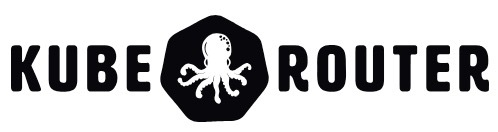
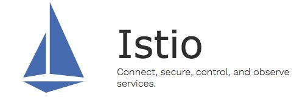

本文为翻译文章，[点击查看原文](https://cilium.io/blog/2018/08/21/cilium-12/)。

我们很高兴地宣布推出 Cilium 1.2。该版本引入了几个新功能实现了 Cilium 用户和社区成员最迫切想要的功能。其中最吸引人的功能之一是引入基于 DNS 名称的安全策略，目的是保护对集群外服务的访问。另一个最受关注的问题是加入了连接和保护多个 Kubernetes 集群的能力。我们将 ClusterMesh 功能进入 Alpha 版本。它可以连接和保护在多个 Kubernetes 集群中运行的 pod。Kube-router 与 Cilium 的集成同等重要。DigitalOcean 团队的努力使 kube-router 提供 BGP 网络与 Cilium 提供的基于 BPF 的安全性和负载均衡相结合。整个 Cilium 开发者社区贡献者总数已增加到 85 个，在 1.1 到 1.2 版本内贡献了 579 个 PR。

## Cilium 是什么？

Cilium 是一个开源软件，用于在 Kubernetes、Docker 和 Mesos 等 Linux 容器管理平台部署的应用程序服务之间提供透明连接、保护网络和 API。


Cilium 是基于一种叫 BPF 的新内核技术，它使得能够在 Linux 自身内部动态插入强大的安全性、可见性和网络控制逻辑。除了提供传统的网络级安全性之外，BPF 的灵活性还可以在 API 和进程级别实现安全性，以保护容器或 pod 内的通信。

有关 Cilium 的更详细的介绍，请参阅[Cilium 简介](http://docs.cilium.io/en/v1.1/intro/)部分。

## 1.2 版本的重要功能

- 基于DNS/FQDN的安全策略
  - 基于FQDN/DNS命名定义网络安全规则，表示允许连接到外部服务。例如，允许访问foo.com。（处于Beta版）
- 支持 AWS EKS
  - 为管理 Kubernetes 集成量身定制的 etcd operator，消除了对需要外部 kvstore 的依赖。（处于 Beta 版）
- Clustermesh（集群间连接）
  - 跨多个 Kubernetes 集群的 pod 间网络连接。（处于 Alpha 版）
  - 跨集群的基于 label 的网络安全策略实施，例如允许 cluster1 中的 pod foo 与 cluster2 中的 pod bar 通信。
- 为支持 BPF 集成 Kube-route
  - 与 kube-router 一起协作运行以启用 BGP 网络。
- 基于节点发现的 KV 存储
  - 在非 Kubernetes 环境中启用自动节点发现。
- 负载均衡
  - 支持一致的后端 selection 用于服务后端扩缩容
  - 支持基于服务label/name的策略以及L4规则
- 高效性 & 扩缩容
  - 对于大型和多集群规模的环境，安全身份认证空间从 16bits 增加到 24bits。
  - 首次实现基于 BPF 的数据路径通知聚合。
  - 取得持续高效的 CPU 利用进展。
  - 自动检测 underlying 网络的 MTU。
  - 禁用 DSR 时使用本地 service ID 分配以提高负载均衡可伸缩性。
- 文档
  - 新的 AWS EKS 安装指南。
  - 参考 kubespray 安装指南。
  - 新的简化安装和升级说明。

## 基于 DNS 的安全策略

在 Kubernetes 集群中运行的服务通常与集群外部的一系列服务进行交互。常见示例包括 SaaS 服务，如 S3、RDS、DynamoDB 等。基于 API 的服务，例如 Google 地图、Salesforce API、Twilio 等。或自托管服务，如 Oracle 数据库集群、基于 Windows 的应用程序等。到目前为止，Cilium 支持基于 CIDR 的策略，以便与此类外部服务进行交互。然而，基于 CIDR 的策略很难定义和维护，因为服务的 IP 地址可能经常发生变化。Cilium 1.2 现在支持基于 DNS 名称的特定策略。当前实现支持基于其 FQDN 的白名单外部服务的核心实例。考虑到 DNS 解决方案（例如 TTL、CNAME 等）和相关策略要求（例如`*.google.com`等基于通配符的规范）的复杂性，对于基于 DNS 的综合策略，后续版本中还有更多工作要做。

## 示例：允许访问 my-remote-service.com

下面的简单示例演示了如何定义网络安全策略，该策略允许所有 label 为`app = test-app`的 pod 通过 kube-dns 解析 DNS 名称，并向服务`my-remote-service.com`发出外部请求：

```yaml
apiVersion: "cilium.io/v2"
kind: CiliumNetworkPolicy
metadata:
  name: "to-fqdn-example"
spec:
  endpointSelector:
    matchLabels:
      app: test-app
  egress:
    - toFQDNs:
        - matchName: "my-remote-service.com"
    - toEndpoints:
      - matchLabels:
          "k8s:io.cilium.k8s.policy.serviceaccount": kube-dns
          "k8s:io.kubernetes.pod.namespace": kube-system
          "k8s:k8s-app": kube-dns
      toPorts:
      - ports:
        - port: "53"
          protocol: UDP
```

Cilium 将自动维护相应的基于 CIDR 的规则，以允许所有 pod 与所有为该 DNS 名称返回的 IP 地址进行通信。

## 支持 AWS EKS

按照[AWS EKS 上使用 etcd operator 的新指南](http://docs.cilium.io/en/v1.2/kubernetes/install/eks/)，在 AWS EKS 托管的 Kubernetes 集群上安装 Cilium。

安装指南为 Cilium 提供全新的集成 etcd operator，以管理自己的 etcd 集群。在许多情况下，Kubernetes 使用的 etcd 无法被 Cilium 使用。例如，在管理的 Kubernetes 中，例如 EKS、GKE、AKS 等。可以有限地访问 Kubernetes etcd 服务。在 Cilium 1.2 中，我们使用了一个 etcd operator，它将安装和管理一个高度可用的 etcd 集群供 Cilium 使用。这将使 Cilium 的安装和使用变得更加容易，而不依赖于 Kubernetes 等，并且不需要对 etcd 集群进行额外管理。我们正在积极致力于 AKS 整合，并将在未来几周内发布关于如何在 GKE 上运行的指南。如果您有任何问题或需要帮助，请使用[Slack](http://cilium.io/slack)联系。

## ClusterMesh：跨多个 Kubernetes 集群的网络连通和安全性

运行多个 Kubernetes 集群变得越来越普遍。运行在不同可用区或 Regions 服务的高可用实例；在多个集群中运行的 point-of-presence，服务于不同的地理位置；组织原因如分离 PCI 与非 PCI 兼容服务；或者简单地分离 dev、test 和 prod 工作负载。

运行多个 Kubernetes 集群的基本要求之一是如何连接服务以及如何为跨集群交互保证东西流量安全。在 Cilium 1.2 中，我们将引入多集群中不请求 ingress controller 或者负载均衡实现不同集群 pod 之间连接的能力。由于 pod 间可以直接交互，因此 Cilium 能够保留其身份认证并对东西向流量实施完整的 L3/L4 和 L7 访问控制。


Cilium 使用去中心化的方式创建 Cluster Mesh 并建立 pod 身份认证，而不是为所有集群使用单个集中式 etcd。用这种方式，每个集群都能独立管理它们 pod 的身份。每个集群都被赋予一个独立的标识作为身份命名空间。因此 pod 身份成为集群身份 + pod 身份的组合。这种方法易于管理和扩展，而不用协调所有集群中的身份。这种方式与多集群高可用目标保持一致，每个集群的生命周期独立于其他集群的生命周期。查看[多集群安装指南](https://cilium.readthedocs.io/en/stable/install/guides/clustermesh/)试着体验 Cilium cluster-mesh。

## BGP 支持：基于 Kube-router + Cilium



Kube-router 是一个由 cloudnativelabs 倡议，旨在满足各种 Kubernetes 网络需求并提供统一的解决方案。从数据转发的角度来看，Kube-router 使用 BGP 来广播和管理集群中所有 pod 的路由。通过与外部路由器进行 BGP 配对，Kube-router 可以轻松地在 Kubernetes pod 与集群外部运行的服务之间建立连接。此外，Kube-router 创建服务时告知 cluster IP，这意味着可以使用单个 cluster IP 和标准端口从集群外部访问服务。

由 DigitalOcean 团队领导的社区工作，Cilium 现已集成 Kube-router，整合了 BPF 和基于 BGP 路由。查看[使用 kube-router 运行 BGP 指南](http://docs.cilium.io/en/v1.2/kubernetes/install/kube-router/)去了解如何并行运行 kube-router 和 Cilium 以运行拥有 Cilium L3-L7 策略和负载均衡的 BGP 网络。

## 支持 Istio 1.0



Istio 1.0 发布了快一个月了。Cilium 已与 Istio 完美集成，可为 Service Mesh架构提供高效的数据转发以及L3/L4和L7安全性。我们在博客 中详细介绍了这一点[Istio 1.0：Cilium 如何通过 socket 感知 BPF 程序增强 Istio](http://www.servicemesher.com/blog/how-cilium-enhances-istio-with-socket-aware-bpf-programs/)。Cilium 1.2 包含了与 Istio 1.0 集成的几项改进。

## 可扩展性和高效

同样，通过在各种环境中大量分析 Cilium 性能指标和并优化连接跟踪和其他关键数据结构的操作，继续大力改进已经很好的可扩展性并提高 CPU 效率。如果您想了解更多，请在[Slack](http://cilium.io/slack)上跟我们联系。

## 升级说明

同样，请按照[指南升级](https://cilium.readthedocs.io/en/v1.2/install/upgrade/#upgrading-minor-versions)升级你的 Cilium deployment。随意在[Slack](http://cilium.io/slack)上联系我们。

## 发布

- 容器镜像：

```bash
docker.io/cilium/cilium:v1.2.0
```
