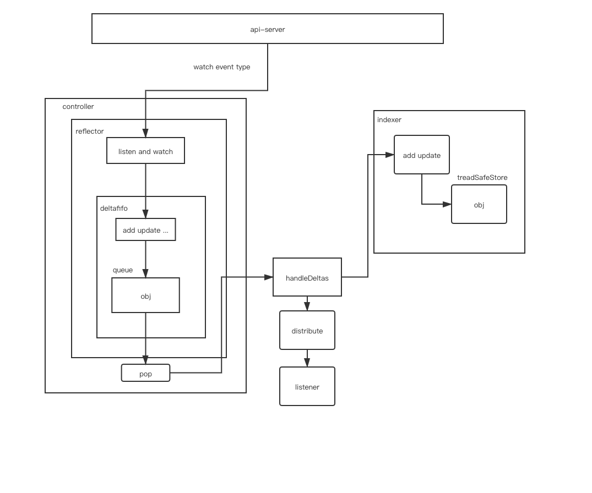
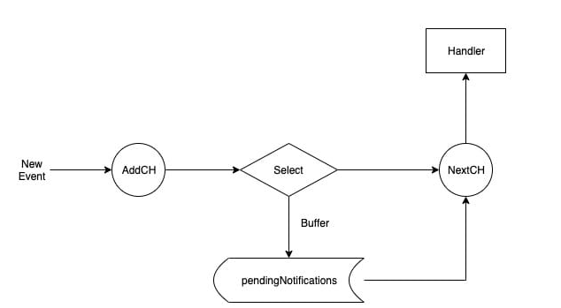

---

title: "Kubernetes client-go informer 架构介绍"
summary: "这篇文章通过对 informer 架构中所用到的组件，分别做了不同的介绍。"
authors: ["屈帅波"]
categories: ["Kubernetes"]
tags: ["client-go", "informer"]
date: 2020-08-30T07:00:00+08:00
---

## 一、简介

在 kubernetes 系统中，组件之间通过 http 协议进行通信，通过 informer 来做到了消息的实时性、可靠性、顺序性，通过 informer 机制与 api-server 进行通信。
## 二、架构设计


### 1.Reflector

#### (1) 简介

informer 可以对 kubernetes api server 的资源执行监控（watch）操作，类型可以是 kubernetes 内置资源也可以是 crd 自定义资源，其中最核心的功能是 Reflector，Reflector 用于监控指定资源的 kubernetes 资源，当资源发生变化的时候，例如发生了 Added 资源添加等事件 会将其资源对象存放在本地缓存 DeltaFIFO 中。

#### (2) 核心介绍（listandwatch）

第一部分首先获取资源列表数据。
第二部分通过 watchhandler 来监控资源对象。

```go
// path: staging/src/k8s.io/client-go/tools/cache/reflector.go
// ListAndWatch 首先列出所有项目，并在调用时获取资源版本，然后使用资源版本进行观看。
//如果 ListAndWatch 甚至没有尝试初始化 watch，它将返回错误。
func (r *Reflector) ListAndWatch(stopCh <-chan struct{}) error {
	klog.V(3).Infof("Listing and watching %v from %s", r.expectedType, r.name)
	var resourceVersion string

	//从所要同步数据的资源对象的第 0 个版本开始
	options := metav1.ListOptions{ResourceVersion: "0"}

	if err := func() error {
		initTrace := trace.New("Reflector ListAndWatch", trace.Field{"name", r.name})
		defer initTrace.LogIfLong(10 * time.Second)
		var list runtime.Object
		var err error
		listCh := make(chan struct{}, 1)
		panicCh := make(chan interface{}, 1)
		go func() {
			defer func() {
				if r := recover(); r != nil {
					panicCh <- r
				}
			}()

			//如果 listerWatcher 支持，则尝试以块的形式收集列表；如果不支持，则尝试第一个
			//列表请求将返回完整的响应。
			pager := pager.New(pager.SimplePageFunc(func(opts metav1.ListOptions) (runtime.Object, error) {
				return r.listerWatcher.List(opts)
			}))
			if r.WatchListPageSize != 0 {
				pager.PageSize = r.WatchListPageSize
			}

			//返回完整列表
			list, err = pager.List(context.Background(), options)
			close(listCh)
		}()
		select {
		case <-stopCh:
			return nil
		case r := <-panicCh:
			panic(r)
		case <-listCh:
		}
		if err != nil {
			return fmt.Errorf("%s: Failed to list %v: %v", r.name, r.expectedType, err)
		}
		initTrace.Step("Objects listed")
		//通过 list 转换我们得到 listMetaInterface
		listMetaInterface, err := meta.ListAccessor(list)
		if err != nil {
			return fmt.Errorf("%s: Unable to understand list result %#v: %v", r.name, list, err)
		}
		//listMetaInterface 可以获取 groupversion 然后从而转换为 kind
		resourceVersion = listMetaInterface.GetResourceVersion()
		initTrace.Step("Resource version extracted")
		//得到 []runtime.Object
		items, err := meta.ExtractList(list)
		if err != nil {
			return fmt.Errorf("%s: Unable to understand list result %#v (%v)", r.name, list, err)
		}
		initTrace.Step("Objects extracted")
		//然后存入缓存
		/*
		func (r *Reflector) syncWith(items []runtime.Object, resourceVersion string) error {
			found := make([]interface{}, 0, len(items))
			for _, item := range items {
				found = append(found, item)
			}
		//调用 store 的 replace 来替换
			return r.store.Replace(found, resourceVersion)
		}
		 */
		if err := r.syncWith(items, resourceVersion); err != nil {
			return fmt.Errorf("%s: Unable to sync list result: %v", r.name, err)
		}
		initTrace.Step("SyncWith done")
		r.setLastSyncResourceVersion(resourceVersion)
		initTrace.Step("Resource version updated")
		return nil
	}(); err != nil {
		return err
	}
		...
		//调用 api 的接口 watch
		w, err := r.listerWatcher.Watch(options)
		if err != nil {
			switch err {
			case io.EOF:
				// watch closed normally
			case io.ErrUnexpectedEOF:
				klog.V(1).Infof("%s: Watch for %v closed with unexpected EOF: %v", r.name, r.expectedType, err)
			default:
				utilruntime.HandleError(fmt.Errorf("%s: Failed to watch %v: %v", r.name, r.expectedType, err))
			}
			//如果出现“连接被拒绝”错误，则意味着最有可能的 apiserver 没有响应。重新列出所有对象没有任何意义，因为很可能我们将能够在结束的地方重新开始监视。如果是这种情况，请等待并重新发送监视请求。
			if utilnet.IsConnectionRefused(err) {
				time.Sleep(time.Second)
				continue
			}
			return nil
		}
		
		if err := r.watchHandler(start, w, &resourceVersion, resyncerrc, stopCh); err != nil {
			if err != errorStopRequested {
				switch {
				case apierrs.IsResourceExpired(err):
					klog.V(4).Infof("%s: watch of %v ended with: %v", r.name, r.expectedType, err)
				default:
					klog.Warningf("%s: watch of %v ended with: %v", r.name, r.expectedType, err)
				}
			}
			return nil
		}
	}
}
```

#### (3) 流程介绍


通过给 NewRefector 传入一个 listerwatcher 数据接口对象来实例化一个 Reflector 对象。
Reflector 具备 list 和 watch 方法 最重要的是 ListAndWatch。
list 主要是用来获取资源列表数据。
watch 主要是用来监控资源对象，发生 event 的时候插入本地缓存 DeltaFIFO 中并更新 ResourceVersion。

### 2.DeltaFIFO

#### (1) 简介

DeltaFIFO 可以拆分开来理解 FIFO 是一个先进先出的队列。Delta 是一个资源对象存储，它可以保存资源对象的操作类型。

```go
// path: staging/src/k8s.io/client-go/tools/cache/delta_fifo.go
type DeltaFIFO struct {
...
	items map[string]Deltas
	queue []string
...
}
```
#### (2) 生产者

在生产者方法中 queueActionLocked 内部通过 keyof 拿到对应 obj 的一个 id，items 是一个 map[string]Deltas 的一个 map 那么就以这个 id 为 map 的 key，value([]Delta) 的话 初始化一个[]Delta 切片并且以 f.items[id]为初始切片 再添加一个 Delta{actionType, obj}，然后使用 dedupDeltas 对 newDeltas 做去重操作。我们会对 f.items[id] ，items 这个 map 中是否存在这个 key(id)，如果不存在就在队列中添加一个 id，添加完之后将 newDeltas 赋值给 items[id]，并且调用 cond.Broadcast() 通知所有消费者并且解除阻塞。

```go
// path: staging/src/k8s.io/client-go/tools/cache/delta_fifo.go
//这里 queue 负责存放的是 id（这里主要是负责先进先出）
//items 存放的是对应 id 的 同一个 obj 的多种操作如图所示 objkey1 中对应 obj1 的先 added 然后 updated 
func (f *DeltaFIFO) queueActionLocked(actionType DeltaType, obj interface{}) error {
	...
		if _, exists := f.items[id]; !exists {
			f.queue = append(f.queue, id)
		}
		f.items[id] = newDeltas
		f.cond.Broadcast()
	...
}
```
 

#### (3) 消费者
这里 cond.Wait() 如果队列中没有数据那么就等待，当队列中有了数据之后从 queue 里面拿出来第 0 个 id，并且从队列（queue）中删除第 0 个元素，然后从 items 中做 key 的有效判断，如果不存在则跳过，存在的话那么我们就需要从 map 中把这个 key 给删除掉。这里主要是为了防止比如 items 中 obj1 有 added 有 updated 忽然从生产者加了一个 deleted，这里删除之后即使加 deleted 也是新的 key 会重新从队列中等待，这是对应 objkey1 的[]delta 中只有一个 Deleted 的操作，然后调用传入的回调函数 process 做操作。

```go
// path: staging/src/k8s.io/client-go/tools/cache/delta_fifo.go
func (f *DeltaFIFO) Pop(process PopProcessFunc) (interface{}, error) {
	f.lock.Lock()
	defer f.lock.Unlock()
	for {
        //如果队列长度为 0 且队列不是关闭 那么就等待
		for len(f.queue) == 0 {
			if f.IsClosed() {
				return nil, ErrFIFOClosed
			}
			f.cond.Wait()
		}
		id := f.queue[0]
		f.queue = f.queue[1:]
		if f.initialPopulationCount > 0 {
			f.initialPopulationCount--
		}
        //取出队列头部第一个元素
		item, ok := f.items[id]
		if !ok {
			continue
		}
		delete(f.items, id)
		err := process(item)
		if e, ok := err.(ErrRequeue); ok {
			f.addIfNotPresent(id, item)
			err = e.Err
		}
		return item, err
	}
}
```

#### (4) 回调函数 process
handleDeltas 函数作为 proess 回调函数，当资源对象的操作类型为 Added、Updated、Deleted 时，将该资源对象存储值 indexer（并发安全的存储），并通过 distribute 函数将资源对象分发至 Sharedinformer，distribute 函数将资源对象分发到该事件的处理函数中。
```go
// path: staging/src/k8s.io/client-go/tools/cache/shared_informer.go
func (s *sharedIndexInformer) HandleDeltas(obj interface{}) error {
	s.blockDeltas.Lock()
	defer s.blockDeltas.Unlock()
	//这里循环的目的是因为我们传入的 obj 是一个 Deltas 也就是一个 []Deltas 那么就是一个 obj 的多个操作 
	for _, d := range obj.(Deltas) {
		switch d.Type {
		case Sync, Added, Updated:
			isSync := d.Type == Sync
			s.cacheMutationDetector.AddObject(d.Object)
			if old, exists, err := s.indexer.Get(d.Object); err == nil && exists {
				if err := s.indexer.Update(d.Object); err != nil {
					return err
				}
				s.processor.distribute(updateNotification{oldObj: old, newObj: d.Object}, isSync)
			} else {
				if err := s.indexer.Add(d.Object); err != nil {
					return err
				}
				s.processor.distribute(addNotification{newObj: d.Object}, isSync)

			}
		case Deleted:
			if err := s.indexer.Delete(d.Object); err != nil {
				return err
			}
			s.processor.distribute(deleteNotification{oldObj: d.Object}, false)
		}
	}
	return nil
}
```

#### (5)distribute 函数处理

这段代码表示了通过区分是否是 sync 操作  通过遍历 listener，并且调用 add 方法把 obj 写入了一个 addch 的管道中。
```go
// path: staging/src/k8s.io/client-go/tools/cache/shared_informer.go
func (p *sharedProcessor) distribute(obj interface{}, sync bool) {
	p.listenersLock.RLock()
	defer p.listenersLock.RUnlock()

	if sync {
		for _, listener := range p.syncingListeners {
			listener.add(obj)
		}
	} else {
		for _, listener := range p.listeners {
			listener.add(obj)
		}
	}
}
type sharedProcessor struct {
	listenersStarted bool
	listenersLock    sync.RWMutex
	listeners        []*processorListener
	syncingListeners []*processorListener
	clock            clock.Clock
	wg               wait.Group
}
func (p *processorListener) add(notification interface{}) {
	p.addCh <- notification
}
```
processor 是 sharedIndexInformer 中一个非常有趣的组件，Controller Manager 通过一个 Informer 单例工厂来保证不同的 Controller 共享了同一个 Informer，但是不同的 Controller 对该共享的 Informer 注册的 Handler 不同 sharedProcessor 的工作核心是围绕着 listeners 这个 Listener 切片展开的。

#### (6)addch

```go
// path: staging/src/k8s.io/client-go/tools/cache/shared_informer.go
type processorListener struct {
	nextCh chan interface{}
	addCh  chan interface{}
}
```
将事件源源不断地 从 addCh 到 nextCh，因为无法预知生产者的生产速度，所以这里 pendingNotifications 承担了一个 buffer 的角色，通过 pendingNotifications 来控制生产者与消费者之间的平衡。


```go
// path: staging/src/k8s.io/client-go/tools/cache/shared_informer.go
func (p *processorListener) pop() {
	defer utilruntime.HandleCrash()
	defer close(p.nextCh) // Tell .run() to stop

	var nextCh chan<- interface{}
	var notification interface{}
	for {
		select {
		case nextCh <- notification:
			// Notification dispatched
			var ok bool
			notification, ok = p.pendingNotifications.ReadOne()
			if !ok { // Nothing to pop
				nextCh = nil // Disable this select case
			}
		case notificationToAdd, ok := <-p.addCh:
			if !ok {
				return
			}
			if notification == nil { // No notification to pop (and pendingNotifications is empty)
				// Optimize the case - skip adding to pendingNotifications
				notification = notificationToAdd
				nextCh = p.nextCh
			} else { // There is already a notification waiting to be dispatched
				p.pendingNotifications.WriteOne(notificationToAdd)
			}
		}
	}
}
```

因为 listener 包含了 Controller 注册进来的 Handler 方法，因此 listener 最重要的职能就是当事件发生时来触发这些方法，而 listener.run 就是不停的从 nextCh 这个 channel 中拿到事件并执行对应的 handler 可以看到，listener.run 不停的从 nextCh 这个 channel 中拿到事件。

```go
// path: staging/src/k8s.io/client-go/tools/cache/shared_informer.go
func (p *processorListener) run() {
	stopCh := make(chan struct{})
	wait.Until(func() {
		err := wait.ExponentialBackoff(retry.DefaultRetry, func() (bool, error) {
			for next := range p.nextCh {
				switch notification := next.(type) {
				case updateNotification:
					p.handler.OnUpdate(notification.oldObj, notification.newObj)
				case addNotification:
					p.handler.OnAdd(notification.newObj)
				case deleteNotification:
					p.handler.OnDelete(notification.oldObj)
				default:
					utilruntime.HandleError(fmt.Errorf("unrecognized notification: %T", next))
				}
			}
			// the only way to get here is if the p.nextCh is empty and closed
			return true, nil
		})

		// the only way to get here is if the p.nextCh is empty and closed
		if err == nil {
			close(stopCh)
		}
	}, 1*time.Minute, stopCh)
}
```

从图中可以看出当有一个新的 event 这里新的 event 指的是从 delta 队列中通过 distribute 分发给所有 Listener 通过调用 add 来对 addch 有一个写入的操作，然后通过缓存判定（也就是为了防止 listener.handler 生产速度大于消费速度 这里加了一层缓存层 如果没有缓存直接写入 nextch，有缓存就写入缓存还会对缓存的剩余量做判断），并执行对应的 handler。




#### (7)DeltaFIFO 总结

总体来看，DeltaFIFO 的入队列方法，会先判断该资源是否已经在 items 中，如果已经存在，说明该资源还没有被消费（还在 queue 中排队），则直接将事件 append 到 items[resource_id] 中即可。如果发现不在 items 中，便会创建 items[resource_id]，并将资源 id append 到 queue 中。而 DeltaFIFO 出队列方法，会从 queue 中拿到队列最前面的资源 id，然后从 items 中拿走该资源所有的事件，最后调用 Pop 方法传入的 PopProcessFunc 类型的处理函数。因此，DeltaFIFO 的特点在于，入队列的是（资源的）事件，而出队列时是拿到的是最早入队列的资源的所有事件。这样的设计保证了不会因为有某个资源疯狂的制造事件，导致其他资源没有机会被处理而产生饥饿


### 3.Indexer

#### (1) 简介

indexer 是 client-go 用来存储资源对象并自带索引功能的本地存储，Reflector 从 DeltaFIFO 中将消费出来的资源对象存储至 indexer，indexer 要与 etcd 中的数据保持一致，这样无须每次都走 etcd 交互式拿到数据，能减轻 api-server 的压力。


#### (2) 例子

这里是一个 indexer 的一个测试用例。
```go
//这就是一个 keyfunc 的定义
func testUsersIndexFunc(obj interface{}) ([]string, error) {
	pod := obj.(*v1.Pod)
	//拿到一个 pod obj 并且从 pod 中拿到 注释 key 是 users 的值 
	usersString := pod.Annotations["users"]
	//以，作为分隔符 做一个切片返回
	return strings.Split(usersString, ","), nil
}

func TestMultiIndexKeys(t *testing.T) {
//我们初始化一个 indexer  MetaNamespaceKeyFunc 是一个获取 ns 和资源对象的的 keyfunc 
//indexer 的 key 是 byUser value 是一个 keyfunc(testUsersIndexFunc)
	index := NewIndexer(MetaNamespaceKeyFunc, Indexers{"byUser": testUsersIndexFunc})
	//初始化 3 个 pod obj
	pod1 := &v1.Pod{ObjectMeta: metav1.ObjectMeta{Name: "one", Annotations: map[string]string{"users": "ernie,bert"}}}
	pod2 := &v1.Pod{ObjectMeta: metav1.ObjectMeta{Name: "two", Annotations: map[string]string{"users": "bert,oscar"}}}
	pod3 := &v1.Pod{ObjectMeta: metav1.ObjectMeta{Name: "tre", Annotations: map[string]string{"users": "ernie,elmo"}}}
	//调用 add 插入缓存
	index.Add(pod1)
	index.Add(pod2)
	index.Add(pod3)
	...
	//我们通过 map 中的 indexfunc（这个 func 主要就是从 pod 的注释字段中拿到注释 key 是 users 的值，keyfunc 返回的是一个 []string）那么通过 indexfunc 我们获得了注释 key 是 users 的值 然后通过我们第二个参数判断 users 中存不存在 ernie 这个 string 
	erniePods, err := index.ByIndex("byUser", "ernie")
	if err != nil {
		t.Errorf("unexpected error: %v", err)
	}
	if len(erniePods) != 1 {
		t.Errorf("Expected 1 pods but got %v", len(erniePods))
	}
	//可能有多个 pod 注释中都有 users:ernie,xxx,xxx 类似的只要包含 ernie 通过上面的 byindex 就可以拿出来 然后遍历 打印
	for _, erniePod := range erniePods {
		if erniePod.(*v1.Pod).Name != "one" {
			t.Errorf("Expected only 'one' but got %s", erniePod.(*v1.Pod).Name)
		}
	}
}
```
简单来说就是 indefunc 我们自己定义一些逻辑  实现对一个 obj 做一些取值或者操作，然后通过传入一个 indexfunc 初始化一个 indexer。 
这里的 indexer 是一个 map[string]indexfunc 我的理解就是可以自定义 indexfun 然后添加 map 里面 需要做什么操作就调用那个 key 对应的 func 就比如 index.ByIndex("byUser", "ernie")。
indefunc 是一个对注释 key 是 users 取 value 的操作 那么调用这个 indefunc 并且比较取出来的值中是否有 ernie 这个 string。

#### (3)ByIndex 的核心实现

```go
// path: staging/src/k8s.io/client-go/tools/cache/store.go
//前面说过了 cache 是一个 store 的实现 然后它本身有嵌套了 ThreadSafeStore 接口 
//threadSafeMap 是 ThreadSafeStore 接口的一个实现
//我们可以从 newstroe 看到 就是把 threadSafeMap 赋给了 store 的 ThreadSafeStore 字段
//go 的特性当他这个结构体实现了一个接口的所有方法那么就可以把结构体赋给接口 
func (c *cache) ByIndex(indexName, indexKey string) ([]interface{}, error) {
	return c.cacheStorage.ByIndex(indexName, indexKey)
}
// path: staging/src/k8s.io/client-go/tools/cache/thread_safe_store.go
//接收 2 个参数 indexname 索引器名称   indexkey 需要检索的 key
func (c *threadSafeMap) ByIndex(indexName, indexKey string) ([]interface{}, error) {
    //加锁
	c.lock.RLock()
	defer c.lock.RUnlock()
	//通过 indexname  我们拿到对应的 indexfunc
	indexFunc := c.indexers[indexName]
	if indexFunc == nil {
		return nil, fmt.Errorf("Index with name %s does not exist", indexName)
	}
	//从 indeices 中通过 indexname 我们拿到 index  
	//indices 是一个 map[string]index
	//index 是 map[string]sets.String
	index := c.indices[indexName]
	//sets 本身也是一个 map[string]Empty    
	//empty 是一个 struct{}
	//从 index 中我们取到 sets 
	set := index[indexKey]
	list := make([]interface{}, 0, set.Len())
	//通过遍历 set 我们拿到所有的 key 然后从 items 通过 key 拿出来
	//item 是 map[string]interface{}
	for key := range set {
		list = append(list, c.items[key])
	}
	//把所有符合的结果返回
	return list, nil
}
```
index 中的缓存数据为 set 集合数据结构，set 本质与 slice 相同，但是 set 是一个 map 不存在相同元素，kubernetes 通过 map 结构类型的 key 作为 set 数据结构，实现 set 去重特性

### 4.工作流程

- controller manager 在启动的时候会启动一个 sharedInformerFactory 这是一个 informer 的集合（informers map[reflect.Type]cache.SharedIndexInformer）。
- controller 在 run 的时候会调用 reflector 的 run，reflector 在 run 的时候会 listen and watch，当有 event 的时候插入本地缓存 DeltaFIFO 中并更新 ResouVersion。
- controller manager 会 watch and listen api-server 的 event，当有事件产生的时候，会通过 reflector 插入 deltafifo，
- DeltaFIFO 是一个先进先出的队列，通过生产者（add 等等）消费者（pop）之后通过 sharedProcessor.distribute 分发给所有 listener 然后通过不同 controller 注册的 handler 来做逻辑处理。
- 最后 indexer 去做操作调用 treadsafestore 也就是底层存储的操作逻辑。

## 三、informer

### 1.资源 informer
每一个 kubernetes 资源都实现了 informer 机制，每一个 informer 上都会事先 informer 的 lister 方法 例如 pod informer。

```go
//path: staging/src/k8s.io/client-go/informers/core/v1/pod.go 
type PodInformer interface {
	Informer() cache.SharedIndexInformer
	Lister() v1.PodLister
}
```

### 2.shared informer

#### （1）简介

informer 也被称为 shared informer，他是可以共享使用的，如果每一个 informer 使用一个 reflector 那么会运行相当多的 listandwatch 会增加 api 的复杂。shared informer 可以使同一类资源 informer 共享一个 reflector 可以节约资源。

```go
//path: staging/src/k8s.io/client-go/informers/factory.go 
type sharedInformerFactory struct {
	client           kubernetes.Interface
	namespace        string
	tweakListOptions internalinterfaces.TweakListOptionsFunc
	lock             sync.Mutex
	defaultResync    time.Duration
	customResync     map[reflect.Type]time.Duration
	//通过 map 来存储  资源类型与 SharedIndexInformer 的对应关系 
	informers map[reflect.Type]cache.SharedIndexInformer
	// startedInformers is used for tracking which informers have been started.
	// This allows Start() to be called multiple times safely.
	startedInformers map[reflect.Type]bool
}
//通过 informer 方法添加不同资源的 informer 如果已存在则返回当前的 informer 不再继续添加
func (f *sharedInformerFactory) InformerFor(obj runtime.Object, newFunc internalinterfaces.NewInformerFunc) cache.SharedIndexInformer {
	f.lock.Lock()
	defer f.lock.Unlock()
	//拿到 obj 的 type 
	informerType := reflect.TypeOf(obj)
	//通过 obj type 获取 informer 如果存在直接返回
	informer, exists := f.informers[informerType]
	if exists {
		return informer
	}
	
	resyncPeriod, exists := f.customResync[informerType]
	if !exists {
		resyncPeriod = f.defaultResync
	}

	informer = newFunc(f.client, resyncPeriod)
	//在 map 中添加一个新的 type 跟 informer 的映射关系
	f.informers[informerType] = informer

	return informer
}
```

#### （2）启动 informer
调用 informer 的 start 方法让 所有 informers 中的 informer 通过 goroutine 持久运行。

```go
//path: staging/src/k8s.io/client-go/informers/factory.go 
func (f *sharedInformerFactory) Start(stopCh <-chan struct{}) {
	f.lock.Lock()
	defer f.lock.Unlock()
	for informerType, informer := range f.informers {
		//遍历 informers 如果他的状态时 true 那么它属于启动状态 如果不是那么 run 起来并且修改他的状态
		if !f.startedInformers[informerType] {
			go informer.Run(stopCh)
			f.startedInformers[informerType] = true
		}
	}
}
```

```go
//path: staging/src/k8s.io/client-go/tools/cache/shared_informer.go
//这里的 run 调用了 shared informer 的 run 方法
func (s *sharedIndexInformer) Run(stopCh <-chan struct{}) {
    defer utilruntime.HandleCrash()
    //创建 fifo 队列
    fifo := NewDeltaFIFO(MetaNamespaceKeyFunc, s.indexer)
    //初始化 config
    cfg := &Config{
         Queue:            fifo,
         ListerWatcher:    s.listerWatcher,
         ObjectType:       s.objectType,
         FullResyncPeriod: s.resyncCheckPeriod,
         RetryOnError:     false,
         ShouldResync:     s.processor.shouldResync,
 
         Process: s.HandleDeltas,
    }
 	...
    //调用 controller.run
    s.controller.Run(stopCh)
}
```

```go
//path: staging/src/k8s.io/client-go/tools/cache/controller.go
func (c *controller) Run(stopCh <-chan struct{}) {
	defer utilruntime.HandleCrash()
	go func() {
		<-stopCh
		c.config.Queue.Close()
	}()
	//初始化一个 reflector
	r := NewReflector(
		c.config.ListerWatcher,
		c.config.ObjectType,
		c.config.Queue,
		c.config.FullResyncPeriod,
	)
	r.ShouldResync = c.config.ShouldResync
	r.clock = c.clock

	c.reflectorMutex.Lock()
	c.reflector = r
	c.reflectorMutex.Unlock()

	var wg wait.Group
	defer wg.Wait()
	//controller 最后也是调用的 reflector 的 run
	wg.StartWithChannel(stopCh, r.Run)

	wait.Until(c.processLoop, time.Second, stopCh)
}
```

```go
//path: staging/src/k8s.io/client-go/tools/cache/reflector.go
//controller run 的时候会把 reflector run 起来，调用 reflector 的 listandwatch
func (r *Reflector) Run(stopCh <-chan struct{}) {
	klog.V(3).Infof("Starting reflector %v (%s) from %s", r.expectedType, r.resyncPeriod, r.name)
	wait.Until(func() {
		if err := r.ListAndWatch(stopCh); err != nil {
			utilruntime.HandleError(err)
		}
	}, r.period, stopCh)
}
```


## 四、通过一个例子来理解 informer 机制

```go
package main

import (
	"fmt"
	v1 "k8s.io/apimachinery/pkg/apis/meta/v1"
	"k8s.io/client-go/informers"
	"k8s.io/client-go/kubernetes"
	"k8s.io/client-go/tools/clientcmd"
	"time"
	"k8s.io/client-go/tools/cache"
)

func main() {
	config ,err := clientcmd.BuildConfigFromFlags("","config")
	if err != nil {
		panic(err)
	}
	//通过 config 拿到 client set 客户端
	clientset ,err := kubernetes.NewForConfig(config)
	if err != nil {
		panic(err)
	}
	stopch := make(chan struct{})
	defer close(stopch)
	//通过 client set 客户端以及一个 rsync（多久设置一次重新同步 也就是同步间隔时间 如果是 0 那么禁用同步功能）我们拿到一个 informer 的集合
	sharedinformers := informers.NewSharedInformerFactory(clientset,time.Minute)
	//通过 sharedinfomers 我们获取到 pod 的 informer
	podinfomer := sharedinformers.Core().V1().Pods().Informer()
	//为 pod informer 添加 controller 的 handlerfunc  触发回调函数之后 会通过 addch 传给 nextCh 管道然后调用 controller 的对应的 handler 来做处理
	podinfomer.AddEventHandler(cache.ResourceEventHandlerFuncs{
	//pod 资源对象创建的时候出发的回调方法
		AddFunc: func(obj interface{}) {
			obja := obj.(v1.Object)
			fmt.Println(obja)
		},
		//更新回调
		UpdateFunc: func(oldObj, newObj interface{}) {
			...
		},
		//删除回调
		DeleteFunc: func(obj interface{}) {
			...
		},
	
	})
	//这里会调用 reflector 的 run listandwatch 然后以 goroutine 的方式运行
	podinfomer.Run(stopch)

}
```
## 五、总结

通过对 informer 的架构的学习，我们引出了 reflector、deltafifo、indexer 几个核心的知识点，可以让我们更加深入的了解 informer 的工作流程，以此来熟悉 controller，并且对于我们自己开发 controller 也非常有帮助。

#### 参考资料

- https://blog.ihypo.net/15763910382218.html
- http://www.broadview.com.cn/book/6104

