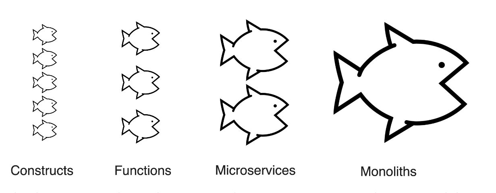
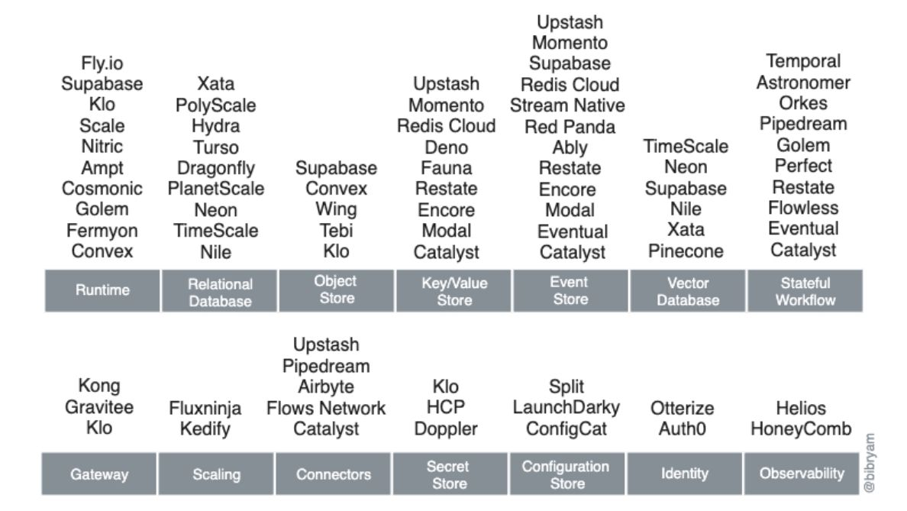
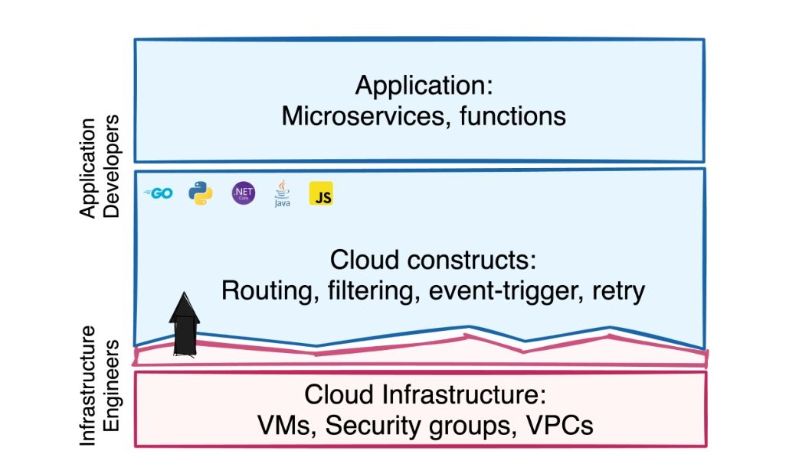

本文译自：[Cloud-Computing in the Post-Serverless Era: Current Trends and beyond](https://www.infoq.com/articles/cloud-computing-post-serverless-trends/)

摘要：这篇文章主要讨论了未来云计算领域的三大趋势：从基本元素到云构件作为服务的转变、从超大规模到超专业化的转变、以及从基础设施到组合式编程作为服务的转变。作者指出，未来的云服务将更加集成编程构件，使得开发人员能够无缝地使用他们喜欢的编程语言来组合应用程序。文章强调了这些趋势对开发人员和运营团队的影响，并指出了这些变化将如何塑造未来以开发人员为中心的云服务。

## 主要观点

- 无服务器计算正在超越其最初的范围，函数部分或完全被多才多艺的云构建取代，标志着云架构的新时代。
- 云市场正朝着高度专业化的垂直多云服务转变，提供独特的、精细粒度的功能，专门满足开发人员的需求。
- 即将推出的云服务将充满构建，改变开发人员处理路由、过滤和事件触发等任务的方式，使其更高效和用户友好。
- 从基础设施即代码转向构建即代码的趋势显著，开发人员使用熟悉的编程语言进行更直观的云服务配置。
- 微服务正在云景观中重新定义，从仅仅是架构边界演变为组织边界，在统一的开发者语言下整合各种云构建。

AWS Lambda 将在今年迎来其 10 周年之际，无服务器计算不再仅限于“函数即服务”（FaaS）。今天，无服务器描述了不需要手动配置、提供按需自动扩展和使用基于消耗的定价的云服务。这一转变是云计算中更广泛演变的一部分，无服务器技术不断变革。本文关注无服务器之后的未来，探讨云景观将如何发展超越当前的超级扩展模型以及对开发人员和运营团队的影响。我将探讨塑造这一演变的前三大趋势。

## 从基本构件到构建即服务

在软件开发中，“模块”或“组件”通常指的是执行一组协同操作的自包含软件单元。这个概念与通常在长时间运行的计算服务（如虚拟机（VM）或容器服务）上运行的微服务架构相对应。AWS EC2 是第一个广泛可访问的云计算服务之一，提供可扩展的 VM。引入这样的可扩展、可访问的云资源为微服务架构变得实用和普及提供了基础。这种转变导致将庞大的应用程序分解成可独立部署的微服务单元。

让我们继续使用软件单元的这个类比。函数是一个代码块，封装了一系列具有定义的输入和输出的单一任务的语句序列。这个代码单元与 FaaS 执行模型非常匹配。在事件触发无需管理基础架构的情况下执行代码的 FaaS 概念在 AWS Lambda 之前已经存在，但缺乏广泛的实施和认可。

在 AWS Lambda 将 FaaS 带入主流之前，已经有了执行代码以响应事件而无需管理基础架构的 FaaS 概念，如 Google App Engine、Azure WebJobs、IronWorker 和 AWS Elastic Beanstalk 等服务。Lambda 作为 FaaS 的首个重大商业实施，通过简化开发人员的部署流程，成为其流行的催化剂。这一进步导致将微服务转变为更小的、可单独扩展的、事件驱动的操作。

在向作为服务提供的更小软件单元的演进中，人们可能会想知道我们是否会看到基本的编程元素，如表达式或语句作为服务（例如 int x = a + b;）。然而，演进的方向与此不同。相反，我们正在见证函数的最小化和最终由可配置的云构建替代。在软件开发中，构建涵盖了诸如条件语句（if-else、switch 语句）、循环（for、while）、异常处理（try-catch-finally）或用户定义的数据结构等元素，这些元素在控制程序流程或管理复杂数据类型方面发挥着重要作用。在云服务中，构建与能够组成分布式应用程序的能力相一致，它们互相链接软件模块，如微服务和函数，并管理它们之间的数据流。

**云构建取代函数，取代微服务，取代庞大的应用程序**

虽然以前可能使用函数来过滤、路由、批量处理、拆分事件，或调用另一个云服务或函数，但现在这些操作以及更多操作都可以在你的函数中使用更少的代码，或者在许多情况下根本不需要函数代码。它们可以被可配置的云构建替代，这些构建是云服务的一部分。让我们看一些 AWS 的具体示例，以演示从 Lambda 函数代码到云构建的过渡：

- **请求路由** - 不再使用 Lambda 来解析请求并将其路由到正确的后端端点，而是可以使用[API Gateway 路由](https://docs.aws.amazon.com/apigateway/latest/developerguide/http-api-develop-routes.html)进行路由。而且，API Gateway 还可以与其他 AWS 服务集成，直接调用它们，消除了对函数的需求。
- **请求验证** - API Gateway 可以使用 OpenAPI 验证请求的主体、查询字符串参数和标头。
- **数据转换** - API Gateway 可以使用 Apache Velocity 模板来[转换](https://docs.aws.amazon.com/apigateway/latest/developerguide/models-mappings.html)请求和响应数据，以覆盖有效载荷、参数、标头和状态代码，而无需使用 Lambda。
- **流式数据库更改** - [DynamoDB Streams](https://aws.amazon.com/blogs/database/dynamodb-streams-use-cases-and-design-patterns/)会发出所有数据更改。这对于任何数据存储来说都是一个必要的构建，消除了应用程序代码的双重写入和任何数据轮询代码，通过[将微服务内外颠倒](https://www.infoq.com/articles/microservices-inside-out/)。
- **事件触发** - [AWS 事件源映射](https://docs.aws.amazon.com/lambda/latest/dg/invocation-eventsourcemapping.html)允许通过从事件源读取并调用 Lambda 函数来触发 Lambda。
- **事件过滤** - [事件源映射](https://docs.aws.amazon.com/lambda/latest/dg/invocation-eventfiltering.html)可以执行事件过滤，以控制从流或队列中调用 Lambda 函数的哪些记录。这消除了在函数内编写过滤逻辑的需要，并大大减小了函数的大小和成本。
- **事件批处理** - 类似地，事件源映射会将记录批处理成单个有效载荷，然后发送给你的函数。不需要手动循环聚合事件或在处理之前拆分它们。
- **事件转换** - [EventBridge Pipes](https://docs.aws.amazon.com/eventbridge/latest/userguide/eb-pipes-input-transformation.html)可以在将数据发送到目标之前使用 JSON 路径语法来转换源数据。
- **事件丰富化** - EventBridge Pipes 还可以调用另一个端点来丰富请求，然后进一步处理它。这提供了可以完全声明性使用的[内容丰富器模式](https://www.enterpriseintegrationpatterns.com/patterns/messaging/DataEnricher.html)的实现。
- **事件路由** - 与请求路由类似，EventBridge [规则](https://docs.aws.amazon.com/eventbridge/latest/userguide/eb-rules.html)可以执行事件路由，允许你从应用程序代码中卸载此责任，并消除 Lambda 函数。
- **基于结果的路由** - Lambda [Destination](https://aws.amazon.com/blogs/compute/introducing-aws-lambda-destinations/)允许异步调用将执行结果路由到其他 AWS 服务，以配置代码替换 Lambda 调用代码。
- **调用其他服务** - [StepFunction](https://docs.aws.amazon.com/step-functions/latest/dg/connect-to-services.html) 任务不需要 Lambda 函数来调用其他服务或外部 HTTP 端点。通过这种方式，StepFunction 任务定义可以执行例如[执行 HTTP 调用](https://aws.amazon.com/blogs/aws/external-endpoints-and-testing-of-task-states-now-available-in-aws-step-functions/)或读取、更新和删除数据库记录等操作，而无需 Lambda 函数。

这只是应用程序代码构建变成无服务器云构建的一些示例。你可以通过配置验证输入值，而不是在函数中使用 if-else 逻辑。你可以在函数之外声明性地定义路由逻辑，而不是使用 case 或 switch 语句从函数内调用其他代码。事件可以在数据更改时触发，批处理或拆分，无需重复构造，例如 for 或 while 循环。

事件可以在没有函数的情况下进行验证、转换、批处理、路由、过滤和丰富。故障可以在没有 try-catch 代码的情况下进行处理和定向到 [DLQs 和回退](https://aws.amazon.com/about-aws/whats-new/2023/06/amazon-sqs-dead-letter-queue-redrive-aws-sdk-cli/)，而成功完成可以定向到其他函数和服务端点。将这些构建从应用程序代码移到构建配置中减少了应用程序代码的大小，或者将其移除，消除了安全修补和任何维护的需要。

在编程中，原语和构建具有不同的含义和作用。原语是编程语言固有的基本数据类型。它包含了基本值，例如整数、浮点数、布尔值或字符，不包含其他类型。与此概念类似，云 - 就像一个巨大的编程运行时 - 正在从基础设施原语（如网络负载均衡器、虚拟机、文件存储和数据库）进化为更精致和可配置的云构建。

与编程构建类似，这些云构建编排分布式应用程序交互并管理复杂的数据流。然而，这些构建不是孤立的云服务；没有独立的“过滤器服务”或“事件发射器服务”。没有“构建作为服务”，但它们越来越成为核心云原语（如网关、数据存储、消息代理和函数运行时）的重要功能。

这种演进降低了应用程序代码的复杂性，并在许多情况下消除了自定义函数的需求。这从 FaaS 到 NoFaaS（无麻烦，意味着简单）的转变刚刚开始，有深入的[演讲](https://www.youtube.com/watch?v=sdCA0Y7QDrM)和 GitHub 上的代码示例。接下来，我将探讨垂直多云服务中构建丰富的云服务的出现。

## 从超大规模到超专业化

在[无服务器后云时代](https://www.diagrid.io/blog/evolution-of-cloud-computing)，仅提供高度可扩展的云原语（如容器和函数的计算，或诸如键/值存储、事件存储、关系数据库或网络原语等存储服务）已经不再足够。无服务器后云服务必须富含开发者构建，并卸载应用程序的大部分基础设施。这超越了为广泛用户群体进行通用云服务的超大规模；它涉及深度专业化，并向更具要求的用户公开高级构建。

像 AWS、Azure、GCP 等超大规模云服务提供商，凭借其广泛的服务范围和庞大的用户群体，很好地把握了新用户需求和构建。然而，提供这些更细粒度的开发者构建会增加复杂性。每个服务中的每个新构建都需要深入学习曲线以了解其有效利用的特定内容。因此，在无服务器后时代，我们将看到垂直多云服务的兴起，这些服务在一个领域表现出色。这代表了云服务的超专业化。

以 Confluent Cloud 为例。虽然所有主要的超大规模云服务提供商（AWS、Azure、GCP 等）都提供 Kafka 服务，但没有一家能够与 Confluent Cloud 提供的开发者体验和构建相匹配。通过其 Kafka 代理、众多的 Kafka 连接器、集成的模式注册表、Flink 处理、数据治理、跟踪和消息浏览器，Confluent Cloud 提供了最丰富和专业化的 Kafka 服务，超越了超大规模云服务提供商的提供。

这种趋势并不孤立；许多例子包括 MongoDB Atlas 与 DocumentDB、GitLab 与 CodeCommit、DataBricks 与 EMR、RedisLabs 与 ElasticCache 等。除了已建立的云公司外，新一波初创公司正在崭露头角，专注于一个多云原语（如专业化的计算、存储、网络、构建流水线、监控等）并通过开发者构建来丰富它，以提供独特的价值主张。以下是一些专门化于单一开源技术的云服务，旨在提供丰富的构建体验，并吸引用户远离超大规模云服务提供商：

- [Vercel](https://vercel.com/)：以其出色的前端开发者体验而闻名，简化了 Web 应用程序的部署。
- [Railway](https://railway.app/)：以增强后端开发者体验以及简单的部署和扩展管理而著名。
- [Supabase](https://supabase.com/)：是 Firebase 的开源替代方案，提供更灵活的相似功能。

- [Fauna](https://fauna.com/)：以声明性关系查询和强一致性事务中的功能业务逻辑而闻名的无服务器数据库。
- [Neon](https://neon.tech/)：提供最简单的无服务器 PostgreSQL，具有数据库分支和最小管理开销等功能。
- [PlanetScale](https://planetscale.com/)：以高级 MySQL 云服务而闻名，侧重于开发友好的功能。
- [PolyScale](https://polyscale.ai/)：专注于通过智能缓存优化数据性能的 AI 驱动缓存。
- [Upstash](https://upstash.com/)：提供全托管的低延迟无服务器 Kafka 解决方案，适用于事件流。
- [Diagrid Catalyst](https://www.diagrid.io/catalyst)：提供用于消息、数据和工作流的无服务器 Dapr API，充当云服务之间的连接纽带。
- [Temporal](https://temporal.io/)：提供持久的执行，为可靠管理复杂工作流程提供平台。

这个列表代表了一个不断增长的生态系统的一部分，这个生态系统是建立在超大规模云服务提供商提供的核心云原语之上的垂直多云服务。它们通过提供一套全面的可编程构建和增强的开发者体验来竞争。

一旦完成了这个过渡，缺乏丰富构建的基本云服务，甚至是无服务器的云服务，都会显得像过时的本地软件。存储服务必须像 DynamoDB 一样流式传输更改；消息代理应包括类似于 EventBridge 的构建，用于事件驱动的路由、过滤和终端点调用，包括重试和 DLQs；发布/订阅系统应提供消息批处理、拆分、过滤、转换和丰富功能。

最终，虽然超大规模云服务提供商通过不断增加的服务数组在水平方向扩展，但超专业化服务提供商在垂直方向增长，提供一个丰富构建的最佳服务，形成一个[生态系统](https://www.infoq.com/articles/cloud-bound-applications/)的垂直多云服务。云服务竞争的未来将从基础设施原语转向核心云原语和面向开发者的构建的组合。

## 从基础设施到组合即代码（CaC）

云构建越来越模糊了应用程序和基础设施职责之间的界限。下一个演进是云自动化的“左移”，将应用程序和自动化代码集成为工具和责任的一部分。让我们看看这个过渡是如何展开的。

云基础设施管理的第一代是由基础设施即代码（IaC）定义的，这是一种旨在简化基础设施的供应和管理的模式。这种方法建立在云计算中虚拟化的商品化趋势的基础上。

最初的 IaC 工具引入了专门用于以可重复的方式创建、配置和管理云资源的领域特定语言（DSL）。像 Chef、Ansible、Puppet 和 Terraform 这样的工具引领了这个阶段。这些工具利用了声明性语言，允许运维团队以代码定义基础设施的期望状态，抽象出底层的复杂性。

然而，随着云计算从低级粗粒度基础设施过渡到更面向开发者的可编程细粒度构建，使用现有通用编程语言来定义这些构建的趋势正在兴起。新的参与者，如 Pulumi 和 AWS Cloud Development Kit（CDK），处于这一浪潮的前沿，支持诸如 TypeScript、Python、C#、Go 和 Java 等语言。

采用通用编程语言的转变是由于需要克服声明性语言的局限性，后者在以编程方式定义云构建方面缺乏表现力和灵活性，并且由于云构建配置的责任从运维转向开发者。与适用于低级静态基础设施的声明性语言的静态性质不同，通用编程语言使开发者能够定义动态、逻辑驱动的云构建，实现与应用程序代码更紧密的对齐。

无服务器后云开发人员需要通过创建函数和微服务来实现业务逻辑，但还需要使用可编程云构建将它们组合在一起。这塑造了更广泛的开发者责任集，用于开发和组合云应用程序。例如，具有 Lambda 函数中的业务逻辑的代码还需要 API Gateway 中的路由、过滤和请求转换配置。

另一个 Lambda 函数可能需要 DynamoDB 流配置来流式传输特定数据更改，EventBridge 路由、过滤和丰富配置。

第三个应用程序可能将其大部分编排逻辑表达为 StepFunction，其中 Lambda 代码只是一个小任务。开发者，而不是平台工程师或运维成员，可以将这些代码单元组合在一起。工具，如 Pulumi、AWS CDK 和其他工具，允许开发者使用他们选择的语言来实现函数，并使用相同的语言来组合它与云环境的交互，最适合这个时代。

平台团队仍然可以使用声明性语言，比如 Terraform，来管理、保护、监视和启用云环境中的团队，但以开发者为重点的构建，结合以开发者为重点的云自动化语言，将云构建向左移动，并使开发者能够自助使用云服务成为现实。

从 DSL 到通用编程语言的过渡标志着 IaC 演进的重要里程碑。它承认了应用程序代码向云构建的过渡，这些构建通常需要开发者更深入地控制资源以满足应用程序需求。这个转变代表了 IaC 工具的成熟，现在需要满足更广泛的基础设施编排需求，为更复杂、更高级的抽象和工具铺平了道路。

基础设施管理的过程将从静态配置转向更加动态、基于代码的方法。这一演进不仅仅止步于基础设施即代码，它正在超越到一个更加微妙的领域，被称为组合即代码。这一范式进一步模糊了应用程序代码和基础设施之间的界限，导致更加流畅、高效和开发者友好的实践。

## 总结

总结趋势及其加强效应，我们观察到编程构建逐渐整合到云服务中。每个计算服务都将集成 CI/CD 流水线；数据库将提供来自边缘的 HTTP 访问并发出更改事件；消息代理将通过过滤、路由、幂等性、转换、DLQ 等功能增强能力。

基础设施服务正在演变为无服务器 API、从代码中推断的基础设施 ([IfC](https://klo.dev/state-of-infrastructure-from-code-2023/))、[框架定义的基础设施](https://vercel.com/blog/framework-defined-infrastructure)，或由开发者明确组合 (CaC)。这一演进导致了更小的函数，有时甚至是 NoFaaS 模式，为超专业化、以开发者为先的垂直多云服务铺平了道路。这些服务将提供[可编程 API 的基础设施](https://thenewstack.io/raising-the-serverless-bar-infrastructure-apis-unleash-more-value-for-enterprises/)，使开发者能够无缝地使用他们喜欢的编程语言合并其应用程序。

使用云服务进行应用程序构建的左移将与应用程序编程越来越融合，将微服务从一种架构风格转变为一种组织风格。一个微服务将不再只是一个单一的部署单元或过程边界，而是由开发者选择的单一语言中实现和粘合的函数、容器和云构建组成。未来正在成为超专业化，并专注于以开发者为先的云。