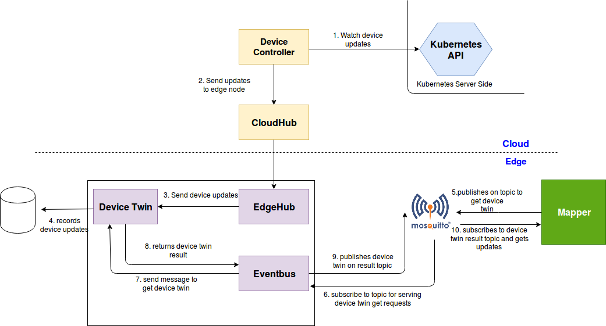

## KubeEdge 介绍

KubeEdge 是一个致力于解决边缘场景问题的开源系统，在 Kubernetes 原生的容器编排和调度能力之上，实现了云边协同、计算下沉、海量边缘设备管理、边缘自治等能力。KubeEdge 架构如下图所示，包括云端和边缘端两部分。                                                                  


​                                                                       

其中：

CloudHub：WebSocket 服务器，负责监控云端的变化、缓存并发送消息到 EdgeHub。

EdgeController：扩展的 Kubernetes 控制器：负责管理边缘节点和 pods 的元数据，因此数据才能被发送到指定的边缘节点。

DeviceController：扩展的 Kubernetes 控制器，负责管理边缘设备，实现边缘设备元数据/状态数据在云端与边缘端的同步。

EdgeHub：WebSocket 客户端，负责与云边服务交互实现边缘计算。其中包括将云边资源同步更新到边缘端以及将边端主机、设备状态变化广播至云端。

Edged：负责 pod 生命周期的管理，可以看成一个简易版的 kubelet。

EventBus：EventBus 是一个 MQTT 客户端负责与 MQTT 服务器 mosquitto 的交互，为其他组件提供发布与订阅功能。

ServiceBus：ServiceBus 是一个 HTTP 客户端与 HTTP 服务器使用 REST 进行交互，为云端组件提供 HTTP 客户端功能，使其请求到达运行在边缘端的 HTTP 服务器。

DeviceTwin：负责存储设备状态，并将设备状态同步到云端，同时也提供了了应用的查询接口。

MetaManager：MetaManager 是 edged 与 edgehub 之间的 message 处理器，同时，也负责将元数据存储/查询到/从一个轻量级数据库 SQLite。

基于 WebSocket + 消息封装，同时优化了原生 Kubernetes 中一些不必要的请求，KubeEdge 实现了边缘场景下的云边可靠通信。本文从边缘设备管理和云边自定义消息传递两个方面，来解析 KubeEdge 的云边协同机制。

## 边缘设备管理

### DeviceModel 和 Device

KubeEdge 通过 Kubernetes 的 CRD，增加了 DeviceModel 和 Device 两个资源，分别来描述设备元信息和设备实例信息，DeviceController 负责边缘设备管理，在云和边之间传递这些信息。用户可以通过 Kubernetes API 从云中创建、更新和删除设备元数据，也可以通过 CRD API 控制设备属性的预期 (desired) 状态，从云端对设备进行 CRUD 操作。

DeviceModel 描述了设备属性，例如“温度”或“压力”,类似一个可重复使用的模板，使用它可以创建和管理许多设备。DeviceModel 示例如下：

```yaml
apiVersion: devices.kubeedge.io/v1alpha2
kind: DeviceModel

metadata:
  name: counter-model
  namespace: default
spec:
 properties:
 - name: status
  description: counter status
  type:
    string:
      accessMode: ReadWrite
      defaultValue: ''
```

示例定义了一个计数器的 DeviceModel，它包含一个 string 类型的属性‘status’。

一个 Device 实例代表一个实际的设备对象。它就像 device model 的实例化，引用了 model 中定义的属性。计数器的 Device 示例如下：

```yaml
apiVersion: devices.kubeedge.io/v1alpha2
kind: Device

metadata:
  name: counter
  labels:
    description: 'counter'
spec:
  deviceModelRef:
    name: counter-model
  nodeSelector:
    nodeSelectorTerms:
    - matchExpressions:
     - key: 'kubernetes.io/hostname'
       operator: In
       values:
       - kube-edge-1
status:
  twins:
    - propertyName: status
     desired:
       metadata:
         type: string
       value: 'OFF'
     reported:
       metadata:
         type: string
       value: '0'
```

yaml 中的 device status 包含两份数据，一个是云端希望设置的状态数据（'desired'），一个是边缘端上报的状态数据（'reported'）。云端的 DeviceController 通过 Kubernetes API 监听 device 设备的创建事件，会自动创建一个新的 configmap，存储该 device 的 status 等属性信息，并保存到 ectd 中。EdgeController 将 configmap 同步到边缘节点，因而边缘节点的应用也能够获取设备的属性信息。‘desired’值将初始化到边缘节点数据库以及边缘设备中，因而即使边缘节点重启，也能自动恢复到之前的状态。当然这个‘desired’值也会随着云端用户对设备的 CRUD 而更改。

### 设备信息云边同步流程

云端更新设备的操作同步到边缘端，流程如下图：



云端的 DeviceController 监听 device 设备的变更事件，并将更新的 twin 数据通过 CloudHub 发送给边缘节点。边缘节点首先将数据存储到本地数据库，再通过 mqttbroker 同步到边缘设备中。

边缘端设备状态信息上报到云端，流程如下图：


边缘端上报的数据首先也要存储到本地数据库，再通过 EdgeHub 发送给云端。


## 云边自定义消息传递

### ruleEndpoint 和 rule

在一些使用场景中，用户需要在云边应用之间传递一些自定义的信息。基于 K8s 的 CRD，KubeEdge 增加了 ruleEndpoint 和 rule 两个资源。ruleEndpoint 定义了信息源端和目的端，rule 定义了路由规则，从而实现云边应用间消息的传递。

ruleEndpoint 有三种类型：rest, eventbus, servicebus。其中：

rest：仅用于表示**云端**的 rest 接口端点。既可以作为源端，发送请求到边缘节点，也可以作为目的端，接收边缘节点发来的信息。

eventbus：仅用于表示**边缘节点**的端点。既可以作为源端，发送数据到云端，也可以作为目的端，接收云端发来的信息。

servicebus: 仅用于表示**边缘节点**的 rest 接口端点。可作为目的端，接收云端发来的信息。 

rule 描述了信息是如何从源端发送到目的端的，目前有三条路径，如下图所示，其中：

rest -> enventbus: 用户在云端通过 rest 接口，发送信息到边缘端的 mqttbroker。

eventbus -> rest: 用户在边缘端通过 mqttbroker 发送信息，最终信息发送到云端的 rest 接口。

rest -> servicebus: 用户在云端通过 rest 接口，发送信息到边缘端的 rest 接口。


​                                                                                  

### 如何传递自定义消息

首先，通过修改 cloudcore 的配置文件 cloudcore.yaml，在路由器模块中加”enable:true”，表示启动路由器模块，然后重启 cloudcore。

下面分别演示 rule 定义的三条消息传递路径的使用方式。

#### 云端通过 rest 接口发送信息到边缘端 mqttbroker

首先需要创建 rest 和 eventbus 类型的 ruleEndpoint。执行命令：

```shell
kubectl create -f ruleEndpoint-rest.yaml
kubectl create -f ruleEndpoint-eventbus.yaml
```

ruleEndpoint-rest.yaml 的内容如下：

```yaml
apiVersion: rules.kubeedge.io/v1 
kind: RuleEndpoint 

metadata: 
  name: my-rest 
  labels: 
    description: cloud-endpoint 
spec: 
  ruleEndpointType: "rest" 
  properties: {}
```

ruleEndpoint-eventbus.yaml 的内容如下：

```yaml
apiVersion: rules.kubeedge.io/v1
kind: RuleEndpoint 

metadata: 
  name: my-eventbus
  labels: 
    description: edge-endpoint
spec: 
  ruleEndpointType: "eventbus" 
  properties: {}
```

然后创建规则，执行命令：

```shell
kubectl create -f rule-rest-eventbus.yaml
```

rule-rest-eventbus.yaml 的内容如下：

```yaml
apiVersion: rules.kubeedge.io/v1 
kind: Rule 

metadata: 
  name: my-rule 
  labels: 
    description: cloud-rest-edge-eventbus 
spec: 
  source: "my-rest" 
  sourceResource: {"path":"/a"} 
  target: "my-eventbus"
  targetResource: {"topic":"test"}
```

在云端调用 rest 接口向边缘端发送信息，rest 接口定义：

方法：POST

URL: http://{rest_endpoint}/{node_name}/{namespace}/{path}, {rest_endpoint} 是 {cloudcore_ip}:9443, {node_name} 是 edgenode 的名字，{namespace} 是规则的命名空间，{ path} 的前缀是 source ruleEndpoint 的 sourceResource。

Body: {user_message}, {user_message} 是用户的消息，

例如：

```shell
curl -X POST -d'{"message": "123"}' http://localhost:9443/kube-edge-1/default/a
```

边缘端应用订阅 mqttbroker 的 topic，执行命令

```shell
mosquitto_sub -t 'test' -d 
```

即可接收云端消息：{“message”：“123”}

#### 边缘端通过 mqttbroker 到云端 rest 接口

创建 rest 和 eventbus 类型 ruleEndpoint，执行命令

```shell
kubectl create -f ruleEndpoint-rest.yaml
kubectl create -f ruleEndpoint-eventbus.yaml
```

ruleEndpoint-rest.yaml 的内容如下：

```yaml
apiVersion: rules.kubeedge.io/v1 
kind: RuleEndpoint 

metadata: 
  name: my-rest 
  labels: 
    description: cloud-endpoint 
spec: 
  ruleEndpointType: "rest" 
  properties: {}
```

ruleEndpoint-eventbus.yaml 的内容如下：

```yaml
apiVersion: rules.kubeedge.io/v1 
kind: RuleEndpoint 

metadata: 
  name: my-eventbus 
  labels: 
    description: edge-endpoint 
spec: 
  ruleEndpointType: "eventbus" 
  properties: {}
```

创建规则，执行命令：

```shell
kubectl create -f rule-eventbus-rest.yaml
```

rule-eventbus-rest.yaml 的内容如下：

```yaml
apiVersion: rules.kubeedge.io/v1 
kind: Rule 

metadata: 
  name: my-rule-eventbus-rest 
  labels: 
    description: edge-eventbus-cloud-rest 
spec: 
  source: "my-eventbus" 
  sourceResource: {"topic": "test","node_name": "k8s-edge-1"} 
  target: "my-rest" 
  targetResource: {"resource":"http://k8s-master:8080/b"}
```

边缘端的应用可发布信息到 topic，消息将传递到云端应用的 rest 接口地址。

使用 mosquitto 发布数据，执行命令：

```shell
mosquitto_pub -t 'default/test' -d -m '{"edgemsg":"msgtocloud"}'
```

云端应用的 rest 接口定义：

方法：POST

URL：目标 ruleEndpoint 的 targetResource。

正文：{user_api_body}

一个简单的用 go 写的 httpserver 如下，实现了该 rest 接口：

```go
package main

import (
    "fmt"
    "io/ioutil"
    "log"
    "net/http"

)

func sayReceived(w http.ResponseWriter, r *http.Request) {
    r.ParseForm()           // 解析参数
    bytes, err := ioutil.ReadAll(r.Body)
    if err != nil {
        log.Fatal(err)
    }
    r.Body.Close()
    fmt.Println(string(bytes));
    fmt.Fprintf(w, "云端收到！")
}

func main() {
    http.HandleFunc("/b", sayReceived)
    err := http.ListenAndServe(":8080", nil)
   if err != nil {
        log.Fatal("ListenAndServe: ", err)
    }
}
```

云端运行 httpserver 应用后，在边缘端发送信息，即可在云端收到。

#### 云端 rest 接口到边缘端 rest 接口

创建 rest 和 servicebus 类型的 ruleEndpoint。执行命令：

```shell
kubectl create -f ruleEndpoint-rest.yaml
kubectl create -f ruleEndpoint-servicebus.yaml
```

ruleEndpoint-rest.yaml 的内容如下：

```yaml
apiVersion: rules.kubeedge.io/v1
kind: RuleEndpoint

metadata:  
  name: my-rest 
  labels:   
    description: cloud-endpoint
spec:  
  ruleEndpointType: "rest" 
  properties: {}
```

ruleEndpoint-servicebus.yaml 的内容如下：

```yaml
apiVersion: rules.kubeedge.io/v1
kind: RuleEndpoint

metadata:  
  name: my-servicebus 
  labels:   
    description: edge-endpoint
spec:  
  ruleEndpointType: "servicebus" 
  properties: {"service_port":"6666"}
```

创建规则。执行命令：

```shell
kubectl create -f rule-rest-servicebus.yaml
```

rule-rest-servicebus.yaml 的内容如下：

```yaml
apiVersion: rules.kubeedge.io/v1
kind: Rule

metadata:  
  name: my-rule-rest-servicebus 
  labels:   
    description: cloud-rest-end-servicebus
spec:  
  source: "my-rest" 
  sourceResource: {"path":"/source"} 
  target: "my-servicebus" 
  targetResource: {"path":"/target"} 
```

可以在云端调用 rest 接口向边缘节点上的 servicebus 发送消息。

方法：POST/GET/DELETE/PUT

URL：`http://{rest_endpoint}/{node_name}/{namespace}/{path}`，`{rest_endpoint}` 是 `{cloudcore_ip}:9443`，`{node_name}` 是 edgenode 的名称，`{namespace}` 是规则的命名空间。`{path}` 是 source `ruleEndpoint` 的 sourceResource。

Body: {user_message}, {user_message} 是用户的消息。

最后，kubeedge 的 servicebus 会调用边缘节点上应用的接口 `targetResource`，用户的应用程序在边缘节点即可获得 API 的请求。

## 总结

 本文从边缘设备管理和云边自定义消息传递两个方面，介绍了 KubeEdge 的云边协同机制，可根据实际场景选择使用。另外就是受篇幅所限，本文并未介绍 KubeEdge 边缘端之间的通信框架 EdgeMesh，这个将在后续文章中介绍。 

## 参考资料


- [KubeEdge 文档 - kubedege.io](https://kubeedge.io/en/docs)
- [KubeEdge Proposals - github.com](https://github.com/kubeedge/kubeedge/tree/master/docs/proposals)
- [Kubeedge 设备添加以及 mapper 管理 - blog.csdn.net](https://blog.csdn.net/qq_33690342/article/details/125226572)
- [KubeEdge 整体介绍 - zhuanlan.zhihu.com](https://zhuanlan.zhihu.com/p/350335104) 

 

 

 