> 在微服务架构中，API网关是一个十分重要的存在。一方面它为外部的流量访问提供了统一的入口，使得可以方便的进行防火墙的策略实施；另一方面，可以在网关处进行流量控制、认证、授权、灰度发布、日志收集、性能分析等各种高级功能，使得业务功能与非业务功能有效解耦，给予了系统架构更大的灵活性。本系列文章尝试分析目前主流的云原生微服务网关，并比较它们各自的优劣。

## 网关选型标准

其实kubernetes本身有一个ingress controller，基于Nginx或HAProxy等7层代理进行流量的转发。不过ingress只能进行简单的反向代理，不支持流控、灰度、认证、授权等网关必备的功能。所以一般意义认为，ingress是一个7层http代理，而非api网关。本系列主要分析Ambassador、Traefik、Kong等具备**微服务**所需能力的网关产品。

## 什么是Ambassador？

这里引用官网的一段描述

> Ambassador是一个基于Envoy proxy构建的，kubernetes原生的开源微服务网关。Ambassador在构建之初就致力于支持多个独立的团队，这些团队需要为最终用户快速发布、监控和更新服务。Ambassador还具有Kubernetes ingress和负载均衡的能力。

注意这里的几个关键词：**Envoy**，**kubernetes原生**，**微服务**。现在市面上网关产品不少，不过Kubernetes原生的产品倒真的不多。传统的网关产品一般是基于rest api或者yaml文件来进行配置（谁让这些老大哥出来的早呢，他们火的时候k8还没出来呢），而Ambassador完全基于k8s标准的annotation或者CRD来进行各类配置，没错，非常的**native**。

## Ambassador架构

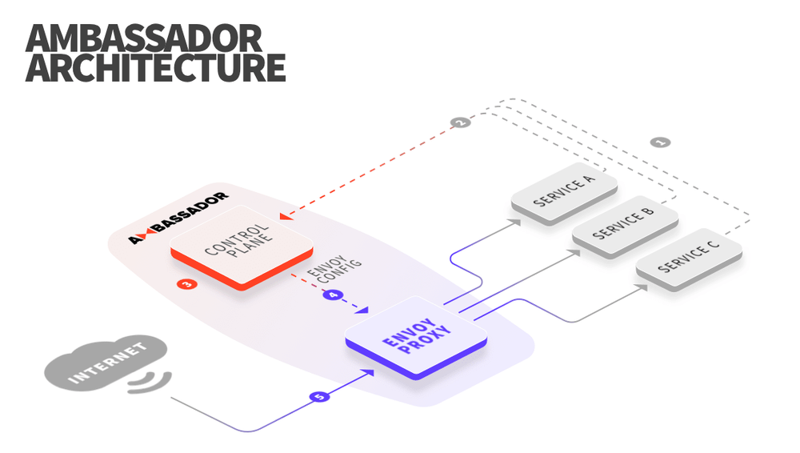

了解istio的同学，看到这张图会有十分熟悉的感觉，没错，Ambassador也是具有控制平面和数据平面的。数据平面自然是老伙计Envoy，Ambassador的控制平面负责监听k8s中的Service资源的变化，并将配置下发Envoy，实际的流量转发通过Envoy来完成。（感觉就是一个轻量级的istio）

具体流程如下：

1. 服务所有者在kubernetes manifests中定义配置(通过annotation或者CRD)。
2. 当manifest应用到集群时，kubernetes api会将更改通知Ambassador。
3. Ambassador解析更改并将配置转换为一种中间语义。Envoy的配置由该IR生成。
4. 新的配置通过基于gRPC的聚合发现服务（ADS）api传递给Envoy。
5. 流量通过重新配置的Envoy，而不会断开任何连接。

## 扩展性和可用性

Ambassador依靠Kubernetes实现扩展性、高可用性和持久性。所有Ambassador配置都直接存储在Kubernetes中（etcd），没有数据库。Ambassador被打包成一个单独的容器，其中包含控制平面和一个Ambassador代理实例。默认情况下，Ambassador部署为kubernetes deployment，可以像其他kubernetes deployment一样进行扩展和管理。

## 与其他网关产品比较

目前主流的网关产品可以分为三类：

- 托管的API网关，比如 [Amazon api gateway](https://aws.amazon.com/api-gateway/)
- 传统的API网关，比如 [Kong](https://getkong.org/)
- 7层代理，比如 [Traefik](https://traefik.io/), [NGINX](http://nginx.org/), [HAProxy](http://www.haproxy.org/), or [Envoy](https://www.Envoyproxy.io/), 或者是基于这些代理的 Ingress controllers

所有这些托管的和传统的API网关的问题是：

- 不是自服务的。传统API网关上的管理接口不是为开发人员自服务而设计的，为开发人员提供的安全性和可用性有限。
- 不是Kubernetes原生的。它们通常使用REST apis进行配置，这使得采用云原生模式（如GitOps和声明式配置）变得很困难。
- 为API管理而设计，而非微服务。

一般来说，7层代理可以用作API网关，但需要额外的定制开发来支持微服务用例。事实上，许多API网关都将API网关所需的附加功能打包在L7代理之上。Ambassador使用Envoy，而Kong使用Nginx。

## Istio

Istio是一个基于Envoy的开源服务网格。 服务网格用于管理东/西流量，而API网关用于管理南/北流量。 一般来说，我们发现南/北流量与东/西流量有很大不同（比如说，在南北流量中你无法控制客户端）。

## 安装Ambassador

Ambassador安装非常的简单，直接使用helm安装。如果对于helm还不是很了解，可以参考我之前的文章 [helm介绍](https://www.jianshu.com/p/290f27841b8d)。
使用helm安装只需要执行如下命令：

```bash
helm install --name my-release stable/ambassador
```

 这边插播一下，推荐使用微软azure的charts镜像`http://mirror.azure.cn/kubernetes/charts/`，基本和官方的同步，且可以正常访问，阿里云的charts不知道为什么更新很不及时。
安装完后可以看到有两个pods

```bash
$ kubectl get pods
NAME                          READY     STATUS    RESTARTS   AGE
ambassador-3655608000-43x86   1/1       Running   0          2m
ambassador-3655608000-w63zf   1/1       Running   0          2m
```

如果都是都是running状态，这样Ambassador就安装完成了
接下来我们部署一下官网的应用

```yaml
---
apiVersion: v1
kind: Service
metadata:
  name: tour
  annotations:
    getambassador.io/config: |
      ---
      apiVersion: ambassador/v1
      kind: Mapping
      name: tour-ui_mapping
      prefix: /
      service: tour:5000
      ---
      apiVersion: ambassador/v1
      kind: Mapping
      name: tour-backend_mapping
      prefix: /backend/
      service: tour:8080
      labels:
        ambassador:
          - request_label:
            - backend
spec:
  ports:
  - name: ui
    port: 5000
    targetPort: 5000
  - name: backend
    port: 8080
    targetPort: 8080
  selector:
    app: tour
---
apiVersion: apps/v1
kind: Deployment
metadata:
  name: tour
spec:
  replicas: 1
  selector:
    matchLabels:
      app: tour
  strategy:
    type: RollingUpdate
  template:
    metadata:
      labels:
        app: tour
    spec:
      containers:
      - name: tour-ui
        image: quay.io/datawire/tour:ui-0.2.4
        ports:
        - name: http
          containerPort: 5000
      - name: quote
        image: quay.io/datawire/tour:backend-0.2.4
        ports:
        - name: http
          containerPort: 8080
        resources:
          limits:
            cpu: "0.1"
            memory: 100Mi
```

这个pod里面有两个容器，分别是前端的ui以及后端的backend。注意annotation里面的`getambassador.io/config`部分，这就是ambassador的配置了，分别定义了两个注释，kind是`Mapping`，定义了前后端的匹配路径，服务名称及端口。这个配置的意思是，凡是匹配上`/`的，全部走tour的5000端口，凡是匹配上`/backend`的，全部走tour的8080端口（对应的就是tour的service配置）。也可以使用CRD方式配置，ambassador已经默认创建了一组crd

```bash
[root@MiWiFi-R1CM-srv zuul]# kubectl get crds|grep ambassador
authservices.getambassador.io                  2019-07-27T11:40:58Z
consulresolvers.getambassador.io               2019-07-27T11:40:58Z
kubernetesendpointresolvers.getambassador.io   2019-07-27T11:40:58Z
kubernetesserviceresolvers.getambassador.io    2019-07-27T11:40:58Z
mappings.getambassador.io                      2019-07-27T11:40:58Z
modules.getambassador.io                       2019-07-27T11:40:58Z
ratelimitservices.getambassador.io             2019-07-27T11:40:58Z
tcpmappings.getambassador.io                   2019-07-27T11:40:58Z
tlscontexts.getambassador.io                   2019-07-27T11:40:58Z
tracingservices.getambassador.io               2019-07-27T11:40:58Z
```

其中mapping就是核心资源，用于路由的转发配置，下面是一个mapping资源配置示例

```yaml
apiVersion: v1
items:
- apiVersion: getambassador.io/v1
  kind: Mapping
  metadata:
    annotations:
      kubectl.kubernetes.io/last-applied-configuration: |
        {"apiVersion":"getambassador.io/v1","kind":"Mapping","metadata":{"annotations":{},"name":"nginx","namespace":"default"},"spec":{"prefix":"/nginx","service":"nginx:80"}}
    creationTimestamp: "2019-07-27T13:36:38Z"
    generation: 1
    name: nginx
    namespace: default
    resourceVersion: "420594"
    selfLink: /apis/getambassador.io/v1/namespaces/default/mappings/nginx
    uid: 8f1f4d33-b073-11e9-be4c-0800279f163b
  spec:
    prefix: /nginx
    service: nginx:80
kind: List
metadata:
  resourceVersion: ""
  selfLink: ""
```

一旦你修改了service里面的annotation设置，ambassador的控制面会自动将变更下发给Envoy，全程不需要中断服务。（也要感谢Envoy强大的xDS api）

下面我们来看一下Ambassador的几个使用场景：

## 用例

### 用例1：边缘（南/北）路由

这个是平时最常见的使用场景，网关位于整个集群的入口处，统一去做一些流控、鉴权等方面的工作：

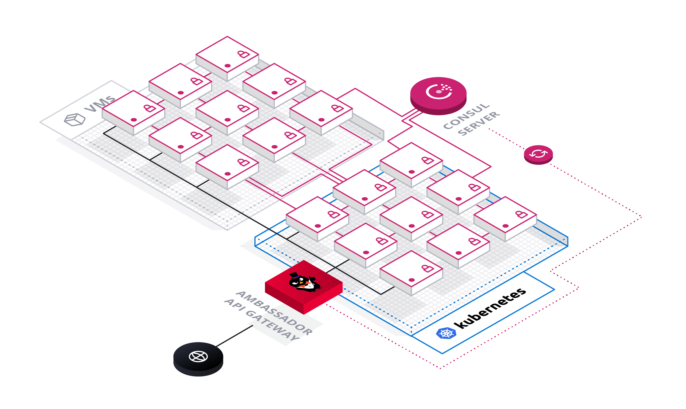

该场景的关注点在于：

- 控制/路由入口流量的能力
- 卸载请求
  - 认证（比如要求所有入口流量都必须要进过认证）
  - 加密（TLS终端及传输加密）
  - 重试及超时

saas service中的真实用例：

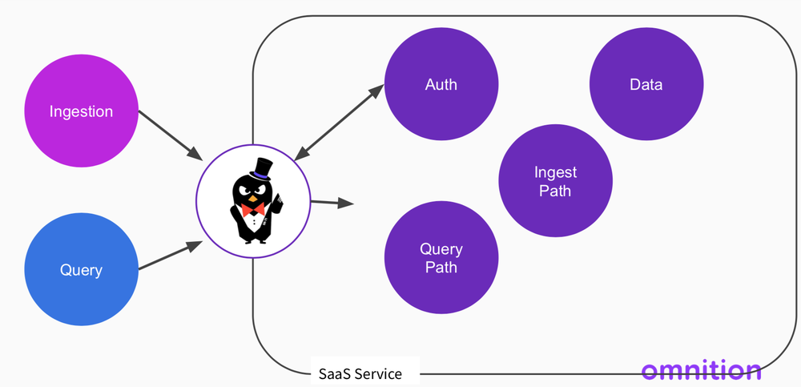

### 用例2：内部（南/北）路由

通常来说，企业内部的系统架构会比较复杂，会有多集群或者多租户，比如一个kubernetes的集群和一个vm的集群（可能是openstack），那么在集群之间的流量就是内部的南/北流量，集群之间的流量交互可以通过ambassador完成。

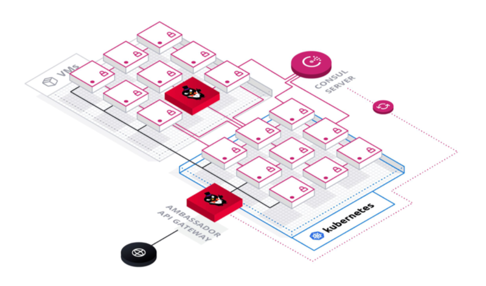

此场景的关注点在于：

- 控制/路由多租户流量的能力
- 卸载请求
  - 匹配（基于headers）
  - 重试及超时

saas service中的真实用例：

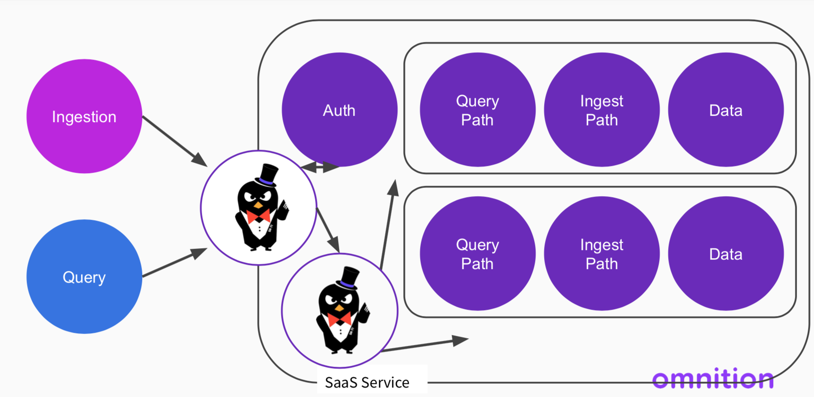

### 用例3：内部（东/西）路由

这个场景中Ambassador已经作为集群内部东西向流量的代理了，配合它自己的控制平面，有点service mesh的意思了。区别在于，Ambassador在这个集群里是处于一个中心节点的位置（一个或一组ambassador实例），属于server proxy的范畴，而不是service mesh里面的client proxy（sidecar）。这种架构其实和传统的esb更加的接近。

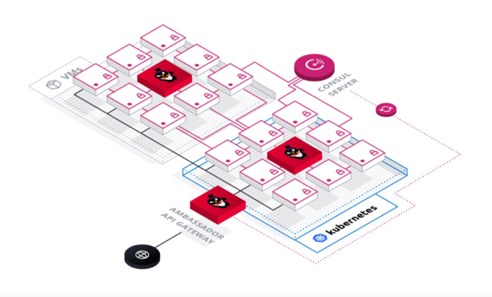

此场景关注点：

- 控制/路由任意流量的能力（南北向+东西向）
- 卸载请求
  - 服务发现
  - 负载均衡
  - 访问控制

大家可以看到，已经非常接近于service mesh的能力了（也许ambassador以后也会出一个service mesh产品？）

saas service的真实用例：

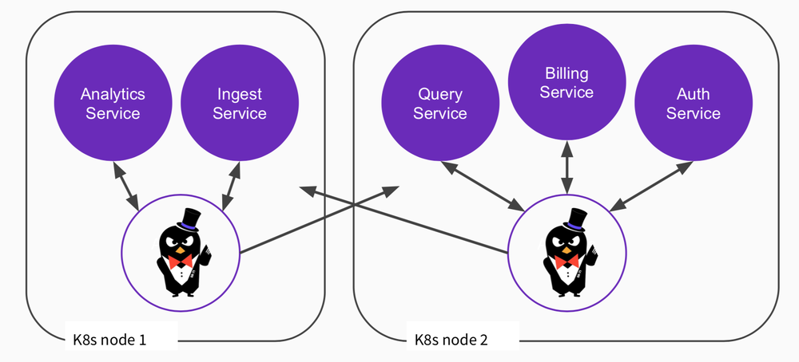

服务网格的真实用例（与istio集成）：

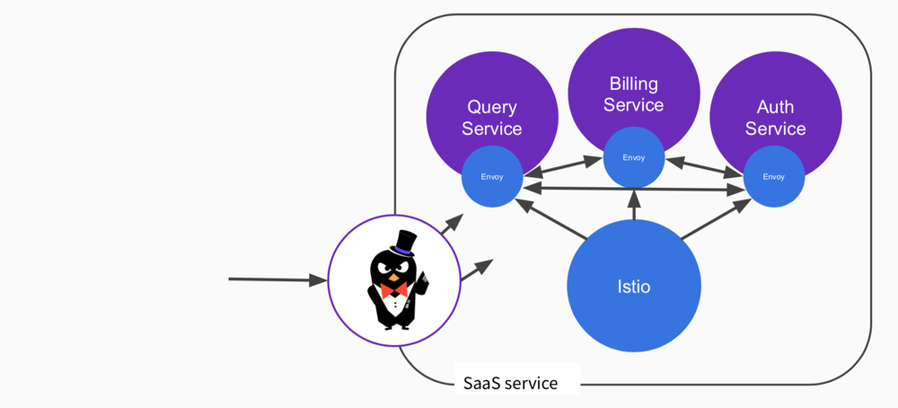

### 用例4：流量镜像

此场景中可以把流量复制一份到其他服务中（影子流量），通常用于监控、测试等场景

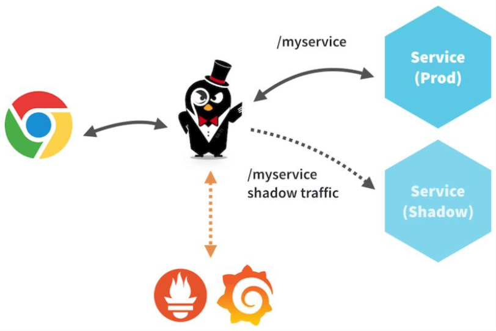

- 测试代码、发布包的能力
- 利用真实的流量/负载
- 最小化重复资源

> 注意：上面所描述的几个典型场景其实不光可以使用Ambassador，而是适用于各类使用api gateway或者proxy的场景。

## 配置

Ambassador不同版本之间配置方式的变更如下图所示,configmap方式是早期使用方式，目前已经被废弃了，现在更推荐使用CRD方式。

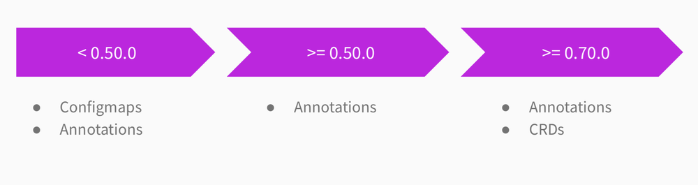

### 加密的配置方式


### 认证的配置方式

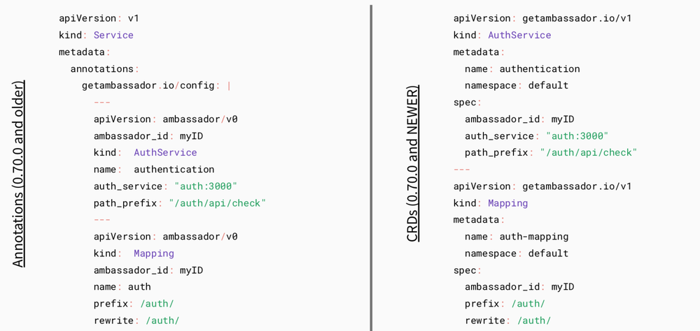

### 路由的配置方式

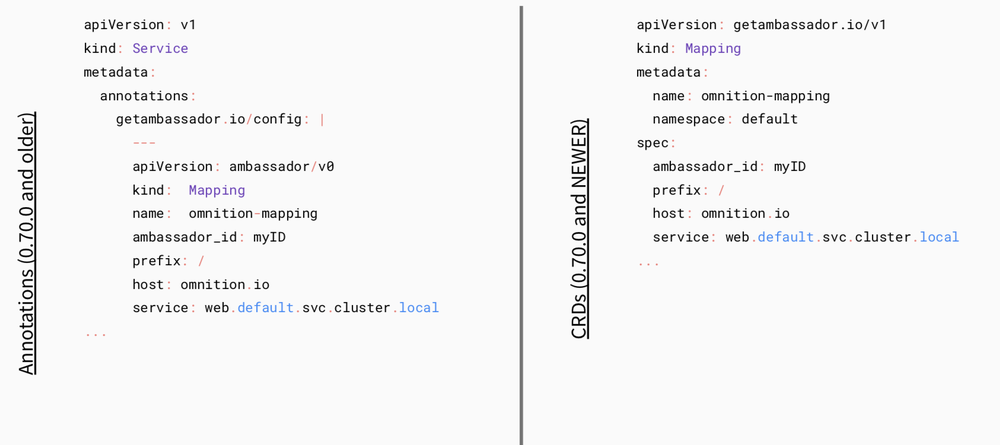

### 跟踪的配置方式


## Ambassador的不足

Ambassador和同类的网关产品类似，分为社区版及商业版，社区版提供了最基础的路由、限速、TLS加密、跟踪、认证（需要自己实现external third party authentication service）等能力，但是微服务网关中十分重要的OAuth2集成认证、RBAC、custom filter等功能都是需要在pro版中才能实现，这是比较遗憾的一点。尤其是custom filter，根据我们目前的经验，一个能力完整、功能丰富的微服务网关，必然会引入custom filter。而custom filter也需要使用Golang进行编写，对于不熟悉Golang的开发人员来说也会比较痛苦。

## 总结

Ambassador作为一个较新推出的开源微服务网关产品，与kubernetes结合的相当好，基于annotation或CRD的配置方式与k8s浑然一体，甚至让人感觉这就是k8s自身功能的一部分，真正做到了`kubernetes native`。而底层基于Envoy进行流量代理，也让人不需要太担心性能问题。对于路由、加密、基础认证、链路跟踪等场景，可尝试使用。而对于像`custom filter`、`rbac`、`advanced rate limiting`等场景有需求的用户，使用pro版本可满足要求。本人也与Ambassador开发团队进行了联系，遗憾的是Ambassador目前在国内尚未有reseller，若使用pro版，后期技术支持的便利性也是需要考虑的问题。

## 参考文献

- [https://www.getambassador.io](https://www.getambassador.io/)
- Using Ambassador to build Cloud-Native Applications - Steve Flanders, Omnition @ KubeCon 2019, Shanghai
