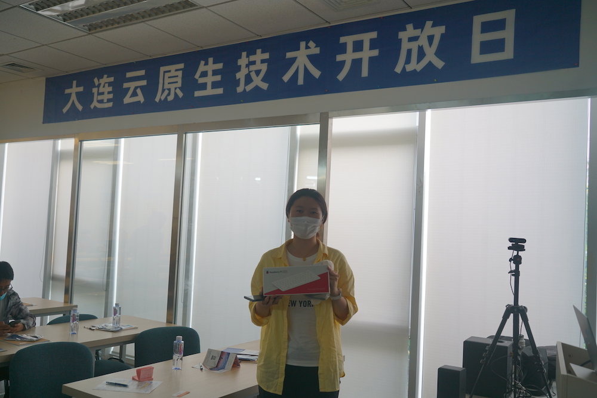

8 月 22 日，在大连市腾飞园区 5 号楼一楼世达教育，云原生社区 meetup 大连站正式拉开了序幕。此次活动是大连第一次举办如此规模的云原生技术大会，现场到场人数 70+，线上观看人数 700+。来自大连多家头部公司的技术专家围绕云原生，给线上线下的观众奉献了一场精彩的技术盛会。

让我们再次回顾一下此次 meetup！

## 讲师话题

### 《Connecting,Contorlling and Observing Dubbo Microservices with Flomesh》

**主讲人：林杨 Flomesh 首席架构师**

分享了如何使用 Flomesh 实现 Dubbo 项目的服务治理，包括可观测性、metrics、日志收集、灰度发布及限流限速等功能。

### 《基于云原生技术的服务最大化可用性》

**主讲人：白西原 乐天创研 架构师**

从乐天创研的实践入手，分享了如何基于云原生技术来实现服务最大化，提高服务可用性。

### 《分布式系统的发展与趋势分析》

**主讲人：张卫滨 金兰科技 软件设计师**

概述了分布式系统的发展过程以及相关的核心技术，展望微服务的发展趋势以及后 k8s 时代的分布式技术发展分析。

### 《Jutopia 一站式云原生机器学习平台》

**主讲人：何昌钦 LINE China Global Solution Architect**

人工智能正在影响所有行业组织。但人工智能生命周期每个阶段都是一个复杂系统，人工智能参与者很难实现这些系统并无缝集成。Jutopia 是 LINE 机器学习平台团队开发的一站式机器学习平台，采用云原生技术方案，致力于打通机器学习整个生命周期的 Pipeline。Jutopia 将多种优秀云原生开源框架进行服务化，具备机器学习服务、计算集群的多租户管理能力。

## 精彩瞬间

### 志愿者天团

### 讲师风采

### 会场实景

### 观众问答

### 全体合影

## 幻灯片下载及直播视频回放地址

PPT 存放在云原生社区云原生学院的[PPT](https://github.com/cloudnativeto/academy/tree/master/meetup/06-dalian)仓库中，欢迎感兴趣的小伙伴下载。

视频直播回见[B 站](https://space.bilibili.com/515485124/channel/detail?cid=198853&ctype=0)。

## 致谢

再次感谢 Flomesh，乐天创研，米斯特奥福（大连）咨询有限公司，世达教育对于此次活动的大力支持。

