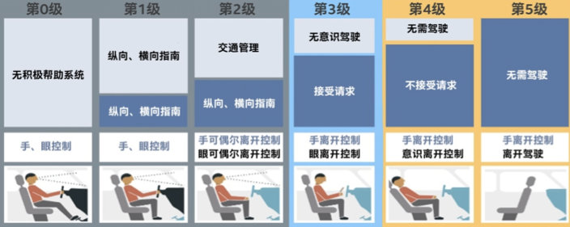

非常有幸参加了云原生社区 Meetup 北京站，有机会和众多业内的大牛一起讨论云原生相关的技术和应用，本次 Meetup 上我和大家分享了关于云原生下的可观测性相关的议题，相关的视频可以移步《[B 站视频回放：云原生下的可观测性](https://www.bilibili.com/video/BV1GK411g7dK)》回看，本篇文章主要是视频的文字性总结，欢迎大家留言讨论。

## 可观测性的由来

可观测性最早来自于电气工程领域，主要原因是随着系统发展的逐步复杂，必须要有一套机制用来了解系统内部的运行状态以便更好的监控和问题修复，为此工程师们设计了很多传感器、仪表盘用于表现系统内部的状态。

> A system is said to be observable if, for any possible evolution of [state and control vectors](https://en.wikipedia.org/wiki/State_space_representation), the current state can be estimated using only the information from outputs.

电气工程发展了上百年，其中各个子领域的可观测性都在进行完善和升级，例如交通工具（汽车 / 飞机等）也算的是可观测性上的集大成者。抛开飞机这种超级工程不谈，一辆可正常上路的小型汽车内部也有上百种的传感器用来检测汽车内 / 外部的各种状态，以便让汽车可以稳定、舒适、安全地的行驶。

## 可观测性的未来

随着上百年的发展，电气工程下的可观测性已经不仅仅用来辅助人们进行问题检查和定位问题，我们以汽车工程来看，整个可观测性的发展经历了几个过程：

1. 盲目：1886 年 1 月 29 日德国人卡尔・本茨发明了人类史上第一辆汽车，那个时候的汽车仅仅具备行驶的最基础能力，根本没有任何和可观测性相关的事情。
2. 传感器：随着后来汽车开始正式进入市场，人们需要更好的知道汽车是不是没油了、没水了，因此基础的传感器仪表盘被发明出来。
3. 告警：为了更好的保证汽车的形式安全性，人们开始使用自检和实时告警系统来主动向驾驶员通知一些异常信息，比如电瓶没电、水温过高、胎压低、刹车片磨损等。
4. 辅助：虽然告警能够即时发出，但有时候人还是来不及处理或者不想处理，这时候辅助系统就派上了用场，例如定速巡航、主动安全、自主泊车等。这些辅助系统是把传感器 + 自动控制进行结合，能够部分解决驾驶员可能做不到或者不想做的事情。
5. 自动驾驶：上述这些功能最终还是要人去参与，而自动驾驶可以完全不需要人的参与，直接是可观测性系统 + 控制系统就可以让汽车自动运行起来。

## 自动驾驶的核心要素

作为电气工程上可观测性的巅峰，自动驾驶将汽车获取到的各类内外部数据发挥到极致，总结起来主要有几下几个核心的要素：

1. 丰富的数据源：汽车外围遍布多个激光 / 图像雷达，能够实现高帧率、360° 实时观测周围的物体及其状态；内部则能够实时知道当前的车速、车轮角度、胎压等信息，做到知彼知己。
2. 数据集中化：相对辅助驾驶能力，自动驾驶的一个核心突破是能够将车内外的所有数据集中到一起去处理，真正发挥出数据的价值，而不是每个模块的数据作为孤岛进行独立运作。
3. 强大算力：集中化的数据也意味着数据量的急剧膨胀，无论哪家自动驾驶背后都有强大的芯片支撑，只有足够的算力才能保证在最短的时间内可以进行足够的计算。
4. 软件迭代：算力 + 算法构成了智能化的最终目标，然而算法不可能完美无瑕，我们会根据逐渐积累的自动驾驶数据不断进行算法的升级，使软件系统能够不断的升级以获得更佳的自动驾驶效果。

## IT 系统的可观测性

伴随着几十年的发展，IT 系统中的监控、问题排查也逐渐抽象为可观测性工程。在当时，最主流的方式还是使用 Metrics、Logging、Tracing 的组合。

上面这幅图详细大家非常熟悉，这是 Peter Bourgon 在参加完 2017 Distributed Tracing Summit 后发表的一篇博文，简洁扼要地介绍了 Metrics、Tracing、Logging 三者的定义和关系。这三种数据在可观测性中都有各自的发挥空间，每种数据都没办法完全被其他数据代替。

以 Grafana Loki 中介绍中的一个典型问题排查过程来看：

1. 最开始我们通过各式各样的预设报警发现异常（通常是 Metrics/Logging）
2. 发现异常后，打开监控大盘查找异常的曲线，并通过各种查询/统计找到异常的模块（Metrics）
3. 对这个模块以及关联的日志进行查询/统计分析，找到核心的报错信息（Logging）
4. 最后通过详细的调用链数据定位到引起问题的代码（Tracing）

上述例子介绍了如何使用 Metric、Tracing、Logging 去联合排查问题，当然根据不同的场景可以有不同的结合方案，例如简单的系统可以直接通过日志的错误信息去告警并直接定位问题，也可以根据调用链提取的基础指标（Latency、ErrorCode）触发告警。但整体而言，一个具有良好可观测性的系统必须具备上述三种数据。

## 云原生下的可观测性

云原生带来的不仅仅是应用部署能够部署云上而已，其整个的定义是一套新的 IT 系统架构升级，包括开发模式、系统架构、部署模式、基础设施全套的演进和迭代。

1. 效率要求更高：随着 DevOps 模式的普及，规划、开发、测试、交付.. 的效率要求越来越高，而与之带来的问题是需要更加实时的知道此次的发布是否成功，出现了什么问题，问题在哪里，如何快速去解决。
2. 系统更加复杂：架构从最开始的一体化发展到分层模式，到现在的微服务模式，架构的升级带来了开发效率、发布效率、系统灵活性、鲁棒性等优势，但随之而来系统的复杂度将更高，问题的定位将更加难。
3. 环境动态性增强：无论是微服务的架构还是容器化的部署模式，带来的一个特性是环境的动态性会增强，每个实例的生命周期会更短，出现问题后往往现场已经被破坏，登录机器排查问题的方式已经不复存在。
4. 上下游依赖更多：问题的定位最终都会从上下游来排查，在微服务、云、K8s 的环境中，上下游将更加多，包括各类其他业务应用、云上使用的各类产品、各种中间件、K8s 自身、容器运行时、虚拟机等等。

## 拯救者：OpenTelemetry

上述的这些问题相信很多读者都会深有体会，而业界也针对这种情况退出了各类可观测性相关的产品，包括开源、商业化的众多项目。例如：

1. Metrics：Zabbix、Nagios、Prometheus、InfluxDB、OpenFalcon、OpenCensus
2. Tracing：Jaeger、Zipkin、SkyWalking、OpenTracing、OpenCensus
3. Logging：ELK、Splunk、SumoLogic、Loki、Loggly

利用这些项目的组合或多或少可以解决针对性的一类或者几类问题，但真正应用起来你会发现各种问题：

1. 多套方案交织：可能要使用至少 Metrics、Logging、Tracing3 种方案，维护代价巨大
2. 数据不互通：虽然是同一个业务组件，同一个系统，产生的数据由于在不同的方案中，数据难以互通，无法充分发挥数据价值
3. 厂商绑定：无论从数据采集、传输、存储、计算、可视化、告警等都可能会被厂商绑定，可观测性系统一旦上线后替换的代价讲巨大无比
4. 云原生不友好：这些方案其中很多都是针对传统系统的，对于云原生的支持相对较弱，而且方案本身部署和使用代价都很高，不符合“云原生”这种一键部署、开箱即用的使用方式。

在此背景下，云原生基金会 CNCF 下诞生了 OpenTelemetry 项目，旨在将 Logging、Tracing、Metrics 三者进行统一，实现数据的互通互操作。

> Create and collect telemetry data from your services and software, then forward them to a variety of analysis tools.

OpenTelemetry 最核心的功能是产生、收集可观测性数据，并支持传输到各种的分析软件中，整体的架构如下图所属，其中 Library 用于产生统一格式的可观测性数据；Collector 用来接收这些数据，并支持把数据传输到各种类型的后端系统。

OpenTelemetry 给云原生下带来的革命性的进步，包括：

1. 统一协议：OpenTelemetry 为我们带来了 Metric、Tracing、Logging（正在制定中，LogModel 已经定义完毕）的统一标准，三者都有相同的元数据结构，可以轻松实现互相关联
2. 统一 Agent：使用一个 Agent 即可完成所有可观测性数据的采集和传输，不需要为每个系统都部署各种各样的 Agent，大大降低了系统的资源占用，使整体可观测性系统的架构也变的更加简单
3. 云原生友好：OpenTelemetry 诞生在 CNCF，对于各类的云原生下的系统支持更加友好，此外目前众多云厂商已经宣布支持 OpenTelemetry，未来云上的使用会更加便捷
4. 厂商无关：此项目完全中立，不倾向于任何一家厂商，让大家可以有充分的自由来选择 / 更换适合自己的服务提供商，而不需要收到某些厂商的垄断或者绑定
5. 兼容性：OpenTelemetry 得到了 CNCF 下各种可观测性方案的支持，未来对于 OpenTracing 类、OpenCensus、Prometheus、Fluntd 等都会有非常好的兼容性，可以方便大家无缝迁移到 OpenTelemetry 方案上。

## OpenTelemetry 限制

从上面的分析来看，OpenTelemetry 的定位是作为可观测性的基础设施，解决数据规范与获取的问题，后续部分依赖各个 Vendor 来实现。当然最佳的方式是能够有一个统一的引擎去存储所有的 Metrics、Logging、Tracing，有一个统一的平台去分析、展示、关联这些数据。目前的话还没有一个厂商能够非常好的支持 OpenTelemetry 的统一后端，现在还是需要自己去使用各个厂商的产品来实现。而这个带来的另一个问题是各个数据的关联会更加复杂，还需要去解决每个厂商之间的数据关联性问题。当然这个问题相信在 1-2 年肯定会解决掉，现在有众多厂商开始在努力实现 OpenTelemetry 所有类型数据的统一方案。

## 可观测性的未来方向

我们团队从刚开始 09 年做飞天 5K 项目起，就一直在负责监控、日志、分布式链路追踪等可观测性相关的工作，中间经历过小型机到分布式系统再到微服务、云化的一些架构变更，相关的可观测性方案也经历了很多演变。我们觉得整体上可观测性相关的发展和自动驾驶等级的设定非常吻合。

自动驾驶一共分为 6 级，其中 0-2 级主要还是靠人来进行决定，到了等级 3 之后就可以进行无意识驾驶，也就是手眼可以暂时性不用关注驾驶，到了等级 5 的话人就可以完全脱离驾驶这个枯燥的工作，在车上可以自由活动。

在 IT 系统的可观测性上，也可以类似划分 6 级：

- 等级 0：手工分析，依靠基础的 Dashboard、告警、日志查询、分布式链路追踪等方式进行手动告警、分析，也是目前绝大部分公司使用的场景
- 等级 1：智能告警，能够自动去扫描所有的可观测性数据，利用机器学习的方式去识别一些异常并进行自动告警，免去人工设置 / 调整各种基线告警的工作
- 等级 2：异常关联 + 统一视图，对于自动识别的异常，能够进行上下文的关联，形成一个统一的业务视图，便于快速的定位问题
- 等级 3：根因分析 + 问题自愈，自动根据异常以及系统的 CMDB 信息直接定位问题的根因，根因定位准确后那边可以去做问题的自愈。这一阶段相当于是一次质的飞跃，在某些场景下可以在人不用参与的情况下实现问题的自愈。
- 等级 4：故障预测，故障发生总会有损失，所以最好的情况是避免故障的发生，因此故障预测技术可以更好的来保证系统的可靠性，利用之前积累的一些故障先兆信息做到“未卜先知”
-  等级 5：变更影响预测，我们知道绝大部分的故障都是由变更引起的，因此如果能够模拟出每个变更对系统带来的影响以及可能产生的问题，我们就能够提前评估出是否能够允许此次变更。

## 阿里云 SLS 在可观测性相关的工作

目前我们 SLS 正在开展云原生可观测性的工作，基于 OpenTelemetry 这个未来云原生下可观测性的标准，实现各类可观测性数据的统一收集，覆盖各个数据源和各类数据类型，做到多语言支持、多设备支持、类型统一；向上我们会提供能够支持各类可观测性数据的统一存储和计算能力，支持 PB 级存储、ETL、流计算、百亿级数据秒级分析，为上层算法提供强大的算力支撑；IT 系统的问题非常复杂，尤其涉及到不同的场景和架构，因此我们把算法和经验结合起来进行异常的分析，算法包括基础的统计学、逻辑性算法，也包括 AIOp 相关的算法，经验中包括人工输入的专家知识、网上上积累的各类问题解决方案以及外部产生的一些事件；最上层我们会提供一些辅助决策的功能，例如告警通知、数据可视化、Webhook 等，此外会提供丰富的外部集成能力，例如对接三方的可视化 / 分析 / 告警系统，提供 OpenAPI 以便不同的应用方集成。

## 总结

作为 CNCF 下除了 Kubernetes 外最活跃的项目，OpenTelemetry 受到了各大云厂商以及相关解决方案公司的关注，相信未来一定会成为云原生下可观测性的标准。虽然目前还没有到生产可用的程度，但是目前各个语言的 SDK 和 Collector 也基本上稳定，在 2021 年就能够发布生产可用的版本，值得大家期待。

而 OpenTelemetry 只是定义了可观察的前半部分，后面还有非常多的复杂工作需要我们去实现，任重道远。

重点来了！！！！SLS 团队长期招聘人才，欢迎对大数据、监控、可观测性、前端可视化、移动端开发、机器学习等有兴趣的同学前来联系我：

- 邮箱：davidzhang.zc@alibaba-inc.com
-  微信：davidzhang-zc。
- 职位：https://cloudnative.to/job/aliyun-sls-observability/

## 参考

1. https://opentelemetry.io/
2. https://developer.aliyun.com/article/766070
3. https://aiopsworkshop.github.io/
4. https://landscape.cncf.io/
5. https://www.instana.com/blog/observability-vs-monitoring/
