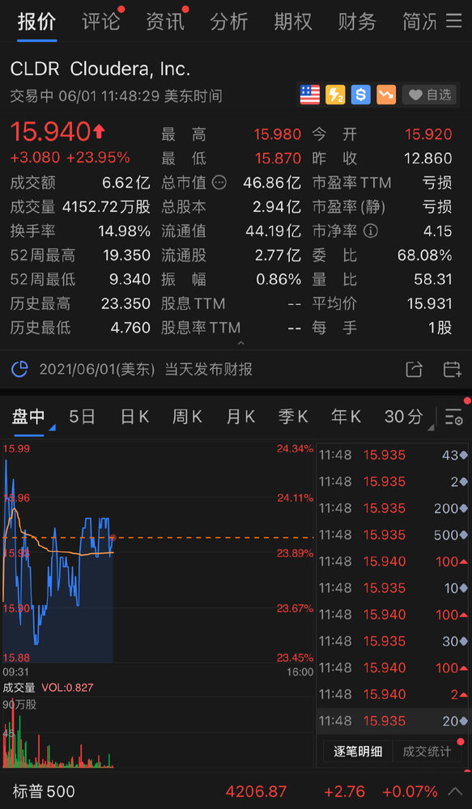

北京时间 6 月 1 日晚，据 [TechCrunch 报道](https://techcrunch.com/2021/06/01/cloudera-to-go-private-as-kkr-cdr-grab-it-for-5-3b/)，KKR 和 CD&R 将以 53 亿美元收购 Cloudera，Cloudera 将被私有化。截止到本文发稿，11 点 49 分，Cloudera 股票报价 15.94 美元，涨幅 23.95%。

[Cloudera](http://cloudera.com/)曾经是最热门的 Hadoop 初创公司之一，但是随着时间的推移，这个市场的光芒不再，今天它将被私有化，因为 KKR 和 Clayton Dubilier & Rice 这两家私募股权公司宣布他们打算以 53 亿美元收购 Cloudera。目前该公司的市值约为 37 亿美元。

Cloudera 和 Hortonworks 是 Hadoop 领域的两家重要初创公司，于[2018 年以 52 亿美元的价格合并](https://techcrunch.com/2018/10/03/cloudera-and-hortonworks-announce-5-2-billion-merger/)。Cloudera 可能受到激进投资者 Carl Icahn 的压力，他在 2019 年持有该公司[18% 的股份](https://siliconangle.com/2019/08/12/activist-investor-carl-icahn-shakes-cloudera/)，现在可以从这次出售中获益，该公司表示，每股 16 美元的价格对股东有 24% 的溢价。今早开市前，该公司的股价为 12.86 美元。

早在十年前，当 Hadoop 成为处理大数据的方式时，风险资金就涌入了这个领域。随着时间的推移，它失去了一些光辉。因为它是高度劳动密集型的，公司开始转移到云端，并寻找能为他们做更多工作的软件服务。像数据湖这样的更现代的技术开始取代它，该公司认识到它必须改变其方法以在现代数据处理市场中生存。

Cloudera 首席执行官 Rob Bearden 认为这项交易正是实现这一目标的一种方式。"Bearden 在一份声明中说："我们相信，作为一家拥有 CD&R 和 KKR 等经验丰富的投资者的专业知识和支持的私营公司，Cloudera 将拥有资源和灵活性来推动以产品为主导的增长，并扩大我们的市场机会。

虽然该声明中有很多行政术语，但它基本上意味着该公司希望这些私募股权公司能够给它一些额外的财政资源，以便向处理大量数据的更现代的方法前进。

在此过程中，Cloudera 还宣布了自己的几项收购，以帮助其实现现代化的目标。首先，Cloudera 收购了[Datacoral](https://techcrunch.com/2018/11/08/datacoral-raises-10m-series-a-for-its-data-infrastructure-service/)，这家初创公司将构建数据管道所需的基础设施抽象化，而无需使用代码。它还收购了[Cazena](https://techcrunch.com/tag/cazena/)，一家帮助客户建立云数据湖的初创公司，为公司提供了处理大数据的更现代的方法。Bearden 认为这两项服务有助于 Cloudera 在大数据自助服务市场上重新定位。

"这两项业务将使我们合并后的客户享受到复杂性的降低和更快的数据计划价值实现时间，从而提高洞察力，加快创新，并与客户和合作伙伴进行更有力的合作，"Bearden 在一份声明中说。

Cloudera 在[2018 年上市](https://techcrunch.com/2017/04/28/cloudera-finishes-up-20-in-stock-market-debut/)，在筹集了 10 亿美元后以每股 18.09 美元的价格收盘。其中绝大部分是英特尔资本在 2014 年的[7.4 亿美元的投资](https://techcrunch.com/2014/03/31/intel-pours-740m-into-cloudera-in-exchange-for-an-18-stake/)。值得注意的是，Cloudera 在去年年底以 3.14 亿美元[收购了英特尔在该公司的股份](https://www.marketwatch.com/story/cloudera-buys-back-intels-stake-11608759285)。

Hortonworks 又筹集了 2.48 亿美元。第三家 Hadoop 创业公司，MapR 筹集了 2.8 亿美元。该公司的资产在 2019 年以低于 5000 万美元的价格相当惨淡地[卖给了 HPE](https://www.barrons.com/articles/hp-enterprise-buys-assets-of-ai-startup-mapr-51565028280)，这表明 Hadoop 市场[早已落幕](https://techcrunch.com/2019/08/07/with-mapr-fire-sale-hadoops-promise-has-fallen-on-hard-times/)。

Cloudera 的交易包括一个简短的 "go shop"条款，允许它继续寻找一个更好的交易。它是否能找到这样的交易值得怀疑，如果找不到，与 KKR 和 CD&R 的交易预计将在今年下半年完成，但需要经过监管审查。该公司将在今天晚些时候公布收益。
