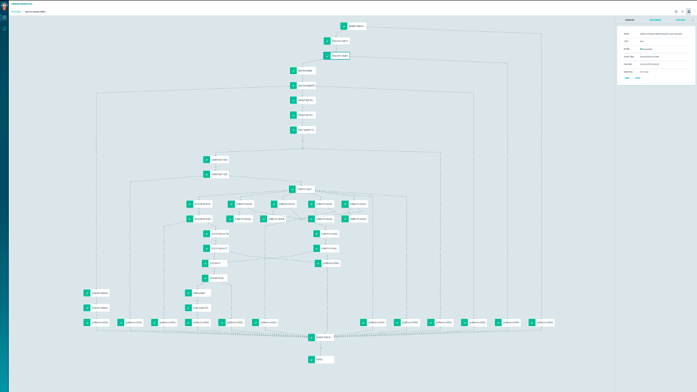

## Argo workflow 是什么

老牌的 CICD 工具 Jenkins 应该是大部分都接触过的，而在云原生时代，诞生了两大 CI/CD 框架，也就是 Argo Workflow 和 Tekton，本文主要介绍一下 Argo Workflow。

Argo Workflow 是一个云原生的工作流引擎，基于 kubernetes 来做编排任务，目前 Argo 项目是 CNCF 的毕业项目。
 
只有当需要执行对应的 step 时才会创建出对应的 pod，因此和 Tekton 一样，对资源的申请和释放具有很好的利用性。

基于 Argo Workflow 可以完成一些比较复杂的工作流，下面是一个来自某个 issue 的图：



### 架构概览


在 Argo Workflow 中，每一个 step/dag task 就是一个 pod 中的容器，最基础的 pod 会有 1 个 init 容器和两个工作容器，其中 init 容器和主容器都是 argoproj/argoexec 容器，另一个则是 step 中需要使用的容器，也就是实际执行内容的容器，在 pod  中充当 sidecar。

- main 容器，也就是 step/dag task 中定义的容器，用于执行实际内容。
- init 容器，用于为 main 容器处理 artifact 以及参数相关的逻辑。
- wait 容器，等待 main 容器执行完成，以及处理一些清理任务，例如上传 artifact 到 S3。

需要理清的一点是虽然 Argo Workflow 将工作容器定义为`main容器`，但实际上`wait容器`是 pod 中的主容器。

### 主要资源

在 Argo Workflow 中主要的 CRD 对象有几个：

- Workflow
- WorkflowTemplate
- CronWrokflow

接下来分别了解一下三个 CRD 对象。

### Workflow

Workflow 定义的字段和 workflowTemplate 定义的字段基本上是一致的，因此将字段的解释放在 workflowTemplate 部分，对 Workflow 的理解只需要知道 Workflow 是一个流水线的"实例"，也就是只有创建了 Workflow 对象是才会真正的运行流水线。

### WorkflowTemplate

WorkflowTemplate 是最重要的对象了，基本上绝大部分时间你都是和它在打交道，其中还有一个 template 的定义，在刚认识 Argo workflow 时需要注意区分的一点是 workflowTemplate 和 template，这在我刚入门时也造成了一点困惑，接下来讲一下这两个的区别：

workflowTemplate 是 argo workflow 中实现的 CRD 对象，而 template 则是对象内的一个字段，实际执行内容都是在 template 中定义的，一个 workflowTemplate 至少要包含一个 template。workflowTemplate 需要将一个 template 配置为 entrypoint，也就是流水线的起点，在这个 template 的 steps 中又可以应用多个相同或不同的 template。

简单举一个例子来理解 workflowTemplate 多个 template，假设要封装一个 workflowTemplate 来处理 git 相关的场景：

分别为以下三个操作创建三个 template，假设需要在同一份代码中多次 merge && commit，那么流水线入口是 git clone，然后 git merge，git add && git commit，在这种情况下 template2 和 template3 是作为 template1 的一部分存在的。而当流水线入口直接就是 git merge 或 git add && git commit 的情况时，template2 或 template3 是作为单独的流水线逻辑存在。

1. git clone
2. git merge
3. git add && git commit

因此 template 可以单独作为流水线入口执行，也可以被其他的 template 引用。

先列出几个关键词做一个简单的概述来更好的了解 Template:

- steps，流水线每一步的执行内容，`--`表示与同级别的 step 并行执行，`-`表示与同级别的 step 顺序执行。
- container，真正执行内容的定义，与 kubernetes container spec 定义一致。
- script，这是一个基于 container 的类型，可以让用户直接在 CI 中直接执行一些脚本并且得到返回的结果，例如执行 python 代码，执行 node 代码以及执行 shell 等等。
- resource，这个类型可以支持在 CI 中对 Kubernetes 的对象进行操作，例如创建一个 configMap，然后根据这个 Kubernetes 资源对象的状态来判断该步骤是否成功。（这个功能太酷了！）

以上几个点是理解 template 最主要的内容，一个简单示意的 yaml 格式如下：

```yaml
...
  entrypoint: hello-hello-hello #配置 template 入口
  templates:
  - name: hello-hello-hello
    steps:
    - - name: hello1            
        template: whalesay
        arguments:
          parameters:
          - name: message
            value: "hello1"
    - - name: hello2a   
        template: whalesay
        arguments:
          parameters:
          - name: message
            value: "hello2a"   #hello2a 与 hello1 是顺序执行
      - name: hello2b          #hello2a 与 hello2b 是并行执行
        template: whalesay
        arguments:
          parameters:
          - name: message
            value: "hello2b"

  - name: whalesay  # 定义一个用于真正执行内容的 template
    inputs:
      parameters:
      - name: message
    container:
      image: docker/whalesay
      command: [cowsay]
      args: ["{{inputs.parameters.message}}"]
...
```

我们在执行代码测试的过程中经常会有一些依赖服务要怎么在 Argo Workflow 中实现呢？

Argo Workflow 为 step 提供了 sidecars 参数，可以配置你需要的依赖容器，例如 DID，etcd，Redis 和 Mysql 等等。

下面是一个简单的 yaml 示例，为 CI 添加一个 redis 依赖服务：
```yaml
...
        container:
          image: busybox:1.36.1
          command: [sh， -c]
          args: ["echo hello"]
        sidecars:
        - name: redis
          image: redis:7.0.11
...
```

另一个比较常见的是 并行版本/参数测试，例如跑测试时希望让同一份代码基于多个版本的 Etcd 服务做测试，那么 Argo workflow 也提供了 withItems 的方式来实现这个功能。

还有一个常见的需求是编译缓存，例如 java 应用编译产物希望在下一个 CI 中继续应用，避免每次都去下载一些重复的 jar，Argo workflow 通过 volume 功能来实现这部分内容。也可以通过 artifact 功能实现，例如上传到 S3，需要时再进行下载。

根据文件唯一性来确认编译缓存是否更改，对于并行测试来说编译缓存可能是一样的，例如只更新了代码而没有更新 pom.xml 那么缓存依赖是一样的。对于 pom.xml 更改了，也就是编译缓存变更了，那么可以需要先更新编译缓存，然后再跑并行测试，当然这是具体的业务内容了。

接下来从官方一个默认的 workflowTemplate 来看一下实际的 yaml 是怎么样的。

#### 一个默认的简单 workflowTemplate

当创建 workflowTemplate 时会有一个默认的 workflowTemplate，来看一下这个 workflowTemplate 做了什么事情。

```yaml
metadata:
  name: lovely-dragon
  namespace: default
  labels:
    example: 'true'
spec:
  workflowMetadata:
    labels:
      example: 'true'
  entrypoint: argosay
  arguments:
    parameters:
      - name: message
        value: hello argo
  templates:
    - name: argosay
      inputs:
        parameters:
          - name: message
            value: '{{workflow.parameters.message}}'
      container:
        name: main
        image: argoproj/argosay:v2
        command:
          - /argosay
        args:
          - echo
          - '{{inputs.parameters.message}}'
  ttlStrategy:
    secondsAfterCompletion: 300
  podGC:
    strategy: OnPodCompletion
```

默认创建的 workflowTemplate 只有一个 template 并且它做的唯一一件事情就是打印传参 `message`。

需要注意的是 默认的 workflow 中设置了 podGC 和 workflow 的 TTL，一旦 pod 执行完成了就会删除 pod，并且由于默认没有配置日志持久化，这时候去查看日志的话只会看到空白。

为了方便研究测试，可以先将这部分内容给注释掉，或为 Argo Workflow 设置日志持久化。

注意：实际生产应用时请正确设置日志持久化。

下面的配置表示 workflow 会在 workflow 执行完成后的 300 秒删除，而 workflow 过程中产生的 pod 会在 pod 执行完成后立刻删除。

```yaml
...
  ttlStrategy:
    secondsAfterCompletion: 300
  podGC:
    strategy: OnPodCompletion
...
```

#### DAG 有向无环图

在 Tekton 中，DAG 的表示可以直接理解为 Pipeline。在整个流水线的过程中，可以串行或并行地执行 Tekton Task 并且任务起点与终点不会形成一个闭环。

除了 steps template 之外，Argo WorkflowTemplate 同样支持 DAG，以 dag template 的方式存在，可以让用户更好的维护复杂的工作流。

这里基于一个官方文档的示例来简单了解一下 Argo workflow dag template：

```yaml
apiVersion: argoproj.io/v1alpha1
kind: Workflow
metadata:
  generateName: dag-diamond-
spec:
  entrypoint: diamond
  templates:
  - name: echo
    inputs:
      parameters:
      - name: message
    container:
      image: alpine:3.7
      command: [echo， "{{inputs.parameters.message}}"]
  - name: diamond
    dag:
      tasks:
      - name: A
        template: echo
        arguments:
          parameters: [{name: message， value: A}]
      - name: B
        dependencies: [A]
        template: echo
        arguments:
          parameters: [{name: message， value: B}]
      - name: C
        dependencies: [A]
        template: echo
        arguments:
          parameters: [{name: message， value: C}]
      - name: D
        dependencies: [B， C]
        template: echo
        arguments:
          parameters: [{name: message， value: D}]
```

可以看到工作流的入口 template 为 diamond，由于只有任务 A 没有顺序依赖，因此一开始只会执行任务 A，任务 A 成功执行后开始同时执行任务 B 和任务 C，最终任务 B 和任务 C 都顺利执行完后开始执行任务 D。可以看到 dependencies 是一个数组传参，因此也可以将上述示例修改为任务 D 只需要等待任务 C 顺利执行后就开始执行。

#### 支持 Kubernetes 资源操作

在前面已经知道有一个 resource 类型的 template，这在我看来是很酷的功能！接下来看一个官方例子：等待 workflow 执行完成。

```yaml
apiVersion: argoproj.io/v1alpha1
kind: Workflow
metadata:
  generateName: Kubernetes-wait-wf-
spec:
  entrypoint: Kubernetes-wait-wf
  templates:
  - name: Kubernetes-wait-wf
    steps:
    - - name: create-wf
        template: create-wf
    - - name: wait-wf
        template: wait-wf
        arguments:
          parameters:
          - name: wf-name
            value: '{{steps.create-wf.outputs.parameters.wf-name}}'

  - name: create-wf
    resource:
      action: create
      manifest: |
        apiVersion: argoproj.io/v1alpha1
        kind: Workflow
        metadata:
          generateName: sleep-
        spec:
          entrypoint: sleep
          templates:
          - name: sleep
            container:
              image: alpine:latest
              command: [sleep， "20"]
    outputs:
      parameters:
      - name: wf-name
        valueFrom:
          jsonPath: '{.metadata.name}'

  - name: wait-wf
    inputs:
      parameters:
      - name: wf-name
    resource:
      action: get
      successCondition: status.phase == Succeeded
      failureCondition: status.phase in (Failed, Error)
      manifest: |
        apiVersion: argoproj.io/v1alpha1
        kind: Workflow
        metadata:
          name: {{inputs.parameters.wf-name}}
```

可以看到，Argo Workflow 原生支持直接在流水线中创建 Kubernetes 对象，并且根据对象的字段来控制流水线的执行。上述的示例效果是在 step1 中创建一个 workflow，然后在 step2 中等待创建的 workflow 执行完成，或者说等待这个 workflow 对象变更成预期的 success 或 failure 对应的状态。

这个在 resource 操作在流水线需要处理一些 Kubernetes 资源时会是一个很有用的功能。

#### 还有什么

一个更完善的流水线可能还会包含很多复杂的内容，这里留下一些参考点为研究 Argo workflow 时提供一些方向：

- CI 矩阵
- 为 CI 配置环境变量
- 为 CI 配置多个依赖服务（sidecar）
- 设置/使用特别 bucketName s3 artifact
- 工件存储 artifact
- volume 传递编译缓存
- 条件判断 step，当某些条件成立时才执行对应的 step
- workflow 和 step 并行度限制
- resource 类型 template，直接编写 python 代码

以上都是 Argo Workflow 本身就提供的功能，不需要自己再做一些封装，因此足以看到 Argo Workflow 提供的功能的实用性。

### CronWorkflow

CronWorkflow 是一个用于定时触发 workflow 的定义，在 CI 中也是很常见的，例如每晚构建。

同样地，通过 Argo 的 UI 界面创建一个定时的 workflow 时也会有一个默认的 cronWorkflow，可以通过这个默认的 cronWorkflow 来了解下：

```yaml
metadata:
  name: sparkly-tiger
  namespace: default
  labels:
    example: 'true'
spec:
  workflowMetadata:
    labels:
      example: 'true'
  schedule: '* * * * *'
  workflowSpec:
    entrypoint: argosay
    arguments:
      parameters:
        - name: message
          value: hello argo
    templates:
      - name: argosay
        inputs:
          parameters:
            - name: message
              value: '{{workflow.parameters.message}}'
        container:
          name: main
          image: argoproj/argosay:v2
          command:
            - /argosay
          args:
            - echo
            - '{{inputs.parameters.message}}'
    ttlStrategy:
      secondsAfterCompletion: 300
    podGC:
      strategy: OnPodCompletion
```

经过前面 workflow 和 workflowTemplate 的了解后，可以看到 cronWorkflow 的 yaml 文件整体来说是差不多的，无非是多了一些定时相关的配置。

上述示例中 schedule 配置为 `* * * * *`，也就是每分钟会执行一次 workflow。关于定时的内容都会有一个注意点是定时任务的时区，cronWorkflow 支持为定时任务设置时区，具体可以看看官方的这个[cron workflow 示例](https://github.com/argoproj/argo-workflows/blob/master/examples/cron-workflow.yaml)。

## 与 Tekton 的对比

经过一番折腾后能够感受到一些很明显的区别：

从系统架构上来说，Tekton 做得更好，整体架构比较清晰，但从用户功能的角度上来说 Argo Workflow 更容易上手使用。

Argo workflow 的 UI 能够展现出比较直观的 CI 顺序效果，同时 Argo WOrkflow 会有很多实用的功能。

另一个是 Argo workflow 中提供了一些 Tekton 默认所没有的功能，在我看来这些也都是比较酷和实用的功能，例如：

- resource 类型 template，可以直接创建 Kubernetes 对象以及 对 Kubernetes 对象 get，等待 Kubernetes 对象某个字段变更。
- artifact 功能，例如和 S3 打交道，这在流水线中是很常见的需求，但 Tekton 本身并没有提供。

Argo workflow 的文档建设也比 Tekton 更好。

总的来说 Tekton 提供的内容处于更底层的位置，与 kubernetes 类似，是一个 CI/CD 底层的引擎，真正用好它需要基于它做一些事情。而 Argo Workflow 处于更上层一点的位置，提供了很多实用的功能，可以很方便的应用起来。

## 写在最后

到目前为止，我们了解了 Argo Workflow 的强大特性以及与 Tekton 的一个简单对比，实际在企业内应该选择 Argo Workflow 还是 Tekton 还是需要根据业务特点以及实际验证一些测试后才能决定。

以上只是聊到了 Argo Workflow 的一部分功能，如果想了解更多的功能可以先从官方示例开始，官方代码仓库给了很多的[示例 yaml](https://github.com/argoproj/argo-workflows/tree/master/examples)，因此可以通过这些示例 yaml 很快的了解到相关的功能。
