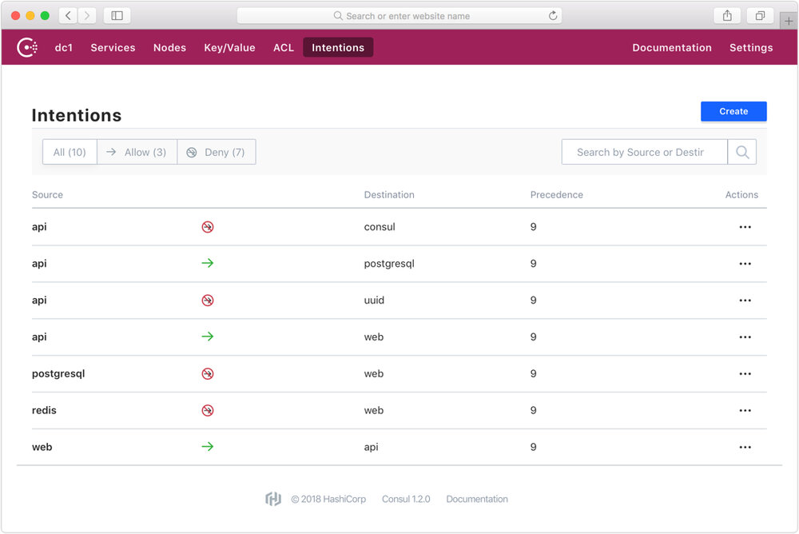

本文为翻译文章，[点击查看原文](https://www.hashicorp.com/blog/consul-1-2-service-mesh)。

本文译自 HashiCorp 官网关于 Consul 1.2 支持 Service Mesh 发布的博客文章。

本文是 HashiCorp 创始人 Mitchell Hashimoto 在 2018 年 6 月 26 日发布的关于 Consul 1.2 新功能 Service Mesh 的官方介绍。译者接触过的 Hashicorp 的产品有过不少，每款都给人感觉功能强大，设计简洁，可以说是都是非常优秀的开源产品（当然这与背后的 Hashicorp 公司商业级支撑有关）。译者有幸见过作者 Mitchell 一面，是个日裔混血，佩服他们取得的成就，期待他们推出的新功能能够取得市场上的成功。

Service Mesh 是最近很火的微服务新范式，以 Istio 为首的开源项目引领着潮流，其他各大公司也在迅速跟上，包括 Hashicorp 也在 Consul 中加入类似的功能。我们后续也将提供 Service Mesh 这方面更多的技术文章，敬请期待。

------


我们很激动宣布 HashiCorp Consul 1.2 正式发布了。这个版本主要新增了一个新的功能叫做 [Connect](https://www.consul.io/segmentation.html), 它能够将现有的 Consul 集群自动转变为 service mesh（服务网格）的解决方案。Connect 通过自动 TLS 加密和基于鉴权的授权机制支持服务和服务之间的安全通信。

当前全球有数以百万计的机器上正部署着 Consul。当升级到 Consul 1.2 并打开 Connect 功能后，任何现有的集群将立刻变身为支持任何包括物理机、云、容器和调度器等各种平台的 service mesh 方案。


## 现代服务网络 Service Mesh

Service mesh 是企业和组织采用微服务以及动态云计算基础设施方案的必选方案。传统的基于主机的网络安全机制必须被替代为现代的基于服务的安全机制，以适应现代运行时环境的高度动态特性。

Service mesh 提供了以下三个关键问题的一种高可用分布式解决方案：

- 服务发现：服务之间必须能够互相发现找到彼此。
- 配置：服务必须能够从一个中心的配置源接收运行时的配置信息。
- 隔离：服务之间的通信必须是被授权和加密的。

直到这个版本发布之前，Consul 分别用 DNS 解决了服务发现的使用场景，以及 K/V 存储解决了配置的使用场景。Connect 则将解决隔离的使用场景。这三项功能联合在一起提供了一种可运行在任何平台的 service mesh 完整解决方案。

## Consul Connect

Connect 是 Consul 的一个主要新功能，旨在通过自动 TLS 加密和基于鉴权的授权机制提供服务之间的安全通信。今天宣布的 Connect 的功能是完全免费并且开源的。Consul 1.2 提供 Connect 功能面向公众的发布。

Connect 在设计开发时就贯注了易于使用的想法。它可以仅仅通过一个配置参数就打开，在服务注册时额外添加一行就可以使得任何现存的应用接受基于 Connect 的连接。证书更新是自动的，因此不会导致服务停机。对于所有必须的子系统，Connect 仅仅需要一个二进制文件就可以支持。后面我们会涵盖很多其他的功能。


在易于使用的基础上，Connect 暴露了 Consul 的很多新功能。这篇文章接下来会介绍其中一些功能的细节，不过让我们来先列举一下具有 Connect 的 Consul 所有主要的新功能：

- **流量加密：** 使用 Connect 创建的所有流量都是使用双向 TLS 的，这确保了所有流量在传输中都是经过加密的。这使得服务可以安全地部署在低信任度的环境中。
- **连接授权：** 使用 [intentions](https://www.consul.io/docs/connect/intentions.html) 创建服务连接图，允许或拦截服务之间的通信。与防火墙使用 IP 地址不同，Connect 使用服务的逻辑命名。这意味着规则可以独立地进行扩展，无论有一个 web 服务还是 100 个。Intentions 可以通过界面、命令行、API 或者 HashiCorp Terraform 来进行配置。
- **Sidecar 代理：** 应用可以使用轻量的 sidecar 代理进程来自动创建进出流量的 TLS 连接。这使得现有的应用可以不进行任何修改就可以使用 Connect。Consul 不仅提供了一个不需要任何外部依赖的内置代理，还提供了对例如 Envoy 等第三方代理的支持。
- **原生集成：** 对于性能非常敏感的应用，可以不使用代理，而通过集成原生 Consul Connect API 来创建和接受连接，从而获得更优的性能和安全。
- **4 层 vs. 7 层：** 鉴权是在 4 层实施的。Consul 将 7 层的功能和配置代理给可插拔式的数据层。你可以集成第三方代理，例如 Envoy，来提供诸如基于请求路径的路由，链路追踪和其他的功能，将 Consul 留作服务发现、鉴权和授权的功能。
- **证书管理：** Consul 使用 CA 生成并分发证书。Consul 提供了一个不依赖外部系统的内置 CA 系统，与 HashiCorp Vault 集成后，还可以扩展支持其他 PKI 系统。
- **证书更新：** Connect 可以自动更新根证书和子证书。根证书更新使用证书交叉签名来保证新老证书在更新期间可以共存，从而不影响服务。此系统还支持无缝配置新的 CA 提供商。
- **基于 SPIFFE 的身份认证：** Consul 使用 [SPIFFE](https://spiffe.io/) 规范进行身份识别和认证。这使得使用 Connect 的服务可以创建和接受来自其他遵守 SPIFFE 系统的连接。
- **网络和云平台无关：** Connect 使用基于 TCP/IP 的标准 TLS。这使得 Connect 可以支持任何网络配置，只要目标服务广播的 IP 地址在操作系统中可以访问。而且，服务之间可以进行跨云通信，而不借助于复杂的 overlay 层级。

## 自动 Sidecar 代理

应用可以无须进行任何修改，使用代理 sidecar 创建出入连接。在使用 Connect 后，仅仅添加如下一行服务注册配置就可以使得这个服务能够接受基于 Connect 的连接：

```json
{
  "service": {
    "name": "web",
    "port": 8080,
    "connect": { "proxy": {} }
  }
}
```

唯一的区别就是由 `connect` 开头的那行。这一行的存在使得 Consul 可以自动为这个服务启动和管理一个代理进程。这个代理进程代表了这个特定的服务。它在一个动态分配的端口上接受连接，验证并授权这个 TLS 连接，然后代理回一个标准的 TCP 连接到服务进程。

对于上游的依赖，可以多添加几行配置通过 Connect 监听连接并代理到服务。例如，假设我们的“web”服务需要和“db”服务通过 Connect 进行通信：

```json
{
  "service": {
    "name": "web",
    "port": 8080,
    "connect": {
      "proxy": {
        "config": {
          "upstreams": [{
             "destination_name": "db",
             "local_bind_port": 9191
          }]
        }
      }
    }
  }
}
```

上面配置了一个受管代理并设置了监听本地 9191 端口将请求代理到任何远程“db”服务。通过配置“web”服务使用这个本地端口，所有“web”和“db”之间的通信都将成为加密的和已授权的。

需要注意的是这些例子中，原来的应用“web”保持 *没有修改且感知不到 Connect 的存在*。仅仅通过一行到几行的配置代码，任何应用都可以使用自动管理的代理 sidecar 来接受和创建 Connect 连接。

可以参阅 [代理的使用手册文档](https://www.consul.io/docs/connect/proxies.html) 了解更多内容。如果某个应用有极高的性能需求，那么它可以 [原生地集成](https://www.consul.io/docs/connect/native.html)Connect。这使得服务可以完全不需要代理。

## 开发友好的连接

为了最佳的安全性，服务应该尽量做到仅仅接受基于 Connect 的连接。然而，这给连接到服务进行开发或测试带来了挑战。Consul 提供了一种简单的方式通过使用 `consul connect proxy` 命令运行本地代理，从而使用 Connect 创建连接到服务。

考虑一个场景示例，一个 PostgreSQL 数据库服务仅接受来自 Connect 的连接，某运维工程师因为维护需要，想使用 `psql` 连接这个数据库。他可以在本地机器上通过 `consul connect proxy` 命令来使用 `psql` 进行连接：

```bash
$ consul connect proxy -service mitchellh -upstream postgresql:9191
==> Consul Connect proxy starting...
    Configuration mode: Flags
               Service: mitchellh
              Upstream: postgresql => :9191
       Public listener: Disabled
...
```

在另外一个 shell 终端中，可以使用标准 `psql` 客户端连接：

```bash
$ psql -h 127.0.0.1 -p 9191 -U mitchellh mydb
> 
```

其中 `-service` 命令参数代表了源服务的认证信息。服务并不需要存在，但是调用者必须拥有合法的 ACL token 来注册这个服务，Consul 必须配置为允许源和目标服务之间的连接。

对远程服务进行本地开发和测试是 service mesh 的一个常见工作流挑战，然而对于 Consul 和 Connect 来说却极为容易。

## 使用 Intentions 进行访问控制

服务之间的访问控制通过“intentions”进行配置。一个意向（intention）是一条从源到目的服务的允许或拦截规则。Intentions 可以通过 UI 界面、命令行、API 或 Terraform 进行创建。



按照上述示例，允许从 `db` 服务到 `web` 的访问，可以执行：

```bash
$ consul intention create -allow web db
Created: web => db (allow)
```

上述命令允许“web”服务同“db”服务进行通信。然后这个 intention 可以通过 `-deny` 立刻禁用两个服务之间的连接。

Intentions 也可以通过服务的部署进行单独管理，可以配置 ACL 规则，使得仅有特定的服务可以修改 intentions。这使得安全和隔离可以动态并几乎实时地进行配置和管控。

## 更多内容 & 未来

我们对于 Consul 1.2 和它所支持的新功能很是激动。由于这个功能和它的影响较大，Consul 1.2 中提供的 Connect 应该被认为是 beta 阶段。这个夏天我们将在 Connect 上努力，希望在年底前能去掉 beta 的标签。

在将来，我们也会围绕 Connect 构建更多功能，包括新的 UI 增强、对 Envoy 代理的支持，以及同 Nomad 和 Kubernetes 的集成等等。Consul 1.2 中的 Connect 仅仅是个开始。

访问 <https://www.consul.io/> 下载 Consul 1.2。

下面的页面能很好地进一步了解：

- [功能主页](https://www.consul.io/segmentation.html) - 这是 Consul Connect 的专门主页，包含对所提供功能的总览和文档链接。
- [Connect 使用步骤](https://www.consul.io/intro/getting-started/connect.html) - Consul 使用步骤新增了一步 Connect 并包含快速入门的一个浏览介绍。
- [Connect 交互式教程](https://play.instruqt.com/hashicorp/tracks/connect) - 带你过一遍运行 Connect 关键步骤的交互式教程。
- [Connect 参考手册](https://www.consul.io/docs/connect/index.html) - Connect 的文档手册中包含关于 Connect 如何工作、代理、原生集成和证书管理等等的所有细节。在部署 Connect 之前，推荐先阅读这个文档手册。
- [Connect 安全清单](https://www.consul.io/docs/connect/security.html) - Connect 和 Consul 其余的部分相比有不同的安全需求。为了运维的安全性，我们推荐查看此清单，阅读并理解 Consul 的安全模型。
- [Connect 生产指引](https://www.consul.io/docs/guides/connect-production.html) - 这是生产环境配置 Consul 集群 Connect 功能的一个完整配置指引，包括配置最大限度安全的必要步骤。
- [Connect 白板介绍](https://www.hashicorp.com/resources/introduction-consul-connect) - 这个视频是创始人兼联合 CTO Armon Dadgar 介绍 Connect 关于网络管理、安全和性能等方面的功能。

------

> 本文译自 HashiCorp 官网关于 Consul 1.2 支持 Service Mesh 发布的博客文章。
>
> 原文链接：<https://www.hashicorp.com/blog/consul-1-2-service-mesh>
> 作者：Mitchell Hashimoto
> 翻译：董干
