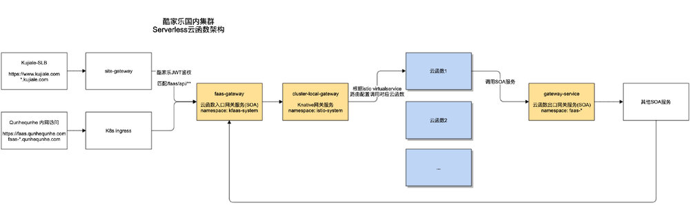
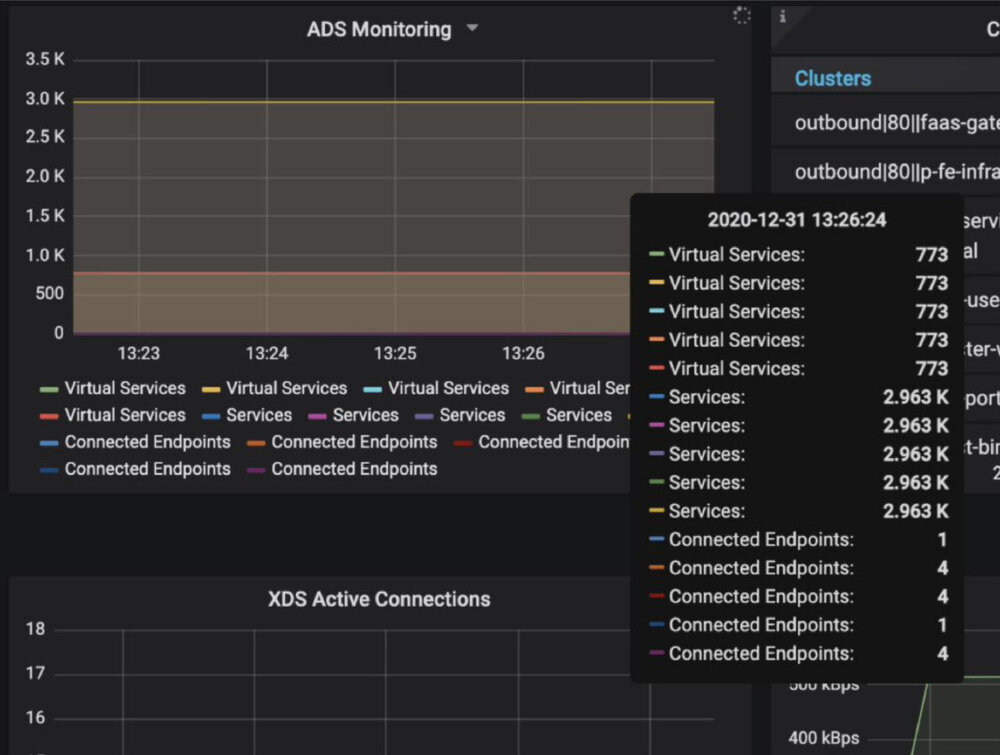

本文来自酷家乐先进技术工程团队，作者罗宁，酷家乐资深开发工程师。

## 公司背景

[酷家乐](https://www.kujiale.com/)公司以分布式并行计算和多媒体数据挖掘为技术核心，推出的家居云设计平台，致力于云渲染、云设计、BIM、VR、AR、AI 等技术的研发，实现“所见即所得”体验，5 分钟生成装修方案，10 秒生成效果图，一键生成 VR 方案的 SAAS 云端软件服务平台。

### 核心问题

公司快速增长的业务需求，使得支持各开发语言的 Serverless 设施在国内外六个 Kubernetes 集群上线落地，但公司现状已有一套成熟的自研 Java 服务服务治理系统，承载了部署在 Kubernetes / KVM 平台的上千服务。这两者的服务治理体系完全不同，如何打通之间的调用顺利落地 Serverless 平台为产品功能研发增加效能呢？

### 策略制定

酷家乐使用的成熟开源 Serverless 设施是依赖于 Istio 服务网格的 Knative，在 Kubernetes 集群中 Istio 提供的灵活又强大的动态路由/流量管理功能，配上一些相关的网关设施，不仅可以巧妙的解决不同体系服务相互调用的问题，且依旧保持了在酷家乐目前治理体系下的灵活可用。

### 结果收获

使用 Istio 服务网格设施，将 Serverless 平台服务在测试/预发/生产多个环境下无缝接入到公司自研服务治理体系中，使用 Java 服务的成熟业务无需发生架构变动，而新兴业务在 Serverless 平台上，数百服务借助 NodeJS/Python/C++/Golang 等语言能力，及 Serverless 快速发布，天生弹性等特性为数十业务组提供高效产能。

## 在成熟又复杂的服务治理平台上，引入新兴技术平台

酷家乐公司在后端服务上经过多年的经验积淀，公司内已有一套以 Dubbo 为基石并根据公司业务需求大幅改造过的，能够兼容 Kubernetes 和 KVM 混合部署方式的成熟 Java 微服务治理框架。但酷家乐作为一家大中型创新型创业公司，各部门新业务新产品大量涌现，业务所依赖的技术框架语言需求层出不穷（设计展示类产品需求和浏览器端一体的 NodeJS 服务，云端渲染及科研部门需求的 Python，C++等），此时通过嵌入 JAR 包这种语言相关的方式做服务治理满足业务需求已经力有不逮。

酷家乐2017年开始使用自建/托管 Kubernetes 集群作为生产级别容器编排设施，具有成熟的升级维护和问题解决经验，而 Istio 服务网格在 Kubernetes 平台上通过 sidecar 方式注入与语言彻底解偶的服务治理方案，正是目前阶段最合适的异构（多开发语言框架）的解决方案。下文讲述我们如何将数以百计的 Serverless 服务通过 Istio VirtualService 作为桥梁打通和已有 Java 微服务之间的沟通调用。

### Serverless 通过 Istio VirtualService 作为桥梁打通和已有微服务间沟通的 KFaas（Kujiale Faas）方案

下图是酷家乐国内集群 serverless 云函数架构。



在酷家乐，来自主站 [www.kujiale.com](http://www.kujiale.com/) 的流量都必须统一经过已有服务治理体系下的 Java 网关服务**site-gateway**进行 JWT 鉴权，过滤以及按规则转发到对应集群中的服务上。在当前治理体系下的能够接受流量转发的服务只能是 Java 服务，因对应环境下 Serverless 服务都只部署在同一个 Kubernetes 集群中，我们将匹配 `/faas/api/` 规则的 HTTP 请求用该 Java 服务进行订阅，并借助 SpringCloud zuul 将流量直接转发到 Istio 集群内网关服务上（`cluster-local-gateway`，与 Istio-`ingress-gateway` 同配置，区别是只接受来自内网的流量，并且可以根据负载情况动态扩容），并与 Serverless 服务部署在同一集群中，这样我们解决了 Serverless 服务被已有治理体系调用的问题。

如下是一个展示平台业务案例，这个业务服务分别部署在集群中分别由两部分组成。

**第一部分**

部署在 Kubernetes 集群 `faas-alpha` namespace 的 Knative service，在集群内的访问方式与普通的 Kubernetes service 并无区别，即 [http://saas-showroom.faas-alpha.svc.cluster.local](http://saas-showroom.faas-alpha.svc.cluster.local/)

**第二部分**

部署在 Kubernetes 集群 `kfaas-system` namespace 下的 Istio VirtualService，其具体的路由规则如下所示。

```yaml
apiVersion: networking.Istio.io/v1alpha3
kind: VirtualService
metadata:
  name: faas-alpha-ns-saas-showroom-ksvc-virtualservice
  namespace: kfaas-system
spec:
  gateways:
  - knative-serving/cluster-local-gateway
  - knative-serving/knative-ingress-gateway
  hosts:
  - faas-alpha-ksvc-gateway.kfaas-system.svc.cluster.local
  http:
  - match:
    - uri:
        prefix: /faas/api/saas/showroom/
    rewrite:
      authority: saas-showroom.faas-alpha.svc.cluster.local
    route:
    - destination:
        host: cluster-local-gateway.Istio-system.svc.cluster.local
  weight: 100
```

1.   HTTP path 前缀匹配 `/faas/api/p/saas/virtual-showroom/` （目前我们采用了 `prefix` 和 `exact` 两种方式，后续 regex 匹配功能也会在可避免路由冲突的情况下进一步开放出来）
2.   HTTP host 必须是 `faas-alpha-ksvc-gateway.kfaas-system.svc.cluster.local` （该  Kubernetes service 是 `cluster-local-gateway` 的 `external-service`，在非生产环境通过多个 `external-service` 多个测试环境共用一个 `istio-system` 下的 `cluster-local-gateway` 服务）
3.   流量转发目标服务 `saas-showroom.faas-alpha.svc.cluster.local`
4.   可加入重试，延时等规则提升在网格请求转发的鲁棒性
5.   通过 weight 设置的百分比，后续我们会用来解决蓝绿发布流量管理的能力

### Serverless 服务调用已有 Java 微服务治理体系服务

这里我们通过另一个 Java 出口网关服务解决，因为转发订阅规则都是已有服务治理体系内的方案，这里就无需再描述了。实际上 Serverless 通过入口和出口网关的方式接入另一个微服务治理体系的做法叫做东西向网关的方式，不同治理体系下虽然规则，用法及格式都不同，通过两边都能相互兼容的网关服务打通相互的调用是业界常用的做法，在酷家乐一些新收购的子公司/部门业务也通过这样的方式进行兼容。

### KFaas 技术方案与 Istio / knative 间的版本解偶

2018 年我们在 Istio 尚未发布 1.0 正式版本前，在测试环境已经开始尝试。随着版本 1.0 开始，我们在生产环境逐步迭代了 1.0.6 -> 1.1.7 -> 1.4.6 -> 1.5.4（部分集群），包括 Knative 0.8 -> 0.9 -> 0.14 -> 0.15。在此过程中我们认为 Istio/knative 这些设施版本更迭已经成为一种常态，我们初期的一些做法比如将业务相关的配置写入 `istio-system` namespace 中，在某些不兼容版本更新时就等于埋下了地雷。为此，我们专门设计了一个既依赖 Istio / knative 设施又与其固定版本解偶的 Kfaas 方案。

在 `kfaas-system` namespace 内包含：

1. Serverless 入口出口的东西向网关服务，并可根据负载进行弹性伸缩
2. Serverless 动态路由配置的 VirtualService
3. 特定的业务相关或内网独立使用的域名证书 ingress 配置

### 酷家乐服务业务使用 Istio VirtualService 量级

测试环境当下业务量级下，截止 2020 年末 VirtualService 已达 700+。



## 服务网格技术在酷家乐的未来展望

在酷家乐的实践中，我们使用 Istio 服务网格方案打通了不同服务治理下的服务集，取得了快速推进落地 Serverless 设施的成果。公司几十条业务线因为有了这套更为高效的生产力工具，产品和研发团队相比之前在同等时间内现在可以取得更多的业务成果，我们作为一家 SaaS 服务企业，是云原生赋能软件产业的典型案例。

随着公司多元化业务产品线在 2021 年进一步推进，多语言框架的异构服务，更细粒度的服务治理 等需求势不可挡，业务需求对基础设施的要求进一步攀升，这套以 Kubernetes/Istio 为代表的云原生技术必将给酷家乐创造更加广泛的价值。
