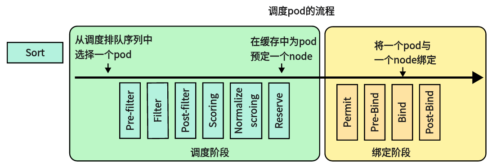
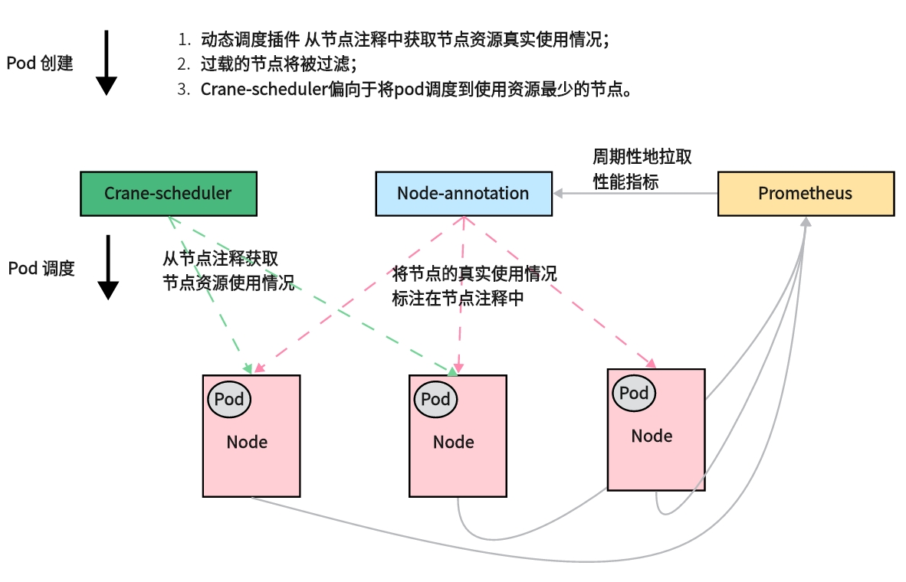
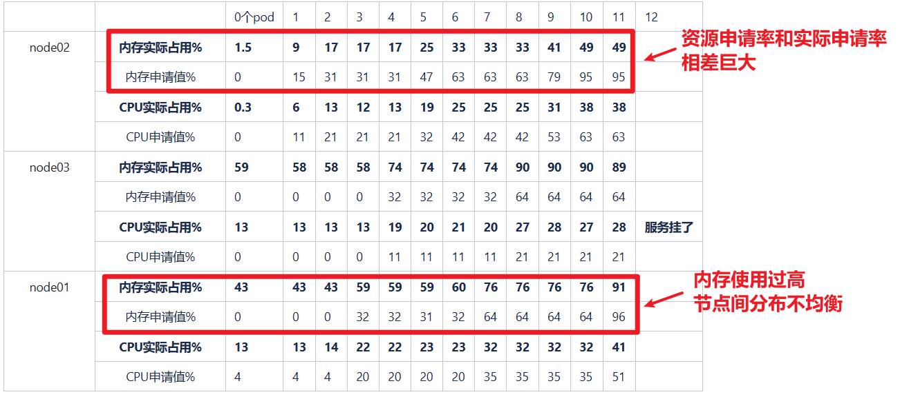
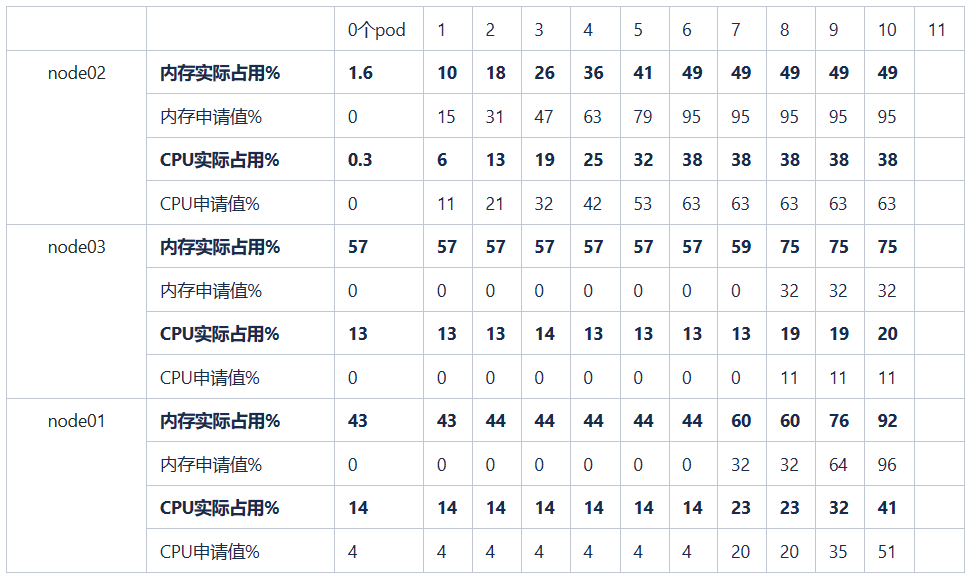
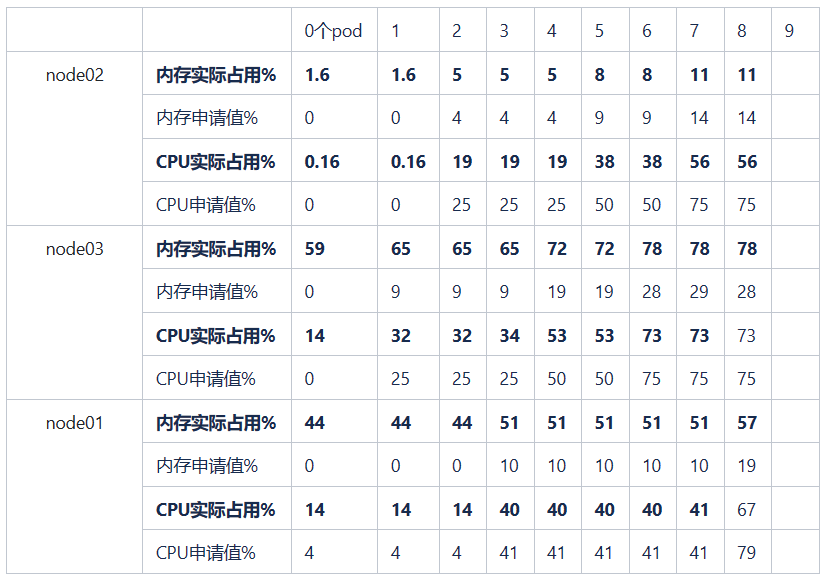
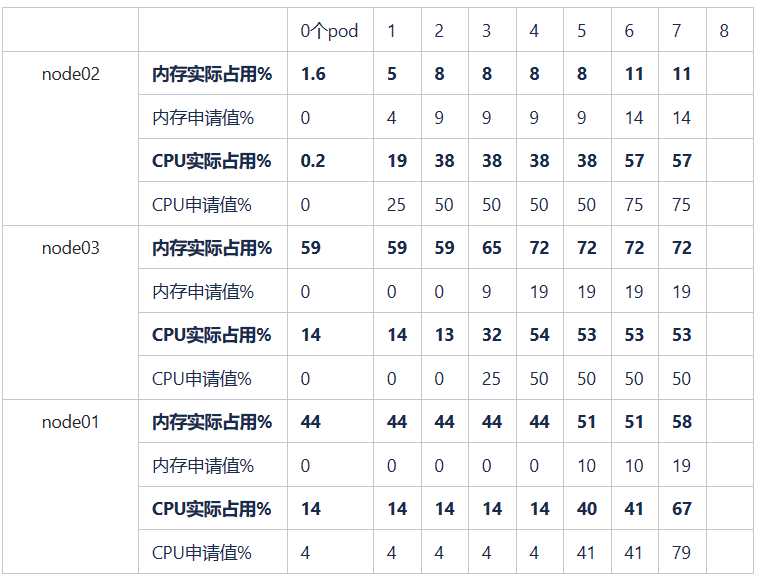

## 前言
原生 Kubernetes 调度器仅基于资源的 Request 进行调度，在生产环境资源的真实使用率和申请率往往相差巨大，造成资源浪费的同时也会造成节点的负载不均衡。crane-sheduler 基于prometheus集群真实资源负载进行调度，将其应用于调度过程中的 Filter 和 Score 阶段，能够有效缓解集群资源负载不均的问题，真正实现企业的降本增效。


## 背景

Kubernetes 集群是现代许多企业的首选方案之一，因为它可以帮助企业实现自动化部署、弹性伸缩和容错处理等功能，从而减少了人工操作和维护工作量，提高了服务的可靠性和稳定性，实现了降本增效。但是Kubernetes 默认的调度器存在以下问题：

1. 节点的实际利用率和节点申请率往往相差巨大，造成资源的浪费；
2. 节点间资源分布不均，会带来负载不均的问题。

crane-scheduler 由腾讯云团队开发，在一定程度上能够解决上述问题，直接基于资源的真实使用率进行调度，能够最大程度地利用资源，并排除了稳定性的后顾之忧，经过了长时间的实践和验证，可以很好地适应不同的场景和需求。开源后，crane-scheduler 受到了业界的广泛关注和支持，为 Kubernetes 社区的发展做出了贡献。（GitHub 链接地址：<https://github.com/gocrane/crane-scheduler>）

## Kubernetes 调度框架

Kubernetes官方提供了可插拔架构的调度框架，能够进一步扩展Kubernetes调度器，下图展示了调度框架中的调度上下文及其中的扩展点，一个扩展可以注册多个扩展点，以便可以执行更复杂的有状态的任务。



详细流程如下：

1. Sort - 用于对 Pod 的待调度队列进行排序，以决定先调度哪个 Pod
2. Pre-filter - 用于对 Pod 的信息进行预处理
3. Filter - 用于排除那些不能运行该 Pod 的节点
4. Post-filter - 一个通知类型的扩展点,更新内部状态，或者产生日志
5. Scoring - 用于为所有可选节点进行打分
6. Normalize scoring - 在调度器对节点进行最终排序之前修改每个节点的评分结果
7. Reserve - 使用该扩展点获得节点上为 Pod 预留的资源，该事件发生在调度器将 Pod 绑定到节点前
8. Permit - 用于阻止或者延迟 Pod 与节点的绑定
9. Pre-bind - 用于在 Pod 绑定之前执行某些逻辑
10. Bind - 用于将 Pod 绑定到节点上
11. Post-bind - 是一个通知性质的扩展
12. Unreserve - 如果为 Pod 预留资源，又在被绑定过程中被拒绝绑定，则将被调用

对于调度框架插件的启用或者禁用，我们同样可以使用上面的 `KubeSchedulerConfiguration` 资源对象来进行配置。下面的例子中的配置启用了一个实现了 `filter` 和 `scoring` 扩展点的插件，并且禁用了另外一个插件，同时为插件 foo 提供了一些配置信息：

```yaml
apiVersion: kubescheduler.config.k8s.io/v1alpha1
kind: KubeSchedulerConfiguration
...
plugins:
  filter:
    enabled:
    - name: foo
    - name: bar
    disabled:
    - name: baz
  scoring:
    enabled:
    - name: foo
    disabled:
    - name: baz

pluginConfig:
- name: foo
  args: >
    foo插件可以解析的任意内容
```

扩展的调用顺序如下：

- 如果某个扩展点没有配置对应的扩展，调度框架将使用默认插件中的扩展
- 如果为某个扩展点配置且激活了扩展，则调度框架将先调用默认插件的扩展，再调用配置中的扩展
- 默认插件的扩展始终被最先调用，然后按照 `KubeSchedulerConfiguration` 中扩展的激活 `enabled` 顺序逐个调用扩展点的扩展
- 可以先禁用默认插件的扩展，然后在 `enabled` 列表中的某个位置激活默认插件的扩展，这种做法可以改变默认插件的扩展被调用时的顺序

Kubernetes 调度插件 demo：<https://github.com/cnych/sample-scheduler-framework>

## crane-scheduler 设计与实现

### 总体架构



动态调度器总体架构如上图所示，主要有两个组件组成：

1. `Node-annotator`定期从 Prometheus 拉取数据，并以注释的形式在节点上用时间戳标记它们。
2. `Dynamic plugin`直接从节点的注释中读取负载数据，过滤并基于简单的算法对候选节点进行评分。

同时动态调度器提供了一个默认值调度策略并支持用户自定义策略。默认策略依赖于以下指标：

```
cpu_usage_avg_5m
cpu_usage_max_avg_1h
cpu_usage_max_avg_1d
mem_usage_avg_5m
mem_usage_max_avg_1h
mem_usage_max_avg_1d
```

在调度的`Filter`阶段，如果该节点的实际使用率大于上述任一指标的阈值，则该节点将被过滤。而在`Score`阶段，最终得分是这些指标值的加权和。

在生产集群中，可能会频繁出现调度热点，因为创建 Pod 后节点的负载不能立即增加。因此定义了一个额外的指标，名为`Hot Value`，表示节点最近几次的调度频率。并且节点的最终优先级是最终得分减去`Hot Value`。

### 关键代码实现

**Node-annotation** 

定期从 Prometheus 拉取数据，并以注释的形式在节点上用时间戳标记它们

```GO
// /pkg/controller/annotator/node.go
func (n *nodeController) syncNode(key string) (bool, error) {
	startTime := time.Now()
	defer func() {
		klog.Infof("Finished syncing node event %q (%v)", key, time.Since(startTime))
	}()

	// 获取 nodeName, metricName
	nodeName, metricName, err := splitMetaKeyWithMetricName(key)

	// 通过 nodeName 获取 node 的具体信息
	node, err := n.nodeLister.Get(nodeName)

	// 通过 nodeIP 或者 nodeName 获取并更新 node 的监控指标
	err = annotateNodeLoad(n.promClient, n.kubeClient, node, metricName)

	// 获取 node hotVaule，并更新
	err = annotateNodeHotValue(n.kubeClient, n.bindingRecords, node, n.policy)

	return true, nil
}

func annotateNodeLoad(promClient prom.PromClient, kubeClient clientset.Interface, node *v1.Node, key string) error {
	// 通过 nodeIp 查询
	value, err := promClient.QueryByNodeIP(key, getNodeInternalIP(node))
	if err == nil && len(value) > 0 {
		return patchNodeAnnotation(kubeClient, node, key, value)
	}

	// 通过 nodeName 查询
	value, err = promClient.QueryByNodeName(key, getNodeName(node))
	if err == nil && len(value) > 0 {
		return patchNodeAnnotation(kubeClient, node, key, value)
	}
	return fmt.Errorf("failed to get data %s{%s=%s}: %v", key, node.Name, value, err)
}
```

**Dynamic plugin**

Dynamic plugin 修改 filter 和 score 阶段

```go
// /pkg/plugins/dynamic/plugins.go
// Filter - 检查一个节点的实际负载是否过高
func (ds *DynamicScheduler) Filter(ctx context.Context, state *framework.CycleState, pod *v1.Pod, nodeInfo *framework.NodeInfo) *framework.Status {
    node := nodeInfo.Node()
	// 读取 nodeAnnotation, nodeName
	nodeAnnotations, nodeName := nodeInfo.Node().Annotations, nodeInfo.Node().Name

	// filter - 过滤
	for _, policy := range ds.schedulerPolicy.Spec.Predicate {
		// 获取采样时间
		activeDuration, err := getActiveDuration(ds.schedulerPolicy.Spec.SyncPeriod, policy.Name)

		// 根据指标，判断 node 是否过载
		if isOverLoad(nodeName, nodeAnnotations, policy, activeDuration) {
			return framework.NewStatus(framework.Unschedulable, fmt.Sprintf("Load[%s] of node[%s] is too high", policy.Name, nodeName))
		}
	}
	return framework.NewStatus(framework.Success, "")
}

// Score - 它从节点注释中获取度量数据，并支持实际资源使用最少的节点
func (ds *DynamicScheduler) Score(ctx context.Context, state *framework.CycleState, p *v1.Pod, nodeName string) (int64, *framework.Status) {
	// 通过 nodeName，获取 node 具体信息
	nodeInfo, err := ds.handle.SnapshotSharedLister().NodeInfos().Get(nodeName)
	node := nodeInfo.Node()
	nodeAnnotations := node.Annotations

	// 计算得分和 hotValue
	score, hotValue := getNodeScore(node.Name, nodeAnnotations, ds.schedulerPolicy.Spec), getNodeHotValue(node)
	score = score - int(hotValue*10)
	
    // 计算总得分 finalScore
	finalScore := utils.NormalizeScore(int64(score), framework.MaxNodeScore, framework.MinNodeScore)
	return finalScore, nil
}
```

### 使用流程

#### 配置 prometheus 监测规则

- **syncPolicy**: 用户可以自定义负载数据的类型与拉取周期；

- **predicate**:  Filter 策略，若候选节点的当前负载数据超过了任一所配置的指标阈值，则这个节点将会被过滤；

- **priority**：在 Score 策略中配置相关指标的权重，候选节点的最终得分为不同指标得分的加权和；

- **hotValue**：定义调度热点规则，最终节点的 Priority 为上一小节中的 Score 减去 Hot Value

```yaml
apiVersion: scheduler.policy.crane.io/v1alpha1
kind: DynamicSchedulerPolicy
spec:
  syncPolicy:
    ##cpu usage
    - name: cpu_usage_avg_5m
      period: 3m
    - name: cpu_usage_max_avg_1h
      period: 15m
    - name: cpu_usage_max_avg_1d
      period: 3h
    ##memory usage
    - name: mem_usage_avg_5m
      period: 3m
    - name: mem_usage_max_avg_1h
      period: 15m
    - name: mem_usage_max_avg_1d
      period: 3h

  predicate:
    ##cpu usage
    - name: cpu_usage_avg_5m
      maxLimitPecent: 0.65
    - name: cpu_usage_max_avg_1h
      maxLimitPecent: 0.75
    ##memory usage
    - name: mem_usage_avg_5m
      maxLimitPecent: 0.65
    - name: mem_usage_max_avg_1h
      maxLimitPecent: 0.75

  priority:
    ##cpu usage
    - name: cpu_usage_avg_5m
      weight: 0.2
    - name: cpu_usage_max_avg_1h
      weight: 0.3
    - name: cpu_usage_max_avg_1d
      weight: 0.5
    ##memory usage
    - name: mem_usage_avg_5m
      weight: 0.2
    - name: mem_usage_max_avg_1h
      weight: 0.3
    - name: mem_usage_max_avg_1d
      weight: 0.5

  hotValue:
    - timeRange: 5m
      count: 5
    - timeRange: 1m
      count: 2
```

#### 使用 crane-scheduler

这里有两种方式可供选择：

1. 作为k8s原生调度器之外的第二个调度器
2. 替代k8s原生调度器成为默认的调度器

1. **作为k8s原生调度器之外的第二个调度器**

   在 pod `spec.schedulerName` 指定 crane scheduler
   
   ```yaml
   apiVersion: apps/v1
   kind: Deployment
   metadata:
     name: cpu-stress
   spec:
     selector:
       matchLabels:
         app: cpu-stress
     replicas: 1
     template:
       metadata:
         labels:
           app: cpu-stress
       spec:
         schedulerName: crane-scheduler
         hostNetwork: true
         tolerations:
         - key: node.kubernetes.io/network-unavailable
           operator: Exists
           effect: NoSchedule
         containers:
         - name: stress
           image: docker.io/gocrane/stress:latest
           command: ["stress", "-c", "1"]
           resources:
             requests:
               memory: "1Gi"
               cpu: "1"
             limits:
               memory: "1Gi"
               cpu: "1"
   ```
   
2. **替代k8s原生调度器成为默认的调度器**

   修改kube调度器的配置文件（scheduler config.yaml）以启用动态调度器插件并配置插件参数：

   ```yaml
   apiVersion: kubescheduler.config.k8s.io/v1beta2
   kind: KubeSchedulerConfiguration
   ...
   profiles:
   - schedulerName: default-scheduler
     plugins:
       filter:
         enabled:
         - name: Dynamic
       score:
         enabled:
         - name: Dynamic
           weight: 3
     pluginConfig:
     - name: Dynamic
        args:
         policyConfigPath: /etc/kubernetes/policy.yaml
   ...
   ```

   /etc/kubernetes/policy.yaml 就是 4.3.1中的 `DynamicSchedulerPolicy` 资源对象

   修改kube-scheduler.yaml，并将kube调度器映像替换为Crane schedule

   ```yaml
   ...
    image: docker.io/gocrane/crane-scheduler:0.0.23
   ...
   ```

   安装 crane-scheduler-controller

   ```shell
   kubectl apply ./deploy/controller/rbac.yaml && kubectl apply -f ./deploy/controller/deployment.yaml
   ```

## 真实环境测试

crane-sheduler 会将监控指标数据写在 node annotation 上：

```yaml
metadata：
  annotations: 
    cpu_usage_avg_5m: 0.15079
    cpu_usage_max_avg_ld: 0.16196
    cpuusage_max_avg_lh: 0.15790 
    mem_usage_avg_5m: 0.89633 
    mem_usage_max_avg_ld: 0.89753 
    mem_usage_max_avg_lh: 0.89797 
    node.alpha.kubernetes.io/ttl: '0° 
    node hot value: 0 
```

### 内存型服务测试

测试服务单副本实际占用 2C 20G ，申请资源 5C 40G：

```yaml
containers:
- name: stress
  image: stress-ng  # 压力测试镜像工具
  command: ["stress", "-c", "2", "--vm", "1", "--vm-bytes", "20G", "--vm-keep"] 
  resources: 
    requests: 
      memory: "40Gi" 
      cpu: "5" 
    limits: 
      memory: "80Gi" 
      cpu: "5" 
```

**k8s默认调度器结果（%）**



默认调度器根据 资源申请值`request` 调度服务，且节点间分布不均衡

当副本数到达12 个时，默认调度器出现了资源分配严重不均的情况，且一些服务被挤占，出现CrashLoopBackOff错误：

```shell
crone-system prometheus-prometheus-node-exporter-6rjvj           1/1 Running          1 6d18h 
crone-system prometheus-prometheus-node-exporter-g6gfm           0/1 CrashLoopBackOff 9 6d18h 
crane-system prometheus-prometheus-node-exporter-kqbhf           1/1 Running          0 6d18h 
crone-system prometheus-prometheus-pushgoteway-78d668c9bd-91xpz  0/1 CrashLoopBackOff 7 6d17h 
crone-system prometheus-server-6b84bbfc4f-25hpc                  0/2 CrashLoopBackOff 2 2m41s 
```

**crane-schedule调度器结果（%）**



当启动11个服务的时候，node03中的`mem_usage_avg_5m`指标过高，禁止调度：

```shell
Events: 
  Type     Reason              From             Message 
Warning    FailedScheduling    crane-scheduler  0/3 nodes are available:1 Load[mem_usage_avg_5m] of [node-03] is too high, 2 Insufficient memory           
```

### CPU型服务测试

测试服务单副本实际占用 8C 8G ，申请资源 12C 12G

```yaml
containers:
- name: stress
  image: stress-ng  # 压力测试镜像工具
  command: ["stress", "-c", "8", "--vm", "1", "--vm-bytes", "8G", "--vm-keep"] 
  resources: 
    requests: 
      memory: "12Gi" 
      cpu: "12" 
    limits: 
      memory: "12Gi" 
      cpu: "12" 
```

**k8s默认调度器结果（%）**



当启动9个服务的时候，出现 Insufficient cpu 的情况：

```shell
Events: 
  Type     Reason              From               Message 
Warning    FailedScheduling    default-scheduler  0/3 nodes are available: 3 Insufficient memory                                
```

**crane-schedule调度器结果（%）**



当启动8服务的时候，node03中的`mem_usage_avg_5m`指标过高，禁止调度：

```shell
Events: 
  Type     Reason              From               Message 
Warning    FailedScheduling    crane-scheduler    0/3 nodes are available: 1 Load[mem_usage_avg_5m] of [node-03] is too high, 2 Insufficient cpu
```


## 总结

crane-scheduler基于prometheus集群真实资源负载进行调度，经过在linux环境上的压力测试，与k8s默认的调度器相比，结果标明：

1. crane-scheduler应用于调度过程中的 Filter 和 Score 阶段，能够根据自定义指标实现资源的调度，在一定程度上缓解节点资源负载不均的问题；
2. crane-scheduler通过设置水位线和热点限制，能够有效防止节点资源过载的情况发生；
3. 但是在测试过程中，也发现当节点request接近100%时，尽管该节点真实使用率很低，crane-scheduler是不能够调度上去的。为了进一步提高节点的资源利用率，后续需要考虑突破节点request值的限制，一种做法是屏蔽k8s对节点request值的校验，但是这样做法对k8s原生组件侵入性较大；另一种可行性较高的做法是通过资源的超卖去实现，利用节点的空闲资源区部署一些不重要的应用。

## 参考文献

1. http://kubernetes.p2hp.com/docs/
2. https://www.qikqiak.com/post/custom-kube-scheduler/
3. https://gocrane.io/zh-cn/docs/tutorials/dynamic-scheduler-plugin/
4. https://github.com/gocrane/crane-scheduler
5. https://blog.51cto.com/u_14120339/5363877
