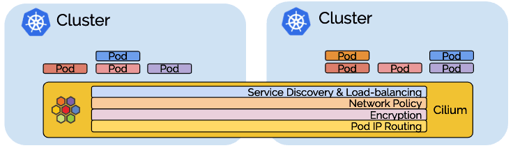
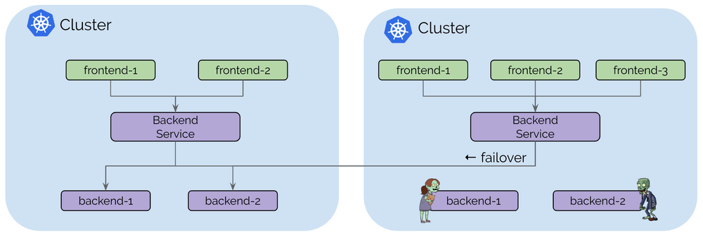
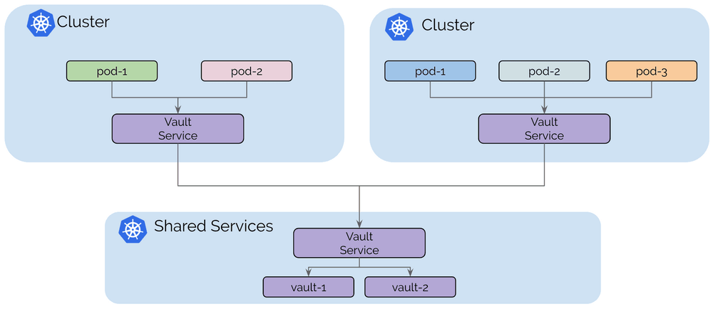
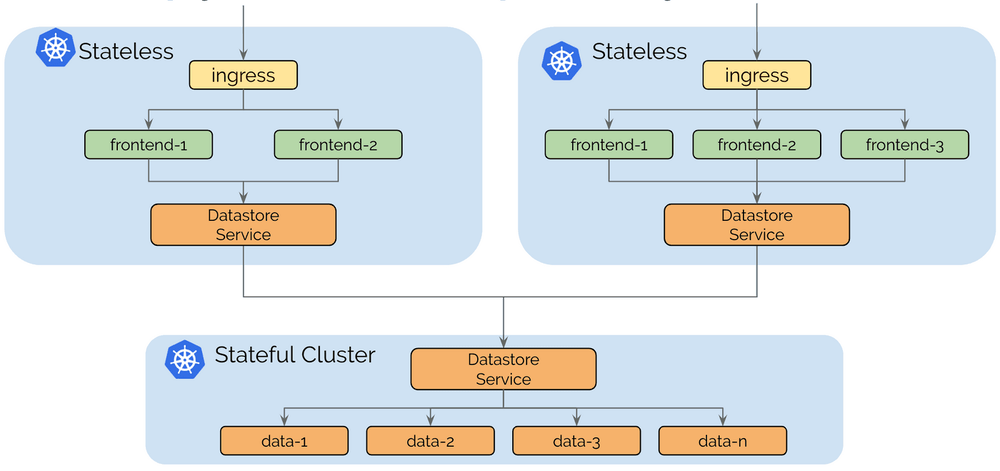
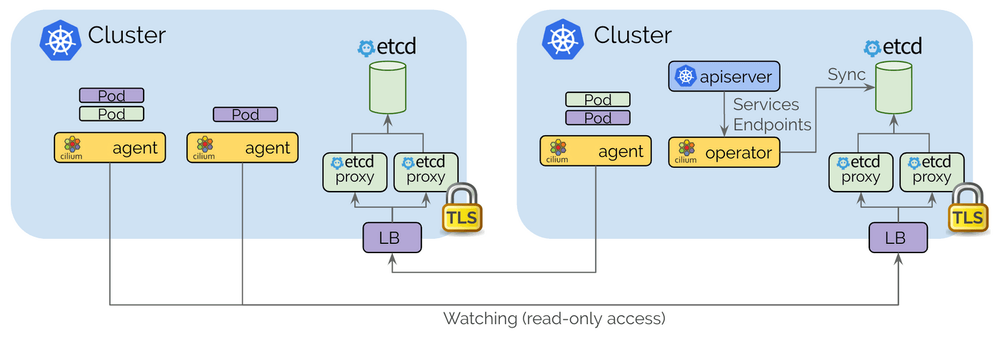
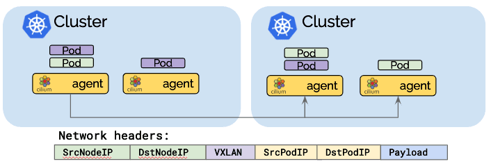
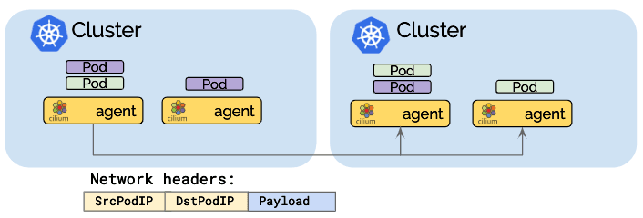
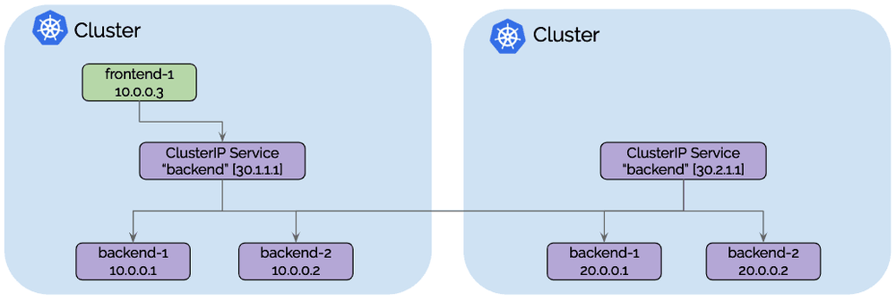
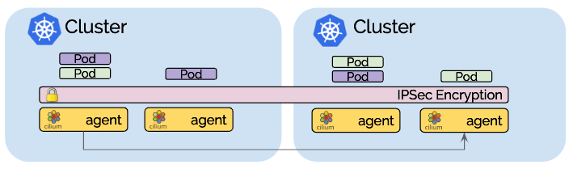
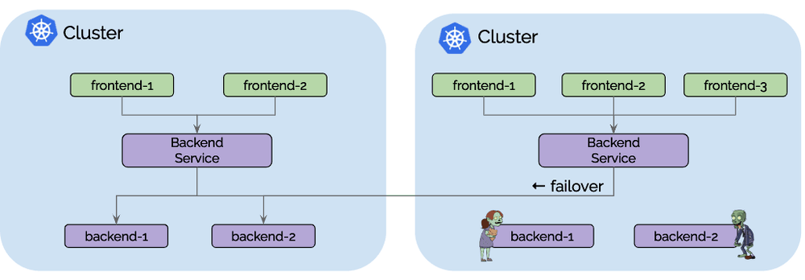

本文是对ClusterMesh（Cilium的多集群实现）的深入研究。简而言之，ClusterMesh 提供：

- 通过隧道或直接路由，以本地性能对多个Kubernetes集群进行Pod IP路由，而无需任何网关或代理。
- 使用标准Kubernetes服务和coredns/kube-dns的透明服务发现。
- 跨多个集群的网络策略实施。 策略可以指定为Kubernetes NetworkPolicy资源或扩展的CiliumNetworkPolicy CRD。
- 透明加密，用于本地集群中的节点之间以及跨集群边界的所有通信。



多集群功能以层为单位构建，您可以选择使用所有层，也可以仅选择和使用所需的层。

## 用例

在深入研究实现细节之前，让我们回顾一下连接多个Kubernetes集群的一些用例。

### 用例：高可用性



对于大多数人来说，高可用性是最明显的用例。 此用例包括在多个区域（regions）或可用区（availability zones）中运行Kubernetes集群，并在每个集群中运行相同服务的副本。 一旦失败，请求可以故障转移到其他集群。 此用例中涵盖的故障情形主要不是整个区域或故障域的完全不可用。 更可能的情况是一个集群中资源暂时不可用或配置错误导致无法在一个集群中运行或扩展特定服务。

### 用例：共享服务

基于Kubernetes的平台的最初趋势是构建大型多租户Kubernetes集群。 为每个租户构建单个集群或为不同类别的服务构建集群越来越普遍，例如， 不同级别的安全敏感度。

但是，某些服务（如密钥管理，日志记录，监控或DNS）通常仍在所有集群之间共享。 这避免了在每个租户集群中维护这些服务的操作开销。

此模型的主要动机是租户集群之间的隔离，为了维持该目标，租户集群连接到共享服务集群但未连接到其他租户集群。

### 用例：拆分有状态和无状态服务

运行有状态或无状态服务的操作复杂性是非常不同的。 无状态服务易于扩展，迁移和升级。 完全使用无状态服务运行集群可使集群保持灵活和敏捷。 从一个云提供商迁移到另一个云提供商非常简单。

有状态服务可能会引入潜在的复杂依赖链。 迁移服务通常涉及存储迁移。

为无状态和有状态分别运行独立的集群允许将依赖复杂性隔离到较少数量的集群，并使无状态集群依赖性保持自由。

## 控制平面

### 要求

- 必须为所有Kubernetes工作节点分配唯一的IP地址，并且所有工作节点必须在彼此之间具有IP连接。
- 必须为所有集群分配唯一的PodCIDR区间。
- 必须将Cilium配置为使用etcd的kvstore。
- 集群之间的网络必须允许集群间通信。 防火墙的具体配置要求将取决于Cilium是否配置为以直接路由或隧道模式运行。

### 架构

控制平面基于etcd并尽可能保持简约：

- 每个Kubernetes集群都维护自己的etcd集群，包含该集群的状态。 来自多个集群的状态永远不会在etcd本身中混淆。
- 每个集群通过一组etcd代理公开它自己的etcd。 在其他集群中运行的Cilium代理连接到etcd代理以监视更改并将多集群相关状态复制到自己的集群中。 使用etcd代理确保了etcd观察者的可扩展性。 访问受TLS证书保护。
- 从一个集群到另一个集群的访问始终是只读的。 这确保了故障域保持不变，即一个集群中的故障永远不会传播到其他集群中。
- 配置通过简单的Kubernetes secrets资源进行，该资源包含远程etcd代理的寻址信息以及访问etcd代理所需的集群名称和证书。



## Pod IP 路由

pod IP路由是多集群能力的基础。 它允许跨集群的pod通过其pod IP相互联系。 Cilium可以在多种模式下运行以执行pod IP路由。 所有这些模式都能够执行多集群pod IP路由。

### 隧道模式



隧道模式将pod中发出的所有网络数据包封装在所谓的封包头中。 封包头可以包含VXLAN或Geneve帧。 然后通过标准UDP包头传输该封装帧。 该概念类似于VPN隧道。

- **优点**：pod IP在底层网络上永远不可见。 网络只能看到工作节点的IP地址。 这可以简化安装和防火墙规则。
- **缺点**：所需的额外网络标头将降低网络的理论最大吞吐量。 确切的成本取决于配置的MTU，与使用MTU 9000的巨型帧相比，使用1500的传统MTU时会更加明显。
- **缺点**：为了不消耗过多CPU，包括底层硬件在内的整个网络堆栈必须支持校验和和分段卸载，以计算校验和并在硬件中执行分段，就像对“常规”网络数据包所做的那样。如今，这种卸载功能的可用性非常常见。

### 直接路由模式



在直接路由模式中，所有网络数据包都直接路由到网络。 这要求网络能够路由pod IP。 可以使用多个选项实现跨节点传播pod IP路由信息：

- 使用`--auto-direct-node-routes`选项，这是通过kvstore的超轻量级路由传播方法，如果所有工作节点共享一个单一的2层网络，该选项将起作用。 对于所有形式的基于云提供商的虚拟网络，通常都满足此要求。
- 使用[kube-router集成](http://docs.cilium.io/en/stable/gettingstarted/kube-router/)运行BGP路由守护进程。
- 使用任何其他路由守护进程将路由注入标准Linux路由表（bird，quagga，...）

当网络不再理解pod IP时，网络数据包地址需要伪装。

- **优点**：减少的网络数据包标头可以优化网络吞吐量和延迟。
- **缺点**：整个网络必须能够路由pod IP，这会增加操作的复杂性。

### 混合路由模式

混合路由模式允许在可用时使用直接路由，这通常在本地集群或同一VPC中的其他集群中，而当跨越VPC或云提供商时可以回退到隧道模式。 这可以限制操作复杂性并且允许仅在需要时支付优化成本。

## 服务发现

Cilium的多集群模型的服务发现是使用标准的Kubernetes [services](https://kubernetes.io/docs/concepts/services-networking/service/) 构建的，旨在对现有的Kubernetes应用程序部署完全透明：

```yaml
apiVersion: v1
   kind: Service
   metadata:
     name: rebel-base
     annotations:
       io.cilium/global-service: "true"
   spec:
     type: ClusterIP
     ports:
     - port: 80
     selector:
       name: rebel-base
```

- Cilium通过一个注释`io.cilium/global-service: "true"` 来监控Kubernetes服务和端点以及监听服务。 对于此类服务，具有相同名称和命名空间信息的所有服务将自动合并在一起，并形成跨集群可用的全局服务。
- 根据标准Kubernetes运行状况检查逻辑，任何到全局服务的ClusterIP的流量都将自动负载平衡到所有集群中的端点。
- 每个集群继续为每个服务维护自己的ClusterIP，这意味着Kubernetes和kube-dns / coredns不知道其他集群。 DNS服务器继续返回仅在本地集群中有效的ClusterIP，Cilium将透明地执行负载平衡。
- 对于细粒度控制存在若干附加注释，例如单向暴露或亲和策略。



从`frontend-1`到ClusterIP `30.1.1.1`的所有流量将自动负载均衡到集群1 的后端pod IP`[10.0.0.1,10.0.0.2]`以及集群2的后端pod IP`[20.0.0.1,20.0.0.2]`。 每个集群将执行本地后端实例的运行状况检查，并在容器创建，销毁或变得不健康时通知其他集群。

## 透明加密

[Cilium 1.4](https://cilium.io/blog/2019/02/12/cilium-14/)中引入的透明加密与多集群兼容。确保使用公共密钥配置所有集群中的所有节点，如此节点之间的所有通信都会自动加密。



## 多集群的网络策略

简单版本是您从单个集群中熟悉的策略实施将简单地扩展并跨集群工作。 由于策略是使用pod标签指定的，因此允许`frontend`与`backend`通信的策略将应用于集群流量，就像流量跨越集群一样。

Cilium**不会**跨集群自动传播NetworkPolicy或CiliumNetworkPolicy。 用户有责任将策略导入所有集群。 这是有意为之，因为这意味着每个集群都可以决定是否允许集群接收来自远程集群的通信或者发出到远程集群的通信。

### 允许特定集群的交叉路径

可以仅建立适用于特定集群中的pod的策略。 集群名称由Cilium表示为每个pod上的标签，允许匹配的集群名称可以是`endpointSelector`或者是由`toEndpoints`和`fromEndpoints`构造的`matchLabels`标签：

```yaml
apiVersion: "cilium.io/v2"
kind: CiliumNetworkPolicy
metadata:
  name: "allow-cross-cluster"
  summary: "Allow x-wing in cluster1 to contact rebel-base in cluster2"
spec:
  endpointSelector:
    matchLabels:
      name: x-wing
      io.cilium.k8s.policy.cluster: cluster1
  egress:
  - toEndpoints:
    - matchLabels:
        name: rebel-base
        io.cilium.k8s.policy.cluster: cluster2
```

上面的示例策略将允许cluster1中的`x-wing`与cluster2中的`rebel-base`对话。 除非存在将通信列入白名单的附加策略，否则x-wing将无法与本地集群中的rebel-base通信。

## 与Istio多集群的关系

这两个项目都是独立的，但可以很好地相互补充。 组合Cilium和Istio多集群的常用方法是使用Cilium的多集群Pod IP路由层来满足[Istio多集群指南](https://istio.io/docs/setup/kubernetes/multicluster-install/)的以下要求：

> *每个集群中的所有pod CIDR必须可以相互路由。*

此外，Cilium策略执行功能可用于保护与Istio控制平面之间的通信，以及通过不支持的协议（如UDP或IPV6）保护sidecar的旁路尝试，以及防止受损的sidecar代理。

还可以同时运行全局Istio服务和Cilium全局服务。 所有Istio托管服务都可以获得Cilium的全局服务，因为它们可以像常规服务一样通过DNS发现。

## 准备开始

要开始使用，请按照手把手的[ClusterMesh教程](http://docs.cilium.io/en/stable/gettingstarted/clustermesh/)进行操作，该教程将指导您完成将集群连接在一起的过程。 请务必加入我们的[Slack频道](https://cilium.herokuapp.com/)，提出问题并展示您的设置。


