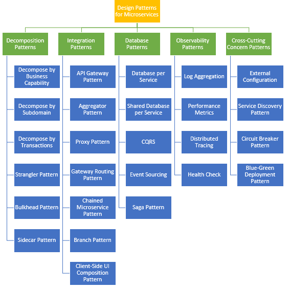
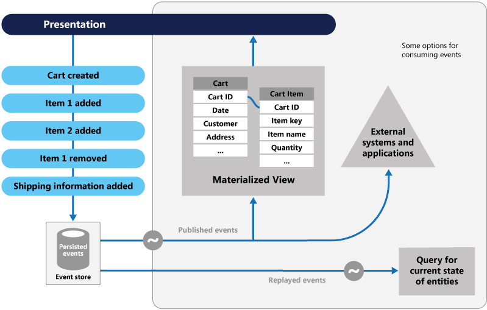
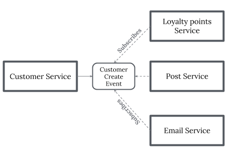
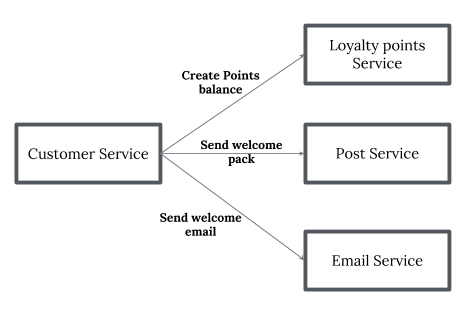
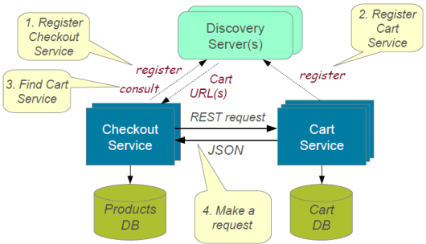
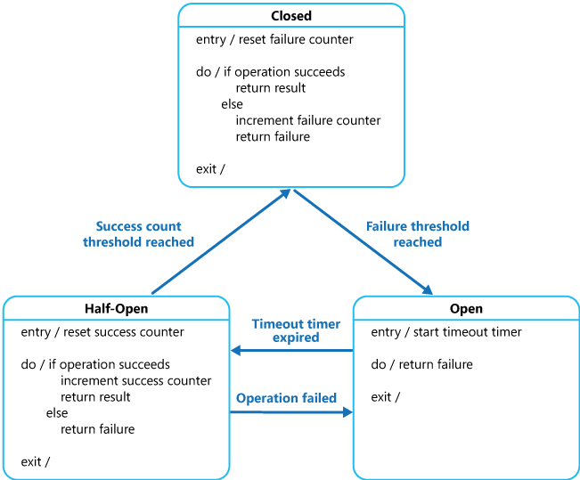
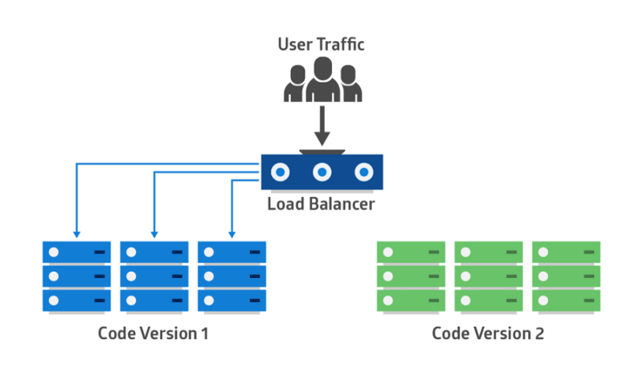

本文为翻译文章，[点击查看原文](https://dzone.com/articles/design-patterns-for-microservices-1)。

一篇杂烩文，虽然结构比较混乱，但是对微服务相关概念的介绍还是较为全面的。

微服务能在企业中发挥积极作用。因此了解微服务架构（MSA）设计的一般目标或原则，以及一些微服务的设计模式，都是是很有意义的。

- **降低成本**：MSA 降低了 IT 服务的设计、实现和管理的总体成本。
- **提高交付速度**：MSA 能够提高服务的实现速度。
- **增强健壮性**：MSA 能够增强我们服务网络的健壮性。
- **提供可视化支持**：MSA 能够为服务和网络提供更好的可视化支持。

你需要理解微服务架构的构建原则：

- 伸缩能力
- 可用性
- 健壮性
- 弹性
- 独立的匿名服务
- 去中心化的治理
- 故障隔离
- 自动供给
- 通过 DevOps 实现持续交付

在系统建设中，坚持上述原则会遭遇很多挑战和问题。这些问题在很多解决方案中都会出现。如果能够正确的使用合适的设计模式，就能够克服这些问题。微服务的设计模式可以分为五大类，每个大类中都包含一些设计模式。

## 拆分模式

根据业务能力进行分解的方式，能降低服务耦合度，实现单一职责的服务目标。这里说的业务能力是来自业务架构模型的一个概念，是企业用来创造价值的行为。业务能力通常对应到业务对象上，例如：

- 订单管理负责订单
- 客户管理负责客户

### 利用子域进行拆分

使用业务能力对应用进行拆分是个好的开端，但是往往会遇到不易分解的超级类。这种超级类在很多服务中都很普遍。用 DDD 子域来进行服务的定义。DDD 把应用的问题空间（业务）当作领域。一个领域由多个子域ugoucheng。每个子域负责业务的不同部分。子域可以分为几类：

- 核心：业务中的关键差异因素，也是应用程序中的价值核心。
- 支撑：和业务有关，但并非关键差异；可以自建，也可以外包。
- 通用：并不针对业务，理想情况下，可以使用现成的软件实现。

订单管理的子域包括：

- 产品类目服务
- 库存管理服务
- 订单管理服务
- 配送管理服务

### 根据事务、两段提交进行拆分

这种模式可以分解事务上的服务，这样系统中就会有会有多个事务。分布式事务中的一个重要概念就是事务协调者。分布式事务由两个步骤组成：

- 准备阶段：这个阶段中，事务的所有参与者都做好准备，并通知事务协调者，它们已经准备好完成事务。

- 提交或归滚阶段：这个阶段里，事务协调者会向所有参与方发出提交或回滚命令。

相对于单一微服务来说，两端提交的问题就是慢。在微服务之间进行事务协调，就算是在同一网络中，也会拖慢系统；所以这种方式在高负载场景中并不常见。

### 绞杀者模式

前面三个设计模式都是对绿地应用进行拆分，但是还有 80% 的棕地需要对付——它们是传统、庞大的单体应用。绞杀模式为此而生。这种模式会创建两个独立的应用，一同运行在同样的 URI 空间中。随着时间点的推移，新的重构了的应用会绞杀或者替换掉原有应用，最后就可以关掉单体应用了。这种模式分为转换、共存和终结三个步骤。

- 转换：用现代的方式创建一个并行的新站点。
- 共存：现存站点保持原样一段时间。从现存站点重定向到新站点，渐进式的实现功能。
- 终结：从现存站点上移除旧的功能。

### 舱壁模式

这个模式把应用的元素隔离开来，这样一个失败之后，其它的还能继续工作。这个模式可以类比船体结构，因此被称为舱壁。根据消费者的负载以及可用性要求，把服务分割为不同的群。这种设计能够对故障进行隔离，即使遇到故障，也能为部分消费者提供服务。

### Sidecar 模式

这种模式把应用的组件部署到一个不同的容器中，从而更好地完成隔离和封装。这种模式让应用能够把多种组件和技术整合在一起。这种模式的情况很像摩托车的挎斗，因此被称为 Sidecar，Sidecar 附着在主应用上，并且为主应用提供支持能力。Sidecar 还和主应用共享同样的生命周期，它的创建和销毁都是和主应用同步进行的。Sidecar 模式有时也被称为 Sidekick 模式，这是本文中介绍的最后一个分解模式。

## 集成模式

### API 网关模式

应用被分解成更小的微服务之后，就会出现一些待解决的问题了。

- 如何处理来自不同渠道的不同微服务的调用
- 如何处理不同的协议
- 不同消费者可能需要不同格式的响应。

API 网关就是用来处理这类问题的。

- API 网关是所有微服务调用的单一入口。
- 可以作为代理服务器，将特定请求路由到特定微服务。
- 可以把调用结果进行聚合，发回给消费者。
- 可以为每种类型的客户端创建细粒度的 API。
- 还能转化请求和响应的协议。
- 可以代微服务进行认证、鉴权的工作。

### 聚合模式

业务功能被分拆为多个更小的代码段之后，如何把各个微服务返回的数据进行整合就是个问题了。这种责任不应该抛给消费者自行解决。

聚合模式可以解决这种问题。这种模式的关键是如何把多个不同服务的响应数据进行聚合，然后将最终响应发回给消费者。可以用两种方式来完成任务：

- 用一个复合微服务调用所有必须的微服务，把数据拼装成合适的结果发回给客户端。
- 用 API 网关把请求拆分为对多个微服务的调用，然后聚合返回结果发回给客户端。

如果这一过程中有业务逻辑，推荐使用复合微服务的方式。其它情况下，API 网关是个好方法。

### 代理模式

这种 API 网关只会使用 API 网关开放微服务。例如一个 API 网关有三个 API 模块：

- 移动 API：为 FTGO 手机客户端提供 API。
- 浏览器 API：为浏览器中运行的 JavaScript 应用提供 API。
- 公共 API：为第三方开发者提供的 API。

### 路由网关模式

这种 API 网关负责对请求进行路由。它通过将请求路由给特定服务的方式来完成 API 调用。当它接到请求的时候，会根据请求在路由表中查找合适的服务。举个例子来说，路由表可能会将一个 HTTP 方法和路径映射为服务的 HTTP URL。这种能力和 NGINX 等服务器的反向代理功能一致。

### 链式微服务模式

有的微服务会有多种依赖，例如销售服务依赖于产品和订单服务。链式微服务模式能够为请求提供合并的结果。

微服务 1 收到的请求会向后传递给微服务 2 和微服务 3。所有这些服务都是同步调用。

### 分支模式

微服务可能需要从多个数据源（或者微服务）获取数据。分支模式是聚合模式和链式模式的混合体，用来并行的处理和两个或更多个微服务进行交互。被调用的微服务可以是一个微服务组成的链条。分支模式还可以根据业务需要，调用多个或者一个微服务链条。

### 客户端 UI 分解模式

根据业务功能或者子域进行解耦，完成服务开发之后，负责用户体验的服务必须从多个微服务拉取数据。在单体服务的世界中，UI 接收到请求之后，只需要一次后端调用就能够获取所有数据，从而完成刷新或提交动作。然而现在不同了。在微服务的环境下，UI 要把页面/屏幕分割为多个区域。每个区域会调用独立的微服务来获取数据。AngularJS 或者 ReactJS 这样的框架能够简化这些工作。在单页面应用（SPA）中，每个微服务都有自己对应的页面组件。UI 团队要负责把多个特定服务的 UI 组件组装起来，形成页面骨架，最终完成整体页面/屏幕的输出。

## 数据库模式

在微服务中定义数据库架构，需要考虑几个要点：

- 服务必须松耦合。可以独立的被开发、部署以及扩缩容。
- 业务事务可能需跨越多个服务。
- 有的业务事务需要查询隶属于多个服务的多种数据。
- 数据库必须能够被复制或者共享从而满足规模要求。
- 不同服务有不同的数据存储需求。

### 服务独占数据库

为了满足上述要素，每服务必须拥有各自的数据库；数据库必须被特定服务所独占。对这些独占数据是不能直接访问的，只能通过微服务 API 进行数据访问。例如关系性数据库来说，可以用服务专属的数据表、专属结构或者专属数据库。

### 服务共享数据库

我们刚说过，微服务领域的理想情况就是每服务都独占数据库。那么共享数据库就是反模式的。但是在单体应用拆分为微服务的过程中可就每那么容易了。后面的阶段中，可以转向每服务独占数据库的模式。共享数据库并不理想，但是在迁移过程中是有用的。多数人会认为这不符合微服务需求，但是对于既有应用，这是一个好的拆分起点。绿地应用就不该这样了。

### 命令和查询的隔离（CQRS）

一旦实现了服务独占数据的模式，就有了拼接多个服务的数据的需要。CQRS 把应用分成两部分——命令和查询。

- 命令端用来处理创建、更新和删除。
- 查询端用物化视图来处理查询。

事件源模式会为任何数据变更创建事件。物化视图订阅事件流，以此来保持更新。事件源模式的典型用法就是根据数据来管理应用程序的当前状态。例如传统的增删改查模型是从存储读取数据的。这其中存在锁定数据的需要，通常要用事务来解决。

### 事件源模式

事件源模式定义了处理数据操作的方法，以事件序列进行驱动，每个事件都记录在只支持追加写入的存储之中。应用程序会发送一系列事件，这些事件把每个数据操作强制写入到存储之中进行持久化。每个事件代表对数据的一些修改（例如 AddedItemToOrder）。这些事件保存在事件库中。事件库中发布的事件，其典型用途就是在应用修改实体时，维持物化视图的状态，可以用于外部系统的集成。例如一个系统可以维护一个所有客户订单的物化视图，这个视图用于在 UI 中展示。在应用加入新订单、或者在订单的项目中进行增删以及修改送货信息时，这些变更产生的事件就可以用来更新物化视图。下图描述了这个模式的概况。

### Saga 模式

在每个服务都有了自己的数据库之后，如果出现了跨服务的事务的时候，如果确认服务的数据一致性呢？在请求失败时，每个请求都要执行一个补偿请求。可以用两种方式来实现。

- 没有中央协调机制，每个服务都会生成事件，也监听别的服务的事件，从而对是否采取动作进行决策。这是一种两方或多方的协作方式，任何一方都没有控制其它成员的能力，甚至可能对其它成员都是不可见的。这种做法能够对活动进行协调，并且能分享信息和价值。在跨越域或者可见区域进行协调时就可以用这种方法。在简单场景中，可以和网络协议类比，它定义了各参与方之间的请求和响应模式。

- 使用编排器负责决策，对业务逻辑进行排序。如果能够对过程中所有参与者都有控制权，并且他们都存在于同一个控制域，就可以控制活动的流程了。这种情况多见于组织内部的业务流程。

## 观察性模型

### 日志聚合

日志聚合针对的是包含多个服务的应用。请求经常会跨越多个服务实例。每个服务实例都生成标准格式的日志文件。我们需要一个中央日志服务，把各个服务实例的日志聚合起来。用户可以对日志进行搜索和分析。可以对日志系统进行配置，如果出现了特定信息，就触发告警。例如 PCF 的日志聚合器会从 PCF 的每个组件（router、controller、diego 等）和应用中搜集日志。AWS 的 Cloud Watch 也做了同样的事情。

### 性能指标

微服务架构下服务数量会急剧增加，就需要提高监控的重视程度，在问题发生时，才能及时的发送警报。需要有一个度量服务来收集各种统计信息。应用提供的报告和告警都应该发送给这个服务。聚合指标有两种模型：

- 推：服务把指标推送给监控服务，例如 NewRelic、AppDynamics
- 拉：监控服务自行拉取指标数据，例如 Prometheus。

### 分布式跟踪

微服务架构下，请求经常会跨越多个服务。每个服务又要用一个或多个操作，调用多个服务来处理请求。要对请求进行端到端的跟踪，有个跟踪 ID 会非常有帮助。可以用下列方法来引入事务 ID 从而解决这一问题：

- 为每个外部请求分配一个唯一的外部请求 ID。
- 把外部请求的 ID 传递到所有服务。
- 在所有日志信息中输出这一外部的请求 ID。

### 健康检查

实现了微服务架构之后，微服务自身可能出现无法处理业务的情况。每个服务都需要有一个端点，用来检查应用的健康情况。这个 API 可以检查主机的状态、到其它服务、基础设施的连接情况，以及一些别的逻辑。

## 跨领域模式

### 外部配置

服务通常会调用其它服务以及数据库。多个环境中，例如开发、测试、生产等，端点地址或者一些配置属性可能不同。这些属性中的任何变动都可能需要服务的重新构建和部署。为了这种情况，建议使用外部配置，例如 URL 和登录凭据。应用应该在启动时或者随时载入配置。

### 服务发现模式

实现微服务时，我们需要解决一些调用服务的问题。在容器环境中，IP 地址是动态分配给服务实例的。每一次地址变更，消费者服务都会受到影响，需要随之变更。消费者服务需要记住每个服务的地址，这样就形成了一种紧耦合。可以创建服务注册表，用于保存每个生产者服务的元数据以及规范信息。服务实例在启动时应该进行注册，并在关闭时解除注册。服务发现有两种方式：

- 客户端：例如 Netflix Eureka。
- 服务端：例如 AWS ALB。

### 熔断模式

服务通常需要调用其它服务来获取数据，有时候下游服务会出现故障无法提供服务。这种情况下有两个问题：首先请求会持续发送给宕机的服务，耗尽网络资源，降低性能；其次，用户体验会变差，结果也无法预测。消费者应该通过代理服务器调用远程服务，这个代理可以扮演电路中的熔断器的角色。当错误持续出现到一个阈值时，熔断行为被触发，在一定时间内，所有调用该服务的请求都会立刻失败。时间窗口过后，熔断器允许一定数量的访问尝试。如果这些尝试成功了，熔断器恢复为正常的放行状态；如果再次出现故障，就再次进入开路状态。要调用一个容易故障的服务或共享资源，这种模式非常有用。

### 蓝绿部署模式

在微服务架构中，一个应用会由多个服务构成，如果停掉所有服务，部署一个增强版本，停机时间会对业务造成很大影响。同样回滚过程也会是一个噩梦。蓝绿部署模式避免了这种问题。蓝绿部署的策略能够降低或免除服务的停机时间。这种策略同时运行两个一致的生产环境，用这种方式来解决问题。假设绿色是现存的服务实例，而蓝色是新版本。任何时间里，只有一个环境是在线的，这个在线环境会处理所有生产通信。所有的云平台都提供了蓝绿部署的支持。

