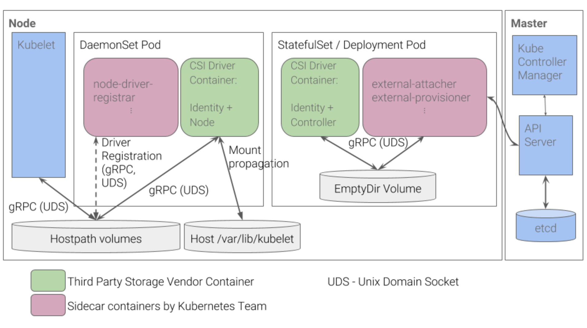
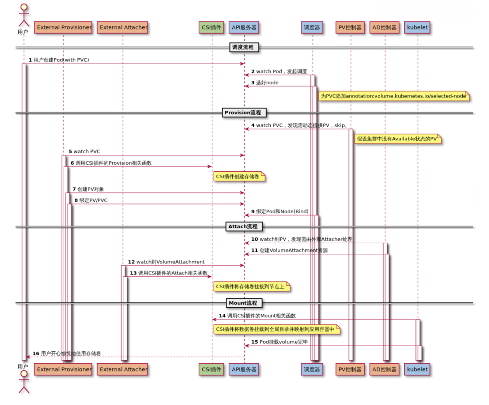
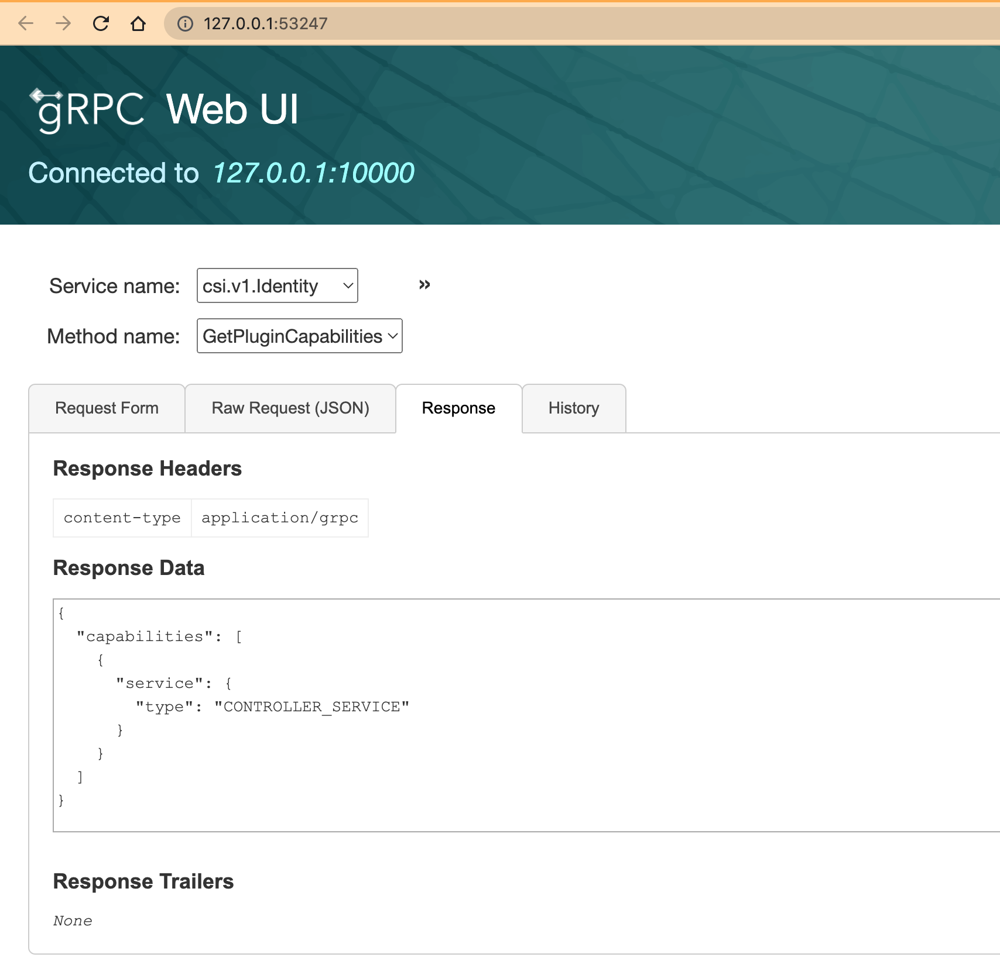
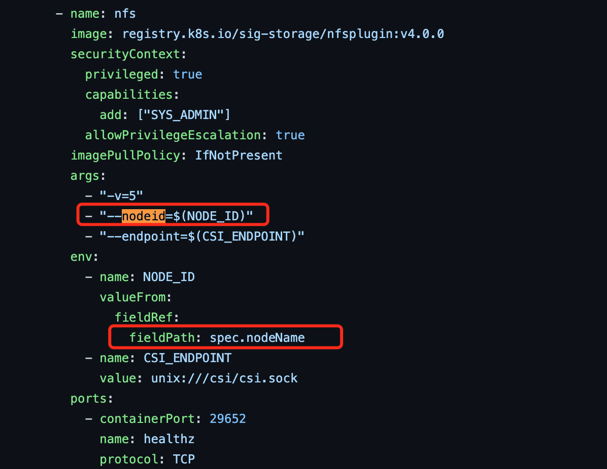

## 前言

外部存储接入 Kubernetes 的方式主要有两种：In-Tree 和 Out-of-Tree。其中 In-Tree 是指存储驱动的源码都在 Kubernetes 代码库中，与 Kubernetes 一起发布、迭代、管理，这种方式灵活性较差，且门槛较高。Out-of-Tree 是指存储插件由第三方编写、发布、管理，作为一种扩展与 Kubernetes 配合使用。Out-of-Tree 主要有 FlexVolume 和 CSI 两种实现方式，其中，FlexVolume 因为其命令式的特点，不易维护和管理，从 Kubernetes v1.23 版本开始已被弃用。因此 CSI 已经成为 Kubernetes 存储扩展（ Out-of-Tree ）的唯一方式。

## CSI 组成



参考上图（[图片出处](https://discuss.kubernetes.io/t/understanding-csi-architecture-and-communication/9404/2)），通常情况下：**CSI Driver = DaemonSet + Deployment(StatefuleSet)**。

其中：

- 绿色部分：**Identity、Node、Controller** 是需要开发者自己实现的，被称为 **Custom Components**。
- 粉色部分：**node-driver-registrar、external-attacher、external-provisioner** 组件是 Kubernetes 团队开发和维护的，被称为 **External Components**，它们都是以 **sidecar** 的形式与 **Custom Components** 配合使用的。

### Custom Components

Custom Components 本质是3个 gRPC Services：

- **Identity Service**
  
    顾名思义，主要用于对外暴露这个插件本身的信息，比如驱动的名称、驱动的能力等：
    
    ```protobuf
    service Identity {
      rpc GetPluginInfo(GetPluginInfoRequest)
        returns (GetPluginInfoResponse) {}
    
      rpc GetPluginCapabilities(GetPluginCapabilitiesRequest)
        returns (GetPluginCapabilitiesResponse) {}
    
      rpc Probe (ProbeRequest)
        returns (ProbeResponse) {}
    }
    ```
    
- **Controller Service**
  
    主要定义一些**无需在宿主机上执行**的操作，这也是与下文的 Node Service 最根本的区别。以 `CreateVolume` 为例，k8s 通过调用该方法创建底层存储。比如底层使用了某云供应商的云硬盘服务，开发者在 `CreateVolume` 方法实现中应该调用云硬盘服务的创建/订购云硬盘的 API，调用 API 这个操作是不需要在特定宿主机上执行的。
    
    ```protobuf
    service Controller {
      rpc CreateVolume (CreateVolumeRequest)
        returns (CreateVolumeResponse) {}
    
      rpc DeleteVolume (DeleteVolumeRequest)
        returns (DeleteVolumeResponse) {}
    
      rpc ControllerPublishVolume (ControllerPublishVolumeRequest)
        returns (ControllerPublishVolumeResponse) {}
    
      rpc ControllerUnpublishVolume (ControllerUnpublishVolumeRequest)
        returns (ControllerUnpublishVolumeResponse) {}
    
      rpc ValidateVolumeCapabilities (ValidateVolumeCapabilitiesRequest)
        returns (ValidateVolumeCapabilitiesResponse) {}
    
      rpc ListVolumes (ListVolumesRequest)
        returns (ListVolumesResponse) {}
    
      rpc GetCapacity (GetCapacityRequest)
        returns (GetCapacityResponse) {}
    
      rpc ControllerGetCapabilities (ControllerGetCapabilitiesRequest)
        returns (ControllerGetCapabilitiesResponse) {}
    
      rpc CreateSnapshot (CreateSnapshotRequest)
        returns (CreateSnapshotResponse) {}
    
      rpc DeleteSnapshot (DeleteSnapshotRequest)
        returns (DeleteSnapshotResponse) {}
    
      rpc ListSnapshots (ListSnapshotsRequest)
        returns (ListSnapshotsResponse) {}
    
      rpc ControllerExpandVolume (ControllerExpandVolumeRequest)
        returns (ControllerExpandVolumeResponse) {}
    
      rpc ControllerGetVolume (ControllerGetVolumeRequest)
        returns (ControllerGetVolumeResponse) {
            option (alpha_method) = true;
        }
    }
    ```
    
- **Node Service**
  
    定义了**需要在宿主机上执行**的操作，比如：mount、unmount。在前面的部署架构图中，Node Service 使用 **Daemonset** 的方式部署，也是为了确保 Node Service 会被运行在每个节点，以便执行诸如 mount 之类的指令。
    
    ```protobuf
    service Node {
      rpc NodeStageVolume (NodeStageVolumeRequest)
        returns (NodeStageVolumeResponse) {}
    
      rpc NodeUnstageVolume (NodeUnstageVolumeRequest)
        returns (NodeUnstageVolumeResponse) {}
    
      rpc NodePublishVolume (NodePublishVolumeRequest)
        returns (NodePublishVolumeResponse) {}
    
      rpc NodeUnpublishVolume (NodeUnpublishVolumeRequest)
        returns (NodeUnpublishVolumeResponse) {}
    
      rpc NodeGetVolumeStats (NodeGetVolumeStatsRequest)
        returns (NodeGetVolumeStatsResponse) {}
    
      rpc NodeExpandVolume(NodeExpandVolumeRequest)
        returns (NodeExpandVolumeResponse) {}
    
      rpc NodeGetCapabilities (NodeGetCapabilitiesRequest)
        returns (NodeGetCapabilitiesResponse) {}
    
      rpc NodeGetInfo (NodeGetInfoRequest)
        returns (NodeGetInfoResponse) {}
    }
    ```
    

以上定义取自 [csi.proto](https://github.com/container-storage-interface/spec/blob/master/csi.proto)，使用的是 [Protocol Buffers](https://grpc.io/docs/what-is-grpc/introduction/) 描述语言。

### External Components

External Components 都是以 sidecar 的方式提供使用的。当开发完三个 Custom Components 之后，开发者需要根据存储的特点，选择合适的 sidecar 容器注入到 Pod 中。这里的 External Components 除了前面图中提到的 node-driver-registrar、external-attacher、external-provisioner 还有很多，可以参考[官方文档](https://kubernetes-csi.github.io/docs/sidecar-containers.html#kubernetes-csi-sidecar-containers)，这里对常用的 sidecars 做一些简单介绍：

- **[livenessprobe](https://kubernetes-csi.github.io/docs/livenessprobe.html#csi-livenessprobe)**
  
    `liveessprobe` 监视 CSI 驱动程序的运行状况，并将其报告给 Kubernetes。这使得 Kubernetes 能够自动检测驱动程序的问题，并重新启动 pod 来尝试修复问题。
    
- **[node-driver-registrar](https://kubernetes-csi.github.io/docs/node-driver-registrar.html#csi-node-driver-registrar)**
  
     `node-driver-registrar` 可从 CSI driver 获取驱动程序信息（通过 `NodeGetInfo` 方法），并使用 kubelet 插件注册机制在该节点上的 kubelet 中对其进行注册。
    
- **[external-provisioner](https://kubernetes-csi.github.io/docs/external-provisioner.html#csi-external-provisioner)**
  
    `external-provisioner` 组件对于块存储（如 ceph）非常关键。它监听 `PersistentVolumeClaim` 创建，调用 CSI 驱动的 `CreateVolume` 方法创建对应的底层存储（如 ceph image），一旦创建成功，provisioner 会创建一个 `PersistentVolume` 资源。当监听到 `PersistentVolumeClaim` 删除时，它会调用 CSI 的 `DeleteVolume` 方法删除底层存储，如果成功，则删除 `PersistentVolume`。
    
- **[external-attacher](https://kubernetes-csi.github.io/docs/external-attacher.html#csi-external-attacher)**
  
    用于监听 Kubernetes `VolumeAttachment` 对象并触发 CSI 的 `Controller[Publish|Unpublish]Volume` 操作。
    
- **[external-resizer](https://kubernetes-csi.github.io/docs/external-resizer.html#csi-external-resizer)**
  
    监听 `PersistentVolumeClaim` 资源修改，调用 CSI `ControllerExpandVolume` 方法，来调整 volume 的大小。
    

External Components 与 Custom Components 共同组成部署 yaml ，可以参考 ceph-csi 的部署yaml：

- [csi-rbdplugin-provisioner.yaml](https://github.com/ceph/ceph-csi/blob/v3.0.0/deploy/rbd/kubernetes/csi-rbdplugin-provisioner.yaml)
- [csi-rbdplugin.yaml](https://github.com/ceph/ceph-csi/blob/v3.0.0/deploy/rbd/kubernetes/csi-rbdplugin.yaml)

ps：其中 cephcsi 镜像是开发者实现的，包含所提的3个 gRPC 服务。

## 动态卷供应（Dynamic Volume Provisioning）执行过程

为了实现 Identity、Node、Controller 3个服务，需要清楚动态卷供应的执行过程。



（[图片出处](https://kingjcy.github.io/post/cloud/paas/base/kubernetes/k8s-store-csi)）

```
	 CreateVolume +------------+ DeleteVolume
 +------------->|  CREATED   +--------------+
 |              +---+----^---+              |
 |       Controller |    | Controller       v
+++         Publish |    | Unpublish       +++
|X|          Volume |    | Volume          | |
+-+             +---v----+---+             +-+
                | NODE_READY |
                +---+----^---+
               Node |    | Node
              Stage |    | Unstage
             Volume |    | Volume
                +---v----+---+
                |  VOL_READY |
                +---+----^---+
               Node |    | Node
            Publish |    | Unpublish
             Volume |    | Volume
                +---v----+---+
                | PUBLISHED  |
                +------------+
```

（内容取自[csi-spec](https://github.com/container-storage-interface/spec/blob/master/spec.md)）

CSI Dynamic Volume Provisioning 大致流程如下：

1. 用户创建 pod + pvc。
2. VolumeController 的 PersistentVolumeController 控制循环监听到 pvc 创建，发现使用的是 Out-of-Tree 模式，跳过。该控制循环主要负责 In-Tree 模式下 pv 和 pvc 的绑定。
3. external-provisioner 监听到 pvc 创建：
  - 调用 Controller Service 的 `CreateVolume` 方法创建底层存储 Volume。此时 Volume 属于 **CREATED** 状态，仅在存储系统中存在，对于所有的 Node 或者 Container 都是不可感知的。
  - 创建 pv。
  - 将 pv 与 pvc 绑定（绑定：将这个 pv 对象的名字填在 pvc 对象的 spec.volumeName 字段上）。
4. VolumeController 的 AttachDetachController 控制循环发现 Volume 未被挂载到宿主机，需要 Attach 操作，于是创建 `VolumeAttachment` 对象。
5. external-attacher 监听到 `VolumeAttachment` 资源创建后，调用 Controller Service 的 `ControllerPublishVolume` 方法。此时，Volume 处于 **NODE_READY** 状态，即：Node 可以感知到 Volume，但是容器内依然不可见。
6. kubelet 的 VolumeManagerReconciler 控制循环：
  - 执行 MountDevice 操作，调用 Node Service 的 `NodeStageVolume` 方法。该方法主要实现对 Volume 格式化，然后挂载到一个临时目录（Staging 目录）上，经过此操作后，Volume 进入 **VOL_READY** 状态。
  - 执行 SetUp 操作，调用 Node Service 的 `NodePublishVolume` 方法：将 Staging 目录，绑定挂载到 Volume 对应的宿主机目录上，Volume 进入 **PUBLISHED** 状态，用户此时可以正常使用。

## CSI 开发

### 从零开始实现一个 nfs-csi

直接实现 ceph-csi 代码量比较多，且需要基于 ceph 集群调试，对新手不太友好。所以本文先从一个简单的 nfs-csi 入手，再分析 ceph-csi 的核心代码。首先是框架搭建，因为逻辑并不复杂，所以采用一种比较扁平的目录设计：

```
.
├── Dockerfile
├── LICENSE
├── Makefile
├── README.md
├── driver
│   ├── controller_server.go
│   ├── driver.go
│   ├── identity_server.go
│   ├── node_server.go
│   ├── server.go  // 对 gRPC Server 的一个简单封装
│   └── utils.go   // 工具函数
├── yamls    // 存放部署和测试yaml
├── go.mod
├── go.sum
└── main.go  // 入口文件
```

起一个 gRPC Server，把3个服务注册到 CSI：

```go
func (s *nonBlockingGRPCServer) serve(endpoint string, ids csi.IdentityServer, cs csi.ControllerServer, ns csi.NodeServer) {

	proto, addr, err := ParseEndpoint(endpoint)
	if err != nil {
		klog.Fatal(err.Error())
	}

	if proto == "unix" {
		addr = "/" + addr
		if err := os.Remove(addr); err != nil && !os.IsNotExist(err) {
			klog.Fatalf("Failed to remove %s, error: %s", addr, err.Error())
		}
	}

	listener, err := net.Listen(proto, addr)
	if err != nil {
		klog.Fatalf("Failed to listen: %v", err)
	}

	opts := []grpc.ServerOption{
		grpc.UnaryInterceptor(LogGRPC),
	}
	server := grpc.NewServer(opts...)
	s.server = server

	if ids != nil {
		csi.RegisterIdentityServer(server, ids)
	}
	if cs != nil {
		csi.RegisterControllerServer(server, cs)
	}
	if ns != nil {
		csi.RegisterNodeServer(server, ns)
	}

	klog.Infof("Listening for connections on address: %#v", listener.Addr())
	reflection.Register(server)

	err = server.Serve(listener)
	if err != nil {
		klog.Fatalf("Failed to serve grpc server: %v", err)
	}
}
```

不同于平时写 gRPC 服务所用的 endpoint `tcp://127.0.0.1:10000`，csi gRPC 是基于 UDS（UNIX Domain Socket）`unix://tmp/csi.sock`。UDS 是一种 IPC 通信机制，不需要经过网络协议栈，不需要打包拆包、计算校验和、维护序号和应答等，在同一台主机的通信中具有更高的性能。

### 关于 Debug

因为开发 csi 驱动本质是开发 gPRC 服务，常用的 gPRC 调试工具：grpcui、grpcurl 都是可以用来调试的，下图是 grpcui 使用界面 :



除此之外还有一款 [csc](https://github.com/rexray/gocsi/tree/master/csc) 工具，配置一些简单的环境变量后，可以通过命令行的方式调用接口（[使用文档](https://github.com/kubernetes-csi/csi-driver-nfs/blob/master/docs/csi-dev.md)）：

```bash
$ csc identity plugin-info --endpoint "$endpoint"
"nfs.csi.k8s.io"    "v2.0.0"
```

### Identity 实现

gPRC 架子搭好后可以开始实现接口，从最简单的 Identity 服务开始：

```go
func (ids *IdentityServer) GetPluginInfo(ctx context.Context, req *csi.GetPluginInfoRequest) (*csi.GetPluginInfoResponse, error) {
	return &csi.GetPluginInfoResponse{
		Name:          ids.Driver.name,
		VendorVersion: ids.Driver.version,
	}, nil
}

func (ids *IdentityServer) Probe(ctx context.Context, req *csi.ProbeRequest) (*csi.ProbeResponse, error) {
	return &csi.ProbeResponse{Ready: &wrappers.BoolValue{Value: true}}, nil
}

func (ids *IdentityServer) GetPluginCapabilities(ctx context.Context, req *csi.GetPluginCapabilitiesRequest) (*csi.GetPluginCapabilitiesResponse, error) {
	return &csi.GetPluginCapabilitiesResponse{
		Capabilities: []*csi.PluginCapability{
			{
				Type: &csi.PluginCapability_Service_{
					Service: &csi.PluginCapability_Service{
						Type: csi.PluginCapability_Service_CONTROLLER_SERVICE,
					},
				},
			},
		},
	}, nil
}
```
其中：
- `GetPluginInfo` 接口返回驱动的名称和版本信息，比如 ceph-csi 的名称：`rbd.csi.ceph.com`，该名称与 StorageClass yaml 中的 `provisioner` 字段对应：
  
    ```yaml
    ---
    apiVersion: storage.k8s.io/v1
    kind: StorageClass
    metadata:
       name: csi-rbd-sc
       provisioner: rbd.csi.ceph.com
    parameters:
    	 ...
    reclaimPolicy: Delete
    allowVolumeExpansion: true
    mountOptions:
       - discard
    ```
    
- `GetPluginCapabilities` 接口返回插件的能力，具体可以阅读 `csi.proto` 中关于 `PluginCapability` 的注释

### Controller 实现

接下来实现 Controller 服务。在 nfs CSI Controller 中，我们只需要实现 `CreateVolume`、`DeleteVolume`、`ControllerGetCapabilities` 即可。细心的伙伴可能会想到，nfs 其实也不用创建存储，直接挂载就可以使用：

```go
mount -t nfs server:/root/nfsroot /root/mnt/nfs
```

但是，为什么需要实现 `CreateVolume` 方法呢？

因为我们不能将同一个 nfs 目录挂载给多个 pod 使用，不是功能上不允许，而是权限上不应该。我们应该给每个 pv 建立一个独立的目录，这样互相之间不会影响。具体做法类似于执行：

```bash
# 先把 nfs root mount 到宿主机某一临时目录
mount -t nfs nfsServer:/root/nfs /tmp/nfs-root-78y88

# 进入 root 目录创建子目录
mkdir /tmp/nfs-root-78y88/pvc-31bf63ad-80c2-451c-a9c3-f80b9bad302c

# 卸载
umount /tmp/nfs-root-78y88
```

这样，在后续使用时直接挂载 `nfsServer:/root/nfs/pvc-31bf63ad-80c2-451c-a9c3-f80b9bad302c` 即可

`CreateVolume` 核心代码如下：

```go
func (cs *ControllerServer) CreateVolume(ctx context.Context, req *csi.CreateVolumeRequest) (*csi.CreateVolumeResponse, error) {
  ...
	nfsVol, err := cs.newNFSVolume(name, reqCapacity, req.GetParameters())
	if err != nil {
		return nil, status.Error(codes.InvalidArgument, err.Error())
	}

  ...
	// 把nfs root挂载到一个临时目录
	if err = cs.internalMount(ctx, nfsVol, volCap); err != nil {
		return nil, status.Errorf(codes.Internal, "failed to mount nfs server: %v", err.Error())
	}
	// 取消挂载（defer）
	defer func() {
		if err = cs.internalUnmount(ctx, nfsVol); err != nil {
			klog.Warningf("failed to unmount nfs server: %v", err.Error())
		}
	}()

  // 获取权限和子目录名
	fileMode := os.FileMode(cs.Driver.mountPermissions)
	internalVolumePath := cs.getInternalVolumePath(nfsVol)

  // 在nfs root目录中创建子目录
	if err = os.Mkdir(internalVolumePath, fileMode); err != nil && !os.IsExist(err) {
		return nil, status.Errorf(codes.Internal, "failed to make subdirectory: %v", err.Error())
	}
	
	...
	return &csi.CreateVolumeResponse{Volume: cs.nfsVolToCSI(nfsVol)}, nil
}
```

`DeleteVolume` 基本同 `CreateVolume`，只是 `mkdir` 换成 `rm` 即可。

`ControllerGetCapabilities` 返回 Controller 的能力：

```go
func (cs *ControllerServer) ControllerGetCapabilities(ctx context.Context, req *csi.ControllerGetCapabilitiesRequest) (*csi.ControllerGetCapabilitiesResponse, error) {
	return &csi.ControllerGetCapabilitiesResponse{
		Capabilities: []*csi.ControllerServiceCapability{
			{
				Type: &csi.ControllerServiceCapability_Rpc{
					Rpc: &csi.ControllerServiceCapability_RPC{
						Type: csi.ControllerServiceCapability_RPC_CREATE_DELETE_VOLUME,
					},
				},
			},
			{
				Type: &csi.ControllerServiceCapability_Rpc{
					Rpc: &csi.ControllerServiceCapability_RPC{
						Type: csi.ControllerServiceCapability_RPC_SINGLE_NODE_MULTI_WRITER,
					},
				},
			},
		},
	}, nil
}
```

### Node 实现

对于 nfs，Node 服务需要实现：`NodePublishVolume`、`NodeUnpublishVolume`、`NodeGetInfo`、`NodeGetCapabilities` 。

`NodeGetInfo` 返回当前 node 服务运行在哪个节点，其中，nodeId 是通过环境变量 `fieldRef` 注入的：



```go
func (ns *NodeServer) NodeGetInfo(ctx context.Context, req *csi.NodeGetInfoRequest) (*csi.NodeGetInfoResponse, error) {
	return &csi.NodeGetInfoResponse{
		NodeId: ns.Driver.nodeID,
	}, nil
}
```

`NodeGetCapabilities` 需要配置以下 3 种能力：

```
csi.NodeServiceCapability_RPC_GET_VOLUME_STATS
csi.NodeServiceCapability_RPC_SINGLE_NODE_MULTI_WRITER
csi.NodeServiceCapability_RPC_UNKNOWN
```

Node 服务的核心是 `NodePublishVolume` 方法，需要执行 mount 操作，等价于执行：

```bash
mount -t nfs nfsServer:/root/nfs/pvc-31bf63ad-80c2-451c-a9c3-f80b9bad302c /var/lib/kubelet/pods/aad09eed-e4a2-42ca-84e4-d8301c7d6257/volumes/kubernetes.io~csi/pvc-31bf63ad-80c2-451c-a9c3-f80b9bad302c/mount
```

`NodePublishVolume` 核心代码如下：

```go
// NodePublishVolume mount the volume
func (ns *NodeServer) NodePublishVolume(ctx context.Context, req *csi.NodePublishVolumeRequest) (*csi.NodePublishVolumeResponse, error) {
	 // 根据req获取source、targetPath
   ...
   
   // 把 nfsServer:/root/nfs/pvc-31bf63ad-80c2-451c-a9c3-f80b9bad302c 挂载到 /var/lib/kubelet/pods/aad09eed-e4a2-42ca-84e4-d8301c7d6257/volumes/kubernetes.io~csi/pvc-31bf63ad-80c2-451c-a9c3-f80b9bad302c/mount
   err = ns.mounter.Mount(source, targetPath, "nfs", mountOptions)
   if err != nil {
			// 错误处理
			// ...
   }
	 
	 // 修改目录权限
   if err := os.Chmod(targetPath, os.FileMode(ns.Driver.mountPermissions)); err != nil {
      return nil, status.Error(codes.Internal, err.Error())
   }
   return &csi.NodePublishVolumeResponse{}, nil
}
```

至此，一个简单的 nfs-csi 就实现完成了。

## Ceph-csi 核心源码解析

nfs 与 ceph 这类块存储不太相同，不需要创建磁盘（Provision）、把磁盘挂载到宿主机（Attach）操作，比如 ceph 中的：

```bash
rbd create -p pool-01 --image rbd-demo.img --size 10G
rbd map pool-01/rbd-demo.img
```

接下来我们简单看一下 ceph-csi 是如何用代码实现上述操作的。首先，在之前的 Dynamic Volume Provisioning 执行过程中已经讲过，Provision 应该是在 `CreateVolume` 方法中实现的：

```go
// CreateVolume creates the volume in backend
func (cs *ControllerServer) CreateVolume(ctx context.Context, req *csi.CreateVolumeRequest) (*csi.CreateVolumeResponse, error) {

	// 请求参数校验
	if err := cs.validateVolumeReq(ctx, req); err != nil {
		return nil, err
	}

	// 根据secret构建ceph请求凭证
	cr, err := util.NewUserCredentials(req.GetSecrets())
	if err != nil {
		return nil, status.Error(codes.Internal, err.Error())
	}
	defer cr.DeleteCredentials()

	// 处理请求参数，并转换为rbdVol结构体
	rbdVol, err := cs.parseVolCreateRequest(ctx, req)
	if err != nil {
		return nil, err
	}
	defer rbdVol.Destroy()

	// Existence and conflict checks
	// 检查并获取锁（同名存储在同一时间，只能做创建、删除等操作中的一个）
	if acquired := cs.VolumeLocks.TryAcquire(req.GetName()); !acquired {
		klog.Errorf(util.Log(ctx, util.VolumeOperationAlreadyExistsFmt), req.GetName())
		return nil, status.Errorf(codes.Aborted, util.VolumeOperationAlreadyExistsFmt, req.GetName())
	}
	defer cs.VolumeLocks.Release(req.GetName())

	// 幂等性
	found, err := checkVolExists(ctx, rbdVol, cr)
	if err != nil {
		if _, ok := err.(ErrVolNameConflict); ok {
			return nil, status.Error(codes.AlreadyExists, err.Error())
		}

		return nil, status.Error(codes.Internal, err.Error())
	}
	// 已经存在同名卷
	if found {
		if rbdVol.Encrypted {
			err = ensureEncryptionMetadataSet(ctx, cr, rbdVol)
			if err != nil {
				klog.Errorf(util.Log(ctx, err.Error()))
				return nil, err
			}
		}

		volumeContext := req.GetParameters()
		volumeContext["pool"] = rbdVol.Pool
		volumeContext["journalPool"] = rbdVol.JournalPool
		volume := &csi.Volume{
			VolumeId:      rbdVol.VolID,
			CapacityBytes: rbdVol.VolSize,
			VolumeContext: volumeContext,
			ContentSource: req.GetVolumeContentSource(),
		}
		if rbdVol.Topology != nil {
			volume.AccessibleTopology =
				[]*csi.Topology{
					{
						Segments: rbdVol.Topology,
					},
				}
		}
		return &csi.CreateVolumeResponse{Volume: volume}, nil
	}

	// 快照
	rbdSnap, err := cs.checkSnapshotSource(ctx, req, cr)
	if err != nil {
		return nil, err
	}

	// 预定 rbdVolume name ，并创建 volumeID
	err = reserveVol(ctx, rbdVol, rbdSnap, cr)
	if err != nil {
		return nil, status.Error(codes.Internal, err.Error())
	}
	defer func() {
		if err != nil {
			errDefer := undoVolReservation(ctx, rbdVol, cr)
			if errDefer != nil {
				klog.Warningf(util.Log(ctx, "failed undoing reservation of volume: %s (%s)"), req.GetName(), errDefer)
			}
		}
	}()

	// 创建image
	err = createBackingImage(ctx, cr, rbdVol, rbdSnap)
	if err != nil {
		return nil, err
	}

	if rbdVol.Encrypted {
		err = ensureEncryptionMetadataSet(ctx, cr, rbdVol)
		if err != nil {
			klog.Errorf(util.Log(ctx, "failed to save encryption status, deleting image %s"),
				rbdVol.RbdImageName)
			if deleteErr := deleteImage(ctx, rbdVol, cr); err != nil {
				klog.Errorf(util.Log(ctx, "failed to delete rbd image: %s/%s with error: %v"),
					rbdVol.Pool, rbdVol.RbdImageName, deleteErr)
				return nil, deleteErr
			}
			return nil, err
		}
	}

	volumeContext := req.GetParameters()
	volumeContext["pool"] = rbdVol.Pool
	volumeContext["journalPool"] = rbdVol.JournalPool
	volume := &csi.Volume{
		VolumeId:      rbdVol.VolID,
		CapacityBytes: rbdVol.VolSize,
		VolumeContext: volumeContext,
		ContentSource: req.GetVolumeContentSource(),
	}
	if rbdVol.Topology != nil {
		volume.AccessibleTopology =
			[]*csi.Topology{
				{
					Segments: rbdVol.Topology,
				},
			}
	}
	return &csi.CreateVolumeResponse{Volume: volume}, nil
}
```

创建磁盘镜像：

```go
import librbd "github.com/ceph/go-ceph/rbd"

func createImage(ctx context.Context, pOpts *rbdVolume, cr *util.Credentials) error {
	...

	err = librbd.CreateImage(ioctx, pOpts.RbdImageName,
		uint64(util.RoundOffVolSize(pOpts.VolSize)*util.MiB), options)
	if err != nil {
		return errors.Wrapf(err, "failed to create rbd image")
	}

	return nil
}
```

可以看到 ceph-csi 中是使用 **librbd** 库连接 ceph 集群进行 image 创建。除此之外，还需要注意 `CreateVolume` 实现的**幂等性**。因为 k8s 可能因为一些其他原因（比如网络超时重试）重复发送请求，实现中需要对此进行判断，不可重复创建。

接下来看 Attach，理论上 Attach 操作应该是在 `ControllerPublishVolume` 方法中实现的，但实际上 ceph 的 map 命令需要到对应的宿主机上才能执行，所以实现是在 `NodeStageVolume` 方法：

```go
func (ns *NodeServer) NodeStageVolume(ctx context.Context, req *csi.NodeStageVolumeRequest) (*csi.NodeStageVolumeResponse, error) {
	
  ...

	// perform the actual staging and if this fails, have undoStagingTransaction
	// cleans up for us
  transaction, err = ns.stageTransaction(ctx, req, volOptions, staticVol)
	if err != nil {
		return nil, status.Error(codes.Internal, err.Error())
	}

	...

	return &csi.NodeStageVolumeResponse{}, nil
}

func (ns *NodeServer) stageTransaction(ctx context.Context, req *csi.NodeStageVolumeRequest, volOptions *rbdVolume, staticVol bool) (stageTransaction, error) {
	...

	// Mapping RBD image
	var devicePath string
	devicePath, err = attachRBDImage(ctx, volOptions, cr)
  ...  

	stagingTargetPath := getStagingTargetPath(req)
  ...

	// 挂载到 nodeStage
	err = ns.mountVolumeToStagePath(ctx, req, staticVol, stagingTargetPath, devicePath)
	...

	// 设置权限
	err = os.Chmod(stagingTargetPath, 0777)

	return transaction, err
}

func attachRBDImage(ctx context.Context, volOptions *rbdVolume, cr *util.Credentials) (string, error) {
	...

	// 判断 image 是否已经 map 到 node 上
	devicePath, found := waitForPath(ctx, volOptions.Pool, image, 1, useNBD)
	if !found {
		backoff := wait.Backoff{
			Duration: rbdImageWatcherInitDelay,
			Factor:   rbdImageWatcherFactor,
			Steps:    rbdImageWatcherSteps,
		}

		err = waitForrbdImage(ctx, backoff, volOptions, cr)

		if err != nil {
			return "", err
		}

		// 执行 map 操作
		devicePath, err = createPath(ctx, volOptions, cr)
	}

	return devicePath, err
}

func createPath(ctx context.Context, volOpt *rbdVolume, cr *util.Credentials) (string, error) {

	// Map options
	mapOptions := []string{
		"--id", cr.ID,
		"-m", volOpt.Monitors,
		"--keyfile=" + cr.KeyFile,
		"map", imagePath,
	}
  
  ...

	// Execute map
	output, err := execCommand(rbd, mapOptions)
  
  ...

	return devicePath, nil
}
```

可以看到，attach实际就是执行 `rbd map` 指令，与之前的设想一致。函数嵌套比较深，此处只保留了核心代码，完整代码可以参考 [ceph-csi](https://github.com/ceph/ceph-csi)。

## 参考资料

- [https://github.com/kubernetes-csi/csi-driver-nfs](https://github.com/kubernetes-csi/csi-driver-nfs)
- [https://kubernetes-csi.github.io/docs/introduction.html](https://kubernetes-csi.github.io/docs/introduction.html)
- [https://github.com/container-storage-interface/spec/blob/master/spec.md](https://github.com/container-storage-interface/spec/blob/master/spec.md)
- [https://kingjcy.github.io/post/cloud/paas/base/kubernetes/k8s-store-csi/](https://kingjcy.github.io/post/cloud/paas/base/kubernetes/k8s-store-csi/)
- [https://github.com/ceph/ceph-csi](https://github.com/ceph/ceph-csi)
- 《深入剖析 Kubernetes》— 张磊