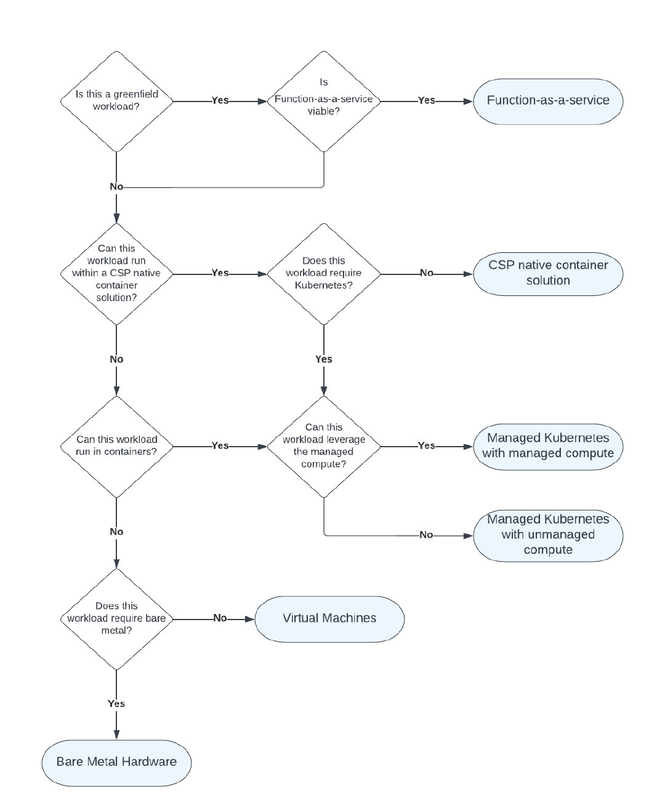
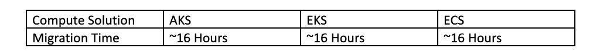
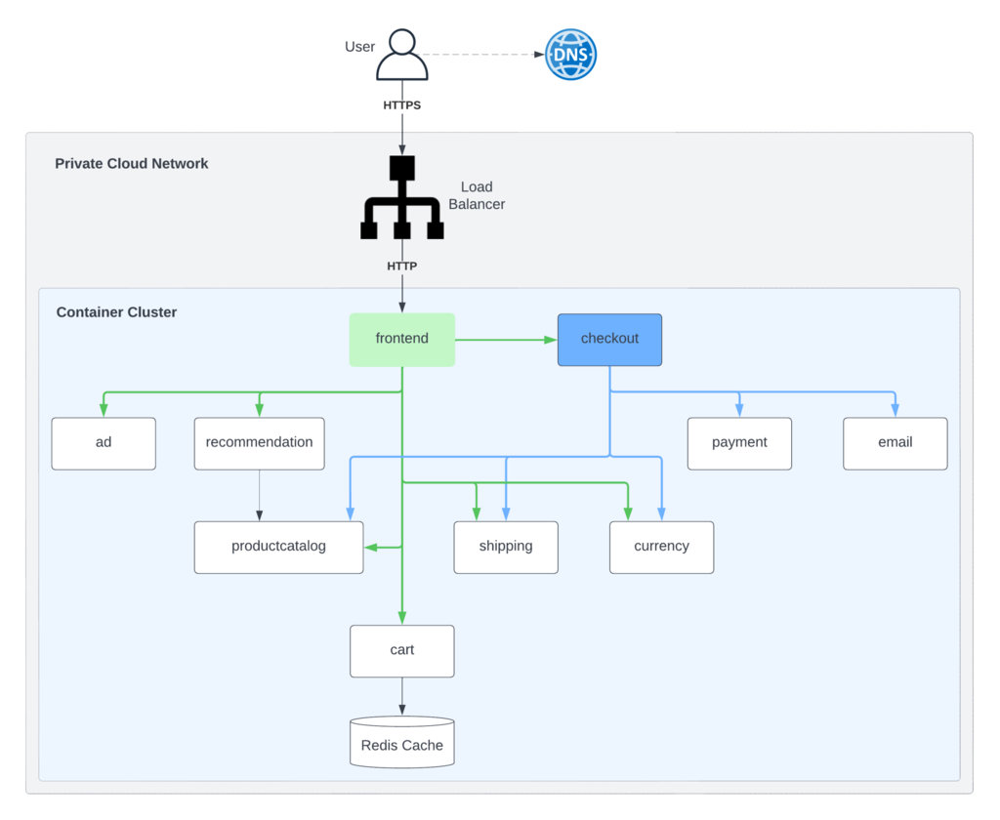
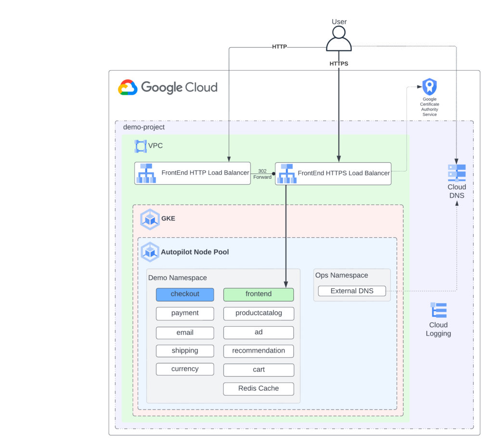
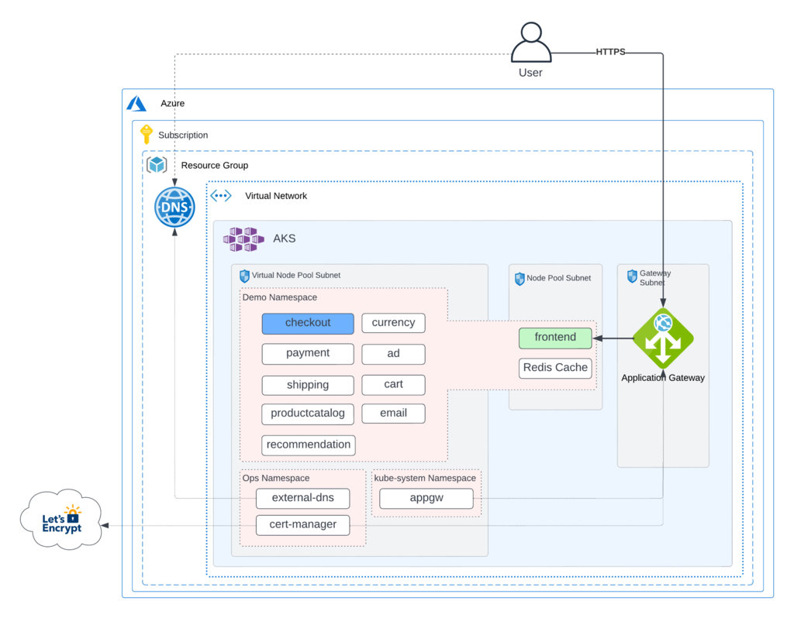
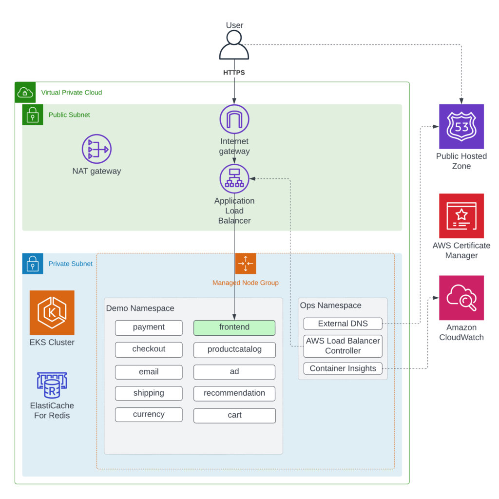
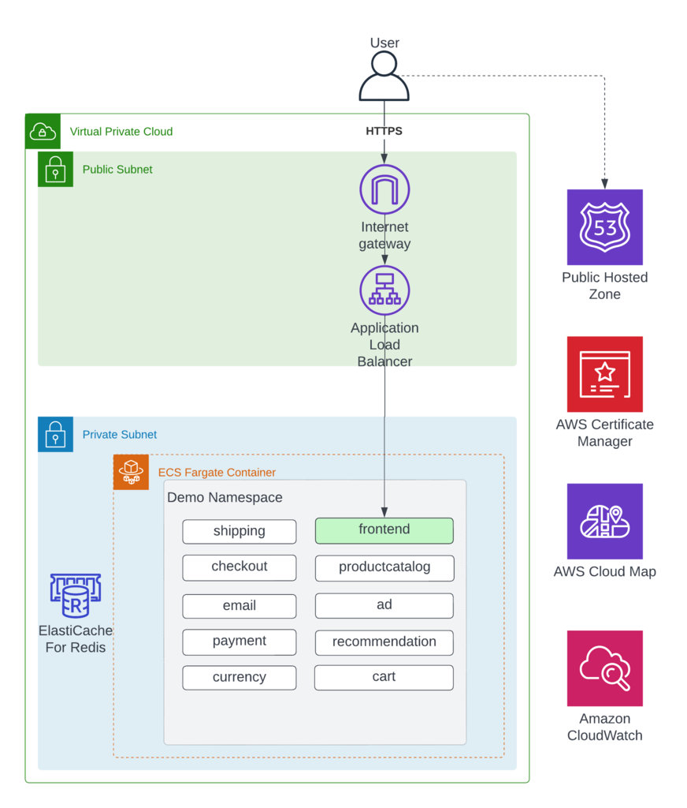

从 2017 年起我们就开始与 Kubernetes 社区合作，将 Kubernetes 作为后端容器编排平台，将无数应用程序迁移到云端。其中有些迁移进展顺利，而另一些则颇具挑战性。同样，我们利用云服务提供商（CSP）的本地容器编排解决方案来执行相同的操作，在易于迁移的情况下获得了类似的结果。本文无意讨论这些经验，也无意说明一种技术胜过另一种技术，而是讨论业务领导者和架构师选择利用 Kubernetes 的原因。

根据我们的经验，根据你的组织结构和运营模式，大规模利用 Kubernetes 比利用其他 CSP 原生解决方案，如 AWS Elastic Container Service（ECS）、AWS Batch、Lambda、Azure App Service、Azure Functions 或 Google Cloud Run 的开销更大。

Kubernetes 是一种开源容器编排引擎，其本质旨在在任何地方运行。它的架构在如何通过本地使用插件和扩展来实现这种可移植性方面非常出色。但是，**这是集群运维的责任**，由他们来管理和操作这些插件。我们知道，某些服务（如 EKS、GKE 和 AKS）正在努力改善这种体验。即使那样，你也必须选择你的 Kubernetes 版本，安装和配置插件，并确保你的部署清单、应用程序接口和 Kubernetes 集群公开的 API 以及这些插件之间的兼容性。我们知道这是大多数企业的 “正常” 维护，不会吓跑他们，但我们想问问为什么。你为什么要承担这项维护工作？当 CSP 原生解决方案保持其 API 的向后兼容性比 Kubernetes 长多年时，为什么要负担这部分开销？当我们推动这个话题时，最常见的反应是业务领导者和架构师担心供应商锁定和 / 或认为他们的应用程序必须在多个 CSP 中积极运行。但是，这些相同的组织中的大多数正在为其数据库利用 CSP 原生解决方案，并且在某些情况下，为其未开发的应用程序利用函数即服务（FaaS）功能。如果一家公司真的担心供应商锁定到这个水平，它应该完全依赖 Kubernetes，运行自己的数据库，并托管所有自己的工具和系统，而不是完全利用 CSP 原生解决方案。利用 FaaS 为其新建应用程序提供服务。

有些行业（高科技）可能需要工程能力才能在这个级别或规模上运行 Kubernetes，但大多数行业（银行、汽车、制造等）通常没有相同的业务驱动因素。如果你发现自己身处这样的行业，并希望最大限度地发挥云所能带来的价值，那么本文适合你。

我们实验的结果（详见下文）表明，给定一个应用程序设计为在一个 CSP 的托管 Kubernetes 中运行并与其他 CSP 的服务（例如 DNS、LB、数据库等）集成，它与将该应用程序迁移到另一个 CSP 管理的 Kubernetes 的努力，就像将该应用程序迁移到另一个 CSP 的原生容器编排服务一样。根据我们的调查结果，我们认为，那些仅仅为了未来的可移植性而默认使用 Kubernetes 的组织正在限制云可以为他们提供的价值，尤其是考虑到大量更广泛的技术驱动因素在起作用。对于要最大化云价值的组织，他们应该利用可用于给定工作负载的最高阶 CSP 原生云服务，

## 本实验

我们的工作假设托管 Kubernetes 是一个不错的选择，应用程序架构和数据引力都是云迁移的最大因素。在某些场景下，Kubernetes 是唯一的选择，例如无法在 Google Cloud Run 和 Azure App Service 中运行的应用程序。并非所有 CSP 都提供可以以与 Kubernetes 类似的方式编排容器的服务 —— 相反，这些 CSP 选择提供托管 Kubernetes。因此，我们不会分析属于此类的工作负载，因为如果确实需要多云，它们很可能默认属于 Kubernetes。

对于我们的实验，我们选择了一个由 Google 发布的 12-factor 应用程序，称为 [microservices-demo](https://github.com/GoogleCloudPlatform/microservices-demo)。然后，我们将应用程序置于谷歌云的 GKE、Azure AKS、AWS EKS 和 AWS ECS 中，并测量了使用 Kubernetes 在所有三个 CSP 之间迁移工作负载的工作量，以及将工作负载从 Google GKE 迁移到 AWS ECS 的工作量。工程工作的结果详述如下，记录的大部分工作是在初始系统设置中。我们认为，所有三种计算解决方案的进一步迁移将大大缩短，但计算解决方案之间也没有区别。

microservices-demo app 的应用架构如下：

在应用程序运行且日志中没有错误并将日志卸载到日志聚合解决方案后，我们认为 “迁移” 已完成。虽然我们承认需要更多的努力来准备好产品生产；应用程序本身不是生产就绪产品，因此我们省略了这个范围。我们还增加了挑战，即我们不会修改微服务演示应用程序的源代码，因为更改源代码可以使我们的工作更轻松并影响我们的发现。

## GKE

Google 在其 [microservices-demo](https://github.com/GoogleCloudPlatform/microservices-demo) 中提供了所需的 Kubernetes 部署配置；但是，它不提供必要基础设施的代码。我们选择使用 GKE-Autopilot 类型的集群部署，让部署和管理变得更加轻松。[Autopilot](https://cloud.google.com/kubernetes-engine/docs/concepts/autopilot-overview) 类型的部署确保了 GKE 提供和管理集群的底层基础设施，包括节点和节点池，为我们提供了一个优化的集群和一个无需干预的体验。下面是应用程序在 GKE 中运行的架构。

在 GKE 集群中启动和运行应用程序的过程如下：

1. 为 GKE 设置所需的 VPC。
2. 设置必要的 DNS 区域。external-dns 服务将使用这些区域为应用程序创建所需的 DNS 记录。
3. 使用 Autopilot 构建 GKE 集群
4. 设置必要的服务帐户权限，以允许 Autopilot 配置基本的集群监控功能。
5. 为 external-dns 创建必要的服务帐户来管理 DNS 记录。

Kubernetes 部署完成后，还需要为 Kubernetes 部署采取其他步骤：

1. 安装外部 DNS 服务。
2. **ManagedCertificate** 需要通过 **networking.gke.io/v1** API 为负载均衡器上使用的 SSL 证书定义。
3. 创建了一个使用 GKE [VPC 原生集群中](https://cloud.google.com/kubernetes-engine/docs/concepts/alias-ips)[的网络端点组 (NEG)](https://cloud.google.com/load-balancing/docs/negs#zonal-neg) 的**服务**定义。Ingress 是使用容器原生负载均衡的推荐方式，因为它具有许多可简化 NEG 管理的功能。当 [NEG 与 GKE Ingress 一起使用时](https://cloud.google.com/kubernetes-engine/docs/how-to/container-native-load-balancing)，Ingress 控制器有助于创建负载均衡器的所有方面，包括创建虚拟 IP 地址、转发规则、健康检查、防火墙规则等。
4. **FrontEndConfig** 定义是通过 networking.gke.io/v1beta1 API 创建的，以确保存在将 HTTP 流量重定向到 HTTPS 的规则。
5. 利用先前创建的服务和 FrontEndConfig 创建了一个新的 **Ingress 。**这个 Ingress 定义也将被 external-dns 服务利用，它将配置必要的记录以指向负载均衡器。

总的来说，集群的配置和带有额外配置的微服务演示的部署大约花了两天时间。

但是，必须注意定义负载均衡器配置并确保将 HTTP 重定向到 HTTPS 的 Ingress 规则使用的 API 仍处于测试阶段 (networking.gke.io/v1beta1)；此配置的另一个关键注意事项是 FrontEndConfig 还将创建另一个负载均衡器来转发流量，如下所示。

## AKS — 两天的迁移工作

对于 AKS，为了测试可移植性的易用性，我们决定使用利用 [AKS 虚拟节点](https://docs.microsoft.com/en-us/azure/aks/virtual-nodes)类型部署的 AKS 群集。使用虚拟节点，我们可以快速配置 pod，并且只需按秒为它们的执行时间付费。你无需等待 Kubernetes 集群自动缩放器部署 VM 计算节点来运行额外的 pod。但是，我们注意到微服务演示的**前端**和 **redis-cart** 部署的组件在特定负载下会间歇性地失败。因此，我们决定将这些组件部署到一个单独的节点池，并允许将剩余的服务部署到虚拟节点。下面是应用程序在 AKS 中运行的架构。

为了设置集群并部署微服务演示，我们采取了以下步骤：

1. 为 AKS 设置 Azure 网络。作为这项工作的一部分，创建了三个独立的子网，一个用于虚拟节点 (ACI)，一个供网关使用，另一个用于其余集群组件。
2. 设置必要的 DNS 区域。
3. 为 AKS 群集设置 Log Analytics 工作区。
4. 设置 AKS 群集。
5. 启用了以下 Kubernetes 附加组件：
6. 监控：Container Insights 监控集群
7. 虚拟节点 (ACI)：在集群中使用虚拟节点
8. ingress-appgw：带有 AKS 群集的应用程序网关入口控制器

基础设施完成后，需要完成以下 Kubernetes 部署配置：

1. 安装和配置**外部 DNS** 服务
2. 安装和配置**的证书管理器**服务
3. 更改了微服务演示提供的部署定义，以允许通过定义所需的 **nodeSelector** 和 **tolerations 在虚拟节点节点池上完成部署**
4. 需要定义使用 ingress-appgw 附加组件和 cert-manager 服务的 Ingress **。**这个 Ingress 定义也将被 external-dns 服务利用，它将配置必要的记录以指向网关。

总的来说，集群的配置和带有额外配置的微服务演示的部署大约花了两天时间。

但是，必须注意的是，由于整个 Kubernetes 体验所需的附加组件和服务，维护此集群所需的工作量增加了。与 GKE Autopilot 不同，需要使用虚拟节点和应用程序网关进行监控的 AKS 附加组件。此外，AKS 需要 cert-manager 服务来自动化负载均衡器上的证书管理。所有这些组件都需要集群管理员进行维护。

## EKS — 两天的迁移工作

考虑到我们拥有来自 GKE 部署的 Kubernetes 清单，将工作负载转移到 EKS 并不像你想象的那么简单。我们选择不将 Fargate 用于 EKS 实施，因为当时日志记录需要一个 sidecar，我们选择了运行 DaemonSet 的 EC2 来收集日志。下面是 EKS 迁移的架构，后面是对迁移过程的描述。

### 环境配置

1. 为 EKS 设置 VPC。
2. 设置 Route53 域。
3. 从 ACM 提供证书。
4. 构建 EKS 集群。
5. 为集群供应受管节点组。

### 迁移努力

1. 安装 Kubernetes 插件：
2. 外部 DNS 插件
3. AWS 负载均衡器控制器
4. 使用 Fluent Bit 的 AWS Container Insights
5. 修改 Kubernetes 清单以使用新插件：
6. 修改了 **nodeSelector** 和 **tolerations**
7. 为处理创建 ALB、管理 R53 记录和应用先前创建的证书的应用程序的外部公开端点创建入口定义

这个过程花了我们大约两天的时间，其中大部分时间用于分析我们需要哪些插件才能通过 EKS 生态系统实现我们的目标。

但是，与 AKS 配置非常相似，我们有一些插件需要安装、监控和运行，以便应用程序在 EKS 集群中成功运行。因此，组织将承担这些第三方插件的升级、维护和事件管理的负担。

## ECS — 两天的迁移工作

将工作负载转移到 ECS 起初似乎是一项艰巨的工作，但并不是那么具有挑战性。在让应用程序运行时，我们遇到了一个重大挑战。该应用程序使用其 GRPC 调用的不安全设置进行了硬编码。这导致了几个小时的挠头，因为我们可以直接访问容器，但无法通过 AWS Application Load Balancer 访问它们，因为 ALB 现在不支持 GRPC 的未加密流量。这不是 EKS 的问题，因为服务到服务的调用确实利用 ALB 进行东 / 西流量，以支持内置的 Kubernetes 服务。虽然这看起来像是一个障碍，但我们能够快速转向使用 AWS Cloud Map 来代替服务到服务的流量。解决 GRPC 问题后，ECS 解决方案的架构和步骤如下：

### 环境配置

1. 为 ECS 设置 VPC。
2. 设置 Route53 域。
3. 从 ACM 提供证书。
4. 设置 Cloud Map。
5. 设置配置了 Fargate 和 Container Insights 的 ECS 集群。

### ECS 迁移工作

1. 利用来自 GKE 部署的 Kubernetes 清单来编写将部署 ECS 任务、ECS 服务、Route53 记录、配置 ALB 和配置 Cloud Map 的 Terraform 脚本。

这个过程花了我们大约两天的时间，我们让应用程序运行并记录日志，而实现日志记录所需的虚拟机和插件为零。

ECS 与所有其他基于 Kubernetes 的部署之间最大的开发工作差异在于 ECS 任务和服务部署 Terraform 脚本的创建。这些花了一个下午的时间来编写，但是一旦我们编写了一次代码，我们就能够将它重新用于所有其他服务。在这种情况下，平台升级、维护和事件管理的维护负担转移到责任共担模型的 AWS 端，从而使组织的员工腾出时间来更多地关注驱动业务价值的差异化代码。

## 总结

总而言之，部署到托管 Kubernetes 不能被认为是完全可移植的（或可移植性的银弹），因为你需要安装和管理附加组件或服务以确保应用程序被部署和配置为它应该是样子。你在部署拓扑的核心组件上花费的时间更少，并且当你希望拥有关键功能时，大多数依赖于云的配置都会发挥作用，例如：

- 自动 DNS 记录管理
- 自动化托管证书
- 监控
- 负载均衡器管理
- 秘密整合
- 缩放

如果你使用托管节点（例如，AWS Fargate、AKS 虚拟节点、GKE Autopilot），你将遇到可能影响应用程序行为的限制，例如无法托管状态或使用守护进程集类型部署。回退到受管节点意味着，作为集群管理员，你现在负责管理升级和扩展。综上所述，Kubernetes 是企业维护性更高的解决方案，但这并不是坏事，因为它也是最灵活的解决方案。

虽然肯定存在与 CSP 服务相关的云可移植性问题，但我们认为将这些问题应用于容器编排时并没有多大意义。从 GKE 迁移到 ECS Fargate 的努力类似于从 GKE 迁移到 EKS/AKS 的努力，我们认为这证明了 “可移植性” 的论点并没有真正站得住脚。当你转向利用高阶计算服务并开始将你的数据也转移到 CSP 管理的服务时，云中的供应商锁定在某种程度上是不可避免的。Kubernetes 是一个强大的工具，如果你有充分的技术原因（其中有很多），或者只是需要应用程序在云内外运行，那么 Kubernetes 可能适合你。然而，如果你想了解有关容器和多云可移植性的更多信息，我们的同事最近发表了[一篇文章](https://www.mckinsey.com/business-functions/mckinsey-digital/our-insights/getting-the-most-from-cloud-services-and-containers)来讨论这一点。
