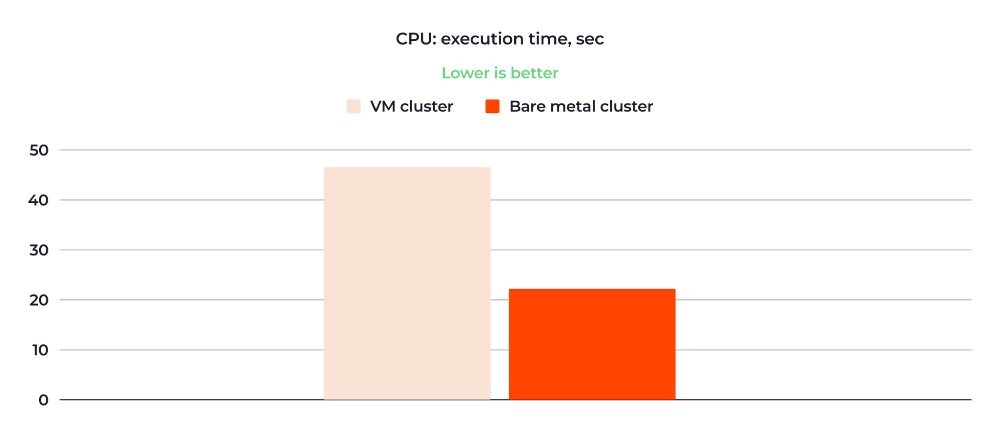

本文译自：<https://thenewstack.io/does-kubernetes-really-perform-better-on-bare-metal-vs-vms/>

摘要：本文对比了虚拟机和裸机上 Kubernetes 集群的 CPU、RAM、存储和网络性能的详细比较。

---

许多人认为部署在裸机上的 Kubernetes 集群比部署在虚拟机上的性能更好，但直到现在都没有关于这一假设的证据。在 Gcore，我们只提供基于充分证据的信息给客户，因此我们决定自行测试 Kubernetes 是否在[裸机上](https://thenewstack.io/bare-metal-in-a-cloud-native-world/)比在虚拟机上表现更好，如果是的话，差距有多大。我将分享我们内部测试的结果。

我故意不讨论虚拟节点与裸机节点竞争的其他方面，如[成本效益或基础设施控制级别](https://gcore.com/blog/kubernetes-on-bare-metal/)。这超出了本文的范围，本文只关注性能比较。

## VM 和裸机 Kubernetes 之间的区别

当您在虚拟机上部署 Kubernetes 集群时，与裸机（BM）相比，您会得到额外的基础设施层，即虚拟机监视器和客户操作系统。

图 1：裸机和虚拟机架构的差异。

这些层占用物理 CPU 和 RAM 来运行，从工作负载中拿走一些计算能力。虚拟化还会影响网络和存储性能：虚拟网络和存储比物理网络和存储慢。

相比之下，当您在[裸机服务器上部署 Kubernetes 集群](https://thenewstack.io/provision-bare-metal-kubernetes-with-the-cluster-api/)时，您没有任何额外的基础设施层和虚拟化。服务器的物理资源完全专用于您的工作负载，容器化应用程序可以直接访问这些资源。

## 我们如何比较虚拟机和裸机 K8s 性能

为了全面了解虚拟机和裸机集群性能的比较，我们测量了以下内容：

- **CPU：** 速度和利用率
- **RAM：** 延迟
- **存储：** 每秒事务（TPS）和延迟
- **网络：** 带宽和延迟

为了保持工作负载的一致性，所有测试应用程序都以容器化方式部署在比较的工作节点上。

### 我们的测试条件

在测试中，我们使用了运行在[Gcore 托管的 Kubernetes](https://gcore.com/cloud/managed-kubernetes)上的 K8s 集群。然而，由于托管的 Kubernetes 不会增加工作节点性能的任何开销，因此这些结果也与标准 Kubernetes 相关。

为了保持工作负载的相同条件，我们选择了相似的虚拟机和裸机工作节点的配置。以下是这种比较配置的示例：

- **裸机工作节点：** 1x Intel Xeon E-2388 8C/16T 3.2 GHz / 64 GB / Ubuntu 22.04
- **虚拟机工作节点：** 16 vCPU / 64 GiB 内存 / Ubuntu 22.04

## 测试结果摘要

在测试中，我们比较了两个 Kubernetes 集群，一个部署在虚拟机（VMs）上，另一个部署在裸机上。它们的配置相似。作为测试工作负载，我们运行了以下内容：

- 用于 CPU 测试的 CPU 基准测试
- 用于 RAM 测试的 Sysbench
- 用于存储测试的 Pgbench
- 用于网络测试的 Netperf

下面是总结最重要的测试结果的表格：

显然，裸机集群在所有情况下效率更高。

让我们详细查看结果，并确定裸机性能对您的工作负载意味着什么。

## 详细测试结果

现在，让我们详细查看每个评估标准下裸机和 VM 集群的性能。

## CPU 速度和利用率

对于 CPU 速度比较，我们使用了 Alex Dedyura 的 [CPU 基准测试](https://github.com/alexdedyura/cpu-benchmark)。这是一个计算到 10,000 位小数的 pi 的脚本。以秒为单位的计算时间，平均值在 10 次测试中被视为测试结果。计算 pi 是一个 CPU 密集型任务，因此该基准测试清晰地显示了被测试 CPU 的性能。

以下是 CPU 速度比较的结果：

图 3：裸机集群的 CPU 速度比虚拟机集群的 CPU 快了两倍多。

虚拟机集群的 10 次重试的平均时间为 47.07 秒；而裸机集群为 21.46 秒。因此，裸机集群快了两倍多。

以下是虚拟机集群的 CPU 利用率测试结果：

图 4：虚拟机集群的 CPU 平均利用率为 86.81%。

图 5：虚拟机集群 CPU 的每个核心使用信息。

在上图 4 中，红色点表示最大的 CPU 核心负载*，绿色表示所有核心的总 CPU 负载。在执行脚本期间，大部分时间内核心都以 100% 的利用率运行；平均值为 86.81%。还有一个小的窃取时间峰值，大约在 15:16（参见图 4），这是一个常见情况，当一个虚拟机由于等待物理 CPU 共享计算资源而没有运行时会发生。

***最大 CPU 核心负载：** 这个指标通常是指在虚拟机内或主机上所有虚拟机中观察到的单个 CPU 核心的最高利用率百分比。它表示在给定时刻一个特定的 CPU 核心有多重地被利用。

**总 CPU 核心负载：** 此指标表示主机机器上所有可用 CPU 核心的整体 CPU 利用率。它考虑了所有 CPU 核心的综合使用情况，提供了运行在主机上的所有虚拟机使用了多少 CPU 容量的综合视图。

以下是裸机集群的 CPU 利用率测试结果：

图 6：裸机集群的 CPU 平均利用率为 43.75%。

平均 CPU 负载约为 43.75%，最大负载为 62.57%，没有窃取时间。因此，就 CPU 性能而言，测试显示裸机集群约为虚拟机集群的两倍有效。

## RAM 延迟

对于 RAM 测试，[我们使用了 sysbench](https://github.com/akopytov/sysbench) 并通过 RAM 传输了 6400 GB 的数据。以下是执行的写入和读取操作的关键结果：

图 7：裸机集群的 RAM 大约比虚拟机集群的 RAM 快三倍。

虚拟机集群执行写入操作的平均时间为 174.53 毫秒，而裸机集群相同操作仅需 62.02 毫秒。读取操作分别在 173.75 和 47.33 毫秒内完成。

这意味着裸机集群的 RAM 大约比虚拟机集群的 RAM 快三倍。

## 存储 TPS 和延迟

为了测试存储性能，我们运行了一个 PostgreSQL 集群，并使用了 [pgbench 基准测试](https://www.postgresql.org/docs/current/pgbench.html)。我们测量了 TPS（每秒事务数）和延迟。我们还变化了工作负载，测试了相同集群配置下的 8 GB 和 75 GB 数据库。

以下是这些实例的配置：

图 8：存储测试的裸机和虚拟机集群配置。

### 存储 TPS 结果

以下是 TPS 比较的平均结果：

图 9：裸机集群的存储 TPS 值大约是虚拟机集群的两倍。

在运行 8 GB 数据库时，虚拟机集群显示了 7,359 TPS，而裸机集群为 14,087 TPS。75 GB 数据库的性能结果分别为 4,636 和 12,029 TPS。

### 存储延迟结果

以下是延迟测试的平均结果：

图 10：裸机在存储延迟方面优于虚拟机。

在运行 8 GB 数据库时，虚拟机集群的延迟为 34.78 毫秒，而裸机集群的延迟为 18.17 毫秒。对于 75 GB 数据库，延迟分别为 55.21 毫秒和 21.28 毫秒。

对于 8 GB 数据库，裸机集群的存储性能约为虚拟机集群的两倍。对于 75 GB 数据库，裸机集群相对于虚拟机集群的优势更加明显。

## 网络带宽和延迟

为了测试网络性能，我们使用了 [netperf 基准测试](https://github.com/kubernetes/perf-tests/tree/master/network/benchmarks/netperf)，其中 MSS（最大段大小）从 1 到 65,536 不等。MSS 中的“段”元素是在网络上传输的一种 IP 数据包捆绑。因此，MSS 越大，传输的流量就越多。

我们在两个物理节点上部署了三个工作节点：Worker 1 和 Worker 2 位于第一个节点上，而 Worker 3 位于第二个节点上。然后，我们测试了所有三个工作节点之间的网络性能。在所有情况下，结果趋势都相似 — 裸机优于虚拟机。

最有趣的测试是物理距离最远的测试之一，即 Worker 1/Worker 2（位于第一个节点上）与 Worker 3（位于第二个节点上）之间的距离，当流量在第一个和第二个物理节点之间传输时。我们可以将这看作是所有测试中最具挑战性的条件。图 10 和图 11 显示了此测试的结果。图 10 显示了 MSS 值为 1、2、4 和 8 时的网络带宽比较：

图 11：裸机集群的网络带宽比虚拟机集群的网络带宽大五倍。

虚拟机集群的带宽范围从 MSS=1 时的 862 KB/秒到 MSS=8 时的 6.52 MB/秒，而裸机集群的带宽在相同的 MSS 值范围内从 4.17 MB/秒到 31 MB/秒不等。平均而言，裸机集群的带宽比虚拟机集群的带宽大五倍。

图 12 显示了使用相同 MSS 值的网络延迟比较：

图 12：裸机集群的网络延迟比虚拟机集群的网络延迟低了多达六倍。

正如我们所见，当使用 MSS=8 时，虚拟机集群的延迟约为 145 微秒（us），而裸机的延迟为 24.5 微秒。此外，在裸机集群的情况下，随着 MSS 的增加，延迟增长较慢。

对于所有测试，请注意我们报告的是*内部*集群网络的网络性能比较。我们在一个网络中的节点之间测量了带宽和延迟，位于一个位置。如果我们使用不同位置的节点，这将增加互联网延迟，这是不稳定的，并且可能因提供商而异。我们保持了合成纯净的条件；这可能无法在实际环境中复制。但是，一般趋势可以预期会被重现。

## 裸机性能优势意味着什么

更好的裸机性能相对于虚拟机提供了两个简单但关键的优势：

- [部署在裸机工作节点上的应用程序](https://thenewstack.io/how-do-applications-run-on-kubernetes/)运行和响应速度比部署在虚拟机上的应用程序更快。
- 因此，当选择裸机时，客户在使用您的产品时将有更好的体验。

我们的测试结果证实了一个普遍的期望，即裸机对于需要高性能和低延迟的计算密集型工作负载（例如数据库、AI/ML 模型和其他类型的实时应用程序）更为适用。虚拟机则更适合不需要高计算和低延迟敏感性的工作负载，如 Web 服务器、网站和开发环境。如果高性能和低延迟对于您的用户至关重要，并直接影响您的业务，您应该考虑在 Kubernetes 集群中使用裸机。

## 结论

我们的测试证实了裸机工作节点优于虚拟机工作节点的假设。即裸机比起虚拟机：

- 在 CPU 速度和利用率方面高三倍
- RAM 延迟是虚拟机的1/3
- 存储性能高两倍多
- 网络延迟是虚拟机的1/5