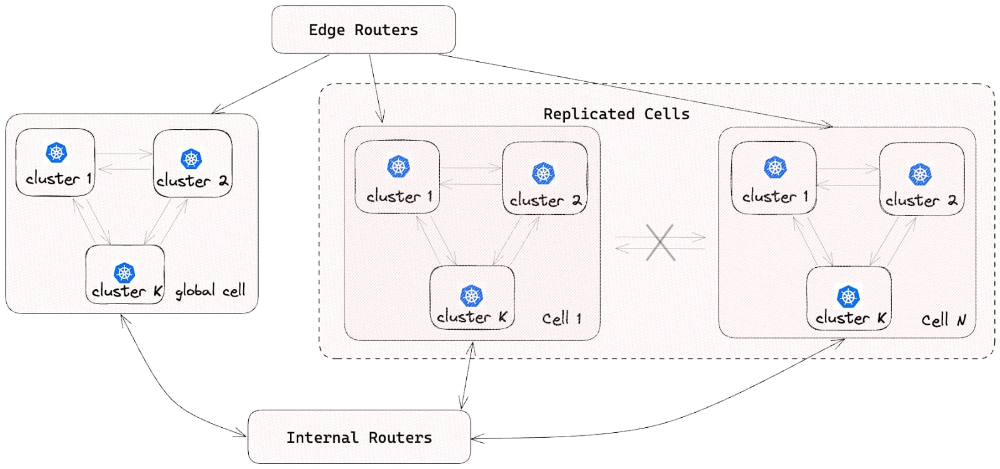
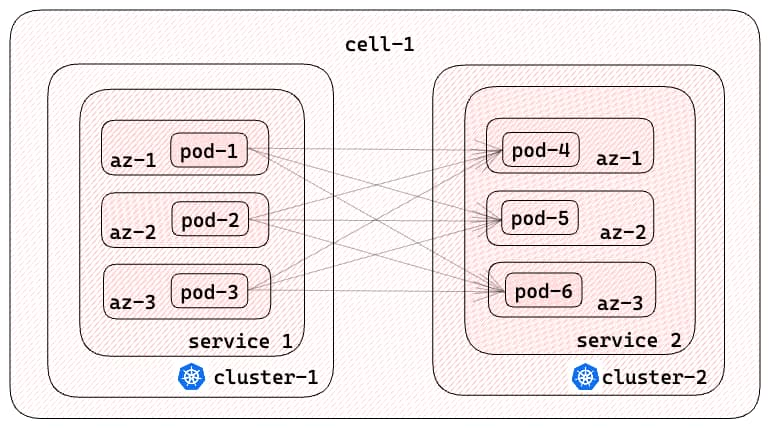
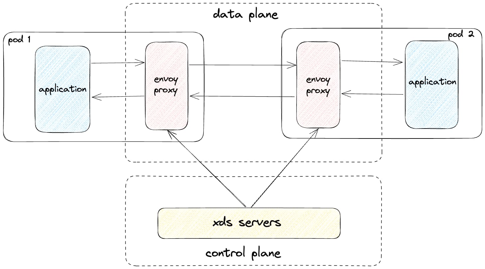
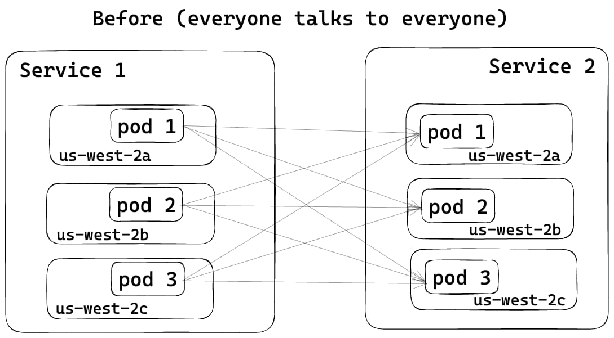
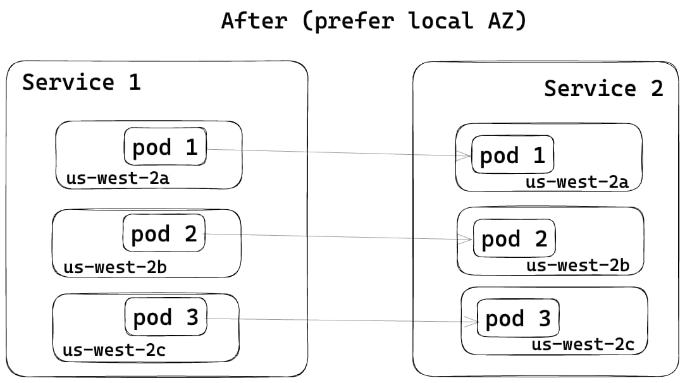
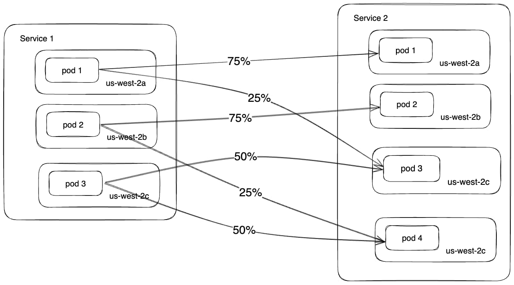
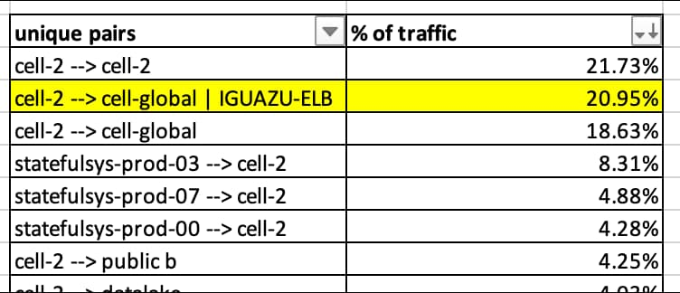
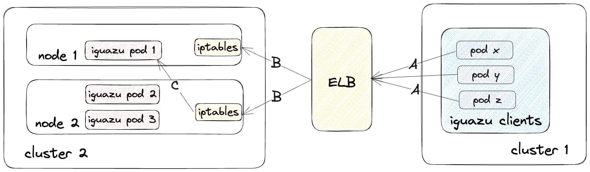
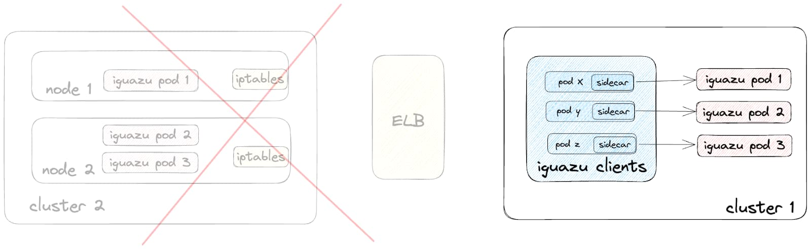

本文译自：[Staying in the Zone: How DoorDash used a service mesh to manage data transfer, reducing hops and cloud spend](https://doordash.engineering/2024/01/16/staying-in-the-zone-how-doordash-used-a-service-mesh-to-manage-data-transfer-reducing-hops-and-cloud-spend/)

摘要：本文介绍了 DoorDash 如何使用服务网格来优化其跨可用区的数据传输，降低成本和延迟。作者分享了他们的流量架构、问题分析和解决方案设计，以及使用 Envoy 和 Istio 实现区域感知路由的过程和效果。

---

DoorDash 从单体应用架构演变为基于[单元（cells）](https://www.youtube.com/watch?v=ReRrhU-yRjg)和[微服务（microservices）](https://doordash.engineering/2020/12/02/how-doordash-transitioned-from-a-monolith-to-microservices/)架构后，获得了许多好处。新的架构降低了开发、测试和部署所需的时间，同时提高了可伸缩性和用户体验，包括商家、送餐员和消费者。然而，随着微服务和后端数量的增加，DoorDash 注意到了跨可用区（AZ）的数据传输成本上升。这些数据传输成本 — [在发送和接收时发生](https://aws.amazon.com/blogs/architecture/overview-of-data-transfer-costs-for-common-architectures/) — 允许 DoorDash 为其最终用户提供高可用性的服务，可以抵御一个或多个 AZ 的降级。

成本上升促使我们的工程团队调查了以更高效的方式提供相同级别的服务的替代方法。在本博客文章中，我们描述了 DoorDash 使用服务网格实现数据传输成本节省而不牺牲服务质量的过程。

## DoorDash 流量架构

在我们深入解决方案之前，让我们回顾一下 DoorDash 的流量基础设施。

*基于单元的架构：* 如下图所示，我们的流量架构遵循[基于单元的设计](https://www.youtube.com/watch?v=ReRrhU-yRjg)。所有微服务 Pod 都部署在多个隔离的单元中。每个服务在每个单元中都有一个 Kubernetes 部署。为了确保单元之间的隔离，不允许单元间的流量。这种方法使我们能够减小单个单元故障的影响范围。对于单例服务或尚未迁移到单元架构的服务，部署在一个全局单元中。内部的[Envoy](https://www.envoyproxy.io/)路由器允许全局单元与复制的单元之间进行通信。

*Kubernetes 集群部署：* 每个单元由多个 Kubernetes 集群组成；每个微服务都专门部署在给定单元内的一个集群中。这个设计确保了可伸缩性和可靠性，同时与我们的基于单元的架构保持一致。



*高可用性：* 为了增强可用性和容错性，每个 Kubernetes 集群都部署在多个 AZ 中。这个做法最大程度地减少了由于一个或多个 AZ 中断引起的中断。

*平面网络中的直接通信：* 利用[AWS-CNI](https://github.com/aws/amazon-vpc-cni-k8s)，在一个单元中的不同集群中的微服务 Pod 可以直接通信。这种平面网络架构简化了通信路径，促进了微服务之间的高效交互。

*自定义多集群服务发现：* 我们的自定义服务发现解决方案，DoorDash 数据中心服务发现（DDSD），提供了一个自定义的 DNS 域，以支持多集群通信。客户端使用 DNS 名称动态发现所需服务的所有 Pod IP 地址。DDSD 的功能类似于 Kubernetes 的[无头服务](https://kubernetes.io/docs/concepts/services-networking/service/#headless-services)，但它也适用于集群间通信。例如，不同集群中的客户端可以使用*payment-service.service.prod.ddsd*来检索与支付服务相关联的所有 Pod IP 地址。

*客户端负载平衡：* 服务网格负责客户端负载平衡。对于未加入服务网格的服务，负载平衡发生在客户端应用程序端。

图 2 描述了上述四个特征：



*服务网格架构：* 如图 3 所示，DoorDash 的服务网格部署在每个单元中，采用了一种边车容器设计模式，利用[Envoy](https://www.envoyproxy.io/)代理作为数据平面。我们建立了我们自己的基于[xDS 的](https://www.envoyproxy.io/docs/envoy/latest/api-docs/xds_protocol)控制平面来管理 Envoy 配置。边车容器作为一种即插即用的解决方案，可以在不需要对应用程序代码进行任何修改的情况下，无缝地拦截、控制和转换进出 DoorDash 微服务的所有 HTTP1/HTTP2/gRPC 流量。



虽然 DoorDash 的流量架构具有独特的组件，但我们认为我们在网络流量效率方面遇到的挑战和经验可以广泛应用于其他架构。

## DoorDash 的常见数据传输模式

对于跨可用区的流量，我们将我们的流量模式分类如下：

*HTTP1/HTTP2/gRPC流量：* 在同一单元内的微服务之间进行直接的 Pod 到 Pod 通信；在全局单元中的微服务与涉及到调用路径中的额外跃点的单元之间的流量 — 例如内部路由器 — 增加了跨可用区流量的可能性。

*存储流量：* 包括来自微服务到有状态系统（如 Aurora PostgreSQL、CockroachDB、Redis 和 Kafka）的流量。

*内部基础设施流量：* 内部 Kubernetes 流量，例如[coredns](https://github.com/coredns/coredns)流量或[Kubernetes 控制平面组件](https://kubernetes.io/docs/concepts/overview/components/#control-plane-components)之间的通信。这种类型的流量通常使用 Kubernetes 内部 DNS 而不是 DDSD。

## 初步假设

我们认为，由于我们的微服务架构，同一单元内的 HTTP1/HTTP2/gRPC 流量是跨可用区数据传输成本的最大来源。我们还确定服务网格可能通过[Envoy 中的该功能](https://www.envoyproxy.io/docs/envoy/latest/intro/arch_overview/upstream/load_balancing/zone_aware)实现所有微服务的区域感知路由。了解了这两点后，我们优先研究和优化 HTTP1/HTTP2/gRPC 流量模式，以提高效率而不降低服务质量。

## 解决 HTTP1/HTTP2/gRPC 流量成本问题

最初，服务之间的流量在不同的 AZ 之间均匀分布，如图 4 所示。有了 Envoy 的区域感知路由功能，调用者服务现在更倾向于将流量引导到同一 AZ 中的被调用者服务，如图 5 所示，从而降低了跨可用区的数据传输成本。





为了启用 Envoy 的区域感知路由功能，我们在服务网格的控制平面中进行了更改，将服务发现类型从[STRICT_DNS](https://www.envoyproxy.io/docs/envoy/latest/intro/arch_overview/upstream/service_discovery#strict-dns)切换到终端发现服务（[EDS](https://www.envoyproxy.io/docs/envoy/latest/intro/arch_overview/upstream/service_discovery#endpoint-discovery-service-eds)）。如下图所示，对于 DDSD 域，控制平面现在会动态地将来自每个 Envoy 集群的 EDS 资源发送回 Envoy 边车容器。EDS 资源包括 Pod IP 地址及其 AZ 信息。

```yaml
resources:
 - "@type": type.googleapis.com/envoy.config.endpoint.v3.ClusterLoadAssignment
   cluster_name: payment-service.service.prod.ddsd
   endpoints:
     - locality:
         zone: us-west-2a
       lb_endpoints:
         - endpoint:
             address:
               socket_address:
                 address: 1.1.1.1
                 port_value: 80
     - locality:
         zone: us-west-2b
       lb_endpoints:
         - endpoint:
             address:
               socket_address:
                 address: 2.2.2.2
                 port_value: 80
     - locality:
         zone: us-west-2c
       lb_endpoints:
         - endpoint:
             address:
               socket_address:
                 address: 3.3.3.3
                 port_value: 80
```

*图 6：一个 EDS 响应的示例*

通过 EDS 响应中提供的数据，Envoy 获取了调用者服务和被调用者服务的 AZ 分布。这些信息使 Envoy 能够[计算](https://github.com/envoyproxy/envoy/blob/v1.28.0/source/common/upstream/load_balancer_impl.cc#L520)Pod 之间的权重。尽管仍然优先通过本

地 AZ 发送流量，但为了确保均衡分布并避免过载任何单个 Pod，一些流量可能仍然会引导到跨越 AZ，如图 7 所示。



这种路由解决方案具有多种好处，包括：

- 在服务不均匀分布在不同 AZ 的情况下仍然保持流量平衡
- 可以动态设置 Pod 之间的流量权重，消除手动操作
- 减少单个或多个 AZ 中断的影响范围
- 减少流量延迟 — 调用者服务连接到更近的被调用者服务

我们的解决方案在服务 Pod 均匀部署在可用区时变得更加有效。为实现这一目标，我们利用了[topologySpreadConstraints](https://kubernetes.io/docs/concepts/scheduling-eviction/topology-spread-constraints/)，并将[maxSkew](https://kubernetes.io/docs/concepts/scheduling-eviction/topology-spread-constraints/#spread-constraint-definition)设置为 1，当 Unsatisfiable 时设置为 ScheduleAnyway，如图 8 所示。这意味着 Kubernetes 调度器将仍然调度 Pod，即使条件未满足，优先选择最小化偏差的节点。

这种方法确保了 Pod 仍然被调度；否则将会减少装箱量，增加空闲计算量，并最终影响了区域感知的与流量相关的成本减少。在我们的生产系统中，我们观察到有 10% 的流量是根据这个 topologySpreadConstraints 策略跨可用区发送的。

```yaml
topologySpreadConstraints:
  - maxSkew: 1
    topologyKey: topology.kubernetes.io/zone
    whenUnsatisfiable: ScheduleAnyway
```

*图 8：配置以均匀部署 Pod 在可用区之间*

随着我们逐渐推出上述更改，我们看到了 AWS 跨可用区传输费用的改进。即便如此，我们预期的减少要更大。因此，我们着手调查为什么我们没有节省多少预期的费用。

## 大海捞针：更好地了解跨可用区的流量

我们通过验证[Envoy 在可用区之间的指标](https://www.envoyproxy.io/docs/envoy/latest/configuration/upstream/cluster_manager/cluster_stats#config-cluster-manager-cluster-per-az-stats)和应用程序日志，确认了区域感知路由正在按预期工作，但我们需要更多的可见性来确定数据传输成本降低的根本原因低于预期。这促使我们使用了多种可观察性工具，包括[VPC 流量日志](https://docs.aws.amazon.com/vpc/latest/userguide/flow-logs.html)，[ebpf 代理指标](https://doordash.engineering/2023/08/15/bpfagent-ebpf-for-monitoring-at-doordash/)和 Envoy 网络字节指标，以纠正这种情况。

使用 VPC 流量日志，我们将[srcaddr 和 dstaddr IP 地址](https://docs.aws.amazon.com/vpc/latest/userguide/flow-logs.html#flow-logs-fields)映射到部署在我们的 AWS 帐户结构中的相应子网。这个映射提供了一个汇总规则，让我们理解托管云足迹的不同部分之间的出口/入口流量模式，包括用于生产 Kubernetes 集群、存储解决方案、缓存和消息代理的子网，如表 1 所示。我们确认，我们跨可用区传输费用的最大来源是每个单元内的非存储流量。其中约有 20% 的费用是由于流量传输到用于我们事件接收流水线（[Iguazu](https://doordash.engineering/2022/08/02/building-scalable-real-time-event-processing-with-kafka-and-flink/)）的一个弹性负载均衡器（ELB）引起的。



此外，我们检查了服务网格 HTTP1/HTTP2/gRPC 指标，特别是用于所有请求和响应的连接字节，包括入口和出口流量。来自服务网格 Envoy 代理的最重要的指标是[来自 Envoy 侦听器和集群的 cx_rx_bytes_total 和 cx_tx_bytes_total](https://www.envoyproxy.io/docs/envoy/latest/configuration/upstream/cluster_manager/cluster_stats.html#general)。但是，由于当时并非所有服务都已加入到服务网格中，因此我们依赖于 BPFAgent 的指标，该指标在每个生产 Kubernetes 节点上都全球部署，以增加对总网络字节的可见性。使用这两个来源的指标，我们发现了 90% 的流量是 HTTP1/HTTP2/gRPC 流量；其中 45% 的流量已经加入了服务网格，并且该部分流量的 91% 被发送到 Iguazu！

## 环环相扣：Iguazu 的流量流动

在分析了如图 9 所示的 Iguazu 流量流动之后，我们意识到在调用者和被调用者服务或 Pod 之间存在多个中间跃点。当流量从调用者服务传输到 Iguazu 时，它首先经过 ELBs，然后着陆在全球单元中不同 Kubernetes 集群中的一个工作节点上。因为[externalTrafficPolicy](https://kubernetes.io/docs/tasks/access-application-cluster/create-external-load-balancer/#preserving-the-client-source-ip)配置为集群，*iptables*会将流量重定向到另一个节点以确保负载均衡。



我们观察到以下数据传输行为：

- 向 ELBs 发送流量的客户端仍然直接使用 ELB DNS 名称。因为客户端没有使用内部的 DDSD 域，所以 Envoy 集群中的服务发现类型仍然是 STRICT_DNS，而不是 EDS，这是启用区域感知路

由的先决条件。这意味着 Envoy Sidecar 容器使用简单的轮询方法来将流量分发给 ELBs。
- 在 ELBs 到 Cluster 2 的 Kubernetes 工作节点的流量的情况下，禁用了跨可用区的负载均衡。
- 当流量从 Iguazu ELB 到达 Kubernetes 工作节点时，*iptables*会将其进一步重定向到随机节点，这也增加了跨可用区流量的概率。

考虑到 Iguazu 调用图内部的多个跃点的复杂性，我们决定将 Iguazu 服务迁移到与其客户端部署在同一单元的地方。我们还配置了所有客户端 Envoy Sidecar 的[路由规则](https://www.envoyproxy.io/docs/envoy/latest/configuration/http/http_conn_man/rds)，将流量路由到新集群中的 Iguazu Pod，而不需要我们的工程师对其服务进行任何代码或配置更改。这使我们能够为 Iguazu 流量启用直接的 Pod 间通信，实现区域感知路由，同时减少了 ELBs 处理的流量量，如图 10 所示。



这些操作使 DoorDash 的数据传输成本以及 ELB 成本受到了很大的打击，以至于我们的云服务提供商与我们联系，询问我们是否遇到了与生产相关的问题。

## 吸取的教训

在我们的旅程中，我们获得了一些关键的发现，包括：

- 云服务提供商的数据传输定价比起初看起来更加复杂。值得投入时间来理解定价模型，以构建正确的效率解决方案。
- 要全面了解/查看所有跨可用区的流量是具有挑战性的。然而，将来自不同来源的网络字节指标结合起来，足以识别热点，一旦解决，可以在使用和成本方面产生实质性影响。
- Envoy 的区域感知路由可以将流量发送到其本地可用区，同时通过平衡流量自动确保弹性。
- 随着微服务调用图中跃点数量的增加，数据被传输到跨可用区的可能性增加，增加了确保所有跃点支持区域感知路由的复杂性。
- 如果你考虑使用服务网格来管理流量，你也可以利用它来提高效率。
- 要了解更多关于 DoorDash 的服务网格之旅的信息，请查看 Hochuen 的 KubeCon + CloudNativeCon North America 2023[服务网格会议](https://www.youtube.com/watch?v=I6E_7f40YP0)。

## 未来的工作

我们已经列出了我们希望实施的解决方案增强功能的列表，包括：

- 简化从不同来源收集指标并提供成本和使用情况的统一概述的过程。
- 启用内部 Envoy 路由器的区域感知路由功能。
- 使解决方案更具可扩展性，以支持 DDSD 之外的其他域的 HTTP1/HTTP2/gRPC 流量。
- 使用 Kubernetes 网络代理 kube-proxy 为内部基础设施流量启用[拓扑感知路由](https://kubernetes.io/docs/concepts/services-networking/topology-aware-routing/)功能。
- 探索优化的路由，用于与 DoorDash 的有状态系统（例如 PostgreSQL、CRDB、Redis 和 Kafka）之间的大数据传输操作。这将允许流量在有意义的情况下保持在单一 AZ 泳道中，进一步降低成本。

## 致谢

我们感谢**Darshit Gavhane**和**Allison Cheng**将所有 Iguazu 服务迁移到客户端正在运行的同一单元，以及**Steve Hoffman**和**Sebastian Yates**在旅程中的建议和指导。