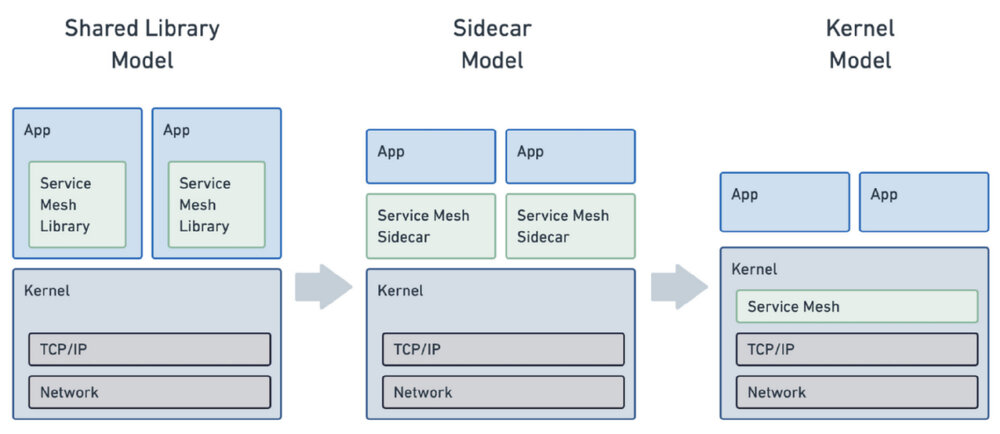
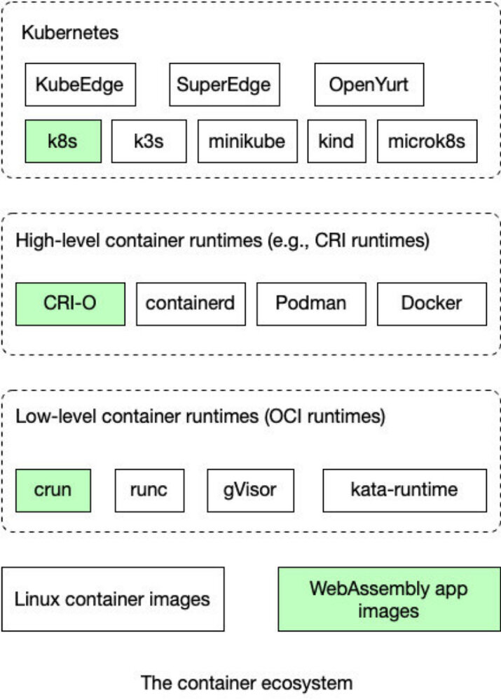

本文译自 [eBPF and Wasm: Exploring the Future of the Service Mesh Data Plane](https://infoq.com/news/2022/01/ebpf-wasm-service-mesh/)，作者 Vivian Hu，发布于 2022 年 1 月 10 日。

## 编者按

前段时间，有人提出使用 eBPF 取代服务网格中的 sidecar 代理，该观点已经发出，就在服务网格和云原生社区中引起了“轩然大波”。后来也有不少人指出该方案实属武断，不切实际。本文就总结了 eBPF 在服务网格数据平面中的作用，以及使用 Wasm 这种新的方案。

## 正文

2021 年 12 月 2 日，Cilium 项目宣布了 [Cilium Service Mesh](https://cilium.io/blog/2021/12/01/cilium-service-mesh-beta) 的 beta 测试计划。在谷歌云基于 eBPF 的 Google Cloud Kubernetes Service（GKS）Dataplane V2（于 2020 年 8 月发布）所开创的概念基础上，Cilium Service Mesh 提倡 “无 sidecar 服务网格 " 的理念。它扩展了 Cilium eBPF 产品，以处理服务网格中的大部分 sidecar 代理功能，包括 L7 路由和负载均衡、TLS 终止、访问策略、健康检查、日志和跟踪，以及内置的 Kubernetes Ingress。

Cillium 的创建者 Isovalent 在一篇题为 “[告别 Sidecar—— 使用 eBPF 解锁内核级服务网格](https://cloudnative.to/blog/ebpf-solve-service-mesh-sidecar/) “的文章中解释了使用 eBPF 作为 sidecar 代理的理由。

它将把我们从 sidecar 模型中解放出来，并允许我们将现有的代理技术整合到现有的内核命名空间概念中，使它们成为我们每天都在使用的容器抽象的一部分。

简而言之，eBPF 有望解决服务网格中的一个主要痛点 —— 当有许多细粒度的微服务时，性能堪忧。然而，使用 eBPF 来取代 sidecar 代理这个想法也是存在争议的。

 

（来源：[告别 Sidecar—— 使用 eBPF 解锁内核级服务网格](https://cloudnative.to/blog/ebpf-solve-service-mesh-sidecar/)）

服务网格中的数据平面指的是管理数据流量如何被路由和交付给微服务应用的基础设施服务。目前，这是通过使用服务代理来实现的。这种设计模式通常也被称为 Sidecar 模式。Sidecar 允许其附属的微服务透明地与服务网格中的其他组件发出和接收请求。

Sidecar 通常包含一个 L7 网络代理，如 [Envoy](https://envoyproxy.io/)、[Linkerd](https://linkerd.io/) 或 [MOSN](https://mosn.io/)。该代理处理流量路由、负载均衡、健康检查、认证、授权、加密、日志、跟踪和统计数据收集。Sidecar 还可以包含一个基于 SDK 的应用框架，如 [Dapr](https://dapr.io/)，以提供网络代理以外的应用服务。这种应用服务的例子包括服务注册、服务发现、资源绑定、基于名称的服务调用、状态管理、行为者框架和秘密存储。

Sidecar 代理和服务通常在 Kubernetes pod 或容器内运行。微服务应用也在容器内运行，它们通过网络接口连接到 sidecar 上。然而，这些容器化应用程序的一个重要问题是资源消耗。Sidecar 服务随着微服务的数量呈几何级数增加。当一个应用程序有数百个相互联系和负载均衡的微服务时，开销可能变得不堪重负。服务网格代理供应商在性能上展开竞争。正如 [InfoQ 之前报道的](https://www.infoq.com/news/2021/08/linkerd-rust-cloud-native/)那样，Linkerd 将其代理从 Go 重写成了 Rust，并取得了明显的性能提升。

不足为奇的是，现有的服务网格供应商并不相信 eBPF 是能解决我们所有问题的圣杯。来自 Solo 的 Idit Levine 等人写了一篇文章来回应 Cilium 的公告。这篇文章的标题是 “[服务网格将使用 eBPF ？是的，但 Envoy 代理将继续存在](https://www.zhaohuabing.com/post/2021-12-19-ebpf-for-service-mesh/) "。

> 在 Solo.io，我们认为 eBPF 是优化服务网格的一种强大方式，我们认为 Envoy 代理是数据平面的基石。

Solo.io 作者提出的关键点是，现在的 sidecar 代理所做的事情远远超过了简单的网络流量管理。在今天的服务网格部署中，有一些复杂的要求，远远超过了 eBPF 所支持的有限的编程模型，eBPF 是图灵不完整的，对内核的安全性有许多限制。Cilium eBPF 产品可以处理许多，但不是全部，由 sidecar 代理执行的各种任务。此外，Solo.io 的作者指出，eBPF 的每个节点一个代理的设置提供了更少的灵活性，因此与传统代理的每个节点一个代理的设置相比，增加了整体开销。这些 eBPF 的缺点对于开发者必须编写并部署到服务网格代理中的流量路由、负载均衡和授权的特定应用逻辑来说尤其明显。

Terate.io 的开发者在对 Cilium 公告的回应中提出了类似的论点，标题是 “[社区中关于 Istio 和服务网格的争论](https://www.tetrate.io/blog/the-debate-in-the-community-about-istio-and-service-mesh/) "。他们指出，今天的 sidecar 代理的性能是合理的，开源社区已经想出了进一步提高性能的方法。同时，对于开发者来说，在 eBPF 这种新颖的、图灵不完整的技术中构建特定应用的数据平面逻辑是非常困难的。

> Istio 架构是稳定的，可用于生产的，而且生态系统正在萌芽。

eBPF 的许多问题与以下事实有关：它是一种内核技术，因此必须有安全限制。有没有一种方法可以将复杂的特定应用的代理逻辑纳入数据平面，而不使用使用空间技术降低性能？事实证明，WebAssembly（Wasm）可能正是这种选择。Wasm 运行时可以安全地隔离并以接近原生的性能执行用户空间代码。

Envoy Proxy 开创了使用 Wasm 作为扩展机制对数据平面进行编程的方法。开发人员可以用 C、C++、Rust、AssemblyScript、Swift 和 TinyGo 等语言编写特定应用的代理逻辑，并将该模块编译到 Wasm 中。通过 proxy-Wasm 标准，代理可以在 [Wasmtime](https://github.com/bytecodealliance/wasmtime) 和 [WasmEdge](https://github.com/WasmEdge/WasmEdge) 等高性能运行机制中执行那些 Wasm 插件。目前，[Envoy Proxy](https://envoyproxy.io/)、[Istio Proxy](https://github.com/istio/proxy)、MOSN 和 [OpenResty](http://openresty.org/) 支持 [proxy-Wasm](https://github.com/proxy-wasm)。

 

（容器生态系统中的 Wasm，来源：[WasmEdge Book](https://wasmedge.org/book/en/kubernetes.html)）

此外，Wasm 可以作为一个通用的应用容器。它在服务网格数据平面上的应用并不限于 sidecar 代理。附在 sidecar 上的微服务可以在它自己的轻量级 Wasm 运行时运行。WasmEdge WebAssembly 运行时是一个安全、轻量级、快速、可移植和多元化的运行时，可以直接由 [Kubernetes 作为容器](https://wasmedge.org/book/en/kubernetes.html)管理。到 2021 年 12 月，WasmEdge 社区的贡献者证明了基于 WasmEdge 的微服务可以与 [Dapr](https://github.com/second-state/dapr-wasm) 和 [Linkerd](https://github.com/Liquid-Reply/kind-crun-wasm) 一起工作，作为带有操作系统和完整软件堆栈的重量级全面的 Linux 容器的替代。WebAssembly 微服务消耗 1% 的资源，与 Linux 容器应用相比，冷启动的时间是 1%。

eBPF 和 Wasm 是服务网格应用在数据平面上实现高性能的新生力量。它们仍然是新生的技术，但有可能成为今天微服务生态系统中 Linux 容器的替代品或补充。
