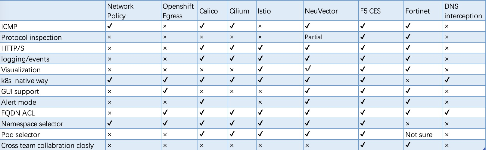

## 为何要进行Egress流量策略管控
2021年CNCF调查显示，全球将kubernetes用在生产环境的用户占比已达59.77%，欧洲用户更是达到了68.98%。用户正越来越多的将生产业务迁移到kubernetes环境下。Gartner 2021 Hype Cycle for Cloud Security也显示了容器与Kubernetes安全已处在”slope of Enlightenment ”阶段。这说明保护kubernetes里的应用服务正变的越来越重要。

当我们去审视运行在kubernetes中的大量微服务时，我们可以看到微服务安全具有典型的微边界以及需要进行持续性安全工程的特点。我们需要以每个微服务为边界进行保护，无论是其运行时，还是南北和东西流量。需要每个微服务单元在编码之初就开始着手安全考虑，进行安全左移，安全的防护设施、方法、策略应与开发者和kubernetes平台运维者适配。还需要有能力洞察所有的流量事件，采集所有运行时日志、事件等数据，通过持续性的安全工程系统对这些数据进行分析，聚合出规则并反馈到安全的策略设定中。

kubernetes里的微服务不会只在集群内部封闭运行，它需要访问集群外部应用、数据库、第三方API服务、互联网服务等。出向流量里可能包含业务需要的外部访问，开源组件更新的访问，甚至可能是被入侵的应用向C2连接的流量。因此，必须对kubernetes中的微服务主动外出流量进行管控，确保其安全合规。在以云原生架构为核心技术驱动的数字化转型下，企业会大量采用开源技术，而这可能是最容易引入安全风险的地方，无论是否有明确的开源准入机制，企业都应足够重视这些开源产品可能的主动外访服务，将其管控好，确保安全。

管理kubernetes中的出向流量策略，看似简单的需求，要想做好却并不是一件容易的事。本文将和您一起分析kubernetes出向策略的挑战，并针对当前常见解决方案的优缺点进行分析，思考企业应如何做好kubernetes出向流量策略管控。

## 存在的挑战
### 动态
从技术角度看，这是第一个存在的挑战。在kubernetes环境下，微服务单元的pods将是高度动态的、分散的。IP、网段和物理位置将会随时发生变化。因此直接采用IP等特征进行静态化策略设定将是一件不可能的事情。策略必须依赖于其它抽象的应用标签、服务名或命名空间等进行，并能做到动态感知变化。
### 粒度
传统应用环境下，对一个应用出向流量策略的管控一般来说只需要对该应用所涉及的少量部署进行策略设定即可。然而在微服务加容器化的环境下，一个应用可能会有许多的微服务组成，而一个微服务又包含许多pods。不同的微服务单元会需要不同的出向策略规则，比如payment需要连接第三方外部接口，而评论服务则不需要主动访问第三方服务。这意味着策略设定的粒度需要精细到每个微服务单元，并确保管控了所有相关的pods。可以看出，策略管控粒度更细、工作量更大、复杂性更高。
### 协同
当我们要为不同的微服务单元部署出向策略时候，谁应该为此负责，应用开发部门？应用部署与运维部门？kubernetes的platformOps部门？或是安全部门？我们以安全左移的思想去看待这件事时，显然应用部门应该考虑他的微服务是否需要主动外访，需要访问哪些外部服务。然而，如果由应用开发人员负责，是不是平台或安全部门就可以放手不管？显然不是，应用开发人员最多是为其所负责的应用设定安全策略，与应用无关的全局性基础安全策略，如何快速补救应用开发人员设定的错误策略，这些依然需要由其他团队来负责。而要想开发部门能够践行安全左移的思想，那么PlatformOps或安全部门则必须提供友好的工具并将安全策略的设定集成到DevSecOps的pipeline当中，如果工具或方法导致开发效率下降，开发人员将不乐意去使用。所以，这不是某一个部门的独立工作，需要多团队的协作来确保安全。
### 数据驱动
正如文章开始所述，安全是一个持续工程化的工作，意味着任何出向访问行为与事件都应被记录到安全工程系统中进行分析，以确保足够的可见性和洞察。出向安全管控不仅仅是一个简单策略设定，需具有完整日志、行为、事件输出的能力。

## 业界方案分析
接下来，我们来逐一分析当前业界关于出向策略管控的解决方案，首先我们将其分为6大类方案，然后再逐一分析：

|Category   |Solutions or products   |Description   |
| ------------ | ------------ | ------------ |
|Platform based  |Kubernetes Network policy Openshift EgressIP Openshift Egress Router pod Openshift Egress Firewall Openshift EgressNetworkPolicy |A specific feature of a platform provider  |
|CNI based   | Calico Egress pod Calico Enhanced Network policy Cilium Enhanced Network policy Kube-ovn | The capability of CNI  |
|Service Mesh   |NGINX Service Mesh Istio   | A function of Service Mesh  |
|Micro segmentation   |PrismaNeu Vector   |From ZTA perspective or use enforcer container to control egress   |
|Fusion  |F5 CES(Container Egress Service) Fortinet   | Use k8s native method to integrate exist security assets to k8s  |
|Others   |DNS interception Proxy pod   |Intercept coredns or use a proxy pod as forward proxy   |

### Platform based
kubernetes自带的Network policy，这是最容易想到的关于出向安全策略管控方法。它是k8s的自身能力，对于开发者或PlatformOps人员来说具有天然的亲和性，能够很好的适应安全左移的思想。但Network policy需CNI支持。其它一些缺点在于：

- 没有集群全局性的策略能力,不同namespace下要维护独立的policy

- 没有以k8s svc名称为条件的选择能力（可改为选pod标签，但不灵活）

- 无显式拒绝能力，通过策略的隔离性特点，然后施加具体的白名单

- 规则无优先级概念

- 无明确的集群外访规则，外部目标服务只能依靠宽泛的ipblock

- 纯四层，无七层的控制能力

- 无策略执行调试能力

- 无策略执行日志

- Networkpolicy的“隔离性”特点使得维护工作变得及其麻烦，例如，本身只想控制其对互联网的访问，但因为隔离性，就不得不额外维护该pod在集群内的所有出向（东西向）访问

- 不能解决k8s与外部安全设备协同问题。试想一下，Network policy做了规则控制后，那么外部的安全设备就可以为该集群打开一个默认通行的规则吗？

Openshift，在Egress方面有四个特性与之有关，分别是标准的Network Policy，Egress IP，Egress Router，Egress Firewall以及Egress NetworkPolicy。

- Network Policy，当Openshift使用OVN-Kubernetes作为CNI时完全支持，而传统的Openshift SDN CNI则仅是部分支持。与标准的kubernetes并无不同，其优缺点这里不再做额外分析。

- EgressIP，是用来实现Pods流量离开集群时候使用确定性源IP的一种功能。当使用Openshift SDN CNI时，该功能将Egress IP应用到指定的nodes上作为secondary IP，并用于SNAT。当使用OVN-kubernetes CNI时候，则通过OVS为具体的pods执行snat规则。使用EgressIP，本身并不是出向安全策略管控的直接方法，但是借助为不同的namespace指定确定的源IP，这样可以在集群外部的安全设备上部署一些策略来执行控制。显而易见，这种策略控制方式比较粗放，无法做到对不同服务的精细化粒度。如果pods分散在不同的nodes上，则还会存在pods出集群流量要先在不同nodes之间穿越问题，增加了额外的延迟。此外，EgressIP还必须与nodes的主网络地址同属相同网段，且一个node不可以拥有一个以上的EgressIP。EgressIP也不支持公有云以及Redhat Openstack Platform。

- Egress Router Pod，它是一种特殊的pod，拥有两个网卡，使用MacVlan技术将其中一个容器网卡与外部网络直接连通。所有pods出集群流量都会经过该pod。根据不同的CNI（SDN或OVN-kubernetes）,具有的功能也不同，在OVN-kubernetes CNI下仅支持重定向操作。一般来说这并不适合大规模使用，从Egress安全策略设定角度，这也依然无法区分不同服务，且集中的Egress pod容易成为性能瓶颈。

- EgressFirewall，它实际是OVN-kubernetes的特性。容许为某个project或namespace设置出向访问规则，可以基于协议，端口，IP，DNS等维度。协议仅支持TCP，UDP，SCTP三种，无法支持其它协议控制。它只容许基于namespace级别设定，一个namespace中只容许设置一个规则文件，无法为集群内的不同service来设定不同的Egress规则。同时它限制每个namespace/project最大8000条规则。也不支持可观测或事件。

- Egress NetworkPolicy，与EgressFirewall功能类似，当采用Openshift SDN CNI时候支持该CRD。但是Egress NetworkPolicy具有更多的限制性，例如每个namespace/project最大支持1000条规则，且必须打开nework policy 或 multitennat模式。

### CNI based
以Calico和Cilium为典型代表的CNI，在标准k8s Network Policy上扩展了部分能力，主要表现在：

- 支持全局策略（Calico，Cilium）

- DNS-based策略支持（Calico企业，Cilium)

- L7 仅HTTP协议扩展（Calico，Cilium）

- Log（Calico，Cilium）

- 扩展策略的应用对象到pod以外，例如node等（Calico，Cilium）

- 层次化策略，角色化边界设定（Calico企业）

要实现这些能力，企业首先需使用这些CNI。部分企业特性，例如层次化策略与角色设定、DNS支持等需要额外购买服务。这会造成用户CNI技术锁定，不利于多云场景部署。Calico在中国也没有服务销售，这些都会阻碍客户体验。在CNI上采取复杂的安全策略，会导致在集群内部创建大量复杂的规则，造成排错困难，运维成本增大。大量的规则，也可能会导致网络性能下降。

对于Calico Egress Pod，是一个特殊的pod，拥有固定的可路由的SNAT地址，当Egress流量从该专用pod流出时，携带了专用固定地址，这容许外部防火墙等安全设备基于该固定地址进行策略设定。其行为上与Openshift的Egress Router pod类似，从Egress安全策略设定角度，它无法为不同服务执行细粒度的安全策略设定或成为性能瓶颈。

### Service Mesh
Service Mesh并不是Egress流量管控的专门方案，因此要通过Service Mesh实现Egress的管控意味着首先需要部署整体Service Mesh方案，比如Istio。如果仅仅是为了实现Egress的管控，这样的方案会显得较重。Service Mesh所支持的协议范围也较少，这对于企业的安全策略来说还不足够。

在Istio中，当设置meshConfig.outboundTrafficPolicy.mode为REGISTRY_ONLY后，可以通过sidecar结合ServiceEntry资源实现外部服务访问的白名单。也可以通过结合Egress Gateway将流量导向到专门的Egress Gateway。相比于ServiceEntry方法，Egress Gateway则结合了VirtualService和DestinationRule来实现更多的控制，配合AuthorizationPolicy则可以控制粒度更细一些。

无论哪种方式，都必须依赖sidecar进行流量的劫持，如果有威胁绕开或破坏了sidecar，则意味着有害访问可以直接绕开管控，这个安全问题在Istio的文档中被反复提及。所以本质上来说它不是一个很好的Egress流量管控方案。同时，Service Mesh的思维更多是面向开发者（尽管它常常体现的是平台层面的能力），所以我们依然需要回答这样一个问题：当开发者设置了外部服务访问白名单后，集群外部是否就可以信任开发者这样的设置，外部安全设备是否就可以设置为容许集群的任意外部访问？

### Micro Segmentation
微分段一般是Zero Trust Architecture(ZTA)领域热衷的概念，通过技一些技术（如TC，IPtables，DPI）对底层流量进行探查、操纵与控制，实现对容器内进程、容器间通信、容器与集群外的通信的可视化与策略控制。一般来说会在集群的各个主机上安装DaemonSet类容器实现对底层流量的探查。此类方案可以基于较细的粒度进行Egress策略控制，例如对哪些应用相关pods通过哪些协议访问哪些外部服务，亦可选择诸如Service account或Label等要素。对于应用层加密数据，如果是Istio环境则可通过探查sidecar与应用容器之间流量实现明文探查；如果是应用容器自身直接加密则无法实现探查，但可以通过结合DNS解析、SNI实现一定程度上的策略管控。

### Fusion
上述的多种类型方案，主要切入点是在集群内。在客户的实际生产环境中，kubernetes集群是一种资源性对象，从企业整体安全角度来看，外部安全设备依然有必要对kubernetes集群的出向流量进行管控。让外部安全设备与kubernetes集群融合，其难点在于，传统安全设备不是直接面向kubernetes设计。高动态性、IP无关性会成为传统设备进行kubernetes出向流量管控的难点。但这并不是无法解决的技术难题，如果外部安全设备具有较好的API接口，通过专门设计的控制器则可以解决上述技术难题。这样，外部安全防护的措施便可以应用到kubernetes集群上来，形成完整的纵深防御体系。同时可以保护企业已有投资，节约成本。通过面向kubernetes的自定义资源类型设计，负责外部安全设备的团队也因此可以介入到kubernetes集群的整体安全工作中来，避免了团队的割裂。

F5 的Application Firewall Manager(AFM) 通过专用的免费控制器（CES）实现了以kubernetes原生自定义资源（CRD）方式进行Egress策略的控制，并实现了安全规则与角色的层次化设定，让安全设备管理员融合到了kubernetes平台。借助AFM的能力，可实现Egress流量的高级访问规则、限流、协议检查、日志与事件可视化等。

Fortinet自身以及与Calico企业版联合，也实现了与kubernetes的集成，但其主要特点是将kubernetes资源对象转化并写入Fortinet的地址组中，其管理视角依然是防火墙管理员视角，而不是kubernetes native方式。

### Others
Proxy pod是一种普通的正向代理，应用使用该代理实现对外部业务的访问。此种方式一般仅适合小规模场景，不适合大规模集群及复杂业务。
DNS interception，其原理是通过patch coredns，如果应用访问ExternalService对象中设定的外部服务，则将请求引导到一个专用的proxy pod上（例如Envoy等）实现对流量的处理。该方案同样不适合大规模场景。

在完成对上述6类Egress流量管控方案的分析后，让我们来总结和对比一下这些方案的优缺点：

可以看出Network Policy虽然是一个kubernetes原生的方式，但显然并不适合于集群Egress流量的管控。CNI类产品有了一定的增强，但是在协议检测、企业级支持方面还是不够。微分段类产品具有相对完整的能力，但是微分段是一个整体性的解决方案，仅仅使用微分段实现集群出向流量的管控会显得投入较大，且微分段的产品一般底层技术较为复杂，运维难度较高。将外部安全设施融入到kubernetes当中实现出向流量管控的解决方法更加适合企业，无论是功能特性还是运维复杂度都比较适合，更加重要的是，该类方案将企业的传统安全资产与现代应用架构进行了结合，让不同部门能够紧密协同，形成纵深防御体系。

### 总结
我们往往重视Ingress的能力，而忽视了Egress流量的安全管控。但无论从安全还是合规的角度，Egress流量都应加强管控。当漏洞已经侵入应用后，Egress流量管控往往是最后一个保护的关口。在上当前众多方案中，大部分的方案是基于kubernetes内的Network Policy实现，有的依赖于特定的CNI，有的依赖于特定的编排平台。但当我们从企业的整体安全架构去考虑时，将外部安全设备引入到kubernetes安全体系当中一件非常必要的事情，只有这样才能实现真正的全面防御。而当我们讨论DevSecOps时，需要让开发、平台、安全乃至网络这些不同团队同时参与到整体安全工作中，实现跨团队的紧密协作。关于F5 CES方案是如何实现kubernetes Egress流量安全管控，以及如何实现不同团队紧密协作，请看考[Github CES 项目](https://github.com/f5devcentral/container-egress-service)。