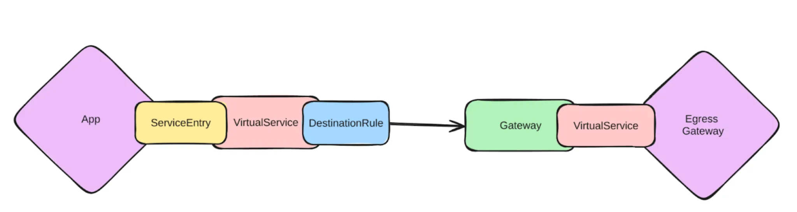
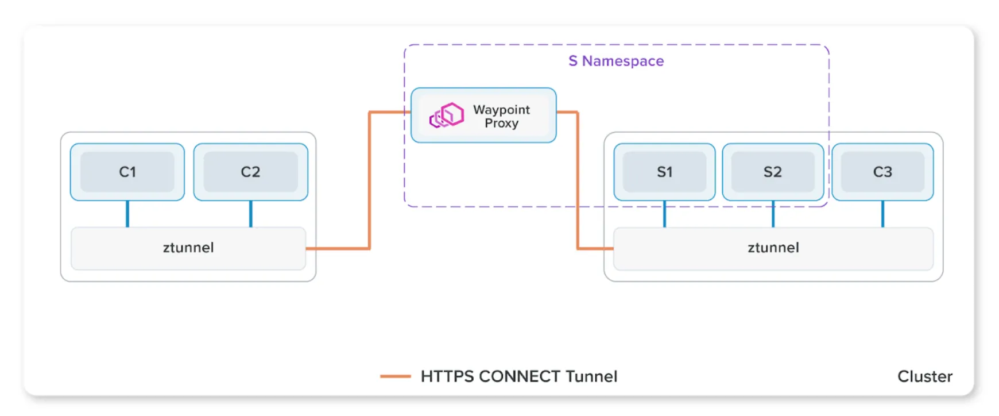
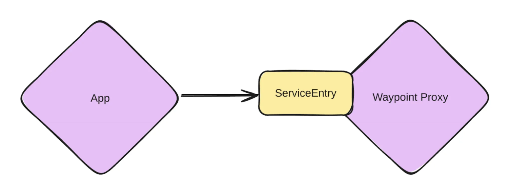

多年来，Istio 一直提供一种可选方案来部署 “[Egress Gateway](https://istio.io/latest/docs/tasks/traffic-management/egress/egress-gateway/)”，这是一种功能强大的机制，可将出站流量经由一个 Gateway 统一转发，以便对其实施各类策略，包括授权、审计、可观测性等等。

尽管功能强大，但长期以来，设置 egress gateway 一直相当复杂。即便只是最基本的场景：将来自特定域名的流量通过 egress gateway 转发，都需要先后配置 5 个不同的 Istio 对象（参见 [官方文档](https://istio.io/latest/docs/tasks/traffic-management/egress/egress-gateway/)），更不用说后续还要为流量添加各种高级策略了。

凭借 Istio 的 Ambient 模式与 Gloo Mesh，现在配置 egress gateway 的过程变得更加轻松，同时还能为网格中的流量提供更优的功能与管理。让我们在这篇博客中深入探讨一下。



## Istio Ambient 模式与 Gloo Mesh 带来的简化

借助 [Ambient 模式](https://www.solo.io/blog/istio-ambient-revolution/)，管理 egress 流量变得非常轻松。在 Ambient 模式下，不再使用传统的 Sidecar 代理，而是使用独立部署的 “waypoint” 代理来代理服务的流量。整体示意如下所示：



各个服务可以绑定到一个 waypoint 上，然后 Istio 会自动将访问这些服务的流量都通过该 waypoint。

有趣的是，我们也可以像对待内部服务一样，把 *外部域名*（通过 ServiceEntry 定义）绑定到某个 waypoint。只要像对待 Service 那样，将这些域名映射到 waypoint，访问这些域名的流量也能自动经由该 waypoint 代理转发。



通过这种方式，即使保持同样的丰富功能，配置 egress gateway 的过程也被极大简化。此后，流量可观测性还可以通过 Gloo Mesh 进行可视化。

## 实践体验

首先，在已安装 Istio Ambient 模式的集群上，我们部署一个测试应用并将其所在的 Namespace 加入 Ambient 网格：

```bash
$ kubectl apply -f shell.yaml
$ kubectl label namespace default istio.io/dataplane-mode=ambient
```

然后，我们可以验证测试应用依然可以正常发送出站流量：

```bash
$ curl httpbin.org/get
{
  "headers": {
    "Host": "httpbin.org",
  },
  "url": "http://httpbin.org/get"
}
```

我们的目标是让这部分流量走过一个 egress gateway，从而统一对其进行策略和访问控制。在 Istio Ambient 模式中，这比在 Sidecar 模式要简单得多。

首先，我们需要部署一个 waypoint 代理来充当 egress gateway。只需部署一次即可，后续可以共享给要捕获流量的其他域名。

```bash
$ kubectl create namespace istio-egress
$ istioctl waypoint apply --enroll-namespace --namespace istio-egress
```

接下来，为 **httpbin.org** 创建一个 **ServiceEntry**：

```yaml
apiVersion: networking.istio.io/v1
kind: ServiceEntry
metadata:
  name: httpbin.org
  namespace: istio-egress
spec:
  hosts:
  - httpbin.org
  ports:
  - number: 80
    name: http
    protocol: HTTP
  resolution: DNS
```

这就是全部所需！因为部署 waypoint 时使用了 **--enroll-namespace** 参数，该命名空间（`istio-egress`）中的所有服务都会自动绑定到此 waypoint。如果我们只想在单个 Service/ServiceEntry 级别进行绑定，也可以在每个对象上显式添加标签 **istio.io/use-waypoint: waypoint**。

现在，这个 ServiceEntry 已经绑定到我们之前部署的 waypoint 代理上，原先的请求无需任何改动就会自动穿过该 waypoint，并由 Istio 自动进行 mTLS 加密：

```bash
$curl httpbin.org/get -v
...
* Request completely sent off
< HTTP/1.1 200 OK
< server: istio-envoy
...

{
  ...
}
```

之后，我们就可以从 waypoint 中收集日志、追踪信息以及指标来观察流量。例如，从 waypoint 的日志就能看到刚刚发出的请求：

```bash
$ kubectl logs waypoint-6c6b888f4f-wmnr2 --tail=1
[2024-07-18T16:13:58.198Z] "GET /get HTTP/1.1" 200 - via_upstream - "-" 0 252 260 259 "-"
"curl/8.7.1" "8d80cec6-8fc1-40de-8bc7-19716f173bbd" "httpbin.org" "3.234.9.11:80" inbound-vip|80|http|httpbin.org; 10.244.0.24:41160 240.240.0.2:80 10.244.0.18:41548 - default
```

## 策略管理

Egress gateway 最强大的特性之一就是能够对所有出站流量强制执行访问控制策略。策略范围可以很简单——比如基于域名的白名单，也可以非常复杂，比如 [数据丢失防护（DLP）](https://docs.solo.io/gloo-mesh-gateway/main/security/dlp/) 等。

举个例子，我们可以限制低权限应用只能访问 `/get` 接口，而高权限应用可以访问 httpbin.org 的所有接口。要实现这一点，只需在我们创建的 ServiceEntry 上附加一条 AuthorizationPolicy 即可：

```yaml
apiVersion: security.istio.io/v1
kind: AuthorizationPolicy
metadata:
  name: httpbin
  namespace: istio-egress
spec:
  targetRefs:
  - kind: ServiceEntry
    group: networking.istio.io
    name: httpbin.org
  action: ALLOW
  rules:
  # admin 应用可以访问任意接口
  - from:
    - source:
        principals: ["cluster.local/ns/default/sa/admin"]
  # 其他应用只允许访问 /get
  - to:
    - operation:
        methods: ["GET"]
        paths: ["/get"]
```

此时，从低权限应用发出的 POST 请求就会被拒绝：

```bash
$ curl httpbin.org/get
{
  "headers": {
    "Host": "httpbin.org",
  },
  "url": "http://httpbin.org/get"
}
$ curl -X POST httpbin.org/post
RBAC: access denied
```

而在高权限应用（admin）中，POST 请求可以正常执行：

```bash
$ curl httpbin.org/post -X POST
{
  "headers": {
    "Host": "httpbin.org",
  },
  "url": "http://httpbin.org/post"
}
```

## TLS Origination

另一个在 egress gateway 上经常使用的策略是进行 TLS Origination。在上面的例子中，我们虽然在网格 *内部* 使用了 Istio 自动加密，但流量一旦离开集群，就会以明文形式通过公共网络传输——这显然存在严重的安全风险。

幸运的是，我们可以在 egress waypoint 中为请求启用 TLS，让请求在离开集群前就被加密。这个功能在对需要客户端身份认证的服务进行访问时尤为有用，可以集中地对访问进行控制；但在这里，我们仅演示最简单的 TLS。

对此，我们只需要在 ServiceEntry 中做一点小改动，并添加一个 DestinationRule：

```yaml
apiVersion: networking.istio.io/v1
kind: ServiceEntry
metadata:
  name: httpbin.org
  namespace: istio-egress
spec:
  hosts:
  - httpbin.org
  ports:
  - number: 80
    name: http
    protocol: HTTP
    targetPort: 443 # 新增：把发往 80 端口的流量转发到 443 端口
  resolution: DNS
---
# 新增：为发往 `httpbin.org` 的请求启用 TLS
apiVersion: networking.istio.io/v1
kind: DestinationRule
metadata:
  name: httpbin.org-tls
  namespace: istio-egress
spec:
  host: httpbin.org
  trafficPolicy:
    tls:
      mode: SIMPLE
```

这样一来，所有的请求都会被自动升级为 HTTPS，而应用自身无需做任何改动：

```bash
$ curl httpbin.org/get
{
  "headers": {
    "Host": "httpbin.org",
  },
  "url": "https://httpbin.org/get"
}
```

