本文为云杉网络原力释放 - 云原生可观测性分享会第十期直播实录。[回看链接](https://mp.weixin.qq.com/s?__biz=MzA3ODM4ODIzNQ==&mid=2650725660&idx=1&sn=941fb54698dd8602511741b79fb26f92&chksm=8749f078b03e796ec928cd910aa92291918cb6250f5447eb8f877d9001a64312649ef5914cba#rd)，[PPT下载](http://yunshan-guangzhou.oss-cn-beijing.aliyuncs.com/yunshan-ticket/pdf/6cb85592e56e6c0764e4a2300ae00448_20221017154248.pdf)。

大家好，我是云杉网络 DeepFlow 的云原生工程师宋建昌，今天给大家带来的主题是 《 DeepFlow 在 Kube-OVN 环境的可观测实践》

今天讲解的主要内容是：
- 第一：DeepFlow 高度自动化的可观测性能力；
- 第二：DeepFlow 一键开启 Kube-OVN 的可观测性；
- 第三：DeepFlow 在 Kube-OVN 环境下的实际应用。

# 0x0: DeepFlow 高度自动化的可观测性能力

为什么需要可观测性，以及可观测的概念前面几期已经讲解过了，我再简单聊一下 DeepFlow 的架构、能力，方便不太熟悉 DeepFlow 的同学快速了解 DeepFlow 的背景：

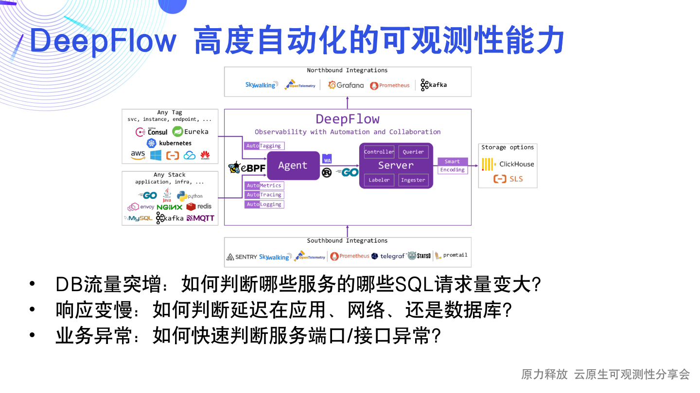

Rust 实现的 deepflow-agent 作为 frontend 采集数据，并与 K8s apiserver 同步资源和 Label 信息；Golang 实现的 deepflow-server 作为 backend 负责管理控制、负载均摊、存储查询。我们使用 MySQL 存储元数据，使用 ClickHouse 存储观测数据并支持扩展替换，使用 Grafana 展示观测数据。目前我们还有一个 Python 实现的 DeepFlow-app 进程用于提供分布式追踪的 API，后续将会使用 Golang 重写并逐步合并到 deepflow-server 中。deepflow-server 向上提供 SQL API，我们基于此开发了 Grafana 的 DeepFlow DataSource 和拓扑、分布式追踪等 Panel。deepflow-agent 可以运行在主机或 K8s 环境下，但 deepflow-server 必须运行在 K8s 中。

AutoTagging 能力。我们为 DeepFlow 的所有原生数据和集成数据都自动注入了大量的标签，使得数据关联不再有屏障、数据下钻不再有缺陷。这些标签来自云资源、K8s 资源、K8s 自定义 Label，至于和业务相关的动态标签，DeepFlow 也会以非常高效的方式完整的存储下来，支持检索和聚合。

DeepFlow 基于 BPF 的 AutoMetrics 能力可自动获取每一个微服务的 API 调用在应用函数、系统函数和网络通信等全栈路径上的黄金性能指标，并通过 BPF 和 AF_PACKET/winpcap 将这些能力扩展到更广泛的 Linux 内核版本及 Windows 操作系统。
目前，DeepFlow 已经通过 eBPF 支持了主流应用协议的解析，包括 HTTP 1/2/S、Dubbo、MySQL、Redis、Kafka、MQTT、DNS，未来还将扩展更多应用协议的支持。基于 DeepFlow 的 AutoMetrics 能力，能够零侵扰的获取应用的 RED（Request、Error、Delay）指标、网络协议栈的吞吐、时延、建连异常、重传、零窗等指标。DeepFlow Agent 会维护每个 TCP 连接、每个应用协议 Request 的会话状态，称之为 Flow。所有原始性能指标数据精细至 Flow 粒度，并额外自动聚合为 1s、1min 指标数据。基于这些指标数据，我们可呈现任意服务、工作负载、API 的全栈性能数据，并可绘制任意服务之间的调用关系拓扑图 —— Universal Service Map。

基于 eBPF，DeepFlow 创新的实现了零侵扰的分布式追踪。DeepFlow 将 eBPF Event、BPF Packet、Thread ID、Coroutine ID、Request 到达时序、TCP 发送时序进行关联，实现了高度自动化的分布式追踪（AutoTracing）。目前 AutoTracing 支持所有同步阻塞调用（BIO，Blocking IO）场景、部分同步非阻塞调用（NIO，Non-blocking IO）场景，支持内核线程调度（kernel-level threading (opens new window)）场景，在这些场景下支持对任意服务组成的分布式调用链进行追踪。除此之外，通过解析请求中的 X-Request-ID 等字段，也支持对采用 NIO 模式的网关（如 Envoy）前后的调用链进行追踪。

以及自动采集应用调用日志和流日志的 AutoLogging 技术等。

我平时经常活跃于社群里面，经常有社区同学给我反馈一些问题等，其中有小伙伴反馈说内部推荐都不知道那些点可以用来说，具体解决什么问题。不知道如何界定使用场景，这次站在解决问题这个角度，来看一下DeepFlow可以定位什么具体问题，怎么定位问题。

第一个场景，可能某天突然有个数据库节点负载、流量的告警发过来了，怎么快速定位到哪个服务请求数据库的流量变多，哪些SQL突然变多，然后下一步怎么去看上游服务的 api 调用情况:

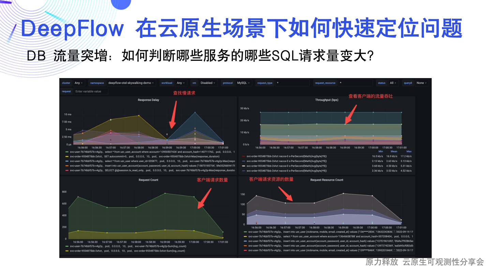

以往这类问题单纯从数据库的角度可能不太容易得到客户端分组精确的指标数据，但是现在有了DeepFlow就可以在看数据去定位问题：

这页PPT中的第一个 panel 可以看到慢查询的 SQL ，找到慢请求；

第二个 panel 可以看到和数据库有交互的服务请求数据库的流量大小，查找到请求流量较多的服务；

第三个 panel 可以看到和数据库有交互的服务请求数量，查找到请求数量较多的服务；

第四个 panel 可以看到和数据库请求 SQL 的 top 数据，查找较多的 SQL 的请求数量，进而快速找到对应的模块和相关研发；
然后切换协议到 ALL 或者 HTTP ，切换 workload 到上游服务，继续排查上游服务的情况：

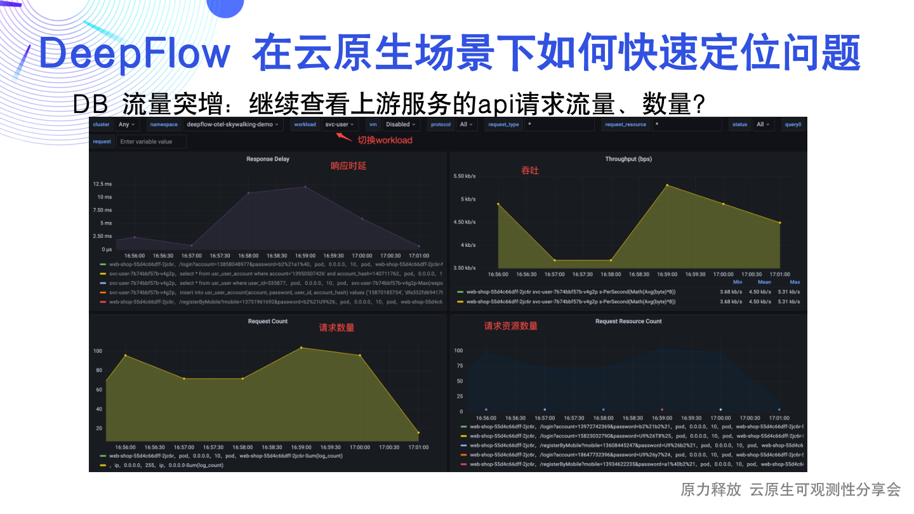

第二个场景，响应变慢：如何判断延迟在应用、网络、还是数据库：

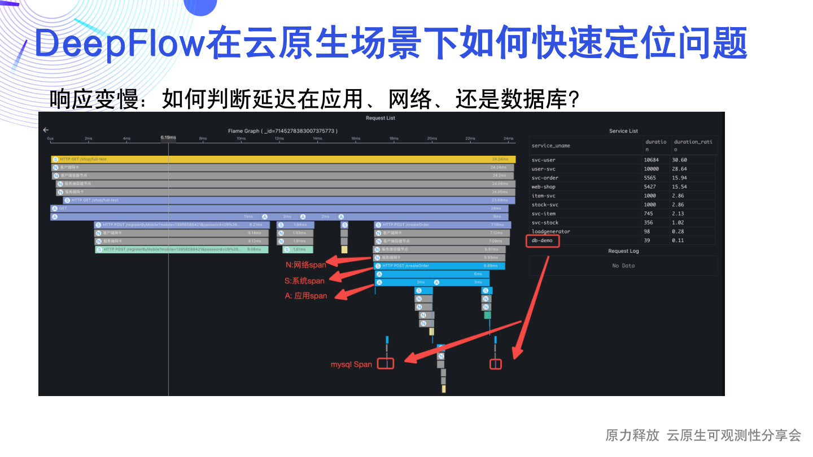

通过一个 trace ，查看 span 长度即可，图中 S 开头的是 eBPF 采集到的系统 span ， N 是网络 span ，A 是应用 span，最下面有两个很短的紫色的是数据库的系统 span。
我们在内核版本4.14+的环境中会自动开启 eBPF，不需要业务进行任何插码、重启等操作，即可开启这个能力。

第三个场景，业务异常：如何快速找到服务端口/接口异常：

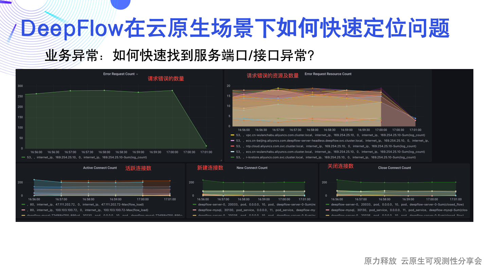

有同学反馈有些缓存等服务挂掉了，影响了业务的响应情况，但是又不影响业务运行，没有及时发现并响应这个问题，这个场景在 DeepFlow 中就可以通过一个统计错误响应的端口的 Dashboard ，并根据端口、Pod、vm等资源快速找到对应到节点及服务，排查端口挂掉原因，以及我们已经规划了6.1.4版本可以配置Grafana告警，也会内置一些告警策略，可以通过 Grafana 告警来等功能快速感知并响应问题。

可能会有同学问为什么我部署的 DeepFlow 中没有刚刚的 Dashboard ，我们目前发现了现有的 Grafana 在排障中的一些不足，我们也和 DeepFlow 的用户讨论了实际需求，正在整理相关的 Dashboard ，大家也可以自己构造自己的Dashboard，如果觉着不错也可以提交PR到 DeepFlow 下的 dahsboard 的 repo 中，分享给所有的 DeepFlow 用户。当然也欢迎给我们反馈你的痛点、场景，我们通过 Grafana 展示 出来 DeepFlow 的数据来解决大家的痛点。

# 0x1: DeepFlow 一键开启 Kube-OVN 的可观测性

上面简单聊了一下 DeepFlow 在几个场景中如何排查问题，进入今天的主题 DeepFlow + Kube-OVN 一键可观测：

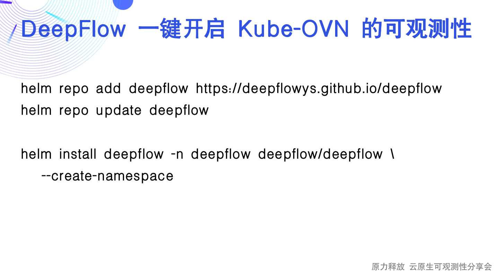

正如同PPT中看到的这样，简单三条命令就可以将 DeepFlow 部署在 Kube-OVN 的集群中，观测你K8s集群上所有数据的同时又不需要业务进行任何改动、任何重启
同时我们还支持接入多集群 agent ，接入云主机、传统服务器的 agent ，接入 Prometheus 、Telegraf 的 Metrics数据，以及可以通过 otel-collector 接入符合 OpenTelemetry 协议的 trace 数据、Skywalking 的trace 数据等等，对这些数据通过 AutoTagging 能力统一打上 DeepFlow 的 label ，和 DeepFlow 的资源关联起来，打通数据孤岛。

安装完 DeepFlow 之后，会默认内置一些 Dashboard ，这里简单介绍一下这几个 Dashboard ：

- 网络可观测
  - Node/Pod 的流量拓扑
  - Node/Pod 流日志
- 应用可观测
  - 服务性能总览
  - 微服务调用拓扑
  - 服务调用日志
  - 调用链追踪 (Distributed Tracing)

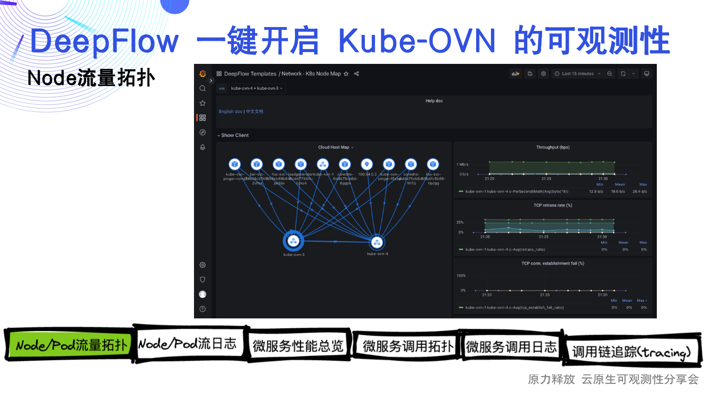

这一个是我们的 Node 流量拓扑，可以清晰的展示出来 Node 之间、Node 和 Pod 的流量关系，以及右侧的吞吐、重传比例 建联失败比例等指标

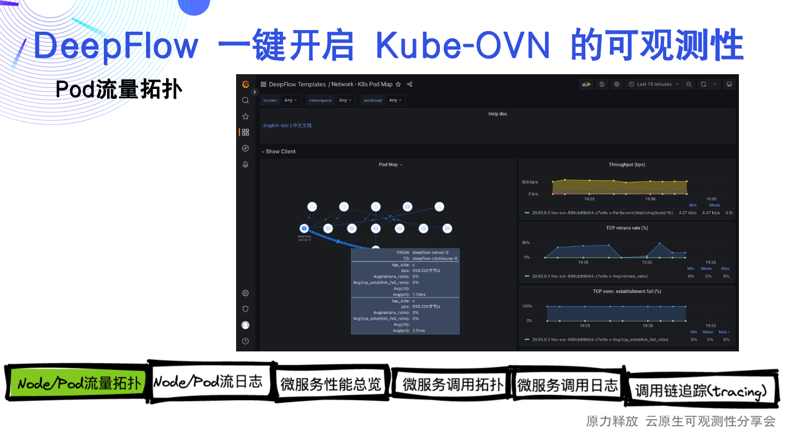

第二个是我们的 Pod 流量拓扑，可以清晰的展示出来 Pod 之间的流量关系，以及右侧的吞吐、重传 建联失败等指标

把鼠标放到两个 Pod 的连线上可以看到两个 Pod 之间的指标，比如可以通过 tap_side 看出采集位置是在客户端和服务端、pps 、重传、建连失败、延迟等指标

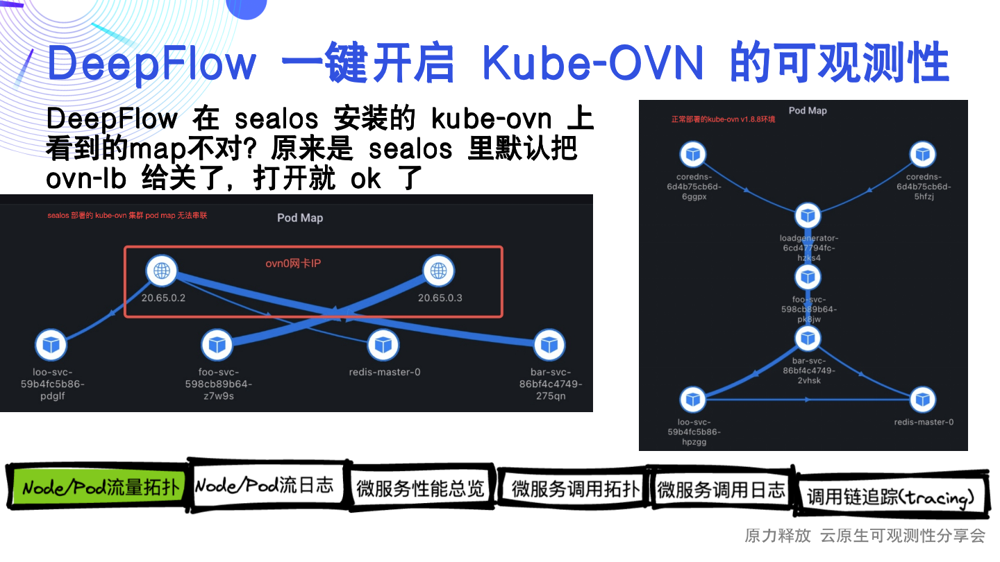

这里有个小插曲，我上周在做这篇PPT的时候，使用 sealos 一键拉起了一个 Kube-OVN、DeepFlow 的环境，但是发现 Pod 的拓扑图没有连接起来，左侧是异常的拓扑图，右侧是使用Kube-OVN官网脚本部署的 Kube-OVN1.8.8 版本的正常数据，稍微看一下发现所有跨节点的流量在拓扑图里展示的都是客户端节点 ovn0 网卡的 IP，而不是客户端 Pod IP，怀疑是解封装的时候源IP有了问题，梦馨反馈是 sealos 的部署脚本里默认把 ovn-lb 给关了，svc 路径上的处理有的地方被 NAT 了，把 kube-ovn-controller 里的 enable-lb 改成 true 应该就行了，这里也致敬一下 sealos，基于 sealos 的集群镜像功能，可以一键拉起一个部署好 Kube-OVN、DeepFlow、Helm 等应用、工具的 K8s 集群，节省了大量的时间和精力。

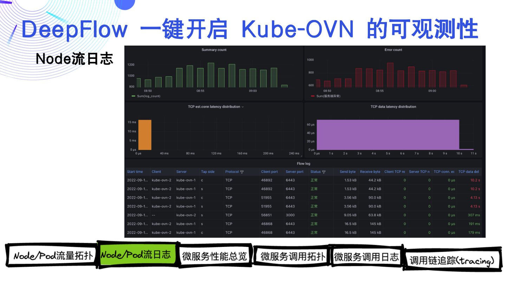

这一个是我们的 Node 流日志，可以看到 Node 之间的每个流的情况，所谓流日志是捕获特定位置的流量，将流量转化为流日志记录下来，流日志是记录捕获特定时间窗口的特定五元组的网络流。

这个 Dashboard 以 Node 维度看流日志总量、错误数量、TCP 建连时延、传输时延等情况，以及每一个流的开始时间、客户端、服务端、流量采集位置、协议、客户端口、服务端口、状态、发送、接收流量大小、客户端、服务端重传、TCP 建连、传输时延等数据。

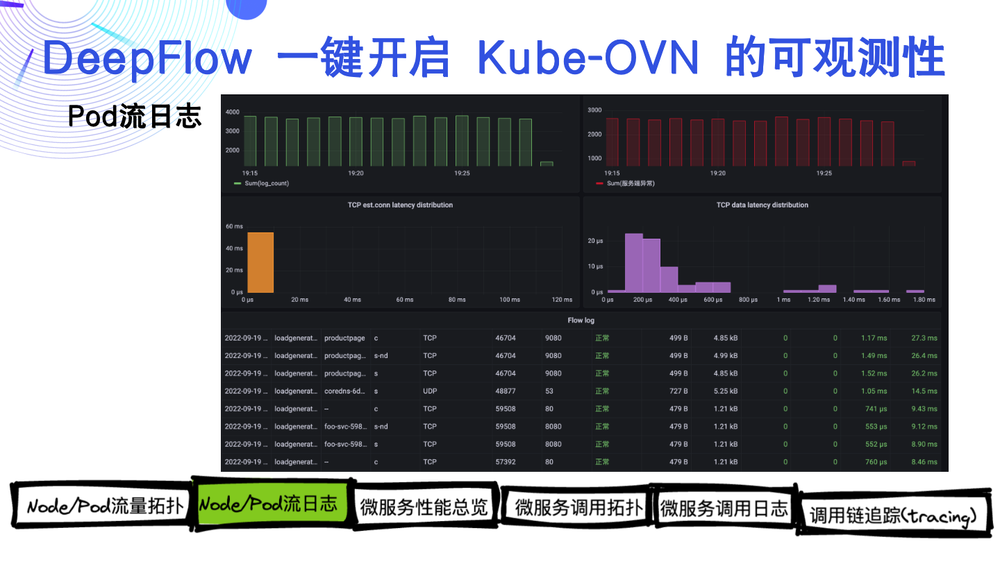

这个 Dashboard 以 Pod 维度以看流日志总量、错误数量、TCP 建连时延、传输时延等情况，以及每一个流的开始时间、客户端、服务端、流量采集位置、协议、客户端口、服务端口、状态、发送、接收流量大小、客户端、服务端重传、TCP建连、传输时延等数据。

前面的 Dashboard 是在网络层面的统计数据，后面几个是在应用层面的统计数据:

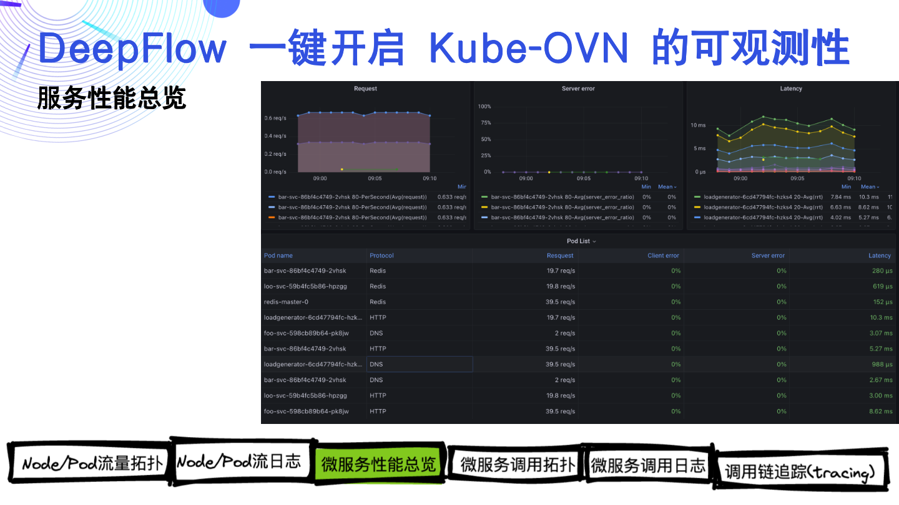

微服务性能总览：上面是有发送的请求数量、错误数量及延迟等，以及 Pod 维度的 协议分组的请求数量、客户端错误比例、服务端错误比例及延迟等:

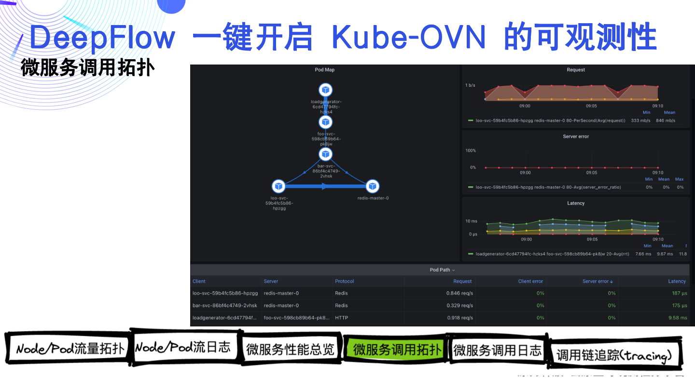

微服务调用拓扑，和前面 Pod 流量拓扑有什么不同呢，前面的 Pod map 是基于4层流量画出来的拓扑，这个是基于7层请求的流量画出来的，拓扑、请求、错误延迟等指标、以及区分客户端、服务端的请求、错误、延迟的指标数据：

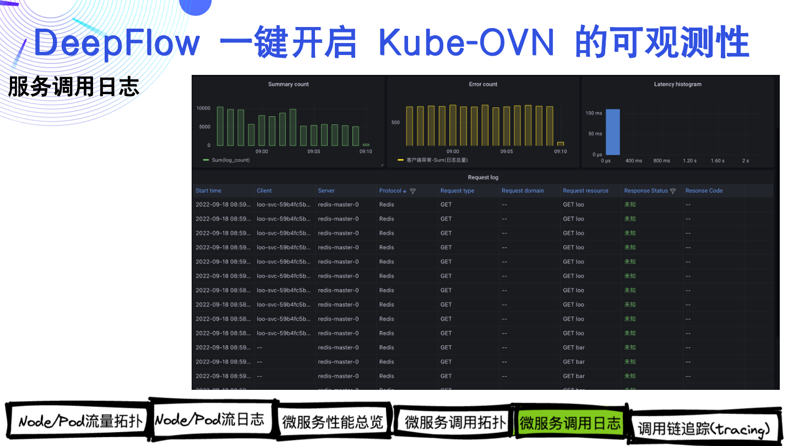

服务调用日志，
上面有7层请求的总量、错误数量、延迟等指标
下面可以看到每一个应用调用的开始时间、客户端、服务端、对应的协议、方法、请求域名、请求资源、状态、响应码等数据

这个就是我们的一个基于 eBPF 的 AutoTracing 能力，内核大于4.14+ 不需要业务进行任何改动即可开启这个能力：

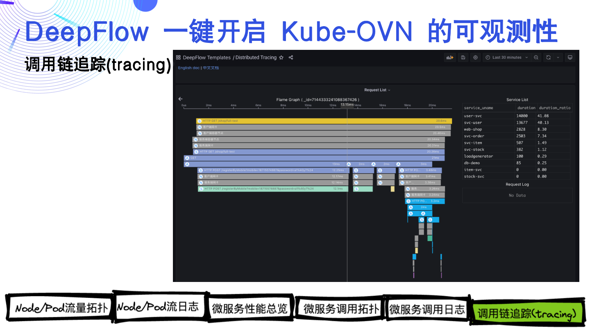

以上所有的截图都是在Kube-OVN的环境中截的，安装DeepFlow后几分钟就能看到上面说的所有数据。

# 0x2: DeepFlow 对 Kube-OVN 的实际应用

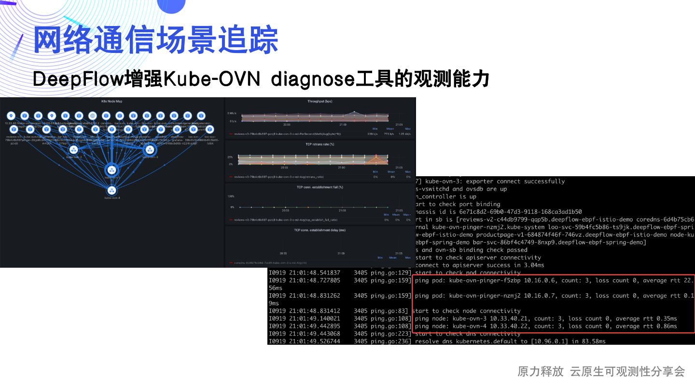

diagnose 作为 Kube-OVN 的网络组件状态检查工具，可以一键检测 Kube-OVN 组件的状态、本节点、跨节点的关键服务的连通性和网络延迟情况等，可以快速获得检测数据，定位系统问题。

DeepFlow 的定位是一个云原生无侵入的可观测平台，可以大幅增强 Kube-OVN 环境的可观测能力，通过丰富的数据可以画出任何想要的 Dashboard，比如前面讲到的接口/SQL调用时延趋势图及端口的错误请求数量趋势图等，可以快速看到有问题的服务、端口、接口等，帮助快速定位到相关有问题的服务/模块，甚至可以通过 Grafana 进行告警，在出现问题的第一时间进行响应，减小损失。也可以观察整个集群/服务的当前状态，统计一个时间段内的服务响应情况等：

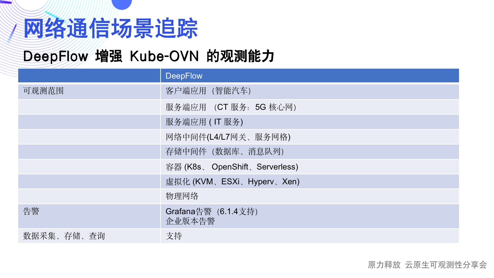

流量采集位置：我们默认会在容器节点的物理网卡及容器内 eth0 网卡在节点的 veth-peer 网卡上采集cBPF流量，通过 eBPF 采集进程 span 信息，Kube-OVN 的默认容器网卡名称为 containerID_h 
，并对流量进行关联节点、Pod 等资源，那么这个图是在同子网跨节点场景的一个架构图，实际上在跨 VPC、双栈等场景采集方式都是一样的，并没有任何区别。

隧道解封装：DeepFlow 会查看所有包是否有封装，一旦看到有封装，就会进行解封装操作，目前默认开启了vxlan和IPIP隧道等解封装，也就是在容器节点的 eth0 网卡上的 Pod 流量是经过了封装的，不过我们会自动解开，并获取解封装后的流量源 IP、目标 IP 等数据关联客户端服务端的 Pod 等资源。
Kube-OVN 的 geneve 隧道如果大家用的比较多，也可以反馈给我们，我们支持一下这个协议的隧道解析.

跨 Node 流量如何关联：我们的 deepflow-agent 以 daemonset 部署在所有节点上,我们通过五元组等信息可以判断到跨 Node 的同一个流，并统计在每个流量采集位置的网络吞吐到性能，再到时延多个维度的指标量。

流量关联 Pod、Node 等资源：agent 会 watch K8s 集群的资源，获取 NodeIP、mac、deployment、svc、Pod 等信息,并上报给 server，通过 AutoTagging 能力对 agent 采集到的流量进行关联对应的资源，在 Grafana 上看到的流量就不是枯燥的 IP MAC 等信息了，而是 Pod、Node 等资源：

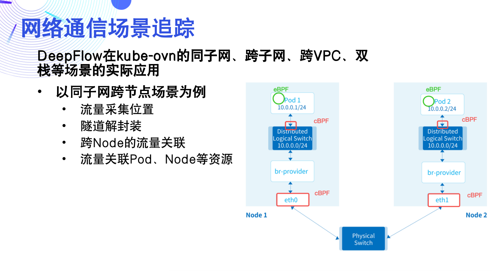

NetworkPolicy 为 Kubernetes 提供的网络策略接口，Kube-OVN 通过 OVN 的 ACL 进行了实现。 使用了 NetworkPolicy 后如果出现网络不通的情况，难以判断是网络故障问题还是 NetworkPolicy 规则设置问题导致的网络中断。 Kube-OVN 提供了 NetworkPolicy 日志功能，帮助管理员快速定位 NetworkPolicy drop 规则是否命中，并记录有哪些非法访问。

NetworkPolicy 日志功能一旦开启，对每个命中 drop 规则的数据包都需要打印日志，会带来额外性能开销。 

而DeepFlow虽然目前无法判断流量是被 drop 了还是网络问题，但是从 DeepFlow 的多个维度以及熟悉 K8s networkpolicy 功能的同学还是能大概判断出流量是被 networkpolicy drop 掉了，DeepFlow也规划了流状态的功能。

Kube-OVN 可以的流日志基本判断出流量是被 drop 了还是网络故障，让我想起了之前遇到的场景，研发反馈一个开发环境的一个 Namespace 下的 Pod 突然 Ping 不通了，接到问题后和研发一起开始排查，发现 Node 和除这个 Namespace 下的 Pod 网络都是通的，但是又无法解释为啥从 Node Ping 这个 NS 下的 Pod 网络不通了，然后突然发现我们容器云产品页面上的网络策略功能被打开了，这个功能藏的有些深，一般不去看这个地方，后来确认是产品不熟悉这个功能，就点了一下，但没有及时关闭导致的，现在回头想一下，如果当时有 Kube-OVN 的 networkpolicy 日志功能或者 DeepFlow ，可能10分钟就能知道流量是被网络策略给 drop 掉了：

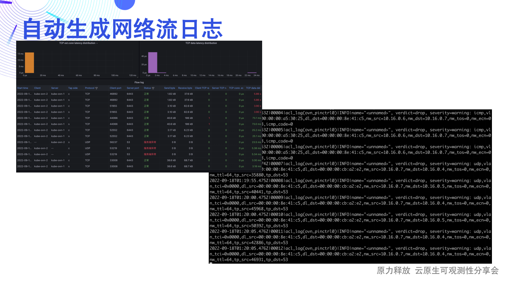

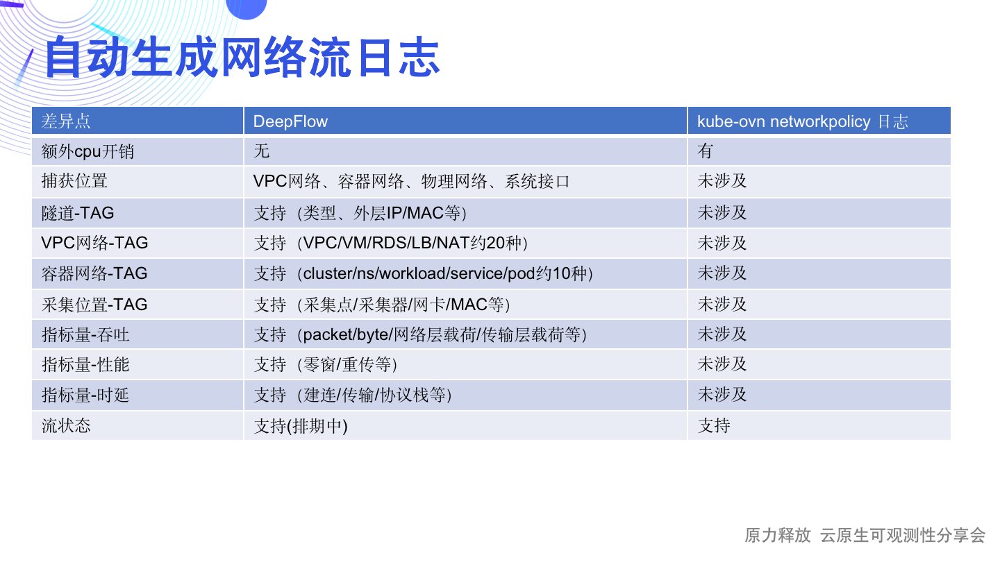

DeepFlow对后端分析工具更友好，当然这个功能只在我们企业版本中有，下面是我们 DeepFlow 在流量分发功能上对 Kube-OVN的增强：

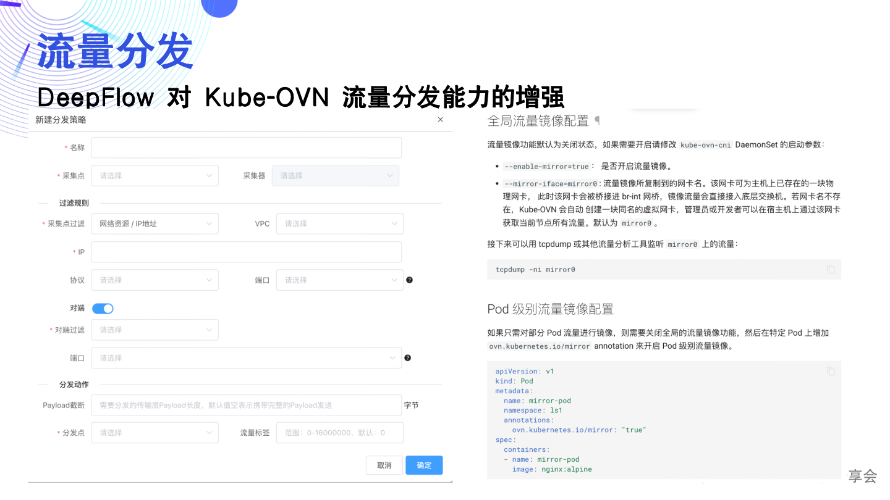

1. **面向业务的流量过滤**：用户可设置源端地址、端口号、目的端地址、端口号、协议五元组作为过滤条件，并支持直接输入VPC、子网、云服务器、容器 Pod、自定义资源组等替代IP地址，精准过滤虚拟网络中的流量，最大利用网络带宽和分析工具效率。

2. **源端 Payload 截断**：用户可设置对网包的 L4 Payload 长度进行截断，最大利用网络带宽和分析工具效率。

3. **多层流量标签**：分发流量利用隧道封装发送，通过在隧道头中携带特殊的流量标签，用于对不同 VPC 、容器服务、流量采集位置（客户端/服务端）等流量属性进行标记，以帮助后端分析工具解决 VPC 之间 IP 段冲突、容器服务后端 Pod 的 IP 地址频繁变动等问题，并实现对客户端、服务端采集流量进行端到端对比分析。
采集器支持在原始包之前添加 VXLAN 或 ERSPAN 隧道及内层 VLAN 标签，后端汇聚分流设备或 TAP 交换机仅需要做一次性的隧道解封装配置，无需根据不同的隧道标签解封装报文的 VLAN 标签，极大简化分流设备/TAP 交换机的配置复杂度和特性依赖。

4. **流量全局去重**：对于同一个网包，采集器会在源端云服务器及目的端云服务器处多次采集到。当发往同一个分发点时，如果不做去重，后端分析工具将收到重复的网包，同时也会占用至少双倍的带宽。DeepFlow 引入分布式去重功能解决重复采集的问题，具体原理可查看场景介绍。
为了最大限度减少对带宽的占用，对发往同一个分发点、设置相同隧道标签的同一个网包，按所有匹配策略的最大Payloady截取长度进行截取。例如两条分发策略 A=Payload截断30、B=Payload 截断20，对于同时匹配这两条策略的网包将会被截取30字节 Payload 后进行发送。

5. **流量多路分发**：当一个网包匹配的多条分发策略对应不同分发点或不同隧道标签时，流量将会复制多份分别发送。例如两条策略 A=分发点 C1、B=分发点 C2，对于同时匹配这两条策略的网包，在分发时复制两份，一份分发给 C1，一份分发给 C2。

6. **资源变更感知**：当云服务器迁移、云服务器IP变更、容器Pod弹性伸缩时，分发策略自动感知，无需用户重新设置，迁移期间的流量持续分发。

# 0x3: 什么是 DeepFlow

[DeepFlow](https://github.com/DeepFlowys/DeepFlow) 是一款开源的高度自动化的可观测性平台，是为云原生应用开发者建设可观测性能力而量身打造的全栈、全链路、高性能数据引擎。DeepFlow 使用 eBPF、WASM、OpenTelemetry 等新技术，创新的实现了 AutoTracing、AutoMetrics、AutoTagging、SmartEncoding 等核心机制，帮助开发者提升埋点插码的自动化水平，降低可观测性平台的运维复杂度。利用 DeepFlow 的可编程能力和开放接口，开发者可以快速将其融入到自己的可观测性技术栈中。

GitHub 地址：https://github.com/DeepFlowys/DeepFlow

访问 [DeepFlow Online Demo](https://ce-demo.DeepFlow.yunshan.net/)，体验高度自动化的可观测性新时代。
