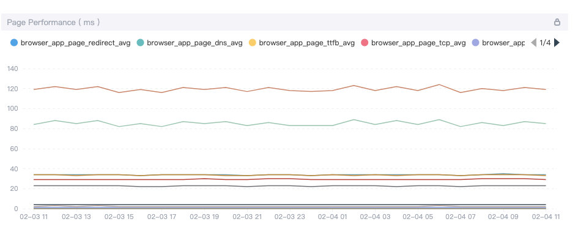

网络应用性能会影响用户的留存率。如果页面加载时间过长，用户就会放弃。所以我们需要监控 Web 应用来了解性能，确保服务稳定、可用、健康。[Apache SkyWalking](https://github.com/apache/skywalking) 是一款专门为云原生和基于容器架构设计的应用性能监控（APM）工具。其 [skywalking-client-js](https://github.com/apache/skywalking-client-js) 是一个轻量级的客户端 JavaScript 异常、性能和追踪库。

本文介绍了 skywalking-client-js 如何将其监控扩展到浏览器，为 SkyWalking 后端提供性能指标和错误收集。

## 性能指标

skywalking-client-js 使用 [window.performance](https://developer.mozilla.org/en-US/docs/Web/API/Window/performance) 来收集性能数据。从 MDN 文档来看，性能接口提供了对当前页面的性能相关信息的访问。它是 High Resolution Time API 的一部分，但对 [Performance Timeline API](https://developer.mozilla.org/en-US/docs/Web/API/Performance_Timeline)、[Navigation Timing API](https://developer.mozilla.org/en-US/docs/Web/API/Navigation_timing_API)、[User Timing API](https://developer.mozilla.org/en-US/docs/Web/API/User_Timing_API) 和 [Resource Timing API](https://developer.mozilla.org/en-US/docs/Web/API/Resource_Timing_API) 有所增强。

在 skywalking-client-js 中，所有的性能指标都是根据 W3C 规范中定义的 [Navigation Timing API](https://www.w3.org/TR/navigation-timing/?spm=a2c4g.11186623.2.12.2f495c7cmRef8Q#sec-navigation-timing-interface) 来计算的。我们可以使用 window.performance.timing 属性获得一个描述页面的 PerformanceTiming 对象。PerformanceTiming 接口包含的属性提供了当前页面加载和使用过程中发生的各种事件的性能计时信息。

我们把这些属性放在一起看，可以更好地理解 [W3C](https://www.w3.org/TR/navigation-timing/?spm=a2c4g.11186623.2.14.2f495c7cmRef8Q#processing-model) 的下图。

下表包含了 skywalking-client-js 的性能指标。

| Metrics 名称    | 描述                           | 计算公式                                                     | 备注                                                         |
| :-------------- | :----------------------------- | :----------------------------------------------------------- | :----------------------------------------------------------- |
| redirectTime    | Page redirection time          | redirectEnd – redirectStart                                  | If the current document and the document that is redirected to are not from the same [origin](http://tools.ietf.org/html/rfc6454), set redirectStart, redirectEnd to 0 |
| ttfbTime        | Time to First Byte             | responseStart – requestStart                                 | According to [Google Development](https://developers.google.com/web/tools/chrome-devtools/network/reference?spm=a2c4g.11186623.2.16.2f495c7cmRef8Q#timing) |
| dnsTime         | Time to DNS query              | domainLookupEnd – domainLookupStart                          |                                                              |
| tcpTime         | Time to TCP link               | connectEnd – connectStart                                    |                                                              |
| transTime       | Time to content transfer       | responseEnd – responseStart                                  |                                                              |
| sslTime         | Time to SSL secure connection  | connectEnd – secureConnectionStart                           | Only supports HTTPS                                          |
| resTime         | Time to resource loading       | loadEventStart – domContentLoadedEventEnd                    | Represents a synchronized load resource in pages             |
| fmpTime         | Time to First Meaningful Paint | Listen for changes in page elements. Traverse each new element, and calculate the total score of these elements. If the element is visible, the score is 1 * weight; if the element is not visible, the score is 0 |                                                              |
| domAnalysisTime | Time to DOM analysis           | domInteractive – responseEnd                                 |                                                              |
| fptTime         | First Paint Time               | responseEnd – fetchStart                                     |                                                              |
| domReadyTime    | Time to DOM ready              | domContentLoadedEventEnd – fetchStart                        |                                                              |
| loadPageTime    | Page full load time            | loadEventStart – fetchStart                                  |                                                              |
| ttlTime         | Time to interact               | domInteractive – fetchStart                                  |                                                              |
| firstPackTime   | Time to first package          | responseStart – domainLookupStart                            |                                                              |

skywalking-client-js 收集这些性能指标，并发送给 [OAP（Observability Analysis Platform）服务器](https://skywalking.apache.org/docs/main/latest/en/concepts-and-designs/backend-overview/)，服务器在后台汇总数据，然后在 UI 端以可视化的方式展示出来。用户可以根据这些数据来优化页面。

## 异常指标

在 skywalking-client-js 中可以捕捉到五种错误：

1. `window.addeventlistener ('error ', callback, true)` 捕捉资源加载错误。
2. `window.onerror` 抓取 JS 执行错误。
3. `window.addEventListener ('unhandledrejection', callback)` 用来捕捉Promise错误。
4. Vue 错误由 `Vue.config.errorHandler` 捕获。
5. Ajax 错误由 `addEventListener ('error'，callback);addEventListener ('abort'，callback);addEventListener ('timeout'，callback);` 在 send callback 中捕获。

skywalking-client-js 将错误数据追踪到 OAP 服务器，最后在 UI 端将数据可视化呈现。对于 App 的错误概况，有几个指标可以进行基本的统计和错误的趋势，包括以下指标：

- App Error Count，选定时间段内的错误总数。
- App JS 错误率，选定时间段内有 JS 错误的 PV 占总 PV 的比例。
- All of Apps Error Count，Top N Apps 错误数排名。
- All of Apps JS Error Rate，前 N 个 Apps JS 错误率排名。
- 所选 App 中的版本错误数，所选 App 中的版本错误数排名前 N 名。
- 所选 App 中的版本错误率，所选 App 中的版本错误率排名前 N 名 JS 错误率排名。
- 所选 App 的出错率，所选 App 的出错率排名前 N 名。
- 所选 App 的错误率，所选 App 排名的前 N 个 JS 错误率。

对于页面，我们使用多个指标进行基本统计和错误趋势，包括以下指标。

- Top Unstable Pages / Error Rate, Top N Error Count pages of the Selected version ranking.
- Top Unstable Pages / Error Count，Top N Error Count 页面的 Selected 版本排名。
- 页面错误数布局，一段时间内不同错误的数据显示。

## 用户指标

SkyWalking 浏览器监控还提供了访客使用被监控网站的指标，如 PV（页面浏览量）、UV（独立访客）、前 N 名 PV（页面浏览量）等。

在 SPA（单页应用）中，页面只会被刷新一次。传统方法只在页面加载后报告一次 PV，但无法统计每个子页面的 PV，也无法使其他类型的日志按子页面进行汇总。

SkyWalking 浏览器监控针对 SPA 页面提供了两种处理方式。

1. 启用 SPA 自动解析。该方法适用于大多数以 URL 哈希为路由的单页应用场景。在初始化配置项中，将 enableSPA 设置为 true，将开启页面的哈希变化事件监听器（触发重报 PV），在其他数据报送中使用 URL 哈希作为页面字段。
2. 手动上报。如果第一种方法无法使用，该方法可以用于所有单页应用场景。下面的例子提供了一个设置页面的方法，当数据上报时，可以手动更新页面名称。调用此方法时，页面 PV 将被默认重新上报：<https://gist.github.com/Fine0830/53d36508671882e210d7fca861555ce9。>

让我们来看看下图中的结果。它显示了最受欢迎的应用和版本，以及一段时间内 PV 的变化。

让浏览器成为分布式追踪的起点。

SkyWalking 浏览器监控拦截 HTTP 请求，追踪段（Segment）和跨度（Span）。它支持追踪以下模式的 HTTP 请求。[XMLHttpRequest](https://developer.mozilla.org/en-US/docs/Web/API/XMLHttpRequest) 和 [fetch.](https://developer.mozilla.org/en-US/docs/Web/API/Fetch_API)。它还支持追踪基于 XMLHttpRequest 和 fetch 的库和工具 —— 如 [Axios](https://github.com/axios/axios)、[SuperAgent](https://github.com/visionmedia/superagent)、[OpenApi](https://www.openapis.org/) 等。

我们来看看 SkyWalking 浏览器监控是如何拦截 HTTP 请求的。

之后，使用 `window.addEventListener ('xhrReadyStateChange', callback)`，在请求头中设置sw8=xxxx。同时，向后端报告请求信息。最后，我们可以在追踪页面上查看追踪数据。下图展示的追踪页面。

为了了解我们是如何监听 fetch 请求的，我们来看看 [fetch](https://github.com/github/fetch/blob/90fb680c1f50181782f276122c1b1115535b1603/fetch.js#L506) 的源码。

如你所见，它创建了一个 Promise 和一个新的 XMLHttpRequest 对象。由于 fetch 的代码是内置在浏览器中的，它必须先监控代码执行。因此，当我们添加监听事件时，我们无法监控 fetch 中的代码。只是在监控完代码执行后，我们重写一下 fetch： `import {fetch} from 'whatwg-fetch'; window.fetch = fetch;` 这样，我们就可以通过上面的方法拦截 fetch 请求了。

## 其他资源

从 [官方网站](https://skywalking.apache.org/)、Tetrate [博客](https://www.tetrate.io/blog/category/open-source/apache-skywalking/) 以及可免费下载的 [电子书](https://www.tetrate.io/apache-skywalking-ebook-tetrate/) 中阅读更多关于 SKyWalking 的内容。

